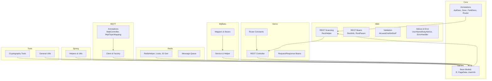
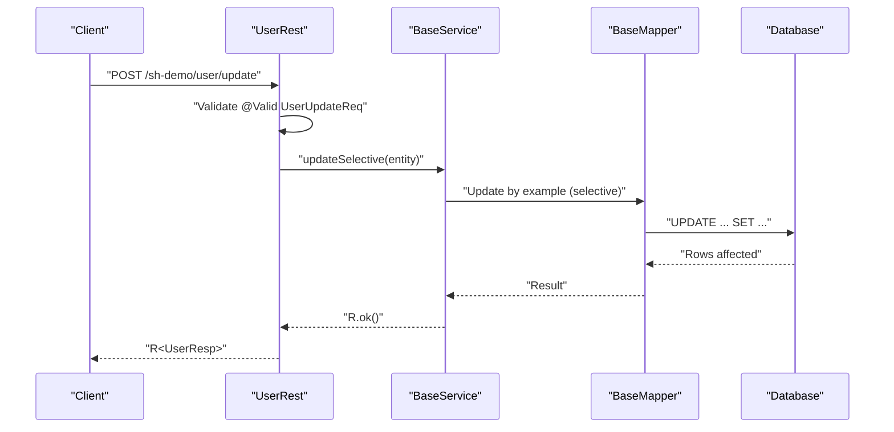
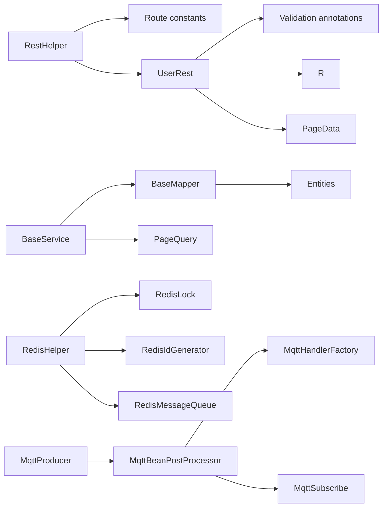

# API Reference

<cite>
**Referenced Files in This Document**
- [ApiDesc.java](file://sh-core/src/main/java/com/wkclz/core/annotation/ApiDesc.java)
- [Desc.java](file://sh-core/src/main/java/com/wkclz/core/annotation/Desc.java)
- [FieldDesc.java](file://sh-core/src/main/java/com/wkclz/core/annotation/FieldDesc.java)
- [Router.java](file://sh-core/src/main/java/com/wkclz/core/annotation/Router.java)
- [UserInfo.java](file://sh-core/src/main/java/com/wkclz/core/base/UserInfo.java)
- [PageData.java](file://sh-core/src/main/java/com/wkclz/core/base/PageData.java)
- [R.java](file://sh-core/src/main/java/com/wkclz/core/base/R.java)
- [RestHelper.java](file://sh-web/src/main/java/com/wkclz/web/helper/RestHelper.java)
- [RestInfo.java](file://sh-web/src/main/java/com/wkclz/web/bean/RestInfo.java)
- [RestParam.java](file://sh-web/src/main/java/com/wkclz/web/bean/RestParam.java)
- [AtLeastOneNotNull.java](file://sh-web/src/main/java/com/wkclz/web/annotation/AtLeastOneNotNull.java)
- [AtLeastOneNotNullValidator.java](file://sh-web/src/main/java/com/wkclz/web/annotation/validator/AtLeastOneNotNullValidator.java)
- [ErrorHandler.java](file://sh-web/src/main/java/com/wkclz/web/rest/ErrorHandler.java)
- [UserNameBodyAdvice.java](file://sh-web/src/main/java/com/wkclz/web/rest/UserNameBodyAdvice.java)
- [Route.java](file://sh-demo/src/main/java/com/wkclz/demo/rest/Route.java)
- [UserRest.java](file://sh-demo/src/main/java/com/wkclz/demo/rest/UserRest.java)
- [UserCreateReq.java](file://sh-demo/src/main/java/com/wkclz/demo/bean/vo/user/UserCreateReq.java)
- [UserUpdateReq.java](file://sh-demo/src/main/java/com/wkclz/demo/bean/vo/user/UserUpdateReq.java)
- [UserPageReq.java](file://sh-demo/src/main/java/com/wkclz/demo/bean/vo/user/UserPageReq.java)
- [UserResp.java](file://sh-demo/src/main/java/com/wkclz/demo/bean/vo/user/UserResp.java)
- [UserPageResp.java](file://sh-demo/src/main/java/com/wkclz/demo/bean/vo/user/UserPageResp.java)
- [BaseEntity.java](file://sh-demo/src/main/java/com/wkclz/demo/bean/entity/User.java)
- [BaseMapper.java](file://sh-mybatis/src/main/java/com/wkclz/mybatis/mapper/BaseMapper.java)
- [TableInfoMapper.java](file://sh-mybatis/src/main/java/com/wkclz/mybatis/mapper/TableInfoMapper.java)
- [TableInfoService.java](file://sh-mybatis/src/main/java/com/wkclz/mybatis/service/TableInfoService.java)
- [TableInfo.java](file://sh-mybatis/src/main/java/com/wkclz/mybatis/bean/TableInfo.java)
- [ColumnInfo.java](file://sh-mybatis/src/main/java/com/wkclz/mybatis/bean/ColumnInfo.java)
- [IndexInfo.java](file://sh-mybatis/src/main/java/com/wkclz/mybatis/bean/IndexInfo.java)
- [ColumnQuery.java](file://sh-mybatis/src/main/java/com/wkclz/mybatis/bean/ColumnQuery.java)
- [PageQuery.java](file://sh-mybatis/src/main/java/com/wkclz/mybatis/helper/PageQuery.java)
- [BaseService.java](file://sh-mybatis/src/main/java/com/wkclz/mybatis/service/BaseService.java)
- [RedisHelper.java](file://sh-redis/src/main/java/com/wkclz/redis/helper/RedisHelper.java)
- [RedisLock.java](file://sh-redis/src/main/java/com/wkclz/redis/helper/RedisLock.java)
- [RedisIdGenerator.java](file://sh-redis/src/main/java/com/wkclz/redis/helper/RedisIdGenerator.java)
- [LockHolder.java](file://sh-redis/src/main/java/com/wkclz/redis/helper/LockHolder.java)
- [RedisMessageQueue.java](file://sh-redis/src/main/java/com/wkclz/redis/queue/RedisMessageQueue.java)
- [RedisMessageQueueImpl.java](file://sh-redis/src/main/java/com/wkclz/redis/queue/RedisMessageQueueImpl.java)
- [RedisMessageQueueManager.java](file://sh-redis/src/main/java/com/wkclz/redis/queue/RedisMessageQueueManager.java)
- [MessageListener.java](file://sh-redis/src/main/java/com/wkclz/redis/queue/MessageListener.java)
- [MqttController.java](file://sh-mqtt/src/main/java/com/wkclz/mqtt/annotation/MqttController.java)
- [MqttTopicMapping.java](file://sh-mqtt/src/main/java/com/wkclz/mqtt/annotation/MqttTopicMapping.java)
- [MqttProducer.java](file://sh-mqtt/src/main/java/com/wkclz/mqtt/client/MqttProducer.java)
- [MqttHandlerFactory.java](file://sh-mqtt/src/main/java/com/wkclz/mqtt/handler/MqttHandlerFactory.java)
- [MqttSubscribe.java](file://sh-mqtt/src/main/java/com/wkclz/mqtt/config/MqttSubscribe.java)
- [MqttBeanPostProcessor.java](file://sh-mqtt/src/main/java/com/wkclz/mqtt/config/MqttBeanPostProcessor.java)
- [MqttHexMsg.java](file://sh-mqtt/src/main/java/com/wkclz/mqtt/bean/MqttHexMsg.java)
- [Qos.java](file://sh-mqtt/src/main/java/com/wkclz/mqtt/enums/Qos.java)
- [MqttMessage.java](file://sh-mqtt/src/main/java/com/wkclz/mqtt/remote/MqttMessage.java)
- [MqttResponse.java](file://sh-mqtt/src/main/java/com/wkclz/mqtt/remote/MqttResponse.java)
- [SnowflakeHelper.java](file://sh-spring/src/main/java/com/wkclz/spring/helper/SnowflakeHelper.java)
- [SpringContextHolder.java](file://sh-spring/src/main/java/com/wkclz/spring/config/SpringContextHolder.java)
- [SensitiveConfigDecryptor.java](file://sh-spring/src/main/java/com/wkclz/spring/config/SensitiveConfigDecryptor.java)
- [SensitiveConfigEncryptor.java](file://sh-spring/src/main/java/com/wkclz/spring/config/SensitiveConfigEncryptor.java)
- [MailUtil.java](file://sh-spring/src/main/java/com/wkclz/spring/utils/MailUtil.java)
- [FreeMarkerTemplateUtil.java](file://sh-spring/src/main/java/com/wkclz/spring/utils/FreeMarkerTemplateUtil.java)
- [AesTool.java](file://sh-tool/src/main/java/com/wkclz/tool/tools/AesTool.java)
- [Md5Tool.java](file://sh-tool/src/main/java/com/wkclz/tool/tools/Md5Tool.java)
- [RsaTool.java](file://sh-tool/src/main/java/com/wkclz/tool/tools/RsaTool.java)
- [Base64Tool.java](file://sh-tool/src/main/java/com/wkclz/tool/tools/Base64Tool.java)
- [DesTool.java](file://sh-tool/src/main/java/com/wkclz/tool/tools/DesTool.java)
- [ShaTool.java](file://sh-tool/src/main/java/com/wkclz/tool/tools/ShaTool.java)
- [AreaUtil.java](file://sh-tool/src/main/java/com/wkclz/tool/utils/AreaUtil.java)
- [BeanUtil.java](file://sh-tool/src/main/java/com/wkclz/tool/utils/BeanUtil.java)
- [CheckPwdUtil.java](file://sh-tool/src/main/java/com/wkclz/tool/utils/CheckPwdUtil.java)
- [ClassUtil.java](file://sh-tool/src/main/java/com/wkclz/tool/utils/ClassUtil.java)
- [CompressUtil.java](file://sh-tool/src/main/java/com/wkclz/tool/utils/CompressUtil.java)
- [DateUtil.java](file://sh-tool/src/main/java/com/wkclz/tool/utils/DateUtil.java)
- [EnumUtil.java](file://sh-tool/src/main/java/com/wkclz/tool/utils/EnumUtil.java)
- [FileUtil.java](file://sh-tool/src/main/java/com/wkclz/tool/utils/FileUtil.java)
- [IntegerUtil.java](file://sh-tool/src/main/java/com/wkclz/tool/utils/IntegerUtil.java)
- [JsUtil.java](file://sh-tool/src/main/java/com/wkclz/tool/utils/JsUtil.java)
- [JsonUtil.java](file://sh-tool/src/main/java/com/wkclz/tool/utils/JsonUtil.java)
- [MapUtil.java](file://sh-tool/src/main/java/com/wkclz/tool/utils/MapUtil.java)
- [NetworkUtil.java](file://sh-tool/src/main/java/com/wkclz/tool/utils/NetworkUtil.java)
- [PropertiesUtil.java](file://sh-tool/src/main/java/com/wkclz/tool/utils/PropertiesUtil.java)
- [QrCodeUtil.java](file://sh-tool/src/main/java/com/wkclz/tool/utils/QrCodeUtil.java)
- [SecretUtil.java](file://sh-tool/src/main/java/com/wkclz/tool/utils/SecretUtil.java)
- [ServerStateUtil.java](file://sh-tool/src/main/java/com/wkclz/tool/utils/ServerStateUtil.java)
- [StringFormat.java](file://sh-tool/src/main/java/com/wkclz/tool/utils/StringFormat.java)
- [StringUtil.java](file://sh-tool/src/main/java/com/wkclz/tool/utils/StringUtil.java)
- [ValidateCode.java](file://sh-tool/src/main/java/com/wkclz/tool/utils/ValidateCode.java)
- [XxlJobConfig.java](file://sh-xxljob/src/main/java/com/wkclz/xxljob/config/XxlJobConfig.java)
- [XxlJobDemo.java](file://sh-xxljob/src/main/java/com/wkclz/xxljob/demo/XxlJobDemo.java)
</cite>

## Table of Contents
1. [Introduction](#introduction)
2. [Project Structure](#project-structure)
3. [Core Components](#core-components)
4. [Architecture Overview](#architecture-overview)
5. [Detailed Component Analysis](#detailed-component-analysis)
6. [Dependency Analysis](#dependency-analysis)
7. [Performance Considerations](#performance-considerations)
8. [Troubleshooting Guide](#troubleshooting-guide)
9. [Conclusion](#conclusion)
10. [Appendices](#appendices)

## Introduction
This API Reference documents the public interfaces and classes across SH Framework modules. It covers:
- Core annotations for API metadata and field documentation
- REST request/response beans and validation rules
- Unified response wrapper and pagination model
- MyBatis bean classes and service helpers
- Redis helper methods and distributed primitives
- MQTT client interfaces and annotation-driven handlers
- Parameter validation utilities and Spring/Snowflake helpers
- Tool utilities for cryptography and common operations

The guide organizes APIs by functional areas, provides method-level documentation, validation rules, exceptions, and usage patterns with cross-references.

## Project Structure
SH Framework is organized as a multi-module Maven project. Key modules include:
- sh-core: Annotations, base models, unified response, pagination
- sh-web: REST scanning, parameter validation, response advice
- sh-demo: Example CRUD with Route constants and REST controller
- sh-mybatis: MyBatis integration, mappers, services, page helper
- sh-redis: Redis helpers, locks, ID generator, message queues
- sh-mqtt: Annotation-driven MQTT producer/consumer, handler factory
- sh-spring: Spring utilities, Snowflake ID, mail/template helpers
- sh-tool: Cryptography and general-purpose utilities
- sh-xxljob: XXL-Job integration

**Diagram sources**
- [RestHelper.java](file://sh-web/src/main/java/com/wkclz/web/helper/RestHelper.java)
- [Route.java](file://sh-demo/src/main/java/com/wkclz/demo/rest/Route.java)
- [UserRest.java](file://sh-demo/src/main/java/com/wkclz/demo/rest/UserRest.java)
- [BaseService.java](file://sh-mybatis/src/main/java/com/wkclz/mybatis/service/BaseService.java)
- [TableInfoService.java](file://sh-mybatis/src/main/java/com/wkclz/mybatis/service/TableInfoService.java)
- [RedisHelper.java](file://sh-redis/src/main/java/com/wkclz/redis/helper/RedisHelper.java)
- [MqttController.java](file://sh-mqtt/src/main/java/com/wkclz/mqtt/annotation/MqttController.java)
- [MqttTopicMapping.java](file://sh-mqtt/src/main/java/com/wkclz/mqtt/annotation/MqttTopicMapping.java)
- [MqttProducer.java](file://sh-mqtt/src/main/java/com/wkclz/mqtt/client/MqttProducer.java)
- [SnowflakeHelper.java](file://sh-spring/src/main/java/com/wkclz/spring/helper/SnowflakeHelper.java)
- [AesTool.java](file://sh-tool/src/main/java/com/wkclz/tool/tools/AesTool.java)

**Section sources**
- [RestHelper.java](file://sh-web/src/main/java/com/wkclz/web/helper/RestHelper.java)
- [Route.java](file://sh-demo/src/main/java/com/wkclz/demo/rest/Route.java)
- [UserRest.java](file://sh-demo/src/main/java/com/wkclz/demo/rest/UserRest.java)

## Core Components
This section documents the foundational annotations and base classes used across the framework.

- Annotations
  - ApiDesc: Declares human-readable description for classes/methods. Retention: RUNTIME. Attribute: value(String, default ""). Used by REST scanner to enrich descriptions.
  - Desc: Deprecated annotation for descriptions. Retention: RUNTIME. Attribute: value(String).
  - FieldDesc: Declares field-level descriptions and not-null constraints. Attributes: value(String, default ""), notNull(boolean, default false).
  - Router: Declares module and prefix for grouping routes. Attributes: module(String), prefix(String).

- Base Models
  - R<T>: Unified response wrapper with code, msg, data, timestamps, and costTime. Provides static factory methods for ok/warn/error.
  - PageData<T>: Pagination envelope with current, size, offset, total, count, records; includes conversion helpers from BaseEntity.
  - UserInfo: Lightweight user profile DTO annotated with FieldDesc for documentation.

Usage patterns:
- Controllers return R<T>, optionally wrapping PageData<T> for paginated queries.
- Entities implement Pageable and initialize via BaseEntity.init() to compute offset.
- FieldDesc annotates domain fields for documentation and validation support.

**Section sources**
- [ApiDesc.java](file://sh-core/src/main/java/com/wkclz/core/annotation/ApiDesc.java)
- [Desc.java](file://sh-core/src/main/java/com/wkclz/core/annotation/Desc.java)
- [FieldDesc.java](file://sh-core/src/main/java/com/wkclz/core/annotation/FieldDesc.java)
- [Router.java](file://sh-core/src/main/java/com/wkclz/core/annotation/Router.java)
- [R.java](file://sh-core/src/main/java/com/wkclz/core/base/R.java)
- [PageData.java](file://sh-core/src/main/java/com/wkclz/core/base/PageData.java)
- [UserInfo.java](file://sh-core/src/main/java/com/wkclz/core/base/UserInfo.java)

## Architecture Overview
The framework orchestrates REST discovery, unified responses, validation, persistence, caching, messaging, and scheduling through modular components.

**Diagram sources**
- [UserRest.java](file://sh-demo/src/main/java/com/wkclz/demo/rest/UserRest.java)
- [BaseService.java](file://sh-mybatis/src/main/java/com/wkclz/mybatis/service/BaseService.java)
- [BaseMapper.java](file://sh-mybatis/src/main/java/com/wkclz/mybatis/mapper/BaseMapper.java)

## Detailed Component Analysis

### REST API Metadata and Discovery
The REST scanning utility extracts metadata from controllers and route constants, generating a structured list of endpoints with parameters and return types.

Key APIs
- RestHelper.getMapping(routerClassList, filter, appCode): Scans controllers and route constants to produce RestInfo list. Supports filtering and app/module tagging.
- RestInfo: Endpoint metadata (method, uri, description, module/appCode, parameters, returnType, generics).
- RestParam: Parameter metadata (name, type, annotationType, required, generic info).

Behavior highlights
- Extracts RequestMapping variants (GET/POST/PUT/DELETE) and merges with @ApiDesc/@Desc for descriptions.
- Groups by URI and enriches with @Router module/prefix from the same package.
- Parses method parameters for @RequestBody/@RequestParam and infers required flag.
- Captures return type generics for R<T>/PageData<T>.

Validation rules
- Methods without RequestMapping are ignored.
- Missing @ApiDesc/@Desc yields empty description but does not block scanning.
- Parameters without explicit annotations are treated as “Parameter” with required=false.

Usage example paths
- Define route constants with @Router + @ApiDesc in a Route interface.
- Annotate controller methods with RequestMapping and @ApiDesc.
- Call RestHelper.getMapping(...) to obtain endpoint metadata for documentation or permission registration.

**Section sources**
- [RestHelper.java](file://sh-web/src/main/java/com/wkclz/web/helper/RestHelper.java)
- [RestInfo.java](file://sh-web/src/main/java/com/wkclz/web/bean/RestInfo.java)
- [RestParam.java](file://sh-web/src/main/java/com/wkclz/web/bean/RestParam.java)
- [Route.java](file://sh-demo/src/main/java/com/wkclz/demo/rest/Route.java)
- [UserRest.java](file://sh-demo/src/main/java/com/wkclz/demo/rest/UserRest.java)

### REST Request/Response Beans and Validation
Standardized request/response beans and validation rules streamline CRUD operations.

Request beans
- UserCreateReq: Creation payload with validation annotations (@NotBlank/@NotNull).
- UserUpdateReq: Extends update base; carries id/version for optimistic locking.
- UserPageReq: Extends page base; carries current/size/offset for pagination.

Response beans
- UserResp: Extends entity response; includes audit fields.
- UserPageResp: Extends entity response; includes concise fields for dropdowns.

Validation utilities
- AtLeastOneNotNull: Ensures at least one of the specified fields is present.
- Validator: AtLeastOneNotNullValidator implements constraint validation.

Usage example paths
- Controller methods accept validated request beans and return R<UserResp> or R<PageData<UserPageResp>>.
- Validation errors are handled centrally via global error handling.

**Section sources**
- [UserCreateReq.java](file://sh-demo/src/main/java/com/wkclz/demo/bean/vo/user/UserCreateReq.java)
- [UserUpdateReq.java](file://sh-demo/src/main/java/com/wkclz/demo/bean/vo/user/UserUpdateReq.java)
- [UserPageReq.java](file://sh-demo/src/main/java/com/wkclz/demo/bean/vo/user/UserPageReq.java)
- [UserResp.java](file://sh-demo/src/main/java/com/wkclz/demo/bean/vo/user/UserResp.java)
- [UserPageResp.java](file://sh-demo/src/main/java/com/wkclz/demo/bean/vo/user/UserPageResp.java)
- [AtLeastOneNotNull.java](file://sh-web/src/main/java/com/wkclz/web/annotation/AtLeastOneNotNull.java)
- [AtLeastOneNotNullValidator.java](file://sh-web/src/main/java/com/wkclz/web/annotation/validator/AtLeastOneNotNullValidator.java)

### Unified Response Wrapper and Pagination
The R<T> wrapper ensures consistent response semantics across all endpoints. Pagination is standardized via PageData<T>.

R<T> behavior
- Static factories: ok(data), warn(message), error(exception/template).
- Fields: code, msg, data, requestTime, responseTime, costTime.
- Error mapping: exception code/message propagation; supports template formatting.

PageData<T> behavior
- Fields: current, size, offset, total, count, records.
- Helpers: initFromEntity(BaseEntity), fromEntity(entity, records), empty factory.

Usage example paths
- Return R.ok(PageData.fromEntity(entity, records)) for paginated endpoints.
- Use R.warn(...) for validation failures; R.error(...) for business/system errors.

**Section sources**
- [R.java](file://sh-core/src/main/java/com/wkclz/core/base/R.java)
- [PageData.java](file://sh-core/src/main/java/com/wkclz/core/base/PageData.java)

### MyBatis Integration and Data Model
The MyBatis layer provides generic mappers, services, and helpers for CRUD and introspection.

Public APIs
- BaseMapper<T>: Generic CRUD operations with provider-based SQL generation.
- TableInfoMapper: Schema introspection (tables, columns, indexes).
- TableInfoService: Service facade delegating to TableInfoMapper with schema defaults.
- PageQuery: Utility for PageHelper lifecycle management with BaseEntity and Pageable.
- BaseService<T, M>: Template-method CRUD service backed by BaseMapper.

Data model beans
- TableInfo, ColumnInfo, IndexInfo, ColumnQuery: Schema and metadata POJOs.

Usage example paths
- Extend BaseMapper<T> and annotate with @Mapper.
- Use PageQuery.page(...) to wrap queries with automatic start/clear.
- Call TableInfoService.getTables/getColumns/getIndexs for metadata.

**Section sources**
- [BaseMapper.java](file://sh-mybatis/src/main/java/com/wkclz/mybatis/mapper/BaseMapper.java)
- [TableInfoMapper.java](file://sh-mybatis/src/main/java/com/wkclz/mybatis/mapper/TableInfoMapper.java)
- [TableInfoService.java](file://sh-mybatis/src/main/java/com/wkclz/mybatis/service/TableInfoService.java)
- [TableInfo.java](file://sh-mybatis/src/main/java/com/wkclz/mybatis/bean/TableInfo.java)
- [ColumnInfo.java](file://sh-mybatis/src/main/java/com/wkclz/mybatis/bean/ColumnInfo.java)
- [IndexInfo.java](file://sh-mybatis/src/main/java/com/wkclz/mybatis/bean/IndexInfo.java)
- [ColumnQuery.java](file://sh-mybatis/src/main/java/com/wkclz/mybatis/bean/ColumnQuery.java)
- [PageQuery.java](file://sh-mybatis/src/main/java/com/wkclz/mybatis/helper/PageQuery.java)
- [BaseService.java](file://sh-mybatis/src/main/java/com/wkclz/mybatis/service/BaseService.java)

### Redis Helpers and Distributed Primitives
Redis utilities provide high-level operations for caching, locking, ID generation, and pub/sub queues.

Public APIs
- RedisHelper: Key-value operations, TTL, batch operations, serialization hooks.
- RedisLock: Distributed lock with acquisition/release and heartbeat-like keep-alive.
- RedisIdGenerator: Numeric ID generation using Redis atomic operations.
- RedisMessageQueue: Queue abstraction with producers/consumers and manager.

Usage example paths
- Acquire lock via RedisLock.tryAcquire(...), release after work.
- Generate IDs using RedisIdGenerator.nextId().
- Enqueue/dequeue messages via RedisMessageQueue.enqueue/dequeue.

**Section sources**
- [RedisHelper.java](file://sh-redis/src/main/java/com/wkclz/redis/helper/RedisHelper.java)
- [RedisLock.java](file://sh-redis/src/main/java/com/wkclz/redis/helper/RedisLock.java)
- [RedisIdGenerator.java](file://sh-redis/src/main/java/com/wkclz/redis/helper/RedisIdGenerator.java)
- [RedisMessageQueue.java](file://sh-redis/src/main/java/com/wkclz/redis/queue/RedisMessageQueue.java)
- [RedisMessageQueueImpl.java](file://sh-redis/src/main/java/com/wkclz/redis/queue/RedisMessageQueueImpl.java)
- [RedisMessageQueueManager.java](file://sh-redis/src/main/java/com/wkclz/redis/queue/RedisMessageQueueManager.java)
- [MessageListener.java](file://sh-redis/src/main/java/com/wkclz/redis/queue/MessageListener.java)

### MQTT Client Interfaces and Annotation-Driven Handlers
Annotation-driven MQTT enables declarative publish/subscribe similar to REST.

Public APIs
- MqttController: Class-level annotation declaring parentTopic for subscriptions.
- MqttTopicMapping: Method-level annotation declaring child topic; empty value implies wildcard "#".
- MqttProducer: Publish messages to topics; supports JSON serialization and async client.
- MqttHandlerFactory: Central registry mapping topic to handler method/bean.
- MqttSubscribe: Subscribes to topics and dispatches messages to handlers via reflection.

Processing flow
- During startup, MqttBeanPostProcessor scans @MqttController classes and registers handlers.
- Messages arriving on subscribed topics are matched by exact or wildcard and dispatched to handler methods.
- Handlers receive injected MqttHexMsg parameters.

Usage example paths
- Annotate a class with @MqttController("device") and methods with @MqttTopicMapping("status").
- Send messages via MqttProducer.send("device/status", payload).

**Section sources**
- [MqttController.java](file://sh-mqtt/src/main/java/com/wkclz/mqtt/annotation/MqttController.java)
- [MqttTopicMapping.java](file://sh-mqtt/src/main/java/com/wkclz/mqtt/annotation/MqttTopicMapping.java)
- [MqttProducer.java](file://sh-mqtt/src/main/java/com/wkclz/mqtt/client/MqttProducer.java)
- [MqttHandlerFactory.java](file://sh-mqtt/src/main/java/com/wkclz/mqtt/handler/MqttHandlerFactory.java)
- [MqttSubscribe.java](file://sh-mqtt/src/main/java/com/wkclz/mqtt/config/MqttSubscribe.java)
- [MqttBeanPostProcessor.java](file://sh-mqtt/src/main/java/com/wkclz/mqtt/config/MqttBeanPostProcessor.java)
- [MqttHexMsg.java](file://sh-mqtt/src/main/java/com/wkclz/mqtt/bean/MqttHexMsg.java)
- [Qos.java](file://sh-mqtt/src/main/java/com/wkclz/mqtt/enums/Qos.java)
- [MqttMessage.java](file://sh-mqtt/src/main/java/com/wkclz/mqtt/remote/MqttMessage.java)
- [MqttResponse.java](file://sh-mqtt/src/main/java/com/wkclz/mqtt/remote/MqttResponse.java)

### Spring Utilities and Snowflake ID
Spring utilities provide configuration, context access, encryption/decryption, mail, and templating.

Public APIs
- SpringContextHolder: Global ApplicationContext accessor.
- SensitiveConfigEncryptor/Decryptor: Secure configuration handling.
- MailUtil: Email sending helpers.
- FreeMarkerTemplateUtil: Template rendering utilities.
- SnowflakeHelper: ID generation aligned with Snowflake algorithm.

Usage example paths
- Access Spring beans via SpringContextHolder.getBean(Type).
- Encrypt/decrypt sensitive configuration values.
- Generate globally unique IDs for entities.

**Section sources**
- [SpringContextHolder.java](file://sh-spring/src/main/java/com/wkclz/spring/config/SpringContextHolder.java)
- [SensitiveConfigEncryptor.java](file://sh-spring/src/main/java/com/wkclz/spring/config/SensitiveConfigEncryptor.java)
- [SensitiveConfigDecryptor.java](file://sh-spring/src/main/java/com/wkclz/spring/config/SensitiveConfigDecryptor.java)
- [MailUtil.java](file://sh-spring/src/main/java/com/wkclz/spring/utils/MailUtil.java)
- [FreeMarkerTemplateUtil.java](file://sh-spring/src/main/java/com/wkclz/spring/utils/FreeMarkerTemplateUtil.java)
- [SnowflakeHelper.java](file://sh-spring/src/main/java/com/wkclz/spring/helper/SnowflakeHelper.java)

### Tool Utilities (Cryptography and General)
Cryptographic and general-purpose utilities support secure operations and common tasks.

Public APIs
- AesTool, Md5Tool, RsaTool, Base64Tool, DesTool, ShaTool: Symmetric/asymmetric hashing and encoding.
- AreaUtil, BeanUtil, CheckPwdUtil, ClassUtil, CompressUtil, DateUtil, EnumUtil, FileUtil, IntegerUtil, JsUtil, JsonUtil, MapUtil, NetworkUtil, PropertiesUtil, QrCodeUtil, SecretUtil, ServerStateUtil, StringFormat, StringUtil, ValidateCode: Various helpers for data manipulation and validation.

Usage example paths
- Hash passwords using MD5/SHA tools.
- Encode/decode payloads with Base64Tool.
- Validate inputs and generate QR codes.

**Section sources**
- [AesTool.java](file://sh-tool/src/main/java/com/wkclz/tool/tools/AesTool.java)
- [Md5Tool.java](file://sh-tool/src/main/java/com/wkclz/tool/tools/Md5Tool.java)
- [RsaTool.java](file://sh-tool/src/main/java/com/wkclz/tool/tools/RsaTool.java)
- [Base64Tool.java](file://sh-tool/src/main/java/com/wkclz/tool/tools/Base64Tool.java)
- [DesTool.java](file://sh-tool/src/main/java/com/wkclz/tool/tools/DesTool.java)
- [ShaTool.java](file://sh-tool/src/main/java/com/wkclz/tool/tools/ShaTool.java)
- [AreaUtil.java](file://sh-tool/src/main/java/com/wkclz/tool/utils/AreaUtil.java)
- [BeanUtil.java](file://sh-tool/src/main/java/com/wkclz/tool/utils/BeanUtil.java)
- [CheckPwdUtil.java](file://sh-tool/src/main/java/com/wkclz/tool/utils/CheckPwdUtil.java)
- [ClassUtil.java](file://sh-tool/src/main/java/com/wkclz/tool/utils/ClassUtil.java)
- [CompressUtil.java](file://sh-tool/src/main/java/com/wkclz/tool/utils/CompressUtil.java)
- [DateUtil.java](file://sh-tool/src/main/java/com/wkclz/tool/utils/DateUtil.java)
- [EnumUtil.java](file://sh-tool/src/main/java/com/wkclz/tool/utils/EnumUtil.java)
- [FileUtil.java](file://sh-tool/src/main/java/com/wkclz/tool/utils/FileUtil.java)
- [IntegerUtil.java](file://sh-tool/src/main/java/com/wkclz/tool/utils/IntegerUtil.java)
- [JsUtil.java](file://sh-tool/src/main/java/com/wkclz/tool/utils/JsUtil.java)
- [JsonUtil.java](file://sh-tool/src/main/java/com/wkclz/tool/utils/JsonUtil.java)
- [MapUtil.java](file://sh-tool/src/main/java/com/wkclz/tool/utils/MapUtil.java)
- [NetworkUtil.java](file://sh-tool/src/main/java/com/wkclz/tool/utils/NetworkUtil.java)
- [PropertiesUtil.java](file://sh-tool/src/main/java/com/wkclz/tool/utils/PropertiesUtil.java)
- [QrCodeUtil.java](file://sh-tool/src/main/java/com/wkclz/tool/utils/QrCodeUtil.java)
- [SecretUtil.java](file://sh-tool/src/main/java/com/wkclz/tool/utils/SecretUtil.java)
- [ServerStateUtil.java](file://sh-tool/src/main/java/com/wkclz/tool/utils/ServerStateUtil.java)
- [StringFormat.java](file://sh-tool/src/main/java/com/wkclz/tool/utils/StringFormat.java)
- [StringUtil.java](file://sh-tool/src/main/java/com/wkclz/tool/utils/StringUtil.java)
- [ValidateCode.java](file://sh-tool/src/main/java/com/wkclz/tool/utils/ValidateCode.java)

### XXL-Job Integration
XXL-Job integration provides scheduled job configuration and demo usage.

Public APIs
- XxlJobConfig: Auto-configuration for XXL-Job.
- XxlJobDemo: Example job implementation.

Usage example paths
- Configure XXL-Job properties and register jobs via XxlJobDemo.

**Section sources**
- [XxlJobConfig.java](file://sh-xxljob/src/main/java/com/wkclz/xxljob/config/XxlJobConfig.java)
- [XxlJobDemo.java](file://sh-xxljob/src/main/java/com/wkclz/xxljob/demo/XxlJobDemo.java)

## Dependency Analysis
This section outlines key dependencies and coupling among components.

**Diagram sources**
- [RestHelper.java](file://sh-web/src/main/java/com/wkclz/web/helper/RestHelper.java)
- [Route.java](file://sh-demo/src/main/java/com/wkclz/demo/rest/Route.java)
- [UserRest.java](file://sh-demo/src/main/java/com/wkclz/demo/rest/UserRest.java)
- [BaseService.java](file://sh-mybatis/src/main/java/com/wkclz/mybatis/service/BaseService.java)
- [BaseMapper.java](file://sh-mybatis/src/main/java/com/wkclz/mybatis/mapper/BaseMapper.java)
- [PageQuery.java](file://sh-mybatis/src/main/java/com/wkclz/mybatis/helper/PageQuery.java)
- [RedisHelper.java](file://sh-redis/src/main/java/com/wkclz/redis/helper/RedisHelper.java)
- [RedisLock.java](file://sh-redis/src/main/java/com/wkclz/redis/helper/RedisLock.java)
- [RedisIdGenerator.java](file://sh-redis/src/main/java/com/wkclz/redis/helper/RedisIdGenerator.java)
- [RedisMessageQueue.java](file://sh-redis/src/main/java/com/wkclz/redis/queue/RedisMessageQueue.java)
- [MqttBeanPostProcessor.java](file://sh-mqtt/src/main/java/com/wkclz/mqtt/config/MqttBeanPostProcessor.java)
- [MqttHandlerFactory.java](file://sh-mqtt/src/main/java/com/wkclz/mqtt/handler/MqttHandlerFactory.java)
- [MqttSubscribe.java](file://sh-mqtt/src/main/java/com/wkclz/mqtt/config/MqttSubscribe.java)
- [MqttProducer.java](file://sh-mqtt/src/main/java/com/wkclz/mqtt/client/MqttProducer.java)

**Section sources**
- [RestHelper.java](file://sh-web/src/main/java/com/wkclz/web/helper/RestHelper.java)
- [BaseService.java](file://sh-mybatis/src/main/java/com/wkclz/mybatis/service/BaseService.java)
- [RedisHelper.java](file://sh-redis/src/main/java/com/wkclz/redis/helper/RedisHelper.java)
- [MqttBeanPostProcessor.java](file://sh-mqtt/src/main/java/com/wkclz/mqtt/config/MqttBeanPostProcessor.java)

## Performance Considerations
- REST scanning: Minimize scanned packages and use filters to reduce reflection overhead during startup.
- Pagination: Prefer PageQuery.page(...) to avoid manual PageHelper lifecycle management and reduce overhead.
- Redis: Batch operations where possible; use appropriate TTLs; avoid excessive polling in queues.
- MyBatis: Leverage BaseMapper provider-based SQL to minimize dynamic SQL overhead; use selective updates to reduce write amplification.
- MQTT: Subscribe to minimal topic sets; handle messages asynchronously to prevent blocking the subscription thread.

## Troubleshooting Guide
Common issues and resolutions:
- REST scanning returns empty or missing descriptions:
  - Ensure methods are annotated with RequestMapping variants and descriptions with @ApiDesc/@Desc.
  - Verify @Router module/prefix is declared in the same package as controllers.
- Validation failures:
  - Confirm request beans use @Valid on controller parameters and validation annotations.
  - For composite validations, ensure @AtLeastOneNotNull is applied to the correct fields.
- MyBatis errors:
  - Verify BaseMapper<T> is properly annotated with @Mapper and entity implements Pageable.
  - Check schema defaults in TableInfoService and ShMyBatisConfig.
- Redis operations fail:
  - Confirm Redis connectivity and serializers configured; ensure keyspace permissions.
  - For locks, ensure consistent lock keys and timeouts.
- MQTT handler conflicts:
  - Duplicate topic registrations throw exceptions; ensure unique topic mappings per handler.

**Section sources**
- [ErrorHandler.java](file://sh-web/src/main/java/com/wkclz/web/rest/ErrorHandler.java)
- [UserNameBodyAdvice.java](file://sh-web/src/main/java/com/wkclz/web/rest/UserNameBodyAdvice.java)
- [TableInfoService.java](file://sh-mybatis/src/main/java/com/wkclz/mybatis/service/TableInfoService.java)
- [RedisHelper.java](file://sh-redis/src/main/java/com/wkclz/redis/helper/RedisHelper.java)
- [MqttBeanPostProcessor.java](file://sh-mqtt/src/main/java/com/wkclz/mqtt/config/MqttBeanPostProcessor.java)

## Conclusion
SH Framework provides a cohesive set of annotations, base models, and utilities enabling rapid development of REST APIs with consistent responses, robust validation, efficient persistence, reliable caching, and scalable messaging. By adhering to the documented patterns and leveraging the provided components, teams can maintain high-quality, standards-compliant applications.

## Appendices
- URI suffix conventions and Route definition patterns are demonstrated in the demo module and skill documentation.
- Parameter validation rules and composite checks are enforced via Bean Validation annotations and custom validators.

**Section sources**
- [.agents skills](file://.agents/skills/sh-web/SKILL.md)
- [UserRest.java](file://sh-demo/src/main/java/com/wkclz/demo/rest/UserRest.java)
- [Route.java](file://sh-demo/src/main/java/com/wkclz/demo/rest/Route.java)