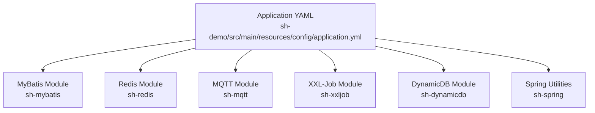
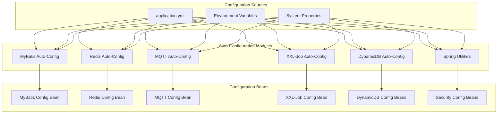
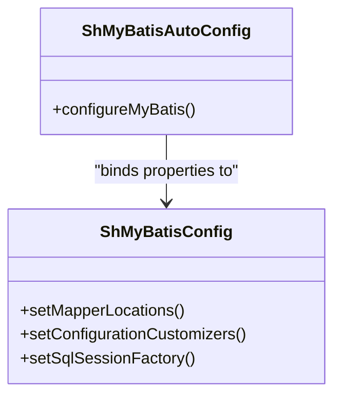
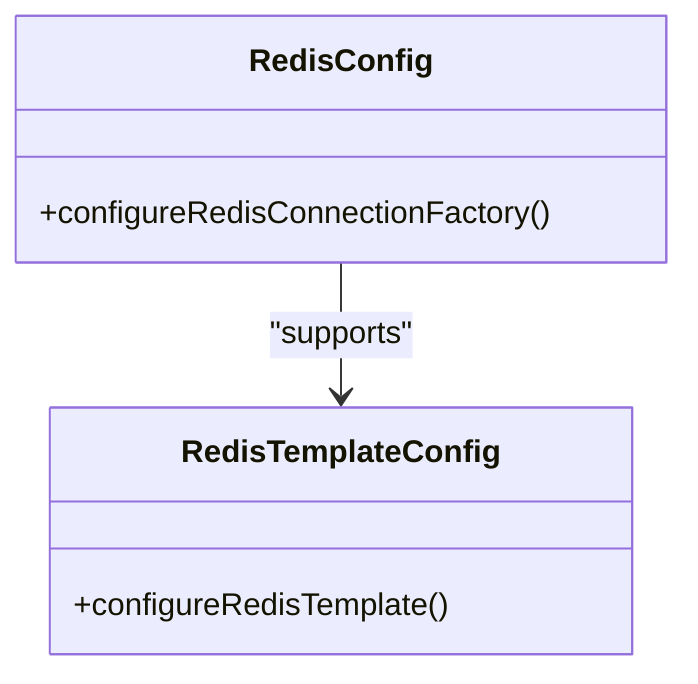
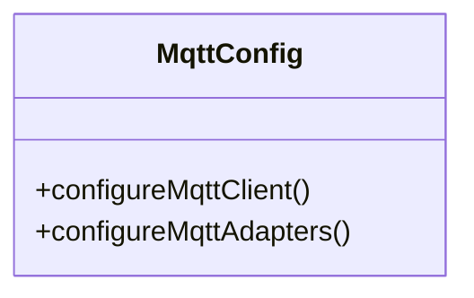
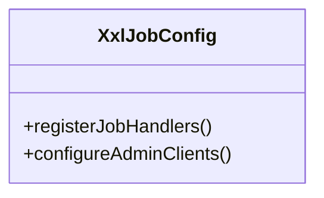
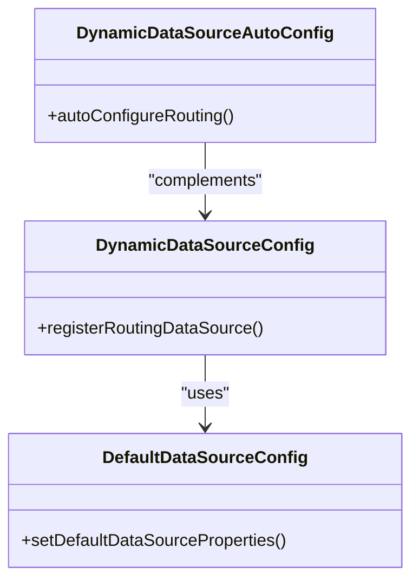
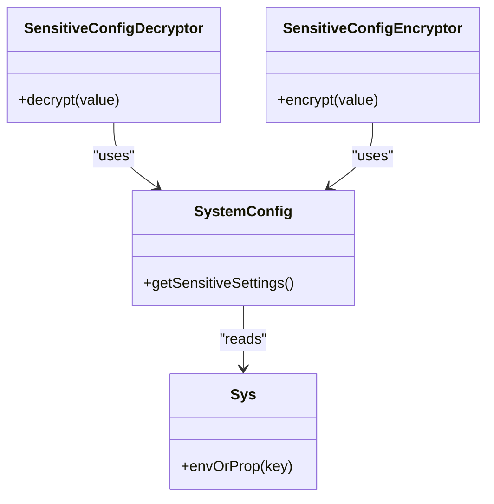
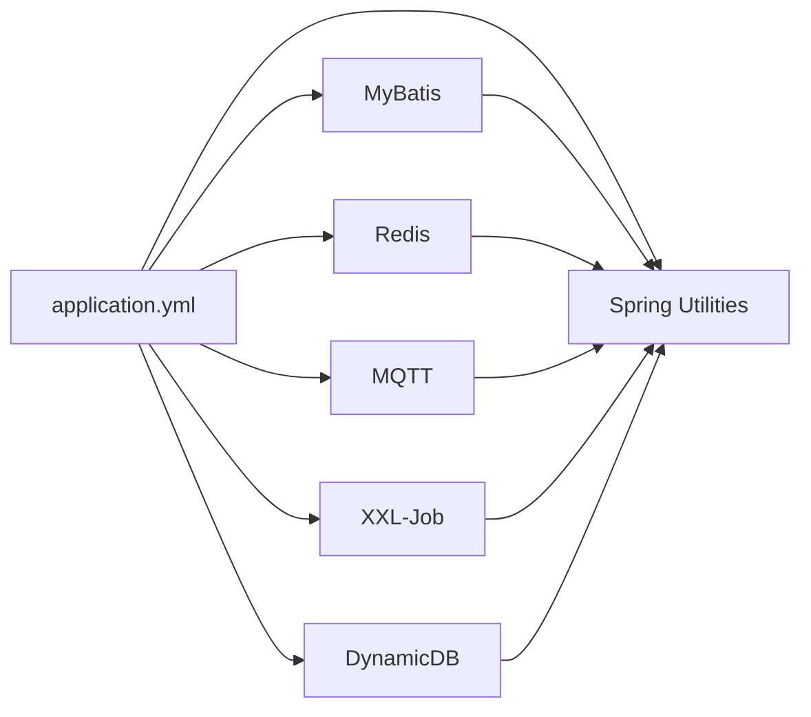

# Configuration Reference

<cite>
**Referenced Files in This Document**
- [application.yml](file://sh-demo/src/main/resources/config/application.yml)
- [spring-configuration-metadata.json](file://sh-mybatis/src/main/resources/META-INF/spring-configuration-metadata.json)
- [spring-configuration-metadata.json](file://sh-mqtt/src/main/resources/META-INF/spring-configuration-metadata.json)
- [spring-configuration-metadata.json](file://sh-xxljob/src/main/resources/META-INF/spring-configuration-metadata.json)
- [ShMyBatisAutoConfig.java](file://sh-mybatis/src/main/java/com/wkclz/mybatis/ShMyBatisAutoConfig.java)
- [ShMyBatisConfig.java](file://sh-mybatis/src/main/java/com/wkclz/mybatis/config/ShMyBatisConfig.java)
- [DynamicDataSourceAutoConfig.java](file://sh-dynamicdb/src/main/java/com/wkclz/dynamicdb/config/DynamicDataSourceAutoConfig.java)
- [DynamicDataSourceConfig.java](file://sh-dynamicdb/src/main/java/com/wkclz/dynamicdb/config/DynamicDataSourceConfig.java)
- [DefaultDataSourceConfig.java](file://sh-dynamicdb/src/main/java/com/wkclz/dynamicdb/bean/DefaultDataSourceConfig.java)
- [RedisConfig.java](file://sh-redis/src/main/java/com/wkclz/redis/config/RedisConfig.java)
- [RedisTemplateConfig.java](file://sh-redis/src/main/java/com/wkclz/redis/config/RedisTemplateConfig.java)
- [MqttConfig.java](file://sh-mqtt/src/main/java/com/wkclz/mqtt/config/MqttConfig.java)
- [XxlJobConfig.java](file://sh-xxljob/src/main/java/com/wkclz/xxljob/config/XxlJobConfig.java)
- [SensitiveConfigDecryptor.java](file://sh-spring/src/main/java/com/wkclz/spring/config/SensitiveConfigDecryptor.java)
- [SensitiveConfigEncryptor.java](file://sh-spring/src/main/java/com/wkclz/spring/config/SensitiveConfigEncryptor.java)
- [SystemConfig.java](file://sh-spring/src/main/java/com/wkclz/spring/config/SystemConfig.java)
- [Sys.java](file://sh-spring/src/main/java/com/wkclz/spring/config/Sys.java)
</cite>

## Table of Contents
1. [Introduction](#introduction)
2. [Project Structure](#project-structure)
3. [Core Components](#core-components)
4. [Architecture Overview](#architecture-overview)
5. [Detailed Component Analysis](#detailed-component-analysis)
6. [Dependency Analysis](#dependency-analysis)
7. [Performance Considerations](#performance-considerations)
8. [Troubleshooting Guide](#troubleshooting-guide)
9. [Conclusion](#conclusion)
10. [Appendices](#appendices)

## Introduction
This document provides a comprehensive configuration reference for the SH Framework. It catalogs application properties, environment variable usage, system property overrides, and module-specific configurations for MyBatis, Redis, MQTT, and XXL-Job integrations. It also covers security configurations for sensitive data handling and encryption, along with database connection pool settings, Redis connection parameters, and MQTT broker configurations. Practical configuration patterns and troubleshooting guidance are included to help operators deploy and maintain the framework reliably.

## Project Structure
The SH Framework is organized as a multi-module Maven project. Configuration is primarily managed via Spring Boot's externalized configuration mechanisms:
- Application-level properties are loaded from a primary configuration file.
- Module-specific auto-configuration classes register beans and bind properties to typed configuration classes.
- Spring Configuration Metadata files describe available properties for IDE support and documentation generation.

**Diagram sources**
- [application.yml](file://sh-demo/src/main/resources/config/application.yml)
- [ShMyBatisAutoConfig.java](file://sh-mybatis/src/main/java/com/wkclz/mybatis/ShMyBatisAutoConfig.java)
- [RedisConfig.java](file://sh-redis/src/main/java/com/wkclz/redis/config/RedisConfig.java)
- [MqttConfig.java](file://sh-mqtt/src/main/java/com/wkclz/mqtt/config/MqttConfig.java)
- [XxlJobConfig.java](file://sh-xxljob/src/main/java/com/wkclz/xxljob/config/XxlJobConfig.java)
- [DynamicDataSourceAutoConfig.java](file://sh-dynamicdb/src/main/java/com/wkclz/dynamicdb/config/DynamicDataSourceAutoConfig.java)
- [SystemConfig.java](file://sh-spring/src/main/java/com/wkclz/spring/config/SystemConfig.java)

**Section sources**
- [application.yml](file://sh-demo/src/main/resources/config/application.yml)
- [ShMyBatisAutoConfig.java](file://sh-mybatis/src/main/java/com/wkclz/mybatis/ShMyBatisAutoConfig.java)
- [RedisConfig.java](file://sh-redis/src/main/java/com/wkclz/redis/config/RedisConfig.java)
- [MqttConfig.java](file://sh-mqtt/src/main/java/com/wkclz/mqtt/config/MqttConfig.java)
- [XxlJobConfig.java](file://sh-xxljob/src/main/java/com/wkclz/xxljob/config/XxlJobConfig.java)
- [DynamicDataSourceAutoConfig.java](file://sh-dynamicdb/src/main/java/com/wkclz/dynamicdb/config/DynamicDataSourceAutoConfig.java)
- [SystemConfig.java](file://sh-spring/src/main/java/com/wkclz/spring/config/SystemConfig.java)

## Core Components
This section outlines the core configuration mechanisms and where to define properties for each major subsystem.

- Application Properties Location
  - Primary configuration file: [application.yml](file://sh-demo/src/main/resources/config/application.yml)
  - Properties are resolved by Spring Boot from various sources (file system, classpath, environment variables, system properties) according to standard precedence.

- Environment Variables and System Properties
  - Environment variables override properties loaded from files.
  - System properties override environment variables.
  - Property keys are normalized (dots, underscores, and kebab-case are equivalent in Spring).

- Security Configuration
  - Sensitive configuration decryption and encryption utilities are provided by the Spring utilities module.
  - See [SensitiveConfigDecryptor.java](file://sh-spring/src/main/java/com/wkclz/spring/config/SensitiveConfigDecryptor.java) and [SensitiveConfigEncryptor.java](file://sh-spring/src/main/java/com/wkclz/spring/config/SensitiveConfigEncryptor.java).
  - System-wide sensitive data handling settings are centralized in [SystemConfig.java](file://sh-spring/src/main/java/com/wkclz/spring/config/SystemConfig.java) and [Sys.java](file://sh-spring/src/main/java/com/wkclz/spring/config/Sys.java).

- Module Auto-Configuration
  - Each module registers its own auto-configuration class that binds properties to typed configuration beans.
  - Examples:
    - MyBatis: [ShMyBatisAutoConfig.java](file://sh-mybatis/src/main/java/com/wkclz/mybatis/ShMyBatisAutoConfig.java) and [ShMyBatisConfig.java](file://sh-mybatis/src/main/java/com/wkclz/mybatis/config/ShMyBatisConfig.java)
    - Redis: [RedisConfig.java](file://sh-redis/src/main/java/com/wkclz/redis/config/RedisConfig.java) and [RedisTemplateConfig.java](file://sh-redis/src/main/java/com/wkclz/redis/config/RedisTemplateConfig.java)
    - MQTT: [MqttConfig.java](file://sh-mqtt/src/main/java/com/wkclz/mqtt/config/MqttConfig.java)
    - XXL-Job: [XxlJobConfig.java](file://sh-xxljob/src/main/java/com/wkclz/xxljob/config/XxlJobConfig.java)
    - DynamicDB: [DynamicDataSourceAutoConfig.java](file://sh-dynamicdb/src/main/java/com/wkclz/dynamicdb/config/DynamicDataSourceAutoConfig.java) and [DynamicDataSourceConfig.java](file://sh-dynamicdb/src/main/java/com/wkclz/dynamicdb/config/DynamicDataSourceConfig.java), [DefaultDataSourceConfig.java](file://sh-dynamicdb/src/main/java/com/wkclz/dynamicdb/bean/DefaultDataSourceConfig.java)

**Section sources**
- [application.yml](file://sh-demo/src/main/resources/config/application.yml)
- [SensitiveConfigDecryptor.java](file://sh-spring/src/main/java/com/wkclz/spring/config/SensitiveConfigDecryptor.java)
- [SensitiveConfigEncryptor.java](file://sh-spring/src/main/java/com/wkclz/spring/config/SensitiveConfigEncryptor.java)
- [SystemConfig.java](file://sh-spring/src/main/java/com/wkclz/spring/config/SystemConfig.java)
- [Sys.java](file://sh-spring/src/main/java/com/wkclz/spring/config/Sys.java)
- [ShMyBatisAutoConfig.java](file://sh-mybatis/src/main/java/com/wkclz/mybatis/ShMyBatisAutoConfig.java)
- [ShMyBatisConfig.java](file://sh-mybatis/src/main/java/com/wkclz/mybatis/config/ShMyBatisConfig.java)
- [RedisConfig.java](file://sh-redis/src/main/java/com/wkclz/redis/config/RedisConfig.java)
- [RedisTemplateConfig.java](file://sh-redis/src/main/java/com/wkclz/redis/config/RedisTemplateConfig.java)
- [MqttConfig.java](file://sh-mqtt/src/main/java/com/wkclz/mqtt/config/MqttConfig.java)
- [XxlJobConfig.java](file://sh-xxljob/src/main/java/com/wkclz/xxljob/config/XxlJobConfig.java)
- [DynamicDataSourceAutoConfig.java](file://sh-dynamicdb/src/main/java/com/wkclz/dynamicdb/config/DynamicDataSourceAutoConfig.java)
- [DynamicDataSourceConfig.java](file://sh-dynamicdb/src/main/java/com/wkclz/dynamicdb/config/DynamicDataSourceConfig.java)
- [DefaultDataSourceConfig.java](file://sh-dynamicdb/src/main/java/com/wkclz/dynamicdb/bean/DefaultDataSourceConfig.java)

## Architecture Overview
The configuration architecture follows Spring Boot’s externalized configuration model with module-specific binding and validation metadata.

**Diagram sources**
- [application.yml](file://sh-demo/src/main/resources/config/application.yml)
- [ShMyBatisAutoConfig.java](file://sh-mybatis/src/main/java/com/wkclz/mybatis/ShMyBatisAutoConfig.java)
- [RedisConfig.java](file://sh-redis/src/main/java/com/wkclz/redis/config/RedisConfig.java)
- [MqttConfig.java](file://sh-mqtt/src/main/java/com/wkclz/mqtt/config/MqttConfig.java)
- [XxlJobConfig.java](file://sh-xxljob/src/main/java/com/wkclz/xxljob/config/XxlJobConfig.java)
- [DynamicDataSourceAutoConfig.java](file://sh-dynamicdb/src/main/java/com/wkclz/dynamicdb/config/DynamicDataSourceAutoConfig.java)
- [SystemConfig.java](file://sh-spring/src/main/java/com/wkclz/spring/config/SystemConfig.java)

## Detailed Component Analysis

### MyBatis Configuration
MyBatis integration exposes configuration properties bound to a typed configuration class. Properties are documented in the module’s Spring Configuration Metadata.

- Property Catalog
  - Refer to the MyBatis module’s metadata for available properties and descriptions.
  - File: [spring-configuration-metadata.json](file://sh-mybatis/src/main/resources/META-INF/spring-configuration-metadata.json)

- Binding Behavior
  - Auto-configuration class binds properties to configuration beans.
  - See [ShMyBatisAutoConfig.java](file://sh-mybatis/src/main/java/com/wkclz/mybatis/ShMyBatisAutoConfig.java) and [ShMyBatisConfig.java](file://sh-mybatis/src/main/java/com/wkclz/mybatis/config/ShMyBatisConfig.java)

- Typical Use Cases
  - Enable pagination, configure interceptors, set mapper locations, and tune SQL logging.
  - Override via environment variables or system properties for different environments.

**Diagram sources**
- [ShMyBatisAutoConfig.java](file://sh-mybatis/src/main/java/com/wkclz/mybatis/ShMyBatisAutoConfig.java)
- [ShMyBatisConfig.java](file://sh-mybatis/src/main/java/com/wkclz/mybatis/config/ShMyBatisConfig.java)

**Section sources**
- [spring-configuration-metadata.json](file://sh-mybatis/src/main/resources/META-INF/spring-configuration-metadata.json)
- [ShMyBatisAutoConfig.java](file://sh-mybatis/src/main/java/com/wkclz/mybatis/ShMyBatisAutoConfig.java)
- [ShMyBatisConfig.java](file://sh-mybatis/src/main/java/com/wkclz/mybatis/config/ShMyBatisConfig.java)

### Redis Configuration
Redis integration provides configuration for connection settings and template customization.

- Property Catalog
  - Refer to the Redis module’s Spring Configuration Metadata for available properties.
  - File: [spring-configuration-metadata.json](file://sh-redis/src/main/resources/META-INF/spring-configuration-metadata.json)

- Binding Behavior
  - Auto-configuration registers Redis connection and template beans.
  - See [RedisConfig.java](file://sh-redis/src/main/java/com/wkclz/redis/config/RedisConfig.java) and [RedisTemplateConfig.java](file://sh-redis/src/main/java/com/wkclz/redis/config/RedisTemplateConfig.java)

- Connection Settings
  - Host, port, password, database index, timeouts, and pool settings are configured via properties.
  - Override using environment variables or system properties per deployment target.

**Diagram sources**
- [RedisConfig.java](file://sh-redis/src/main/java/com/wkclz/redis/config/RedisConfig.java)
- [RedisTemplateConfig.java](file://sh-redis/src/main/java/com/wkclz/redis/config/RedisTemplateConfig.java)

**Section sources**
- [spring-configuration-metadata.json](file://sh-redis/src/main/resources/META-INF/spring-configuration-metadata.json)
- [RedisConfig.java](file://sh-redis/src/main/java/com/wkclz/redis/config/RedisConfig.java)
- [RedisTemplateConfig.java](file://sh-redis/src/main/java/com/wkclz/redis/config/RedisTemplateConfig.java)

### MQTT Configuration
MQTT integration supports broker connectivity and SSL/TLS settings.

- Property Catalog
  - Refer to the MQTT module’s Spring Configuration Metadata for available properties.
  - File: [spring-configuration-metadata.json](file://sh-mqtt/src/main/resources/META-INF/spring-configuration-metadata.json)

- Binding Behavior
  - Auto-configuration registers MQTT client and related beans.
  - See [MqttConfig.java](file://sh-mqtt/src/main/java/com/wkclz/mqtt/config/MqttConfig.java)

- Broker and Security Settings
  - Broker host/port, credentials, keep-alive intervals, and SSL/TLS parameters are configurable.
  - Environment variables and system properties can override defaults for staging/prod parity.

**Diagram sources**
- [MqttConfig.java](file://sh-mqtt/src/main/java/com/wkclz/mqtt/config/MqttConfig.java)

**Section sources**
- [spring-configuration-metadata.json](file://sh-mqtt/src/main/resources/META-INF/spring-configuration-metadata.json)
- [MqttConfig.java](file://sh-mqtt/src/main/java/com/wkclz/mqtt/config/MqttConfig.java)

### XXL-Job Configuration
XXL-Job integration provides scheduler and executor configuration.

- Property Catalog
  - Refer to the XXL-Job module’s Spring Configuration Metadata for available properties.
  - File: [spring-configuration-metadata.json](file://sh-xxljob/src/main/resources/META-INF/spring-configuration-metadata.json)

- Binding Behavior
  - Auto-configuration registers job handlers and scheduler beans.
  - See [XxlJobConfig.java](file://sh-xxljob/src/main/java/com/wkclz/xxljob/config/XxlJobConfig.java)

- Scheduler Settings
  - Executor address, app name, accessToken, and registry settings are controlled via properties.
  - Use environment variables for cluster-specific overrides.

**Diagram sources**
- [XxlJobConfig.java](file://sh-xxljob/src/main/java/com/wkclz/xxljob/config/XxlJobConfig.java)

**Section sources**
- [spring-configuration-metadata.json](file://sh-xxljob/src/main/resources/META-INF/spring-configuration-metadata.json)
- [XxlJobConfig.java](file://sh-xxljob/src/main/java/com/wkclz/xxljob/config/XxlJobConfig.java)

### DynamicDB (Multi-DataSource) Configuration
DynamicDB enables runtime switching among multiple data sources with connection pooling.

- Property Catalog
  - Refer to the DynamicDB module’s Spring Configuration Metadata for available properties.
  - File: [spring-configuration-metadata.json](file://sh-dynamicdb/src/main/resources/META-INF/spring-configuration-metadata.json)

- Binding Behavior
  - Auto-configuration and configuration classes manage routing and pools.
  - See [DynamicDataSourceAutoConfig.java](file://sh-dynamicdb/src/main/java/com/wkclz/dynamicdb/config/DynamicDataSourceAutoConfig.java), [DynamicDataSourceConfig.java](file://sh-dynamicdb/src/main/java/com/wkclz/dynamicdb/config/DynamicDataSourceConfig.java), and [DefaultDataSourceConfig.java](file://sh-dynamicdb/src/main/java/com/wkclz/dynamicdb/bean/DefaultDataSourceConfig.java)

- Connection Pooling and Routing
  - Configure default and additional data sources, pool sizes, and routing rules.
  - Environment variables/system properties enable per-environment overrides.

**Diagram sources**
- [DynamicDataSourceAutoConfig.java](file://sh-dynamicdb/src/main/java/com/wkclz/dynamicdb/config/DynamicDataSourceAutoConfig.java)
- [DynamicDataSourceConfig.java](file://sh-dynamicdb/src/main/java/com/wkclz/dynamicdb/config/DynamicDataSourceConfig.java)
- [DefaultDataSourceConfig.java](file://sh-dynamicdb/src/main/java/com/wkclz/dynamicdb/bean/DefaultDataSourceConfig.java)

**Section sources**
- [spring-configuration-metadata.json](file://sh-dynamicdb/src/main/resources/META-INF/spring-configuration-metadata.json)
- [DynamicDataSourceAutoConfig.java](file://sh-dynamicdb/src/main/java/com/wkclz/dynamicdb/config/DynamicDataSourceAutoConfig.java)
- [DynamicDataSourceConfig.java](file://sh-dynamicdb/src/main/java/com/wkclz/dynamicdb/config/DynamicDataSourceConfig.java)
- [DefaultDataSourceConfig.java](file://sh-dynamicdb/src/main/java/com/wkclz/dynamicdb/bean/DefaultDataSourceConfig.java)

### Security Configuration (Sensitive Data Handling and Encryption)
SH Framework provides utilities for encrypting and decrypting sensitive configuration values.

- Decryption Utility
  - [SensitiveConfigDecryptor.java](file://sh-spring/src/main/java/com/wkclz/spring/config/SensitiveConfigDecryptor.java) handles decryption of sensitive properties.

- Encryption Utility
  - [SensitiveConfigEncryptor.java](file://sh-spring/src/main/java/com/wkclz/spring/config/SensitiveConfigEncryptor.java) supports encryption of sensitive values.

- System-wide Configuration
  - Centralized settings and helpers are defined in [SystemConfig.java](file://sh-spring/src/main/java/com/wkclz/spring/config/SystemConfig.java) and [Sys.java](file://sh-spring/src/main/java/com/wkclz/spring/config/Sys.java).

- Usage Patterns
  - Store encrypted values in configuration files and rely on the decryptor at runtime.
  - Use environment variables for secrets in containerized deployments.

**Diagram sources**
- [SensitiveConfigDecryptor.java](file://sh-spring/src/main/java/com/wkclz/spring/config/SensitiveConfigDecryptor.java)
- [SensitiveConfigEncryptor.java](file://sh-spring/src/main/java/com/wkclz/spring/config/SensitiveConfigEncryptor.java)
- [SystemConfig.java](file://sh-spring/src/main/java/com/wkclz/spring/config/SystemConfig.java)
- [Sys.java](file://sh-spring/src/main/java/com/wkclz/spring/config/Sys.java)

**Section sources**
- [SensitiveConfigDecryptor.java](file://sh-spring/src/main/java/com/wkclz/spring/config/SensitiveConfigDecryptor.java)
- [SensitiveConfigEncryptor.java](file://sh-spring/src/main/java/com/wkclz/spring/config/SensitiveConfigEncryptor.java)
- [SystemConfig.java](file://sh-spring/src/main/java/com/wkclz/spring/config/SystemConfig.java)
- [Sys.java](file://sh-spring/src/main/java/com/wkclz/spring/config/Sys.java)

## Dependency Analysis
Configuration dependencies across modules reflect the auto-configuration pattern and shared security utilities.

**Diagram sources**
- [application.yml](file://sh-demo/src/main/resources/config/application.yml)
- [ShMyBatisAutoConfig.java](file://sh-mybatis/src/main/java/com/wkclz/mybatis/ShMyBatisAutoConfig.java)
- [RedisConfig.java](file://sh-redis/src/main/java/com/wkclz/redis/config/RedisConfig.java)
- [MqttConfig.java](file://sh-mqtt/src/main/java/com/wkclz/mqtt/config/MqttConfig.java)
- [XxlJobConfig.java](file://sh-xxljob/src/main/java/com/wkclz/xxljob/config/XxlJobConfig.java)
- [DynamicDataSourceAutoConfig.java](file://sh-dynamicdb/src/main/java/com/wkclz/dynamicdb/config/DynamicDataSourceAutoConfig.java)
- [SystemConfig.java](file://sh-spring/src/main/java/com/wkclz/spring/config/SystemConfig.java)

**Section sources**
- [application.yml](file://sh-demo/src/main/resources/config/application.yml)
- [ShMyBatisAutoConfig.java](file://sh-mybatis/src/main/java/com/wkclz/mybatis/ShMyBatisAutoConfig.java)
- [RedisConfig.java](file://sh-redis/src/main/java/com/wkclz/redis/config/RedisConfig.java)
- [MqttConfig.java](file://sh-mqtt/src/main/java/com/wkclz/mqtt/config/MqttConfig.java)
- [XxlJobConfig.java](file://sh-xxljob/src/main/java/com/wkclz/xxljob/config/XxlJobConfig.java)
- [DynamicDataSourceAutoConfig.java](file://sh-dynamicdb/src/main/java/com/wkclz/dynamicdb/config/DynamicDataSourceAutoConfig.java)
- [SystemConfig.java](file://sh-spring/src/main/java/com/wkclz/spring/config/SystemConfig.java)

## Performance Considerations
- Connection Pools
  - Tune pool sizes and timeouts for databases and Redis to match workload patterns.
  - Use environment variables to scale pools per deployment tier.

- Caching and Serialization
  - Choose appropriate serializers and TTL policies for Redis to minimize GC pressure and network overhead.

- MQTT Quality of Service
  - Adjust QoS levels and keep-alive intervals to balance reliability and throughput.

- DynamicDB Routing
  - Minimize routing overhead by caching route decisions and avoiding excessive dynamic switches.

[No sources needed since this section provides general guidance]

## Troubleshooting Guide
- Properties Not Applied
  - Verify property precedence: system properties override environment variables, which override file-based properties.
  - Confirm property keys match normalized forms and module namespaces.

- MyBatis Issues
  - Check mapper locations and type aliases resolution.
  - Review SQL logging and interceptor configuration.

- Redis Connectivity Problems
  - Validate host, port, and authentication settings.
  - Inspect pool exhaustion and timeout errors.

- MQTT Connection Failures
  - Confirm broker endpoint, credentials, and TLS certificates.
  - Enable debug logs for connection lifecycle events.

- XXL-Job Registration Errors
  - Ensure executor address and app name are correct.
  - Verify admin endpoints and network accessibility.

- Sensitive Data Handling
  - Confirm encryption/decryption keys and algorithms align across environments.
  - Prefer environment variables for secrets in CI/CD pipelines.

**Section sources**
- [application.yml](file://sh-demo/src/main/resources/config/application.yml)
- [ShMyBatisAutoConfig.java](file://sh-mybatis/src/main/java/com/wkclz/mybatis/ShMyBatisAutoConfig.java)
- [RedisConfig.java](file://sh-redis/src/main/java/com/wkclz/redis/config/RedisConfig.java)
- [MqttConfig.java](file://sh-mqtt/src/main/java/com/wkclz/mqtt/config/MqttConfig.java)
- [XxlJobConfig.java](file://sh-xxljob/src/main/java/com/wkclz/xxljob/config/XxlJobConfig.java)
- [SensitiveConfigDecryptor.java](file://sh-spring/src/main/java/com/wkclz/spring/config/SensitiveConfigDecryptor.java)
- [SensitiveConfigEncryptor.java](file://sh-spring/src/main/java/com/wkclz/spring/config/SensitiveConfigEncryptor.java)

## Conclusion
SH Framework’s configuration model leverages Spring Boot’s robust externalization capabilities with module-specific auto-configuration and validation metadata. By organizing properties per module, centralizing sensitive data handling, and enabling environment-driven overrides, operators can reliably deploy and operate the framework across diverse environments. Use the provided property catalogs, environment variable patterns, and troubleshooting steps to maintain a secure and performant configuration baseline.

[No sources needed since this section summarizes without analyzing specific files]

## Appendices

### Appendix A: Environment Variable and System Property Overrides
- Environment variables take precedence over file-based properties.
- System properties override environment variables.
- Normalize property keys (dots, underscores, kebab-case are equivalent).

**Section sources**
- [application.yml](file://sh-demo/src/main/resources/config/application.yml)

### Appendix B: Common Configuration Patterns
- Database Connection Pools
  - Define separate profiles for dev/stage/prod with distinct pool sizes and timeouts.
  - Use environment variables to switch databases without code changes.

- Redis
  - Configure sentinel or cluster mode via properties; use environment variables for endpoints.

- MQTT
  - Externalize broker URLs and credentials; enable TLS in production via environment variables.

- XXL-Job
  - Set executor app name and admin addresses per cluster; use environment variables for multi-region deployments.

- DynamicDB
  - Define default and additional data sources; use environment variables to select active routes.

**Section sources**
- [DynamicDataSourceAutoConfig.java](file://sh-dynamicdb/src/main/java/com/wkclz/dynamicdb/config/DynamicDataSourceAutoConfig.java)
- [DynamicDataSourceConfig.java](file://sh-dynamicdb/src/main/java/com/wkclz/dynamicdb/config/DynamicDataSourceConfig.java)
- [DefaultDataSourceConfig.java](file://sh-dynamicdb/src/main/java/com/wkclz/dynamicdb/bean/DefaultDataSourceConfig.java)
- [RedisConfig.java](file://sh-redis/src/main/java/com/wkclz/redis/config/RedisConfig.java)
- [MqttConfig.java](file://sh-mqtt/src/main/java/com/wkclz/mqtt/config/MqttConfig.java)
- [XxlJobConfig.java](file://sh-xxljob/src/main/java/com/wkclz/xxljob/config/XxlJobConfig.java)