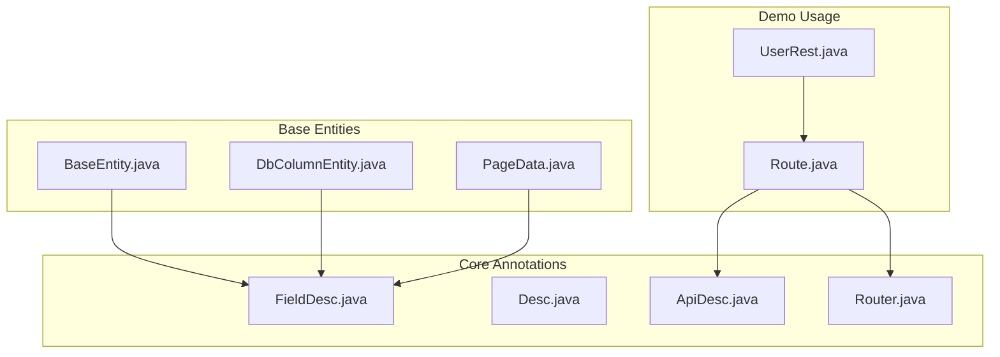
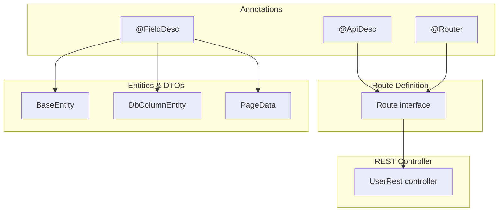
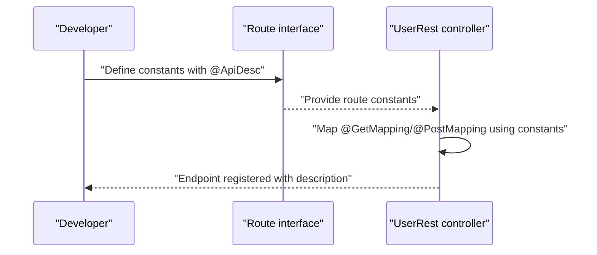
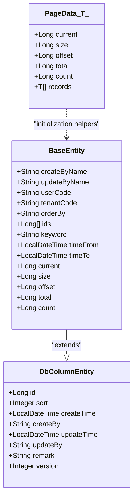
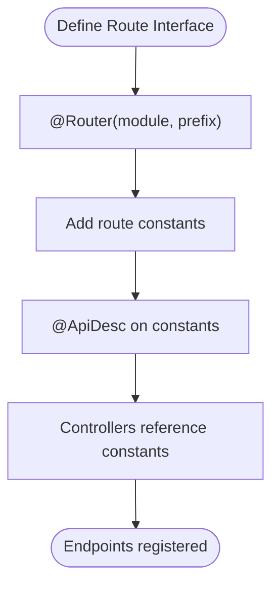
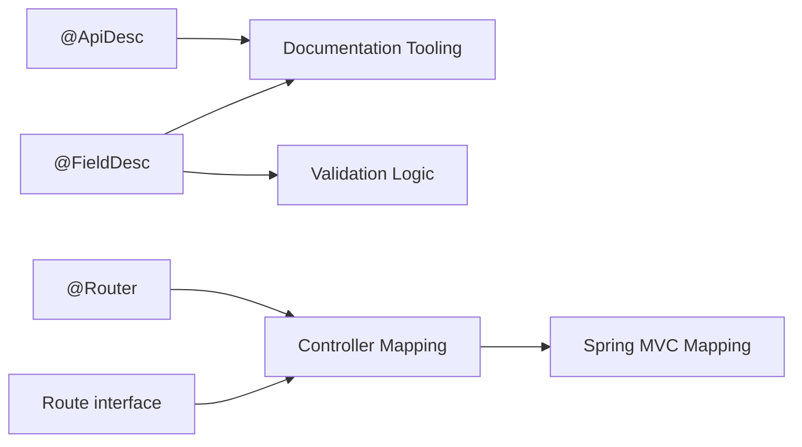

# Core Annotations

<cite>
**Referenced Files in This Document**
- [ApiDesc.java](file://sh-core/src/main/java/com/wkclz/core/annotation/ApiDesc.java)
- [Desc.java](file://sh-core/src/main/java/com/wkclz/core/annotation/Desc.java)
- [FieldDesc.java](file://sh-core/src/main/java/com/wkclz/core/annotation/FieldDesc.java)
- [Router.java](file://sh-core/src/main/java/com/wkclz/core/annotation/Router.java)
- [Route.java](file://sh-demo/src/main/java/com/wkclz/demo/rest/Route.java)
- [UserRest.java](file://sh-demo/src/main/java/com/wkclz/demo/rest/UserRest.java)
- [BaseEntity.java](file://sh-core/src/main/java/com/wkclz/core/base/BaseEntity.java)
- [DbColumnEntity.java](file://sh-core/src/main/java/com/wkclz/core/base/DbColumnEntity.java)
- [PageData.java](file://sh-core/src/main/java/com/wkclz/core/base/PageData.java)
</cite>

## Table of Contents
1. [Introduction](#introduction)
2. [Project Structure](#project-structure)
3. [Core Components](#core-components)
4. [Architecture Overview](#architecture-overview)
5. [Detailed Component Analysis](#detailed-component-analysis)
6. [Dependency Analysis](#dependency-analysis)
7. [Performance Considerations](#performance-considerations)
8. [Troubleshooting Guide](#troubleshooting-guide)
9. [Conclusion](#conclusion)

## Introduction
This document explains the core annotation system used throughout the SH Framework for metadata and documentation purposes. It focuses on four primary annotations:
- @ApiDesc: API-level description for documentation generation
- @Desc: Legacy field-level description (deprecated)
- @FieldDesc: Field-level descriptions and validation hints
- @Router: Route mapping and controller registration

It also demonstrates how these annotations integrate with documentation generation, validation processes, and routing mechanisms, and outlines inheritance patterns and best practices for maintaining clean metadata.

## Project Structure
The core annotations live under the core module’s annotation package. Example usage appears in the demo module’s REST routes and entities, and the base framework classes demonstrate field-level annotation inheritance.

**Diagram sources**
- [ApiDesc.java:1-24](file://sh-core/src/main/java/com/wkclz/core/annotation/ApiDesc.java#L1-L24)
- [Desc.java:1-26](file://sh-core/src/main/java/com/wkclz/core/annotation/Desc.java#L1-L26)
- [FieldDesc.java:1-27](file://sh-core/src/main/java/com/wkclz/core/annotation/FieldDesc.java#L1-L27)
- [Router.java:1-28](file://sh-core/src/main/java/com/wkclz/core/annotation/Router.java#L1-L28)
- [Route.java:1-25](file://sh-demo/src/main/java/com/wkclz/demo/rest/Route.java#L1-L25)
- [UserRest.java:1-98](file://sh-demo/src/main/java/com/wkclz/demo/rest/UserRest.java#L1-L98)
- [BaseEntity.java:1-94](file://sh-core/src/main/java/com/wkclz/core/base/BaseEntity.java#L1-L94)
- [DbColumnEntity.java:1-39](file://sh-core/src/main/java/com/wkclz/core/base/DbColumnEntity.java#L1-L39)
- [PageData.java:1-185](file://sh-core/src/main/java/com/wkclz/core/base/PageData.java#L1-L185)

**Section sources**
- [ApiDesc.java:1-24](file://sh-core/src/main/java/com/wkclz/core/annotation/ApiDesc.java#L1-L24)
- [Desc.java:1-26](file://sh-core/src/main/java/com/wkclz/core/annotation/Desc.java#L1-L26)
- [FieldDesc.java:1-27](file://sh-core/src/main/java/com/wkclz/core/annotation/FieldDesc.java#L1-L27)
- [Router.java:1-28](file://sh-core/src/main/java/com/wkclz/core/annotation/Router.java#L1-L28)
- [Route.java:1-25](file://sh-demo/src/main/java/com/wkclz/demo/rest/Route.java#L1-L25)
- [UserRest.java:1-98](file://sh-demo/src/main/java/com/wkclz/demo/rest/UserRest.java#L1-L98)
- [BaseEntity.java:1-94](file://sh-core/src/main/java/com/wkclz/core/base/BaseEntity.java#L1-L94)
- [DbColumnEntity.java:1-39](file://sh-core/src/main/java/com/wkclz/core/base/DbColumnEntity.java#L1-L39)
- [PageData.java:1-185](file://sh-core/src/main/java/com/wkclz/core/base/PageData.java#L1-L185)

## Core Components
This section documents each annotation’s purpose, attributes, retention policy, and intended usage.

- @ApiDesc
  - Purpose: Provides human-readable descriptions for API endpoints and routes to support documentation generation.
  - Retention: Runtime-visible via @Retention(RetentionPolicy.RUNTIME).
  - Typical usage: Applied to constants representing route paths to describe their purpose.
  - Example reference: [Route.java:11-22](file://sh-demo/src/main/java/com/wkclz/demo/rest/Route.java#L11-L22)

- @Desc
  - Status: Deprecated.
  - Purpose: Previously served as a field-level description mechanism.
  - Retention: Runtime-visible.
  - Recommendation: Replace with @FieldDesc for new development.

- @FieldDesc
  - Purpose: Supplies field-level descriptions and optional validation hints (e.g., notNull).
  - Retention: Runtime-visible.
  - Typical usage: Applied to entity and DTO fields to annotate semantics and constraints.
  - Example references:
    - [BaseEntity.java:14-50](file://sh-core/src/main/java/com/wkclz/core/base/BaseEntity.java#L14-L50)
    - [DbColumnEntity.java:15-37](file://sh-core/src/main/java/com/wkclz/core/base/DbColumnEntity.java#L15-L37)
    - [PageData.java:17-30](file://sh-core/src/main/java/com/wkclz/core/base/PageData.java#L17-L30)

- @Router
  - Purpose: Marks an interface as a router definition and declares module and prefix metadata for route grouping.
  - Retention: Runtime-visible.
  - Attributes: module, prefix.
  - Typical usage: Applied to an interface that defines route constants annotated with @ApiDesc.
  - Example reference: [Route.java:6-7](file://sh-demo/src/main/java/com/wkclz/demo/rest/Route.java#L6-L7)

**Section sources**
- [ApiDesc.java:1-24](file://sh-core/src/main/java/com/wkclz/core/annotation/ApiDesc.java#L1-L24)
- [Desc.java:1-26](file://sh-core/src/main/java/com/wkclz/core/annotation/Desc.java#L1-L26)
- [FieldDesc.java:1-27](file://sh-core/src/main/java/com/wkclz/core/annotation/FieldDesc.java#L1-L27)
- [Router.java:1-28](file://sh-core/src/main/java/com/wkclz/core/annotation/Router.java#L1-L28)
- [Route.java:6-24](file://sh-demo/src/main/java/com/wkclz/demo/rest/Route.java#L6-L24)
- [BaseEntity.java:14-50](file://sh-core/src/main/java/com/wkclz/core/base/BaseEntity.java#L14-L50)
- [DbColumnEntity.java:15-37](file://sh-core/src/main/java/com/wkclz/core/base/DbColumnEntity.java#L15-L37)
- [PageData.java:17-30](file://sh-core/src/main/java/com/wkclz/core/base/PageData.java#L17-L30)

## Architecture Overview
The annotation-driven metadata integrates with:
- Documentation generation: @ApiDesc and @FieldDesc provide descriptions consumed by documentation tooling.
- Routing: @Router groups route constants and @ApiDesc describes endpoints; controllers bind to these constants.
- Validation: @FieldDesc notNull hint can guide validation logic during request processing.

**Diagram sources**
- [ApiDesc.java:1-24](file://sh-core/src/main/java/com/wkclz/core/annotation/ApiDesc.java#L1-L24)
- [FieldDesc.java:1-27](file://sh-core/src/main/java/com/wkclz/core/annotation/FieldDesc.java#L1-L27)
- [Router.java:1-28](file://sh-core/src/main/java/com/wkclz/core/annotation/Router.java#L1-L28)
- [Route.java:6-24](file://sh-demo/src/main/java/com/wkclz/demo/rest/Route.java#L6-L24)
- [UserRest.java:22-25](file://sh-demo/src/main/java/com/wkclz/demo/rest/UserRest.java#L22-L25)
- [BaseEntity.java:14-50](file://sh-core/src/main/java/com/wkclz/core/base/BaseEntity.java#L14-L50)
- [DbColumnEntity.java:15-37](file://sh-core/src/main/java/com/wkclz/core/base/DbColumnEntity.java#L15-L37)
- [PageData.java:17-30](file://sh-core/src/main/java/com/wkclz/core/base/PageData.java#L17-L30)

## Detailed Component Analysis

### @ApiDesc: API Description and Documentation Generation
- Role: Supplies endpoint descriptions for documentation systems.
- Usage pattern:
  - Define a constant interface annotated with @Router.
  - Annotate each route constant with @ApiDesc to describe its purpose.
  - Controllers reference these constants for mapping and documentation consistency.
- Practical example:
  - Route constants and their @ApiDesc annotations are defined here: [Route.java:11-22](file://sh-demo/src/main/java/com/wkclz/demo/rest/Route.java#L11-L22)
  - Controller binds to these constants: [UserRest.java:24-89](file://sh-demo/src/main/java/com/wkclz/demo/rest/UserRest.java#L24-L89)

**Diagram sources**
- [Route.java:6-24](file://sh-demo/src/main/java/com/wkclz/demo/rest/Route.java#L6-L24)
- [UserRest.java:24-89](file://sh-demo/src/main/java/com/wkclz/demo/rest/UserRest.java#L24-L89)

**Section sources**
- [Route.java:6-24](file://sh-demo/src/main/java/com/wkclz/demo/rest/Route.java#L6-L24)
- [UserRest.java:24-89](file://sh-demo/src/main/java/com/wkclz/demo/rest/UserRest.java#L24-L89)

### @FieldDesc: Field-Level Descriptions and Validation Hints
- Role: Documents entity and DTO fields and optionally indicates validation constraints (e.g., notNull).
- Inheritance pattern:
  - Base entities apply @FieldDesc to commonly used fields.
  - Derived entities inherit these annotations through class hierarchy.
- Practical examples:
  - Base entity fields: [BaseEntity.java:14-50](file://sh-core/src/main/java/com/wkclz/core/base/BaseEntity.java#L14-L50)
  - Database column fields: [DbColumnEntity.java:15-37](file://sh-core/src/main/java/com/wkclz/core/base/DbColumnEntity.java#L15-L37)
  - Pagination fields: [PageData.java:17-30](file://sh-core/src/main/java/com/wkclz/core/base/PageData.java#L17-L30)

**Diagram sources**
- [DbColumnEntity.java:1-39](file://sh-core/src/main/java/com/wkclz/core/base/DbColumnEntity.java#L1-L39)
- [BaseEntity.java:1-94](file://sh-core/src/main/java/com/wkclz/core/base/BaseEntity.java#L1-L94)
- [PageData.java:1-185](file://sh-core/src/main/java/com/wkclz/core/base/PageData.java#L1-L185)

**Section sources**
- [BaseEntity.java:14-50](file://sh-core/src/main/java/com/wkclz/core/base/BaseEntity.java#L14-L50)
- [DbColumnEntity.java:15-37](file://sh-core/src/main/java/com/wkclz/core/base/DbColumnEntity.java#L15-L37)
- [PageData.java:17-30](file://sh-core/src/main/java/com/wkclz/core/base/PageData.java#L17-L30)

### @Router: Route Mapping and Controller Registration
- Role: Declares a route namespace via module and prefix, enabling consistent controller mapping.
- Usage pattern:
  - Annotate a route interface with @Router(module = "...", prefix = "...").
  - Define constants for endpoints and annotate them with @ApiDesc.
  - Controllers reference these constants for mapping.
- Practical example:
  - Router declaration and route constants: [Route.java:6-24](file://sh-demo/src/main/java/com/wkclz/demo/rest/Route.java#L6-L24)
  - Controller mapping: [UserRest.java:24-89](file://sh-demo/src/main/java/com/wkclz/demo/rest/UserRest.java#L24-L89)

**Diagram sources**
- [Router.java:1-28](file://sh-core/src/main/java/com/wkclz/core/annotation/Router.java#L1-L28)
- [Route.java:6-24](file://sh-demo/src/main/java/com/wkclz/demo/rest/Route.java#L6-L24)
- [UserRest.java:24-89](file://sh-demo/src/main/java/com/wkclz/demo/rest/UserRest.java#L24-L89)

**Section sources**
- [Router.java:1-28](file://sh-core/src/main/java/com/wkclz/core/annotation/Router.java#L1-L28)
- [Route.java:6-24](file://sh-demo/src/main/java/com/wkclz/demo/rest/Route.java#L6-L24)
- [UserRest.java:24-89](file://sh-demo/src/main/java/com/wkclz/demo/rest/UserRest.java#L24-L89)

### Annotation Inheritance Patterns and Best Practices
- Inheritance:
  - @FieldDesc applied to base classes propagates to subclasses via normal Java inheritance.
  - Example: [BaseEntity.java:14-50](file://sh-core/src/main/java/com/wkclz/core/base/BaseEntity.java#L14-L50) inherits database and pagination fields from [DbColumnEntity.java:15-37](file://sh-core/src/main/java/com/wkclz/core/base/DbColumnEntity.java#L15-L37).
- Best practices:
  - Prefer @FieldDesc over @Desc for new code.
  - Keep descriptions concise but descriptive; align with domain terminology.
  - Use @Router to centralize route prefixes and modules for consistent naming.
  - Pair @ApiDesc with route constants to ensure documentation and runtime mapping stay synchronized.
  - Use notNull hints judiciously; complement with explicit validation where appropriate.

**Section sources**
- [BaseEntity.java:14-50](file://sh-core/src/main/java/com/wkclz/core/base/BaseEntity.java#L14-L50)
- [DbColumnEntity.java:15-37](file://sh-core/src/main/java/com/wkclz/core/base/DbColumnEntity.java#L15-L37)
- [FieldDesc.java:23-26](file://sh-core/src/main/java/com/wkclz/core/annotation/FieldDesc.java#L23-L26)
- [Router.java:21-26](file://sh-core/src/main/java/com/wkclz/core/annotation/Router.java#L21-L26)

## Dependency Analysis
The annotations form a lightweight metadata layer with minimal external dependencies. Their primary integration points are:
- Runtime reflection for documentation and validation tooling
- Controller mapping via constants defined in route interfaces

**Diagram sources**
- [ApiDesc.java:1-24](file://sh-core/src/main/java/com/wkclz/core/annotation/ApiDesc.java#L1-L24)
- [FieldDesc.java:1-27](file://sh-core/src/main/java/com/wkclz/core/annotation/FieldDesc.java#L1-L27)
- [Router.java:1-28](file://sh-core/src/main/java/com/wkclz/core/annotation/Router.java#L1-L28)
- [Route.java:6-24](file://sh-demo/src/main/java/com/wkclz/demo/rest/Route.java#L6-L24)
- [UserRest.java:24-89](file://sh-demo/src/main/java/com/wkclz/demo/rest/UserRest.java#L24-L89)

**Section sources**
- [ApiDesc.java:1-24](file://sh-core/src/main/java/com/wkclz/core/annotation/ApiDesc.java#L1-L24)
- [FieldDesc.java:1-27](file://sh-core/src/main/java/com/wkclz/core/annotation/FieldDesc.java#L1-L27)
- [Router.java:1-28](file://sh-core/src/main/java/com/wkclz/core/annotation/Router.java#L1-L28)
- [Route.java:6-24](file://sh-demo/src/main/java/com/wkclz/demo/rest/Route.java#L6-L24)
- [UserRest.java:24-89](file://sh-demo/src/main/java/com/wkclz/demo/rest/UserRest.java#L24-L89)

## Performance Considerations
- Reflection cost: Runtime retention enables reflection-based scanning for documentation and validation. Cache scanned metadata when building documentation or validation registries.
- Annotation cardinality: Prefer centralized route interfaces (@Router) to minimize scattered constants and reduce scanning overhead.
- Validation hints: Use notNull judiciously; combine with compile-time checks and DTO validation to avoid redundant runtime checks.

## Troubleshooting Guide
- Missing descriptions in documentation:
  - Ensure @ApiDesc is present on route constants and that documentation tooling scans runtime annotations.
  - Verify route interface is annotated with @Router so controllers can resolve module/prefix consistently.
- Inconsistent route mapping:
  - Confirm controllers reference constants from the route interface rather than hardcoded strings.
  - Validate that @RequestMapping and method-level mappings align with the constants.
- Validation not triggered:
  - Confirm @FieldDesc notNull hints are recognized by your validation pipeline.
  - Ensure DTOs and entities are processed by validation frameworks and that hints are translated into constraints.

**Section sources**
- [Route.java:6-24](file://sh-demo/src/main/java/com/wkclz/demo/rest/Route.java#L6-L24)
- [UserRest.java:24-89](file://sh-demo/src/main/java/com/wkclz/demo/rest/UserRest.java#L24-L89)
- [FieldDesc.java:23-26](file://sh-core/src/main/java/com/wkclz/core/annotation/FieldDesc.java#L23-L26)

## Conclusion
The SH Framework’s annotation system provides a clean, maintainable way to encode metadata for documentation, validation, and routing. By centralizing route definitions with @Router, annotating endpoints with @ApiDesc, and enriching entities with @FieldDesc, teams can keep metadata close to the code while enabling automated tooling. Adopt the inheritance patterns demonstrated by the base entities and follow the best practices outlined to maintain clarity and consistency across the codebase.