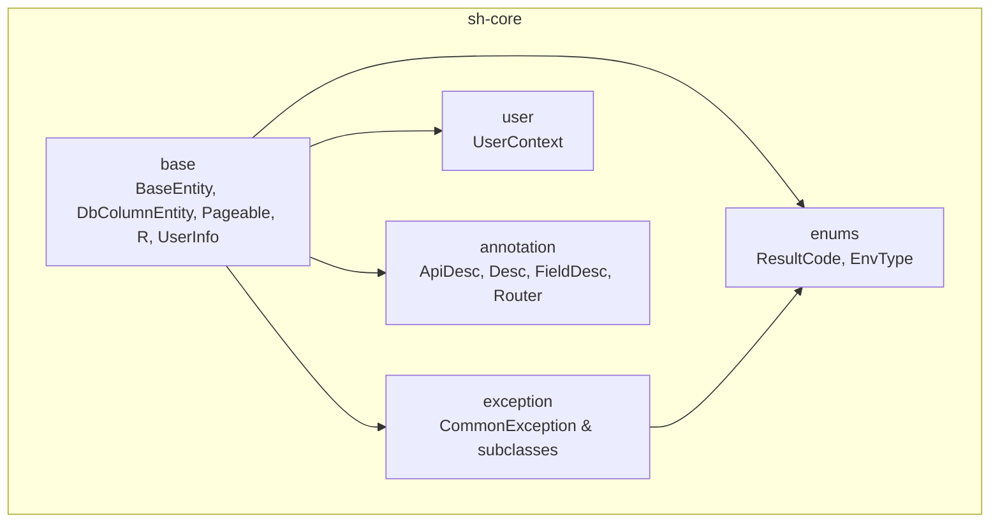
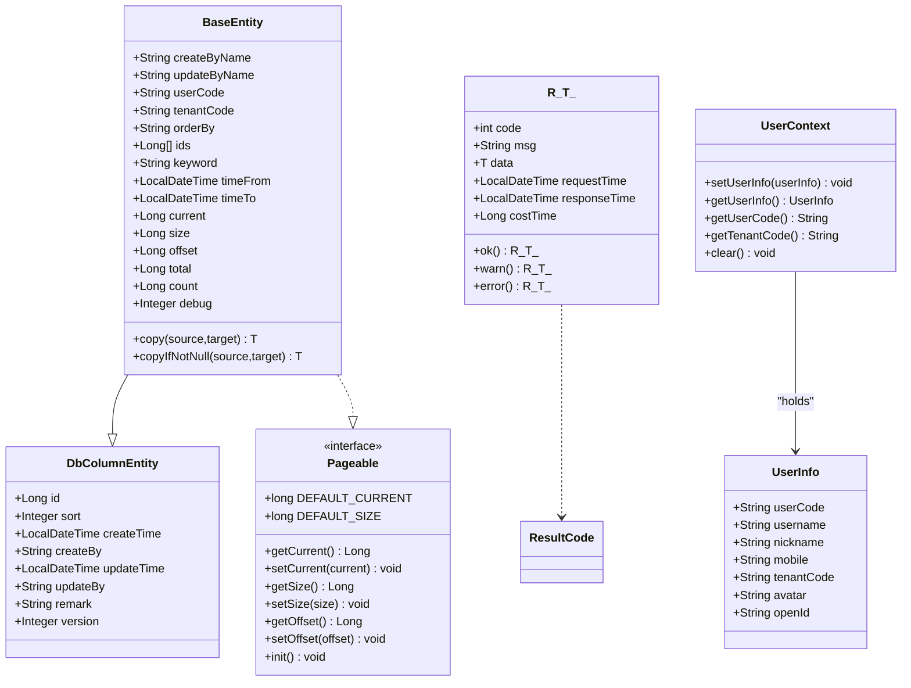
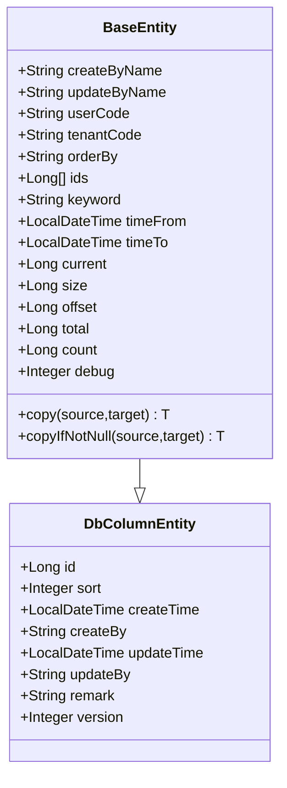
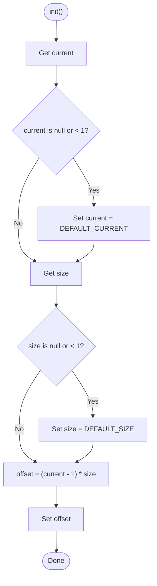
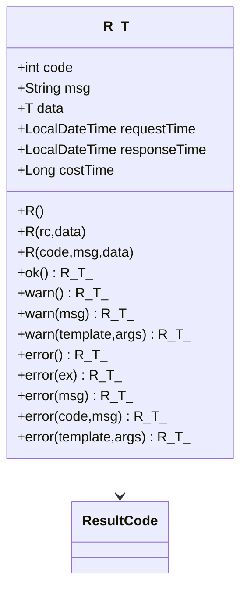
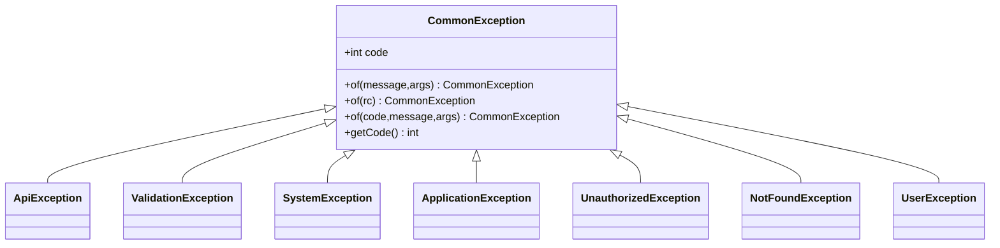
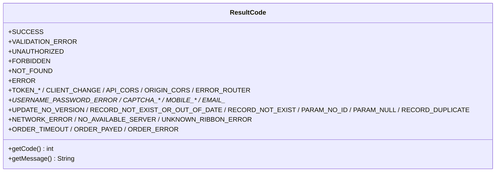
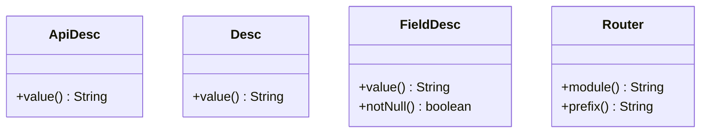
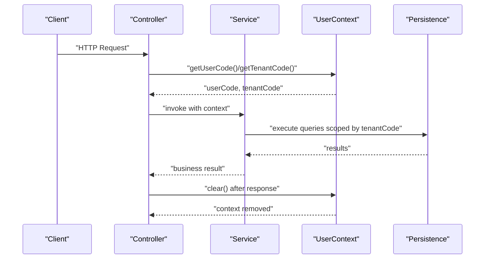
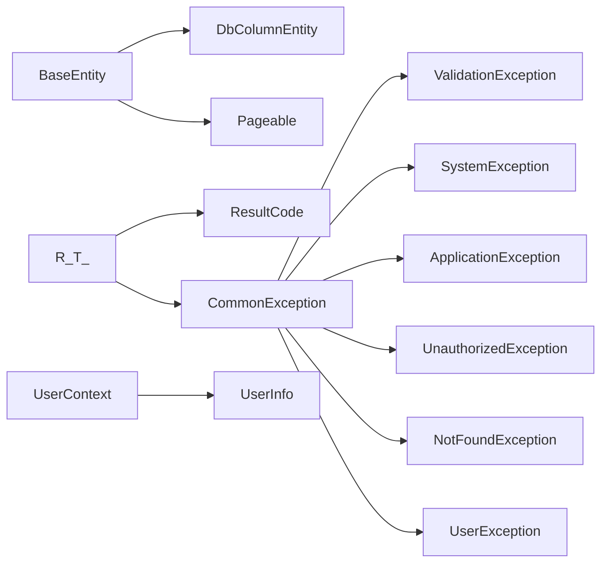

# Core Framework Components

<cite>
**Referenced Files in This Document**
- [BaseEntity.java](file://sh-core/src/main/java/com/wkclz/core/base/BaseEntity.java)
- [DbColumnEntity.java](file://sh-core/src/main/java/com/wkclz/core/base/DbColumnEntity.java)
- [Pageable.java](file://sh-core/src/main/java/com/wkclz/core/base/Pageable.java)
- [R.java](file://sh-core/src/main/java/com/wkclz/core/base/R.java)
- [UserInfo.java](file://sh-core/src/main/java/com/wkclz/core/base/UserInfo.java)
- [ResultCode.java](file://sh-core/src/main/java/com/wkclz/core/enums/ResultCode.java)
- [EnvType.java](file://sh-core/src/main/java/com/wkclz/core/enums/EnvType.java)
- [CommonException.java](file://sh-core/src/main/java/com/wkclz/core/exception/CommonException.java)
- [ApiException.java](file://sh-core/src/main/java/com/wkclz/core/exception/ApiException.java)
- [ValidationException.java](file://sh-core/src/main/java/com/wkclz/core/exception/ValidationException.java)
- [SystemException.java](file://sh-core/src/main/java/com/wkclz/core/exception/SystemException.java)
- [ApplicationException.java](file://sh-core/src/main/java/com/wkclz/core/exception/ApplicationException.java)
- [UnauthorizedException.java](file://sh-core/src/main/java/com/wkclz/core/exception/UnauthorizedException.java)
- [NotFoundException.java](file://sh-core/src/main/java/com/wkclz/core/exception/NotFoundException.java)
- [UserException.java](file://sh-core/src/main/java/com/wkclz/core/exception/UserException.java)
- [UserContext.java](file://sh-core/src/main/java/com/wkclz/core/user/UserContext.java)
- [ApiDesc.java](file://sh-core/src/main/java/com/wkclz/core/annotation/ApiDesc.java)
- [Desc.java](file://sh-core/src/main/java/com/wkclz/core/annotation/Desc.java)
- [FieldDesc.java](file://sh-core/src/main/java/com/wkclz/core/annotation/FieldDesc.java)
- [Router.java](file://sh-core/src/main/java/com/wkclz/core/annotation/Router.java)
</cite>

## Table of Contents
1. [Introduction](#introduction)
2. [Project Structure](#project-structure)
3. [Core Components](#core-components)
4. [Architecture Overview](#architecture-overview)
5. [Detailed Component Analysis](#detailed-component-analysis)
6. [Dependency Analysis](#dependency-analysis)
7. [Performance Considerations](#performance-considerations)
8. [Troubleshooting Guide](#troubleshooting-guide)
9. [Conclusion](#conclusion)
10. [Appendices](#appendices)

## Introduction
This document explains the core framework components that underpin the SH Framework. It focuses on the foundational building blocks: the entity model with audit fields and multi-tenancy, the unified response wrapper R<T>, the exception hierarchy, core annotations, the ResultCode enumeration, and thread-local user context management. Practical examples illustrate how these components collaborate to deliver a standardized development experience across services.

## Project Structure
The core framework resides primarily in the sh-core module, organized by responsibility:
- base: foundational entities, pagination, response wrapper, and user info
- enums: shared enumerations (ResultCode, EnvType)
- exception: exception hierarchy and specialized exception types
- user: thread-local user context
- annotation: metadata annotations used across the stack

**Section sources**
- [BaseEntity.java:1-94](file://sh-core/src/main/java/com/wkclz/core/base/BaseEntity.java#L1-L94)
- [R.java:1-76](file://sh-core/src/main/java/com/wkclz/core/base/R.java#L1-L76)
- [ResultCode.java:1-77](file://sh-core/src/main/java/com/wkclz/core/enums/ResultCode.java#L1-L77)
- [CommonException.java:1-64](file://sh-core/src/main/java/com/wkclz/core/exception/CommonException.java#L1-L64)
- [UserContext.java:1-54](file://sh-core/src/main/java/com/wkclz/core/user/UserContext.java#L1-L54)
- [ApiDesc.java:1-24](file://sh-core/src/main/java/com/wkclz/core/annotation/ApiDesc.java#L1-L24)
- [Desc.java:1-26](file://sh-core/src/main/java/com/wkclz/core/annotation/Desc.java#L1-L26)
- [FieldDesc.java:1-27](file://sh-core/src/main/java/com/wkclz/core/annotation/FieldDesc.java#L1-L27)
- [Router.java:1-28](file://sh-core/src/main/java/com/wkclz/core/annotation/Router.java#L1-L28)

## Core Components
- BaseEntity: Extends DbColumnEntity and implements Pageable, adding audit fields, user/tenant identifiers, query helpers, pagination fields, and utility copy methods.
- DbColumnEntity: Provides database-standard audit fields (id, timestamps, creators, remark, version).
- Pageable: Defines pagination contract with defaults and initialization logic.
- R<T>: Unified API response envelope with timing and code/msg/data fields, plus convenience factory methods.
- UserInfo: Lightweight user profile container persisted in thread-local context.
- ResultCode: Centralized enumeration of standard result codes and messages.
- EnvType: Enumerates system environments for configuration and logging.
- Exception hierarchy: CommonException as the base, with specialized subclasses for API, validation, system, application, unauthorized, not-found, and user-related errors.
- Annotations: ApiDesc, Desc, FieldDesc, Router for metadata and documentation.
- UserContext: ThreadLocal-based holder for UserInfo to enable per-request user and tenant isolation.

**Section sources**
- [BaseEntity.java:11-94](file://sh-core/src/main/java/com/wkclz/core/base/BaseEntity.java#L11-L94)
- [DbColumnEntity.java:12-39](file://sh-core/src/main/java/com/wkclz/core/base/DbColumnEntity.java#L12-L39)
- [Pageable.java:12-93](file://sh-core/src/main/java/com/wkclz/core/base/Pageable.java#L12-L93)
- [R.java:12-76](file://sh-core/src/main/java/com/wkclz/core/base/R.java#L12-L76)
- [UserInfo.java:12-36](file://sh-core/src/main/java/com/wkclz/core/base/UserInfo.java#L12-L36)
- [ResultCode.java:7-77](file://sh-core/src/main/java/com/wkclz/core/enums/ResultCode.java#L7-L77)
- [EnvType.java:10-28](file://sh-core/src/main/java/com/wkclz/core/enums/EnvType.java#L10-L28)
- [CommonException.java:10-64](file://sh-core/src/main/java/com/wkclz/core/exception/CommonException.java#L10-L64)
- [ApiException.java:10-48](file://sh-core/src/main/java/com/wkclz/core/exception/ApiException.java#L10-L48)
- [ValidationException.java:10-48](file://sh-core/src/main/java/com/wkclz/core/exception/ValidationException.java#L10-L48)
- [SystemException.java:10-48](file://sh-core/src/main/java/com/wkclz/core/exception/SystemException.java#L10-L48)
- [ApplicationException.java:10-48](file://sh-core/src/main/java/com/wkclz/core/exception/ApplicationException.java#L10-L48)
- [UnauthorizedException.java:10-48](file://sh-core/src/main/java/com/wkclz/core/exception/UnauthorizedException.java#L10-L48)
- [NotFoundException.java:10-48](file://sh-core/src/main/java/com/wkclz/core/exception/NotFoundException.java#L10-L48)
- [UserException.java:10-48](file://sh-core/src/main/java/com/wkclz/core/exception/UserException.java#L10-L48)
- [UserContext.java:8-54](file://sh-core/src/main/java/com/wkclz/core/user/UserContext.java#L8-L54)
- [ApiDesc.java:18-24](file://sh-core/src/main/java/com/wkclz/core/annotation/ApiDesc.java#L18-L24)
- [Desc.java:20-26](file://sh-core/src/main/java/com/wkclz/core/annotation/Desc.java#L20-L26)
- [FieldDesc.java:18-27](file://sh-core/src/main/java/com/wkclz/core/annotation/FieldDesc.java#L18-L27)
- [Router.java:15-28](file://sh-core/src/main/java/com/wkclz/core/annotation/Router.java#L15-L28)

## Architecture Overview
The framework enforces a consistent pattern:
- Entities inherit audit and multi-tenant fields via DbColumnEntity and extend to include pagination and query helpers via BaseEntity.
- Controllers return R<T> consistently, carrying standardized code/msg/data and timing metrics.
- Exceptions propagate through a typed hierarchy, enabling uniform handling and mapping to ResultCode values.
- ThreadLocal stores user and tenant identity for automatic audit population and multi-tenant scoping.
- Annotations annotate metadata for documentation and router generation.

**Diagram sources**
- [DbColumnEntity.java:12-39](file://sh-core/src/main/java/com/wkclz/core/base/DbColumnEntity.java#L12-L39)
- [Pageable.java:12-93](file://sh-core/src/main/java/com/wkclz/core/base/Pageable.java#L12-L93)
- [BaseEntity.java:11-94](file://sh-core/src/main/java/com/wkclz/core/base/BaseEntity.java#L11-L94)
- [R.java:12-76](file://sh-core/src/main/java/com/wkclz/core/base/R.java#L12-L76)
- [UserInfo.java:12-36](file://sh-core/src/main/java/com/wkclz/core/base/UserInfo.java#L12-L36)
- [UserContext.java:8-54](file://sh-core/src/main/java/com/wkclz/core/user/UserContext.java#L8-L54)
- [ResultCode.java:7-77](file://sh-core/src/main/java/com/wkclz/core/enums/ResultCode.java#L7-L77)

## Detailed Component Analysis

### BaseEntity and Audit/Multi-Tenant Fields
- Inherits standard audit fields from DbColumnEntity (id, timestamps, creators, remark, version).
- Adds userCode and tenantCode for multi-tenant isolation.
- Provides createByName/updateByName for human-readable audit.
- Includes query helpers (orderBy, ids, keyword, timeFrom/timeTo) and pagination fields (current, size, offset, total, count).
- Utility methods copy and copyIfNotNull leverage reflection to instantiate and copy fields, with defensive checks and fallback to SystemException on instantiation failure.

**Diagram sources**
- [DbColumnEntity.java:12-39](file://sh-core/src/main/java/com/wkclz/core/base/DbColumnEntity.java#L12-L39)
- [BaseEntity.java:11-94](file://sh-core/src/main/java/com/wkclz/core/base/BaseEntity.java#L11-L94)

**Section sources**
- [BaseEntity.java:11-94](file://sh-core/src/main/java/com/wkclz/core/base/BaseEntity.java#L11-L94)
- [DbColumnEntity.java:12-39](file://sh-core/src/main/java/com/wkclz/core/base/DbColumnEntity.java#L12-L39)

### Pagination Contract (Pageable)
- Defines DEFAULT_CURRENT and DEFAULT_SIZE.
- Requires getters/setters for current, size, and offset.
- Provides init() to normalize invalid inputs and compute offset.

**Diagram sources**
- [Pageable.java:77-91](file://sh-core/src/main/java/com/wkclz/core/base/Pageable.java#L77-L91)

**Section sources**
- [Pageable.java:12-93](file://sh-core/src/main/java/com/wkclz/core/base/Pageable.java#L12-L93)

### Unified Response Wrapper (R<T>)
- Fields: code, msg, data, requestTime, responseTime, costTime.
- Constructors: default, ResultCode+data, explicit code+msg+data.
- Factory methods:
  - ok(): success with optional data
  - warn(): validation error with optional message/template
  - error(): generic/internal error, overloaded for CommonException, message, code+message, and templated message

**Diagram sources**
- [R.java:12-76](file://sh-core/src/main/java/com/wkclz/core/base/R.java#L12-L76)
- [ResultCode.java:7-77](file://sh-core/src/main/java/com/wkclz/core/enums/ResultCode.java#L7-L77)

**Section sources**
- [R.java:12-76](file://sh-core/src/main/java/com/wkclz/core/base/R.java#L12-L76)
- [ResultCode.java:7-77](file://sh-core/src/main/java/com/wkclz/core/enums/ResultCode.java#L7-L77)

### Exception Hierarchy
- CommonException: base runtime exception with code field and templated factory methods.
- Specializations:
  - ApiException: API-layer failures
  - ValidationException: parameter/validation errors
  - SystemException: unexpected/system-level issues
  - ApplicationException: application/business-level exceptions
  - UnauthorizedException: auth failures
  - NotFoundException: missing resources
  - UserException: user-action related errors

**Diagram sources**
- [CommonException.java:10-64](file://sh-core/src/main/java/com/wkclz/core/exception/CommonException.java#L10-L64)
- [ApiException.java:10-48](file://sh-core/src/main/java/com/wkclz/core/exception/ApiException.java#L10-L48)
- [ValidationException.java:10-48](file://sh-core/src/main/java/com/wkclz/core/exception/ValidationException.java#L10-L48)
- [SystemException.java:10-48](file://sh-core/src/main/java/com/wkclz/core/exception/SystemException.java#L10-L48)
- [ApplicationException.java:10-48](file://sh-core/src/main/java/com/wkclz/core/exception/ApplicationException.java#L10-L48)
- [UnauthorizedException.java:10-48](file://sh-core/src/main/java/com/wkclz/core/exception/UnauthorizedException.java#L10-L48)
- [NotFoundException.java:10-48](file://sh-core/src/main/java/com/wkclz/core/exception/NotFoundException.java#L10-L48)
- [UserException.java:10-48](file://sh-core/src/main/java/com/wkclz/core/exception/UserException.java#L10-L48)

**Section sources**
- [CommonException.java:10-64](file://sh-core/src/main/java/com/wkclz/core/exception/CommonException.java#L10-L64)
- [ApiException.java:10-48](file://sh-core/src/main/java/com/wkclz/core/exception/ApiException.java#L10-L48)
- [ValidationException.java:10-48](file://sh-core/src/main/java/com/wkclz/core/exception/ValidationException.java#L10-L48)
- [SystemException.java:10-48](file://sh-core/src/main/java/com/wkclz/core/exception/SystemException.java#L10-L48)
- [ApplicationException.java:10-48](file://sh-core/src/main/java/com/wkclz/core/exception/ApplicationException.java#L10-L48)
- [UnauthorizedException.java:10-48](file://sh-core/src/main/java/com/wkclz/core/exception/UnauthorizedException.java#L10-L48)
- [NotFoundException.java:10-48](file://sh-core/src/main/java/com/wkclz/core/exception/NotFoundException.java#L10-L48)
- [UserException.java:10-48](file://sh-core/src/main/java/com/wkclz/core/exception/UserException.java#L10-L48)

### ResultCode and Error Handling Patterns
- Standardized codes for success, validation errors, unauthorized, forbidden, not found, internal server error, plus domain-specific codes (token, client change, login, records, network, orders).
- Used by R<T> constructors and exception classes to unify error reporting.
- Pattern: controllers catch exceptions, map to ResultCode or build R<T> with warn/error, ensuring consistent client-facing messages.

**Diagram sources**
- [ResultCode.java:7-77](file://sh-core/src/main/java/com/wkclz/core/enums/ResultCode.java#L7-L77)

**Section sources**
- [ResultCode.java:7-77](file://sh-core/src/main/java/com/wkclz/core/enums/ResultCode.java#L7-L77)
- [R.java:25-35](file://sh-core/src/main/java/com/wkclz/core/base/R.java#L25-L35)
- [CommonException.java:19-22](file://sh-core/src/main/java/com/wkclz/core/exception/CommonException.java#L19-L22)

### Annotations
- ApiDesc: Class/interface/method retention with a single value field for documentation.
- Desc: Deprecated class-level retention with a required value.
- FieldDesc: Field-level retention with value and notNull flag for schema metadata.
- Router: Type-level retention with module and prefix attributes for route generation.

**Diagram sources**
- [ApiDesc.java:18-24](file://sh-core/src/main/java/com/wkclz/core/annotation/ApiDesc.java#L18-L24)
- [Desc.java:20-26](file://sh-core/src/main/java/com/wkclz/core/annotation/Desc.java#L20-L26)
- [FieldDesc.java:18-27](file://sh-core/src/main/java/com/wkclz/core/annotation/FieldDesc.java#L18-L27)
- [Router.java:15-28](file://sh-core/src/main/java/com/wkclz/core/annotation/Router.java#L15-L28)

**Section sources**
- [ApiDesc.java:18-24](file://sh-core/src/main/java/com/wkclz/core/annotation/ApiDesc.java#L18-L24)
- [Desc.java:20-26](file://sh-core/src/main/java/com/wkclz/core/annotation/Desc.java#L20-L26)
- [FieldDesc.java:18-27](file://sh-core/src/main/java/com/wkclz/core/annotation/FieldDesc.java#L18-L27)
- [Router.java:15-28](file://sh-core/src/main/java/com/wkclz/core/annotation/Router.java#L15-L28)

### Thread-Local User Context Management
- UserContext stores UserInfo in a ThreadLocal.
- Provides setUserInfo, getUserInfo, getUserCode, getTenantCode, and clear.
- Supports multi-tenant isolation by retrieving tenantCode alongside userCode.
- Typical lifecycle: populate after login, use during service execution, clear in filters/afters.

**Diagram sources**
- [UserContext.java:8-54](file://sh-core/src/main/java/com/wkclz/core/user/UserContext.java#L8-L54)
- [UserInfo.java:12-36](file://sh-core/src/main/java/com/wkclz/core/base/UserInfo.java#L12-L36)

**Section sources**
- [UserContext.java:8-54](file://sh-core/src/main/java/com/wkclz/core/user/UserContext.java#L8-L54)
- [UserInfo.java:12-36](file://sh-core/src/main/java/com/wkclz/core/base/UserInfo.java#L12-L36)

### Environment Type Handling
- EnvType enumerates DEV, SIT, UAT, PROD with descriptions.
- Annotated with FieldDesc for metadata extraction.
- Useful for configuration selection, logging, and environment-aware behavior.

**Section sources**
- [EnvType.java:10-28](file://sh-core/src/main/java/com/wkclz/core/enums/EnvType.java#L10-L28)
- [FieldDesc.java:18-27](file://sh-core/src/main/java/com/wkclz/core/annotation/FieldDesc.java#L18-L27)

## Dependency Analysis
Key relationships:
- BaseEntity depends on DbColumnEntity and Pageable.
- R<T> depends on ResultCode and CommonException.
- All exception classes depend on CommonException.
- UserContext depends on UserInfo.
- Annotations are consumed by scanning infrastructure (router, docs).

**Diagram sources**
- [BaseEntity.java:11-94](file://sh-core/src/main/java/com/wkclz/core/base/BaseEntity.java#L11-L94)
- [DbColumnEntity.java:12-39](file://sh-core/src/main/java/com/wkclz/core/base/DbColumnEntity.java#L12-L39)
- [Pageable.java:12-93](file://sh-core/src/main/java/com/wkclz/core/base/Pageable.java#L12-L93)
- [R.java:12-76](file://sh-core/src/main/java/com/wkclz/core/base/R.java#L12-L76)
- [ResultCode.java:7-77](file://sh-core/src/main/java/com/wkclz/core/enums/ResultCode.java#L7-L77)
- [CommonException.java:10-64](file://sh-core/src/main/java/com/wkclz/core/exception/CommonException.java#L10-L64)
- [UserContext.java:8-54](file://sh-core/src/main/java/com/wkclz/core/user/UserContext.java#L8-L54)
- [UserInfo.java:12-36](file://sh-core/src/main/java/com/wkclz/core/base/UserInfo.java#L12-L36)

**Section sources**
- [BaseEntity.java:11-94](file://sh-core/src/main/java/com/wkclz/core/base/BaseEntity.java#L11-L94)
- [R.java:12-76](file://sh-core/src/main/java/com/wkclz/core/base/R.java#L12-L76)
- [CommonException.java:10-64](file://sh-core/src/main/java/com/wkclz/core/exception/CommonException.java#L10-L64)
- [UserContext.java:8-54](file://sh-core/src/main/java/com/wkclz/core/user/UserContext.java#L8-L54)

## Performance Considerations
- BaseEntity.copy/copyIfNotNull use reflection to instantiate and copy fields; avoid frequent reflection calls in hot paths. Prefer pre-instantiated targets or builder patterns where appropriate.
- Pageable.init() performs simple arithmetic; negligible overhead but ensure it runs once per request.
- R<T> adds timing fields; keep enabled in dev/stage, consider toggles in production for minimal overhead.
- UserContext uses ThreadLocal; ensure clear() is invoked in filters/afters to prevent thread leaks.

## Troubleshooting Guide
- Validation failures: throw ValidationException or return R.warn(...) with templates for user-friendly messages.
- Unauthorized access: throw UnauthorizedException or return R.error(ResultCode.UNAUTHORIZED).
- Resource not found: throw NotFoundException or return R.error(ResultCode.NOT_FOUND).
- Unexpected errors: throw SystemException or return R.error(ResultCode.ERROR); log stack traces at error level.
- Multi-tenant issues: verify tenantCode in UserContext matches requested resource; confirm BaseEntity.tenantCode propagation.
- Pagination anomalies: ensure Pageable.init() is called before query construction.

**Section sources**
- [ValidationException.java:10-48](file://sh-core/src/main/java/com/wkclz/core/exception/ValidationException.java#L10-L48)
- [UnauthorizedException.java:10-48](file://sh-core/src/main/java/com/wkclz/core/exception/UnauthorizedException.java#L10-L48)
- [NotFoundException.java:10-48](file://sh-core/src/main/java/com/wkclz/core/exception/NotFoundException.java#L10-L48)
- [SystemException.java:10-48](file://sh-core/src/main/java/com/wkclz/core/exception/SystemException.java#L10-L48)
- [R.java:37-76](file://sh-core/src/main/java/com/wkclz/core/base/R.java#L37-L76)
- [UserContext.java:49-51](file://sh-core/src/main/java/com/wkclz/core/user/UserContext.java#L49-L51)

## Conclusion
SH Framework’s core components establish a cohesive, standards-driven foundation:
- BaseEntity and DbColumnEntity standardize persistence models with audit and multi-tenant fields.
- Pageable ensures consistent pagination semantics.
- R<T> unifies API responses with timing and standardized codes.
- The exception hierarchy enables precise error signaling and handling.
- Annotations and enums provide metadata and environment awareness.
- UserContext enables secure, tenant-scoped operations via ThreadLocal.

Together, these components streamline development, improve maintainability, and reduce boilerplate across services.

## Appendices
- Practical example workflow:
  - A controller receives a request and initializes pagination via Pageable.init().
  - It retrieves user/tenant context from UserContext and applies tenantCode to the query.
  - Business logic executes; on success, returns R.ok(data); on validation failure, throws ValidationException or returns R.warn(...).
  - On unexpected errors, throws SystemException or returns R.error(...), ensuring clients receive consistent responses.

[No sources needed since this section provides general guidance]