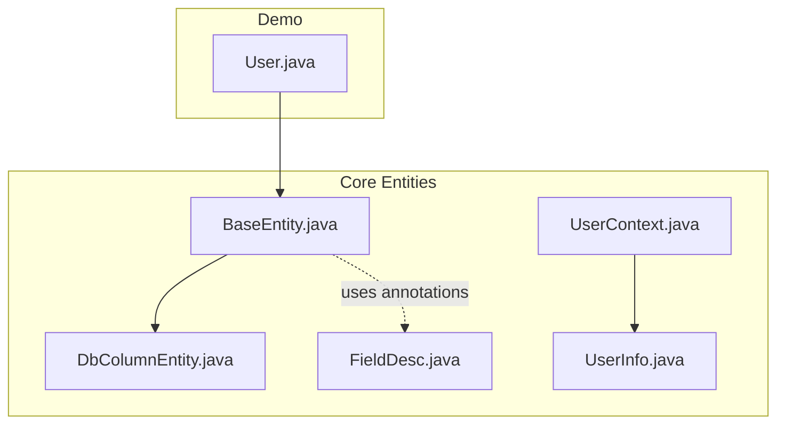
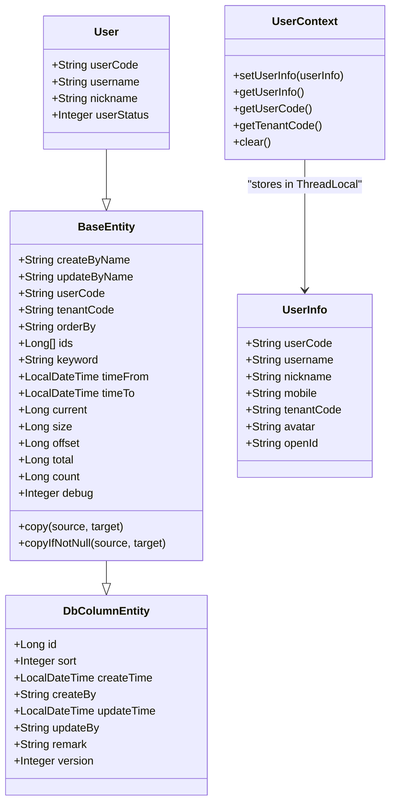
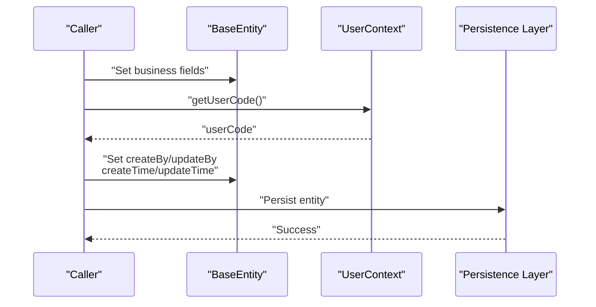
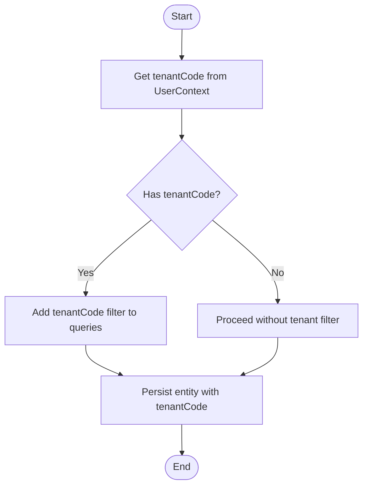
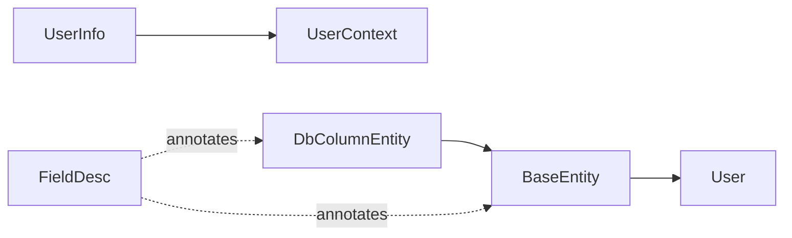

# Entity System

<cite>
**Referenced Files in This Document**
- [BaseEntity.java](file://sh-core/src/main/java/com/wkclz/core/base/BaseEntity.java)
- [DbColumnEntity.java](file://sh-core/src/main/java/com/wkclz/core/base/DbColumnEntity.java)
- [UserContext.java](file://sh-core/src/main/java/com/wkclz/core/user/UserContext.java)
- [UserInfo.java](file://sh-core/src/main/java/com/wkclz/core/base/UserInfo.java)
- [FieldDesc.java](file://sh-core/src/main/java/com/wkclz/core/annotation/FieldDesc.java)
- [User.java](file://sh-demo/src/main/java/com/wkclz/demo/bean/entity/User.java)
</cite>

## Table of Contents
1. [Introduction](#introduction)
2. [Project Structure](#project-structure)
3. [Core Components](#core-components)
4. [Architecture Overview](#architecture-overview)
5. [Detailed Component Analysis](#detailed-component-analysis)
6. [Dependency Analysis](#dependency-analysis)
7. [Performance Considerations](#performance-considerations)
8. [Troubleshooting Guide](#troubleshooting-guide)
9. [Conclusion](#conclusion)
10. [Appendices](#appendices)

## Introduction
This document describes the entity system that underpins data modeling in the SH Framework. It focuses on the foundational entity classes, audit fields, multi-tenant support, inheritance patterns, and the user context mechanism for thread-local storage. Practical examples demonstrate entity inheritance, audit field population, and multi-tenant isolation. Best practices and thread-safety considerations are included to guide extension and customization of entity models.

## Project Structure
The entity system resides primarily in the core module and is exemplified by a demo entity in the demo module. The key files are:
- Base entity hierarchy: DbColumnEntity and BaseEntity
- User context and user info: UserContext and UserInfo
- Supporting annotation: FieldDesc
- Example entity: User

**Diagram sources**
- [BaseEntity.java:1-94](file://sh-core/src/main/java/com/wkclz/core/base/BaseEntity.java#L1-L94)
- [DbColumnEntity.java:1-39](file://sh-core/src/main/java/com/wkclz/core/base/DbColumnEntity.java#L1-L39)
- [UserContext.java:1-54](file://sh-core/src/main/java/com/wkclz/core/user/UserContext.java#L1-L54)
- [UserInfo.java:1-36](file://sh-core/src/main/java/com/wkclz/core/base/UserInfo.java#L1-L36)
- [FieldDesc.java:1-27](file://sh-core/src/main/java/com/wkclz/core/annotation/FieldDesc.java#L1-L27)
- [User.java:1-28](file://sh-demo/src/main/java/com/wkclz/demo/bean/entity/User.java#L1-L28)

**Section sources**
- [BaseEntity.java:1-94](file://sh-core/src/main/java/com/wkclz/core/base/BaseEntity.java#L1-L94)
- [DbColumnEntity.java:1-39](file://sh-core/src/main/java/com/wkclz/core/base/DbColumnEntity.java#L1-L39)
- [UserContext.java:1-54](file://sh-core/src/main/java/com/wkclz/core/user/UserContext.java#L1-L54)
- [UserInfo.java:1-36](file://sh-core/src/main/java/com/wkclz/core/base/UserInfo.java#L1-L36)
- [FieldDesc.java:1-27](file://sh-core/src/main/java/com/wkclz/core/annotation/FieldDesc.java#L1-L27)
- [User.java:1-28](file://sh-demo/src/main/java/com/wkclz/demo/bean/entity/User.java#L1-L28)

## Core Components
- DbColumnEntity: Defines standardized database-mapped fields including identifiers, timestamps, creators/updaters, remarks, and versioning. These fields are consistently named and annotated for documentation and reflection.
- BaseEntity: Extends DbColumnEntity and adds user and tenant metadata, pagination/query helpers, and utility methods for copying entity instances.
- UserContext: Provides thread-local storage for UserInfo, enabling safe per-request retrieval of user and tenant codes.
- UserInfo: Captures essential user attributes including userCode, username, nickname, mobile, tenantCode, avatar, and openId.
- FieldDesc: Annotation used to describe fields for documentation and reflection-based tooling.
- User (example): Demonstrates inheritance from BaseEntity and addition of domain-specific fields.

Key responsibilities:
- Audit fields: createTime, createBy, updateTime, updateBy
- Multi-tenancy: tenantCode
- User identity: userCode, createByName, updateByName
- Pagination and query: current, size, offset, total, count, orderBy, ids, keyword, timeFrom, timeTo
- Reflection and documentation: FieldDesc annotations on fields

**Section sources**
- [DbColumnEntity.java:1-39](file://sh-core/src/main/java/com/wkclz/core/base/DbColumnEntity.java#L1-L39)
- [BaseEntity.java:1-94](file://sh-core/src/main/java/com/wkclz/core/base/BaseEntity.java#L1-L94)
- [UserContext.java:1-54](file://sh-core/src/main/java/com/wkclz/core/user/UserContext.java#L1-L54)
- [UserInfo.java:1-36](file://sh-core/src/main/java/com/wkclz/core/base/UserInfo.java#L1-L36)
- [FieldDesc.java:1-27](file://sh-core/src/main/java/com/wkclz/core/annotation/FieldDesc.java#L1-L27)
- [User.java:1-28](file://sh-demo/src/main/java/com/wkclz/demo/bean/entity/User.java#L1-L28)

## Architecture Overview
The entity system follows a layered inheritance model:
- DbColumnEntity defines database schema-aligned fields.
- BaseEntity inherits DbColumnEntity and augments with user, tenant, and query/pagination helpers.
- Domain entities (e.g., User) inherit BaseEntity to gain audit and multi-tenant capabilities automatically.

**Diagram sources**
- [DbColumnEntity.java:1-39](file://sh-core/src/main/java/com/wkclz/core/base/DbColumnEntity.java#L1-L39)
- [BaseEntity.java:1-94](file://sh-core/src/main/java/com/wkclz/core/base/BaseEntity.java#L1-L94)
- [User.java:1-28](file://sh-demo/src/main/java/com/wkclz/demo/bean/entity/User.java#L1-L28)
- [UserInfo.java:1-36](file://sh-core/src/main/java/com/wkclz/core/base/UserInfo.java#L1-L36)
- [UserContext.java:1-54](file://sh-core/src/main/java/com/wkclz/core/user/UserContext.java#L1-L54)

## Detailed Component Analysis

### DbColumnEntity
Purpose:
- Standardizes database-mapped fields for consistent persistence semantics across entities.
- Supports auditing via createBy/createTime and updateBy/updateTime.
- Provides a version field for optimistic locking scenarios.
- Includes a sort field for ordering and a remark field for free-form notes.

Design notes:
- Serializable to enable transport across layers.
- Lombok-generated getters/setters for concise code.
- FieldDesc annotations for documentation and reflection-based tooling.

Audit and versioning implications:
- Consistent naming enables shared persistence logic and tooling.
- Version increments can be managed by persistence layers to prevent lost updates.

**Section sources**
- [DbColumnEntity.java:1-39](file://sh-core/src/main/java/com/wkclz/core/base/DbColumnEntity.java#L1-L39)
- [FieldDesc.java:1-27](file://sh-core/src/main/java/com/wkclz/core/annotation/FieldDesc.java#L1-L27)

### BaseEntity
Purpose:
- Extends DbColumnEntity with user and tenant awareness.
- Adds pagination and query helpers for list/search operations.
- Provides utility methods for copying entities with optional null filtering.

Key fields:
- User and tenant metadata: createByName, updateByName, userCode, tenantCode.
- Query helpers: orderBy, ids, keyword, timeFrom, timeTo.
- Pagination: current, size, offset, total, count.

Copy utilities:
- copy(source, target): copies all properties.
- copyIfNotNull(source, target): copies only non-null properties.
- Behavior handles target instantiation if absent and throws a system exception if instantiation fails.

Inheritance pattern:
- Domain entities inherit from BaseEntity to automatically gain audit and multi-tenant fields.

**Section sources**
- [BaseEntity.java:1-94](file://sh-core/src/main/java/com/wkclz/core/base/BaseEntity.java#L1-L94)
- [FieldDesc.java:1-27](file://sh-core/src/main/java/com/wkclz/core/annotation/FieldDesc.java#L1-L27)

### UserContext and UserInfo
Purpose:
- UserContext stores UserInfo in a ThreadLocal to provide per-thread access to user and tenant codes.
- UserInfo encapsulates user identity and tenant association.

Thread-safety:
- ThreadLocal ensures isolation across threads.
- Clear method removes the stored context to avoid memory leaks in pooled environments.

Usage:
- Retrieve userCode and tenantCode for audit field population and multi-tenant filtering.
- Clear after request completion to prevent leaks.

**Section sources**
- [UserContext.java:1-54](file://sh-core/src/main/java/com/wkclz/core/user/UserContext.java#L1-L54)
- [UserInfo.java:1-36](file://sh-core/src/main/java/com/wkclz/core/base/UserInfo.java#L1-L36)

### Example Entity: User
Purpose:
- Demonstrates inheritance from BaseEntity and addition of domain-specific fields.

Highlights:
- Inherits audit and multi-tenant fields from BaseEntity.
- Adds business fields such as username, nickname, and userStatus.
- Uses Lombok for concise property handling and equals/hashCode via @EqualsAndHashCode(callSuper = true).

**Section sources**
- [User.java:1-28](file://sh-demo/src/main/java/com/wkclz/demo/bean/entity/User.java#L1-L28)
- [BaseEntity.java:1-94](file://sh-core/src/main/java/com/wkclz/core/base/BaseEntity.java#L1-L94)

### Audit Fields Population Flow
This sequence illustrates how audit fields are populated during persistence operations using UserContext.

**Diagram sources**
- [BaseEntity.java:1-94](file://sh-core/src/main/java/com/wkclz/core/base/BaseEntity.java#L1-L94)
- [UserContext.java:1-54](file://sh-core/src/main/java/com/wkclz/core/user/UserContext.java#L1-L54)

### Multi-Tenant Data Isolation Flow
This flow demonstrates tenant-aware filtering and isolation using tenantCode.

**Diagram sources**
- [BaseEntity.java:1-94](file://sh-core/src/main/java/com/wkclz/core/base/BaseEntity.java#L1-L94)
- [UserContext.java:1-54](file://sh-core/src/main/java/com/wkclz/core/user/UserContext.java#L1-L54)

## Dependency Analysis
Relationships:
- BaseEntity depends on DbColumnEntity for audit/version fields.
- User inherits BaseEntity to gain audit and multi-tenant fields.
- UserContext depends on UserInfo for storing user and tenant information.
- FieldDesc annotates entities and fields for documentation and reflection.

**Diagram sources**
- [BaseEntity.java:1-94](file://sh-core/src/main/java/com/wkclz/core/base/BaseEntity.java#L1-L94)
- [DbColumnEntity.java:1-39](file://sh-core/src/main/java/com/wkclz/core/base/DbColumnEntity.java#L1-L39)
- [User.java:1-28](file://sh-demo/src/main/java/com/wkclz/demo/bean/entity/User.java#L1-L28)
- [UserInfo.java:1-36](file://sh-core/src/main/java/com/wkclz/core/base/UserInfo.java#L1-L36)
- [UserContext.java:1-54](file://sh-core/src/main/java/com/wkclz/core/user/UserContext.java#L1-L54)
- [FieldDesc.java:1-27](file://sh-core/src/main/java/com/wkclz/core/annotation/FieldDesc.java#L1-L27)

**Section sources**
- [BaseEntity.java:1-94](file://sh-core/src/main/java/com/wkclz/core/base/BaseEntity.java#L1-L94)
- [DbColumnEntity.java:1-39](file://sh-core/src/main/java/com/wkclz/core/base/DbColumnEntity.java#L1-L39)
- [User.java:1-28](file://sh-demo/src/main/java/com/wkclz/demo/bean/entity/User.java#L1-L28)
- [UserInfo.java:1-36](file://sh-core/src/main/java/com/wkclz/core/base/UserInfo.java#L1-L36)
- [UserContext.java:1-54](file://sh-core/src/main/java/com/wkclz/core/user/UserContext.java#L1-L54)
- [FieldDesc.java:1-27](file://sh-core/src/main/java/com/wkclz/core/annotation/FieldDesc.java#L1-L27)

## Performance Considerations
- Audit fields overhead: Setting createBy/createTime and updateBy/updateTime is O(1) per operation; minimal cost but ensure not to repeat unnecessarily.
- Version increments: Incrementing version for optimistic locking adds a single integer update; keep version updates conditional to reduce contention.
- ThreadLocal usage: UserContext uses ThreadLocal for fast per-thread access; ensure clear() is called to avoid memory leaks in container-managed threads.
- Reflection costs: FieldDesc annotations are retained at runtime; heavy reflection-based processing should be cached or minimized in hot paths.
- Copy utilities: copy/copyIfNotNull rely on reflection-based copying; use judiciously in high-throughput scenarios.

[No sources needed since this section provides general guidance]

## Troubleshooting Guide
Common issues and resolutions:
- Missing user context: If userCode is null when setting audit fields, verify that UserContext.setUserInfo was called during authentication and that clear() is invoked after the request completes.
- Instantiation failures: copy/copyIfNotNull requires a no-argument constructor; ensure target classes meet this requirement or handle exceptions appropriately.
- Tenant isolation gaps: Confirm tenantCode is propagated to entities and used in queries to prevent cross-tenant data leakage.
- Reflection-based tooling: If documentation or reflection tools fail to read FieldDesc, ensure annotations are retained at runtime and classes are not obfuscated in ways that strip metadata.

**Section sources**
- [BaseEntity.java:59-94](file://sh-core/src/main/java/com/wkclz/core/base/BaseEntity.java#L59-L94)
- [UserContext.java:1-54](file://sh-core/src/main/java/com/wkclz/core/user/UserContext.java#L1-L54)
- [FieldDesc.java:1-27](file://sh-core/src/main/java/com/wkclz/core/annotation/FieldDesc.java#L1-L27)

## Conclusion
The SH Framework’s entity system provides a robust, consistent foundation for data modeling with standardized audit fields, multi-tenant support, and convenient inheritance patterns. By extending BaseEntity, developers gain out-of-the-box capabilities for auditing, pagination, and tenant isolation. UserContext ensures thread-safe access to user and tenant information, while FieldDesc supports documentation and reflection-based tooling. Following the best practices outlined here will help maintain performance, correctness, and scalability across applications.

[No sources needed since this section summarizes without analyzing specific files]

## Appendices

### Best Practices for Extending BaseEntity
- Always inherit from BaseEntity to leverage audit and multi-tenant fields.
- Populate createBy/createTime and updateBy/updateTime before persisting.
- Set tenantCode on entities for multi-tenant filtering and isolation.
- Use copy/copyIfNotNull for DTO conversions and avoid manual property mapping.
- Keep business entities focused; place cross-cutting concerns (audit, tenant) in BaseEntity.

**Section sources**
- [BaseEntity.java:1-94](file://sh-core/src/main/java/com/wkclz/core/base/BaseEntity.java#L1-L94)
- [UserContext.java:1-54](file://sh-core/src/main/java/com/wkclz/core/user/UserContext.java#L1-L54)