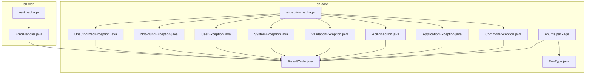
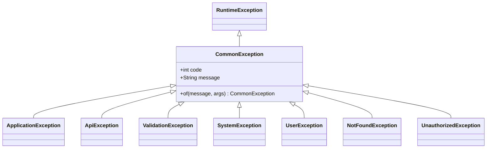
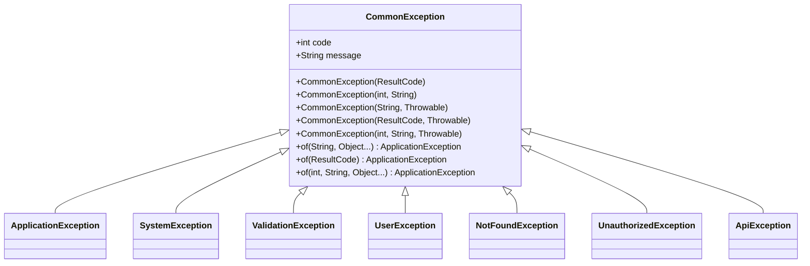
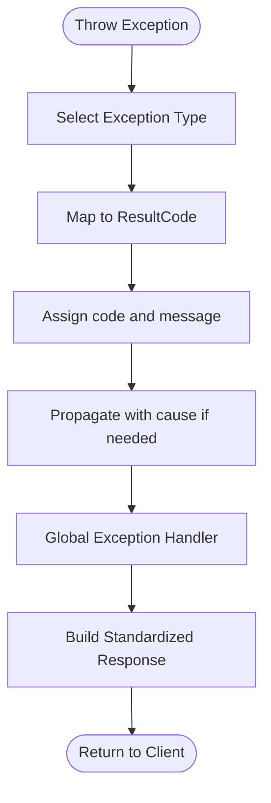
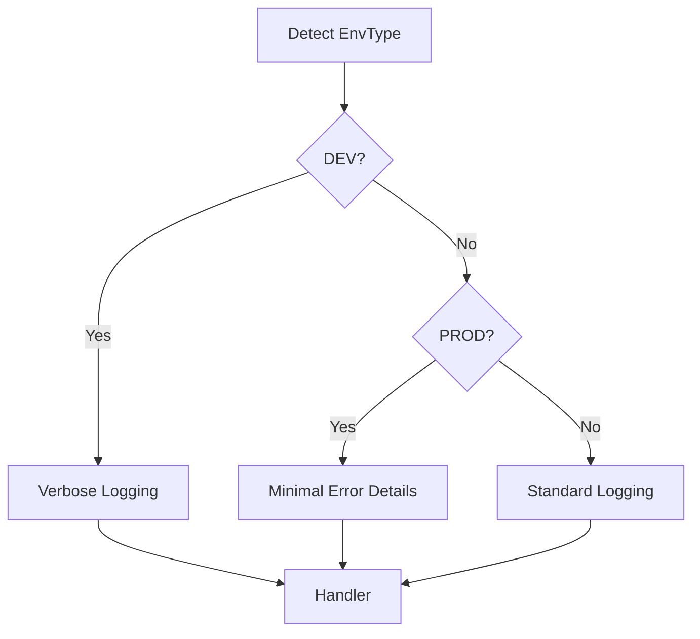
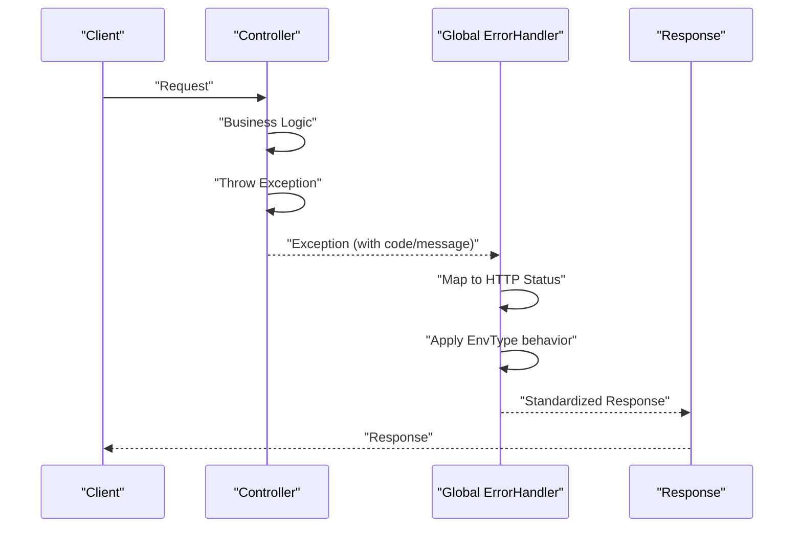
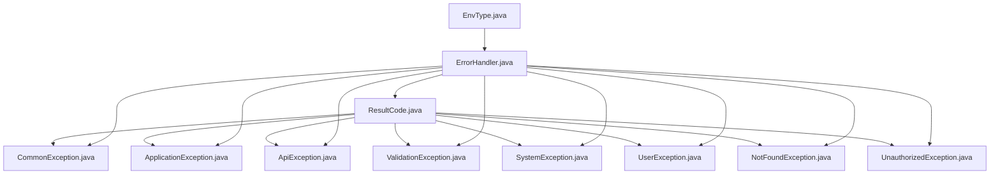

# Exception Management

<cite>
**Referenced Files in This Document**
- [ApplicationException.java](file://sh-core/src/main/java/com/wkclz/core/exception/ApplicationException.java)
- [ApiException.java](file://sh-core/src/main/java/com/wkclz/core/exception/ApiException.java)
- [CommonException.java](file://sh-core/src/main/java/com/wkclz/core/exception/CommonException.java)
- [NotFoundException.java](file://sh-core/src/main/java/com/wkclz/core/exception/NotFoundException.java)
- [SystemException.java](file://sh-core/src/main/java/com/wkclz/core/exception/SystemException.java)
- [UnauthorizedException.java](file://sh-core/src/main/java/com/wkclz/core/exception/UnauthorizedException.java)
- [UserException.java](file://sh-core/src/main/java/com/wkclz/core/exception/UserException.java)
- [ValidationException.java](file://sh-core/src/main/java/com/wkclz/core/exception/ValidationException.java)
- [ResultCode.java](file://sh-core/src/main/java/com/wkclz/core/enums/ResultCode.java)
- [EnvType.java](file://sh-core/src/main/java/com/wkclz/core/enums/EnvType.java)
- [ErrorHandler.java](file://sh-web/src/main/java/com/wkclz/web/rest/ErrorHandler.java)
- [US-003-异常体系与分类处理.md](file://docs/stories/US-003-异常体系与分类处理.md)
- [US-005-结果码与业务错误码体系.md](file://docs/stories/US-005-结果码与业务错误码体系.md)
- [SKILL.md](file://.agents/skills/sh-web/SKILL.md)
</cite>

## Table of Contents
1. [Introduction](#introduction)
2. [Project Structure](#project-structure)
3. [Core Components](#core-components)
4. [Architecture Overview](#architecture-overview)
5. [Detailed Component Analysis](#detailed-component-analysis)
6. [Dependency Analysis](#dependency-analysis)
7. [Performance Considerations](#performance-considerations)
8. [Troubleshooting Guide](#troubleshooting-guide)
9. [Conclusion](#conclusion)
10. [Appendices](#appendices)

## Introduction
This document describes the exception management system in the framework, focusing on the hierarchical exception classes and their roles in error handling, error code assignment, and environment-aware behavior. It covers the exception hierarchy starting with CommonException and its subclasses (ApplicationException, ApiException, ValidationException, SystemException, UserException, NotFoundException, UnauthorizedException), explains how error codes are assigned via ResultCode, and how environment-specific behavior is handled through EnvType. Practical guidance is provided for throwing and catching exceptions, creating custom exceptions, integrating with global exception handlers, exception serialization, logging patterns, debugging support, propagation best practices, and error message localization.

## Project Structure
The exception management system resides primarily in the core module under the exception package and is complemented by shared enums (ResultCode and EnvType). Global exception handling is implemented in the web module.

**Diagram sources**
- [ApplicationException.java:1-48](file://sh-core/src/main/java/com/wkclz/core/exception/ApplicationException.java#L1-L48)
- [ResultCode.java:1-77](file://sh-core/src/main/java/com/wkclz/core/enums/ResultCode.java#L1-L77)
- [EnvType.java:1-27](file://sh-core/src/main/java/com/wkclz/core/enums/EnvType.java#L1-L27)
- [ErrorHandler.java](file://sh-web/src/main/java/com/wkclz/web/rest/ErrorHandler.java)

**Section sources**
- [ApplicationException.java:1-48](file://sh-core/src/main/java/com/wkclz/core/exception/ApplicationException.java#L1-L48)
- [ResultCode.java:1-77](file://sh-core/src/main/java/com/wkclz/core/enums/ResultCode.java#L1-L77)
- [EnvType.java:1-27](file://sh-core/src/main/java/com/wkclz/core/enums/EnvType.java#L1-L27)
- [ErrorHandler.java](file://sh-web/src/main/java/com/wkclz/web/rest/ErrorHandler.java)

## Core Components
- CommonException: Base runtime exception that carries an integer error code and a message. It supports construction from ResultCode, explicit code/message pairs, and throwable causes. It also provides factory-style static methods for convenient instantiation and message templating.
- ApplicationException: Application-level exception extending CommonException. It mirrors CommonException constructors and adds convenience static factories for ResultCode and formatted messages.
- ApiException: API-level exception extending CommonException. Intended for transport-layer or API boundary errors.
- ValidationException: Specialized for parameter and payload validation failures. Typically mapped to HTTP 400 with appropriate ResultCode.
- SystemException: Used for unexpected system-level errors. Supports templated messages and cause chaining.
- UserException: Dedicated to user-related operational errors (e.g., permission, session, tenant issues).
- NotFoundException: Signals resource-not-found scenarios, commonly mapped to HTTP 404.
- UnauthorizedException: Indicates lack of authorization or invalid credentials, typically mapped to HTTP 401.
- ResultCode: Standardized enumeration of error codes aligned with HTTP semantics and business domains. Provides code and message pairs for consistent error reporting.
- EnvType: Enum representing deployment environments (development, integration, acceptance, production) enabling environment-aware behavior in logging and alerting.

**Section sources**
- [CommonException.java](file://sh-core/src/main/java/com/wkclz/core/exception/CommonException.java)
- [ApplicationException.java:1-48](file://sh-core/src/main/java/com/wkclz/core/exception/ApplicationException.java#L1-L48)
- [ApiException.java](file://sh-core/src/main/java/com/wkclz/core/exception/ApiException.java)
- [ValidationException.java](file://sh-core/src/main/java/com/wkclz/core/exception/ValidationException.java)
- [SystemException.java](file://sh-core/src/main/java/com/wkclz/core/exception/SystemException.java)
- [UserException.java](file://sh-core/src/main/java/com/wkclz/core/exception/UserException.java)
- [NotFoundException.java](file://sh-core/src/main/java/com/wkclz/core/exception/NotFoundException.java)
- [UnauthorizedException.java](file://sh-core/src/main/java/com/wkclz/core/exception/UnauthorizedException.java)
- [ResultCode.java:1-77](file://sh-core/src/main/java/com/wkclz/core/enums/ResultCode.java#L1-L77)
- [EnvType.java:1-27](file://sh-core/src/main/java/com/wkclz/core/enums/EnvType.java#L1-L27)

## Architecture Overview
The exception hierarchy is designed to enable precise error classification and global handling. Each exception type encapsulates an error code via ResultCode and can carry a cause for stack trace propagation. Global exception handling in the web module translates these exceptions into standardized HTTP responses and logs.

**Diagram sources**
- [US-003-异常体系与分类处理.md:14-36](file://docs/stories/US-003-异常体系与分类处理.md#L14-L36)

## Detailed Component Analysis

### Exception Hierarchy and Construction Patterns
- Construction variants:
  - From ResultCode: Ensures consistent code/message pairing aligned with ResultCode.
  - From explicit code/message: Allows domain-specific codes outside the standard set.
  - With cause: Preserves stack traces for debugging and root-cause analysis.
  - Templated messages: Uses a formatter to build localized messages with arguments.
- Static factory methods:
  - Convenience methods for rapid exception creation with optional formatting and ResultCode mapping.

**Diagram sources**
- [ApplicationException.java:10-47](file://sh-core/src/main/java/com/wkclz/core/exception/ApplicationException.java#L10-L47)
- [SystemException.java](file://sh-core/src/main/java/com/wkclz/core/exception/SystemException.java)
- [ValidationException.java](file://sh-core/src/main/java/com/wkclz/core/exception/ValidationException.java)
- [UserException.java](file://sh-core/src/main/java/com/wkclz/core/exception/UserException.java)
- [NotFoundException.java](file://sh-core/src/main/java/com/wkclz/core/exception/NotFoundException.java)
- [UnauthorizedException.java](file://sh-core/src/main/java/com/wkclz/core/exception/UnauthorizedException.java)
- [ApiException.java](file://sh-core/src/main/java/com/wkclz/core/exception/ApiException.java)

**Section sources**
- [ApplicationException.java:10-47](file://sh-core/src/main/java/com/wkclz/core/exception/ApplicationException.java#L10-L47)

### Error Code Assignment via ResultCode
- ResultCode defines standard HTTP-aligned codes (e.g., 200, 400, 401, 403, 404, 500) and business-domain codes segmented by functional areas (e.g., tokens, CORS/routing, login/captcha, data operations, network, orders).
- Exceptions carry an integer code and message derived from ResultCode, ensuring consistent error reporting across services and clients.

**Diagram sources**
- [ResultCode.java:9-14](file://sh-core/src/main/java/com/wkclz/core/enums/ResultCode.java#L9-L14)
- [ResultCode.java:20-58](file://sh-core/src/main/java/com/wkclz/core/enums/ResultCode.java#L20-L58)
- [ErrorHandler.java](file://sh-web/src/main/java/com/wkclz/web/rest/ErrorHandler.java)

**Section sources**
- [ResultCode.java:1-77](file://sh-core/src/main/java/com/wkclz/core/enums/ResultCode.java#L1-L77)
- [SKILL.md:441-490](file://.agents/skills/sh-web/SKILL.md#L441-L490)

### Environment-Specific Behavior via EnvType
- EnvType enumerates environments: development, integration, acceptance, and production.
- Use EnvType to tailor logging verbosity, alert thresholds, and error disclosure policies during global exception handling.

**Diagram sources**
- [EnvType.java:10-26](file://sh-core/src/main/java/com/wkclz/core/enums/EnvType.java#L10-L26)
- [ErrorHandler.java](file://sh-web/src/main/java/com/wkclz/web/rest/ErrorHandler.java)

**Section sources**
- [EnvType.java:1-27](file://sh-core/src/main/java/com/wkclz/core/enums/EnvType.java#L1-L27)

### Global Exception Handling Integration
- The web module’s global error handler integrates with the exception hierarchy to:
  - Extract the error code and message from the thrown exception.
  - Determine HTTP status codes based on exception type and ResultCode mapping.
  - Build standardized responses for clients.
  - Optionally trigger alerts or notifications depending on environment and severity.

**Diagram sources**
- [ErrorHandler.java](file://sh-web/src/main/java/com/wkclz/web/rest/ErrorHandler.java)
- [US-003-异常体系与分类处理.md:39-42](file://docs/stories/US-003-异常体系与分类处理.md#L39-L42)

**Section sources**
- [ErrorHandler.java](file://sh-web/src/main/java/com/wkclz/web/rest/ErrorHandler.java)

### Practical Examples and Patterns
- Throwing exceptions:
  - Validation failure: throw ValidationException with a ResultCode mapped to HTTP 400.
  - Resource not found: throw NotFoundException with a ResultCode mapped to HTTP 404.
  - Authorization issue: throw UnauthorizedException with a ResultCode mapped to HTTP 401.
  - System error: throw SystemException with a templated message and cause for tracing.
  - Application-level business error: throw ApplicationException with a ResultCode or custom code/message.
- Catching and rethrowing:
  - Catch lower-level exceptions, wrap with ApplicationException or SystemException, preserve cause, and rethrow for global handling.
- Creating custom exceptions:
  - Extend CommonException or its subclasses and define a dedicated ResultCode or code range for domain-specific errors.
- Global handler integration:
  - Ensure exceptions carry ResultCode-derived codes so the handler can map them to HTTP status and response bodies consistently.

**Section sources**
- [ValidationException.java](file://sh-core/src/main/java/com/wkclz/core/exception/ValidationException.java)
- [NotFoundException.java](file://sh-core/src/main/java/com/wkclz/core/exception/NotFoundException.java)
- [UnauthorizedException.java](file://sh-core/src/main/java/com/wkclz/core/exception/UnauthorizedException.java)
- [SystemException.java](file://sh-core/src/main/java/com/wkclz/core/exception/SystemException.java)
- [ApplicationException.java:37-47](file://sh-core/src/main/java/com/wkclz/core/exception/ApplicationException.java#L37-L47)
- [US-003-异常体系与分类处理.md:39-42](file://docs/stories/US-003-异常体系与分类处理.md#L39-L42)

### Serialization, Logging, and Debugging Support
- Serialization:
  - Exceptions are serializable by default as they extend Throwable. Ensure only necessary fields are serialized in custom implementations.
- Logging:
  - Use EnvType to adjust log levels and content. In development, include full stack traces; in production, limit sensitive details.
  - Apply masking patterns for sensitive fields in logs to protect PII and secrets.
- Debugging:
  - Preserve cause chains to trace root causes effectively.
  - Utilize templated messages for contextual debugging information without leaking secrets.

**Section sources**
- [EnvType.java:1-27](file://sh-core/src/main/java/com/wkclz/core/enums/EnvType.java#L1-L27)
- [MaskingPatternLayout.java](file://sh-core/src/main/java/com/wkclz/core/log/MaskingPatternLayout.java)

### Best Practices for Exception Propagation and Localization
- Propagation:
  - Wrap checked exceptions into unchecked CommonException subclasses when crossing boundaries.
  - Always pass the original cause to maintain traceability.
  - Avoid swallowing exceptions; rethrow or convert appropriately.
- Localization:
  - Use templated messages with placeholders for dynamic parts while keeping static messages localized.
  - Keep error keys or identifiers alongside localized messages for backend-driven localization.

**Section sources**
- [ApplicationException.java:24-34](file://sh-core/src/main/java/com/wkclz/core/exception/ApplicationException.java#L24-L34)
- [SystemException.java](file://sh-core/src/main/java/com/wkclz/core/exception/SystemException.java)

## Dependency Analysis
The exception classes depend on ResultCode for standardized error codes and can be consumed by the global error handler to produce consistent HTTP responses. EnvType influences logging and alerting behavior during exception handling.

**Diagram sources**
- [ResultCode.java:1-77](file://sh-core/src/main/java/com/wkclz/core/enums/ResultCode.java#L1-L77)
- [ApplicationException.java:1-48](file://sh-core/src/main/java/com/wkclz/core/exception/ApplicationException.java#L1-L48)
- [ApiException.java](file://sh-core/src/main/java/com/wkclz/core/exception/ApiException.java)
- [ValidationException.java](file://sh-core/src/main/java/com/wkclz/core/exception/ValidationException.java)
- [SystemException.java](file://sh-core/src/main/java/com/wkclz/core/exception/SystemException.java)
- [UserException.java](file://sh-core/src/main/java/com/wkclz/core/exception/UserException.java)
- [NotFoundException.java](file://sh-core/src/main/java/com/wkclz/core/exception/NotFoundException.java)
- [UnauthorizedException.java](file://sh-core/src/main/java/com/wkclz/core/exception/UnauthorizedException.java)
- [ErrorHandler.java](file://sh-web/src/main/java/com/wkclz/web/rest/ErrorHandler.java)
- [EnvType.java:1-27](file://sh-core/src/main/java/com/wkclz/core/enums/EnvType.java#L1-L27)

**Section sources**
- [ResultCode.java:1-77](file://sh-core/src/main/java/com/wkclz/core/enums/ResultCode.java#L1-L77)
- [ErrorHandler.java](file://sh-web/src/main/java/com/wkclz/web/rest/ErrorHandler.java)
- [EnvType.java:1-27](file://sh-core/src/main/java/com/wkclz/core/enums/EnvType.java#L1-L27)

## Performance Considerations
- Avoid excessive wrapping of exceptions; keep the cause chain concise to reduce overhead in serialization and logging.
- Prefer ResultCode constants to minimize string allocations and improve lookup performance.
- Limit detailed stack traces in production to reduce log volume and potential security exposure.

## Troubleshooting Guide
- If a thrown exception does not map to the expected HTTP status:
  - Verify the exception type and its associated ResultCode mapping in the global error handler.
  - Confirm that the exception was constructed with a proper ResultCode or code/message pair.
- If error messages are not localized:
  - Ensure templated messages are built with the intended locale and that the handler returns the localized message to clients.
- If environment-specific logs are missing details:
  - Check EnvType detection and handler logic to ensure verbose logging is enabled for development and minimal disclosure for production.

**Section sources**
- [ErrorHandler.java](file://sh-web/src/main/java/com/wkclz/web/rest/ErrorHandler.java)
- [US-003-异常体系与分类处理.md:39-42](file://docs/stories/US-003-异常体系与分类处理.md#L39-L42)

## Conclusion
The exception management system provides a robust, hierarchical foundation for error handling across the framework. By leveraging CommonException and its specialized subclasses, aligning with ResultCode for standardized error codes, and integrating with a global error handler, applications gain consistent error reporting, environment-aware behavior, and strong debugging support. Following the recommended patterns ensures reliable propagation, localization-ready messages, and maintainable exception handling across services.

## Appendices
- ResultCode coverage includes HTTP-standard codes and business-domain segments for tokens, routing, login/captcha, data operations, network, and orders.
- EnvType supports environment-aware logging and alerting policies.

**Section sources**
- [ResultCode.java:1-77](file://sh-core/src/main/java/com/wkclz/core/enums/ResultCode.java#L1-L77)
- [EnvType.java:1-27](file://sh-core/src/main/java/com/wkclz/core/enums/EnvType.java#L1-L27)
- [SKILL.md:441-490](file://.agents/skills/sh-web/SKILL.md#L441-L490)