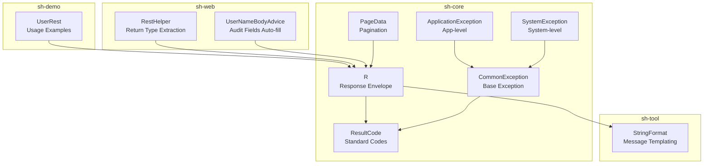
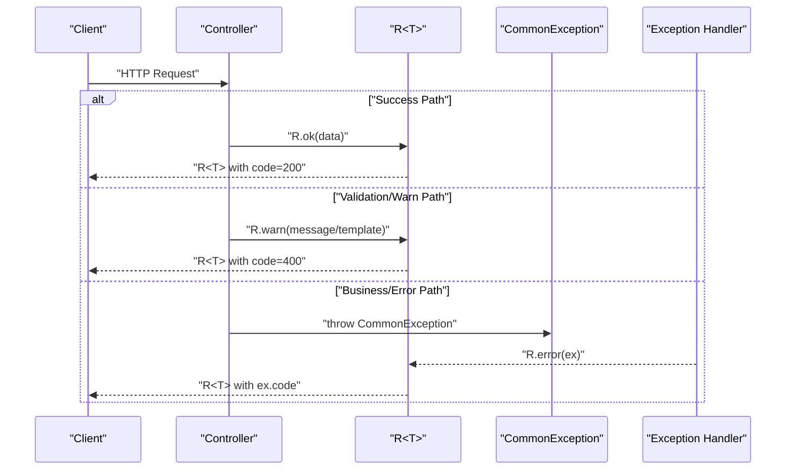
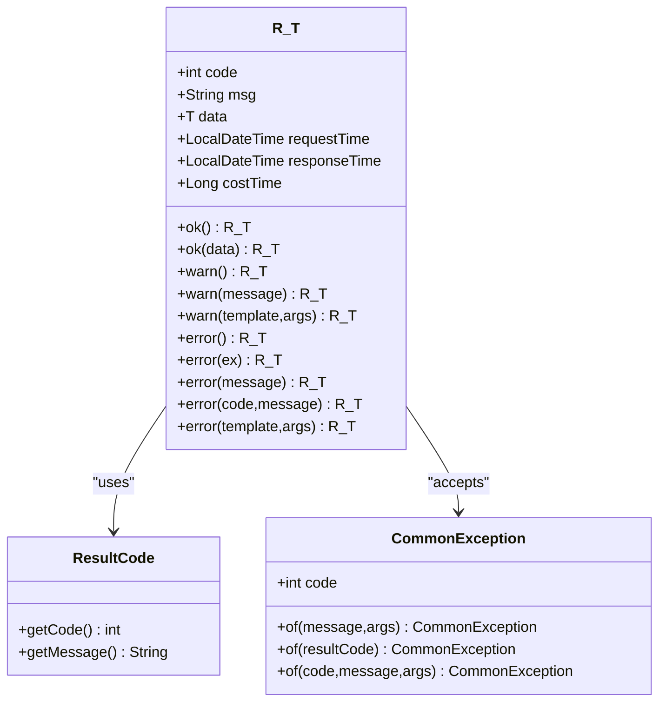
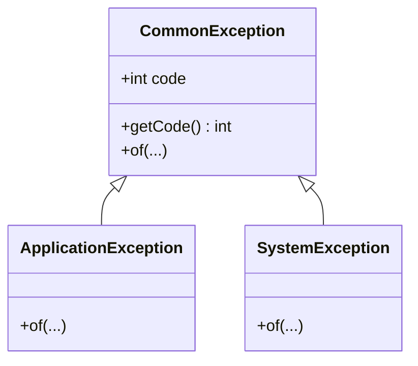
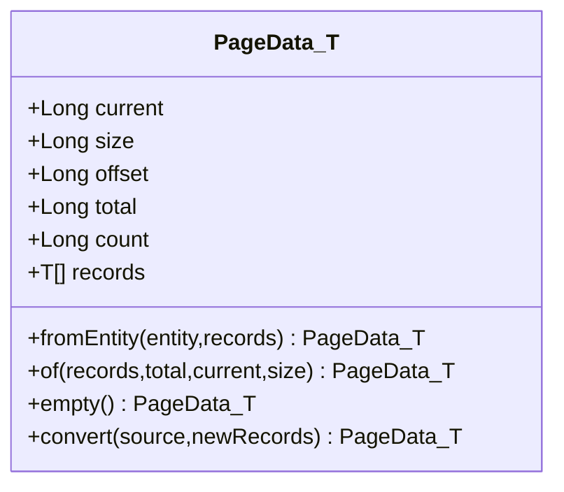
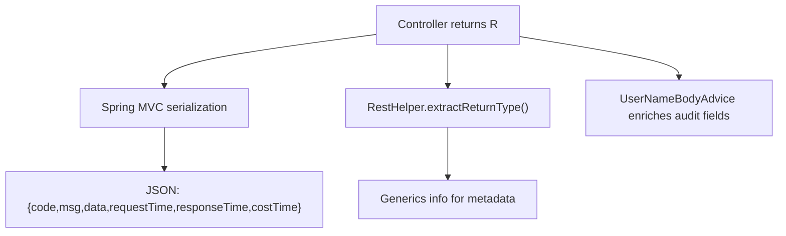
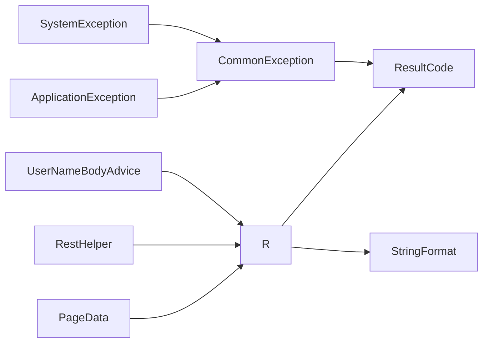

# Response Wrapper System

<cite>
**Referenced Files in This Document**
- [R.java](file://sh-core/src/main/java/com/wkclz/core/base/R.java)
- [ResultCode.java](file://sh-core/src/main/java/com/wkclz/core/enums/ResultCode.java)
- [CommonException.java](file://sh-core/src/main/java/com/wkclz/core/exception/CommonException.java)
- [ApplicationException.java](file://sh-core/src/main/java/com/wkclz/core/exception/ApplicationException.java)
- [SystemException.java](file://sh-core/src/main/java/com/wkclz/core/exception/SystemException.java)
- [StringFormat.java](file://sh-tool/src/main/java/com/wkclz/tool/utils/StringFormat.java)
- [PageData.java](file://sh-core/src/main/java/com/wkclz/core/base/PageData.java)
- [EntityResp.java](file://sh-web/src/main/java/com/wkclz/web/bean/EntityResp.java)
- [RestHelper.java](file://sh-web/src/main/java/com/wkclz/web/helper/RestHelper.java)
- [UserNameBodyAdvice.java](file://sh-web/src/main/java/com/wkclz/web/rest/UserNameBodyAdvice.java)
- [UserRest.java](file://sh-demo/src/main/java/com/wkclz/demo/rest/UserRest.java)
- [US-002-统一响应结果封装.md](file://docs/stories/US-002-统一响应结果封装.md)
- [US-005-结果码与业务错误码体系.md](file://docs/stories/US-005-结果码与业务错误码体系.md)
- [SKILL.md (sh-web)](file://.agents/skills/sh-web/SKILL.md)
</cite>

## Table of Contents
1. [Introduction](#introduction)
2. [Project Structure](#project-structure)
3. [Core Components](#core-components)
4. [Architecture Overview](#architecture-overview)
5. [Detailed Component Analysis](#detailed-component-analysis)
6. [Dependency Analysis](#dependency-analysis)
7. [Performance Considerations](#performance-considerations)
8. [Troubleshooting Guide](#troubleshooting-guide)
9. [Conclusion](#conclusion)
10. [Appendices](#appendices)

## Introduction
This document describes the unified response wrapper system centered on the R<T> class. It explains the response structure with success/error indicators, data payload, and error information fields. It documents the ResultCode enum covering standard success codes, validation errors, business exceptions, and system errors. It includes examples of successful responses, error responses, and custom result codes, along with serialization patterns and JSON structure. It also covers how to create custom response wrappers and extend the system, and addresses internationalization support for error messages and response customization options.

## Project Structure
The response wrapper system spans several modules:
- sh-core: Defines the R<T> response envelope, ResultCode enumeration, and exception hierarchy.
- sh-tool: Provides StringFormat utilities used for message templating.
- sh-web: Contains helpers and advice that influence response composition and metadata extraction.
- sh-demo: Demonstrates usage of R<T> in REST controllers.

**Diagram sources**
- [R.java:11-76](file://sh-core/src/main/java/com/wkclz/core/base/R.java#L11-L76)
- [ResultCode.java:7-77](file://sh-core/src/main/java/com/wkclz/core/enums/ResultCode.java#L7-L77)
- [CommonException.java:10-64](file://sh-core/src/main/java/com/wkclz/core/exception/CommonException.java#L10-L64)
- [ApplicationException.java:10-48](file://sh-core/src/main/java/com/wkclz/core/exception/ApplicationException.java#L10-L48)
- [SystemException.java:10-48](file://sh-core/src/main/java/com/wkclz/core/exception/SystemException.java#L10-L48)
- [StringFormat.java:23-63](file://sh-tool/src/main/java/com/wkclz/tool/utils/StringFormat.java#L23-L63)
- [PageData.java:14-185](file://sh-core/src/main/java/com/wkclz/core/base/PageData.java#L14-L185)
- [RestHelper.java:379-393](file://sh-web/src/main/java/com/wkclz/web/helper/RestHelper.java#L379-L393)
- [UserNameBodyAdvice.java:34-71](file://sh-web/src/main/java/com/wkclz/web/rest/UserNameBodyAdvice.java#L34-L71)
- [UserRest.java:227-282](file://sh-demo/src/main/java/com/wkclz/demo/rest/UserRest.java#L227-L282)

**Section sources**
- [R.java:11-76](file://sh-core/src/main/java/com/wkclz/core/base/R.java#L11-L76)
- [ResultCode.java:7-77](file://sh-core/src/main/java/com/wkclz/core/enums/ResultCode.java#L7-L77)
- [StringFormat.java:23-63](file://sh-tool/src/main/java/com/wkclz/tool/utils/StringFormat.java#L23-L63)
- [RestHelper.java:379-393](file://sh-web/src/main/java/com/wkclz/web/helper/RestHelper.java#L379-L393)
- [UserNameBodyAdvice.java:34-71](file://sh-web/src/main/java/com/wkclz/web/rest/UserNameBodyAdvice.java#L34-L71)
- [UserRest.java:227-282](file://sh-demo/src/main/java/com/wkclz/demo/rest/UserRest.java#L227-L282)

## Core Components
- R<T>: The unified response envelope carrying code, msg, data, plus timing fields. It offers factory methods for success, warning, and error responses, and supports templates via StringFormat.
- ResultCode: Enumerates standardized codes including HTTP-like statuses and business segments (tokens, CORS/routing, auth/verification, data operations, network, orders).
- Exception hierarchy: CommonException and its subclasses ApplicationException and SystemException carry business/system codes and messages, enabling R.error(ex) to propagate precise codes.
- StringFormat: Provides simple positional templating used by R.warn(...) and R.error(String template, ...) to produce localized, parameterized messages.
- PageData<T>: Pagination container used within R.data for list queries; integrates with R.ok(PageData) to deliver paginated responses.
- Web helpers: RestHelper extracts return generics for API metadata; UserNameBodyAdvice enriches audit fields in response bodies.

**Section sources**
- [R.java:11-76](file://sh-core/src/main/java/com/wkclz/core/base/R.java#L11-L76)
- [ResultCode.java:7-77](file://sh-core/src/main/java/com/wkclz/core/enums/ResultCode.java#L7-L77)
- [CommonException.java:10-64](file://sh-core/src/main/java/com/wkclz/core/exception/CommonException.java#L10-L64)
- [ApplicationException.java:10-48](file://sh-core/src/main/java/com/wkclz/core/exception/ApplicationException.java#L10-L48)
- [SystemException.java:10-48](file://sh-core/src/main/java/com/wkclz/core/exception/SystemException.java#L10-L48)
- [StringFormat.java:23-63](file://sh-tool/src/main/java/com/wkclz/tool/utils/StringFormat.java#L23-L63)
- [PageData.java:14-185](file://sh-core/src/main/java/com/wkclz/core/base/PageData.java#L14-L185)
- [RestHelper.java:379-393](file://sh-web/src/main/java/com/wkclz/web/helper/RestHelper.java#L379-L393)
- [UserNameBodyAdvice.java:34-71](file://sh-web/src/main/java/com/wkclz/web/rest/UserNameBodyAdvice.java#L34-L71)

## Architecture Overview
The response lifecycle:
- Controllers return R<T>.
- R<T> encapsulates code, msg, data, and timing fields.
- Exceptions are mapped to R.error(...) with appropriate codes.
- For paginated data, R.ok(PageData<T>) is returned.
- Web helpers extract return generics for metadata and optionally enrich audit fields.

**Diagram sources**
- [R.java:37-75](file://sh-core/src/main/java/com/wkclz/core/base/R.java#L37-L75)
- [CommonException.java:10-64](file://sh-core/src/main/java/com/wkclz/core/exception/CommonException.java#L10-L64)
- [SKILL.md (sh-web):41-61](file://.agents/skills/sh-web/SKILL.md#L41-L61)

## Detailed Component Analysis

### R<T> Response Envelope
R<T> defines the canonical response shape:
- code: integer status code
- msg: human-readable message
- data: typed payload (T)
- requestTime, responseTime, costTime: timing metadata

Static factory methods:
- ok(): success with code=200
- ok(T data): success with data payload
- warn(): validation error with code=400
- warn(String message): validation error with custom message
- warn(String template, Object... args): templated validation message
- error(): internal server error with code=500
- error(CommonException): business/system error with ex.code/ex.message
- error(String message): internal server error with custom message
- error(int code, String message): custom code and message
- error(String template, Object... args): templated internal server error

Templating:
- warn(...) and error(String template, ...) use StringFormat.of(...) to substitute placeholders.

Timing fields:
- requestTime, responseTime, costTime are declared in R<T>; their assignment occurs in web infrastructure (not shown in R.java), enabling observability.

**Diagram sources**
- [R.java:11-76](file://sh-core/src/main/java/com/wkclz/core/base/R.java#L11-L76)
- [ResultCode.java:61-77](file://sh-core/src/main/java/com/wkclz/core/enums/ResultCode.java#L61-L77)
- [CommonException.java:10-64](file://sh-core/src/main/java/com/wkclz/core/exception/CommonException.java#L10-L64)

**Section sources**
- [R.java:11-76](file://sh-core/src/main/java/com/wkclz/core/base/R.java#L11-L76)
- [StringFormat.java:23-63](file://sh-tool/src/main/java/com/wkclz/tool/utils/StringFormat.java#L23-L63)

### ResultCode Enum
ResultCode enumerates standardized codes:
- HTTP-like statuses: SUCCESS (200), VALIDATION_ERROR (400), UNAUTHORIZED (401), FORBIDDEN (403), NOT_FOUND (404), ERROR (500)
- Business segments:
  - Tokens/Login: 10001–10102
  - CORS/Router: 20001–20004
  - Auth/Captcha: 30001–30005
  - Data operations: 40001–40006
  - Network: 50001–50003
  - Orders: 60001–60003

These codes enable precise frontend handling and user messaging.

**Section sources**
- [ResultCode.java:7-77](file://sh-core/src/main/java/com/wkclz/core/enums/ResultCode.java#L7-L77)
- [US-005-结果码与业务错误码体系.md:14-31](file://docs/stories/US-005-结果码与业务错误码体系.md#L14-L31)

### Exception Hierarchy and Error Propagation
- CommonException: Base class with constructors supporting ResultCode, int code, and String message. Includes static factories for templated construction.
- ApplicationException: Application-level business exceptions extending CommonException.
- SystemException: System-level exceptions extending CommonException.

R.error(CommonException) maps directly to the exception’s code and message, ensuring accurate propagation of business/system errors.

**Diagram sources**
- [CommonException.java:10-64](file://sh-core/src/main/java/com/wkclz/core/exception/CommonException.java#L10-L64)
- [ApplicationException.java:10-48](file://sh-core/src/main/java/com/wkclz/core/exception/ApplicationException.java#L10-L48)
- [SystemException.java:10-48](file://sh-core/src/main/java/com/wkclz/core/exception/SystemException.java#L10-L48)

**Section sources**
- [CommonException.java:10-64](file://sh-core/src/main/java/com/wkclz/core/exception/CommonException.java#L10-L64)
- [ApplicationException.java:10-48](file://sh-core/src/main/java/com/wkclz/core/exception/ApplicationException.java#L10-L48)
- [SystemException.java:10-48](file://sh-core/src/main/java/com/wkclz/core/exception/SystemException.java#L10-L48)
- [R.java:61-62](file://sh-core/src/main/java/com/wkclz/core/base/R.java#L61-L62)

### Message Templating with StringFormat
R.warn(...) and R.error(String template, ...) leverage StringFormat.of(...) to substitute placeholders. This enables dynamic, parameterized messages without hardcoding.

Key behaviors:
- Positional substitution with {} placeholders.
- Safe handling of missing arguments (placeholders remain).
- Null argument handling (toString applied).
- Additional advanced templating features exist but are primarily used elsewhere; the R wrapper focuses on positional templating.

**Section sources**
- [R.java:53-54](file://sh-core/src/main/java/com/wkclz/core/base/R.java#L53-L54)
- [R.java:73-74](file://sh-core/src/main/java/com/wkclz/core/base/R.java#L73-L74)
- [StringFormat.java:23-63](file://sh-tool/src/main/java/com/wkclz/tool/utils/StringFormat.java#L23-L63)

### Pagination with PageData<T>
PageData<T> encapsulates pagination metadata and results. Controllers commonly return R.ok(PageData<T>) for list endpoints. PageData provides factory methods to construct instances from entities or lists, and supports conversion between generic types.

**Diagram sources**
- [PageData.java:14-185](file://sh-core/src/main/java/com/wkclz/core/base/PageData.java#L14-L185)

**Section sources**
- [PageData.java:14-185](file://sh-core/src/main/java/com/wkclz/core/base/PageData.java#L14-L185)
- [EntityResp.java:11-41](file://sh-web/src/main/java/com/wkclz/web/bean/EntityResp.java#L11-L41)

### Usage Examples in Controllers
Controllers demonstrate typical usage patterns:
- Successful single-item retrieval: R.ok(resp)
- Successful paginated list: R.ok(PageData.convert(...))
- Validation warnings: R.warn("...")

These patterns ensure consistent responses across endpoints.

**Section sources**
- [UserRest.java:227-282](file://sh-demo/src/main/java/com/wkclz/demo/rest/UserRest.java#L227-L282)

### Serialization Patterns and JSON Structure
- R<T> is serializable and carries code, msg, data, and timing fields suitable for JSON transport.
- Return generics are extracted by RestHelper for API metadata generation, enabling documentation and auditing.
- UserNameBodyAdvice can enrich response bodies with user names derived from audit fields, improving traceability.

**Diagram sources**
- [R.java:11-21](file://sh-core/src/main/java/com/wkclz/core/base/R.java#L11-L21)
- [RestHelper.java:379-393](file://sh-web/src/main/java/com/wkclz/web/helper/RestHelper.java#L379-L393)
- [UserNameBodyAdvice.java:34-71](file://sh-web/src/main/java/com/wkclz/web/rest/UserNameBodyAdvice.java#L34-L71)

**Section sources**
- [RestHelper.java:379-393](file://sh-web/src/main/java/com/wkclz/web/helper/RestHelper.java#L379-L393)
- [UserNameBodyAdvice.java:34-71](file://sh-web/src/main/java/com/wkclz/web/rest/UserNameBodyAdvice.java#L34-L71)

## Dependency Analysis
- R<T> depends on ResultCode for standard codes and StringFormat for templating.
- Exception classes depend on ResultCode for default codes and StringFormat for templated messages.
- PageData<T> complements R<T> for list responses.
- Web helpers depend on R<T> for metadata extraction and response enrichment.

**Diagram sources**
- [R.java:3-6](file://sh-core/src/main/java/com/wkclz/core/base/R.java#L3-L6)
- [ResultCode.java:61-77](file://sh-core/src/main/java/com/wkclz/core/enums/ResultCode.java#L61-L77)
- [CommonException.java:3-4](file://sh-core/src/main/java/com/wkclz/core/exception/CommonException.java#L3-L4)
- [ApplicationException.java:3-4](file://sh-core/src/main/java/com/wkclz/core/exception/ApplicationException.java#L3-L4)
- [SystemException.java:3-4](file://sh-core/src/main/java/com/wkclz/core/exception/SystemException.java#L3-L4)
- [StringFormat.java:23-63](file://sh-tool/src/main/java/com/wkclz/tool/utils/StringFormat.java#L23-L63)
- [PageData.java:14-185](file://sh-core/src/main/java/com/wkclz/core/base/PageData.java#L14-L185)
- [RestHelper.java:379-393](file://sh-web/src/main/java/com/wkclz/web/helper/RestHelper.java#L379-L393)
- [UserNameBodyAdvice.java:34-71](file://sh-web/src/main/java/com/wkclz/web/rest/UserNameBodyAdvice.java#L34-L71)

**Section sources**
- [R.java:3-6](file://sh-core/src/main/java/com/wkclz/core/base/R.java#L3-L6)
- [CommonException.java:3-4](file://sh-core/src/main/java/com/wkclz/core/exception/CommonException.java#L3-L4)
- [ApplicationException.java:3-4](file://sh-core/src/main/java/com/wkclz/core/exception/ApplicationException.java#L3-L4)
- [SystemException.java:3-4](file://sh-core/src/main/java/com/wkclz/core/exception/SystemException.java#L3-L4)
- [StringFormat.java:23-63](file://sh-tool/src/main/java/com/wkclz/tool/utils/StringFormat.java#L23-L63)
- [PageData.java:14-185](file://sh-core/src/main/java/com/wkclz/core/base/PageData.java#L14-L185)
- [RestHelper.java:379-393](file://sh-web/src/main/java/com/wkclz/web/helper/RestHelper.java#L379-L393)
- [UserNameBodyAdvice.java:34-71](file://sh-web/src/main/java/com/wkclz/web/rest/UserNameBodyAdvice.java#L34-L71)

## Performance Considerations
- Using R.ok(data) avoids unnecessary boxing and minimizes overhead for successful responses.
- Template-based messages via StringFormat are efficient for dynamic text generation.
- Avoid excessive pagination sizes to keep response payloads manageable.
- Leverage PageData.of(...) and PageData.empty() to reduce manual calculations.

## Troubleshooting Guide
- Unexpected code values: Verify usage of ResultCode constants versus custom codes. Prefer ResultCode for standard scenarios.
- Message formatting issues: Ensure templates use {} placeholders and pass sufficient arguments to StringFormat.of(...).
- Exception propagation: When throwing exceptions, use CommonException or its subclasses to ensure correct code/message mapping in R.error(ex).
- Audit field enrichment: If user names do not appear, confirm UserNameBodyAdvice is enabled and audit fields exist in response entities.

**Section sources**
- [R.java:53-54](file://sh-core/src/main/java/com/wkclz/core/base/R.java#L53-L54)
- [R.java:73-74](file://sh-core/src/main/java/com/wkclz/core/base/R.java#L73-L74)
- [CommonException.java:10-64](file://sh-core/src/main/java/com/wkclz/core/exception/CommonException.java#L10-L64)
- [UserNameBodyAdvice.java:34-71](file://sh-web/src/main/java/com/wkclz/web/rest/UserNameBodyAdvice.java#L34-L71)

## Conclusion
The R<T> response wrapper system provides a consistent, extensible contract for API responses. With ResultCode standardization, exception-driven error propagation, and templated messaging, it simplifies frontend consumption and backend maintenance. Pagination support via PageData<T> completes the developer experience for list endpoints. Web helpers further enhance metadata generation and response enrichment.

## Appendices

### Response Structure Reference
- code: integer status code
- msg: human-readable message
- data: typed payload (T)
- requestTime: request arrival time at controller
- responseTime: time response was prepared
- costTime: processing duration in milliseconds

**Section sources**
- [R.java:11-21](file://sh-core/src/main/java/com/wkclz/core/base/R.java#L11-L21)

### Creating Custom Result Codes
- Add entries to ResultCode with distinct numeric codes.
- Follow segment ranges to avoid conflicts:
  - Tokens/Login: 10001–10102
  - CORS/Router: 20001–20004
  - Auth/Captcha: 30001–30005
  - Data operations: 40001–40006
  - Network: 50001–50003
  - Orders: 60001–60003
- Use ResultCode in R.ok(...), R.warn(...), or R.error(...) to propagate codes consistently.

**Section sources**
- [ResultCode.java:7-77](file://sh-core/src/main/java/com/wkclz/core/enums/ResultCode.java#L7-L77)
- [US-005-结果码与业务错误码体系.md:14-31](file://docs/stories/US-005-结果码与业务错误码体系.md#L14-L31)

### Extending the System
- Define new exception subclasses inheriting from CommonException to introduce domain-specific error semantics.
- Use R.error(ex) to propagate custom exception codes/messages automatically.
- For specialized envelopes, create new wrapper classes mirroring R<T>'s structure and integrate with existing helpers.

**Section sources**
- [CommonException.java:10-64](file://sh-core/src/main/java/com/wkclz/core/exception/CommonException.java#L10-L64)
- [ApplicationException.java:10-48](file://sh-core/src/main/java/com/wkclz/core/exception/ApplicationException.java#L10-L48)
- [SystemException.java:10-48](file://sh-core/src/main/java/com/wkclz/core/exception/SystemException.java#L10-L48)

### Internationalization Support
- Current implementation uses hardcoded messages in ResultCode and exception constructors.
- To support i18n, externalize messages keyed by ResultCode and load locale-specific strings at runtime.
- Update R.warn(...) and R.error(...) to fetch localized messages before templating.

[No sources needed since this section provides general guidance]

### Example Scenarios
- Successful response: R.ok(data)
- Validation error: R.warn("...") or R.warn(template, args)
- Business error: throw CommonException/ subclasses; handled by R.error(ex)
- System error: R.error("...") or R.error(template, args)

**Section sources**
- [R.java:37-75](file://sh-core/src/main/java/com/wkclz/core/base/R.java#L37-L75)
- [US-002-统一响应结果封装.md:13-28](file://docs/stories/US-002-统一响应结果封装.md#L13-L28)