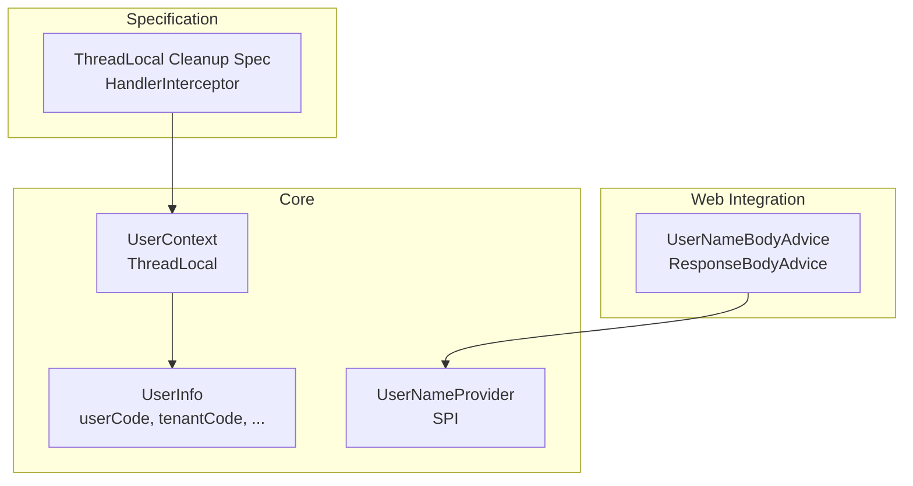
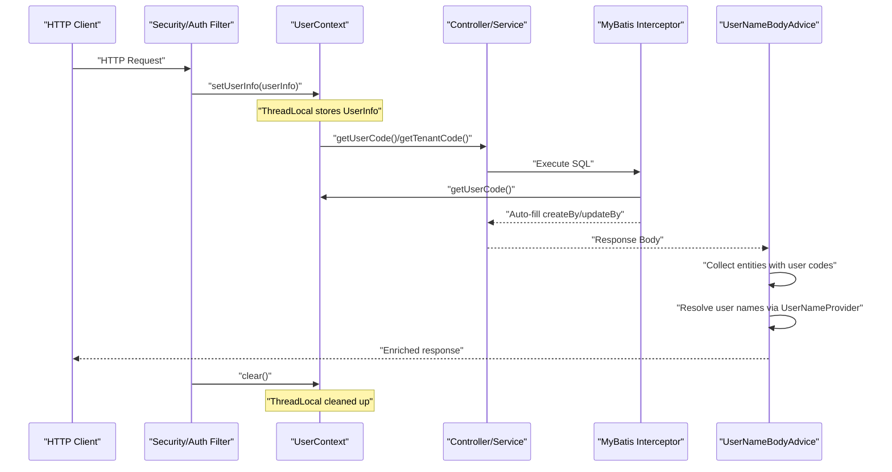
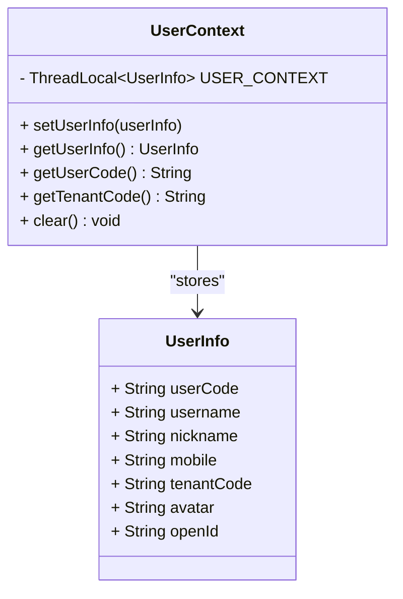
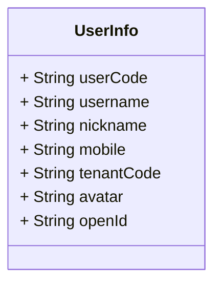
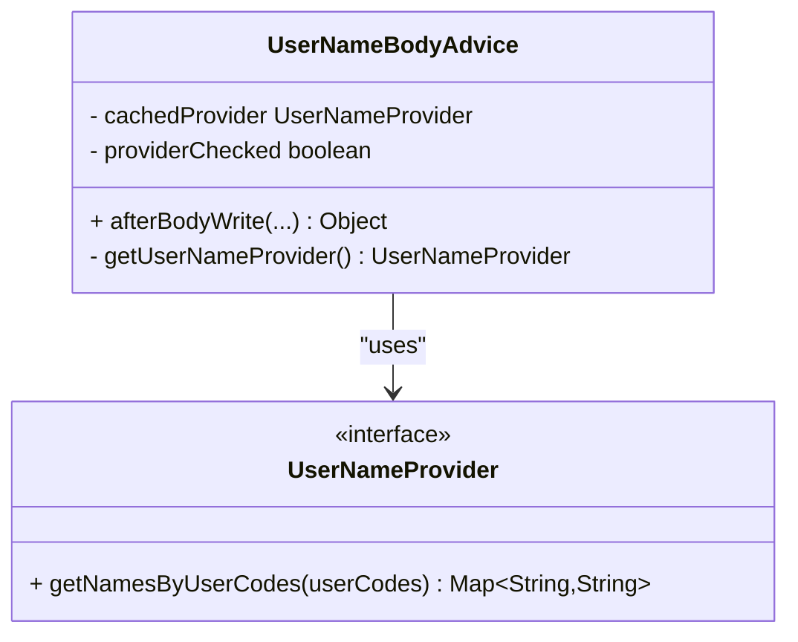
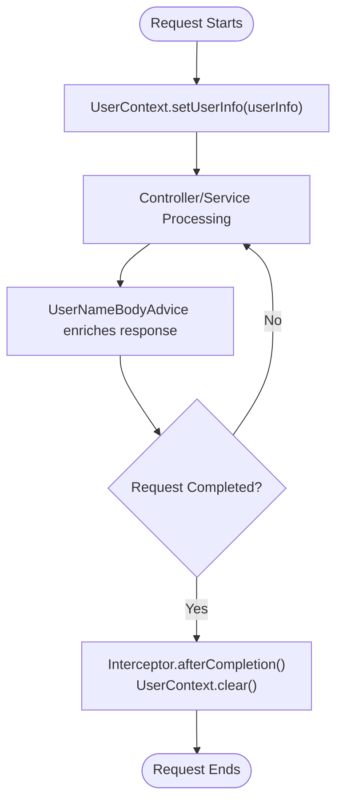
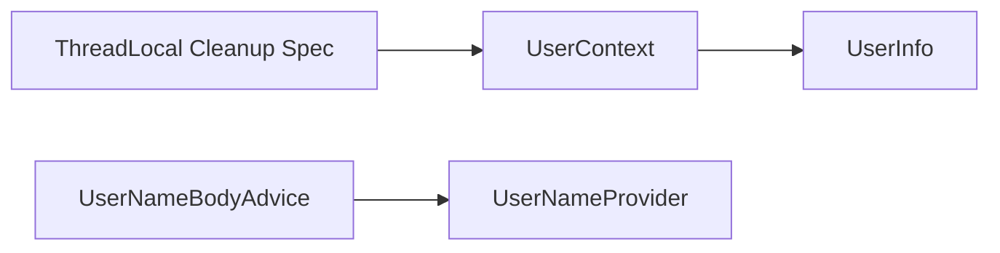

# User Context Management

<cite>
**Referenced Files in This Document**
- [UserContext.java](file://sh-core/src/main/java/com/wkclz/core/user/UserContext.java)
- [UserInfo.java](file://sh-core/src/main/java/com/wkclz/core/base/UserInfo.java)
- [UserNameProvider.java](file://sh-core/src/main/java/com/wkclz/core/spi/UserNameProvider.java)
- [UserNameBodyAdvice.java](file://sh-web/src/main/java/com/wkclz/web/rest/UserNameBodyAdvice.java)
- [US-004-用户上下文与多租户隔离.md](file://docs/stories/US-004-用户上下文与多租户隔离.md)
- [spec.md](file://.trae/specs/fix-threadlocal-leak/spec.md)
- [tasks.md](file://.trae/specs/fix-threadlocal-leak/tasks.md)
</cite>

## Table of Contents
1. [Introduction](#introduction)
2. [Project Structure](#project-structure)
3. [Core Components](#core-components)
4. [Architecture Overview](#architecture-overview)
5. [Detailed Component Analysis](#detailed-component-analysis)
6. [Dependency Analysis](#dependency-analysis)
7. [Performance Considerations](#performance-considerations)
8. [Troubleshooting Guide](#troubleshooting-guide)
9. [Conclusion](#conclusion)

## Introduction
This document explains the user context management system centered around the UserContext class and related components. It covers thread-local storage implementation for persisting user information across method calls, the UserInfo data model, context initialization and authentication integration, multi-tenant user isolation, and practical usage patterns in services, controllers, and background tasks. It also addresses thread safety, context cleanup, performance implications, and integration with Spring Security and custom user providers via SPI patterns.

## Project Structure
The user context system spans three primary areas:
- Core domain: UserContext and UserInfo define the thread-local storage and user data model.
- Web integration: UserNameBodyAdvice integrates with Spring MVC to enrich response bodies with user names using a pluggable provider.
- Specification: The ThreadLocal leak fix specification defines lifecycle-aware cleanup via a HandlerInterceptor.

**Diagram sources**
- [UserContext.java:1-53](file://sh-core/src/main/java/com/wkclz/core/user/UserContext.java#L1-L53)
- [UserInfo.java:1-35](file://sh-core/src/main/java/com/wkclz/core/base/UserInfo.java#L1-L35)
- [UserNameProvider.java:1-12](file://sh-core/src/main/java/com/wkclz/core/spi/UserNameProvider.java#L1-L12)
- [UserNameBodyAdvice.java:65-136](file://sh-web/src/main/java/com/wkclz/web/rest/UserNameBodyAdvice.java#L65-L136)
- [spec.md:1-72](file://.trae/specs/fix-threadlocal-leak/spec.md#L1-L72)

**Section sources**
- [UserContext.java:1-53](file://sh-core/src/main/java/com/wkclz/core/user/UserContext.java#L1-L53)
- [UserInfo.java:1-35](file://sh-core/src/main/java/com/wkclz/core/base/UserInfo.java#L1-L35)
- [UserNameProvider.java:1-12](file://sh-core/src/main/java/com/wkclz/core/spi/UserNameProvider.java#L1-L12)
- [UserNameBodyAdvice.java:65-136](file://sh-web/src/main/java/com/wkclz/web/rest/UserNameBodyAdvice.java#L65-L136)
- [spec.md:1-72](file://.trae/specs/fix-threadlocal-leak/spec.md#L1-L72)

## Core Components
- UserContext: Provides static methods to set, get, and clear the current user's information in a thread-local holder. It exposes convenience getters for userCode and tenantCode.
- UserInfo: Serializable DTO containing user identity and tenant metadata used across the system.
- UserNameProvider (SPI): Pluggable provider interface to supply user name mappings by user codes.
- UserNameBodyAdvice: Spring MVC ResponseBodyAdvice that enriches response entities with user names using the UserNameProvider.

Key capabilities:
- Thread-local storage ensures per-request user context isolation.
- Multi-tenant support via tenantCode in UserInfo.
- Lifecycle-aware cleanup via a HandlerInterceptor pattern to prevent memory leaks.

**Section sources**
- [UserContext.java:1-53](file://sh-core/src/main/java/com/wkclz/core/user/UserContext.java#L1-L53)
- [UserInfo.java:1-35](file://sh-core/src/main/java/com/wkclz/core/base/UserInfo.java#L1-L35)
- [UserNameProvider.java:1-12](file://sh-core/src/main/java/com/wkclz/core/spi/UserNameProvider.java#L1-L12)
- [UserNameBodyAdvice.java:65-136](file://sh-web/src/main/java/com/wkclz/web/rest/UserNameBodyAdvice.java#L65-L136)

## Architecture Overview
The user context flows through request processing, with context initialization during authentication and automatic cleanup after the request completes.

**Diagram sources**
- [US-004-用户上下文与多租户隔离.md:1-40](file://docs/stories/US-004-用户上下文与多租户隔离.md#L1-L40)
- [UserContext.java:1-53](file://sh-core/src/main/java/com/wkclz/core/user/UserContext.java#L1-L53)
- [UserNameBodyAdvice.java:65-136](file://sh-web/src/main/java/com/wkclz/web/rest/UserNameBodyAdvice.java#L65-L136)

## Detailed Component Analysis

### UserContext: Thread-Local Storage and Lifecycle
- Thread-local holder: Stores UserInfo per thread to avoid passing user info through every method call.
- Public API:
  - setUserInfo(userInfo): Initializes context for the current thread.
  - getUserInfo(): Returns the current UserInfo.
  - getUserCode(): Convenience getter for user identifier.
  - getTenantCode(): Convenience getter for tenant identifier.
  - clear(): Removes the stored UserInfo to prevent memory leaks.
- Lifecycle management: The specification mandates interceptor-driven cleanup after request completion, ensuring per-request isolation and leak prevention.

**Diagram sources**
- [UserContext.java:1-53](file://sh-core/src/main/java/com/wkclz/core/user/UserContext.java#L1-L53)
- [UserInfo.java:1-35](file://sh-core/src/main/java/com/wkclz/core/base/UserInfo.java#L1-L35)

**Section sources**
- [UserContext.java:1-53](file://sh-core/src/main/java/com/wkclz/core/user/UserContext.java#L1-L53)
- [spec.md:28-38](file://.trae/specs/fix-threadlocal-leak/spec.md#L28-L38)

### UserInfo: User and Tenant Model
- Fields include identifiers and attributes needed for auditing and multi-tenancy.
- Designed as a serializable DTO for cross-layer usage.

**Diagram sources**
- [UserInfo.java:1-35](file://sh-core/src/main/java/com/wkclz/core/base/UserInfo.java#L1-L35)

**Section sources**
- [UserInfo.java:1-35](file://sh-core/src/main/java/com/wkclz/core/base/UserInfo.java#L1-L35)

### UserNameProvider (SPI) and UserNameBodyAdvice
- UserNameProvider: SPI interface allowing custom resolution of user names by user codes.
- UserNameBodyAdvice: Collects entities from response bodies and enriches them with user names using the provider discovered from the Spring context.

**Diagram sources**
- [UserNameProvider.java:1-12](file://sh-core/src/main/java/com/wkclz/core/spi/UserNameProvider.java#L1-L12)
- [UserNameBodyAdvice.java:65-136](file://sh-web/src/main/java/com/wkclz/web/rest/UserNameBodyAdvice.java#L65-L136)

**Section sources**
- [UserNameProvider.java:1-12](file://sh-core/src/main/java/com/wkclz/core/spi/UserNameProvider.java#L1-L12)
- [UserNameBodyAdvice.java:65-136](file://sh-web/src/main/java/com/wkclz/web/rest/UserNameBodyAdvice.java#L65-L136)

### Thread-Local Cleanup and Request Lifecycle
- The specification replaces a global cleanup filter with interceptor-driven, lifecycle-bound cleanup.
- HandlerInterceptor clears UserContext and other local thread data after request completion, preventing leaks while preserving correctness in async contexts.

**Diagram sources**
- [spec.md:28-45](file://.trae/specs/fix-threadlocal-leak/spec.md#L28-L45)

**Section sources**
- [spec.md:1-72](file://.trae/specs/fix-threadlocal-leak/spec.md#L1-L72)
- [tasks.md:1-23](file://.trae/specs/fix-threadlocal-leak/tasks.md#L1-L23)

## Dependency Analysis
- UserContext depends on UserInfo for data transport.
- UserNameBodyAdvice depends on UserNameProvider for user name resolution.
- The cleanup mechanism relies on Spring MVC interception to manage lifecycle boundaries.

**Diagram sources**
- [UserContext.java:1-53](file://sh-core/src/main/java/com/wkclz/core/user/UserContext.java#L1-L53)
- [UserInfo.java:1-35](file://sh-core/src/main/java/com/wkclz/core/base/UserInfo.java#L1-L35)
- [UserNameProvider.java:1-12](file://sh-core/src/main/java/com/wkclz/core/spi/UserNameProvider.java#L1-L12)
- [UserNameBodyAdvice.java:65-136](file://sh-web/src/main/java/com/wkclz/web/rest/UserNameBodyAdvice.java#L65-L136)
- [spec.md:1-72](file://.trae/specs/fix-threadlocal-leak/spec.md#L1-L72)

**Section sources**
- [UserContext.java:1-53](file://sh-core/src/main/java/com/wkclz/core/user/UserContext.java#L1-L53)
- [UserInfo.java:1-35](file://sh-core/src/main/java/com/wkclz/core/base/UserInfo.java#L1-L35)
- [UserNameProvider.java:1-12](file://sh-core/src/main/java/com/wkclz/core/spi/UserNameProvider.java#L1-L12)
- [UserNameBodyAdvice.java:65-136](file://sh-web/src/main/java/com/wkclz/web/rest/UserNameBodyAdvice.java#L65-L136)
- [spec.md:1-72](file://.trae/specs/fix-threadlocal-leak/spec.md#L1-L72)

## Performance Considerations
- Thread-local access is O(1) and lightweight for frequent reads within a request.
- Avoid storing large objects in the context; keep only essential identifiers and metadata.
- Ensure cleanup occurs promptly to minimize long-lived thread-local retention in pooled threads.
- UserNameBodyAdvice performs batch name resolution via the SPI provider; cache results when appropriate to reduce repeated lookups.

[No sources needed since this section provides general guidance]

## Troubleshooting Guide
Common scenarios and resolutions:
- UserContext returns null: Verify that setUserInfo was called during authentication/filter phase and that the thread-local was not manually cleared elsewhere.
- Memory leaks observed: Confirm that the interceptor-based cleanup is active and that long-running tasks do not rely on the request-scoped context.
- Async tasks: UserContext set in an async thread remains isolated; ensure proper propagation or re-initialization within the async boundary.
- UserName enrichment missing: Ensure a UserNameProvider bean is registered in the Spring context and that response bodies contain entities with user codes.

**Section sources**
- [spec.md:28-45](file://.trae/specs/fix-threadlocal-leak/spec.md#L28-L45)
- [UserNameBodyAdvice.java:65-136](file://sh-web/src/main/java/com/wkclz/web/rest/UserNameBodyAdvice.java#L65-L136)

## Conclusion
The user context system leverages thread-local storage for efficient, request-scoped user and tenant information access. It integrates with Spring MVC through lifecycle-aware cleanup and supports extensibility via SPI for user name enrichment. By adhering to the outlined patterns—context initialization during authentication, interceptor-driven cleanup, and careful handling of async threads—teams can achieve robust multi-tenant isolation and maintain high performance across services, controllers, and background tasks.