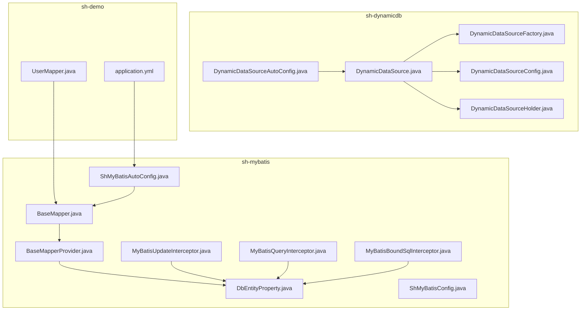
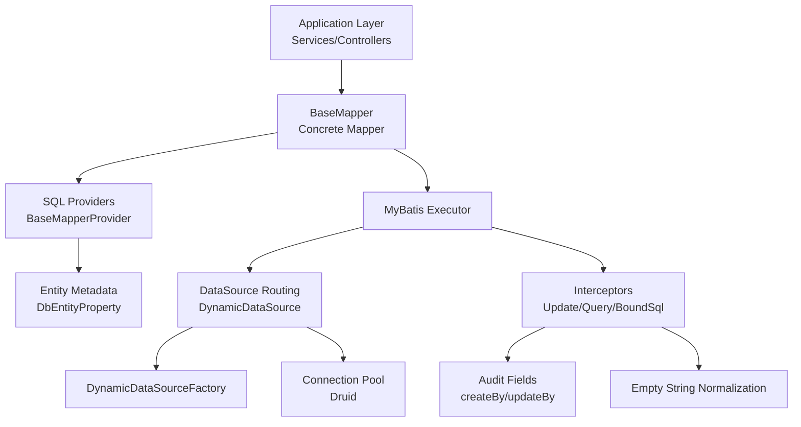
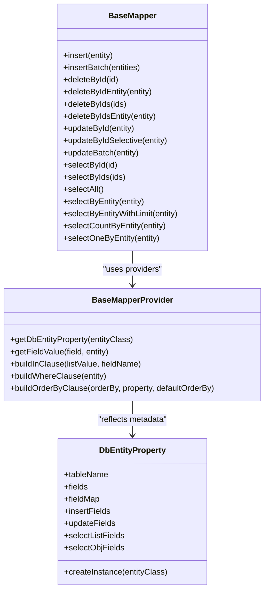
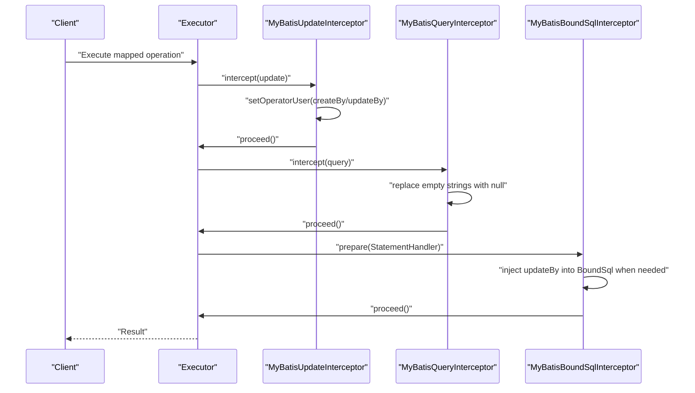
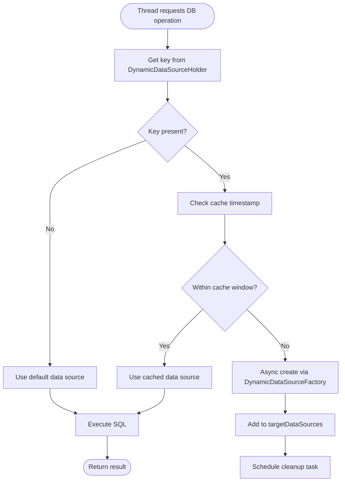
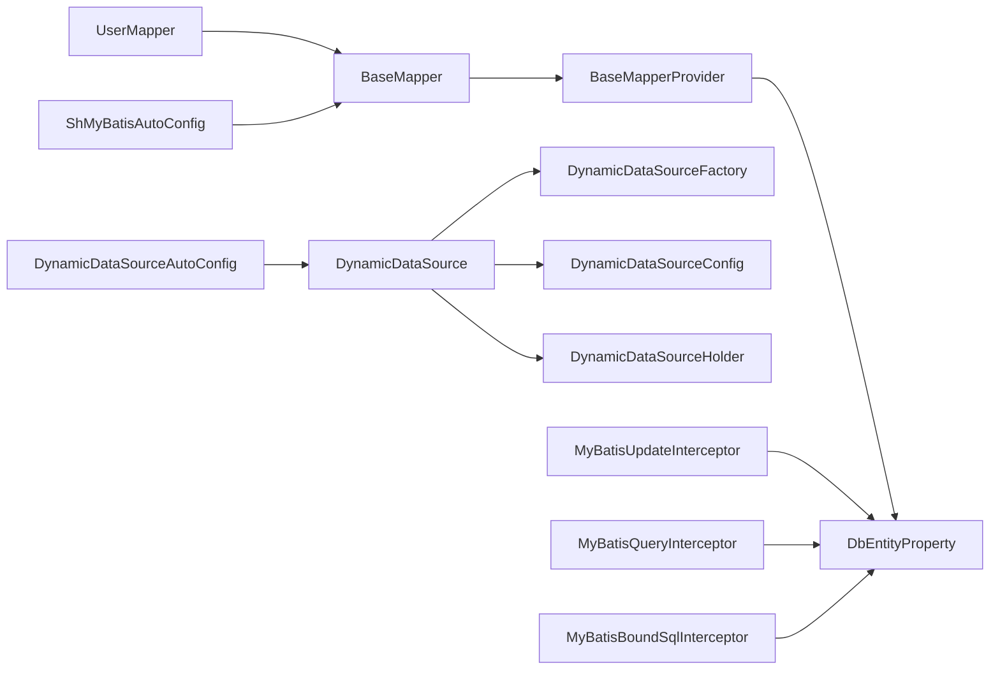

# Data Access Layer

<cite>
**Referenced Files in This Document**
- [BaseMapper.java](file://sh-mybatis/src/main/java/com/wkclz/mybatis/mapper/BaseMapper.java)
- [BaseMapperProvider.java](file://sh-mybatis/src/main/java/com/wkclz/mybatis/mapper/impl/BaseMapperProvider.java)
- [DbEntityProperty.java](file://sh-mybatis/src/main/java/com/wkclz/mybatis/bean/DbEntityProperty.java)
- [ShMyBatisAutoConfig.java](file://sh-mybatis/src/main/java/com/wkclz/mybatis/ShMyBatisAutoConfig.java)
- [ShMyBatisConfig.java](file://sh-mybatis/src/main/java/com/wkclz/mybatis/config/ShMyBatisConfig.java)
- [MyBatisUpdateInterceptor.java](file://sh-mybatis/src/main/java/com/wkclz/mybatis/interceptor/MyBatisUpdateInterceptor.java)
- [MyBatisQueryInterceptor.java](file://sh-mybatis/src/main/java/com/wkclz/mybatis/interceptor/MyBatisQueryInterceptor.java)
- [MyBatisBoundSqlInterceptor.java](file://sh-mybatis/src/main/java/com/wkclz/mybatis/interceptor/MyBatisBoundSqlInterceptor.java)
- [DynamicDataSource.java](file://sh-dynamicdb/src/main/java/com/wkclz/dynamicdb/DynamicDataSource.java)
- [DynamicDataSourceAutoConfig.java](file://sh-dynamicdb/src/main/java/com/wkclz/dynamicdb/config/DynamicDataSourceAutoConfig.java)
- [DynamicDataSourceConfig.java](file://sh-dynamicdb/src/main/java/com/wkclz/dynamicdb/config/DynamicDataSourceConfig.java)
- [DynamicDataSourceHolder.java](file://sh-dynamicdb/src/main/java/com/wkclz/dynamicdb/DynamicDataSourceHolder.java)
- [DynamicDataSourceFactory.java](file://sh-dynamicdb/src/main/java/com/wkclz/dynamicdb/DynamicDataSourceFactory.java)
- [UserMapper.java](file://sh-demo/src/main/java/com/wkclz/demo/mapper/UserMapper.java)
- [application.yml](file://sh-demo/src/main/resources/config/application.yml)
</cite>

## Table of Contents
1. [Introduction](#introduction)
2. [Project Structure](#project-structure)
3. [Core Components](#core-components)
4. [Architecture Overview](#architecture-overview)
5. [Detailed Component Analysis](#detailed-component-analysis)
6. [Dependency Analysis](#dependency-analysis)
7. [Performance Considerations](#performance-considerations)
8. [Troubleshooting Guide](#troubleshooting-guide)
9. [Conclusion](#conclusion)
10. [Appendices](#appendices)

## Introduction
This document describes the data access layer of SH Framework with a focus on:
- The BaseMapper interface and its 14 predefined CRUD methods with generic type safety
- MyBatis integration: SQL provider system, interceptor chain, and automatic field population
- Dynamic data source management: runtime switching, multi-tenant configuration, and thread safety
- Interceptors for audit trails and query parameter normalization
- Practical examples for custom mappers, SQL providers, and dynamic data source configuration
- Performance optimization and connection pooling strategies

## Project Structure
The data access layer spans three modules:
- sh-mybatis: Core MyBatis integration, BaseMapper, SQL providers, interceptors, and configuration
- sh-dynamicdb: Dynamic data source routing, lifecycle management, and auto-configuration
- sh-demo: Example mapper implementation and configuration

**Diagram sources**
- [BaseMapper.java:1-88](file://sh-mybatis/src/main/java/com/wkclz/mybatis/mapper/BaseMapper.java#L1-L88)
- [BaseMapperProvider.java:1-244](file://sh-mybatis/src/main/java/com/wkclz/mybatis/mapper/impl/BaseMapperProvider.java#L1-L244)
- [DbEntityProperty.java:1-214](file://sh-mybatis/src/main/java/com/wkclz/mybatis/bean/DbEntityProperty.java#L1-L214)
- [ShMyBatisAutoConfig.java:1-14](file://sh-mybatis/src/main/java/com/wkclz/mybatis/ShMyBatisAutoConfig.java#L1-L14)
- [ShMyBatisConfig.java:1-42](file://sh-mybatis/src/main/java/com/wkclz/mybatis/config/ShMyBatisConfig.java#L1-L42)
- [MyBatisUpdateInterceptor.java:1-86](file://sh-mybatis/src/main/java/com/wkclz/mybatis/interceptor/MyBatisUpdateInterceptor.java#L1-L86)
- [MyBatisQueryInterceptor.java:1-122](file://sh-mybatis/src/main/java/com/wkclz/mybatis/interceptor/MyBatisQueryInterceptor.java#L1-L122)
- [MyBatisBoundSqlInterceptor.java:1-50](file://sh-mybatis/src/main/java/com/wkclz/mybatis/interceptor/MyBatisBoundSqlInterceptor.java#L1-L50)
- [DynamicDataSource.java:1-274](file://sh-dynamicdb/src/main/java/com/wkclz/dynamicdb/DynamicDataSource.java#L1-L274)
- [DynamicDataSourceAutoConfig.java:1-66](file://sh-dynamicdb/src/main/java/com/wkclz/dynamicdb/config/DynamicDataSourceAutoConfig.java#L1-L66)
- [DynamicDataSourceConfig.java:1-18](file://sh-dynamicdb/src/main/java/com/wkclz/dynamicdb/config/DynamicDataSourceConfig.java#L1-L18)
- [DynamicDataSourceHolder.java:1-23](file://sh-dynamicdb/src/main/java/com/wkclz/dynamicdb/DynamicDataSourceHolder.java#L1-L23)
- [DynamicDataSourceFactory.java:1-13](file://sh-dynamicdb/src/main/java/com/wkclz/dynamicdb/DynamicDataSourceFactory.java#L1-L13)
- [UserMapper.java:1-10](file://sh-demo/src/main/java/com/wkclz/demo/mapper/UserMapper.java#L1-L10)
- [application.yml:1-26](file://sh-demo/src/main/resources/config/application.yml#L1-L26)

**Section sources**
- [ShMyBatisAutoConfig.java:1-14](file://sh-mybatis/src/main/java/com/wkclz/mybatis/ShMyBatisAutoConfig.java#L1-L14)
- [DynamicDataSourceAutoConfig.java:1-66](file://sh-dynamicdb/src/main/java/com/wkclz/dynamicdb/config/DynamicDataSourceAutoConfig.java#L1-L66)
- [application.yml:1-26](file://sh-demo/src/main/resources/config/application.yml#L1-L26)

## Core Components
This section documents the foundational building blocks of the data access layer.

- BaseMapper interface
  - Purpose: Provides a standardized contract for single-table CRUD operations with strong generic type safety
  - Generic type: <T extends BaseEntity> ensures compile-time and runtime alignment with entity metadata
  - Methods: 14 predefined operations including insert, batch insert, delete by id(s), update by id (full/selective/batch), select by id(s), select all, select by entity, select by entity with limit, count by entity, and select one by entity
  - SQL generation: Uses @InsertProvider/@DeleteProvider/@UpdateProvider/@SelectProvider with dedicated provider classes per operation
  - Optimistic locking: Supported via version field handling in update operations

- SQL provider system
  - BaseMapperProvider: Centralized SQL builder that leverages reflection and cached entity metadata to construct safe and efficient SQL
  - Entity metadata: DbEntityProperty caches field mappings, column names, insert/update/select lists, and special fields (id, deleted, version, timestamps)
  - Safety checks: Builds WHERE clauses excluding null and empty string values; supports IN clause construction; validates ORDER BY to prevent injection
  - Type handling: Uses getter/setter reflection or direct field access to extract values safely

- Interceptor chain
  - MyBatisUpdateInterceptor: Automatically populates create/update user codes and clears timestamp fields to allow DB defaults
  - MyBatisQueryInterceptor: Normalizes query parameters by replacing empty strings with null across nested structures
  - MyBatisBoundSqlInterceptor: Injects updateBy into BoundSql when needed for non-entity delete operations

- Dynamic data source management
  - DynamicDataSource: Extends AbstractRoutingDataSource to route connections based on a ThreadLocal key; supports async creation, caching, and cleanup
  - DynamicDataSourceHolder: Thread-safe accessor for the current data source key
  - DynamicDataSourceAutoConfig: Registers DynamicDataSource as primary and starts cleanup scheduling
  - DynamicDataSourceConfig: Externalizable tuning for cache duration and cleanup intervals
  - DynamicDataSourceFactory: SPI for resolving tenant-specific DataSourceInfo

- Example mapper
  - UserMapper demonstrates extending BaseMapper with a concrete entity type

**Section sources**
- [BaseMapper.java:1-88](file://sh-mybatis/src/main/java/com/wkclz/mybatis/mapper/BaseMapper.java#L1-L88)
- [BaseMapperProvider.java:1-244](file://sh-mybatis/src/main/java/com/wkclz/mybatis/mapper/impl/BaseMapperProvider.java#L1-L244)
- [DbEntityProperty.java:1-214](file://sh-mybatis/src/main/java/com/wkclz/mybatis/bean/DbEntityProperty.java#L1-L214)
- [MyBatisUpdateInterceptor.java:1-86](file://sh-mybatis/src/main/java/com/wkclz/mybatis/interceptor/MyBatisUpdateInterceptor.java#L1-L86)
- [MyBatisQueryInterceptor.java:1-122](file://sh-mybatis/src/main/java/com/wkclz/mybatis/interceptor/MyBatisQueryInterceptor.java#L1-L122)
- [MyBatisBoundSqlInterceptor.java:1-50](file://sh-mybatis/src/main/java/com/wkclz/mybatis/interceptor/MyBatisBoundSqlInterceptor.java#L1-L50)
- [DynamicDataSource.java:1-274](file://sh-dynamicdb/src/main/java/com/wkclz/dynamicdb/DynamicDataSource.java#L1-L274)
- [DynamicDataSourceHolder.java:1-23](file://sh-dynamicdb/src/main/java/com/wkclz/dynamicdb/DynamicDataSourceHolder.java#L1-L23)
- [DynamicDataSourceAutoConfig.java:1-66](file://sh-dynamicdb/src/main/java/com/wkclz/dynamicdb/config/DynamicDataSourceAutoConfig.java#L1-L66)
- [DynamicDataSourceConfig.java:1-18](file://sh-dynamicdb/src/main/java/com/wkclz/dynamicdb/config/DynamicDataSourceConfig.java#L1-L18)
- [DynamicDataSourceFactory.java:1-13](file://sh-dynamicdb/src/main/java/com/wkclz/dynamicdb/DynamicDataSourceFactory.java#L1-L13)
- [UserMapper.java:1-10](file://sh-demo/src/main/java/com/wkclz/demo/mapper/UserMapper.java#L1-L10)

## Architecture Overview
The data access layer integrates MyBatis with dynamic routing and interceptors to deliver type-safe, secure, and tenant-aware persistence.

**Diagram sources**
- [BaseMapper.java:1-88](file://sh-mybatis/src/main/java/com/wkclz/mybatis/mapper/BaseMapper.java#L1-L88)
- [BaseMapperProvider.java:1-244](file://sh-mybatis/src/main/java/com/wkclz/mybatis/mapper/impl/BaseMapperProvider.java#L1-L244)
- [DbEntityProperty.java:1-214](file://sh-mybatis/src/main/java/com/wkclz/mybatis/bean/DbEntityProperty.java#L1-L214)
- [DynamicDataSource.java:1-274](file://sh-dynamicdb/src/main/java/com/wkclz/dynamicdb/DynamicDataSource.java#L1-L274)
- [DynamicDataSourceFactory.java:1-13](file://sh-dynamicdb/src/main/java/com/wkclz/dynamicdb/DynamicDataSourceFactory.java#L1-L13)
- [MyBatisUpdateInterceptor.java:1-86](file://sh-mybatis/src/main/java/com/wkclz/mybatis/interceptor/MyBatisUpdateInterceptor.java#L1-L86)
- [MyBatisQueryInterceptor.java:1-122](file://sh-mybatis/src/main/java/com/wkclz/mybatis/interceptor/MyBatisQueryInterceptor.java#L1-L122)
- [MyBatisBoundSqlInterceptor.java:1-50](file://sh-mybatis/src/main/java/com/wkclz/mybatis/interceptor/MyBatisBoundSqlInterceptor.java#L1-L50)

## Detailed Component Analysis

### BaseMapper and SQL Provider System
BaseMapper defines 14 CRUD methods with generic type safety. Each method delegates SQL generation to a dedicated provider class, ensuring consistent behavior and reducing duplication. The providers rely on DbEntityProperty for metadata-driven SQL construction.

**Diagram sources**
- [BaseMapper.java:1-88](file://sh-mybatis/src/main/java/com/wkclz/mybatis/mapper/BaseMapper.java#L1-L88)
- [BaseMapperProvider.java:1-244](file://sh-mybatis/src/main/java/com/wkclz/mybatis/mapper/impl/BaseMapperProvider.java#L1-L244)
- [DbEntityProperty.java:1-214](file://sh-mybatis/src/main/java/com/wkclz/mybatis/bean/DbEntityProperty.java#L1-L214)

**Section sources**
- [BaseMapper.java:1-88](file://sh-mybatis/src/main/java/com/wkclz/mybatis/mapper/BaseMapper.java#L1-L88)
- [BaseMapperProvider.java:1-244](file://sh-mybatis/src/main/java/com/wkclz/mybatis/mapper/impl/BaseMapperProvider.java#L1-L244)
- [DbEntityProperty.java:1-214](file://sh-mybatis/src/main/java/com/wkclz/mybatis/bean/DbEntityProperty.java#L1-L214)

### Interceptor Chain for Audit Trails and Query Normalization
The interceptor chain augments operations with audit fields and normalizes query parameters.

**Diagram sources**
- [MyBatisUpdateInterceptor.java:1-86](file://sh-mybatis/src/main/java/com/wkclz/mybatis/interceptor/MyBatisUpdateInterceptor.java#L1-L86)
- [MyBatisQueryInterceptor.java:1-122](file://sh-mybatis/src/main/java/com/wkclz/mybatis/interceptor/MyBatisQueryInterceptor.java#L1-L122)
- [MyBatisBoundSqlInterceptor.java:1-50](file://sh-mybatis/src/main/java/com/wkclz/mybatis/interceptor/MyBatisBoundSqlInterceptor.java#L1-L50)

**Section sources**
- [MyBatisUpdateInterceptor.java:1-86](file://sh-mybatis/src/main/java/com/wkclz/mybatis/interceptor/MyBatisUpdateInterceptor.java#L1-L86)
- [MyBatisQueryInterceptor.java:1-122](file://sh-mybatis/src/main/java/com/wkclz/mybatis/interceptor/MyBatisQueryInterceptor.java#L1-L122)
- [MyBatisBoundSqlInterceptor.java:1-50](file://sh-mybatis/src/main/java/com/wkclz/mybatis/interceptor/MyBatisBoundSqlInterceptor.java#L1-L50)

### Dynamic Data Source Management
DynamicDataSource enables runtime switching of data sources with thread-local keys, asynchronous creation, caching, and scheduled cleanup.

**Diagram sources**
- [DynamicDataSource.java:1-274](file://sh-dynamicdb/src/main/java/com/wkclz/dynamicdb/DynamicDataSource.java#L1-L274)
- [DynamicDataSourceHolder.java:1-23](file://sh-dynamicdb/src/main/java/com/wkclz/dynamicdb/DynamicDataSourceHolder.java#L1-L23)
- [DynamicDataSourceAutoConfig.java:1-66](file://sh-dynamicdb/src/main/java/com/wkclz/dynamicdb/config/DynamicDataSourceAutoConfig.java#L1-L66)
- [DynamicDataSourceConfig.java:1-18](file://sh-dynamicdb/src/main/java/com/wkclz/dynamicdb/config/DynamicDataSourceConfig.java#L1-L18)
- [DynamicDataSourceFactory.java:1-13](file://sh-dynamicdb/src/main/java/com/wkclz/dynamicdb/DynamicDataSourceFactory.java#L1-L13)

**Section sources**
- [DynamicDataSource.java:1-274](file://sh-dynamicdb/src/main/java/com/wkclz/dynamicdb/DynamicDataSource.java#L1-L274)
- [DynamicDataSourceHolder.java:1-23](file://sh-dynamicdb/src/main/java/com/wkclz/dynamicdb/DynamicDataSourceHolder.java#L1-L23)
- [DynamicDataSourceAutoConfig.java:1-66](file://sh-dynamicdb/src/main/java/com/wkclz/dynamicdb/config/DynamicDataSourceAutoConfig.java#L1-L66)
- [DynamicDataSourceConfig.java:1-18](file://sh-dynamicdb/src/main/java/com/wkclz/dynamicdb/config/DynamicDataSourceConfig.java#L1-L18)
- [DynamicDataSourceFactory.java:1-13](file://sh-dynamicdb/src/main/java/com/wkclz/dynamicdb/DynamicDataSourceFactory.java#L1-L13)

### Practical Examples

- Implementing a custom mapper
  - Extend BaseMapper with your entity type and annotate with @Mapper
  - Reference: [UserMapper.java:1-10](file://sh-demo/src/main/java/com/wkclz/demo/mapper/UserMapper.java#L1-L10)

- Using SQL providers
  - BaseMapper delegates to provider classes; ensure your entity extends BaseEntity so DbEntityProperty can derive metadata
  - Reference: [BaseMapper.java:1-88](file://sh-mybatis/src/main/java/com/wkclz/mybatis/mapper/BaseMapper.java#L1-L88), [DbEntityProperty.java:1-214](file://sh-mybatis/src/main/java/com/wkclz/mybatis/bean/DbEntityProperty.java#L1-L214)

- Configuring dynamic data sources
  - Provide a DynamicDataSourceFactory bean to resolve DataSourceInfo by key
  - Configure cache and cleanup intervals via DynamicDataSourceConfig
  - Reference: [DynamicDataSourceAutoConfig.java:1-66](file://sh-dynamicdb/src/main/java/com/wkclz/dynamicdb/config/DynamicDataSourceAutoConfig.java#L1-L66), [DynamicDataSourceConfig.java:1-18](file://sh-dynamicdb/src/main/java/com/wkclz/dynamicdb/config/DynamicDataSourceConfig.java#L1-L18)

**Section sources**
- [UserMapper.java:1-10](file://sh-demo/src/main/java/com/wkclz/demo/mapper/UserMapper.java#L1-L10)
- [BaseMapper.java:1-88](file://sh-mybatis/src/main/java/com/wkclz/mybatis/mapper/BaseMapper.java#L1-L88)
- [DbEntityProperty.java:1-214](file://sh-mybatis/src/main/java/com/wkclz/mybatis/bean/DbEntityProperty.java#L1-L214)
- [DynamicDataSourceAutoConfig.java:1-66](file://sh-dynamicdb/src/main/java/com/wkclz/dynamicdb/config/DynamicDataSourceAutoConfig.java#L1-L66)
- [DynamicDataSourceConfig.java:1-18](file://sh-dynamicdb/src/main/java/com/wkclz/dynamicdb/config/DynamicDataSourceConfig.java#L1-L18)

## Dependency Analysis
The following diagram highlights key dependencies among components.

**Diagram sources**
- [UserMapper.java:1-10](file://sh-demo/src/main/java/com/wkclz/demo/mapper/UserMapper.java#L1-L10)
- [BaseMapper.java:1-88](file://sh-mybatis/src/main/java/com/wkclz/mybatis/mapper/BaseMapper.java#L1-L88)
- [BaseMapperProvider.java:1-244](file://sh-mybatis/src/main/java/com/wkclz/mybatis/mapper/impl/BaseMapperProvider.java#L1-L244)
- [DbEntityProperty.java:1-214](file://sh-mybatis/src/main/java/com/wkclz/mybatis/bean/DbEntityProperty.java#L1-L214)
- [ShMyBatisAutoConfig.java:1-14](file://sh-mybatis/src/main/java/com/wkclz/mybatis/ShMyBatisAutoConfig.java#L1-L14)
- [DynamicDataSourceAutoConfig.java:1-66](file://sh-dynamicdb/src/main/java/com/wkclz/dynamicdb/config/DynamicDataSourceAutoConfig.java#L1-L66)
- [DynamicDataSource.java:1-274](file://sh-dynamicdb/src/main/java/com/wkclz/dynamicdb/DynamicDataSource.java#L1-L274)
- [DynamicDataSourceFactory.java:1-13](file://sh-dynamicdb/src/main/java/com/wkclz/dynamicdb/DynamicDataSourceFactory.java#L1-L13)
- [DynamicDataSourceConfig.java:1-18](file://sh-dynamicdb/src/main/java/com/wkclz/dynamicdb/config/DynamicDataSourceConfig.java#L1-L18)
- [DynamicDataSourceHolder.java:1-23](file://sh-dynamicdb/src/main/java/com/wkclz/dynamicdb/DynamicDataSourceHolder.java#L1-L23)
- [MyBatisUpdateInterceptor.java:1-86](file://sh-mybatis/src/main/java/com/wkclz/mybatis/interceptor/MyBatisUpdateInterceptor.java#L1-L86)
- [MyBatisQueryInterceptor.java:1-122](file://sh-mybatis/src/main/java/com/wkclz/mybatis/interceptor/MyBatisQueryInterceptor.java#L1-L122)
- [MyBatisBoundSqlInterceptor.java:1-50](file://sh-mybatis/src/main/java/com/wkclz/mybatis/interceptor/MyBatisBoundSqlInterceptor.java#L1-L50)

**Section sources**
- [UserMapper.java:1-10](file://sh-demo/src/main/java/com/wkclz/demo/mapper/UserMapper.java#L1-L10)
- [BaseMapper.java:1-88](file://sh-mybatis/src/main/java/com/wkclz/mybatis/mapper/BaseMapper.java#L1-L88)
- [BaseMapperProvider.java:1-244](file://sh-mybatis/src/main/java/com/wkclz/mybatis/mapper/impl/BaseMapperProvider.java#L1-L244)
- [DbEntityProperty.java:1-214](file://sh-mybatis/src/main/java/com/wkclz/mybatis/bean/DbEntityProperty.java#L1-L214)
- [ShMyBatisAutoConfig.java:1-14](file://sh-mybatis/src/main/java/com/wkclz/mybatis/ShMyBatisAutoConfig.java#L1-L14)
- [DynamicDataSourceAutoConfig.java:1-66](file://sh-dynamicdb/src/main/java/com/wkclz/dynamicdb/config/DynamicDataSourceAutoConfig.java#L1-L66)
- [DynamicDataSource.java:1-274](file://sh-dynamicdb/src/main/java/com/wkclz/dynamicdb/DynamicDataSource.java#L1-L274)
- [DynamicDataSourceFactory.java:1-13](file://sh-dynamicdb/src/main/java/com/wkclz/dynamicdb/DynamicDataSourceFactory.java#L1-L13)
- [DynamicDataSourceConfig.java:1-18](file://sh-dynamicdb/src/main/java/com/wkclz/dynamicdb/config/DynamicDataSourceConfig.java#L1-L18)
- [DynamicDataSourceHolder.java:1-23](file://sh-dynamicdb/src/main/java/com/wkclz/dynamicdb/DynamicDataSourceHolder.java#L1-L23)
- [MyBatisUpdateInterceptor.java:1-86](file://sh-mybatis/src/main/java/com/wkclz/mybatis/interceptor/MyBatisUpdateInterceptor.java#L1-L86)
- [MyBatisQueryInterceptor.java:1-122](file://sh-mybatis/src/main/java/com/wkclz/mybatis/interceptor/MyBatisQueryInterceptor.java#L1-L122)
- [MyBatisBoundSqlInterceptor.java:1-50](file://sh-mybatis/src/main/java/com/wkclz/mybatis/interceptor/MyBatisBoundSqlInterceptor.java#L1-L50)

## Performance Considerations
- SQL provider reflection
  - Entity metadata is cached to avoid repeated reflection overhead
  - References: [BaseMapperProvider.java:25-28](file://sh-mybatis/src/main/java/com/wkclz/mybatis/mapper/impl/BaseMapperProvider.java#L25-L28), [DbEntityProperty.java:55-118](file://sh-mybatis/src/main/java/com/wkclz/mybatis/bean/DbEntityProperty.java#L55-L118)

- Connection pooling
  - DynamicDataSource uses DruidDataSourceFactory to create pooled data sources
  - References: [DynamicDataSource.java:90-100](file://sh-dynamicdb/src/main/java/com/wkclz/dynamicdb/DynamicDataSource.java#L90-L100)

- Async creation and caching
  - Asynchronous data source creation prevents blocking; cache reduces repeated initialization
  - References: [DynamicDataSource.java:80-109](file://sh-dynamicdb/src/main/java/com/wkclz/dynamicdb/DynamicDataSource.java#L80-L109), [DynamicDataSourceConfig.java:11-15](file://sh-dynamicdb/src/main/java/com/wkclz/dynamicdb/config/DynamicDataSourceConfig.java#L11-L15)

- Cleanup scheduling
  - Periodic cleanup closes expired data sources to prevent leaks
  - References: [DynamicDataSource.java:144-159](file://sh-dynamicdb/src/main/java/com/wkclz/dynamicdb/DynamicDataSource.java#L144-L159), [DynamicDataSourceAutoConfig.java:34-41](file://sh-dynamicdb/src/main/java/com/wkclz/dynamicdb/config/DynamicDataSourceAutoConfig.java#L34-L41)

- Query parameter normalization
  - Reduces unnecessary filtering conditions and improves index usage
  - References: [MyBatisQueryInterceptor.java:48-92](file://sh-mybatis/src/main/java/com/wkclz/mybatis/interceptor/MyBatisQueryInterceptor.java#L48-L92)

[No sources needed since this section provides general guidance]

## Troubleshooting Guide
- Empty string handling in queries
  - Symptom: Unexpected filtering behavior
  - Resolution: Interceptor replaces empty strings with null; verify parameter structures
  - References: [MyBatisQueryInterceptor.java:48-92](file://sh-mybatis/src/main/java/com/wkclz/mybatis/interceptor/MyBatisQueryInterceptor.java#L48-L92)

- Audit fields not populated
  - Symptom: createBy/updateBy remain unset
  - Resolution: Ensure UserContext has a user code; interceptor requires a non-null user code
  - References: [MyBatisUpdateInterceptor.java:32-38](file://sh-mybatis/src/main/java/com/wkclz/mybatis/interceptor/MyBatisUpdateInterceptor.java#L32-L38)

- Non-entity delete operations missing updateBy
  - Symptom: SQL fails to bind updateBy
  - Resolution: BoundSql interceptor injects updateBy when the placeholder exists
  - References: [MyBatisBoundSqlInterceptor.java:24-37](file://sh-mybatis/src/main/java/com/wkclz/mybatis/interceptor/MyBatisBoundSqlInterceptor.java#L24-L37)

- Dynamic data source not switching
  - Symptom: No change in target database
  - Resolution: Set the key via DynamicDataSourceHolder before the transaction; confirm factory resolves DataSourceInfo
  - References: [DynamicDataSourceHolder.java:10-12](file://sh-dynamicdb/src/main/java/com/wkclz/dynamicdb/DynamicDataSourceHolder.java#L10-L12), [DynamicDataSourceFactory.java:10-10](file://sh-dynamicdb/src/main/java/com/wkclz/dynamicdb/DynamicDataSourceFactory.java#L10-L10)

- Connection pool exhaustion or leaks
  - Symptom: OutOfMemory or slow queries
  - Resolution: Tune cache and cleanup intervals; ensure proper shutdown of cleanup scheduler and executor
  - References: [DynamicDataSourceAutoConfig.java:34-41](file://sh-dynamicdb/src/main/java/com/wkclz/dynamicdb/config/DynamicDataSourceAutoConfig.java#L34-L41), [DynamicDataSource.java:237-271](file://sh-dynamicdb/src/main/java/com/wkclz/dynamicdb/DynamicDataSource.java#L237-L271)

**Section sources**
- [MyBatisQueryInterceptor.java:1-122](file://sh-mybatis/src/main/java/com/wkclz/mybatis/interceptor/MyBatisQueryInterceptor.java#L1-L122)
- [MyBatisUpdateInterceptor.java:1-86](file://sh-mybatis/src/main/java/com/wkclz/mybatis/interceptor/MyBatisUpdateInterceptor.java#L1-L86)
- [MyBatisBoundSqlInterceptor.java:1-50](file://sh-mybatis/src/main/java/com/wkclz/mybatis/interceptor/MyBatisBoundSqlInterceptor.java#L1-L50)
- [DynamicDataSourceHolder.java:1-23](file://sh-dynamicdb/src/main/java/com/wkclz/dynamicdb/DynamicDataSourceHolder.java#L1-L23)
- [DynamicDataSourceFactory.java:1-13](file://sh-dynamicdb/src/main/java/com/wkclz/dynamicdb/DynamicDataSourceFactory.java#L1-L13)
- [DynamicDataSourceAutoConfig.java:1-66](file://sh-dynamicdb/src/main/java/com/wkclz/dynamicdb/config/DynamicDataSourceAutoConfig.java#L1-L66)
- [DynamicDataSource.java:1-274](file://sh-dynamicdb/src/main/java/com/wkclz/dynamicdb/DynamicDataSource.java#L1-L274)

## Conclusion
SH Framework’s data access layer combines a type-safe BaseMapper with robust SQL providers, a secure interceptor chain, and flexible dynamic data source routing. Together, these components deliver:
- Consistent CRUD semantics with generic type safety
- Safe, metadata-driven SQL generation and normalization
- Automatic audit trail population and parameter hygiene
- Runtime multi-tenant data source switching with thread safety and lifecycle management
Adopting the provided patterns ensures maintainable, performant, and secure persistence across diverse environments.

[No sources needed since this section summarizes without analyzing specific files]

## Appendices

### Configuration References
- MyBatis and pagehelper configuration in demo app
  - References: [application.yml:14-26](file://sh-demo/src/main/resources/config/application.yml#L14-L26)

- MyBatis global configuration
  - References: [ShMyBatisConfig.java:1-42](file://sh-mybatis/src/main/java/com/wkclz/mybatis/config/ShMyBatisConfig.java#L1-L42)

**Section sources**
- [application.yml:1-26](file://sh-demo/src/main/resources/config/application.yml#L1-L26)
- [ShMyBatisConfig.java:1-42](file://sh-mybatis/src/main/java/com/wkclz/mybatis/config/ShMyBatisConfig.java#L1-L42)