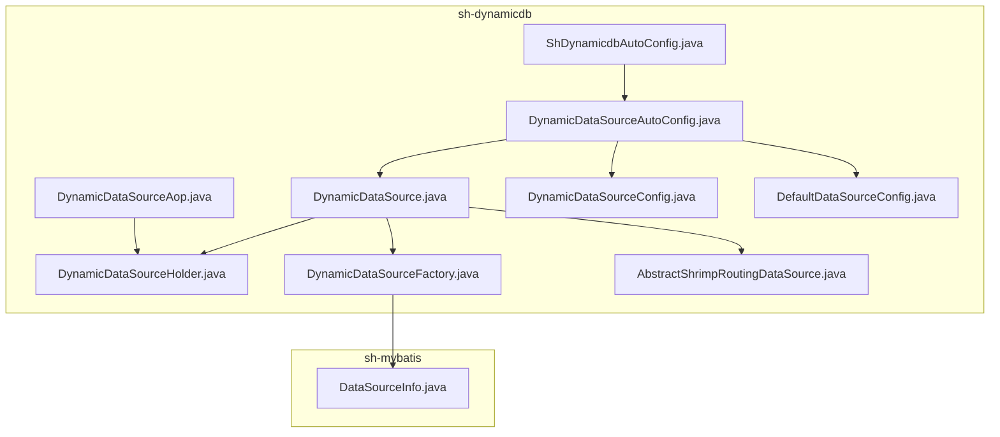
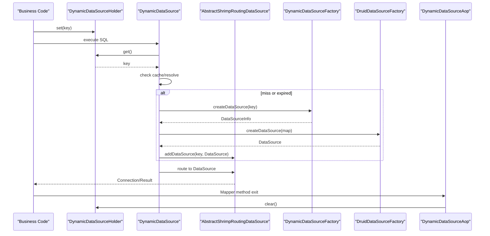
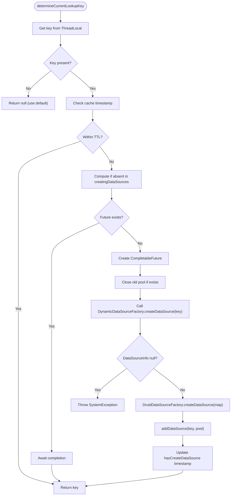
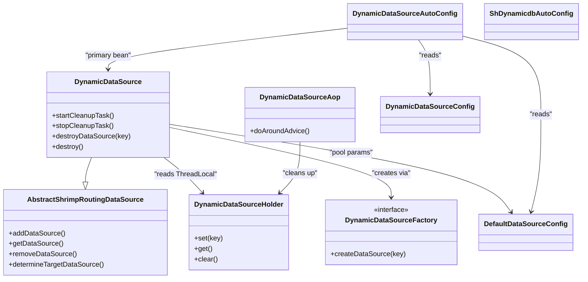

# Dynamic Data Sources

<cite>
**Referenced Files in This Document**
- [DynamicDataSource.java](file://sh-dynamicdb/src/main/java/com/wkclz/dynamicdb/DynamicDataSource.java)
- [DynamicDataSourceHolder.java](file://sh-dynamicdb/src/main/java/com/wkclz/dynamicdb/DynamicDataSourceHolder.java)
- [DynamicDataSourceFactory.java](file://sh-dynamicdb/src/main/java/com/wkclz/dynamicdb/DynamicDataSourceFactory.java)
- [DynamicDataSourceAop.java](file://sh-dynamicdb/src/main/java/com/wkclz/dynamicdb/aop/DynamicDataSourceAop.java)
- [AbstractShrimpRoutingDataSource.java](file://sh-dynamicdb/src/main/java/com/wkclz/dynamicdb/AbstractShrimpRoutingDataSource.java)
- [DynamicDataSourceConfig.java](file://sh-dynamicdb/src/main/java/com/wkclz/dynamicdb/config/DynamicDataSourceConfig.java)
- [DefaultDataSourceConfig.java](file://sh-dynamicdb/src/main/java/com/wkclz/dynamicdb/bean/DefaultDataSourceConfig.java)
- [DynamicDataSourceAutoConfig.java](file://sh-dynamicdb/src/main/java/com/wkclz/dynamicdb/config/DynamicDataSourceAutoConfig.java)
- [ShDynamicdbAutoConfig.java](file://sh-dynamicdb/src/main/java/com/wkclz/dynamicdb/ShDynamicdbAutoConfig.java)
- [DataSourceInfo.java](file://sh-mybatis/src/main/java/com/wkclz/mybatis/bean/DataSourceInfo.java)
- [US-020-动态数据源运行时切换.md](file://docs/stories/US-020-动态数据源运行时切换.md)
- [US-021-动态数据源DCL与异步创建.md](file://docs/stories/US-021-动态数据源DCL与异步创建.md)
- [fix-dynamicdb-connection-pool-leak/spec.md](file://.trae/specs/fix-dynamicdb-connection-pool-leak/spec.md)
- [fix-dynamicdb-dcl-blocking/spec.md](file://.trae/specs/fix-dynamicdb-dcl-blocking/spec.md)
</cite>

## Table of Contents
1. [Introduction](#introduction)
2. [Project Structure](#project-structure)
3. [Core Components](#core-components)
4. [Architecture Overview](#architecture-overview)
5. [Detailed Component Analysis](#detailed-component-analysis)
6. [Dependency Analysis](#dependency-analysis)
7. [Performance Considerations](#performance-considerations)
8. [Troubleshooting Guide](#troubleshooting-guide)
9. [Conclusion](#conclusion)
10. [Appendices](#appendices)

## Introduction
This document explains the dynamic data source management in SH Framework. It covers runtime switching via DynamicDataSource, thread-safe routing using DynamicDataSourceHolder, the factory pattern through DynamicDataSourceFactory, and AOP-based cleanup with DynamicDataSourceAop. It also documents multi-tenant configuration patterns, connection pooling strategies, and the Double-Checked Locking (DCL) improvements for asynchronous data source creation. Practical examples show how to configure multiple data sources, build tenant-aware entities, and handle switching within transactional contexts. Finally, it addresses performance, connection leak prevention, and troubleshooting.

## Project Structure
The dynamic data source capability resides in the sh-dynamicdb module. Key packages:
- com.wkclz.dynamicdb: core runtime switching, holder, factory, AOP, and auto-configuration
- com.wkclz.dynamicdb.config: configuration beans and auto-configuration
- com.wkclz.dynamicdb.aop: AOP aspect for ThreadLocal cleanup
- com.wkclz.dynamicdb.bean: default data source configuration POJO
- com.wkclz.mybatis.bean: DataSourceInfo contract used by factories

**Diagram sources**
- [DynamicDataSource.java:1-274](file://sh-dynamicdb/src/main/java/com/wkclz/dynamicdb/DynamicDataSource.java#L1-L274)
- [DynamicDataSourceHolder.java:1-23](file://sh-dynamicdb/src/main/java/com/wkclz/dynamicdb/DynamicDataSourceHolder.java#L1-L23)
- [DynamicDataSourceFactory.java:1-13](file://sh-dynamicdb/src/main/java/com/wkclz/dynamicdb/DynamicDataSourceFactory.java#L1-L13)
- [DynamicDataSourceAop.java:1-30](file://sh-dynamicdb/src/main/java/com/wkclz/dynamicdb/aop/DynamicDataSourceAop.java#L1-L30)
- [AbstractShrimpRoutingDataSource.java:1-170](file://sh-dynamicdb/src/main/java/com/wkclz/dynamicdb/AbstractShrimpRoutingDataSource.java#L1-L170)
- [DynamicDataSourceConfig.java:1-18](file://sh-dynamicdb/src/main/java/com/wkclz/dynamicdb/config/DynamicDataSourceConfig.java#L1-L18)
- [DefaultDataSourceConfig.java:1-33](file://sh-dynamicdb/src/main/java/com/wkclz/dynamicdb/bean/DefaultDataSourceConfig.java#L1-L33)
- [DynamicDataSourceAutoConfig.java:1-66](file://sh-dynamicdb/src/main/java/com/wkclz/dynamicdb/config/DynamicDataSourceAutoConfig.java#L1-L66)
- [ShDynamicdbAutoConfig.java:1-12](file://sh-dynamicdb/src/main/java/com/wkclz/dynamicdb/ShDynamicdbAutoConfig.java#L1-L12)
- [DataSourceInfo.java](file://sh-mybatis/src/main/java/com/wkclz/mybatis/bean/DataSourceInfo.java)

**Section sources**
- [ShDynamicdbAutoConfig.java:1-12](file://sh-dynamicdb/src/main/java/com/wkclz/dynamicdb/ShDynamicdbAutoConfig.java#L1-L12)
- [DynamicDataSourceAutoConfig.java:1-66](file://sh-dynamicdb/src/main/java/com/wkclz/dynamicdb/config/DynamicDataSourceAutoConfig.java#L1-L66)

## Core Components
- DynamicDataSource: Extends the routing data source to support runtime switching, async creation, caching, and cleanup. It integrates with DynamicDataSourceFactory to materialize data sources on demand and uses DruidDataSourceFactory to create pooled connections. It maintains per-key futures to avoid duplicate creation and cleans up expired pools.
- DynamicDataSourceHolder: ThreadLocal-based holder for the current lookup key, enabling per-thread routing.
- DynamicDataSourceFactory: SPI interface for providers to supply DataSourceInfo by key (e.g., tenant).
- DynamicDataSourceAop: Aspect that clears ThreadLocal after Mapper execution to prevent leaks.
- AbstractShrimpRoutingDataSource: Base class extending Spring’s AbstractRoutingDataSource with helpers to add/remove/get data sources and resolve targets.
- DynamicDataSourceConfig: Externalized configuration for cache duration and cleanup interval.
- DefaultDataSourceConfig: Default pool parameters reused when creating dynamic data sources.
- Auto-configuration: Registers the primary DynamicDataSource, sets default target, starts cleanup scheduler, and scans the package.

**Section sources**
- [DynamicDataSource.java:1-274](file://sh-dynamicdb/src/main/java/com/wkclz/dynamicdb/DynamicDataSource.java#L1-L274)
- [DynamicDataSourceHolder.java:1-23](file://sh-dynamicdb/src/main/java/com/wkclz/dynamicdb/DynamicDataSourceHolder.java#L1-L23)
- [DynamicDataSourceFactory.java:1-13](file://sh-dynamicdb/src/main/java/com/wkclz/dynamicdb/DynamicDataSourceFactory.java#L1-L13)
- [DynamicDataSourceAop.java:1-30](file://sh-dynamicdb/src/main/java/com/wkclz/dynamicdb/aop/DynamicDataSourceAop.java#L1-L30)
- [AbstractShrimpRoutingDataSource.java:1-170](file://sh-dynamicdb/src/main/java/com/wkclz/dynamicdb/AbstractShrimpRoutingDataSource.java#L1-L170)
- [DynamicDataSourceConfig.java:1-18](file://sh-dynamicdb/src/main/java/com/wkclz/dynamicdb/config/DynamicDataSourceConfig.java#L1-L18)
- [DefaultDataSourceConfig.java:1-33](file://sh-dynamicdb/src/main/java/com/wkclz/dynamicdb/bean/DefaultDataSourceConfig.java#L1-L33)
- [DynamicDataSourceAutoConfig.java:1-66](file://sh-dynamicdb/src/main/java/com/wkclz/dynamicdb/config/DynamicDataSourceAutoConfig.java#L1-L66)

## Architecture Overview
The system routes SQL requests to different physical databases based on a per-thread key. The flow:
- Business code sets a key in DynamicDataSourceHolder.
- MyBatis invokes JDBC, which calls DynamicDataSource.determineCurrentLookupKey().
- DynamicDataSource resolves the key from ThreadLocal, checks cache, and lazily creates the data source via DynamicDataSourceFactory and DruidDataSourceFactory.
- AbstractShrimpRoutingDataSource routes to the resolved data source.
- After Mapper execution, DynamicDataSourceAop clears ThreadLocal to avoid leaks.

**Diagram sources**
- [DynamicDataSource.java:46-139](file://sh-dynamicdb/src/main/java/com/wkclz/dynamicdb/DynamicDataSource.java#L46-L139)
- [AbstractShrimpRoutingDataSource.java:150-164](file://sh-dynamicdb/src/main/java/com/wkclz/dynamicdb/AbstractShrimpRoutingDataSource.java#L150-L164)
- [DynamicDataSourceAop.java:20-27](file://sh-dynamicdb/src/main/java/com/wkclz/dynamicdb/aop/DynamicDataSourceAop.java#L20-L27)
- [DataSourceInfo.java](file://sh-mybatis/src/main/java/com/wkclz/mybatis/bean/DataSourceInfo.java)

**Section sources**
- [US-020-动态数据源运行时切换.md:1-41](file://docs/stories/US-020-动态数据源运行时切换.md#L1-L41)

## Detailed Component Analysis

### DynamicDataSource
Responsibilities:
- Runtime lookup key resolution from ThreadLocal
- Per-key caching with TTL and cleanup scheduling
- Async creation via CompletableFuture and a dedicated executor
- Key-level synchronization via computeIfAbsent to avoid duplicate creation
- Graceful shutdown and resource cleanup

Key behaviors:
- Cache management: tracks last creation time per key and evicts expired entries
- Creation pipeline: fetches DataSourceInfo from factory, builds DruidDataSource, registers in router
- Cleanup: scheduled task closes expired Druid pools and removes references
- Destruction: cancels in-progress creations, closes pools, shuts down executor

**Diagram sources**
- [DynamicDataSource.java:46-139](file://sh-dynamicdb/src/main/java/com/wkclz/dynamicdb/DynamicDataSource.java#L46-L139)

**Section sources**
- [DynamicDataSource.java:1-274](file://sh-dynamicdb/src/main/java/com/wkclz/dynamicdb/DynamicDataSource.java#L1-L274)
- [fix-dynamicdb-dcl-blocking/spec.md:1-81](file://.trae/specs/fix-dynamicdb-dcl-blocking/spec.md#L1-L81)

### DynamicDataSourceHolder
- ThreadLocal storage for the current routing key
- Provides set/get/clear operations to manage per-thread state

**Section sources**
- [DynamicDataSourceHolder.java:1-23](file://sh-dynamicdb/src/main/java/com/wkclz/dynamicdb/DynamicDataSourceHolder.java#L1-L23)

### DynamicDataSourceFactory
- SPI contract for supplying DataSourceInfo by key
- Implementors fetch credentials and URLs from configuration stores, databases, or APIs

**Section sources**
- [DynamicDataSourceFactory.java:1-13](file://sh-dynamicdb/src/main/java/com/wkclz/dynamicdb/DynamicDataSourceFactory.java#L1-L13)
- [DataSourceInfo.java](file://sh-mybatis/src/main/java/com/wkclz/mybatis/bean/DataSourceInfo.java)

### DynamicDataSourceAop
- Intercepts methods annotated with Mapper
- Clears ThreadLocal in a finally block to guarantee cleanup

**Section sources**
- [DynamicDataSourceAop.java:1-30](file://sh-dynamicdb/src/main/java/com/wkclz/dynamicdb/aop/DynamicDataSourceAop.java#L1-L30)

### AbstractShrimpRoutingDataSource
- Extends Spring’s AbstractRoutingDataSource
- Adds helpers to add/remove/get data sources and resolve targets
- Maintains resolvedDataSources as a concurrent map

**Section sources**
- [AbstractShrimpRoutingDataSource.java:1-170](file://sh-dynamicdb/src/main/java/com/wkclz/dynamicdb/AbstractShrimpRoutingDataSource.java#L1-L170)

### Configuration Beans
- DynamicDataSourceConfig: externalized cache TTL and cleanup interval
- DefaultDataSourceConfig: default Druid pool parameters reused for dynamic pools
- DynamicDataSourceAutoConfig: registers primary DynamicDataSource, sets default target, initializes router, and starts cleanup scheduler
- ShDynamicdbAutoConfig: component scan for the module

**Section sources**
- [DynamicDataSourceConfig.java:1-18](file://sh-dynamicdb/src/main/java/com/wkclz/dynamicdb/config/DynamicDataSourceConfig.java#L1-L18)
- [DefaultDataSourceConfig.java:1-33](file://sh-dynamicdb/src/main/java/com/wkclz/dynamicdb/bean/DefaultDataSourceConfig.java#L1-L33)
- [DynamicDataSourceAutoConfig.java:1-66](file://sh-dynamicdb/src/main/java/com/wkclz/dynamicdb/config/DynamicDataSourceAutoConfig.java#L1-L66)
- [ShDynamicdbAutoConfig.java:1-12](file://sh-dynamicdb/src/main/java/com/wkclz/dynamicdb/ShDynamicdbAutoConfig.java#L1-L12)

## Dependency Analysis

**Diagram sources**
- [DynamicDataSource.java:1-274](file://sh-dynamicdb/src/main/java/com/wkclz/dynamicdb/DynamicDataSource.java#L1-L274)
- [AbstractShrimpRoutingDataSource.java:1-170](file://sh-dynamicdb/src/main/java/com/wkclz/dynamicdb/AbstractShrimpRoutingDataSource.java#L1-L170)
- [DynamicDataSourceHolder.java:1-23](file://sh-dynamicdb/src/main/java/com/wkclz/dynamicdb/DynamicDataSourceHolder.java#L1-L23)
- [DynamicDataSourceFactory.java:1-13](file://sh-dynamicdb/src/main/java/com/wkclz/dynamicdb/DynamicDataSourceFactory.java#L1-L13)
- [DynamicDataSourceAop.java:1-30](file://sh-dynamicdb/src/main/java/com/wkclz/dynamicdb/aop/DynamicDataSourceAop.java#L1-L30)
- [DynamicDataSourceConfig.java:1-18](file://sh-dynamicdb/src/main/java/com/wkclz/dynamicdb/config/DynamicDataSourceConfig.java#L1-L18)
- [DefaultDataSourceConfig.java:1-33](file://sh-dynamicdb/src/main/java/com/wkclz/dynamicdb/bean/DefaultDataSourceConfig.java#L1-L33)
- [DynamicDataSourceAutoConfig.java:1-66](file://sh-dynamicdb/src/main/java/com/wkclz/dynamicdb/config/DynamicDataSourceAutoConfig.java#L1-L66)
- [ShDynamicdbAutoConfig.java:1-12](file://sh-dynamicdb/src/main/java/com/wkclz/dynamicdb/ShDynamicdbAutoConfig.java#L1-L12)

**Section sources**
- [DynamicDataSourceAutoConfig.java:1-66](file://sh-dynamicdb/src/main/java/com/wkclz/dynamicdb/config/DynamicDataSourceAutoConfig.java#L1-L66)

## Performance Considerations
- Asynchronous creation: Dedicated executor prevents blocking and avoids deadlocks caused by ForkJoinPool starvation.
- Key-level concurrency: computeIfAbsent ensures only one creation task per key while allowing concurrent creation of different keys.
- Connection pool reuse: Default pool parameters are applied to dynamic pools to maintain consistent behavior and reduce overhead.
- Cleanup scheduling: Periodic scanning closes expired pools and frees memory, preventing resource leaks under churn.

**Section sources**
- [fix-dynamicdb-dcl-blocking/spec.md:1-81](file://.trae/specs/fix-dynamicdb-dcl-blocking/spec.md#L1-L81)
- [fix-dynamicdb-connection-pool-leak/spec.md:1-33](file://.trae/specs/fix-dynamicdb-connection-pool-leak/spec.md#L1-L33)
- [DynamicDataSource.java:32-41](file://sh-dynamicdb/src/main/java/com/wkclz/dynamicdb/DynamicDataSource.java#L32-L41)

## Troubleshooting Guide
Common issues and resolutions:
- ThreadLocal not cleared: Ensure DynamicDataSourceAop is active and Mapper methods are intercepted. Verify component scanning includes the module.
- Data source creation failures: Exceptions during factory creation or pool building are propagated; check factory implementation and network connectivity.
- Resource leaks: Configure cleanup interval and rely on periodic cleanup; also call destroyDataSource(key) when tenants are removed.
- Deadlocks or slow performance: Confirm computeIfAbsent is used and a dedicated executor is configured; avoid using commonPool for heavy tasks.
- Transaction boundaries: Set the key before entering transactional code and clear it in a finally block to avoid cross-context leakage.

**Section sources**
- [DynamicDataSourceAop.java:1-30](file://sh-dynamicdb/src/main/java/com/wkclz/dynamicdb/aop/DynamicDataSourceAop.java#L1-L30)
- [DynamicDataSource.java:112-118](file://sh-dynamicdb/src/main/java/com/wkclz/dynamicdb/DynamicDataSource.java#L112-L118)
- [fix-dynamicdb-connection-pool-leak/spec.md:1-33](file://.trae/specs/fix-dynamicdb-connection-pool-leak/spec.md#L1-L33)

## Conclusion
SH Framework’s dynamic data source stack provides robust, multi-tenant routing with strong thread safety and performance characteristics. By combining ThreadLocal routing, factory-driven configuration, AOP cleanup, and asynchronous creation with DCL, it supports safe, scalable switching across tenants and environments. Proper configuration of cleanup intervals and connection pools ensures long-running stability.

## Appendices

### Practical Examples

- Implementing a factory:
  - Implement DynamicDataSourceFactory to return DataSourceInfo for a given key (e.g., tenant code).
  - Populate url, username, password, and driverClassName in DataSourceInfo.

- Configuring multiple data sources:
  - Provide multiple keys and corresponding DataSourceInfo entries via the factory.
  - DynamicDataSource lazily creates and caches pools per key until eviction.

- Multi-tenant entity pattern:
  - Annotate DAO/Mapper interfaces with the Mapper marker.
  - In service methods, set the tenant key before invoking DAO methods and clear afterwards.

- Transactional context handling:
  - Set the key before entering a transactional method.
  - Ensure cleanup occurs in a finally block to avoid leaking the key across transactions.

- Configuration tips:
  - Tune cache TTL and cleanup interval according to tenant churn rate.
  - Reuse default pool parameters for consistency across dynamic pools.

**Section sources**
- [DynamicDataSourceFactory.java:1-13](file://sh-dynamicdb/src/main/java/com/wkclz/dynamicdb/DynamicDataSourceFactory.java#L1-L13)
- [DataSourceInfo.java](file://sh-mybatis/src/main/java/com/wkclz/mybatis/bean/DataSourceInfo.java)
- [DynamicDataSourceAutoConfig.java:1-66](file://sh-dynamicdb/src/main/java/com/wkclz/dynamicdb/config/DynamicDataSourceAutoConfig.java#L1-L66)
- [DynamicDataSourceConfig.java:1-18](file://sh-dynamicdb/src/main/java/com/wkclz/dynamicdb/config/DynamicDataSourceConfig.java#L1-L18)
- [DefaultDataSourceConfig.java:1-33](file://sh-dynamicdb/src/main/java/com/wkclz/dynamicdb/bean/DefaultDataSourceConfig.java#L1-L33)
- [US-020-动态数据源运行时切换.md:134-164](file://docs/stories/US-020-动态数据源运行时切换.md#L134-L164)