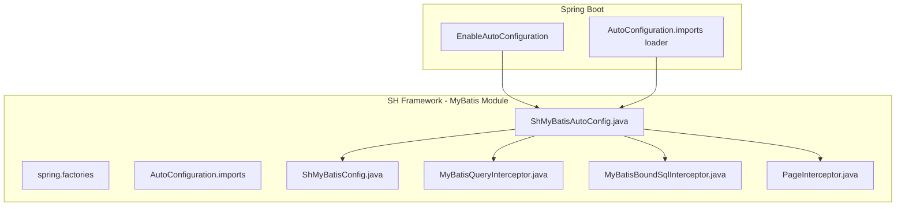
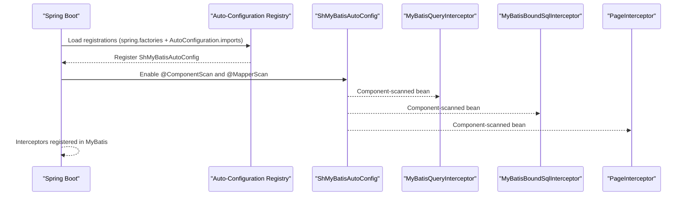
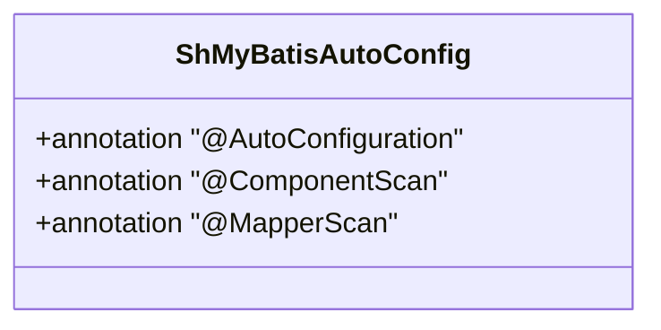
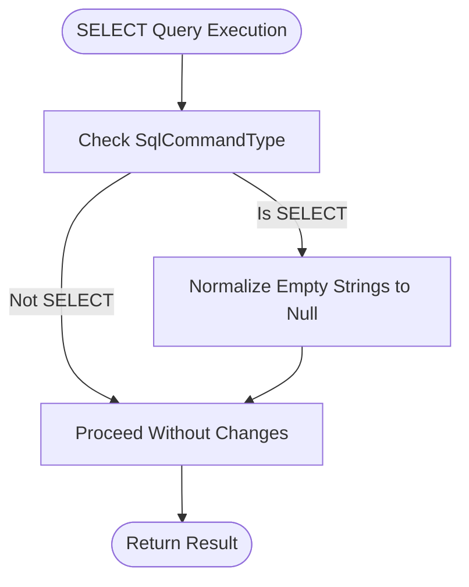
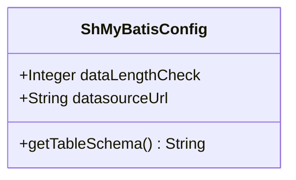
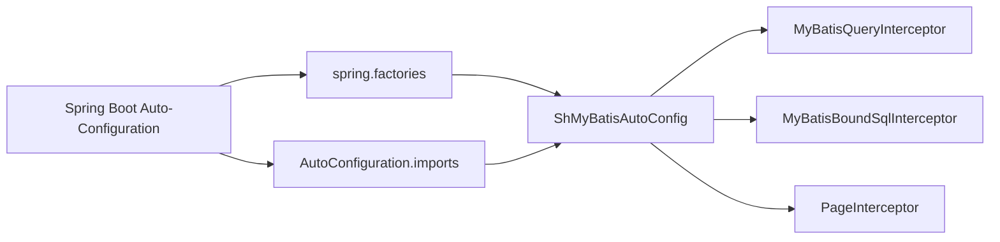

# Auto Configuration

<cite>
**Referenced Files in This Document**
- [ShMyBatisAutoConfig.java](file://sh-mybatis/src/main/java/com/wkclz/mybatis/ShMyBatisAutoConfig.java)
- [spring.factories](file://sh-mybatis/src/main/resources/META-INF/spring.factories)
- [AutoConfiguration.imports](file://sh-mybatis/src/main/resources/META-INF/spring/org.springframework.boot.autoconfigure.AutoConfiguration.imports)
- [ShMyBatisConfig.java](file://sh-mybatis/src/main/java/com/wkclz/mybatis/config/ShMyBatisConfig.java)
- [MyBatisQueryInterceptor.java](file://sh-mybatis/src/main/java/com/wkclz/mybatis/interceptor/MyBatisQueryInterceptor.java)
- [MyBatisBoundSqlInterceptor.java](file://sh-mybatis/src/main/java/com/wkclz/mybatis/interceptor/MyBatisBoundSqlInterceptor.java)
- [PageInterceptor.java](file://sh-mybatis/src/main/java/com/github/pagehelper/PageInterceptor.java)
- [application.yml](file://sh-demo/src/main/resources/config/application.yml)
</cite>

## Table of Contents
1. [Introduction](#introduction)
2. [Project Structure](#project-structure)
3. [Core Components](#core-components)
4. [Architecture Overview](#architecture-overview)
5. [Detailed Component Analysis](#detailed-component-analysis)
6. [Dependency Analysis](#dependency-analysis)
7. [Performance Considerations](#performance-considerations)
8. [Troubleshooting Guide](#troubleshooting-guide)
9. [Conclusion](#conclusion)
10. [Appendices](#appendices)

## Introduction
This document explains the MyBatis auto-configuration in the SH Framework, focusing on the ShMyBatisAutoConfig class and its role in Spring Boot’s auto-configuration mechanism. It covers how the auto-configuration is registered via spring.factories and the modern AutoConfiguration.imports metadata, what beans are automatically created, how interceptors are registered, configuration properties and environment-specific settings, conditional auto-configuration behavior, integration with other framework modules, customization and overrides, and practical migration guidance from manual to auto-configuration.

## Project Structure
The MyBatis auto-configuration module contributes the following key elements:
- An auto-configuration class annotated for Spring Boot auto-configuration
- Registration via spring.factories and AutoConfiguration.imports
- A configuration class for MyBatis-related properties
- Interceptors for query parameter normalization and BoundSql augmentation
- Optional PageHelper integration via a provided PageInterceptor

**Diagram sources**
- [ShMyBatisAutoConfig.java:1-14](file://sh-mybatis/src/main/java/com/wkclz/mybatis/ShMyBatisAutoConfig.java#L1-L14)
- [spring.factories:1-3](file://sh-mybatis/src/main/resources/META-INF/spring.factories#L1-L3)
- [AutoConfiguration.imports:1-2](file://sh-mybatis/src/main/resources/META-INF/spring/org.springframework.boot.autoconfigure.AutoConfiguration.imports#L1-L2)
- [ShMyBatisConfig.java:1-41](file://sh-mybatis/src/main/java/com/wkclz/mybatis/config/ShMyBatisConfig.java#L1-L41)
- [MyBatisQueryInterceptor.java:1-39](file://sh-mybatis/src/main/java/com/wkclz/mybatis/interceptor/MyBatisQueryInterceptor.java#L1-L39)
- [MyBatisBoundSqlInterceptor.java:1-31](file://sh-mybatis/src/main/java/com/wkclz/mybatis/interceptor/MyBatisBoundSqlInterceptor.java#L1-L31)
- [PageInterceptor.java:28-238](file://sh-mybatis/src/main/java/com/github/pagehelper/PageInterceptor.java#L28-L238)

**Section sources**
- [ShMyBatisAutoConfig.java:1-14](file://sh-mybatis/src/main/java/com/wkclz/mybatis/ShMyBatisAutoConfig.java#L1-L14)
- [spring.factories:1-3](file://sh-mybatis/src/main/resources/META-INF/spring.factories#L1-L3)
- [AutoConfiguration.imports:1-2](file://sh-mybatis/src/main/resources/META-INF/spring/org.springframework.boot.autoconfigure.AutoConfiguration.imports#L1-L2)

## Core Components
- ShMyBatisAutoConfig: The primary auto-configuration class that enables component scanning and Mapper scanning for the MyBatis module. It is registered through both spring.factories and AutoConfiguration.imports to activate the configuration in Spring Boot.
- ShMyBatisConfig: A configuration class that reads properties such as data length check flag and derives database schema from the datasource URL.
- Interceptors:
  - MyBatisQueryInterceptor: Normalizes empty string parameters to null for SELECT queries.
  - MyBatisBoundSqlInterceptor: Injects contextual metadata (such as updater identity) into BoundSql when placeholders are present.
  - PageInterceptor: Provides pagination capabilities via PageHelper integration.

These components collectively enable automatic bean creation and behavior customization without manual wiring.

**Section sources**
- [ShMyBatisAutoConfig.java:1-14](file://sh-mybatis/src/main/java/com/wkclz/mybatis/ShMyBatisAutoConfig.java#L1-L14)
- [ShMyBatisConfig.java:1-41](file://sh-mybatis/src/main/java/com/wkclz/mybatis/config/ShMyBatisConfig.java#L1-L41)
- [MyBatisQueryInterceptor.java:1-39](file://sh-mybatis/src/main/java/com/wkclz/mybatis/interceptor/MyBatisQueryInterceptor.java#L1-L39)
- [MyBatisBoundSqlInterceptor.java:1-31](file://sh-mybatis/src/main/java/com/wkclz/mybatis/interceptor/MyBatisBoundSqlInterceptor.java#L1-L31)
- [PageInterceptor.java:28-238](file://sh-mybatis/src/main/java/com/github/pagehelper/PageInterceptor.java#L28-L238)

## Architecture Overview
The auto-configuration integrates with Spring Boot’s discovery mechanisms and exposes MyBatis-related beans and behaviors. The diagram below illustrates the activation flow and the resulting beans and interceptors.

**Diagram sources**
- [spring.factories:1-3](file://sh-mybatis/src/main/resources/META-INF/spring.factories#L1-L3)
- [AutoConfiguration.imports:1-2](file://sh-mybatis/src/main/resources/META-INF/spring/org.springframework.boot.autoconfigure.AutoConfiguration.imports#L1-L2)
- [ShMyBatisAutoConfig.java:1-14](file://sh-mybatis/src/main/java/com/wkclz/mybatis/ShMyBatisAutoConfig.java#L1-L14)
- [MyBatisQueryInterceptor.java:1-39](file://sh-mybatis/src/main/java/com/wkclz/mybatis/interceptor/MyBatisQueryInterceptor.java#L1-L39)
- [MyBatisBoundSqlInterceptor.java:1-31](file://sh-mybatis/src/main/java/com/wkclz/mybatis/interceptor/MyBatisBoundSqlInterceptor.java#L1-L31)
- [PageInterceptor.java:28-238](file://sh-mybatis/src/main/java/com/github/pagehelper/PageInterceptor.java#L28-L238)

## Detailed Component Analysis

### ShMyBatisAutoConfig
- Purpose: Enables component scanning and Mapper scanning for the MyBatis module so that interceptors and related beans are picked up automatically.
- Registration:
  - spring.factories: Declares the auto-configuration class under EnableAutoConfiguration.
  - AutoConfiguration.imports: Declares the same class for the modern imports-based discovery.
- Behavior:
  - ComponentScan targets the module’s base package.
  - MapperScan targets the mapper package for automatic Mapper registration.

**Diagram sources**
- [ShMyBatisAutoConfig.java:1-14](file://sh-mybatis/src/main/java/com/wkclz/mybatis/ShMyBatisAutoConfig.java#L1-L14)

**Section sources**
- [ShMyBatisAutoConfig.java:1-14](file://sh-mybatis/src/main/java/com/wkclz/mybatis/ShMyBatisAutoConfig.java#L1-L14)
- [spring.factories:1-3](file://sh-mybatis/src/main/resources/META-INF/spring.factories#L1-L3)
- [AutoConfiguration.imports:1-2](file://sh-mybatis/src/main/resources/META-INF/spring/org.springframework.boot.autoconfigure.AutoConfiguration.imports#L1-L2)

### Interceptor Registration and Functionality
- MyBatisQueryInterceptor:
  - Intercepts SELECT queries and normalizes empty string parameters to null.
  - Applied via component scanning enabled by the auto-configuration.
- MyBatisBoundSqlInterceptor:
  - Intercepts BoundSql preparation and injects contextual metadata when placeholders are detected.
  - Applied via component scanning enabled by the auto-configuration.
- PageInterceptor:
  - Provides pagination support via PageHelper.
  - Applied via component scanning enabled by the auto-configuration.

**Diagram sources**
- [MyBatisQueryInterceptor.java:1-39](file://sh-mybatis/src/main/java/com/wkclz/mybatis/interceptor/MyBatisQueryInterceptor.java#L1-L39)

**Section sources**
- [MyBatisQueryInterceptor.java:1-39](file://sh-mybatis/src/main/java/com/wkclz/mybatis/interceptor/MyBatisQueryInterceptor.java#L1-L39)
- [MyBatisBoundSqlInterceptor.java:1-31](file://sh-mybatis/src/main/java/com/wkclz/mybatis/interceptor/MyBatisBoundSqlInterceptor.java#L1-L31)
- [PageInterceptor.java:28-238](file://sh-mybatis/src/main/java/com/github/pagehelper/PageInterceptor.java#L28-L238)

### Configuration Properties and Environment Settings
- ShMyBatisConfig:
  - Property: data-length-check flag for enabling/disabling data length checks.
  - Property: datasource URL used to derive the database schema.
  - Utility: Extracts schema from JDBC URL for downstream usage.
- Environment-specific settings:
  - Properties are loaded from the Spring environment and can be overridden per profile or deployment.

**Diagram sources**
- [ShMyBatisConfig.java:1-41](file://sh-mybatis/src/main/java/com/wkclz/mybatis/config/ShMyBatisConfig.java#L1-L41)

**Section sources**
- [ShMyBatisConfig.java:1-41](file://sh-mybatis/src/main/java/com/wkclz/mybatis/config/ShMyBatisConfig.java#L1-L41)

### Conditional Auto-Configuration
- Presence-based activation:
  - The auto-configuration relies on the presence of the MyBatis module and its dependencies. As long as the module is on the classpath and the registration entries exist, Spring Boot will activate ShMyBatisAutoConfig.
- No explicit @Conditional annotations:
  - The current implementation does not declare explicit conditions; therefore, activation occurs when dependencies and registration entries are satisfied.

**Section sources**
- [ShMyBatisAutoConfig.java:1-14](file://sh-mybatis/src/main/java/com/wkclz/mybatis/ShMyBatisAutoConfig.java#L1-L14)
- [spring.factories:1-3](file://sh-mybatis/src/main/resources/META-INF/spring.factories#L1-L3)
- [AutoConfiguration.imports:1-2](file://sh-mybatis/src/main/resources/META-INF/spring/org.springframework.boot.autoconfigure.AutoConfiguration.imports#L1-L2)

### Integration with Other Framework Modules
- Dynamic Data Source:
  - The framework includes a dynamic data source module that clears thread-local state after Mapper execution, complementing MyBatis operations.
- Example configuration:
  - The demo module demonstrates property usage that may influence MyBatis behavior indirectly (e.g., logging or environment-specific settings).

**Section sources**
- [application.yml](file://sh-demo/src/main/resources/config/application.yml)

## Dependency Analysis
The auto-configuration depends on:
- Spring Boot’s auto-configuration infrastructure (EnableAutoConfiguration and AutoConfiguration.imports)
- MyBatis and MyBatis-Spring integration for Mapper scanning and interceptor registration
- Optional PageHelper for pagination

**Diagram sources**
- [spring.factories:1-3](file://sh-mybatis/src/main/resources/META-INF/spring.factories#L1-L3)
- [AutoConfiguration.imports:1-2](file://sh-mybatis/src/main/resources/META-INF/spring/org.springframework.boot.autoconfigure.AutoConfiguration.imports#L1-L2)
- [ShMyBatisAutoConfig.java:1-14](file://sh-mybatis/src/main/java/com/wkclz/mybatis/ShMyBatisAutoConfig.java#L1-L14)
- [MyBatisQueryInterceptor.java:1-39](file://sh-mybatis/src/main/java/com/wkclz/mybatis/interceptor/MyBatisQueryInterceptor.java#L1-L39)
- [MyBatisBoundSqlInterceptor.java:1-31](file://sh-mybatis/src/main/java/com/wkclz/mybatis/interceptor/MyBatisBoundSqlInterceptor.java#L1-L31)
- [PageInterceptor.java:28-238](file://sh-mybatis/src/main/java/com/github/pagehelper/PageInterceptor.java#L28-L238)

**Section sources**
- [spring.factories:1-3](file://sh-mybatis/src/main/resources/META-INF/spring.factories#L1-L3)
- [AutoConfiguration.imports:1-2](file://sh-mybatis/src/main/resources/META-INF/spring/org.springframework.boot.autoconfigure.AutoConfiguration.imports#L1-L2)
- [ShMyBatisAutoConfig.java:1-14](file://sh-mybatis/src/main/java/com/wkclz/mybatis/ShMyBatisAutoConfig.java#L1-L14)

## Performance Considerations
- Interceptor overhead:
  - Query parameter normalization and BoundSql augmentation introduce minimal overhead but improve data consistency and reduce runtime errors.
- Pagination:
  - PageInterceptor adds pagination logic; ensure appropriate page sizes and index coverage to avoid heavy COUNT queries.
- Schema derivation:
  - Schema extraction from JDBC URL is lightweight but should be validated to prevent misconfiguration in environments with complex URLs.

[No sources needed since this section provides general guidance]

## Troubleshooting Guide
Common issues and resolutions:
- Auto-configuration not activating:
  - Verify that spring.factories and AutoConfiguration.imports include the ShMyBatisAutoConfig class and that the module is on the classpath.
- Interceptors not applied:
  - Confirm component scanning is enabled and that interceptors are annotated as components.
- Property resolution failures:
  - Ensure required properties are present in the environment or provide defaults in configuration.
- Pagination not working:
  - Confirm PageInterceptor is registered and that PageHelper is configured appropriately.

**Section sources**
- [spring.factories:1-3](file://sh-mybatis/src/main/resources/META-INF/spring.factories#L1-L3)
- [AutoConfiguration.imports:1-2](file://sh-mybatis/src/main/resources/META-INF/spring/org.springframework.boot.autoconfigure.AutoConfiguration.imports#L1-L2)
- [ShMyBatisConfig.java:1-41](file://sh-mybatis/src/main/java/com/wkclz/mybatis/config/ShMyBatisConfig.java#L1-L41)
- [MyBatisQueryInterceptor.java:1-39](file://sh-mybatis/src/main/java/com/wkclz/mybatis/interceptor/MyBatisQueryInterceptor.java#L1-L39)
- [MyBatisBoundSqlInterceptor.java:1-31](file://sh-mybatis/src/main/java/com/wkclz/mybatis/interceptor/MyBatisBoundSqlInterceptor.java#L1-L31)
- [PageInterceptor.java:28-238](file://sh-mybatis/src/main/java/com/github/pagehelper/PageInterceptor.java#L28-L238)

## Conclusion
ShMyBatisAutoConfig provides a streamlined, registration-driven auto-configuration for the MyBatis module in SH Framework. By leveraging modern AutoConfiguration.imports alongside legacy spring.factories, it ensures broad compatibility while enabling automatic component and Mapper scanning. The included interceptors enhance query parameter handling and BoundSql injection, and the configuration class supports environment-specific settings. Developers can rely on this auto-configuration to minimize boilerplate while retaining flexibility for customization and overrides.

[No sources needed since this section summarizes without analyzing specific files]

## Appendices

### Manual Configuration Alternatives and Migration
- Manual configuration steps equivalent to auto-configuration:
  - Enable component scanning for the module base package.
  - Enable Mapper scanning for the mapper package.
  - Register interceptors as Spring-managed beans.
  - Define configuration properties for data length checks and datasource URL.
- Migration tips:
  - Remove manual bean definitions that duplicate auto-configuration behavior.
  - Validate that interceptors remain active post-migration.
  - Keep configuration properties aligned with ShMyBatisConfig defaults.

[No sources needed since this section provides general guidance]