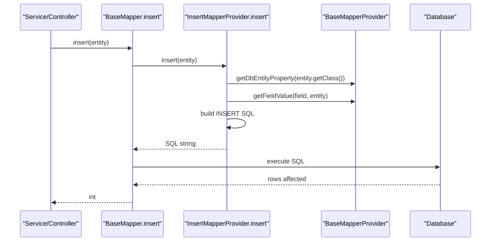
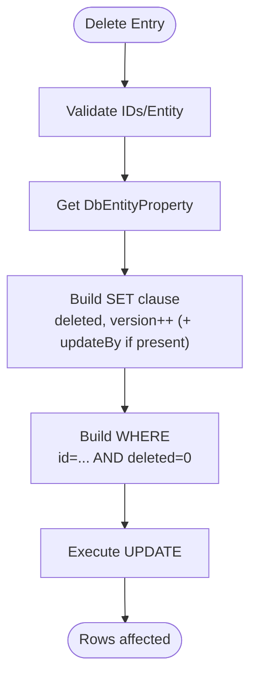
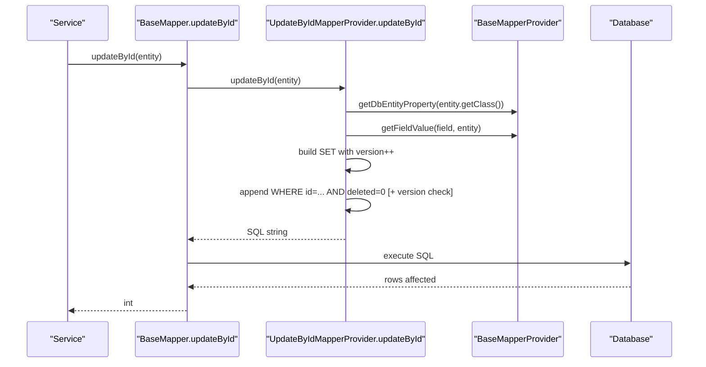
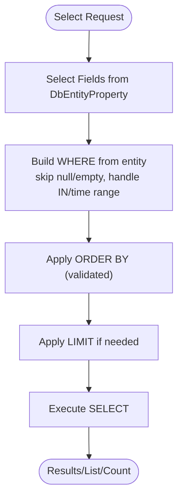
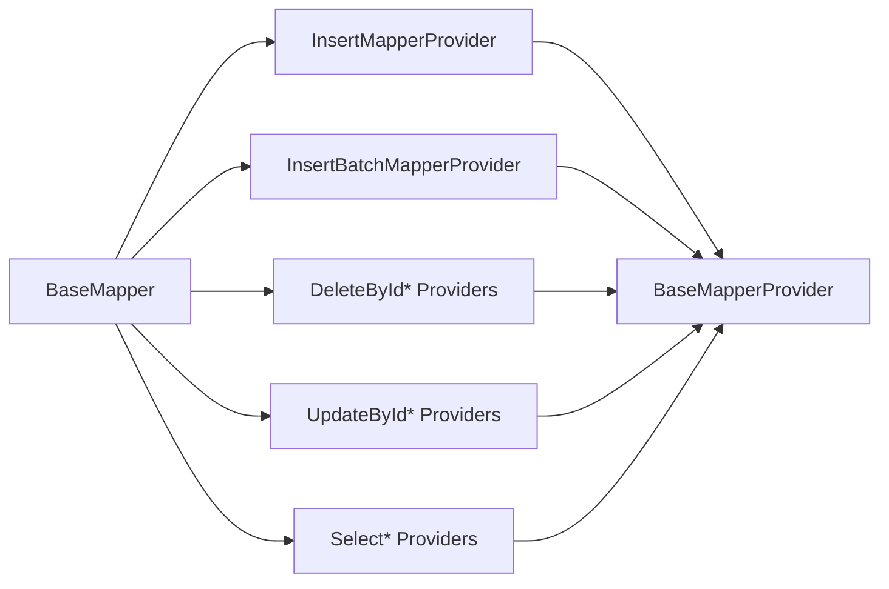

# BaseMapper Interface

<cite>
**Referenced Files in This Document**
- [BaseMapper.java](file://sh-mybatis/src/main/java/com/wkclz/mybatis/mapper/BaseMapper.java)
- [BaseMapperProvider.java](file://sh-mybatis/src/main/java/com/wkclz/mybatis/mapper/impl/BaseMapperProvider.java)
- [InsertMapperProvider.java](file://sh-mybatis/src/main/java/com/wkclz/mybatis/mapper/impl/InsertMapperProvider.java)
- [InsertBatchMapperProvider.java](file://sh-mybatis/src/main/java/com/wkclz/mybatis/mapper/impl/InsertBatchMapperProvider.java)
- [DeleteByIdMapperProvider.java](file://sh-mybatis/src/main/java/com/wkclz/mybatis/mapper/impl/DeleteByIdMapperProvider.java)
- [DeleteByIdEntityMapperProvider.java](file://sh-mybatis/src/main/java/com/wkclz/mybatis/mapper/impl/DeleteByIdEntityMapperProvider.java)
- [DeleteByIdsMapperProvider.java](file://sh-mybatis/src/main/java/com/wkclz/mybatis/mapper/impl/DeleteByIdsMapperProvider.java)
- [DeleteByIdsEntityMapperProvider.java](file://sh-mybatis/src/main/java/com/wkclz/mybatis/mapper/impl/DeleteByIdsEntityMapperProvider.java)
- [UpdateByIdMapperProvider.java](file://sh-mybatis/src/main/java/com/wkclz/mybatis/mapper/impl/UpdateByIdMapperProvider.java)
- [UpdateByIdSelectiveMapperProvider.java](file://sh-mybatis/src/main/java/com/wkclz/mybatis/mapper/impl/UpdateByIdSelectiveMapperProvider.java)
- [UpdateBatchMapperProvider.java](file://sh-mybatis/src/main/java/com/wkclz/mybatis/mapper/impl/UpdateBatchMapperProvider.java)
- [SelectByIdMapperProvider.java](file://sh-mybatis/src/main/java/com/wkclz/mybatis/mapper/impl/SelectByIdMapperProvider.java)
- [SelectByIdsMapperProvider.java](file://sh-mybatis/src/main/java/com/wkclz/mybatis/mapper/impl/SelectByIdsMapperProvider.java)
- [SelectAllMapperProvider.java](file://sh-mybatis/src/main/java/com/wkclz/mybatis/mapper/impl/SelectAllMapperProvider.java)
- [SelectByEntityMapperProvider.java](file://sh-mybatis/src/main/java/com/wkclz/mybatis/mapper/impl/SelectByEntityMapperProvider.java)
- [SelectByEntityWithLimitMapperProvider.java](file://sh-mybatis/src/main/java/com/wkclz/mybatis/mapper/impl/SelectByEntityWithLimitMapperProvider.java)
- [SelectCountByEntityMapperProvider.java](file://sh-mybatis/src/main/java/com/wkclz/mybatis/mapper/impl/SelectCountByEntityMapperProvider.java)
- [SelectOneByEntityMapperProvider.java](file://sh-mybatis/src/main/java/com/wkclz/mybatis/mapper/impl/SelectOneByEntityMapperProvider.java)
</cite>

## Table of Contents
1. [Introduction](#introduction)
2. [Project Structure](#project-structure)
3. [Core Components](#core-components)
4. [Architecture Overview](#architecture-overview)
5. [Detailed Component Analysis](#detailed-component-analysis)
6. [Dependency Analysis](#dependency-analysis)
7. [Performance Considerations](#performance-considerations)
8. [Troubleshooting Guide](#troubleshooting-guide)
9. [Conclusion](#conclusion)

## Introduction
This document explains the BaseMapper interface and its provider-based SQL generation implementation. It covers all 14 predefined CRUD methods, generic type safety with entity and mapper type parameters, the SQL provider pattern, and practical extension examples. It also addresses performance considerations, connection pooling integration, and best practices for large-scale applications.

## Project Structure
The BaseMapper and its providers reside in the sh-mybatis module under the com.wkclz.mybatis.mapper and com.wkclz.mybatis.mapper.impl packages. The interface defines method signatures, while specialized provider classes generate SQL dynamically based on entity metadata.

```mermaid
graph TB
subgraph "Mapper Interfaces"
BM["BaseMapper<T extends BaseEntity>"]
end
subgraph "Providers"
BMP["BaseMapperProvider"]
IMP["InsertMapperProvider"]
IBMP["InsertBatchMapperProvider"]
DIBP["DeleteByIdMapperProvider"]
DIBE["DeleteByIdEntityMapperProvider"]
DIBS["DeleteByIdsMapperProvider"]
DIBES["DeleteByIdsEntityMapperProvider"]
UIBM["UpdateByIdMapperProvider"]
UBSP["UpdateByIdSelectiveMapperProvider"]
UBMP["UpdateBatchMapperProvider"]
SIBP["SelectByIdMapperProvider"]
SIBS["SelectByIdsMapperProvider"]
SAM["SelectAllMapperProvider"]
SBEP["SelectByEntityMapperProvider"]
SBEPL["SelectByEntityWithLimitMapperProvider"]
SCBE["SelectCountByEntityMapperProvider"]
SOBE["SelectOneByEntityMapperProvider"]
end
BM --> IMP
BM --> IBMP
BM --> DIBP
BM --> DIBE
BM --> DIBS
BM --> DIBES
BM --> UIBM
BM --> UBSP
BM --> UBMP
BM --> SIBP
BM --> SIBS
BM --> SAM
BM --> SBEP
BM --> SBEPL
BM --> SCBE
BM --> SOBE
BMP --> SBEP
BMP --> SBEPL
BMP --> SCBE
BMP --> SOBE
BMP --> UIBM
BMP --> IMP
```

**Diagram sources**
- [BaseMapper.java:15-88](file://sh-mybatis/src/main/java/com/wkclz/mybatis/mapper/BaseMapper.java#L15-L88)
- [BaseMapperProvider.java:23-244](file://sh-mybatis/src/main/java/com/wkclz/mybatis/mapper/impl/BaseMapperProvider.java#L23-L244)
- [InsertMapperProvider.java:13-54](file://sh-mybatis/src/main/java/com/wkclz/mybatis/mapper/impl/InsertMapperProvider.java#L13-L54)
- [InsertBatchMapperProvider.java:15-79](file://sh-mybatis/src/main/java/com/wkclz/mybatis/mapper/impl/InsertBatchMapperProvider.java#L15-L79)
- [DeleteByIdMapperProvider.java:14-56](file://sh-mybatis/src/main/java/com/wkclz/mybatis/mapper/impl/DeleteByIdMapperProvider.java#L14-L56)
- [DeleteByIdEntityMapperProvider.java:13-54](file://sh-mybatis/src/main/java/com/wkclz/mybatis/mapper/impl/DeleteByIdEntityMapperProvider.java#L13-L54)
- [DeleteByIdsMapperProvider.java:17-59](file://sh-mybatis/src/main/java/com/wkclz/mybatis/mapper/impl/DeleteByIdsMapperProvider.java#L17-L59)
- [DeleteByIdsEntityMapperProvider.java:15-62](file://sh-mybatis/src/main/java/com/wkclz/mybatis/mapper/impl/DeleteByIdsEntityMapperProvider.java#L15-L62)
- [UpdateByIdMapperProvider.java:13-76](file://sh-mybatis/src/main/java/com/wkclz/mybatis/mapper/impl/UpdateByIdMapperProvider.java#L13-L76)
- [UpdateByIdSelectiveMapperProvider.java](file://sh-mybatis/src/main/java/com/wkclz/mybatis/mapper/impl/UpdateByIdSelectiveMapperProvider.java)
- [UpdateBatchMapperProvider.java](file://sh-mybatis/src/main/java/com/wkclz/mybatis/mapper/impl/UpdateBatchMapperProvider.java)
- [SelectByIdMapperProvider.java:16-50](file://sh-mybatis/src/main/java/com/wkclz/mybatis/mapper/impl/SelectByIdMapperProvider.java#L16-L50)
- [SelectByIdsMapperProvider.java:16-66](file://sh-mybatis/src/main/java/com/wkclz/mybatis/mapper/impl/SelectByIdsMapperProvider.java#L16-L66)
- [SelectAllMapperProvider.java:15-43](file://sh-mybatis/src/main/java/com/wkclz/mybatis/mapper/impl/SelectAllMapperProvider.java#L15-L43)
- [SelectByEntityMapperProvider.java:14-41](file://sh-mybatis/src/main/java/com/wkclz/mybatis/mapper/impl/SelectByEntityMapperProvider.java#L14-L41)
- [SelectByEntityWithLimitMapperProvider.java](file://sh-mybatis/src/main/java/com/wkclz/mybatis/mapper/impl/SelectByEntityWithLimitMapperProvider.java)
- [SelectCountByEntityMapperProvider.java:11-30](file://sh-mybatis/src/main/java/com/wkclz/mybatis/mapper/impl/SelectCountByEntityMapperProvider.java#L11-L30)
- [SelectOneByEntityMapperProvider.java:14-36](file://sh-mybatis/src/main/java/com/wkclz/mybatis/mapper/impl/SelectOneByEntityMapperProvider.java#L14-L36)

**Section sources**
- [BaseMapper.java:15-88](file://sh-mybatis/src/main/java/com/wkclz/mybatis/mapper/BaseMapper.java#L15-L88)

## Core Components
- BaseMapper<T extends BaseEntity>: Declares 14 CRUD methods with generic type T for entity type safety. Methods delegate SQL generation to provider classes via @InsertProvider, @UpdateProvider, @DeleteProvider, and @SelectProvider annotations.
- BaseMapperProvider: Shared base for SQL generation, caching entity metadata, building WHERE clauses, IN lists, ORDER BY with injection prevention, and extracting entity class from Mapper generics.

Key characteristics:
- Generic typing: T ensures compile-time type safety for entities and automatic provider resolution.
- Provider pattern: Each operation has a dedicated provider class to construct SQL safely and consistently.
- Logical deletion: Providers consistently filter records where the deleted flag equals zero and update version fields during updates/deletes.
- Optimistic locking: UpdateById variants increment a version field and conditionally include a version check.

**Section sources**
- [BaseMapper.java:15-88](file://sh-mybatis/src/main/java/com/wkclz/mybatis/mapper/BaseMapper.java#L15-L88)
- [BaseMapperProvider.java:23-244](file://sh-mybatis/src/main/java/com/wkclz/mybatis/mapper/impl/BaseMapperProvider.java#L23-L244)

## Architecture Overview
The BaseMapper interface delegates to provider classes that generate SQL based on entity metadata. The BaseMapperProvider caches metadata per entity class and enforces safe SQL construction.

```mermaid
classDiagram
class BaseMapper~T~ {
+insert(entity) int
+insertBatch(entities) int
+deleteById(id) int
+deleteByIdEntity(entity) int
+deleteByIds(ids) int
+deleteByIdsEntity(entity) int
+updateById(entity) int
+updateByIdSelective(entity) int
+updateBatch(entity) int
+selectById(id) T
+selectByIds(ids) T[]
+selectAll() T[]
+selectByEntity(entity) T[]
+selectByEntityWithLimit(entity) T[]
+selectCountByEntity(entity) long
+selectOneByEntity(entity) T
}
class BaseMapperProvider {
+getDbEntityProperty(entityClass)
+getEntityClassFromContext(context)
+getFieldValue(field, entity)
+buildInClause(listValue, fieldName) String
+buildWhereClause(entity) String
+buildOrderByClause(orderBy, property, defaultOrderBy) String
}
class InsertMapperProvider
class InsertBatchMapperProvider
class DeleteByIdMapperProvider
class DeleteByIdEntityMapperProvider
class DeleteByIdsMapperProvider
class DeleteByIdsEntityMapperProvider
class UpdateByIdMapperProvider
class UpdateByIdSelectiveMapperProvider
class UpdateBatchMapperProvider
class SelectByIdMapperProvider
class SelectByIdsMapperProvider
class SelectAllMapperProvider
class SelectByEntityMapperProvider
class SelectByEntityWithLimitMapperProvider
class SelectCountByEntityMapperProvider
class SelectOneByEntityMapperProvider
BaseMapper <|.. InsertMapperProvider
BaseMapper <|.. InsertBatchMapperProvider
BaseMapper <|.. DeleteByIdMapperProvider
BaseMapper <|.. DeleteByIdEntityMapperProvider
BaseMapper <|.. DeleteByIdsMapperProvider
BaseMapper <|.. DeleteByIdsEntityMapperProvider
BaseMapper <|.. UpdateByIdMapperProvider
BaseMapper <|.. UpdateByIdSelectiveMapperProvider
BaseMapper <|.. UpdateBatchMapperProvider
BaseMapper <|.. SelectByIdMapperProvider
BaseMapper <|.. SelectByIdsMapperProvider
BaseMapper <|.. SelectAllMapperProvider
BaseMapper <|.. SelectByEntityMapperProvider
BaseMapper <|.. SelectByEntityWithLimitMapperProvider
BaseMapper <|.. SelectCountByEntityMapperProvider
BaseMapper <|.. SelectOneByEntityMapperProvider
BaseMapperProvider <|-- InsertMapperProvider
BaseMapperProvider <|-- InsertBatchMapperProvider
BaseMapperProvider <|-- DeleteByIdMapperProvider
BaseMapperProvider <|-- DeleteByIdEntityMapperProvider
BaseMapperProvider <|-- DeleteByIdsMapperProvider
BaseMapperProvider <|-- DeleteByIdsEntityMapperProvider
BaseMapperProvider <|-- UpdateByIdMapperProvider
BaseMapperProvider <|-- UpdateByIdSelectiveMapperProvider
BaseMapperProvider <|-- UpdateBatchMapperProvider
BaseMapperProvider <|-- SelectByIdMapperProvider
BaseMapperProvider <|-- SelectByIdsMapperProvider
BaseMapperProvider <|-- SelectAllMapperProvider
BaseMapperProvider <|-- SelectByEntityMapperProvider
BaseMapperProvider <|-- SelectByEntityWithLimitMapperProvider
BaseMapperProvider <|-- SelectCountByEntityMapperProvider
BaseMapperProvider <|-- SelectOneByEntityMapperProvider
```

**Diagram sources**
- [BaseMapper.java:15-88](file://sh-mybatis/src/main/java/com/wkclz/mybatis/mapper/BaseMapper.java#L15-L88)
- [BaseMapperProvider.java:23-244](file://sh-mybatis/src/main/java/com/wkclz/mybatis/mapper/impl/BaseMapperProvider.java#L23-L244)
- [InsertMapperProvider.java:13-54](file://sh-mybatis/src/main/java/com/wkclz/mybatis/mapper/impl/InsertMapperProvider.java#L13-L54)
- [InsertBatchMapperProvider.java:15-79](file://sh-mybatis/src/main/java/com/wkclz/mybatis/mapper/impl/InsertBatchMapperProvider.java#L15-L79)
- [DeleteByIdMapperProvider.java:14-56](file://sh-mybatis/src/main/java/com/wkclz/mybatis/mapper/impl/DeleteByIdMapperProvider.java#L14-L56)
- [DeleteByIdEntityMapperProvider.java:13-54](file://sh-mybatis/src/main/java/com/wkclz/mybatis/mapper/impl/DeleteByIdEntityMapperProvider.java#L13-L54)
- [DeleteByIdsMapperProvider.java:17-59](file://sh-mybatis/src/main/java/com/wkclz/mybatis/mapper/impl/DeleteByIdsMapperProvider.java#L17-L59)
- [DeleteByIdsEntityMapperProvider.java:15-62](file://sh-mybatis/src/main/java/com/wkclz/mybatis/mapper/impl/DeleteByIdsEntityMapperProvider.java#L15-L62)
- [UpdateByIdMapperProvider.java:13-76](file://sh-mybatis/src/main/java/com/wkclz/mybatis/mapper/impl/UpdateByIdMapperProvider.java#L13-L76)
- [UpdateByIdSelectiveMapperProvider.java](file://sh-mybatis/src/main/java/com/wkclz/mybatis/mapper/impl/UpdateByIdSelectiveMapperProvider.java)
- [UpdateBatchMapperProvider.java](file://sh-mybatis/src/main/java/com/wkclz/mybatis/mapper/impl/UpdateBatchMapperProvider.java)
- [SelectByIdMapperProvider.java:16-50](file://sh-mybatis/src/main/java/com/wkclz/mybatis/mapper/impl/SelectByIdMapperProvider.java#L16-L50)
- [SelectByIdsMapperProvider.java:16-66](file://sh-mybatis/src/main/java/com/wkclz/mybatis/mapper/impl/SelectByIdsMapperProvider.java#L16-L66)
- [SelectAllMapperProvider.java:15-43](file://sh-mybatis/src/main/java/com/wkclz/mybatis/mapper/impl/SelectAllMapperProvider.java#L15-L43)
- [SelectByEntityMapperProvider.java:14-41](file://sh-mybatis/src/main/java/com/wkclz/mybatis/mapper/impl/SelectByEntityMapperProvider.java#L14-L41)
- [SelectByEntityWithLimitMapperProvider.java](file://sh-mybatis/src/main/java/com/wkclz/mybatis/mapper/impl/SelectByEntityWithLimitMapperProvider.java)
- [SelectCountByEntityMapperProvider.java:11-30](file://sh-mybatis/src/main/java/com/wkclz/mybatis/mapper/impl/SelectCountByEntityMapperProvider.java#L11-L30)
- [SelectOneByEntityMapperProvider.java:14-36](file://sh-mybatis/src/main/java/com/wkclz/mybatis/mapper/impl/SelectOneByEntityMapperProvider.java#L14-L36)

## Detailed Component Analysis

### BaseMapper Interface
- Purpose: Define a generic contract for single-table CRUD operations with automatic SQL generation via providers.
- Generics: T extends BaseEntity ensures type-safe entity handling and provider resolution.
- Annotations: Each method uses @InsertProvider/@UpdateProvider/@DeleteProvider/@SelectProvider to bind to a specific provider method.

**Section sources**
- [BaseMapper.java:15-88](file://sh-mybatis/src/main/java/com/wkclz/mybatis/mapper/BaseMapper.java#L15-L88)

### BaseMapperProvider (Shared Utilities)
- Caching: Maintains a concurrent cache of entity metadata keyed by entity class.
- Reflection helpers: Extracts entity class from Mapper generics and reads field values via getters or fields.
- Safety utilities:
  - buildWhereClause: Skips null/empty values, supports equality and IN conditions, time range filters, and logical deletion.
  - buildInClause: Builds parameterized IN clauses safely.
  - buildOrderByClause: Validates and sanitizes ORDER BY expressions against known column names.

**Section sources**
- [BaseMapperProvider.java:23-244](file://sh-mybatis/src/main/java/com/wkclz/mybatis/mapper/impl/BaseMapperProvider.java#L23-L244)

### Insert Operations
- insert(T): Generates INSERT with only non-null insertable fields; validates not-null constraints.
- insertBatch(List<T>): Bulk INSERT with pre-validation and default value assignment; constructs multi-row VALUES.

**Diagram sources**
- [BaseMapper.java:17-24](file://sh-mybatis/src/main/java/com/wkclz/mybatis/mapper/BaseMapper.java#L17-L24)
- [InsertMapperProvider.java:21-52](file://sh-mybatis/src/main/java/com/wkclz/mybatis/mapper/impl/InsertMapperProvider.java#L21-L52)
- [BaseMapperProvider.java:25-89](file://sh-mybatis/src/main/java/com/wkclz/mybatis/mapper/impl/BaseMapperProvider.java#L25-L89)

**Section sources**
- [BaseMapper.java:17-24](file://sh-mybatis/src/main/java/com/wkclz/mybatis/mapper/BaseMapper.java#L17-L24)
- [InsertMapperProvider.java:21-52](file://sh-mybatis/src/main/java/com/wkclz/mybatis/mapper/impl/InsertMapperProvider.java#L21-L52)
- [InsertBatchMapperProvider.java:23-77](file://sh-mybatis/src/main/java/com/wkclz/mybatis/mapper/impl/InsertBatchMapperProvider.java#L23-L77)

### Delete Operations
- deleteById(Long): Logical delete using current microsecond timestamp plus version increment; optional updateBy population.
- deleteByIdEntity(T): Same as above but accepts an entity with ID.
- deleteByIds(List<Long>): Batch logical delete with IN clause and version increment.
- deleteByIdsEntity(T): Batch logical delete using an entity-provided IDs list.

**Diagram sources**
- [DeleteByIdMapperProvider.java:22-54](file://sh-mybatis/src/main/java/com/wkclz/mybatis/mapper/impl/DeleteByIdMapperProvider.java#L22-L54)
- [DeleteByIdEntityMapperProvider.java:21-51](file://sh-mybatis/src/main/java/com/wkclz/mybatis/mapper/impl/DeleteByIdEntityMapperProvider.java#L21-L51)
- [DeleteByIdsMapperProvider.java:24-57](file://sh-mybatis/src/main/java/com/wkclz/mybatis/mapper/impl/DeleteByIdsMapperProvider.java#L24-L57)
- [DeleteByIdsEntityMapperProvider.java:22-59](file://sh-mybatis/src/main/java/com/wkclz/mybatis/mapper/impl/DeleteByIdsEntityMapperProvider.java#L22-L59)

**Section sources**
- [BaseMapper.java:28-42](file://sh-mybatis/src/main/java/com/wkclz/mybatis/mapper/BaseMapper.java#L28-L42)
- [DeleteByIdMapperProvider.java:22-54](file://sh-mybatis/src/main/java/com/wkclz/mybatis/mapper/impl/DeleteByIdMapperProvider.java#L22-L54)
- [DeleteByIdEntityMapperProvider.java:21-51](file://sh-mybatis/src/main/java/com/wkclz/mybatis/mapper/impl/DeleteByIdEntityMapperProvider.java#L21-L51)
- [DeleteByIdsMapperProvider.java:24-57](file://sh-mybatis/src/main/java/com/wkclz/mybatis/mapper/impl/DeleteByIdsMapperProvider.java#L24-L57)
- [DeleteByIdsEntityMapperProvider.java:22-59](file://sh-mybatis/src/main/java/com/wkclz/mybatis/mapper/impl/DeleteByIdsEntityMapperProvider.java#L22-L59)

### Update Operations
- updateById(T): Full-field update with optimistic lock (version increment and optional version check).
- updateByIdSelective(T): Partial update skipping null fields; still respects not-null constraints.
- updateBatch(T): Batch update without optimistic lock.

**Diagram sources**
- [BaseMapper.java:46-56](file://sh-mybatis/src/main/java/com/wkclz/mybatis/mapper/BaseMapper.java#L46-L56)
- [UpdateByIdMapperProvider.java:20-74](file://sh-mybatis/src/main/java/com/wkclz/mybatis/mapper/impl/UpdateByIdMapperProvider.java#L20-L74)
- [BaseMapperProvider.java:25-89](file://sh-mybatis/src/main/java/com/wkclz/mybatis/mapper/impl/BaseMapperProvider.java#L25-L89)

**Section sources**
- [BaseMapper.java:46-56](file://sh-mybatis/src/main/java/com/wkclz/mybatis/mapper/BaseMapper.java#L46-L56)
- [UpdateByIdMapperProvider.java:20-74](file://sh-mybatis/src/main/java/com/wkclz/mybatis/mapper/impl/UpdateByIdMapperProvider.java#L20-L74)

### Select Operations
- selectById(Long): Fetch single record by ID with logical deletion filter; selects only object fields.
- selectByIds(List<Long>): Fetch multiple records by ID list; selects list fields.
- selectAll(): Fetch all records with logical deletion filter and default ordering.
- selectByEntity(T): Query by entity conditions with ORDER BY built from entity.orderBy; list fields selected.
- selectByEntityWithLimit(T): Same as above but with LIMIT applied.
- selectOneByEntity(T): Single result query with LIMIT 1.
- selectCountByEntity(T): Count matching records.

**Diagram sources**
- [SelectByIdMapperProvider.java:26-48](file://sh-mybatis/src/main/java/com/wkclz/mybatis/mapper/impl/SelectByIdMapperProvider.java#L26-L48)
- [SelectByIdsMapperProvider.java:25-64](file://sh-mybatis/src/main/java/com/wkclz/mybatis/mapper/impl/SelectByIdsMapperProvider.java#L25-L64)
- [SelectAllMapperProvider.java:23-41](file://sh-mybatis/src/main/java/com/wkclz/mybatis/mapper/impl/SelectAllMapperProvider.java#L23-L41)
- [SelectByEntityMapperProvider.java:22-39](file://sh-mybatis/src/main/java/com/wkclz/mybatis/mapper/impl/SelectByEntityMapperProvider.java#L22-L39)
- [SelectByEntityWithLimitMapperProvider.java](file://sh-mybatis/src/main/java/com/wkclz/mybatis/mapper/impl/SelectByEntityWithLimitMapperProvider.java)
- [SelectOneByEntityMapperProvider.java:21-35](file://sh-mybatis/src/main/java/com/wkclz/mybatis/mapper/impl/SelectOneByEntityMapperProvider.java#L21-L35)
- [SelectCountByEntityMapperProvider.java:18-28](file://sh-mybatis/src/main/java/com/wkclz/mybatis/mapper/impl/SelectCountByEntityMapperProvider.java#L18-L28)
- [BaseMapperProvider.java:124-178](file://sh-mybatis/src/main/java/com/wkclz/mybatis/mapper/impl/BaseMapperProvider.java#L124-L178)
- [BaseMapperProvider.java:189-242](file://sh-mybatis/src/main/java/com/wkclz/mybatis/mapper/impl/BaseMapperProvider.java#L189-L242)

**Section sources**
- [BaseMapper.java:60-87](file://sh-mybatis/src/main/java/com/wkclz/mybatis/mapper/BaseMapper.java#L60-L87)
- [SelectByIdMapperProvider.java:26-48](file://sh-mybatis/src/main/java/com/wkclz/mybatis/mapper/impl/SelectByIdMapperProvider.java#L26-L48)
- [SelectByIdsMapperProvider.java:25-64](file://sh-mybatis/src/main/java/com/wkclz/mybatis/mapper/impl/SelectByIdsMapperProvider.java#L25-L64)
- [SelectAllMapperProvider.java:23-41](file://sh-mybatis/src/main/java/com/wkclz/mybatis/mapper/impl/SelectAllMapperProvider.java#L23-L41)
- [SelectByEntityMapperProvider.java:22-39](file://sh-mybatis/src/main/java/com/wkclz/mybatis/mapper/impl/SelectByEntityMapperProvider.java#L22-L39)
- [SelectByEntityWithLimitMapperProvider.java](file://sh-mybatis/src/main/java/com/wkclz/mybatis/mapper/impl/SelectByEntityWithLimitMapperProvider.java)
- [SelectOneByEntityMapperProvider.java:21-35](file://sh-mybatis/src/main/java/com/wkclz/mybatis/mapper/impl/SelectOneByEntityMapperProvider.java#L21-L35)
- [SelectCountByEntityMapperProvider.java:18-28](file://sh-mybatis/src/main/java/com/wkclz/mybatis/mapper/impl/SelectCountByEntityMapperProvider.java#L18-L28)

### Extending BaseMapper for Custom Entities
- Create a custom mapper interface extending BaseMapper with your entity type.
- Example path: [UserMapper.java](file://sh-demo/src/main/java/com/wkclz/demo/mapper/UserMapper.java)
- Implement custom SQL providers by subclassing BaseMapperProvider and registering via @SelectProvider/@UpdateProvider/@InsertProvider/@DeleteProvider in your mapper methods.
- Best practice: Keep provider logic focused on SQL generation and reuse shared utilities from BaseMapperProvider.

[No sources needed since this section provides general guidance]

### Implementing Custom SQL Providers
- Subclass BaseMapperProvider and implement a method named after the operation (e.g., selectCustom, updateCustom).
- Use getDbEntityProperty to access table/column metadata.
- Leverage buildWhereClause/buildOrderByClause for safety and consistency.
- Register the provider in BaseMapper methods via @SelectProvider/@UpdateProvider/@InsertProvider/@DeleteProvider.

**Section sources**
- [BaseMapperProvider.java:25-89](file://sh-mybatis/src/main/java/com/wkclz/mybatis/mapper/impl/BaseMapperProvider.java#L25-L89)
- [BaseMapperProvider.java:124-178](file://sh-mybatis/src/main/java/com/wkclz/mybatis/mapper/impl/BaseMapperProvider.java#L124-L178)
- [BaseMapperProvider.java:189-242](file://sh-mybatis/src/main/java/com/wkclz/mybatis/mapper/impl/BaseMapperProvider.java#L189-L242)

### Handling Complex Query Scenarios
- Composite conditions: Use entity.orderBy and timeFrom/timeTo fields supported by buildWhereClause.
- Safe ordering: buildOrderByClause validates column names and directions to prevent SQL injection.
- Large IN lists: buildInClause generates parameterized IN clauses; consider batching for very large lists.
- Pagination: Use selectByEntityWithLimit for paged queries; combine with buildOrderByClause for deterministic ordering.

**Section sources**
- [BaseMapperProvider.java:99-117](file://sh-mybatis/src/main/java/com/wkclz/mybatis/mapper/impl/BaseMapperProvider.java#L99-L117)
- [BaseMapperProvider.java:124-178](file://sh-mybatis/src/main/java/com/wkclz/mybatis/mapper/impl/BaseMapperProvider.java#L124-L178)
- [BaseMapperProvider.java:189-242](file://sh-mybatis/src/main/java/com/wkclz/mybatis/mapper/impl/BaseMapperProvider.java#L189-L242)

## Dependency Analysis
- Coupling: BaseMapper depends on provider classes; providers depend on BaseMapperProvider utilities and entity metadata.
- Cohesion: Each provider encapsulates a single operation’s SQL generation logic.
- External dependencies: Uses Apache Commons Collections for collection checks and reflection for generic extraction.

**Diagram sources**
- [BaseMapper.java:15-88](file://sh-mybatis/src/main/java/com/wkclz/mybatis/mapper/BaseMapper.java#L15-L88)
- [BaseMapperProvider.java:23-244](file://sh-mybatis/src/main/java/com/wkclz/mybatis/mapper/impl/BaseMapperProvider.java#L23-L244)

**Section sources**
- [BaseMapper.java:15-88](file://sh-mybatis/src/main/java/com/wkclz/mybatis/mapper/BaseMapper.java#L15-L88)

## Performance Considerations
- Connection pooling: Integrate with your MyBatis configuration and data source pool (e.g., HikariCP) to manage connections efficiently.
- Batch sizes: Control batch insert/update sizes to avoid memory pressure and long-running transactions.
- Metadata caching: BaseMapperProvider caches entity metadata; leverage this to minimize reflection overhead.
- Logical deletion and versioning: These reduce write amplification but require appropriate indexing on deleted, version, and timestamps.
- ORDER BY safety: buildOrderByClause prevents unnecessary dynamic SQL; ensure indexes exist on frequently ordered columns.
- Large IN lists: Prefer chunking IDs and batching queries to limit statement size and improve plan reuse.

[No sources needed since this section provides general guidance]

## Troubleshooting Guide
Common issues and resolutions:
- Null/not-null violations: Providers validate not-null fields during insert/update; ensure required fields are set.
- Empty collections: Batch and IN operations reject empty lists; validate inputs before calling mappers.
- Unknown ORDER BY fields: buildOrderByClause ignores invalid fields; verify entity field/column names.
- Logical deletion mismatch: Ensure deleted=0 filtering is respected; confirm database triggers or application logic maintain this invariant.
- Version conflicts: updateById increments version and optionally checks it; handle concurrency exceptions appropriately.

**Section sources**
- [InsertMapperProvider.java:30-36](file://sh-mybatis/src/main/java/com/wkclz/mybatis/mapper/impl/InsertMapperProvider.java#L30-L36)
- [UpdateByIdMapperProvider.java:44-55](file://sh-mybatis/src/main/java/com/wkclz/mybatis/mapper/impl/UpdateByIdMapperProvider.java#L44-L55)
- [BaseMapperProvider.java:189-242](file://sh-mybatis/src/main/java/com/wkclz/mybatis/mapper/impl/BaseMapperProvider.java#L189-L242)
- [DeleteByIdMapperProvider.java:22-29](file://sh-mybatis/src/main/java/com/wkclz/mybatis/mapper/impl/DeleteByIdMapperProvider.java#L22-L29)

## Conclusion
BaseMapper delivers a strongly-typed, provider-driven approach to single-table CRUD operations. Its 14 methods cover common needs, while BaseMapperProvider centralizes safe SQL construction, metadata caching, and security measures like logical deletion and optimistic locking. By extending the interface and providers, teams can implement robust, scalable persistence layers aligned with the framework’s patterns.