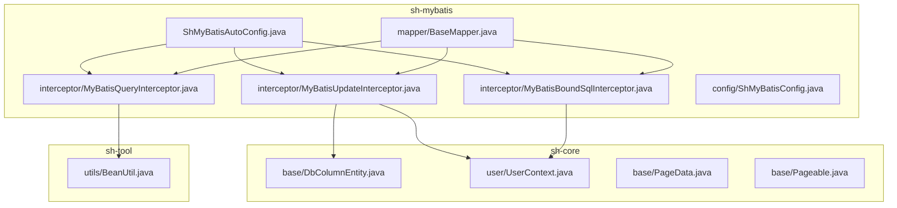
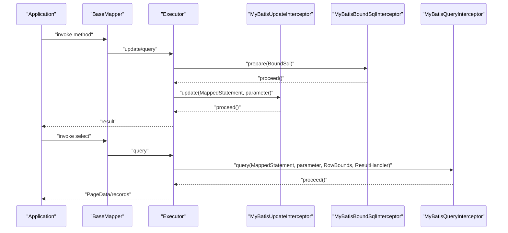
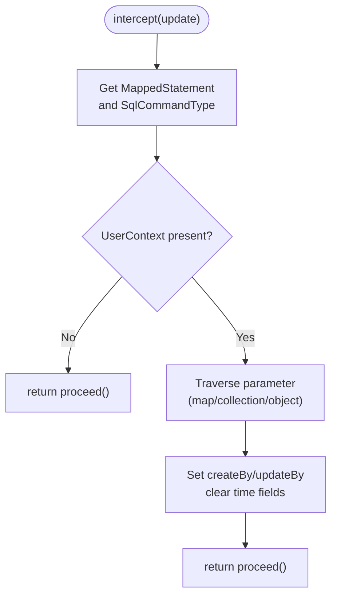
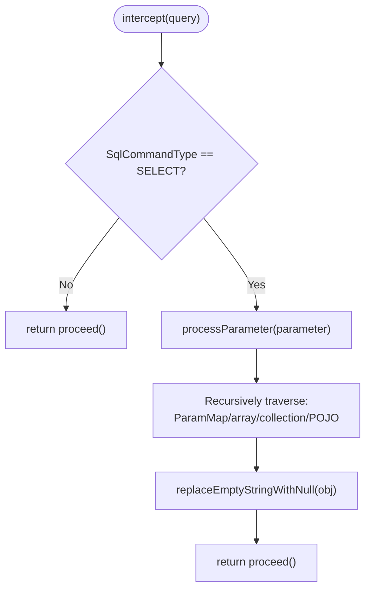
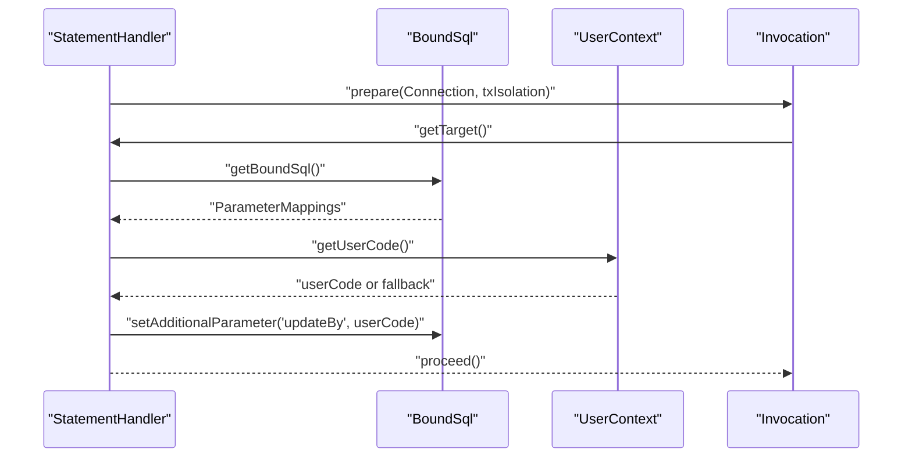
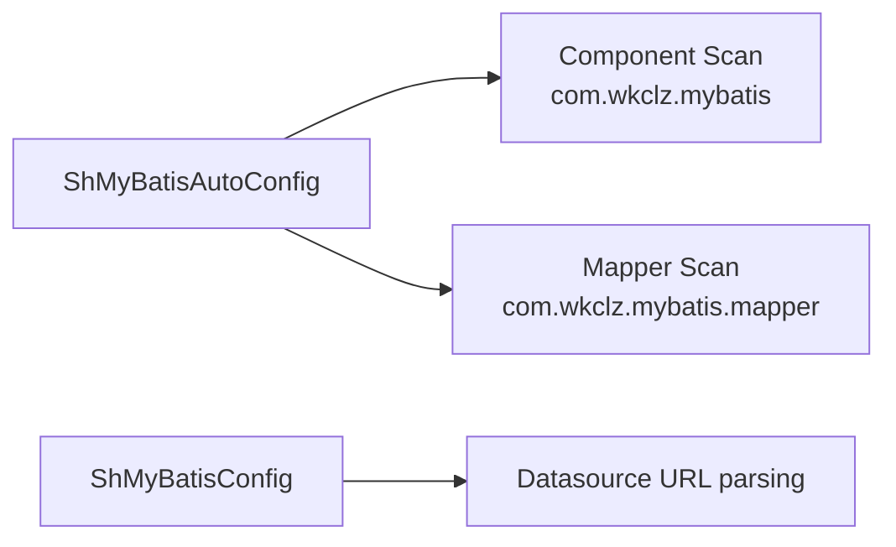
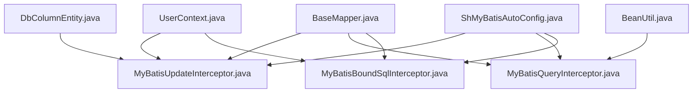

# Interceptor Chain

<cite>
**Referenced Files in This Document**
- [MyBatisUpdateInterceptor.java](file://sh-mybatis/src/main/java/com/wkclz/mybatis/interceptor/MyBatisUpdateInterceptor.java)
- [MyBatisQueryInterceptor.java](file://sh-mybatis/src/main/java/com/wkclz/mybatis/interceptor/MyBatisQueryInterceptor.java)
- [MyBatisBoundSqlInterceptor.java](file://sh-mybatis/src/main/java/com/wkclz/mybatis/interceptor/MyBatisBoundSqlInterceptor.java)
- [ShMyBatisConfig.java](file://sh-mybatis/src/main/java/com/wkclz/mybatis/config/ShMyBatisConfig.java)
- [ShMyBatisAutoConfig.java](file://sh-mybatis/src/main/java/com/wkclz/mybatis/ShMyBatisAutoConfig.java)
- [DbColumnEntity.java](file://sh-core/src/main/java/com/wkclz/core/base/DbColumnEntity.java)
- [UserContext.java](file://sh-core/src/main/java/com/wkclz/core/user/UserContext.java)
- [PageData.java](file://sh-core/src/main/java/com/wkclz/core/base/PageData.java)
- [Pageable.java](file://sh-core/src/main/java/com/wkclz/core/base/Pageable.java)
- [BeanUtil.java](file://sh-tool/src/main/java/com/wkclz/tool/utils/BeanUtil.java)
- [BaseMapper.java](file://sh-mybatis/src/main/java/com/wkclz/mybatis/mapper/BaseMapper.java)
- [org.springframework.boot.autoconfigure.AutoConfiguration.imports](file://sh-mybatis/src/main/resources/META-INF/spring/org.springframework.boot.autoconfigure.AutoConfiguration.imports)
- [spring.factories](file://sh-mybatis/src/main/resources/META-INF/spring.factories)
</cite>

## Table of Contents
1. [Introduction](#introduction)
2. [Project Structure](#project-structure)
3. [Core Components](#core-components)
4. [Architecture Overview](#architecture-overview)
5. [Detailed Component Analysis](#detailed-component-analysis)
6. [Dependency Analysis](#dependency-analysis)
7. [Performance Considerations](#performance-considerations)
8. [Troubleshooting Guide](#troubleshooting-guide)
9. [Conclusion](#conclusion)
10. [Appendices](#appendices)

## Introduction
This document explains the MyBatis interceptor chain in the SH Framework. It covers the three-tier interceptor system:
- MyBatisUpdateInterceptor: automatic field population and audit trail injection for insert/update operations.
- MyBatisQueryInterceptor: normalization of query parameters by replacing empty strings with null and recursive parameter traversal.
- MyBatisBoundSqlInterceptor: SQL rewriting and security enhancement by injecting operator identity into BoundSql for non-entity parameters.

It also documents the registration order, execution flow, parameter modification capabilities, custom configuration via ShMyBatisConfig, extension points, Spring Boot auto-configuration integration, performance implications, debugging techniques, and best practices.

## Project Structure
The interceptor chain resides in the sh-mybatis module and integrates with shared core utilities in sh-core and tooling in sh-tool. Auto-configuration enables seamless activation in Spring Boot applications.

**Diagram sources**
- [ShMyBatisAutoConfig.java:1-14](file://sh-mybatis/src/main/java/com/wkclz/mybatis/ShMyBatisAutoConfig.java#L1-L14)
- [MyBatisUpdateInterceptor.java:1-86](file://sh-mybatis/src/main/java/com/wkclz/mybatis/interceptor/MyBatisUpdateInterceptor.java#L1-L86)
- [MyBatisQueryInterceptor.java:1-122](file://sh-mybatis/src/main/java/com/wkclz/mybatis/interceptor/MyBatisQueryInterceptor.java#L1-L122)
- [MyBatisBoundSqlInterceptor.java:1-50](file://sh-mybatis/src/main/java/com/wkclz/mybatis/interceptor/MyBatisBoundSqlInterceptor.java#L1-L50)
- [ShMyBatisConfig.java:1-42](file://sh-mybatis/src/main/java/com/wkclz/mybatis/config/ShMyBatisConfig.java#L1-L42)
- [BaseMapper.java:1-88](file://sh-mybatis/src/main/java/com/wkclz/mybatis/mapper/BaseMapper.java#L1-L88)
- [DbColumnEntity.java:1-39](file://sh-core/src/main/java/com/wkclz/core/base/DbColumnEntity.java#L1-L39)
- [UserContext.java:1-54](file://sh-core/src/main/java/com/wkclz/core/user/UserContext.java#L1-L54)
- [PageData.java:1-185](file://sh-core/src/main/java/com/wkclz/core/base/PageData.java#L1-L185)
- [Pageable.java:1-93](file://sh-core/src/main/java/com/wkclz/core/base/Pageable.java#L1-L93)
- [BeanUtil.java:1-200](file://sh-tool/src/main/java/com/wkclz/tool/utils/BeanUtil.java#L1-L200)

**Section sources**
- [ShMyBatisAutoConfig.java:1-14](file://sh-mybatis/src/main/java/com/wkclz/mybatis/ShMyBatisAutoConfig.java#L1-L14)
- [org.springframework.boot.autoconfigure.AutoConfiguration.imports:1-2](file://sh-mybatis/src/main/resources/META-INF/spring/org.springframework.boot.autoconfigure.AutoConfiguration.imports#L1-L2)
- [spring.factories:1-3](file://sh-mybatis/src/main/resources/META-INF/spring.factories#L1-L3)

## Core Components
- MyBatisUpdateInterceptor
  - Purpose: Inject audit fields (creator/updater) during INSERT/UPDATE operations when a user context exists.
  - Scope: Targets Executor.update with MappedStatement and parameter.
  - Behavior: Traverses parameter (including collections/maps) and sets createBy/updateBy on DbColumnEntity instances; clears time fields to allow database defaults.
  - Registration: Component-scoped interceptor registered automatically by Spring.

- MyBatisQueryInterceptor
  - Purpose: Normalize query parameters by converting empty strings to null recursively across nested structures.
  - Scope: Targets Executor.query with MappedStatement, parameter, RowBounds, and ResultHandler.
  - Behavior: Processes MapperMethod.ParamMap, arrays, collections, and POJOs; leverages BeanUtil to remove blank string fields.
  - Registration: Component-scoped interceptor registered automatically by Spring.

- MyBatisBoundSqlInterceptor
  - Purpose: Inject operator identity into BoundSql additional parameters for SQL tokens like #{updateBy}, enabling non-entity parameter scenarios (e.g., deleteById).
  - Scope: Targets StatementHandler.prepare with Connection and transaction isolation.
  - Behavior: Scans ParameterMapping for "updateBy"; if found, injects userCode from UserContext (fallback to a safe default if absent).
  - Registration: Component-scoped interceptor registered automatically by Spring.

- ShMyBatisConfig
  - Purpose: Provides framework-level MyBatis-related configuration (e.g., data length check flag, derived schema from datasource URL).
  - Usage: Accessible as a Spring-managed bean; supports custom properties via external configuration.

- Auto-configuration
  - ShMyBatisAutoConfig activates component scanning for interceptors and mapper scanning for BaseMapper implementations.
  - Spring Boot discovery via META-INF/spring.* entries ensures automatic inclusion.

**Section sources**
- [MyBatisUpdateInterceptor.java:16-86](file://sh-mybatis/src/main/java/com/wkclz/mybatis/interceptor/MyBatisUpdateInterceptor.java#L16-L86)
- [MyBatisQueryInterceptor.java:16-122](file://sh-mybatis/src/main/java/com/wkclz/mybatis/interceptor/MyBatisQueryInterceptor.java#L16-L122)
- [MyBatisBoundSqlInterceptor.java:15-50](file://sh-mybatis/src/main/java/com/wkclz/mybatis/interceptor/MyBatisBoundSqlInterceptor.java#L15-L50)
- [ShMyBatisConfig.java:8-42](file://sh-mybatis/src/main/java/com/wkclz/mybatis/config/ShMyBatisConfig.java#L8-L42)
- [ShMyBatisAutoConfig.java:7-11](file://sh-mybatis/src/main/java/com/wkclz/mybatis/ShMyBatisAutoConfig.java#L7-L11)
- [org.springframework.boot.autoconfigure.AutoConfiguration.imports:1-2](file://sh-mybatis/src/main/resources/META-INF/spring/org.springframework.boot.autoconfigure.AutoConfiguration.imports#L1-L2)
- [spring.factories:1-3](file://sh-mybatis/src/main/resources/META-INF/spring.factories#L1-L3)

## Architecture Overview
The interceptor chain executes in a fixed order determined by MyBatis plugin registration. The typical flow for a write operation is:
1) MyBatisBoundSqlInterceptor runs early to enrich BoundSql with operator identity when needed.
2) MyBatisUpdateInterceptor runs during Executor.update to populate audit fields.
3) MyBatisQueryInterceptor runs during Executor.query to normalize parameters.

**Diagram sources**
- [MyBatisBoundSqlInterceptor.java:23-39](file://sh-mybatis/src/main/java/com/wkclz/mybatis/interceptor/MyBatisBoundSqlInterceptor.java#L23-L39)
- [MyBatisUpdateInterceptor.java:23-43](file://sh-mybatis/src/main/java/com/wkclz/mybatis/interceptor/MyBatisUpdateInterceptor.java#L23-L43)
- [MyBatisQueryInterceptor.java:26-42](file://sh-mybatis/src/main/java/com/wkclz/mybatis/interceptor/MyBatisQueryInterceptor.java#L26-L42)
- [BaseMapper.java:15-88](file://sh-mybatis/src/main/java/com/wkclz/mybatis/mapper/BaseMapper.java#L15-L88)

## Detailed Component Analysis

### MyBatisUpdateInterceptor
- Execution model: Intercepts Executor.update; inspects SqlCommandType; short-circuits if no user context; otherwise traverses parameter to set audit fields on DbColumnEntity.
- Parameter modification: Mutates parameter objects in place; clears time fields to defer to DB defaults; sets createBy on INSERT and updateBy on both INSERT/UPDATE.
- Thread safety: Relies on UserContext thread-local storage; ensure proper binding around interceptor execution.
- Extensibility: Can be extended to support additional audit fields or conditional logic based on entity type or command type.

**Diagram sources**
- [MyBatisUpdateInterceptor.java:23-72](file://sh-mybatis/src/main/java/com/wkclz/mybatis/interceptor/MyBatisUpdateInterceptor.java#L23-L72)
- [DbColumnEntity.java:13-39](file://sh-core/src/main/java/com/wkclz/core/base/DbColumnEntity.java#L13-L39)
- [UserContext.java:32-35](file://sh-core/src/main/java/com/wkclz/core/user/UserContext.java#L32-L35)

**Section sources**
- [MyBatisUpdateInterceptor.java:16-86](file://sh-mybatis/src/main/java/com/wkclz/mybatis/interceptor/MyBatisUpdateInterceptor.java#L16-L86)
- [DbColumnEntity.java:9-39](file://sh-core/src/main/java/com/wkclz/core/base/DbColumnEntity.java#L9-L39)
- [UserContext.java:8-54](file://sh-core/src/main/java/com/wkclz/core/user/UserContext.java#L8-L54)

### MyBatisQueryInterceptor
- Execution model: Intercepts Executor.query; filters SELECT operations; normalizes parameters by replacing empty strings with null recursively.
- Parameter traversal: Handles ParamMap, arrays, collections, and POJOs; delegates to BeanUtil.removeBlank for object-level processing.
- Side effects: Modifies parameter objects in place; ensure downstream SQL providers do not rely on empty string semantics.
- Extensibility: Additional normalization rules can be added to the recursive processor.

**Diagram sources**
- [MyBatisQueryInterceptor.java:26-92](file://sh-mybatis/src/main/java/com/wkclz/mybatis/interceptor/MyBatisQueryInterceptor.java#L26-L92)
- [BeanUtil.java:38-56](file://sh-tool/src/main/java/com/wkclz/tool/utils/BeanUtil.java#L38-L56)

**Section sources**
- [MyBatisQueryInterceptor.java:16-122](file://sh-mybatis/src/main/java/com/wkclz/mybatis/interceptor/MyBatisQueryInterceptor.java#L16-L122)
- [BeanUtil.java:26-200](file://sh-tool/src/main/java/com/wkclz/tool/utils/BeanUtil.java#L26-L200)

### MyBatisBoundSqlInterceptor
- Execution model: Intercepts StatementHandler.prepare; inspects BoundSql for ParameterMapping containing "updateBy".
- Injection logic: If present, injects additional parameter "updateBy" with userCode from UserContext (fallback to a safe default if missing).
- Security implication: Ensures non-entity delete/update operations resolve #{updateBy} safely, preventing unresolved parameter exceptions.

**Diagram sources**
- [MyBatisBoundSqlInterceptor.java:23-39](file://sh-mybatis/src/main/java/com/wkclz/mybatis/interceptor/MyBatisBoundSqlInterceptor.java#L23-L39)
- [UserContext.java:32-35](file://sh-core/src/main/java/com/wkclz/core/user/UserContext.java#L32-L35)

**Section sources**
- [MyBatisBoundSqlInterceptor.java:15-50](file://sh-mybatis/src/main/java/com/wkclz/mybatis/interceptor/MyBatisBoundSqlInterceptor.java#L15-L50)
- [UserContext.java:8-54](file://sh-core/src/main/java/com/wkclz/core/user/UserContext.java#L8-L54)

### ShMyBatisConfig and Auto-configuration
- ShMyBatisConfig exposes configurable properties (e.g., data length check flag) and derives schema information from datasource URL for metadata operations.
- Auto-configuration registers component-scoped interceptors and scans for BaseMapper implementations, enabling seamless integration with Spring Boot.

**Diagram sources**
- [ShMyBatisAutoConfig.java:7-11](file://sh-mybatis/src/main/java/com/wkclz/mybatis/ShMyBatisAutoConfig.java#L7-L11)
- [ShMyBatisConfig.java:17-38](file://sh-mybatis/src/main/java/com/wkclz/mybatis/config/ShMyBatisConfig.java#L17-L38)

**Section sources**
- [ShMyBatisConfig.java:8-42](file://sh-mybatis/src/main/java/com/wkclz/mybatis/config/ShMyBatisConfig.java#L8-L42)
- [ShMyBatisAutoConfig.java:7-11](file://sh-mybatis/src/main/java/com/wkclz/mybatis/ShMyBatisAutoConfig.java#L7-L11)
- [org.springframework.boot.autoconfigure.AutoConfiguration.imports:1-2](file://sh-mybatis/src/main/resources/META-INF/spring/org.springframework.boot.autoconfigure.AutoConfiguration.imports#L1-L2)
- [spring.factories:1-3](file://sh-mybatis/src/main/resources/META-INF/spring.factories#L1-L3)

## Dependency Analysis
- Interceptor-to-core dependencies:
  - MyBatisUpdateInterceptor depends on DbColumnEntity for audit fields and UserContext for operator identity.
  - MyBatisQueryInterceptor depends on BeanUtil for blank-string normalization.
  - MyBatisBoundSqlInterceptor depends on UserContext for operator identity and BoundSql for parameter mapping inspection.
- Mapper integration:
  - BaseMapper defines CRUD operations; interceptors apply across these methods uniformly.
- Auto-configuration:
  - ShMyBatisAutoConfig enables component and mapper scanning; Spring Boot discovery via META-INF files.

**Diagram sources**
- [UserContext.java:1-54](file://sh-core/src/main/java/com/wkclz/core/user/UserContext.java#L1-L54)
- [DbColumnEntity.java:1-39](file://sh-core/src/main/java/com/wkclz/core/base/DbColumnEntity.java#L1-L39)
- [BeanUtil.java:1-200](file://sh-tool/src/main/java/com/wkclz/tool/utils/BeanUtil.java#L1-L200)
- [BaseMapper.java:1-88](file://sh-mybatis/src/main/java/com/wkclz/mybatis/mapper/BaseMapper.java#L1-L88)
- [ShMyBatisAutoConfig.java:1-14](file://sh-mybatis/src/main/java/com/wkclz/mybatis/ShMyBatisAutoConfig.java#L1-L14)

**Section sources**
- [MyBatisUpdateInterceptor.java:1-86](file://sh-mybatis/src/main/java/com/wkclz/mybatis/interceptor/MyBatisUpdateInterceptor.java#L1-L86)
- [MyBatisQueryInterceptor.java:1-122](file://sh-mybatis/src/main/java/com/wkclz/mybatis/interceptor/MyBatisQueryInterceptor.java#L1-L122)
- [MyBatisBoundSqlInterceptor.java:1-50](file://sh-mybatis/src/main/java/com/wkclz/mybatis/interceptor/MyBatisBoundSqlInterceptor.java#L1-L50)
- [BaseMapper.java:1-88](file://sh-mybatis/src/main/java/com/wkclz/mybatis/mapper/BaseMapper.java#L1-L88)

## Performance Considerations
- Interceptor overhead: Each interceptor performs lightweight checks and minimal object traversal; negligible overhead under normal conditions.
- Parameter mutation: In-place mutations avoid allocations but require careful handling in concurrent environments; ensure proper request-scoped lifecycle.
- Reflection usage: BeanUtil uses reflection; cache-friendly descriptors mitigate repeated introspection costs.
- BoundSql scanning: Linear scan of ParameterMapping is efficient; keep SQL parameter lists concise.
- Pagination: PageData and Pageable provide deterministic offsets; avoid excessive page sizes to reduce result set processing.

[No sources needed since this section provides general guidance]

## Troubleshooting Guide
- Empty string handling in queries:
  - Symptom: Unexpected nulls in query filters.
  - Action: Verify MyBatisQueryInterceptor is active and parameter normalization aligns with expectations; inspect recursive traversal logic.
- Audit fields not populated:
  - Symptom: Missing createBy/updateBy.
  - Action: Confirm UserContext is set for the current request; verify DbColumnEntity inheritance; check interceptor precedence.
- Unresolved #{updateBy} in SQL:
  - Symptom: SQL parameter resolution failure for non-entity parameters.
  - Action: Ensure MyBatisBoundSqlInterceptor is active and BoundSql contains "updateBy" mapping; confirm UserContext availability.
- Auto-configuration not taking effect:
  - Symptom: Interceptors not applied.
  - Action: Confirm META-INF/spring.* entries exist and ShMyBatisAutoConfig is on the classpath; verify component scanning paths.

**Section sources**
- [MyBatisQueryInterceptor.java:48-109](file://sh-mybatis/src/main/java/com/wkclz/mybatis/interceptor/MyBatisQueryInterceptor.java#L48-L109)
- [MyBatisUpdateInterceptor.java:46-72](file://sh-mybatis/src/main/java/com/wkclz/mybatis/interceptor/MyBatisUpdateInterceptor.java#L46-L72)
- [MyBatisBoundSqlInterceptor.java:23-39](file://sh-mybatis/src/main/java/com/wkclz/mybatis/interceptor/MyBatisBoundSqlInterceptor.java#L23-L39)
- [org.springframework.boot.autoconfigure.AutoConfiguration.imports:1-2](file://sh-mybatis/src/main/resources/META-INF/spring/org.springframework.boot.autoconfigure.AutoConfiguration.imports#L1-L2)
- [spring.factories:1-3](file://sh-mybatis/src/main/resources/META-INF/spring.factories#L1-L3)

## Conclusion
The SH Framework’s MyBatis interceptor chain provides robust, cross-cutting capabilities for audit logging, parameter normalization, and secure SQL parameter resolution. With Spring Boot auto-configuration, the interceptors integrate seamlessly, while ShMyBatisConfig offers extensible customization points. Following the best practices outlined ensures predictable behavior, strong security, and maintainable performance.

[No sources needed since this section summarizes without analyzing specific files]

## Appendices

### Practical Examples and Extension Patterns
- Implementing a custom interceptor:
  - Annotate with @Component and @Intercepts; implement intercept and plugin methods; wrap target via Plugin.wrap.
  - Example reference: [MyBatisUpdateInterceptor.java:21-84](file://sh-mybatis/src/main/java/com/wkclz/mybatis/interceptor/MyBatisUpdateInterceptor.java#L21-L84)
- Handling transaction boundaries:
  - Use UserContext to bind user info before interceptor execution; clear context after completion to prevent leaks.
  - Reference: [UserContext.java:16-51](file://sh-core/src/main/java/com/wkclz/core/user/UserContext.java#L16-L51)
- Integrating with Spring Boot:
  - Rely on ShMyBatisAutoConfig and META-INF discovery; ensure component scanning includes the interceptor package.
  - References: [ShMyBatisAutoConfig.java:7-11](file://sh-mybatis/src/main/java/com/wkclz/mybatis/ShMyBatisAutoConfig.java#L7-L11), [org.springframework.boot.autoconfigure.AutoConfiguration.imports:1-2](file://sh-mybatis/src/main/resources/META-INF/spring/org.springframework.boot.autoconfigure.AutoConfiguration.imports#L1-L2)
- Pagination and PageData:
  - Use Pageable to initialize current/size/offset; construct PageData from BaseEntity and records for consistent response envelopes.
  - References: [Pageable.java:77-91](file://sh-core/src/main/java/com/wkclz/core/base/Pageable.java#L77-L91), [PageData.java:40-100](file://sh-core/src/main/java/com/wkclz/core/base/PageData.java#L40-L100)

**Section sources**
- [MyBatisUpdateInterceptor.java:21-84](file://sh-mybatis/src/main/java/com/wkclz/mybatis/interceptor/MyBatisUpdateInterceptor.java#L21-L84)
- [UserContext.java:16-51](file://sh-core/src/main/java/com/wkclz/core/user/UserContext.java#L16-L51)
- [ShMyBatisAutoConfig.java:7-11](file://sh-mybatis/src/main/java/com/wkclz/mybatis/ShMyBatisAutoConfig.java#L7-L11)
- [org.springframework.boot.autoconfigure.AutoConfiguration.imports:1-2](file://sh-mybatis/src/main/resources/META-INF/spring/org.springframework.boot.autoconfigure.AutoConfiguration.imports#L1-L2)
- [Pageable.java:77-91](file://sh-core/src/main/java/com/wkclz/core/base/Pageable.java#L77-L91)
- [PageData.java:40-100](file://sh-core/src/main/java/com/wkclz/core/base/PageData.java#L40-L100)