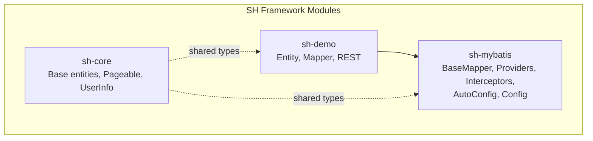
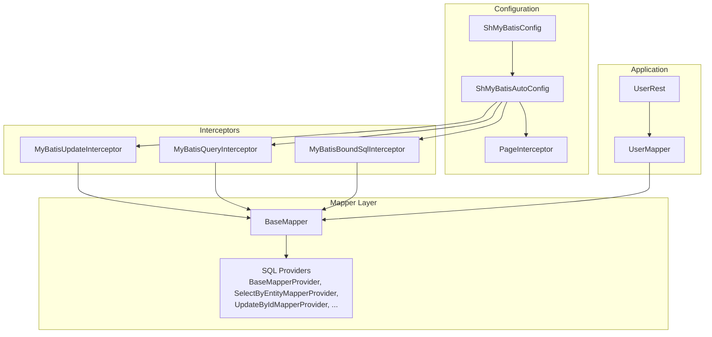
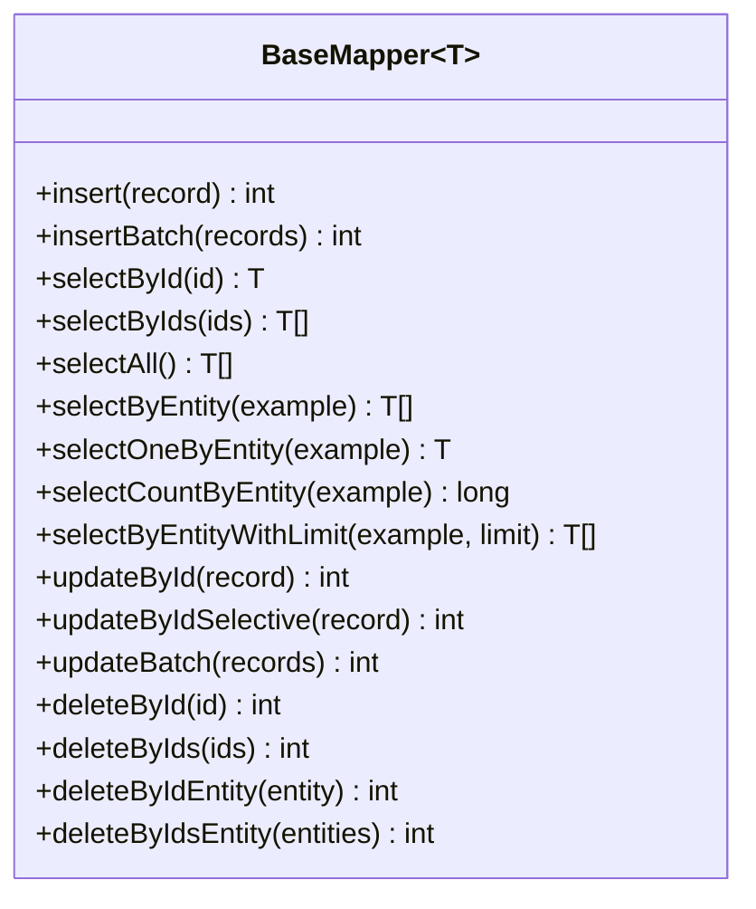
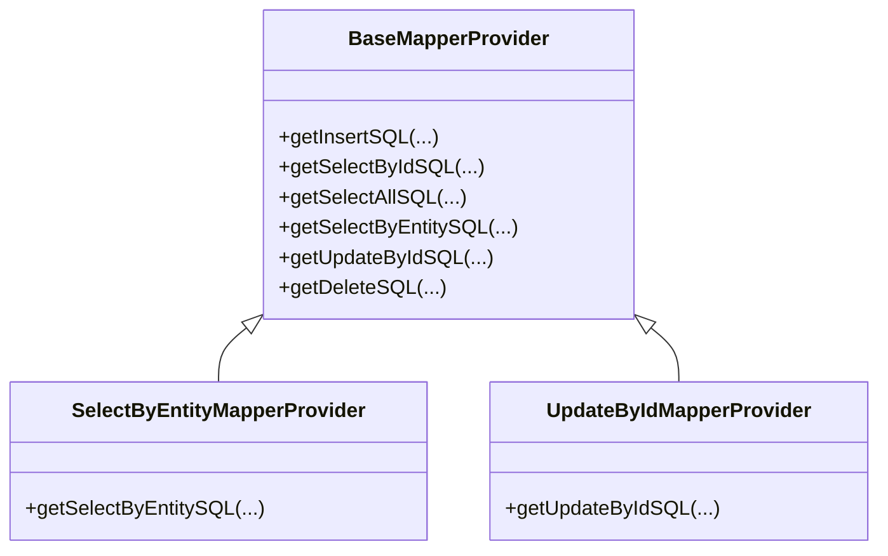
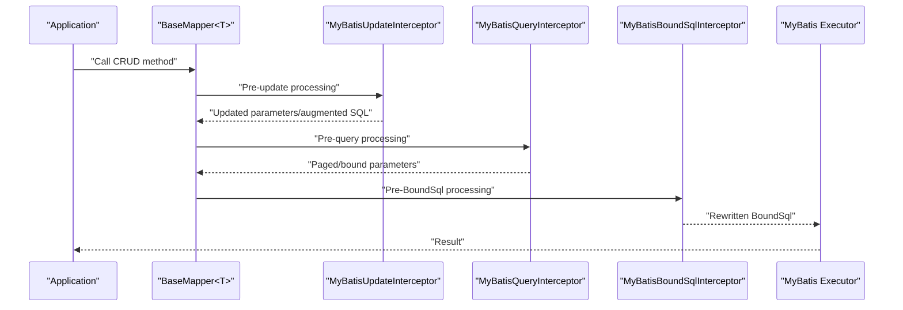
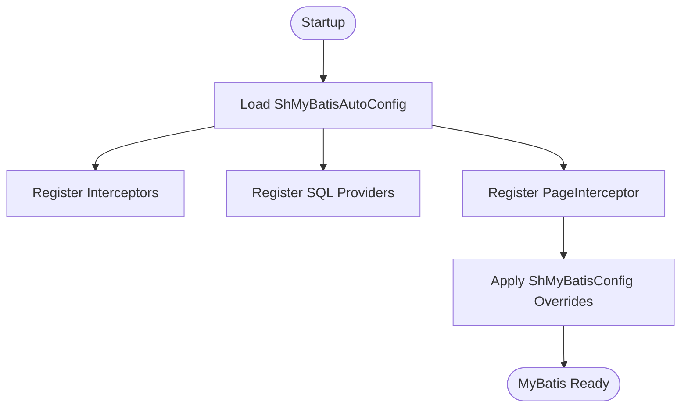
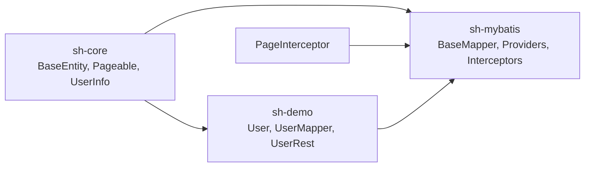

# MyBatis Integration

<cite>
**Referenced Files in This Document**
- [BaseMapper.java](file://sh-mybatis/src/main/java/com/wkclz/mybatis/mapper/BaseMapper.java)
- [BaseMapperProvider.java](file://sh-mybatis/src/main/java/com/wkclz/mybatis/mapper/impl/BaseMapperProvider.java)
- [SelectByEntityMapperProvider.java](file://sh-mybatis/src/main/java/com/wkclz/mybatis/mapper/impl/SelectByEntityMapperProvider.java)
- [UpdateByIdMapperProvider.java](file://sh-mybatis/src/main/java/com/wkclz/mybatis/mapper/impl/UpdateByIdMapperProvider.java)
- [MyBatisUpdateInterceptor.java](file://sh-mybatis/src/main/java/com/wkclz/mybatis/interceptor/MyBatisUpdateInterceptor.java)
- [MyBatisQueryInterceptor.java](file://sh-mybatis/src/main/java/com/wkclz/mybatis/interceptor/MyBatisQueryInterceptor.java)
- [MyBatisBoundSqlInterceptor.java](file://sh-mybatis/src/main/java/com/wkclz/mybatis/interceptor/MyBatisBoundSqlInterceptor.java)
- [ShMyBatisAutoConfig.java](file://sh-mybatis/src/main/java/com/wkclz/mybatis/ShMyBatisAutoConfig.java)
- [ShMyBatisConfig.java](file://sh-mybatis/src/main/java/com/wkclz/mybatis/config/ShMyBatisConfig.java)
- [PageQuery.java](file://sh-mybatis/src/main/java/com/wkclz/mybatis/helper/PageQuery.java)
- [PageInterceptor.java](file://sh-mybatis/src/main/java/com/github/pagehelper/PageInterceptor.java)
- [UserInfo.java](file://sh-core/src/main/java/com/wkclz/core/base/UserInfo.java)
- [User.java](file://sh-demo/src/main/java/com/wkclz/demo/bean/entity/User.java)
- [UserMapper.java](file://sh-demo/src/main/java/com/wkclz/demo/mapper/UserMapper.java)
- [UserRest.java](file://sh-demo/src/main/java/com/wkclz/demo/rest/UserRest.java)
- [application.yml](file://sh-demo/src/main/resources/config/application.yml)
</cite>

## Table of Contents
1. [Introduction](#introduction)
2. [Project Structure](#project-structure)
3. [Core Components](#core-components)
4. [Architecture Overview](#architecture-overview)
5. [Detailed Component Analysis](#detailed-component-analysis)
6. [Dependency Analysis](#dependency-analysis)
7. [Performance Considerations](#performance-considerations)
8. [Troubleshooting Guide](#troubleshooting-guide)
9. [Conclusion](#conclusion)
10. [Appendices](#appendices)

## Introduction
This document explains the MyBatis integration in the SH Framework, focusing on the BaseMapper interface with generic CRUD capabilities, the SQL provider system for dynamic SQL generation, and the interceptor chain for automatic field population, pagination, and SQL rewriting. It also covers auto-configuration and custom configuration, practical examples for implementing custom mappers, and best practices for performance and complex queries.

## Project Structure
The MyBatis integration resides primarily in the sh-mybatis module, with supporting components in sh-core and demonstration usage in sh-demo. Key areas include:
- Mapper interfaces and SQL providers under com.wkclz.mybatis.mapper
- Interceptors under com.wkclz.mybatis.interceptor
- Auto-configuration and custom configuration under com.wkclz.mybatis.config
- Helper utilities for pagination and pagehelper integration
- Demo usage in sh-demo showing entity, mapper, and REST controller integration

**Section sources**
- [ShMyBatisAutoConfig.java](file://sh-mybatis/src/main/java/com/wkclz/mybatis/ShMyBatisAutoConfig.java)
- [ShMyBatisConfig.java](file://sh-mybatis/src/main/java/com/wkclz/mybatis/config/ShMyBatisConfig.java)

## Core Components
This section documents the BaseMapper interface and its 14 predefined CRUD methods, emphasizing generic type safety and usage patterns.

- Generic Type Safety
  - BaseMapper<T> operates on entity type T, ensuring compile-time and runtime type alignment across all method signatures.
  - Methods return appropriate types (single entity, list, count, boolean) while preserving generic typing.

- Predefined CRUD Methods
  - Insert Operations
    - insert(T record): Inserts a single entity and returns affected rows.
    - insertBatch(List<T> records): Bulk insert entities.
  - Select Operations
    - selectById(Serializable id): Retrieves entity by primary key.
    - selectByIds(Set<Serializable> ids): Retrieves multiple entities by keys.
    - selectAll(): Returns all entities.
    - selectByEntity(T example): Finds entities matching example criteria.
    - selectOneByEntity(T example): Returns a single matching entity.
    - selectCountByEntity(T example): Counts matching entities.
    - selectByEntityWithLimit(T example, int limit): Limits results for large datasets.
  - Update Operations
    - updateById(T record): Updates by primary key.
    - updateByIdSelective(T record): Updates only non-null fields.
    - updateBatch(List<T> records): Bulk update entities.
  - Delete Operations
    - deleteById(Serializable id): Deletes by primary key.
    - deleteByIds(Set<Serializable> ids): Bulk delete by keys.
    - deleteByIdEntity(T entity): Deletes by entity identity.
    - deleteByIdsEntity(List<T> entities): Bulk delete by identities.

- Method Categories and Responsibilities
  - Insert: Persist new entities with optional batch support.
  - Select: Retrieve entities with various filtering and pagination options.
  - Update: Modify existing entities with selective updates to minimize writes.
  - Delete: Remove entities by identity with batch and selective variants.

- Implementation Notes
  - All methods leverage SQL providers for dynamic SQL generation, enabling flexible querying and updating without manual SQL maintenance.
  - Generic typing ensures type-safe operations across the framework.

**Section sources**
- [BaseMapper.java](file://sh-mybatis/src/main/java/com/wkclz/mybatis/mapper/BaseMapper.java)

## Architecture Overview
The MyBatis integration architecture centers around BaseMapper and its SQL providers, orchestrated by interceptors for automatic field population, pagination, and SQL rewriting. Auto-configuration registers these components and integrates with pagehelper for pagination.

**Diagram sources**
- [BaseMapper.java](file://sh-mybatis/src/main/java/com/wkclz/mybatis/mapper/BaseMapper.java)
- [BaseMapperProvider.java](file://sh-mybatis/src/main/java/com/wkclz/mybatis/mapper/impl/BaseMapperProvider.java)
- [SelectByEntityMapperProvider.java](file://sh-mybatis/src/main/java/com/wkclz/mybatis/mapper/impl/SelectByEntityMapperProvider.java)
- [UpdateByIdMapperProvider.java](file://sh-mybatis/src/main/java/com/wkclz/mybatis/mapper/impl/UpdateByIdMapperProvider.java)
- [MyBatisUpdateInterceptor.java](file://sh-mybatis/src/main/java/com/wkclz/mybatis/interceptor/MyBatisUpdateInterceptor.java)
- [MyBatisQueryInterceptor.java](file://sh-mybatis/src/main/java/com/wkclz/mybatis/interceptor/MyBatisQueryInterceptor.java)
- [MyBatisBoundSqlInterceptor.java](file://sh-mybatis/src/main/java/com/wkclz/mybatis/interceptor/MyBatisBoundSqlInterceptor.java)
- [ShMyBatisAutoConfig.java](file://sh-mybatis/src/main/java/com/wkclz/mybatis/ShMyBatisAutoConfig.java)
- [ShMyBatisConfig.java](file://sh-mybatis/src/main/java/com/wkclz/mybatis/config/ShMyBatisConfig.java)
- [PageInterceptor.java](file://sh-mybatis/src/main/java/com/github/pagehelper/PageInterceptor.java)
- [UserMapper.java](file://sh-demo/src/main/java/com/wkclz/demo/mapper/UserMapper.java)
- [UserRest.java](file://sh-demo/src/main/java/com/wkclz/demo/rest/UserRest.java)

## Detailed Component Analysis

### BaseMapper Interface and Generic CRUD
BaseMapper defines a comprehensive set of CRUD methods with generic type safety. The interface acts as the foundation for all domain mappers, delegating SQL generation to provider implementations.

**Diagram sources**
- [BaseMapper.java](file://sh-mybatis/src/main/java/com/wkclz/mybatis/mapper/BaseMapper.java)

**Section sources**
- [BaseMapper.java](file://sh-mybatis/src/main/java/com/wkclz/mybatis/mapper/BaseMapper.java)

### SQL Provider System
SQL providers generate dynamic SQL for BaseMapper methods, enabling flexible querying and updating without hardcoding SQL. The framework includes several built-in providers:

- BaseMapperProvider: Provides default SQL templates for CRUD operations.
- SelectByEntityMapperProvider: Generates SELECT statements based on entity property conditions.
- UpdateByIdMapperProvider: Generates UPDATE statements targeting entities by primary key.
- Additional providers cover batch operations, counting, limiting, and deletion variants.

Implementation pattern:
- Each provider corresponds to a specific BaseMapper method signature.
- Providers introspect entity metadata and build SQL dynamically.
- Providers integrate seamlessly with MyBatis to render SQL and bind parameters.

**Diagram sources**
- [BaseMapperProvider.java](file://sh-mybatis/src/main/java/com/wkclz/mybatis/mapper/impl/BaseMapperProvider.java)
- [SelectByEntityMapperProvider.java](file://sh-mybatis/src/main/java/com/wkclz/mybatis/mapper/impl/SelectByEntityMapperProvider.java)
- [UpdateByIdMapperProvider.java](file://sh-mybatis/src/main/java/com/wkclz/mybatis/mapper/impl/UpdateByIdMapperProvider.java)

**Section sources**
- [BaseMapperProvider.java](file://sh-mybatis/src/main/java/com/wkclz/mybatis/mapper/impl/BaseMapperProvider.java)
- [SelectByEntityMapperProvider.java](file://sh-mybatis/src/main/java/com/wkclz/mybatis/mapper/impl/SelectByEntityMapperProvider.java)
- [UpdateByIdMapperProvider.java](file://sh-mybatis/src/main/java/com/wkclz/mybatis/mapper/impl/UpdateByIdMapperProvider.java)

### Interceptor Chain
The interceptor chain augments MyBatis execution with cross-cutting concerns:

- MyBatisUpdateInterceptor
  - Purpose: Automatic field population and audit trail updates.
  - Typical behaviors: Set creation/update timestamps, populate creator/modifier fields, enforce audit rules.
  - Integration: Runs before statement execution to modify bound parameters or SQL.

- MyBatisQueryInterceptor
  - Purpose: Pagination support and query enhancement.
  - Typical behaviors: Apply pagehelper pagination, transform query parameters, inject tenant filters.
  - Integration: Wraps query execution to add paging and filtering.

- MyBatisBoundSqlInterceptor
  - Purpose: SQL rewriting and query optimization.
  - Typical behaviors: Modify BoundSql for soft-delete filtering, add index hints, rewrite joins.
  - Integration: Operates on the parsed SQL before execution.

**Diagram sources**
- [MyBatisUpdateInterceptor.java](file://sh-mybatis/src/main/java/com/wkclz/mybatis/interceptor/MyBatisUpdateInterceptor.java)
- [MyBatisQueryInterceptor.java](file://sh-mybatis/src/main/java/com/wkclz/mybatis/interceptor/MyBatisQueryInterceptor.java)
- [MyBatisBoundSqlInterceptor.java](file://sh-mybatis/src/main/java/com/wkclz/mybatis/interceptor/MyBatisBoundSqlInterceptor.java)

**Section sources**
- [MyBatisUpdateInterceptor.java](file://sh-mybatis/src/main/java/com/wkclz/mybatis/interceptor/MyBatisUpdateInterceptor.java)
- [MyBatisQueryInterceptor.java](file://sh-mybatis/src/main/java/com/wkclz/mybatis/interceptor/MyBatisQueryInterceptor.java)
- [MyBatisBoundSqlInterceptor.java](file://sh-mybatis/src/main/java/com/wkclz/mybatis/interceptor/MyBatisBoundSqlInterceptor.java)

### Auto-Configuration and Custom Configuration
- ShMyBatisAutoConfig
  - Registers BaseMapper, SQL providers, and interceptors with MyBatis.
  - Integrates pagehelper via PageInterceptor for pagination support.
  - Scans mapper interfaces and binds providers to method signatures.

- ShMyBatisConfig
  - Allows customization of MyBatis behavior, such as dialect selection, pagination settings, and provider overrides.
  - Enables fine-tuning of interceptor order and activation policies.

**Diagram sources**
- [ShMyBatisAutoConfig.java](file://sh-mybatis/src/main/java/com/wkclz/mybatis/ShMyBatisAutoConfig.java)
- [ShMyBatisConfig.java](file://sh-mybatis/src/main/java/com/wkclz/mybatis/config/ShMyBatisConfig.java)
- [PageInterceptor.java](file://sh-mybatis/src/main/java/com/github/pagehelper/PageInterceptor.java)

**Section sources**
- [ShMyBatisAutoConfig.java](file://sh-mybatis/src/main/java/com/wkclz/mybatis/ShMyBatisAutoConfig.java)
- [ShMyBatisConfig.java](file://sh-mybatis/src/main/java/com/wkclz/mybatis/config/ShMyBatisConfig.java)

### Practical Examples

#### Implementing a Custom Mapper
Steps to create a custom mapper:
1. Define an entity extending the base entity with common fields (e.g., identifiers, timestamps).
2. Create a mapper interface extending BaseMapper<Entity>.
3. Optionally define custom XML or rely on SQL providers.
4. Inject the mapper into a service and use CRUD methods.

References:
- Example entity: [User.java](file://sh-demo/src/main/java/com/wkclz/demo/bean/entity/User.java)
- Example mapper interface: [UserMapper.java](file://sh-demo/src/main/java/com/wkclz/demo/mapper/UserMapper.java)
- Example REST controller: [UserRest.java](file://sh-demo/src/main/java/com/wkclz/demo/rest/UserRest.java)

**Section sources**
- [User.java](file://sh-demo/src/main/java/com/wkclz/demo/bean/entity/User.java)
- [UserMapper.java](file://sh-demo/src/main/java/com/wkclz/demo/mapper/UserMapper.java)
- [UserRest.java](file://sh-demo/src/main/java/com/wkclz/demo/rest/UserRest.java)

#### Using SQL Providers
- Select by example: Use selectByEntity to filter by non-null fields.
- Update by ID: Use updateByIdSelective to avoid resetting null fields.
- Batch operations: Use insertBatch and updateBatch for bulk persistence.

References:
- Provider implementations: 
  - [SelectByEntityMapperProvider.java](file://sh-mybatis/src/main/java/com/wkclz/mybatis/mapper/impl/SelectByEntityMapperProvider.java)
  - [UpdateByIdMapperProvider.java](file://sh-mybatis/src/main/java/com/wkclz/mybatis/mapper/impl/UpdateByIdMapperProvider.java)

**Section sources**
- [SelectByEntityMapperProvider.java](file://sh-mybatis/src/main/java/com/wkclz/mybatis/mapper/impl/SelectByEntityMapperProvider.java)
- [UpdateByIdMapperProvider.java](file://sh-mybatis/src/main/java/com/wkclz/mybatis/mapper/impl/UpdateByIdMapperProvider.java)

#### Configuring Interceptors
- Enable/disable interceptors via ShMyBatisConfig.
- Adjust pagination behavior and pagehelper integration.
- Customize audit fields and automatic population logic in MyBatisUpdateInterceptor.

References:
- Configuration: [ShMyBatisConfig.java](file://sh-mybatis/src/main/java/com/wkclz/mybatis/config/ShMyBatisConfig.java)
- Audit context: [UserInfo.java](file://sh-core/src/main/java/com/wkclz/core/base/UserInfo.java)

**Section sources**
- [ShMyBatisConfig.java](file://sh-mybatis/src/main/java/com/wkclz/mybatis/config/ShMyBatisConfig.java)
- [UserInfo.java](file://sh-core/src/main/java/com/wkclz/core/base/UserInfo.java)

## Dependency Analysis
The MyBatis integration depends on:
- Base entities and shared types from sh-core for common fields and pagination.
- Pagehelper for pagination support.
- Interceptors for cross-cutting behaviors.
- SQL providers for dynamic SQL generation.

**Diagram sources**
- [UserInfo.java](file://sh-core/src/main/java/com/wkclz/core/base/UserInfo.java)
- [User.java](file://sh-demo/src/main/java/com/wkclz/demo/bean/entity/User.java)
- [UserMapper.java](file://sh-demo/src/main/java/com/wkclz/demo/mapper/UserMapper.java)
- [PageInterceptor.java](file://sh-mybatis/src/main/java/com/github/pagehelper/PageInterceptor.java)

**Section sources**
- [UserInfo.java](file://sh-core/src/main/java/com/wkclz/core/base/UserInfo.java)
- [User.java](file://sh-demo/src/main/java/com/wkclz/demo/bean/entity/User.java)
- [UserMapper.java](file://sh-demo/src/main/java/com/wkclz/demo/mapper/UserMapper.java)
- [PageInterceptor.java](file://sh-mybatis/src/main/java/com/github/pagehelper/PageInterceptor.java)

## Performance Considerations
- Prefer selective updates to reduce write overhead.
- Use batch operations for bulk inserts and updates.
- Leverage pagination to avoid large result sets.
- Minimize reflection overhead by reusing providers and avoiding excessive dynamic SQL generation.
- Ensure proper indexing on frequently queried columns.
- Monitor and tune pagehelper configuration for optimal pagination performance.

## Troubleshooting Guide
Common issues and resolutions:
- SQL Generation Failures
  - Verify provider registration and method signature alignment.
  - Check entity metadata and column mappings.
- Interceptor Conflicts
  - Review interceptor order and activation policies in ShMyBatisConfig.
  - Confirm audit field availability and UserInfo context presence.
- Pagination Problems
  - Validate PageQuery usage and PageInterceptor configuration.
  - Ensure Pageable parameters are correctly passed from controllers.
- Configuration Issues
  - Confirm ShMyBatisAutoConfig is loaded.
  - Review application.yml for datasource and MyBatis settings.

**Section sources**
- [ShMyBatisConfig.java](file://sh-mybatis/src/main/java/com/wkclz/mybatis/config/ShMyBatisConfig.java)
- [PageQuery.java](file://sh-mybatis/src/main/java/com/wkclz/mybatis/helper/PageQuery.java)
- [application.yml](file://sh-demo/src/main/resources/config/application.yml)

## Conclusion
The SH Framework’s MyBatis integration provides a robust, type-safe foundation for data access through BaseMapper and a comprehensive set of SQL providers. The interceptor chain enables automatic field population, pagination, and SQL rewriting, while auto-configuration and custom configuration offer flexibility and control. Following the outlined patterns and best practices ensures maintainable, efficient, and secure database operations.

## Appendices

### Appendix A: Pagination Helper
- PageQuery encapsulates pagination parameters and integrates with pagehelper for seamless paging.

**Section sources**
- [PageQuery.java](file://sh-mybatis/src/main/java/com/wkclz/mybatis/helper/PageQuery.java)

### Appendix B: Demo Configuration Reference
- application.yml demonstrates typical datasource and MyBatis settings for the demo module.

**Section sources**
- [application.yml](file://sh-demo/src/main/resources/config/application.yml)