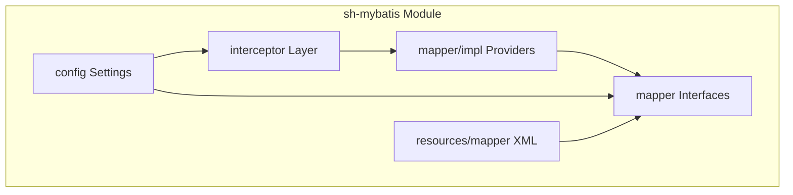
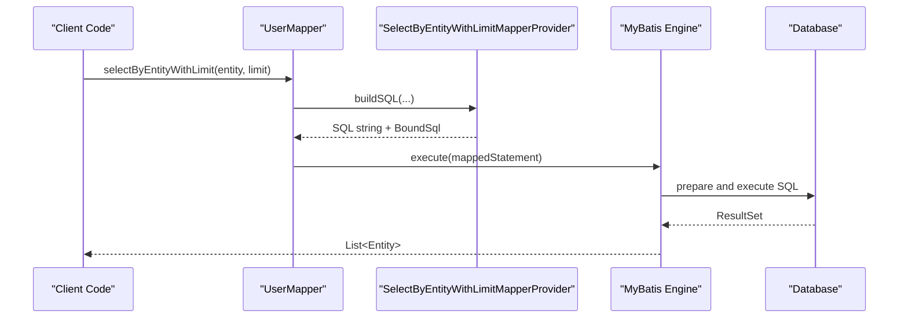
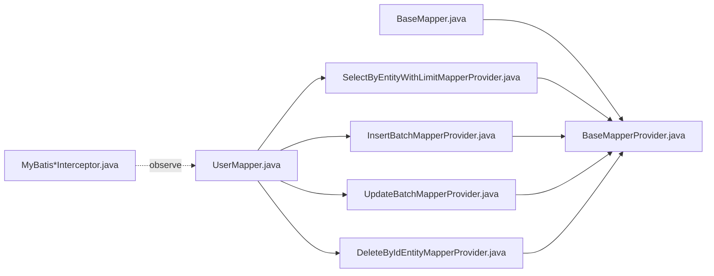

# SQL Provider System

<cite>
**Referenced Files in This Document**
- [BaseMapperProvider.java](file://sh-mybatis/src/main/java/com/wkclz/mybatis/mapper/impl/BaseMapperProvider.java)
- [DeleteByIdEntityMapperProvider.java](file://sh-mybatis/src/main/java/com/wkclz/mybatis/mapper/impl/DeleteByIdEntityMapperProvider.java)
- [InsertBatchMapperProvider.java](file://sh-mybatis/src/main/java/com/wkclz/mybatis/mapper/impl/InsertBatchMapperProvider.java)
- [SelectByEntityWithLimitMapperProvider.java](file://sh-mybatis/src/main/java/com/wkclz/mybatis/mapper/impl/SelectByEntityWithLimitMapperProvider.java)
- [UpdateBatchMapperProvider.java](file://sh-mybatis/src/main/java/com/wkclz/mybatis/mapper/impl/UpdateBatchMapperProvider.java)
- [BaseMapper.java](file://sh-mybatis/src/main/java/com/wkclz/mybatis/mapper/BaseMapper.java)
- [TableInfoMapper.java](file://sh-mybatis/src/main/java/com/wkclz/mybatis/mapper/TableInfoMapper.java)
- [ShMyBatisAutoConfig.java](file://sh-mybatis/src/main/java/com/wkclz/mybatis/ShMyBatisAutoConfig.java)
- [ShMyBatisConfig.java](file://sh-mybatis/src/main/java/com/wkclz/mybatis/config/ShMyBatisConfig.java)
- [MyBatisBoundSqlInterceptor.java](file://sh-mybatis/src/main/java/com/wkclz/mybatis/interceptor/MyBatisBoundSqlInterceptor.java)
- [MyBatisQueryInterceptor.java](file://sh-mybatis/src/main/java/com/wkclz/mybatis/interceptor/MyBatisQueryInterceptor.java)
- [MyBatisUpdateInterceptor.java](file://sh-mybatis/src/main/java/com/wkclz/mybatis/interceptor/MyBatisUpdateInterceptor.java)
- [UserInfo.java](file://sh-core/src/main/java/com/wkclz/core/base/UserInfo.java)
- [User.java](file://sh-demo/src/main/java/com/wkclz/demo/bean/entity/User.java)
- [UserMapper.java](file://sh-demo/src/main/java/com/wkclz/demo/mapper/UserMapper.java)
- [UserRest.java](file://sh-demo/src/main/java/com/wkclz/demo/rest/UserRest.java)
- [TableInfoMapper.xml](file://sh-mybatis/src/main/resources/mapper/TableInfoMapper.xml)
</cite>

## Table of Contents
1. [Introduction](#introduction)
2. [Project Structure](#project-structure)
3. [Core Components](#core-components)
4. [Architecture Overview](#architecture-overview)
5. [Detailed Component Analysis](#detailed-component-analysis)
6. [Dependency Analysis](#dependency-analysis)
7. [Performance Considerations](#performance-considerations)
8. [Troubleshooting Guide](#troubleshooting-guide)
9. [Conclusion](#conclusion)

## Introduction
This document explains the SQL Provider system in the SH Framework's MyBatis module. It focuses on the Strategy Pattern implementation where each mapper method corresponds to a dedicated SQL provider class. The BaseMapperProvider serves as the foundational provider, while specialized providers handle CRUD operations such as deletion by ID, batch insertion, selective selection with limits, and batch updates. We describe the SQL generation process, parameter binding, dynamic SQL construction, and provide guidance for creating custom providers, handling conditional logic, and migrating from XML mappers to the XML-free configuration approach.

## Project Structure
The SQL Provider system resides primarily under the sh-mybatis module, organized by responsibility:
- mapper/impl: Contains provider implementations for each operation type
- mapper: Defines generic mapper interfaces and base contracts
- interceptor: Provides runtime interception for SQL building and query/update operations
- config: Auto-configuration and framework-wide MyBatis settings
- resources/mapper: Legacy XML mapper definitions retained for compatibility

**Section sources**
- [ShMyBatisAutoConfig.java](file://sh-mybatis/src/main/java/com/wkclz/mybatis/ShMyBatisAutoConfig.java)
- [ShMyBatisConfig.java](file://sh-mybatis/src/main/java/com/wkclz/mybatis/config/ShMyBatisConfig.java)

## Core Components
The system revolves around a set of provider classes implementing the Strategy Pattern. Each provider encapsulates SQL generation logic for a specific mapper method. The BaseMapperProvider is the foundation, offering shared utilities and common behaviors. Specialized providers extend or leverage the base to implement domain-specific SQL generation.

Key responsibilities:
- SQL Generation: Build dynamic SQL strings tailored to entity properties and conditions
- Parameter Binding: Map method parameters to SQL placeholders safely
- Conditional Logic: Support optional filters, pagination, and selective field updates
- XML-Free Configuration: Eliminate XML mapper files by generating SQL programmatically

**Section sources**
- [BaseMapperProvider.java](file://sh-mybatis/src/main/java/com/wkclz/mybatis/mapper/impl/BaseMapperProvider.java)
- [BaseMapper.java](file://sh-mybatis/src/main/java/com/wkclz/mybatis/mapper/BaseMapper.java)

## Architecture Overview
The SQL Provider architecture integrates with MyBatis through provider classes bound to mapper interfaces. During query execution, MyBatis invokes the appropriate provider to generate SQL and BoundSql, which are then executed against the database. Interceptors observe and enrich SQL generation with cross-cutting concerns like pagination and logging.

**Diagram sources**
- [UserMapper.java](file://sh-demo/src/main/java/com/wkclz/demo/mapper/UserMapper.java)
- [SelectByEntityWithLimitMapperProvider.java](file://sh-mybatis/src/main/java/com/wkclz/mybatis/mapper/impl/SelectByEntityWithLimitMapperProvider.java)
- [MyBatisBoundSqlInterceptor.java](file://sh-mybatis/src/main/java/com/wkclz/mybatis/interceptor/MyBatisBoundSqlInterceptor.java)

## Detailed Component Analysis

### BaseMapperProvider: Foundation Provider
BaseMapperProvider centralizes common SQL generation utilities and metadata extraction. It provides:
- Entity introspection helpers to derive table/column names
- Placeholder substitution for parameters
- Shared SQL fragments for joins, ordering, and limits
- Safe concatenation of WHERE clauses with proper AND/OR handling

Design implications:
- Reduces duplication across specialized providers
- Encapsulates framework-specific conventions (e.g., logical delete, tenant isolation)
- Enables consistent parameter naming and binding

**Section sources**
- [BaseMapperProvider.java](file://sh-mybatis/src/main/java/com/wkclz/mybatis/mapper/impl/BaseMapperProvider.java)

### DeleteByIdEntityMapperProvider
Purpose:
- Generates DELETE statements targeting entities by ID with safety checks

Key behaviors:
- Builds WHERE clause using primary key column
- Supports soft-delete patterns via conditional logic
- Ensures parameter binding prevents SQL injection

Optimization tips:
- Prefer single-statement deletes when feasible
- Combine with batch operations for bulk deletions

**Section sources**
- [DeleteByIdEntityMapperProvider.java](file://sh-mybatis/src/main/java/com/wkclz/mybatis/mapper/impl/DeleteByIdEntityMapperProvider.java)

### InsertBatchMapperProvider
Purpose:
- Implements efficient batch INSERT operations

Key behaviors:
- Constructs multi-value INSERT statements
- Handles parameter arrays and repeated bindings
- Applies default value resolution for omitted fields

Performance considerations:
- Tune batch sizes to balance memory and throughput
- Use JDBC batch execution modes supported by the driver

**Section sources**
- [InsertBatchMapperProvider.java](file://sh-mybatis/src/main/java/com/wkclz/mybatis/mapper/impl/InsertBatchMapperProvider.java)

### SelectByEntityWithLimitMapperProvider
Purpose:
- Generates SELECT statements with dynamic WHERE conditions and LIMIT support

Key behaviors:
- Iterates over entity properties to build flexible WHERE clauses
- Applies optional filters only when non-null values are present
- Enforces LIMIT to cap result sets for performance

Conditional logic:
- Skips null or empty property values
- Uses configurable operators (equals, like, in, etc.) per property

**Section sources**
- [SelectByEntityWithLimitMapperProvider.java](file://sh-mybatis/src/main/java/com/wkclz/mybatis/mapper/impl/SelectByEntityWithLimitMapperProvider.java)

### UpdateBatchMapperProvider
Purpose:
- Implements batch UPDATE operations with selective field updates

Key behaviors:
- Builds SET clauses dynamically from provided fields
- Supports optimistic locking via version fields
- Binds parameters securely to avoid injection

Optimization tips:
- Limit updated fields to changed values only
- Use WHERE IN for batch updates when IDs are known

**Section sources**
- [UpdateBatchMapperProvider.java](file://sh-mybatis/src/main/java/com/wkclz/mybatis/mapper/impl/UpdateBatchMapperProvider.java)

### Mapper Interfaces and Relationship to Providers
The mapper interfaces define method signatures that MyBatis maps to provider-generated SQL. The BaseMapper interface establishes common CRUD operations, while specialized mappers (e.g., TableInfoMapper) retain legacy XML mappings for compatibility.

Relationship highlights:
- Method names align with provider class names (Strategy Pattern)
- Providers are invoked automatically by MyBatis during SQL building
- XML mappers remain supported alongside provider-based mappers

**Section sources**
- [BaseMapper.java](file://sh-mybatis/src/main/java/com/wkclz/mybatis/mapper/BaseMapper.java)
- [TableInfoMapper.java](file://sh-mybatis/src/main/java/com/wkclz/mybatis/mapper/TableInfoMapper.java)
- [TableInfoMapper.xml](file://sh-mybatis/src/main/resources/mapper/TableInfoMapper.xml)

### Interceptors and Runtime Enhancement
Interceptors observe and enhance SQL generation and execution:
- MyBatisBoundSqlInterceptor: Inspects and modifies BoundSql for logging and auditing
- MyBatisQueryInterceptor: Adds pagination and tenant filters
- MyBatisUpdateInterceptor: Enforces business rules before updates

These components complement providers by applying cross-cutting concerns consistently across all generated SQL.

**Section sources**
- [MyBatisBoundSqlInterceptor.java](file://sh-mybatis/src/main/java/com/wkclz/mybatis/interceptor/MyBatisBoundSqlInterceptor.java)
- [MyBatisQueryInterceptor.java](file://sh-mybatis/src/main/java/com/wkclz/mybatis/interceptor/MyBatisQueryInterceptor.java)
- [MyBatisUpdateInterceptor.java](file://sh-mybatis/src/main/java/com/wkclz/mybatis/interceptor/MyBatisUpdateInterceptor.java)

### Example: Creating a Custom SQL Provider
Steps to create a custom provider:
1. Define a new provider class extending the base utilities
2. Implement SQL generation for the target method signature
3. Bind parameters safely using the provider's helper methods
4. Integrate with the corresponding mapper interface method
5. Add unit tests verifying SQL correctness and parameter binding

Guidance:
- Reuse existing WHERE clause builders for consistency
- Apply conditional logic to include/exclude filters
- Benchmark performance with realistic data volumes

[No sources needed since this section provides general guidance]

### Migration Strategy from XML Mappers
Recommended approach:
- Identify XML-defined queries and their corresponding mapper methods
- Implement equivalent provider classes with identical method signatures
- Retain XML mapper files temporarily for gradual migration
- Validate SQL plans and performance post-migration
- Remove XML files after confirming parity and stability

[No sources needed since this section provides general guidance]

## Dependency Analysis
The provider system exhibits low coupling and high cohesion:
- Providers depend on BaseMapperProvider utilities and entity metadata
- Mapper interfaces decouple method contracts from implementation
- Interceptors provide orthogonal enhancements without altering providers
- XML mappers are optional and coexist with provider-based mappers

**Diagram sources**
- [BaseMapper.java](file://sh-mybatis/src/main/java/com/wkclz/mybatis/mapper/BaseMapper.java)
- [BaseMapperProvider.java](file://sh-mybatis/src/main/java/com/wkclz/mybatis/mapper/impl/BaseMapperProvider.java)
- [SelectByEntityWithLimitMapperProvider.java](file://sh-mybatis/src/main/java/com/wkclz/mybatis/mapper/impl/SelectByEntityWithLimitMapperProvider.java)
- [InsertBatchMapperProvider.java](file://sh-mybatis/src/main/java/com/wkclz/mybatis/mapper/impl/InsertBatchMapperProvider.java)
- [UpdateBatchMapperProvider.java](file://sh-mybatis/src/main/java/com/wkclz/mybatis/mapper/impl/UpdateBatchMapperProvider.java)
- [DeleteByIdEntityMapperProvider.java](file://sh-mybatis/src/main/java/com/wkclz/mybatis/mapper/impl/DeleteByIdEntityMapperProvider.java)
- [UserMapper.java](file://sh-demo/src/main/java/com/wkclz/demo/mapper/UserMapper.java)
- [MyBatisBoundSqlInterceptor.java](file://sh-mybatis/src/main/java/com/wkclz/mybatis/interceptor/MyBatisBoundSqlInterceptor.java)

**Section sources**
- [BaseMapper.java](file://sh-mybatis/src/main/java/com/wkclz/mybatis/mapper/BaseMapper.java)
- [BaseMapperProvider.java](file://sh-mybatis/src/main/java/com/wkclz/mybatis/mapper/impl/BaseMapperProvider.java)
- [UserMapper.java](file://sh-demo/src/main/java/com/wkclz/demo/mapper/UserMapper.java)

## Performance Considerations
- Batch Operations: Prefer batch insert/update/delete for large datasets
- Parameter Binding: Use provider helpers to avoid manual concatenation and reduce overhead
- Conditional Filtering: Build WHERE clauses incrementally to minimize unnecessary predicates
- Pagination: Leverage interceptors for consistent page boundaries and index-friendly queries
- Caching: Combine with result/object caching strategies where appropriate

[No sources needed since this section provides general guidance]

## Troubleshooting Guide
Common issues and resolutions:
- SQL Injection Prevention: Always rely on parameter binding via provider helpers
- Unexpected Empty Results: Verify conditional logic excludes null/empty filters unintentionally
- Performance Degradation: Review generated SQL plans and adjust batch sizes or indexes
- Interceptor Conflicts: Ensure interceptors apply consistently across provider-generated SQL

Supporting components:
- Interceptors for logging and validation
- Base utilities for safe SQL composition

**Section sources**
- [MyBatisBoundSqlInterceptor.java](file://sh-mybatis/src/main/java/com/wkclz/mybatis/interceptor/MyBatisBoundSqlInterceptor.java)
- [BaseMapperProvider.java](file://sh-mybatis/src/main/java/com/wkclz/mybatis/mapper/impl/BaseMapperProvider.java)

## Conclusion
The SH Framework's SQL Provider system leverages the Strategy Pattern to deliver a clean, maintainable, and extensible approach to dynamic SQL generation. By centralizing common logic in BaseMapperProvider and specializing behavior in targeted providers, the system supports robust parameter binding, conditional SQL construction, and seamless migration from XML mappers. Interceptors further enhance the pipeline with cross-cutting capabilities, enabling scalable and secure data access patterns.