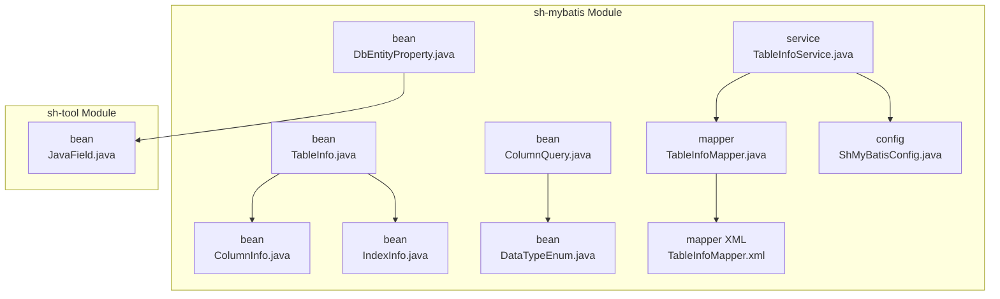
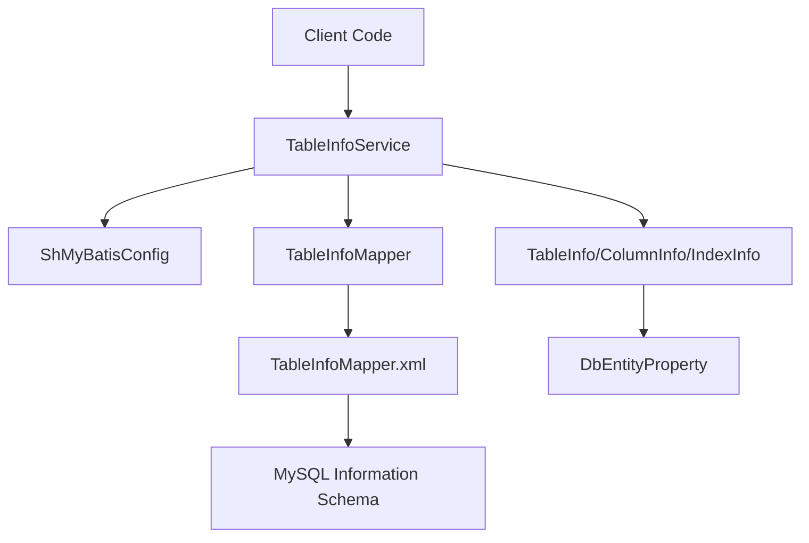
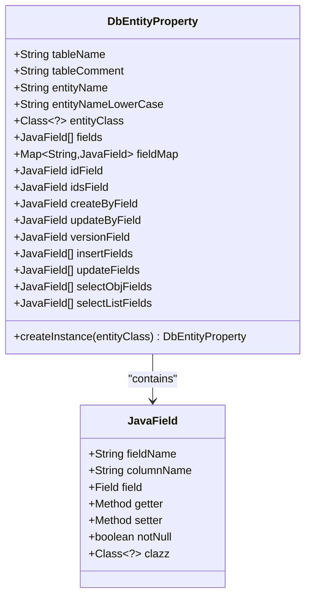
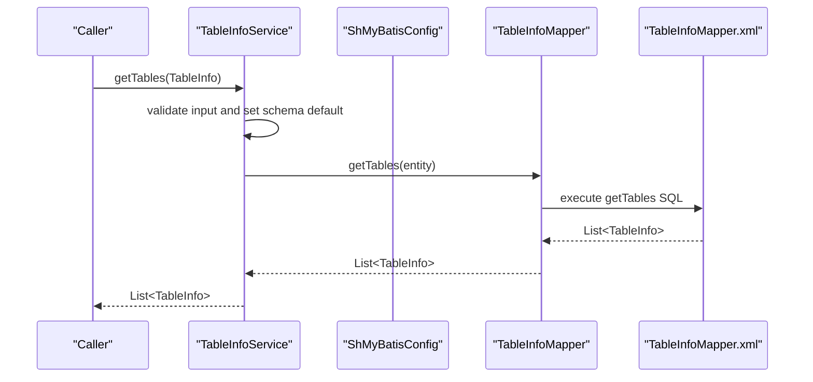
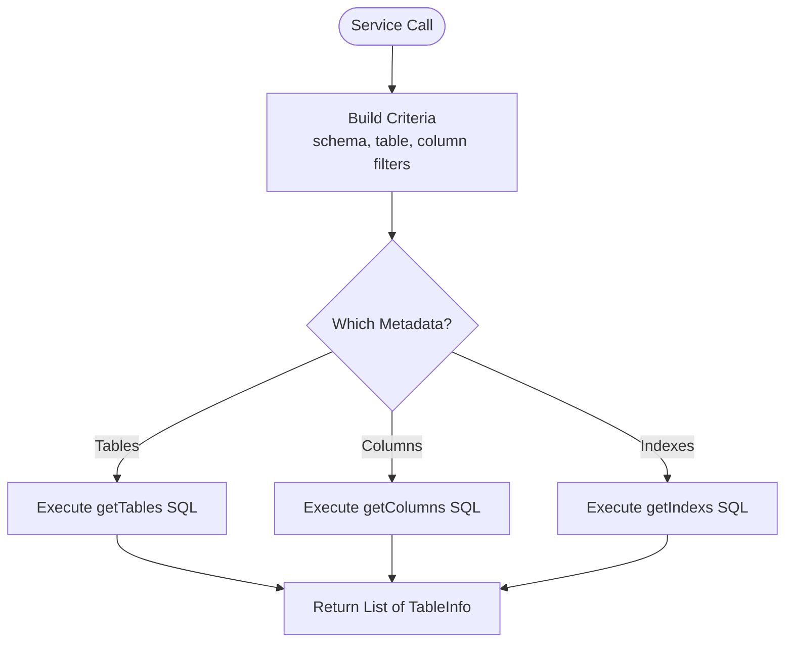
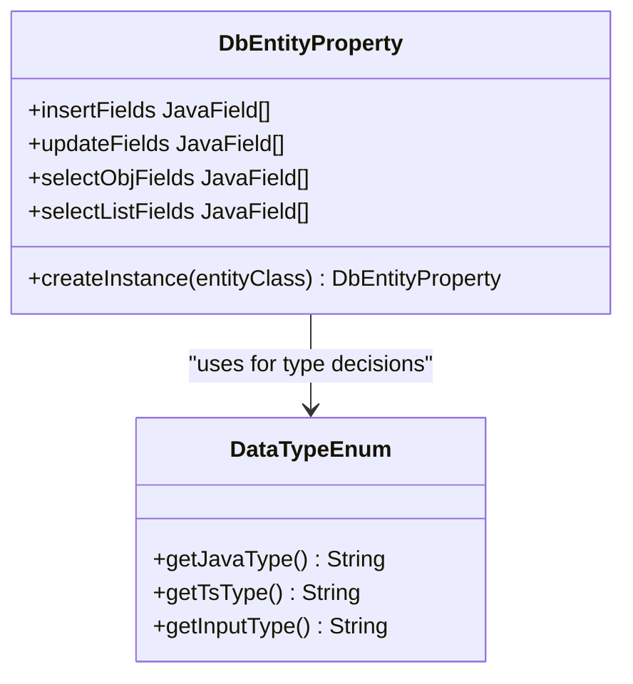
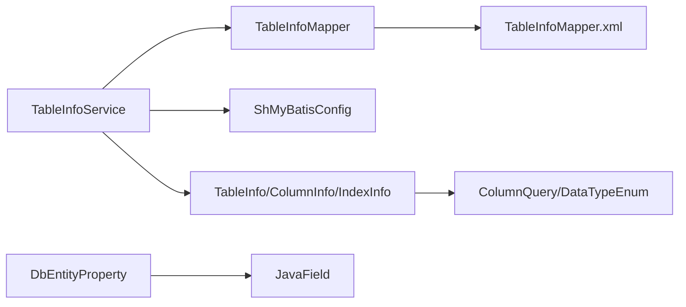

# Table Metadata System

<cite>
**Referenced Files in This Document**
- [TableInfo.java](file://sh-mybatis/src/main/java/com/wkclz/mybatis/bean/TableInfo.java)
- [ColumnInfo.java](file://sh-mybatis/src/main/java/com/wkclz/mybatis/bean/ColumnInfo.java)
- [IndexInfo.java](file://sh-mybatis/src/main/java/com/wkclz/mybatis/bean/IndexInfo.java)
- [DbEntityProperty.java](file://sh-mybatis/src/main/java/com/wkclz/mybatis/bean/DbEntityProperty.java)
- [TableInfoService.java](file://sh-mybatis/src/main/java/com/wkclz/mybatis/service/TableInfoService.java)
- [TableInfoMapper.java](file://sh-mybatis/src/main/java/com/wkclz/mybatis/mapper/TableInfoMapper.java)
- [TableInfoMapper.xml](file://sh-mybatis/src/main/resources/mapper/TableInfoMapper.xml)
- [ShMyBatisConfig.java](file://sh-mybatis/src/main/java/com/wkclz/mybatis/config/ShMyBatisConfig.java)
- [JavaField.java](file://sh-tool/src/main/java/com/wkclz/tool/bean/JavaField.java)
- [ColumnQuery.java](file://sh-mybatis/src/main/java/com/wkclz/mybatis/bean/ColumnQuery.java)
- [DataTypeEnum.java](file://sh-mybatis/src/main/java/com/wkclz/mybatis/bean/DataTypeEnum.java)
</cite>

## Table of Contents
1. [Introduction](#introduction)
2. [Project Structure](#project-structure)
3. [Core Components](#core-components)
4. [Architecture Overview](#architecture-overview)
5. [Detailed Component Analysis](#detailed-component-analysis)
6. [Dependency Analysis](#dependency-analysis)
7. [Performance Considerations](#performance-considerations)
8. [Troubleshooting Guide](#troubleshooting-guide)
9. [Conclusion](#conclusion)
10. [Appendices](#appendices)

## Introduction
This document describes the table metadata system in SH Framework, focusing on how database table structures, column-level metadata, index information, and entity-field mappings are modeled and managed. It covers the TableInfo bean for table-level metadata, ColumnInfo for column-level attributes, IndexInfo for index definitions, and DbEntityProperty for entity-to-table mapping. It also documents the TableInfoService for programmatic retrieval and management of metadata, automatic table discovery via Information Schema, entity-to-table mapping strategies, and caching considerations. Practical examples demonstrate dynamic query generation, schema validation, and automated CRUD operation creation. Finally, it addresses performance optimization for metadata retrieval and integration with the SQL provider system for dynamic SQL generation.

## Project Structure
The table metadata system resides primarily in the sh-mybatis module under the com.wkclz.mybatis package hierarchy. Supporting utilities are provided by the sh-tool module. The key components include:
- Bean definitions for metadata models
- Mapper interface and XML for Information Schema queries
- Service layer for metadata retrieval
- Configuration for schema resolution
- Utility beans for Java field introspection

**Diagram sources**
- [TableInfo.java:1-33](file://sh-mybatis/src/main/java/com/wkclz/mybatis/bean/TableInfo.java#L1-L33)
- [ColumnInfo.java:1-30](file://sh-mybatis/src/main/java/com/wkclz/mybatis/bean/ColumnInfo.java#L1-L30)
- [IndexInfo.java:1-32](file://sh-mybatis/src/main/java/com/wkclz/mybatis/bean/IndexInfo.java#L1-L32)
- [DbEntityProperty.java:1-214](file://sh-mybatis/src/main/java/com/wkclz/mybatis/bean/DbEntityProperty.java#L1-L214)
- [ColumnQuery.java:1-32](file://sh-mybatis/src/main/java/com/wkclz/mybatis/bean/ColumnQuery.java#L1-L32)
- [DataTypeEnum.java:1-85](file://sh-mybatis/src/main/java/com/wkclz/mybatis/bean/DataTypeEnum.java#L1-L85)
- [TableInfoMapper.java:1-30](file://sh-mybatis/src/main/java/com/wkclz/mybatis/mapper/TableInfoMapper.java#L1-L30)
- [TableInfoMapper.xml:1-127](file://sh-mybatis/src/main/resources/mapper/TableInfoMapper.xml#L1-L127)
- [ShMyBatisConfig.java:1-42](file://sh-mybatis/src/main/java/com/wkclz/mybatis/config/ShMyBatisConfig.java#L1-L42)
- [JavaField.java:1-24](file://sh-tool/src/main/java/com/wkclz/tool/bean/JavaField.java#L1-L24)

**Section sources**
- [TableInfo.java:1-33](file://sh-mybatis/src/main/java/com/wkclz/mybatis/bean/TableInfo.java#L1-L33)
- [TableInfoMapper.java:1-30](file://sh-mybatis/src/main/java/com/wkclz/mybatis/mapper/TableInfoMapper.java#L1-L30)
- [TableInfoMapper.xml:1-127](file://sh-mybatis/src/main/resources/mapper/TableInfoMapper.xml#L1-L127)
- [TableInfoService.java:1-69](file://sh-mybatis/src/main/java/com/wkclz/mybatis/service/TableInfoService.java#L1-L69)
- [ShMyBatisConfig.java:1-42](file://sh-mybatis/src/main/java/com/wkclz/mybatis/config/ShMyBatisConfig.java#L1-L42)
- [DbEntityProperty.java:1-214](file://sh-mybatis/src/main/java/com/wkclz/mybatis/bean/DbEntityProperty.java#L1-L214)
- [JavaField.java:1-24](file://sh-tool/src/main/java/com/wkclz/tool/bean/JavaField.java#L1-L24)
- [ColumnQuery.java:1-32](file://sh-mybatis/src/main/java/com/wkclz/mybatis/bean/ColumnQuery.java#L1-L32)
- [DataTypeEnum.java:1-85](file://sh-mybatis/src/main/java/com/wkclz/mybatis/bean/DataTypeEnum.java#L1-L85)

## Core Components
This section introduces the primary metadata models and their roles:
- TableInfo: Encapsulates table-level metadata including schema, name, comment, storage engine, charset/collation, auto-increment value, and lists of columns and indexes. It also includes auxiliary query fields for batch operations.
- ColumnInfo: Captures column-level attributes such as schema, table, column name, data type, charset/collate, length, comments, defaults, auto-increment flags, unsigned indicators, nullability, and positional order.
- IndexInfo: Represents index definitions with schema, table, index name, uniqueness flag, index type, internal type, and associated column list.
- DbEntityProperty: Provides entity-to-table mapping by reflecting on a Java entity class, building field maps, identifying special fields (primary key, logical delete, version, timestamps), and categorizing fields for insert/update/select operations. It integrates annotations and naming conventions for mapping.

Key capabilities:
- Automatic table discovery via Information Schema queries for tables, columns, and indexes.
- Entity-to-table mapping with camelCase-to-snake_case conversion and annotation-driven overrides.
- Field categorization for CRUD operations and blob-aware selection.

**Section sources**
- [TableInfo.java:8-32](file://sh-mybatis/src/main/java/com/wkclz/mybatis/bean/TableInfo.java#L8-L32)
- [ColumnInfo.java:7-29](file://sh-mybatis/src/main/java/com/wkclz/mybatis/bean/ColumnInfo.java#L7-L29)
- [IndexInfo.java:11-31](file://sh-mybatis/src/main/java/com/wkclz/mybatis/bean/IndexInfo.java#L11-L31)
- [DbEntityProperty.java:19-118](file://sh-mybatis/src/main/java/com/wkclz/mybatis/bean/DbEntityProperty.java#L19-L118)

## Architecture Overview
The metadata system follows a layered architecture:
- Data Access Layer: TableInfoMapper interface and XML mapper define SQL queries against Information Schema.
- Service Layer: TableInfoService orchestrates metadata retrieval, applies schema defaults from configuration, and delegates to the mapper.
- Model Layer: Beans represent metadata structures and entity mappings.
- Configuration: ShMyBatisConfig resolves the target schema from the active data source URL.

**Diagram sources**
- [TableInfoService.java:19-68](file://sh-mybatis/src/main/java/com/wkclz/mybatis/service/TableInfoService.java#L19-L68)
- [ShMyBatisConfig.java:17-38](file://sh-mybatis/src/main/java/com/wkclz/mybatis/config/ShMyBatisConfig.java#L17-L38)
- [TableInfoMapper.java:14-29](file://sh-mybatis/src/main/java/com/wkclz/mybatis/mapper/TableInfoMapper.java#L14-L29)
- [TableInfoMapper.xml:3-127](file://sh-mybatis/src/main/resources/mapper/TableInfoMapper.xml#L3-L127)
- [TableInfo.java:8-32](file://sh-mybatis/src/main/java/com/wkclz/mybatis/bean/TableInfo.java#L8-L32)
- [ColumnInfo.java:7-29](file://sh-mybatis/src/main/java/com/wkclz/mybatis/bean/ColumnInfo.java#L7-L29)
- [IndexInfo.java:11-31](file://sh-mybatis/src/main/java/com/wkclz/mybatis/bean/IndexInfo.java#L11-L31)
- [DbEntityProperty.java:19-118](file://sh-mybatis/src/main/java/com/wkclz/mybatis/bean/DbEntityProperty.java#L19-L118)

## Detailed Component Analysis

### TableInfo Bean
Purpose:
- Encapsulate table-level metadata retrieved from Information Schema.
- Provide structured access to table attributes and nested collections for columns and indexes.

Key attributes:
- Schema, table name, comment, engine, charset/collation, auto-increment value.
- Lists of ColumnInfo and IndexInfo.
- Auxiliary fields for batch operations (tableNames, columnNames).

Usage patterns:
- Filtering by table name or comment.
- Batch retrieval via tableNames list.
- Iterating over columns and indexes for dynamic SQL generation.

**Section sources**
- [TableInfo.java:8-32](file://sh-mybatis/src/main/java/com/wkclz/mybatis/bean/TableInfo.java#L8-L32)

### ColumnInfo Bean
Purpose:
- Capture detailed column metadata for schema validation and dynamic mapping.

Key attributes:
- Schema, table, column name, data type, charset/collate, length.
- Defaults, auto-increment, unsigned flags, nullability, and positional order.
- Timestamp-related flags (on update).

Integration:
- Used by TableInfoService to build table metadata.
- Consumed by DbEntityProperty for field categorization and type mapping.

**Section sources**
- [ColumnInfo.java:7-29](file://sh-mybatis/src/main/java/com/wkclz/mybatis/bean/ColumnInfo.java#L7-L29)

### IndexInfo Bean
Purpose:
- Represent index definitions for schema analysis and query optimization.

Key attributes:
- Schema, table, index name, uniqueness, index type, internal type.
- Associated columns list for composite indexes.

Usage:
- Retrieve indexes per table for performance tuning and constraint validation.

**Section sources**
- [IndexInfo.java:11-31](file://sh-mybatis/src/main/java/com/wkclz/mybatis/bean/IndexInfo.java#L11-L31)

### DbEntityProperty: Entity-to-Table Mapping
Purpose:
- Reflect on a Java entity class to derive database mapping and operational field sets.

Core behaviors:
- Automatic class resolution: Walks up the inheritance chain to locate the nearest class extending BaseEntity.
- Field discovery: Collects declared fields from the entity and parent classes, excluding BaseEntity fields except for specific reserved fields.
- Naming convention: Converts camelCase field names to snake_case column names.
- Annotation support: Uses FieldDesc to mark not-null constraints and Blob to exclude large fields from list selections.
- Special field detection: Identifies id, ids, createBy, updateBy, version, and timestamp fields.
- Field categorization: Builds separate lists for insert, update, select object, and select list operations.

**Diagram sources**
- [DbEntityProperty.java:19-118](file://sh-mybatis/src/main/java/com/wkclz/mybatis/bean/DbEntityProperty.java#L19-L118)
- [JavaField.java:12-23](file://sh-tool/src/main/java/com/wkclz/tool/bean/JavaField.java#L12-L23)

**Section sources**
- [DbEntityProperty.java:55-118](file://sh-mybatis/src/main/java/com/wkclz/mybatis/bean/DbEntityProperty.java#L55-L118)
- [JavaField.java:12-23](file://sh-tool/src/main/java/com/wkclz/tool/bean/JavaField.java#L12-L23)

### TableInfoService: Programmatic Metadata Management
Responsibilities:
- Retrieve tables, columns, and indexes for given criteria.
- Apply default schema from ShMyBatisConfig when not provided.
- Provide specialized queries for option lists and column length inspection.

Control flow:
- Input validation and defaulting for schema.
- Delegation to TableInfoMapper methods.
- Return structured metadata lists for downstream processing.

**Diagram sources**
- [TableInfoService.java:27-35](file://sh-mybatis/src/main/java/com/wkclz/mybatis/service/TableInfoService.java#L27-L35)
- [ShMyBatisConfig.java:17-38](file://sh-mybatis/src/main/java/com/wkclz/mybatis/config/ShMyBatisConfig.java#L17-L38)
- [TableInfoMapper.java:18-18](file://sh-mybatis/src/main/java/com/wkclz/mybatis/mapper/TableInfoMapper.java#L18-L18)
- [TableInfoMapper.xml:5-23](file://sh-mybatis/src/main/resources/mapper/TableInfoMapper.xml#L5-L23)

**Section sources**
- [TableInfoService.java:19-68](file://sh-mybatis/src/main/java/com/wkclz/mybatis/service/TableInfoService.java#L19-L68)

### Information Schema Queries and Automatic Discovery
The XML mapper defines SQL queries against MySQL Information Schema:
- getTables: Filters by schema, optional table name/comment filters, and batch table names.
- getColumns: Retrieves detailed column metadata with computed flags and ordering.
- getIndexs: Fetches index definitions grouped by index name.
- getColumnInfos4Options: Aggregates column usage statistics for UI options.
- getColumnLengthList: Extracts length constraints for textual types.

**Diagram sources**
- [TableInfoMapper.xml:5-123](file://sh-mybatis/src/main/resources/mapper/TableInfoMapper.xml#L5-L123)
- [TableInfoService.java:27-55](file://sh-mybatis/src/main/java/com/wkclz/mybatis/service/TableInfoService.java#L27-L55)

**Section sources**
- [TableInfoMapper.xml:1-127](file://sh-mybatis/src/main/resources/mapper/TableInfoMapper.xml#L1-L127)

### Data Type Mapping and Field Classification
DataTypeEnum provides mappings between database types and Java/TypeScript/input types, enabling UI and validation decisions. DbEntityProperty classifies fields for CRUD operations and handles blob exclusions.

**Diagram sources**
- [DataTypeEnum.java:8-84](file://sh-mybatis/src/main/java/com/wkclz/mybatis/bean/DataTypeEnum.java#L8-L84)
- [DbEntityProperty.java:106-115](file://sh-mybatis/src/main/java/com/wkclz/mybatis/bean/DbEntityProperty.java#L106-L115)

**Section sources**
- [DataTypeEnum.java:8-84](file://sh-mybatis/src/main/java/com/wkclz/mybatis/bean/DataTypeEnum.java#L8-L84)
- [DbEntityProperty.java:106-115](file://sh-mybatis/src/main/java/com/wkclz/mybatis/bean/DbEntityProperty.java#L106-L115)

## Dependency Analysis
The system exhibits clear separation of concerns:
- Service depends on Mapper and Configuration.
- Mapper depends on XML-defined SQL.
- Beans are POJOs with minimal coupling.
- DbEntityProperty depends on reflection and annotation scanning.

**Diagram sources**
- [TableInfoService.java:22-25](file://sh-mybatis/src/main/java/com/wkclz/mybatis/service/TableInfoService.java#L22-L25)
- [TableInfoMapper.java:14-29](file://sh-mybatis/src/main/java/com/wkclz/mybatis/mapper/TableInfoMapper.java#L14-L29)
- [TableInfoMapper.xml:3-127](file://sh-mybatis/src/main/resources/mapper/TableInfoMapper.xml#L3-L127)
- [ShMyBatisConfig.java:17-38](file://sh-mybatis/src/main/java/com/wkclz/mybatis/config/ShMyBatisConfig.java#L17-L38)
- [DbEntityProperty.java:19-118](file://sh-mybatis/src/main/java/com/wkclz/mybatis/bean/DbEntityProperty.java#L19-L118)
- [JavaField.java:12-23](file://sh-tool/src/main/java/com/wkclz/tool/bean/JavaField.java#L12-L23)
- [ColumnQuery.java:13-31](file://sh-mybatis/src/main/java/com/wkclz/mybatis/bean/ColumnQuery.java#L13-L31)
- [DataTypeEnum.java:8-84](file://sh-mybatis/src/main/java/com/wkclz/mybatis/bean/DataTypeEnum.java#L8-L84)

**Section sources**
- [TableInfoService.java:19-68](file://sh-mybatis/src/main/java/com/wkclz/mybatis/service/TableInfoService.java#L19-L68)
- [TableInfoMapper.java:14-29](file://sh-mybatis/src/main/java/com/wkclz/mybatis/mapper/TableInfoMapper.java#L14-L29)
- [TableInfoMapper.xml:3-127](file://sh-mybatis/src/main/resources/mapper/TableInfoMapper.xml#L3-L127)
- [ShMyBatisConfig.java:17-38](file://sh-mybatis/src/main/java/com/wkclz/mybatis/config/ShMyBatisConfig.java#L17-L38)
- [DbEntityProperty.java:19-118](file://sh-mybatis/src/main/java/com/wkclz/mybatis/bean/DbEntityProperty.java#L19-L118)
- [JavaField.java:12-23](file://sh-tool/src/main/java/com/wkclz/tool/bean/JavaField.java#L12-L23)
- [ColumnQuery.java:13-31](file://sh-mybatis/src/main/java/com/wkclz/mybatis/bean/ColumnQuery.java#L13-L31)
- [DataTypeEnum.java:8-84](file://sh-mybatis/src/main/java/com/wkclz/mybatis/bean/DataTypeEnum.java#L8-L84)

## Performance Considerations
- Minimize repeated metadata fetches by caching TableInfo results keyed by schema/table filters. Use short TTL for schema snapshots and invalidate on DDL changes.
- Batch retrieval: Supply tableNames and columnNames lists to leverage IN clauses and reduce round trips.
- Prefer column projections: Request only required columns from Information Schema to reduce payload size.
- Use getIndexs judiciously: Index enumeration can be expensive on systems with many indexes; cache results and refresh periodically.
- Optimize reflection costs: DbEntityProperty caches field maps and getter/setter lookups; reuse instances per entity type.
- SQL provider integration: Leverage metadata to prebuild SQL fragments and parameter maps, reducing runtime reflection overhead during query execution.

[No sources needed since this section provides general guidance]

## Troubleshooting Guide
Common issues and resolutions:
- Schema mismatch: Ensure ShMyBatisConfig resolves the correct schema from the data source URL. Verify JDBC URL format and connection properties.
- Empty results: Confirm Information Schema permissions and that the target schema exists. Validate filters (table name/comment, tableNames/columnNames lists).
- Missing fields: Check BaseEntity inheritance and field visibility. DbEntityProperty excludes BaseEntity fields except reserved ones; ensure custom fields are declared in the entity class.
- Blob handling: Fields annotated with Blob are excluded from list selections; confirm expectations for selectListFields vs selectObjFields.
- Type mismatches: Use DataTypeEnum mappings to align UI input types and validation logic with database types.

**Section sources**
- [ShMyBatisConfig.java:17-38](file://sh-mybatis/src/main/java/com/wkclz/mybatis/config/ShMyBatisConfig.java#L17-L38)
- [TableInfoMapper.xml:14-20](file://sh-mybatis/src/main/resources/mapper/TableInfoMapper.xml#L14-L20)
- [DbEntityProperty.java:120-135](file://sh-mybatis/src/main/java/com/wkclz/mybatis/bean/DbEntityProperty.java#L120-L135)
- [DbEntityProperty.java:106-115](file://sh-mybatis/src/main/java/com/wkclz/mybatis/bean/DbEntityProperty.java#L106-L115)
- [DataTypeEnum.java:8-84](file://sh-mybatis/src/main/java/com/wkclz/mybatis/bean/DataTypeEnum.java#L8-L84)

## Conclusion
The SH Framework’s table metadata system provides a robust foundation for schema-aware operations. By modeling table, column, and index metadata alongside entity-to-table mapping, it enables dynamic query generation, schema validation, and automated CRUD creation. The service layer abstracts Information Schema interactions, while configuration and utility classes streamline discovery and mapping. With thoughtful caching and batch operations, the system achieves both flexibility and performance.

[No sources needed since this section summarizes without analyzing specific files]

## Appendices

### Practical Use Cases
- Dynamic query generation: Use TableInfo.columns and IndexInfo to construct JOINs, WHERE clauses, and ORDER BY statements tailored to the current schema.
- Schema validation: Compare DbEntityProperty.fieldMap against ColumnInfo lists to detect missing or unexpected columns.
- Automated CRUD: Build insert/update/delete providers using DbEntityProperty.insertFields and updateFields, respecting special fields and blob exclusions.
- UI scaffolding: Use DataTypeEnum mappings and ColumnQuery aggregations to drive form generation and validation rules.

[No sources needed since this section provides general guidance]