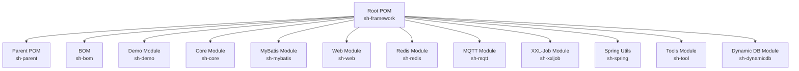
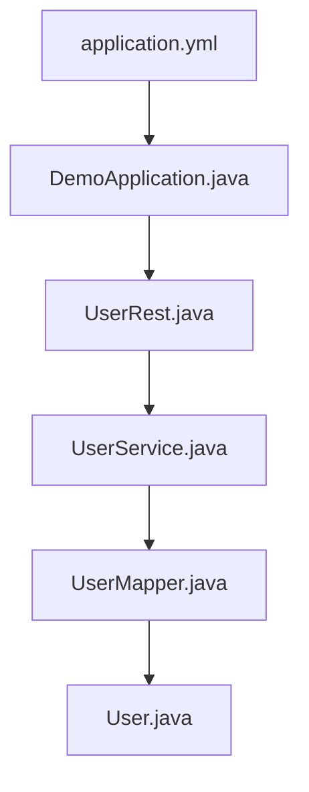
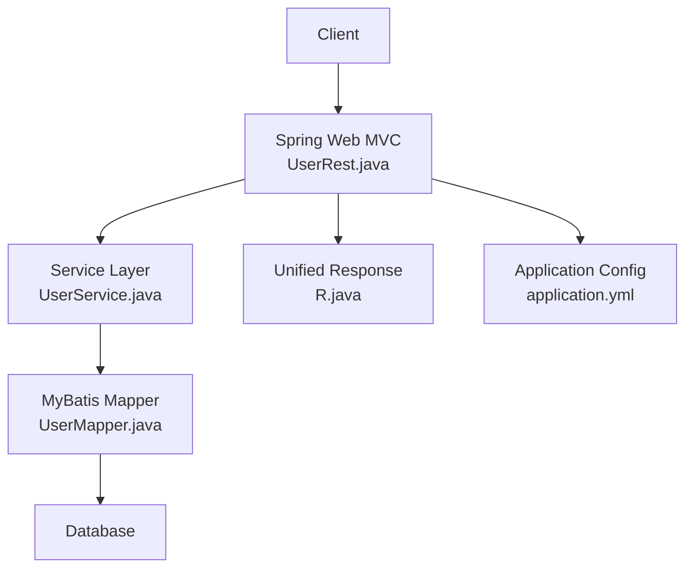
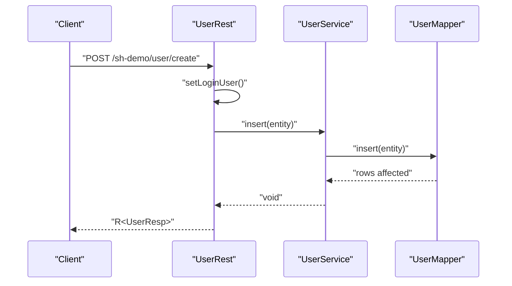
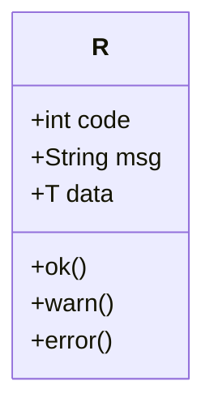
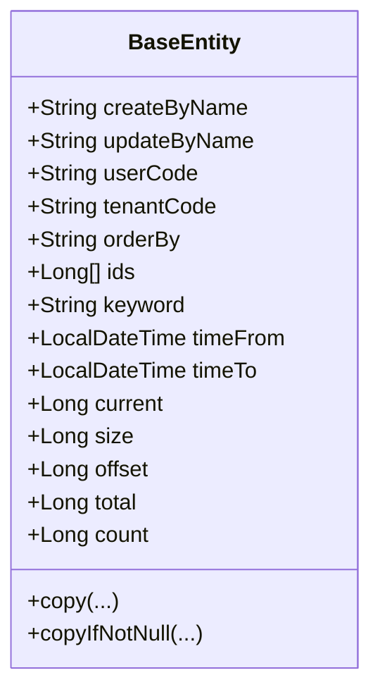
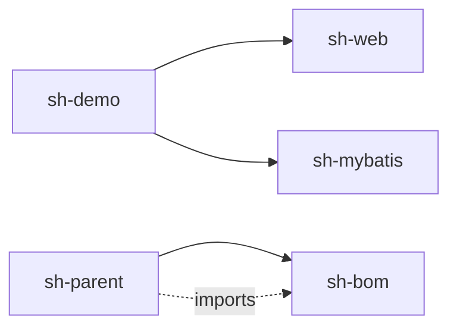

# Getting Started

<cite>
**Referenced Files in This Document**
- [README.md](file://README.md)
- [pom.xml](file://pom.xml)
- [sh-parent/pom.xml](file://sh-parent/pom.xml)
- [sh-bom/pom.xml](file://sh-bom/pom.xml)
- [sh-demo/pom.xml](file://sh-demo/pom.xml)
- [sh-demo/src/main/java/com/wkclz/demo/DemoApplication.java](file://sh-demo/src/main/java/com/wkclz/demo/DemoApplication.java)
- [sh-demo/src/main/resources/config/application.yml](file://sh-demo/src/main/resources/config/application.yml)
- [sh-demo/src/main/java/com/wkclz/demo/rest/UserRest.java](file://sh-demo/src/main/java/com/wkclz/demo/rest/UserRest.java)
- [sh-demo/src/main/java/com/wkclz/demo/rest/Route.java](file://sh-demo/src/main/java/com/wkclz/demo/rest/Route.java)
- [sh-demo/src/main/java/com/wkclz/demo/service/UserService.java](file://sh-demo/src/main/java/com/wkclz/demo/service/UserService.java)
- [sh-demo/src/main/java/com/wkclz/demo/mapper/UserMapper.java](file://sh-demo/src/main/java/com/wkclz/demo/mapper/UserMapper.java)
- [sh-demo/src/main/java/com/wkclz/demo/bean/entity/User.java](file://sh-demo/src/main/java/com/wkclz/demo/bean/entity/User.java)
- [sh-core/src/main/java/com/wkclz/core/base/BaseEntity.java](file://sh-core/src/main/java/com/wkclz/core/base/BaseEntity.java)
- [sh-core/src/main/java/com/wkclz/core/base/R.java](file://sh-core/src/main/java/com/wkclz/core/base/R.java)
- [sh-web/src/main/java/com/wkclz/web/ShWebAutoConfig.java](file://sh-web/src/main/java/com/wkclz/web/ShWebAutoConfig.java)
- [sh-mybatis/src/main/java/com/wkclz/mybatis/ShMyBatisAutoConfig.java](file://sh-mybatis/src/main/java/com/wkclz/mybatis/ShMyBatisAutoConfig.java)
</cite>

## Table of Contents
1. [Introduction](#introduction)
2. [Project Structure](#project-structure)
3. [Prerequisites](#prerequisites)
4. [Installation and Setup](#installation-and-setup)
5. [Dependency Management with BOM](#dependency-management-with-bom)
6. [Basic Configuration](#basic-configuration)
7. [Initial Project Structure](#initial-project-structure)
8. [Running the Demo Application](#running-the-demo-application)
9. [Quick Start Examples](#quick-start-examples)
10. [Architecture Overview](#architecture-overview)
11. [Detailed Component Analysis](#detailed-component-analysis)
12. [Dependency Analysis](#dependency-analysis)
13. [Performance Considerations](#performance-considerations)
14. [Troubleshooting Guide](#troubleshooting-guide)
15. [Conclusion](#conclusion)

## Introduction
SH Framework is a modular Java backend framework designed to accelerate development with standardized components for web, persistence, caching, messaging, scheduling, and more. It provides a demo module that showcases typical CRUD operations, REST endpoints, and integration patterns out of the box.

**Section sources**
- [README.md:1-3](file://README.md#L1-L3)

## Project Structure
The repository is a multi-module Maven project with a parent POM orchestrating shared configuration and a Bill of Materials (BOM) for consistent dependency versions. The demo module demonstrates a complete REST service backed by MyBatis and Spring Web.

**Diagram sources**
- [pom.xml:21-34](file://pom.xml#L21-L34)

**Section sources**
- [pom.xml:21-34](file://pom.xml#L21-L34)

## Prerequisites
- Java: Version 25 (the project targets Java 25; ensure your JDK matches)
- Maven: Standard Maven installation for building and dependency resolution
- Spring Boot: Managed via the parent POM; no manual installation required
- Optional: IDE with Maven support for convenience

Notes:
- The demo module sets Java 25 in its POM properties.
- The parent POM sets Java 25 and manages Spring Boot version centrally.

**Section sources**
- [sh-demo/pom.xml:15-19](file://sh-demo/pom.xml#L15-L19)
- [sh-parent/pom.xml:23-26](file://sh-parent/pom.xml#L23-L26)
- [sh-parent/pom.xml:8-12](file://sh-parent/pom.xml#L8-L12)

## Installation and Setup
Follow these steps to build and run the demo locally:

1. Clone the repository (if not already present).
2. Build the project with Maven:
   - Run: mvn clean install -DskipTests
3. Navigate to the demo module directory and run the Spring Boot application:
   - From the demo module: mvn spring-boot:run
   - Or build and run the generated artifact:
     - mvn package spring-boot:repackage
     - java -jar target/sh-demo-*.jar

After startup, the application listens on port 8080 (see configuration).

**Section sources**
- [sh-demo/src/main/java/com/wkclz/demo/DemoApplication.java:11-13](file://sh-demo/src/main/java/com/wkclz/demo/DemoApplication.java#L11-L13)
- [sh-demo/src/main/resources/config/application.yml:1-2](file://sh-demo/src/main/resources/config/application.yml#L1-L2)

## Dependency Management with BOM
SH Framework uses a BOM (Bill of Materials) to standardize third-party library versions across modules. The parent POM imports the BOM so that individual modules inherit consistent versions without declaring them explicitly.

Key points:
- The parent POM imports the BOM with type=pom and scope=import.
- Modules declare their own dependencies without repeating version numbers.
- The BOM centralizes versions for libraries like MyBatis starters, Druid, MySQL Connector/J, PageHelper, Lombok, and others.

Recommended approach:
- Depend on framework modules (e.g., sh-web, sh-mybatis) rather than pulling individual dependencies.
- Allow the BOM to resolve transitive versions consistently.

**Section sources**
- [sh-parent/pom.xml:32-40](file://sh-parent/pom.xml#L32-L40)
- [sh-bom/pom.xml:53-280](file://sh-bom/pom.xml#L53-L280)

## Basic Configuration
The demo’s configuration includes:
- Server port: 8080
- Active profile: local
- Datasource driver: MySQL Connector/J
- Jackson: exclude null fields by default
- MyBatis: mapper locations and underscore-to-camel mapping
- PageHelper: dialect set to MySQL with sensible defaults

These settings enable immediate CRUD operations against a MySQL database with pagination support.

**Section sources**
- [sh-demo/src/main/resources/config/application.yml:1-26](file://sh-demo/src/main/resources/config/application.yml#L1-L26)

## Initial Project Structure
The demo module follows a conventional layered structure:
- Application bootstrap class
- REST controller layer
- Service layer
- Mapper layer (MyBatis)
- Domain entities and VO/DTOs
- Configuration files

**Diagram sources**
- [sh-demo/src/main/java/com/wkclz/demo/DemoApplication.java:7-8](file://sh-demo/src/main/java/com/wkclz/demo/DemoApplication.java#L7-L8)
- [sh-demo/src/main/java/com/wkclz/demo/rest/UserRest.java:24-28](file://sh-demo/src/main/java/com/wkclz/demo/rest/UserRest.java#L24-L28)
- [sh-demo/src/main/java/com/wkclz/demo/service/UserService.java:8-9](file://sh-demo/src/main/java/com/wkclz/demo/service/UserService.java#L8-L9)
- [sh-demo/src/main/java/com/wkclz/demo/mapper/UserMapper.java:7-8](file://sh-demo/src/main/java/com/wkclz/demo/mapper/UserMapper.java#L7-L8)
- [sh-demo/src/main/java/com/wkclz/demo/bean/entity/User.java:14](file://sh-demo/src/main/java/com/wkclz/demo/bean/entity/User.java#L14)
- [sh-demo/src/main/resources/config/application.yml:1-26](file://sh-demo/src/main/resources/config/application.yml#L1-L26)

**Section sources**
- [sh-demo/src/main/java/com/wkclz/demo/DemoApplication.java:7-8](file://sh-demo/src/main/java/com/wkclz/demo/DemoApplication.java#L7-L8)
- [sh-demo/src/main/java/com/wkclz/demo/rest/UserRest.java:24-98](file://sh-demo/src/main/java/com/wkclz/demo/rest/UserRest.java#L24-L98)
- [sh-demo/src/main/java/com/wkclz/demo/service/UserService.java:8-12](file://sh-demo/src/main/java/com/wkclz/demo/service/UserService.java#L8-L12)
- [sh-demo/src/main/java/com/wkclz/demo/mapper/UserMapper.java:7-10](file://sh-demo/src/main/java/com/wkclz/demo/mapper/UserMapper.java#L7-L10)
- [sh-demo/src/main/java/com/wkclz/demo/bean/entity/User.java:14-28](file://sh-demo/src/main/java/com/wkclz/demo/bean/entity/User.java#L14-L28)

## Running the Demo Application
Steps:
1. Ensure MySQL is running and reachable.
2. Confirm the demo configuration points to a valid datasource.
3. Build the project and run the demo application class.
4. Access Swagger/OpenAPI documentation if enabled, or use curl/postman to test endpoints under the route prefix defined in the demo.

Endpoints exposed by the demo:
- GET /sh-demo/user/page
- GET /sh-demo/user/info
- POST /sh-demo/user/create
- POST /sh-demo/user/update
- POST /sh-demo/user/remove

Note: The demo sets a mock user context for requests to simulate authenticated user information.

**Section sources**
- [sh-demo/src/main/java/com/wkclz/demo/DemoApplication.java:11-13](file://sh-demo/src/main/java/com/wkclz/demo/DemoApplication.java#L11-L13)
- [sh-demo/src/main/resources/config/application.yml:1-26](file://sh-demo/src/main/resources/config/application.yml#L1-L26)
- [sh-demo/src/main/java/com/wkclz/demo/rest/Route.java:9-24](file://sh-demo/src/main/java/com/wkclz/demo/rest/Route.java#L9-L24)
- [sh-demo/src/main/java/com/wkclz/demo/rest/UserRest.java:30-89](file://sh-demo/src/main/java/com/wkclz/demo/rest/UserRest.java#L30-L89)
- [sh-demo/src/main/java/com/wkclz/demo/rest/UserRest.java:91-96](file://sh-demo/src/main/java/com/wkclz/demo/rest/UserRest.java#L91-L96)

## Quick Start Examples
Below are practical, code-path-based walkthroughs for common operations. Replace code snippets with your own classes while following the same patterns.

- Entity creation
  - Define an entity extending the framework’s base entity.
  - Reference: [sh-demo/src/main/java/com/wkclz/demo/bean/entity/User.java:14-28](file://sh-demo/src/main/java/com/wkclz/demo/bean/entity/User.java#L14-L28)
  - Reference: [sh-core/src/main/java/com/wkclz/core/base/BaseEntity.java:12-94](file://sh-core/src/main/java/com/wkclz/core/base/BaseEntity.java#L12-L94)

- Service implementation
  - Extend the framework’s base service with your entity and mapper.
  - Reference: [sh-demo/src/main/java/com/wkclz/demo/service/UserService.java:8-12](file://sh-demo/src/main/java/com/wkclz/demo/service/UserService.java#L8-L12)

- Mapper setup
  - Annotate your mapper interface with @Mapper and extend the base mapper.
  - Reference: [sh-demo/src/main/java/com/wkclz/demo/mapper/UserMapper.java:7-10](file://sh-demo/src/main/java/com/wkclz/demo/mapper/UserMapper.java#L7-L10)

- REST endpoint setup
  - Create a controller with routes and use the unified response wrapper.
  - Reference: [sh-demo/src/main/java/com/wkclz/demo/rest/UserRest.java:24-98](file://sh-demo/src/main/java/com/wkclz/demo/rest/UserRest.java#L24-L98)
  - Unified response model: [sh-core/src/main/java/com/wkclz/core/base/R.java:12-76](file://sh-core/src/main/java/com/wkclz/core/base/R.java#L12-L76)

- Route definition
  - Define a route interface with a common prefix and operation-specific paths.
  - Reference: [sh-demo/src/main/java/com/wkclz/demo/rest/Route.java:6-24](file://sh-demo/src/main/java/com/wkclz/demo/rest/Route.java#L6-L24)

**Section sources**
- [sh-demo/src/main/java/com/wkclz/demo/bean/entity/User.java:14-28](file://sh-demo/src/main/java/com/wkclz/demo/bean/entity/User.java#L14-L28)
- [sh-core/src/main/java/com/wkclz/core/base/BaseEntity.java:12-94](file://sh-core/src/main/java/com/wkclz/core/base/BaseEntity.java#L12-L94)
- [sh-demo/src/main/java/com/wkclz/demo/service/UserService.java:8-12](file://sh-demo/src/main/java/com/wkclz/demo/service/UserService.java#L8-L12)
- [sh-demo/src/main/java/com/wkclz/demo/mapper/UserMapper.java:7-10](file://sh-demo/src/main/java/com/wkclz/demo/mapper/UserMapper.java#L7-L10)
- [sh-demo/src/main/java/com/wkclz/demo/rest/UserRest.java:24-98](file://sh-demo/src/main/java/com/wkclz/demo/rest/UserRest.java#L24-L98)
- [sh-core/src/main/java/com/wkclz/core/base/R.java:12-76](file://sh-core/src/main/java/com/wkclz/core/base/R.java#L12-L76)
- [sh-demo/src/main/java/com/wkclz/demo/rest/Route.java:6-24](file://sh-demo/src/main/java/com/wkclz/demo/rest/Route.java#L6-L24)

## Architecture Overview
The demo application integrates Spring Web MVC, MyBatis, and the framework’s base components to deliver a layered architecture:

**Diagram sources**
- [sh-demo/src/main/java/com/wkclz/demo/rest/UserRest.java:24-98](file://sh-demo/src/main/java/com/wkclz/demo/rest/UserRest.java#L24-L98)
- [sh-demo/src/main/java/com/wkclz/demo/service/UserService.java:8-12](file://sh-demo/src/main/java/com/wkclz/demo/service/UserService.java#L8-L12)
- [sh-demo/src/main/java/com/wkclz/demo/mapper/UserMapper.java:7-10](file://sh-demo/src/main/java/com/wkclz/demo/mapper/UserMapper.java#L7-L10)
- [sh-core/src/main/java/com/wkclz/core/base/R.java:12-76](file://sh-core/src/main/java/com/wkclz/core/base/R.java#L12-L76)
- [sh-demo/src/main/resources/config/application.yml:1-26](file://sh-demo/src/main/resources/config/application.yml#L1-L26)

## Detailed Component Analysis

### REST Endpoint Flow (POST /sh-demo/user/create)

**Diagram sources**
- [sh-demo/src/main/java/com/wkclz/demo/rest/UserRest.java:60-69](file://sh-demo/src/main/java/com/wkclz/demo/rest/UserRest.java#L60-L69)
- [sh-demo/src/main/java/com/wkclz/demo/service/UserService.java:8-12](file://sh-demo/src/main/java/com/wkclz/demo/service/UserService.java#L8-L12)
- [sh-demo/src/main/java/com/wkclz/demo/mapper/UserMapper.java:7-10](file://sh-demo/src/main/java/com/wkclz/demo/mapper/UserMapper.java#L7-L10)

### Unified Response Model

**Diagram sources**
- [sh-core/src/main/java/com/wkclz/core/base/R.java:12-76](file://sh-core/src/main/java/com/wkclz/core/base/R.java#L12-L76)

### Base Entity and Pagination Support

**Diagram sources**
- [sh-core/src/main/java/com/wkclz/core/base/BaseEntity.java:12-94](file://sh-core/src/main/java/com/wkclz/core/base/BaseEntity.java#L12-L94)

**Section sources**
- [sh-demo/src/main/java/com/wkclz/demo/rest/UserRest.java:24-98](file://sh-demo/src/main/java/com/wkclz/demo/rest/UserRest.java#L24-L98)
- [sh-core/src/main/java/com/wkclz/core/base/R.java:12-76](file://sh-core/src/main/java/com/wkclz/core/base/R.java#L12-L76)
- [sh-core/src/main/java/com/wkclz/core/base/BaseEntity.java:12-94](file://sh-core/src/main/java/com/wkclz/core/base/BaseEntity.java#L12-L94)

## Dependency Analysis
The demo module depends on sh-web and sh-mybatis. The parent POM imports the BOM, ensuring consistent versions across modules.

**Diagram sources**
- [sh-demo/pom.xml:21-31](file://sh-demo/pom.xml#L21-L31)
- [sh-parent/pom.xml:32-40](file://sh-parent/pom.xml#L32-L40)

**Section sources**
- [sh-demo/pom.xml:21-31](file://sh-demo/pom.xml#L21-L31)
- [sh-parent/pom.xml:32-40](file://sh-parent/pom.xml#L32-L40)

## Performance Considerations
- Use pagination for large datasets via PageData and PageHelper configuration.
- Prefer selective updates to minimize write overhead.
- Keep DTOs lightweight and avoid unnecessary object copying.
- Enable database connection pooling and tune pool sizes according to workload.

[No sources needed since this section provides general guidance]

## Troubleshooting Guide
Common setup issues and resolutions:

- Java version mismatch
  - Symptom: Build fails with incompatible class files.
  - Resolution: Ensure JDK 25 is installed and used by Maven.

- Missing datasource configuration
  - Symptom: Application fails to start due to missing datasource properties.
  - Resolution: Verify the datasource driver and URL in application.yml match your environment.

- Port already in use
  - Symptom: Application fails to bind to port 8080.
  - Resolution: Change server.port in application.yml or stop the conflicting process.

- Auto-configuration not detected
  - Symptom: Controllers or mappers not scanned.
  - Resolution: Confirm component scanning and auto-configuration classes are present and on the classpath.

- JCE unpack requirement for encryption providers
  - Symptom: Security exceptions related to cryptography during startup.
  - Resolution: The parent POM configures requiresUnpack for specific crypto libraries to extract from the fat jar at runtime.

**Section sources**
- [sh-parent/pom.xml:222-235](file://sh-parent/pom.xml#L222-L235)
- [sh-demo/src/main/resources/config/application.yml:1-26](file://sh-demo/src/main/resources/config/application.yml#L1-L26)

## Conclusion
You now have the essentials to set up, configure, and run the SH Framework demo, along with patterns for entity creation, service implementation, and REST endpoint design. Use the BOM for consistent dependency management and refer to the demo module as a blueprint for building production-grade applications with the framework.

[No sources needed since this section summarizes without analyzing specific files]