# Infrastructure Services

<cite>
**Referenced Files in This Document**
- [ShRedisAutoConfig.java](file://sh-redis/src/main/java/com/wkclz/redis/ShRedisAutoConfig.java)
- [RedisConfig.java](file://sh-redis/src/main/java/com/wkclz/redis/config/RedisConfig.java)
- [RedisHelper.java](file://sh-redis/src/main/java/com/wkclz/redis/helper/RedisHelper.java)
- [RedisLock.java](file://sh-redis/src/main/java/com/wkclz/redis/helper/RedisLock.java)
- [RedisIdGenerator.java](file://sh-redis/src/main/java/com/wkclz/redis/helper/RedisIdGenerator.java)
- [MqttAutoConfigure.java](file://sh-mqtt/src/main/java/com/wkclz/mqtt/MqttAutoConfigure.java)
- [MqttConfig.java](file://sh-mqtt/src/main/java/com/wkclz/mqtt/config/MqttConfig.java)
- [MqttController.java](file://sh-mqtt/src/main/java/com/wkclz/mqtt/annotation/MqttController.java)
- [MqttTopicMapping.java](file://sh-mqtt/src/main/java/com/wkclz/mqtt/annotation/MqttTopicMapping.java)
- [MqttProducer.java](file://sh-mqtt/src/main/java/com/wkclz/mqtt/client/MqttProducer.java)
- [XxlJobAutoConfigure.java](file://sh-xxljob/src/main/java/com/wkclz/xxljob/XxlJobAutoConfigure.java)
- [XxlJobConfig.java](file://sh-xxljob/src/main/java/com/wkclz/xxljob/config/XxlJobConfig.java)
- [ShSpringAutoConfig.java](file://sh-spring/src/main/java/com/wkclz/spring/ShSpringAutoConfig.java)
- [SpringContextHolder.java](file://sh-spring/src/main/java/com/wkclz/spring/config/SpringContextHolder.java)
- [SnowflakeHelper.java](file://sh-spring/src/main/java/com/wkclz/spring/helper/SnowflakeHelper.java)
</cite>

## Table of Contents
1. [Introduction](#introduction)
2. [Project Structure](#project-structure)
3. [Core Components](#core-components)
4. [Architecture Overview](#architecture-overview)
5. [Detailed Component Analysis](#detailed-component-analysis)
6. [Dependency Analysis](#dependency-analysis)
7. [Performance Considerations](#performance-considerations)
8. [Troubleshooting Guide](#troubleshooting-guide)
9. [Conclusion](#conclusion)
10. [Appendices](#appendices)

## Introduction
This document describes the infrastructure services that provide cross-cutting capabilities across the platform. It covers:
- Redis integration for cache operations, distributed locks, ID generation, and message queues
- MQTT integration for event-driven programming with annotation-driven publish/subscribe and SSL/TLS support
- XXL-Job integration for distributed task scheduling
It also includes practical examples, performance considerations, connection management, and monitoring approaches for each service.

## Project Structure
The infrastructure services are organized into separate modules:
- Redis module: auto-configuration, Redis configuration, helpers for cache, locks, and ID generation
- MQTT module: auto-configuration, client configuration, annotations for event handlers, producer utilities
- XXL-Job module: auto-configuration and executor configuration
- Spring utilities: global application context holder and local ID generation utilities

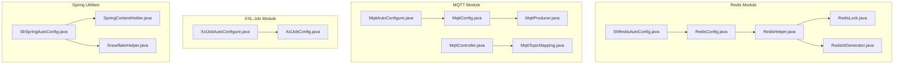

**Diagram sources**
- [ShRedisAutoConfig.java:1-12](file://sh-redis/src/main/java/com/wkclz/redis/ShRedisAutoConfig.java#L1-L12)
- [RedisConfig.java:1-41](file://sh-redis/src/main/java/com/wkclz/redis/config/RedisConfig.java#L1-L41)
- [RedisHelper.java:1-513](file://sh-redis/src/main/java/com/wkclz/redis/helper/RedisHelper.java#L1-L513)
- [RedisLock.java:1-328](file://sh-redis/src/main/java/com/wkclz/redis/helper/RedisLock.java#L1-L328)
- [RedisIdGenerator.java:1-257](file://sh-redis/src/main/java/com/wkclz/redis/helper/RedisIdGenerator.java#L1-L257)
- [MqttAutoConfigure.java:1-12](file://sh-mqtt/src/main/java/com/wkclz/mqtt/MqttAutoConfigure.java#L1-L12)
- [MqttConfig.java:1-256](file://sh-mqtt/src/main/java/com/wkclz/mqtt/config/MqttConfig.java#L1-L256)
- [MqttController.java:1-25](file://sh-mqtt/src/main/java/com/wkclz/mqtt/annotation/MqttController.java#L1-L25)
- [MqttTopicMapping.java:1-21](file://sh-mqtt/src/main/java/com/wkclz/mqtt/annotation/MqttTopicMapping.java#L1-L21)
- [MqttProducer.java:1-137](file://sh-mqtt/src/main/java/com/wkclz/mqtt/client/MqttProducer.java#L1-L137)
- [XxlJobAutoConfigure.java:1-12](file://sh-xxljob/src/main/java/com/wkclz/xxljob/XxlJobAutoConfigure.java#L1-L12)
- [XxlJobConfig.java:1-68](file://sh-xxljob/src/main/java/com/wkclz/xxljob/config/XxlJobConfig.java#L1-L68)
- [ShSpringAutoConfig.java:1-13](file://sh-spring/src/main/java/com/wkclz/spring/ShSpringAutoConfig.java#L1-L13)
- [SpringContextHolder.java:1-64](file://sh-spring/src/main/java/com/wkclz/spring/config/SpringContextHolder.java#L1-L64)
- [SnowflakeHelper.java:1-69](file://sh-spring/src/main/java/com/wkclz/spring/helper/SnowflakeHelper.java#L1-L69)

**Section sources**
- [ShRedisAutoConfig.java:1-12](file://sh-redis/src/main/java/com/wkclz/redis/ShRedisAutoConfig.java#L1-L12)
- [MqttAutoConfigure.java:1-12](file://sh-mqtt/src/main/java/com/wkclz/mqtt/MqttAutoConfigure.java#L1-L12)
- [XxlJobAutoConfigure.java:1-12](file://sh-xxljob/src/main/java/com/wkclz/xxljob/XxlJobAutoConfigure.java#L1-L12)
- [ShSpringAutoConfig.java:1-13](file://sh-spring/src/main/java/com/wkclz/spring/ShSpringAutoConfig.java#L1-L13)

## Core Components
- Redis cache operations via RedisTemplate/StringRedisTemplate wrappers for value/hash/list/set/zset primitives
- Distributed locks with automatic watchdog renewal and atomic release scripts
- ID generation leveraging Redis atomic increments with time-relative encoding and fallback to local generation
- MQTT publish/subscribe with annotation-driven handlers, SSL/TLS support, and reconnect logic
- XXL-Job executor configured via Spring beans with admin and logging settings

**Section sources**
- [RedisHelper.java:1-513](file://sh-redis/src/main/java/com/wkclz/redis/helper/RedisHelper.java#L1-L513)
- [RedisLock.java:1-328](file://sh-redis/src/main/java/com/wkclz/redis/helper/RedisLock.java#L1-L328)
- [RedisIdGenerator.java:1-257](file://sh-redis/src/main/java/com/wkclz/redis/helper/RedisIdGenerator.java#L1-L257)
- [MqttConfig.java:1-256](file://sh-mqtt/src/main/java/com/wkclz/mqtt/config/MqttConfig.java#L1-L256)
- [MqttProducer.java:1-137](file://sh-mqtt/src/main/java/com/wkclz/mqtt/client/MqttProducer.java#L1-L137)
- [XxlJobConfig.java:1-68](file://sh-xxljob/src/main/java/com/wkclz/xxljob/config/XxlJobConfig.java#L1-L68)

## Architecture Overview
The infrastructure services integrate with Spring Boot auto-configuration and expose beans for application usage. Redis provides caching, locking, and ID generation; MQTT enables event-driven messaging with annotations; XXL-Job orchestrates distributed scheduling.

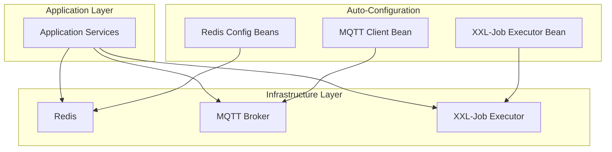

**Diagram sources**
- [RedisConfig.java:33-38](file://sh-redis/src/main/java/com/wkclz/redis/config/RedisConfig.java#L33-L38)
- [MqttConfig.java:61-119](file://sh-mqtt/src/main/java/com/wkclz/mqtt/config/MqttConfig.java#L61-L119)
- [XxlJobConfig.java:52-66](file://sh-xxljob/src/main/java/com/wkclz/xxljob/config/XxlJobConfig.java#L52-L66)

## Detailed Component Analysis

### Redis Integration

#### Redis Cache Operations
RedisHelper exposes typed operations for:
- Value primitives: set/get with optional TTL, set-if-absent, increment
- Strings and Numbers: dedicated string and numeric storage APIs
- Hash: put/get/all entries
- Lists: push/pop/bounded range and blocking pop
- Sets: add/members
- Sorted sets: add/range with ascending/descending
- Keys: expire/ttl/exists

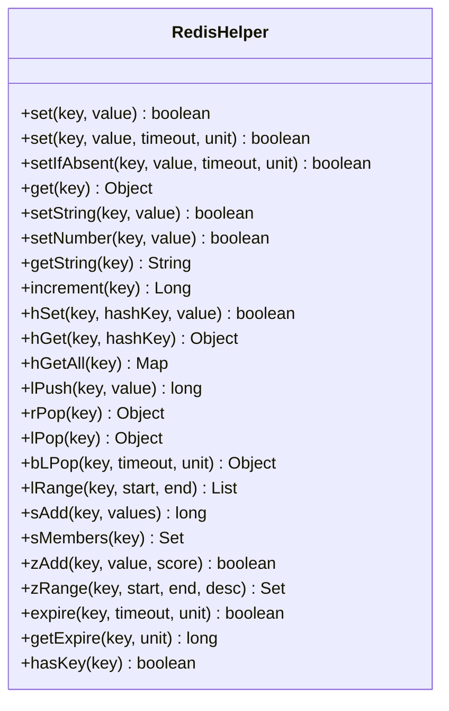

**Diagram sources**
- [RedisHelper.java:30-513](file://sh-redis/src/main/java/com/wkclz/redis/helper/RedisHelper.java#L30-L513)

Practical examples:
- Caching strategy: store computed results with short TTL; use setIfAbsent for optimistic caching; refresh on miss
- Numeric counters: increment atomically and optionally expire per key
- Hash modeling: store entity attributes; batch retrieve via hGetAll

**Section sources**
- [RedisHelper.java:1-513](file://sh-redis/src/main/java/com/wkclz/redis/helper/RedisHelper.java#L1-L513)

#### Redis Distributed Locks
RedisLock implements:
- Unique request identifiers per lock acquisition
- Atomic lock acquisition using set-if-absent semantics
- Automatic watchdog thread scheduling lock renewal at 1/3 of lock duration
- Atomic unlock via Lua script to avoid releasing wrong locks

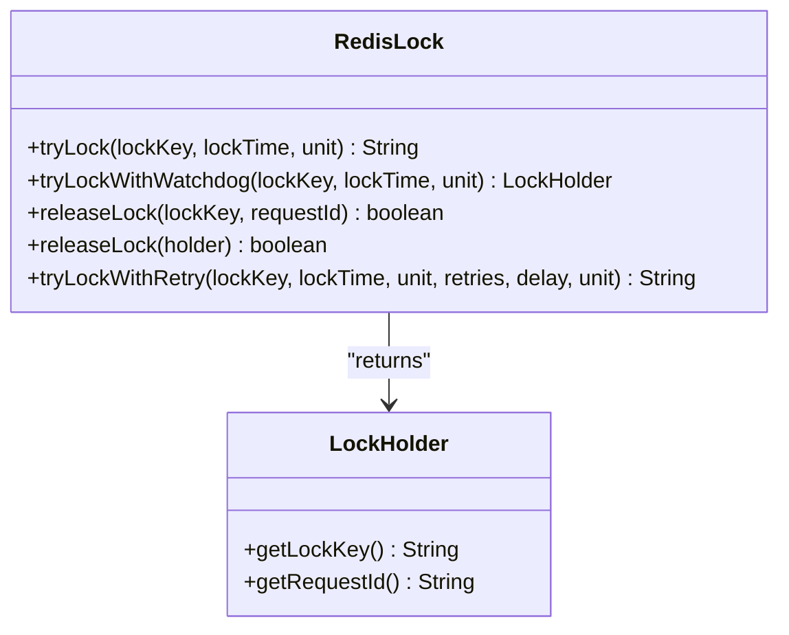

**Diagram sources**
- [RedisLock.java:158-262](file://sh-redis/src/main/java/com/wkclz/redis/helper/RedisLock.java#L158-L262)

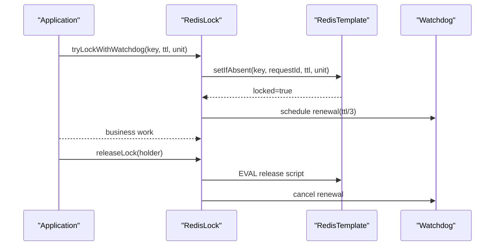

**Diagram sources**
- [RedisLock.java:195-262](file://sh-redis/src/main/java/com/wkclz/redis/helper/RedisLock.java#L195-L262)

Best practices:
- Use tryLockWithWatchdog for long-running tasks
- Always pair releaseLock with the same requestId
- Tune TTL to balance safety and responsiveness

**Section sources**
- [RedisLock.java:1-328](file://sh-redis/src/main/java/com/wkclz/redis/helper/RedisLock.java#L1-L328)

#### Redis ID Generation
RedisIdGenerator:
- Uses Redis atomic increment per millisecond window with TTL
- Encodes timestamp, machine id, and sequence into a compact base-62 string
- Handles clock rollback by clamping timestamps
- Falls back to local generation if Redis fails

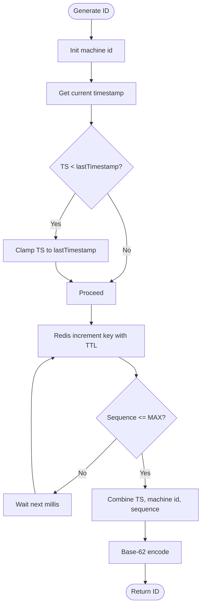

**Diagram sources**
- [RedisIdGenerator.java:98-163](file://sh-redis/src/main/java/com/wkclz/redis/helper/RedisIdGenerator.java#L98-L163)

Operational tips:
- Keep TTL aligned with expected peak rate per ms
- Monitor Redis availability for fallback behavior
- Use business-type scoping to prevent collisions

**Section sources**
- [RedisIdGenerator.java:1-257](file://sh-redis/src/main/java/com/wkclz/redis/helper/RedisIdGenerator.java#L1-L257)

### MQTT Integration

#### Annotation-Driven Event Handlers
- Annotate controller classes with MqttController(parentTopic)
- Annotate methods with MqttTopicMapping(subTopic) to subscribe to topic fragments
- The framework scans and registers handlers automatically

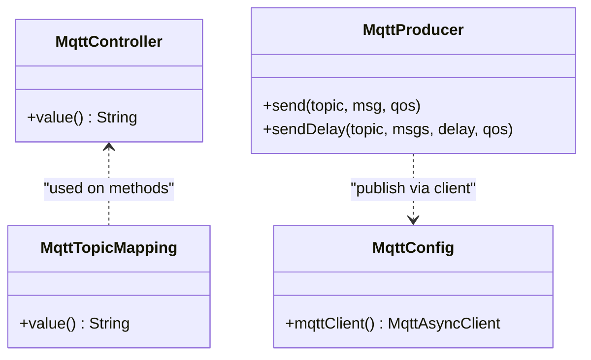

**Diagram sources**
- [MqttController.java:17-25](file://sh-mqtt/src/main/java/com/wkclz/mqtt/annotation/MqttController.java#L17-L25)
- [MqttTopicMapping.java:13-21](file://sh-mqtt/src/main/java/com/wkclz/mqtt/annotation/MqttTopicMapping.java#L13-L21)
- [MqttProducer.java:91-121](file://sh-mqtt/src/main/java/com/wkclz/mqtt/client/MqttProducer.java#L91-L121)
- [MqttConfig.java:61-119](file://sh-mqtt/src/main/java/com/wkclz/mqtt/config/MqttConfig.java#L61-L119)

#### SSL/TLS Support and Reconnect
- MqttConfig builds MqttAsyncClient with configurable credentials and keep-alive
- Supports SSL connections via CA certificate loading from classpath
- Automatic reconnection and resubscription on reconnectComplete

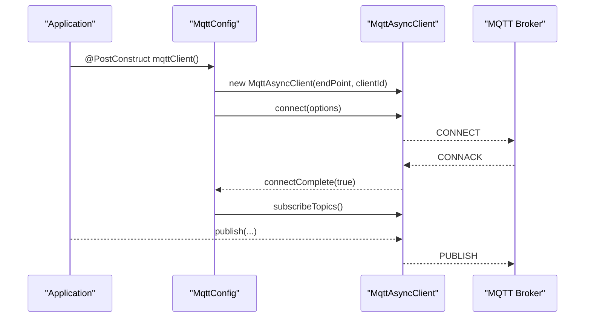

**Diagram sources**
- [MqttConfig.java:61-119](file://sh-mqtt/src/main/java/com/wkclz/mqtt/config/MqttConfig.java#L61-L119)

Implementation notes:
- Configure endpoint, credentials, and CA path for secure connections
- Use keep-alive intervals appropriate to network conditions
- Leverage automatic reconnect to maintain subscriptions

**Section sources**
- [MqttConfig.java:1-256](file://sh-mqtt/src/main/java/com/wkclz/mqtt/config/MqttConfig.java#L1-L256)
- [MqttProducer.java:1-137](file://sh-mqtt/src/main/java/com/wkclz/mqtt/client/MqttProducer.java#L1-L137)

### XXL-Job Integration

#### Distributed Task Scheduling
XxlJobConfig exposes a Spring bean for XXL-Job executor:
- Admin addresses and access token
- Application name, IP, port, and dynamic registration address
- Log path and retention days

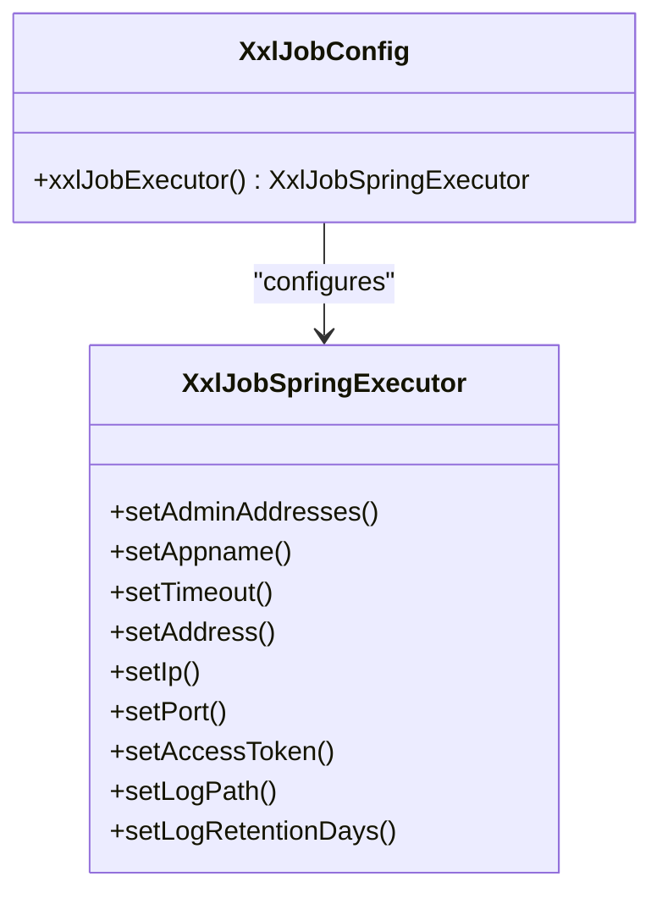

**Diagram sources**
- [XxlJobConfig.java:52-66](file://sh-xxljob/src/main/java/com/wkclz/xxljob/config/XxlJobConfig.java#L52-L66)

Operational guidance:
- Point to the XXL-Job admin cluster and configure access token
- Ensure unique ports when running multiple executors
- Set log path with sufficient disk space and retention policy

**Section sources**
- [XxlJobConfig.java:1-68](file://sh-xxljob/src/main/java/com/wkclz/xxljob/config/XxlJobConfig.java#L1-L68)

### Spring Utilities

#### Global Application Context Holder
SpringContextHolder provides static access to the ApplicationContext and beans, enabling utility-style access outside of DI-managed components.

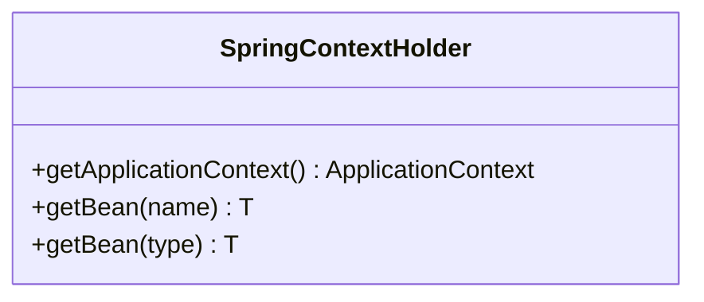

**Diagram sources**
- [SpringContextHolder.java:18-38](file://sh-spring/src/main/java/com/wkclz/spring/config/SpringContextHolder.java#L18-L38)

#### Local ID Generation (Fallback)
SnowflakeHelper generates IDs using a local Snowflake worker derived from environment and network interface metadata.

**Section sources**
- [SpringContextHolder.java:1-64](file://sh-spring/src/main/java/com/wkclz/spring/config/SpringContextHolder.java#L1-L64)
- [SnowflakeHelper.java:1-69](file://sh-spring/src/main/java/com/wkclz/spring/helper/SnowflakeHelper.java#L1-L69)

## Dependency Analysis
- Redis module depends on Spring Data Redis and exposes RedisTemplate/StringRedisTemplate-backed helpers
- MQTT module depends on Eclipse Paho client and registers a singleton MqttAsyncClient bean
- XXL-Job module depends on XXL-Job core and registers XxlJobSpringExecutor bean
- Spring utilities provide global context and local ID generation

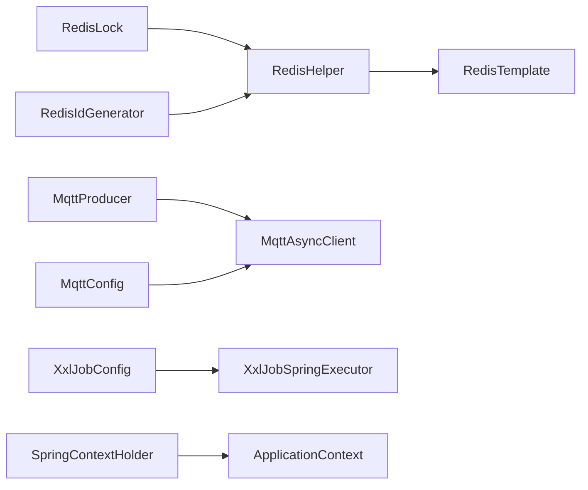

**Diagram sources**
- [RedisHelper.java:22-26](file://sh-redis/src/main/java/com/wkclz/redis/helper/RedisHelper.java#L22-L26)
- [RedisLock.java:25-28](file://sh-redis/src/main/java/com/wkclz/redis/helper/RedisLock.java#L25-L28)
- [RedisIdGenerator.java:28-32](file://sh-redis/src/main/java/com/wkclz/redis/helper/RedisIdGenerator.java#L28-L32)
- [MqttProducer.java:31-32](file://sh-mqtt/src/main/java/com/wkclz/mqtt/client/MqttProducer.java#L31-L32)
- [MqttConfig.java:61-119](file://sh-mqtt/src/main/java/com/wkclz/mqtt/config/MqttConfig.java#L61-L119)
- [XxlJobConfig.java:52-66](file://sh-xxljob/src/main/java/com/wkclz/xxljob/config/XxlJobConfig.java#L52-L66)
- [SpringContextHolder.java:18-38](file://sh-spring/src/main/java/com/wkclz/spring/config/SpringContextHolder.java#L18-L38)

**Section sources**
- [RedisHelper.java:1-513](file://sh-redis/src/main/java/com/wkclz/redis/helper/RedisHelper.java#L1-L513)
- [MqttProducer.java:1-137](file://sh-mqtt/src/main/java/com/wkclz/mqtt/client/MqttProducer.java#L1-L137)
- [XxlJobConfig.java:1-68](file://sh-xxljob/src/main/java/com/wkclz/xxljob/config/XxlJobConfig.java#L1-L68)
- [SpringContextHolder.java:1-64](file://sh-spring/src/main/java/com/wkclz/spring/config/SpringContextHolder.java#L1-L64)

## Performance Considerations
- Redis
  - Prefer setIfAbsent for cache-aside patterns to avoid overwrites
  - Use TTL judiciously; monitor key expiration rates
  - For hot keys, consider read replicas or sharding
  - Batch operations (e.g., pipeline) for high-throughput writes
- Distributed locks
  - Keep lock TTL reasonable to minimize stale locks
  - Use watchdog intervals at 1/3 of TTL to reduce missed renewals
  - Avoid holding locks during I/O-bound operations
- ID generation
  - Align Redis TTL with expected throughput; monitor sequence overflow
  - Base-62 encoding reduces key length but ensure uniqueness
- MQTT
  - Choose QoS 1 for reliable delivery; 2 for exactly-once semantics
  - Tune keep-alive to detect network failures promptly
  - Use delayed sends sparingly; prefer batching where possible
- XXL-Job
  - Scale executors horizontally for heavy load
  - Monitor executor logs and adjust retention days
  - Use distinct app names per deployment to avoid conflicts

[No sources needed since this section provides general guidance]

## Troubleshooting Guide
- Redis
  - If cache operations fail, check connectivity and serialization settings; verify auto-type whitelist configuration
  - For distributed locks, ensure watchdog threads are running and Lua scripts are available
- MQTT
  - If connection fails, verify endpoint, credentials, and CA path; confirm SSL socket factory initialization
  - On disconnects, confirm automatic reconnect and subscription restoration
- XXL-Job
  - If jobs do not trigger, verify admin addresses and access tokens; check executor registration and logs
- Spring utilities
  - If SpringContextHolder throws an injection error, ensure the context is initialized before accessing beans

**Section sources**
- [RedisConfig.java:25-31](file://sh-redis/src/main/java/com/wkclz/redis/config/RedisConfig.java#L25-L31)
- [MqttConfig.java:111-118](file://sh-mqtt/src/main/java/com/wkclz/mqtt/config/MqttConfig.java#L111-L118)
- [XxlJobConfig.java:52-66](file://sh-xxljob/src/main/java/com/wkclz/xxljob/config/XxlJobConfig.java#L52-L66)
- [SpringContextHolder.java:59-63](file://sh-spring/src/main/java/com/wkclz/spring/config/SpringContextHolder.java#L59-L63)

## Conclusion
The infrastructure services provide robust, production-ready capabilities:
- Redis for high-performance caching, locking, and ID generation
- MQTT for scalable event-driven communication with SSL/TLS and reconnect
- XXL-Job for reliable distributed scheduling
Adopt the recommended patterns, monitor performance, and tune configurations per deployment needs.

[No sources needed since this section summarizes without analyzing specific files]

## Appendices
- Practical examples
  - Caching: use setIfAbsent for cache-aside; retrieve via get; refresh on miss
  - Locking: acquire with tryLockWithWatchdog; release with requestId; handle retries
  - ID generation: call generateIdWithType with business type; encode as needed
  - MQTT: annotate controller and method topics; publish via MqttProducer; enable SSL via CA path
  - XXL-Job: configure admin addresses and executor settings; deploy job handlers

[No sources needed since this section provides general guidance]