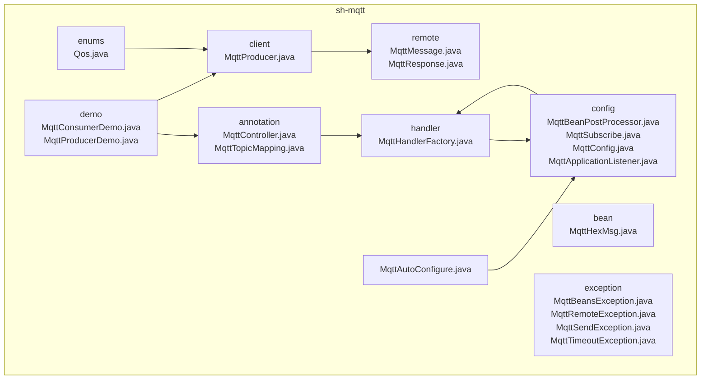
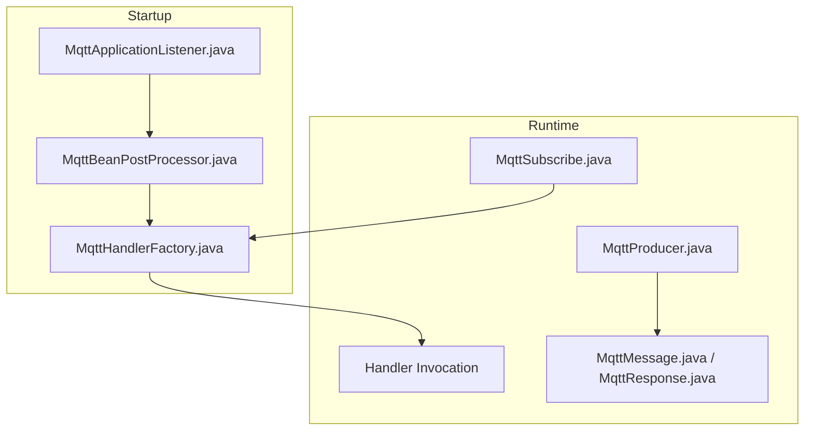
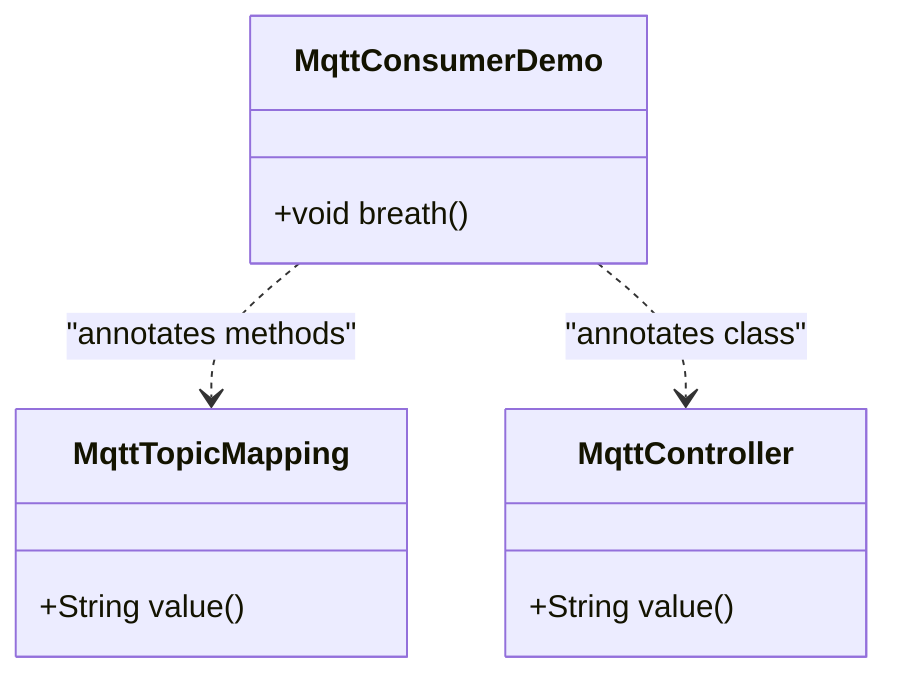
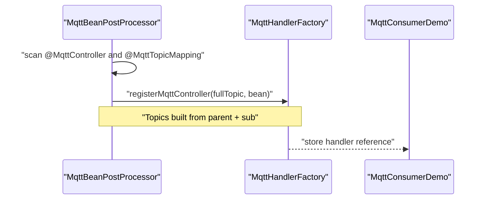
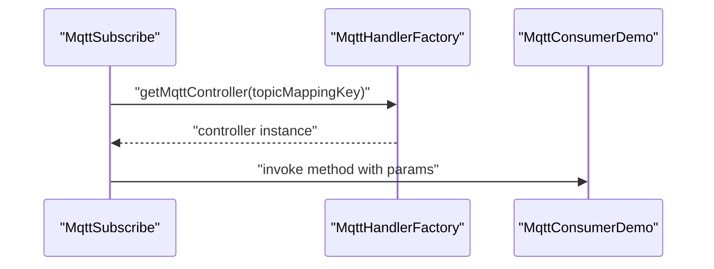
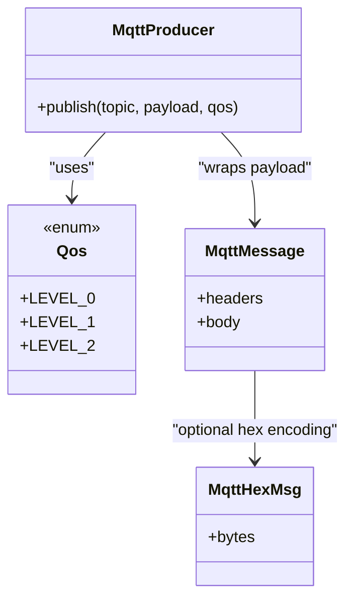
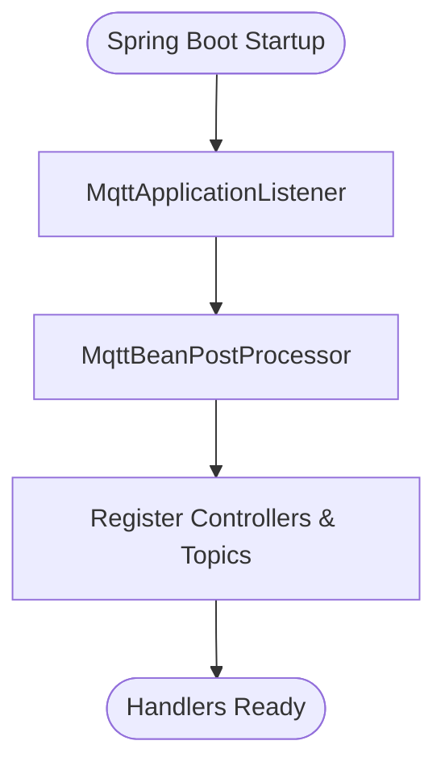
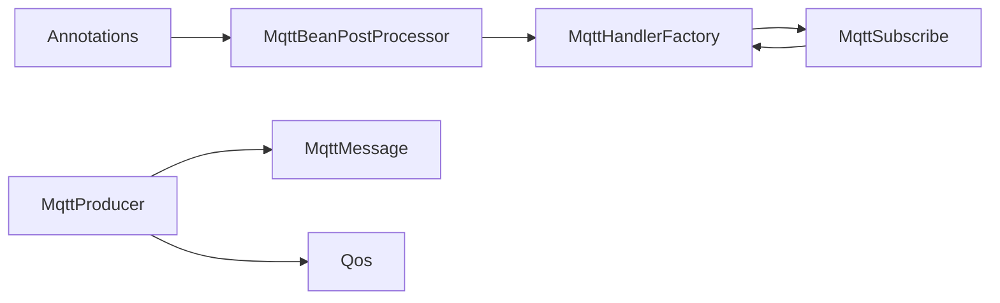

# MQTT Integration

<cite>
**Referenced Files in This Document**
- [MqttController.java](file://sh-mqtt/src/main/java/com/wkclz/mqtt/annotation/MqttController.java)
- [MqttTopicMapping.java](file://sh-mqtt/src/main/java/com/wkclz/mqtt/annotation/MqttTopicMapping.java)
- [MqttProducer.java](file://sh-mqtt/src/main/java/com/wkclz/mqtt/client/MqttProducer.java)
- [MqttHandlerFactory.java](file://sh-mqtt/src/main/java/com/wkclz/mqtt/handler/MqttHandlerFactory.java)
- [MqttBeanPostProcessor.java](file://sh-mqtt/src/main/java/com/wkclz/mqtt/config/MqttBeanPostProcessor.java)
- [MqttSubscribe.java](file://sh-mqtt/src/main/java/com/wkclz/mqtt/config/MqttSubscribe.java)
- [MqttConfig.java](file://sh-mqtt/src/main/java/com/wkclz/mqtt/config/MqttConfig.java)
- [Qos.java](file://sh-mqtt/src/main/java/com/wkclz/mqtt/enums/Qos.java)
- [MqttMessage.java](file://sh-mqtt/src/main/java/com/wkclz/mqtt/remote/MqttMessage.java)
- [MqttResponse.java](file://sh-mqtt/src/main/java/com/wkclz/mqtt/remote/MqttResponse.java)
- [MqttHexMsg.java](file://sh-mqtt/src/main/java/com/wkclz/mqtt/bean/MqttHexMsg.java)
- [MqttApplicationListener.java](file://sh-mqtt/src/main/java/com/wkclz/mqtt/config/MqttApplicationListener.java)
- [MqttBeansException.java](file://sh-mqtt/src/main/java/com/wkclz/mqtt/exception/MqttBeansException.java)
- [MqttRemoteException.java](file://sh-mqtt/src/main/java/com/wkclz/mqtt/exception/MqttRemoteException.java)
- [MqttSendException.java](file://sh-mqtt/src/main/java/com/wkclz/mqtt/exception/MqttSendException.java)
- [MqttTimeoutException.java](file://sh-mqtt/src/main/java/com/wkclz/mqtt/exception/MqttTimeoutException.java)
- [MqttAutoConfigure.java](file://sh-mqtt/src/main/java/com/wkclz/mqtt/MqttAutoConfigure.java)
- [MqttConsumerDemo.java](file://sh-mqtt/src/main/java/com/wkclz/mqtt/demo/MqttConsumerDemo.java)
- [MqttProducerDemo.java](file://sh-mqtt/src/main/java/com/wkclz/mqtt/demo/MqttProducerDemo.java)
</cite>

## Table of Contents
1. [Introduction](#introduction)
2. [Project Structure](#project-structure)
3. [Core Components](#core-components)
4. [Architecture Overview](#architecture-overview)
5. [Detailed Component Analysis](#detailed-component-analysis)
6. [Dependency Analysis](#dependency-analysis)
7. [Performance Considerations](#performance-considerations)
8. [Troubleshooting Guide](#troubleshooting-guide)
9. [Conclusion](#conclusion)
10. [Appendices](#appendices)

## Introduction
This document explains the MQTT integration module that enables event-driven programming via annotation-driven message publishing and subscribing. It covers:
- Annotation-driven controller registration and topic routing
- Publishing messages with configurable QoS and payload formats
- Handler factory pattern for runtime handler registration
- Exception handling and error strategies
- Practical patterns for publish-subscribe, event-driven workflows, real-time notifications, and device-to-cloud messaging
- Connection lifecycle, reconnection strategies, and performance considerations

Note: The current implementation focuses on annotation-driven subscription and producer-side publishing. Secure connection (SSL/TLS) and advanced broker configuration are not present in the referenced files and are marked as limitations.

## Project Structure
The MQTT module is organized around annotations, configuration, handler registration, producer, enums, remote DTOs, demos, and auto-configuration.

**Diagram sources**
- [MqttController.java](file://sh-mqtt/src/main/java/com/wkclz/mqtt/annotation/MqttController.java)
- [MqttTopicMapping.java](file://sh-mqtt/src/main/java/com/wkclz/mqtt/annotation/MqttTopicMapping.java)
- [MqttProducer.java](file://sh-mqtt/src/main/java/com/wkclz/mqtt/client/MqttProducer.java)
- [MqttHandlerFactory.java](file://sh-mqtt/src/main/java/com/wkclz/mqtt/handler/MqttHandlerFactory.java)
- [MqttBeanPostProcessor.java](file://sh-mqtt/src/main/java/com/wkclz/mqtt/config/MqttBeanPostProcessor.java)
- [MqttSubscribe.java](file://sh-mqtt/src/main/java/com/wkclz/mqtt/config/MqttSubscribe.java)
- [MqttConfig.java](file://sh-mqtt/src/main/java/com/wkclz/mqtt/config/MqttConfig.java)
- [Qos.java](file://sh-mqtt/src/main/java/com/wkclz/mqtt/enums/Qos.java)
- [MqttMessage.java](file://sh-mqtt/src/main/java/com/wkclz/mqtt/remote/MqttMessage.java)
- [MqttResponse.java](file://sh-mqtt/src/main/java/com/wkclz/mqtt/remote/MqttResponse.java)
- [MqttHexMsg.java](file://sh-mqtt/src/main/java/com/wkclz/mqtt/bean/MqttHexMsg.java)
- [MqttApplicationListener.java](file://sh-mqtt/src/main/java/com/wkclz/mqtt/config/MqttApplicationListener.java)
- [MqttBeansException.java](file://sh-mqtt/src/main/java/com/wkclz/mqtt/exception/MqttBeansException.java)
- [MqttRemoteException.java](file://sh-mqtt/src/main/java/com/wkclz/mqtt/exception/MqttRemoteException.java)
- [MqttSendException.java](file://sh-mqtt/src/main/java/com/wkclz/mqtt/exception/MqttSendException.java)
- [MqttTimeoutException.java](file://sh-mqtt/src/main/java/com/wkclz/mqtt/exception/MqttTimeoutException.java)
- [MqttAutoConfigure.java](file://sh-mqtt/src/main/java/com/wkclz/mqtt/MqttAutoConfigure.java)
- [MqttConsumerDemo.java](file://sh-mqtt/src/main/java/com/wkclz/mqtt/demo/MqttConsumerDemo.java)
- [MqttProducerDemo.java](file://sh-mqtt/src/main/java/com/wkclz/mqtt/demo/MqttProducerDemo.java)

**Section sources**
- [MqttAutoConfigure.java](file://sh-mqtt/src/main/java/com/wkclz/mqtt/MqttAutoConfigure.java)
- [MqttBeanPostProcessor.java](file://sh-mqtt/src/main/java/com/wkclz/mqtt/config/MqttBeanPostProcessor.java)

## Core Components
- Annotations for declaring MQTT message handlers and topic routing
- Producer for publishing messages with QoS and payload selection
- Handler factory for runtime registration and invocation of handlers
- Configuration beans for scanning, subscription wiring, and lifecycle hooks
- Remote DTOs for message envelope and response contract
- Enums for QoS levels
- Demos for consumer and producer usage

**Section sources**
- [MqttController.java](file://sh-mqtt/src/main/java/com/wkclz/mqtt/annotation/MqttController.java)
- [MqttTopicMapping.java](file://sh-mqtt/src/main/java/com/wkclz/mqtt/annotation/MqttTopicMapping.java)
- [MqttProducer.java](file://sh-mqtt/src/main/java/com/wkclz/mqtt/client/MqttProducer.java)
- [MqttHandlerFactory.java](file://sh-mqtt/src/main/java/com/wkclz/mqtt/handler/MqttHandlerFactory.java)
- [MqttSubscribe.java](file://sh-mqtt/src/main/java/com/wkclz/mqtt/config/MqttSubscribe.java)
- [MqttMessage.java](file://sh-mqtt/src/main/java/com/wkclz/mqtt/remote/MqttMessage.java)
- [MqttResponse.java](file://sh-mqtt/src/main/java/com/wkclz/mqtt/remote/MqttResponse.java)
- [Qos.java](file://sh-mqtt/src/main/java/com/wkclz/mqtt/enums/Qos.java)
- [MqttConsumerDemo.java](file://sh-mqtt/src/main/java/com/wkclz/mqtt/demo/MqttConsumerDemo.java)
- [MqttProducerDemo.java](file://sh-mqtt/src/main/java/com/wkclz/mqtt/demo/MqttProducerDemo.java)

## Architecture Overview
The system uses Spring’s post-processing to discover annotated controllers and register handlers with a factory. Incoming messages are routed to registered handlers based on topic mapping. Publishing is performed via a producer that supports configurable QoS and payload formats.

**Diagram sources**
- [MqttApplicationListener.java](file://sh-mqtt/src/main/java/com/wkclz/mqtt/config/MqttApplicationListener.java)
- [MqttBeanPostProcessor.java](file://sh-mqtt/src/main/java/com/wkclz/mqtt/config/MqttBeanPostProcessor.java)
- [MqttHandlerFactory.java](file://sh-mqtt/src/main/java/com/wkclz/mqtt/handler/MqttHandlerFactory.java)
- [MqttSubscribe.java](file://sh-mqtt/src/main/java/com/wkclz/mqtt/config/MqttSubscribe.java)
- [MqttProducer.java](file://sh-mqtt/src/main/java/com/wkclz/mqtt/client/MqttProducer.java)
- [MqttMessage.java](file://sh-mqtt/src/main/java/com/wkclz/mqtt/remote/MqttMessage.java)
- [MqttResponse.java](file://sh-mqtt/src/main/java/com/wkclz/mqtt/remote/MqttResponse.java)

## Detailed Component Analysis

### Annotations: MqttController and MqttTopicMapping
- MqttController declares a class-level parent topic for subscriptions.
- MqttTopicMapping declares method-level sub topics; combined with parent topic to form the full subscription topic.

**Diagram sources**
- [MqttController.java](file://sh-mqtt/src/main/java/com/wkclz/mqtt/annotation/MqttController.java)
- [MqttTopicMapping.java](file://sh-mqtt/src/main/java/com/wkclz/mqtt/annotation/MqttTopicMapping.java)
- [MqttConsumerDemo.java](file://sh-mqtt/src/main/java/com/wkclz/mqtt/demo/MqttConsumerDemo.java)

**Section sources**
- [MqttController.java](file://sh-mqtt/src/main/java/com/wkclz/mqtt/annotation/MqttController.java)
- [MqttTopicMapping.java](file://sh-mqtt/src/main/java/com/wkclz/mqtt/annotation/MqttTopicMapping.java)
- [MqttConsumerDemo.java](file://sh-mqtt/src/main/java/com/wkclz/mqtt/demo/MqttConsumerDemo.java)

### Handler Factory Pattern
- Discovers annotated controllers during bean post-processing.
- Builds full topics by combining parent and sub topics.
- Registers handlers in a factory for later invocation by the subscription mechanism.

**Diagram sources**
- [MqttBeanPostProcessor.java](file://sh-mqtt/src/main/java/com/wkclz/mqtt/config/MqttBeanPostProcessor.java)
- [MqttHandlerFactory.java](file://sh-mqtt/src/main/java/com/wkclz/mqtt/handler/MqttHandlerFactory.java)
- [MqttConsumerDemo.java](file://sh-mqtt/src/main/java/com/wkclz/mqtt/demo/MqttConsumerDemo.java)

**Section sources**
- [MqttBeanPostProcessor.java](file://sh-mqtt/src/main/java/com/wkclz/mqtt/config/MqttBeanPostProcessor.java)
- [MqttHandlerFactory.java](file://sh-mqtt/src/main/java/com/wkclz/mqtt/handler/MqttHandlerFactory.java)

### Subscription Wiring and Invocation
- Subscription wiring maps incoming topics to registered handlers.
- Invocation executes the target method with resolved parameters.

**Diagram sources**
- [MqttSubscribe.java](file://sh-mqtt/src/main/java/com/wkclz/mqtt/config/MqttSubscribe.java)
- [MqttHandlerFactory.java](file://sh-mqtt/src/main/java/com/wkclz/mqtt/handler/MqttHandlerFactory.java)
- [MqttConsumerDemo.java](file://sh-mqtt/src/main/java/com/wkclz/mqtt/demo/MqttConsumerDemo.java)

**Section sources**
- [MqttSubscribe.java](file://sh-mqtt/src/main/java/com/wkclz/mqtt/config/MqttSubscribe.java)

### Producer: Publishing Messages with QoS and Payload Formats
- Supports configurable QoS levels and payload formats.
- Uses remote message envelopes for structured payloads.

**Diagram sources**
- [MqttProducer.java](file://sh-mqtt/src/main/java/com/wkclz/mqtt/client/MqttProducer.java)
- [Qos.java](file://sh-mqtt/src/main/java/com/wkclz/mqtt/enums/Qos.java)
- [MqttMessage.java](file://sh-mqtt/src/main/java/com/wkclz/mqtt/remote/MqttMessage.java)
- [MqttHexMsg.java](file://sh-mqtt/src/main/java/com/wkclz/mqtt/bean/MqttHexMsg.java)

**Section sources**
- [MqttProducer.java](file://sh-mqtt/src/main/java/com/wkclz/mqtt/client/MqttProducer.java)
- [Qos.java](file://sh-mqtt/src/main/java/com/wkclz/mqtt/enums/Qos.java)
- [MqttMessage.java](file://sh-mqtt/src/main/java/com/wkclz/mqtt/remote/MqttMessage.java)
- [MqttHexMsg.java](file://sh-mqtt/src/main/java/com/wkclz/mqtt/bean/MqttHexMsg.java)

### Configuration and Lifecycle
- Application listener and post-processor bootstrap discovery and registration.
- Auto-configuration integrates the module into Spring Boot applications.

**Diagram sources**
- [MqttApplicationListener.java](file://sh-mqtt/src/main/java/com/wkclz/mqtt/config/MqttApplicationListener.java)
- [MqttBeanPostProcessor.java](file://sh-mqtt/src/main/java/com/wkclz/mqtt/config/MqttBeanPostProcessor.java)
- [MqttAutoConfigure.java](file://sh-mqtt/src/main/java/com/wkclz/mqtt/MqttAutoConfigure.java)

**Section sources**
- [MqttApplicationListener.java](file://sh-mqtt/src/main/java/com/wkclz/mqtt/config/MqttApplicationListener.java)
- [MqttBeanPostProcessor.java](file://sh-mqtt/src/main/java/com/wkclz/mqtt/config/MqttBeanPostProcessor.java)
- [MqttAutoConfigure.java](file://sh-mqtt/src/main/java/com/wkclz/mqtt/MqttAutoConfigure.java)

### Practical Patterns and Examples
- Publish-subscribe pattern: Annotate a class/controller with a parent topic and methods with sub topics; publish messages to the composed topic.
- Event-driven workflows: Use separate topics per event type; handlers react independently.
- Real-time notifications: Subscribe to device status topics; publish updates with appropriate QoS.
- Device-to-cloud messaging: Publish telemetry under a device-specific parent topic; consumers process events asynchronously.

Examples are demonstrated in the included demos:
- Consumer demo shows annotated controller and method mapping.
- Producer demo shows injection and usage of the producer.

**Section sources**
- [MqttConsumerDemo.java](file://sh-mqtt/src/main/java/com/wkclz/mqtt/demo/MqttConsumerDemo.java)
- [MqttProducerDemo.java](file://sh-mqtt/src/main/java/com/wkclz/mqtt/demo/MqttProducerDemo.java)

## Dependency Analysis
The module exhibits low coupling and high cohesion:
- Annotations decouple handler declaration from wiring.
- Factory centralizes handler lookup and invocation.
- Producer depends on QoS and message DTOs.
- Configuration components depend on Spring lifecycle hooks.

**Diagram sources**
- [MqttController.java](file://sh-mqtt/src/main/java/com/wkclz/mqtt/annotation/MqttController.java)
- [MqttTopicMapping.java](file://sh-mqtt/src/main/java/com/wkclz/mqtt/annotation/MqttTopicMapping.java)
- [MqttBeanPostProcessor.java](file://sh-mqtt/src/main/java/com/wkclz/mqtt/config/MqttBeanPostProcessor.java)
- [MqttHandlerFactory.java](file://sh-mqtt/src/main/java/com/wkclz/mqtt/handler/MqttHandlerFactory.java)
- [MqttSubscribe.java](file://sh-mqtt/src/main/java/com/wkclz/mqtt/config/MqttSubscribe.java)
- [MqttProducer.java](file://sh-mqtt/src/main/java/com/wkclz/mqtt/client/MqttProducer.java)
- [MqttMessage.java](file://sh-mqtt/src/main/java/com/wkclz/mqtt/remote/MqttMessage.java)
- [Qos.java](file://sh-mqtt/src/main/java/com/wkclz/mqtt/enums/Qos.java)

**Section sources**
- [MqttBeanPostProcessor.java](file://sh-mqtt/src/main/java/com/wkclz/mqtt/config/MqttBeanPostProcessor.java)
- [MqttHandlerFactory.java](file://sh-mqtt/src/main/java/com/wkclz/mqtt/handler/MqttHandlerFactory.java)
- [MqttSubscribe.java](file://sh-mqtt/src/main/java/com/wkclz/mqtt/config/MqttSubscribe.java)
- [MqttProducer.java](file://sh-mqtt/src/main/java/com/wkclz/mqtt/client/MqttProducer.java)

## Performance Considerations
- Minimize reflection overhead by caching handler lookups in the factory.
- Prefer lightweight payloads and appropriate QoS to balance reliability and throughput.
- Batch publishes where feasible and tune broker connection pools.
- Use separate topics per workload to reduce contention and enable parallel processing.
- Monitor handler execution latency and apply backpressure if needed.

[No sources needed since this section provides general guidance]

## Troubleshooting Guide
Common exceptions and strategies:
- Beans discovery errors: Verify annotations and component scanning.
- Remote communication failures: Inspect broker connectivity and credentials.
- Send failures: Retry with exponential backoff and dead-letter topics.
- Timeouts: Increase timeouts and monitor network conditions.

**Section sources**
- [MqttBeansException.java](file://sh-mqtt/src/main/java/com/wkclz/mqtt/exception/MqttBeansException.java)
- [MqttRemoteException.java](file://sh-mqtt/src/main/java/com/wkclz/mqtt/exception/MqttRemoteException.java)
- [MqttSendException.java](file://sh-mqtt/src/main/java/com/wkclz/mqtt/exception/MqttSendException.java)
- [MqttTimeoutException.java](file://sh-mqtt/src/main/java/com/wkclz/mqtt/exception/MqttTimeoutException.java)

## Conclusion
The MQTT integration provides a concise, annotation-driven foundation for publish-subscribe messaging. It supports handler registration via a factory, flexible QoS and payload options, and clear separation of concerns. For production deployments requiring SSL/TLS and advanced broker features, extend the configuration and client components accordingly.

[No sources needed since this section summarizes without analyzing specific files]

## Appendices

### SSL/TLS Configuration and Security
- Current implementation does not expose SSL/TLS configuration in the referenced files.
- To enable secure connections, integrate TLS settings into the broker configuration and client initialization, including trust stores, key stores, and authentication parameters.

[No sources needed since this section provides general guidance]

### Connection Management and Reconnection Strategies
- Implement retry loops with jitter and circuit breaker patterns.
- Persist unacknowledged messages locally and replay after reconnection.
- Use keep-alive intervals and clean session policies aligned with QoS requirements.

[No sources needed since this section provides general guidance]

### Example Workflows
- Device heartbeat: Publish periodic heartbeats with QoS 1; subscribe to control topics.
- Alerting pipeline: Publish alerts to a fan-out topic; multiple subscribers process notifications.
- Telemetry aggregation: Publish sensor readings under device-specific topics; aggregate in downstream services.

[No sources needed since this section provides general guidance]