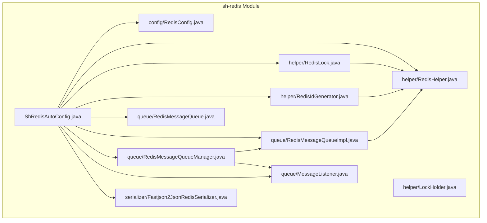
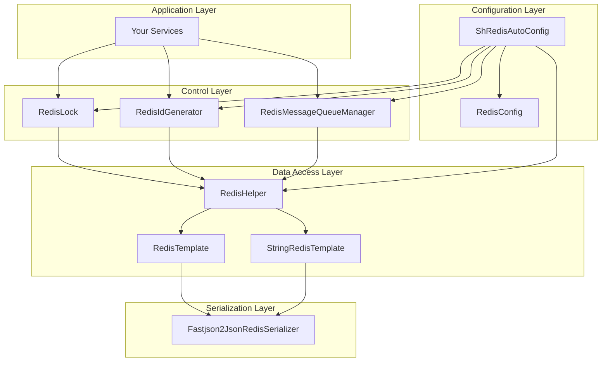
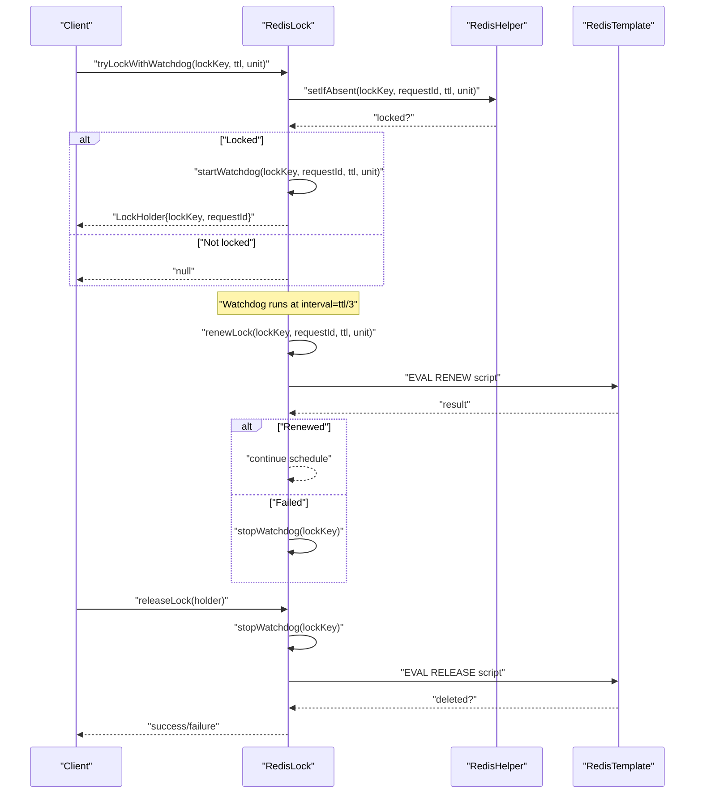
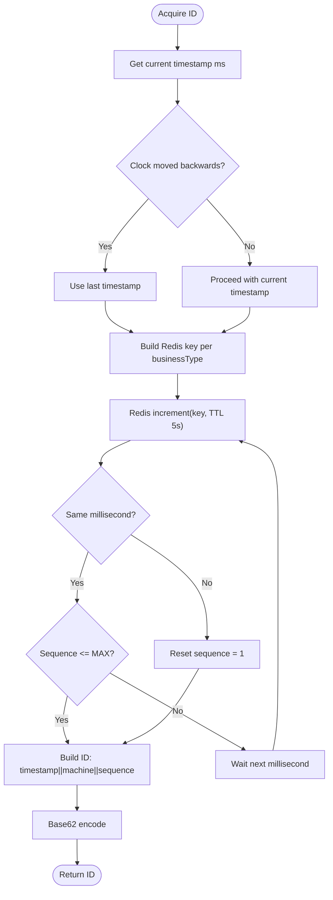
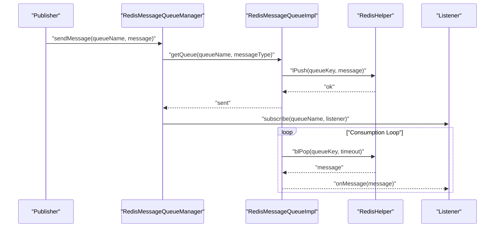
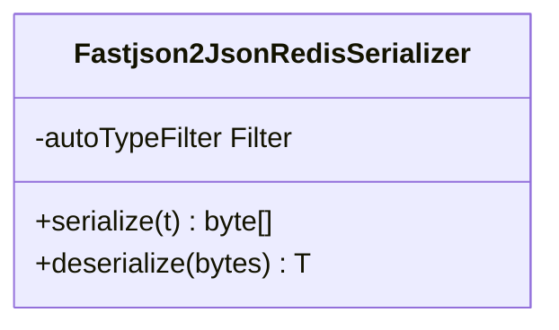
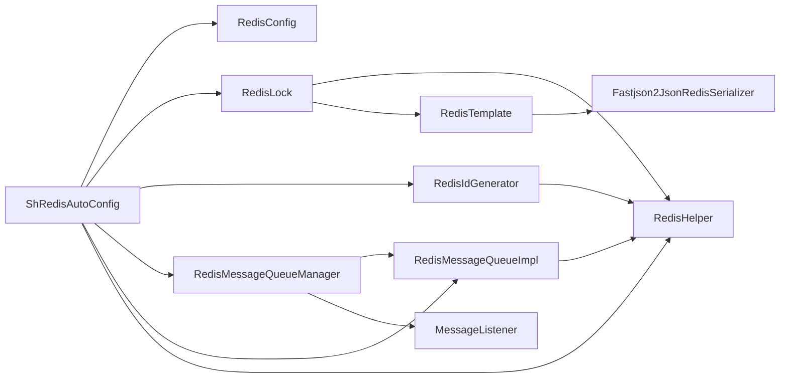

# Redis Integration

<cite>
**Referenced Files in This Document**
- [RedisHelper.java](file://sh-redis/src/main/java/com/wkclz/redis/helper/RedisHelper.java)
- [RedisLock.java](file://sh-redis/src/main/java/com/wkclz/redis/helper/RedisLock.java)
- [LockHolder.java](file://sh-redis/src/main/java/com/wkclz/redis/helper/LockHolder.java)
- [RedisIdGenerator.java](file://sh-redis/src/main/java/com/wkclz/redis/helper/RedisIdGenerator.java)
- [RedisMessageQueue.java](file://sh-redis/src/main/java/com/wkclz/redis/queue/RedisMessageQueue.java)
- [RedisMessageQueueImpl.java](file://sh-redis/src/main/java/com/wkclz/redis/queue/RedisMessageQueueImpl.java)
- [RedisMessageQueueManager.java](file://sh-redis/src/main/java/com/wkclz/redis/queue/RedisMessageQueueManager.java)
- [MessageListener.java](file://sh-redis/src/main/java/com/wkclz/redis/queue/MessageListener.java)
- [Fastjson2JsonRedisSerializer.java](file://sh-redis/src/main/java/com/wkclz/redis/serializer/Fastjson2JsonRedisSerializer.java)
- [RedisConfig.java](file://sh-redis/src/main/java/com/wkclz/redis/config/RedisConfig.java)
- [ShRedisAutoConfig.java](file://sh-redis/src/main/java/com/wkclz/redis/ShRedisAutoConfig.java)
</cite>

## Table of Contents
1. [Introduction](#introduction)
2. [Project Structure](#project-structure)
3. [Core Components](#core-components)
4. [Architecture Overview](#architecture-overview)
5. [Detailed Component Analysis](#detailed-component-analysis)
6. [Dependency Analysis](#dependency-analysis)
7. [Performance Considerations](#performance-considerations)
8. [Troubleshooting Guide](#troubleshooting-guide)
9. [Conclusion](#conclusion)
10. [Appendices](#appendices)

## Introduction
This document provides comprehensive documentation for Redis integration in the framework, covering caching, distributed locking, unique ID generation, and message queue capabilities. It explains the RedisHelper class for cache operations across Redis data types, the RedisLock implementation with automatic expiration and renewal via a watchdog mechanism, the RedisIdGenerator for generating globally unique IDs in multi-node environments, and the RedisMessageQueue pattern for pub/sub-style messaging with persistence and delivery guarantees. It also documents configuration options, connection pooling, serialization strategies, and performance optimization techniques, along with practical examples for real-world usage.

## Project Structure
The Redis integration resides under the sh-redis module and is organized by responsibility:
- helper: Core cache operations (RedisHelper), distributed locking (RedisLock), and ID generation (RedisIdGenerator)
- queue: Message queue interfaces and implementations (RedisMessageQueue, RedisMessageQueueImpl, RedisMessageQueueManager) and listener contract (MessageListener)
- serializer: Security-focused JSON serialization for Redis using fastjson2 with AutoType whitelisting
- config: Redis connection and listener container configuration
- auto-configuration: Spring Boot auto-configuration registration

**Diagram sources**
- [ShRedisAutoConfig.java:1-12](file://sh-redis/src/main/java/com/wkclz/redis/ShRedisAutoConfig.java#L1-L12)
- [RedisHelper.java:1-513](file://sh-redis/src/main/java/com/wkclz/redis/helper/RedisHelper.java#L1-L513)
- [RedisLock.java:1-328](file://sh-redis/src/main/java/com/wkclz/redis/helper/RedisLock.java#L1-L328)
- [LockHolder.java:1-24](file://sh-redis/src/main/java/com/wkclz/redis/helper/LockHolder.java#L1-L24)
- [RedisIdGenerator.java:1-257](file://sh-redis/src/main/java/com/wkclz/redis/helper/RedisIdGenerator.java#L1-L257)
- [RedisMessageQueue.java:1-56](file://sh-redis/src/main/java/com/wkclz/redis/queue/RedisMessageQueue.java#L1-L56)
- [RedisMessageQueueImpl.java:1-121](file://sh-redis/src/main/java/com/wkclz/redis/queue/RedisMessageQueueImpl.java#L1-L121)
- [RedisMessageQueueManager.java:1-162](file://sh-redis/src/main/java/com/wkclz/redis/queue/RedisMessageQueueManager.java#L1-L162)
- [MessageListener.java:1-24](file://sh-redis/src/main/java/com/wkclz/redis/queue/MessageListener.java#L1-L24)
- [Fastjson2JsonRedisSerializer.java:1-82](file://sh-redis/src/main/java/com/wkclz/redis/serializer/Fastjson2JsonRedisSerializer.java#L1-L82)
- [RedisConfig.java:1-41](file://sh-redis/src/main/java/com/wkclz/redis/config/RedisConfig.java#L1-L41)

**Section sources**
- [ShRedisAutoConfig.java:1-12](file://sh-redis/src/main/java/com/wkclz/redis/ShRedisAutoConfig.java#L1-L12)
- [RedisConfig.java:1-41](file://sh-redis/src/main/java/com/wkclz/redis/config/RedisConfig.java#L1-L41)

## Core Components
- RedisHelper: Provides unified cache operations for strings, numbers, hashes, lists, sets, and sorted sets, with atomic set-if-absent, expiration controls, and bulk deletion.
- RedisLock: Implements distributed locking with requestId-based ownership, Lua-scripted atomic release/renewal, and a watchdog that periodically renews locks to prevent premature expiry.
- RedisIdGenerator: Generates unique IDs combining timestamp, machine identifier, and per-millisecond sequence with Redis-backed atomic counters and fallback to local generation when Redis is unavailable.
- RedisMessageQueue: Defines a queue interface and implements it using Redis lists with blocking and non-blocking receive semantics, plus a manager to subscribe and consume messages concurrently.
- Fastjson2JsonRedisSerializer: A secure JSON serializer leveraging fastjson2 with configurable AutoType whitelists to mitigate deserialization risks.
- RedisConfig: Exposes connection parameters and allows extending the AutoType whitelist for business classes.

**Section sources**
- [RedisHelper.java:1-513](file://sh-redis/src/main/java/com/wkclz/redis/helper/RedisHelper.java#L1-L513)
- [RedisLock.java:1-328](file://sh-redis/src/main/java/com/wkclz/redis/helper/RedisLock.java#L1-L328)
- [RedisIdGenerator.java:1-257](file://sh-redis/src/main/java/com/wkclz/redis/helper/RedisIdGenerator.java#L1-L257)
- [RedisMessageQueue.java:1-56](file://sh-redis/src/main/java/com/wkclz/redis/queue/RedisMessageQueue.java#L1-L56)
- [RedisMessageQueueImpl.java:1-121](file://sh-redis/src/main/java/com/wkclz/redis/queue/RedisMessageQueueImpl.java#L1-L121)
- [RedisMessageQueueManager.java:1-162](file://sh-redis/src/main/java/com/wkclz/redis/queue/RedisMessageQueueManager.java#L1-L162)
- [Fastjson2JsonRedisSerializer.java:1-82](file://sh-redis/src/main/java/com/wkclz/redis/serializer/Fastjson2JsonRedisSerializer.java#L1-L82)
- [RedisConfig.java:1-41](file://sh-redis/src/main/java/com/wkclz/redis/config/RedisConfig.java#L1-L41)

## Architecture Overview
The Redis integration follows a layered design:
- Data access layer: RedisHelper encapsulates RedisTemplate/StringRedisTemplate operations.
- Control layer: RedisLock manages distributed locks with watchdog renewal; RedisIdGenerator centralizes ID generation; RedisMessageQueueManager orchestrates message queues.
- Serialization layer: Fastjson2JsonRedisSerializer ensures safe serialization/deserialization with whitelisted AutoType support.
- Configuration layer: RedisConfig exposes connection settings and AutoType whitelist extension; ShRedisAutoConfig registers components automatically.

**Diagram sources**
- [RedisHelper.java:1-513](file://sh-redis/src/main/java/com/wkclz/redis/helper/RedisHelper.java#L1-L513)
- [RedisLock.java:1-328](file://sh-redis/src/main/java/com/wkclz/redis/helper/RedisLock.java#L1-L328)
- [RedisIdGenerator.java:1-257](file://sh-redis/src/main/java/com/wkclz/redis/helper/RedisIdGenerator.java#L1-L257)
- [RedisMessageQueueManager.java:1-162](file://sh-redis/src/main/java/com/wkclz/redis/queue/RedisMessageQueueManager.java#L1-L162)
- [Fastjson2JsonRedisSerializer.java:1-82](file://sh-redis/src/main/java/com/wkclz/redis/serializer/Fastjson2JsonRedisSerializer.java#L1-L82)
- [RedisConfig.java:1-41](file://sh-redis/src/main/java/com/wkclz/redis/config/RedisConfig.java#L1-L41)
- [ShRedisAutoConfig.java:1-12](file://sh-redis/src/main/java/com/wkclz/redis/ShRedisAutoConfig.java#L1-L12)

## Detailed Component Analysis

### RedisHelper: Unified Cache Operations
RedisHelper offers a comprehensive set of cache primitives:
- Value operations: set/get with optional TTL, set-if-absent (atomic NX+EX), increment with optional initial expiry, delete (single/bulk).
- String/Number operations: dedicated APIs for pure strings and numeric values stored as strings.
- Hash operations: put/get/all entries.
- List operations: left/right push/pop, blocking left pop, length, range.
- Set operations: add/members.
- Sorted set operations: add/range with ascending/descending.
- Common utilities: expire, getExpire, hasKey.

Design highlights:
- Uses RedisTemplate for typed objects and StringRedisTemplate for string/number primitives to optimize storage and reduce conversion overhead.
- Wraps exceptions and logs errors, returning safe defaults to prevent cascading failures.
- Exposes atomic operations (e.g., setIfAbsent) to support distributed locking and counters.

Practical usage examples (paths):
- Save with TTL: [RedisHelper.java:56-64](file://sh-redis/src/main/java/com/wkclz/redis/helper/RedisHelper.java#L56-L64)
- Increment with expiry: [RedisHelper.java:203-214](file://sh-redis/src/main/java/com/wkclz/redis/helper/RedisHelper.java#L203-L214)
- Blocking pop: [RedisHelper.java:345-352](file://sh-redis/src/main/java/com/wkclz/redis/helper/RedisHelper.java#L345-L352)

**Section sources**
- [RedisHelper.java:1-513](file://sh-redis/src/main/java/com/wkclz/redis/helper/RedisHelper.java#L1-L513)

### RedisLock: Distributed Locking with Watchdog Renewal
RedisLock implements a robust distributed lock with:
- Unique request identifiers per acquisition to ensure only the lock holder can release it.
- Atomic release using Lua script to avoid race conditions.
- Automatic renewal via a single-threaded watchdog scheduled at one-third of the lock duration.
- Retry acquisition with backoff and interrupt-safe sleep.

Key behaviors:
- tryLock: One-shot acquisition using set-if-absent with TTL.
- tryLockWithWatchdog: Starts a watchdog task upon successful acquisition.
- releaseLock: Stops watchdog and executes atomic Lua-based release.
- tryLockWithRetry: Repeated attempts with delay and interruption handling.

**Diagram sources**
- [RedisLock.java:166-216](file://sh-redis/src/main/java/com/wkclz/redis/helper/RedisLock.java#L166-L216)
- [RedisLock.java:100-117](file://sh-redis/src/main/java/com/wkclz/redis/helper/RedisLock.java#L100-L117)
- [RedisLock.java:139-156](file://sh-redis/src/main/java/com/wkclz/redis/helper/RedisLock.java#L139-L156)
- [RedisLock.java:225-262](file://sh-redis/src/main/java/com/wkclz/redis/helper/RedisLock.java#L225-L262)
- [RedisHelper.java:76-84](file://sh-redis/src/main/java/com/wkclz/redis/helper/RedisHelper.java#L76-L84)

**Section sources**
- [RedisLock.java:1-328](file://sh-redis/src/main/java/com/wkclz/redis/helper/RedisLock.java#L1-L328)
- [LockHolder.java:1-24](file://sh-redis/src/main/java/com/wkclz/redis/helper/LockHolder.java#L1-L24)

### RedisIdGenerator: Unique ID Generation
RedisIdGenerator produces unique IDs with:
- Timestamp-based ordering with a base epoch to keep IDs short.
- Per-millisecond sequence generated via Redis atomic increment with short TTL to avoid collisions.
- Machine identifier derived from IP or secure random fallback.
- Base62 encoding to produce compact strings.
- Fallback to local generation when Redis is unavailable, preserving monotonicity within a millisecond window.

**Diagram sources**
- [RedisIdGenerator.java:98-163](file://sh-redis/src/main/java/com/wkclz/redis/helper/RedisIdGenerator.java#L98-L163)
- [RedisIdGenerator.java:171-207](file://sh-redis/src/main/java/com/wkclz/redis/helper/RedisIdGenerator.java#L171-L207)

**Section sources**
- [RedisIdGenerator.java:1-257](file://sh-redis/src/main/java/com/wkclz/redis/helper/RedisIdGenerator.java#L1-L257)

### RedisMessageQueue: Pub/Sub Messaging with Persistence
The message queue pattern leverages Redis lists for persistence and delivery guarantees:
- Interface defines send/receive (blocking/non-blocking/with timeout), count, and clear.
- Implementation stores messages as list elements using LPUSH and retrieves via LPOP/BLPOP.
- Manager coordinates multiple queues, maintains listeners, and consumes messages asynchronously using a bounded thread pool.

**Diagram sources**
- [RedisMessageQueue.java:10-56](file://sh-redis/src/main/java/com/wkclz/redis/queue/RedisMessageQueue.java#L10-L56)
- [RedisMessageQueueImpl.java:50-99](file://sh-redis/src/main/java/com/wkclz/redis/queue/RedisMessageQueueImpl.java#L50-L99)
- [RedisMessageQueueManager.java:72-161](file://sh-redis/src/main/java/com/wkclz/redis/queue/RedisMessageQueueManager.java#L72-L161)

**Section sources**
- [RedisMessageQueue.java:1-56](file://sh-redis/src/main/java/com/wkclz/redis/queue/RedisMessageQueue.java#L1-L56)
- [RedisMessageQueueImpl.java:1-121](file://sh-redis/src/main/java/com/wkclz/redis/queue/RedisMessageQueueImpl.java#L1-L121)
- [RedisMessageQueueManager.java:1-162](file://sh-redis/src/main/java/com/wkclz/redis/queue/RedisMessageQueueManager.java#L1-L162)
- [MessageListener.java:1-24](file://sh-redis/src/main/java/com/wkclz/redis/queue/MessageListener.java#L1-L24)

### Serialization Strategy: Fastjson2 with AutoType Whitelist
Security-first JSON serialization:
- Uses fastjson2 with JSONWriter Feature WriteClassName to preserve type metadata.
- Applies JSONReader.autoTypeFilter with a default whitelist of framework/business and standard library packages.
- Allows extending the whitelist via configuration to support business domain classes safely.

**Diagram sources**
- [Fastjson2JsonRedisSerializer.java:25-82](file://sh-redis/src/main/java/com/wkclz/redis/serializer/Fastjson2JsonRedisSerializer.java#L25-L82)

**Section sources**
- [Fastjson2JsonRedisSerializer.java:1-82](file://sh-redis/src/main/java/com/wkclz/redis/serializer/Fastjson2JsonRedisSerializer.java#L1-L82)
- [RedisConfig.java:30-31](file://sh-redis/src/main/java/com/wkclz/redis/config/RedisConfig.java#L30-L31)

## Dependency Analysis
- RedisLock depends on RedisHelper for atomic set-if-absent and on RedisTemplate for Lua scripts.
- RedisIdGenerator depends on RedisHelper for atomic increment and number storage.
- RedisMessageQueueImpl depends on RedisHelper for list operations.
- RedisMessageQueueManager depends on RedisMessageQueueImpl and MessageListener for consumption orchestration.
- Serializer integrates with RedisTemplate to enforce safe AutoType filtering.
- Configuration beans are registered via ShRedisAutoConfig.

**Diagram sources**
- [RedisLock.java:25-28](file://sh-redis/src/main/java/com/wkclz/redis/helper/RedisLock.java#L25-L28)
- [RedisIdGenerator.java:28-32](file://sh-redis/src/main/java/com/wkclz/redis/helper/RedisIdGenerator.java#L28-L32)
- [RedisMessageQueueImpl.java:18-19](file://sh-redis/src/main/java/com/wkclz/redis/queue/RedisMessageQueueImpl.java#L18-L19)
- [RedisMessageQueueManager.java:23-24](file://sh-redis/src/main/java/com/wkclz/redis/queue/RedisMessageQueueManager.java#L23-L24)
- [Fastjson2JsonRedisSerializer.java:25](file://sh-redis/src/main/java/com/wkclz/redis/serializer/Fastjson2JsonRedisSerializer.java#L25)
- [ShRedisAutoConfig.java:6-8](file://sh-redis/src/main/java/com/wkclz/redis/ShRedisAutoConfig.java#L6-L8)
- [RedisConfig.java:33-38](file://sh-redis/src/main/java/com/wkclz/redis/config/RedisConfig.java#L33-L38)

**Section sources**
- [RedisLock.java:1-328](file://sh-redis/src/main/java/com/wkclz/redis/helper/RedisLock.java#L1-L328)
- [RedisIdGenerator.java:1-257](file://sh-redis/src/main/java/com/wkclz/redis/helper/RedisIdGenerator.java#L1-L257)
- [RedisMessageQueueImpl.java:1-121](file://sh-redis/src/main/java/com/wkclz/redis/queue/RedisMessageQueueImpl.java#L1-L121)
- [RedisMessageQueueManager.java:1-162](file://sh-redis/src/main/java/com/wkclz/redis/queue/RedisMessageQueueManager.java#L1-L162)
- [Fastjson2JsonRedisSerializer.java:1-82](file://sh-redis/src/main/java/com/wkclz/redis/serializer/Fastjson2JsonRedisSerializer.java#L1-L82)
- [ShRedisAutoConfig.java:1-12](file://sh-redis/src/main/java/com/wkclz/redis/ShRedisAutoConfig.java#L1-L12)
- [RedisConfig.java:1-41](file://sh-redis/src/main/java/com/wkclz/redis/config/RedisConfig.java#L1-L41)

## Performance Considerations
- Prefer StringRedisTemplate for string/number primitives to minimize serialization overhead.
- Use setIfAbsent with TTL for atomic initialization patterns to avoid race conditions.
- Leverage blocking list operations (BLPOP) to reduce CPU spin-waiting in consumers.
- Keep watchdog intervals conservative (lock TTL/3) to balance safety and CPU usage.
- Limit AutoType whitelist to necessary packages to reduce deserialization cost and risk.
- Use bounded thread pools for message consumption to cap resource usage.
- Apply short TTLs for ephemeral counters (e.g., ID generator sequence) to prevent accumulation.

[No sources needed since this section provides general guidance]

## Troubleshooting Guide
Common issues and resolutions:
- Lock release fails silently: Verify requestId matches the lock owner; ensure Lua scripts are loaded and Redis connectivity is stable.
- Watchdog stops renewing: Check for exceptions during renewal and confirm the single-threaded watchdog executor is alive.
- ID generation stalls: Inspect Redis availability and TTL settings for the sequence key; fallback to local generation is automatic but may impact monotonicity.
- Message consumption backlog: Increase consumer threads cautiously and tune queue polling timeouts; monitor thread pool rejection policy.
- Serialization errors: Confirm the AutoType whitelist includes business classes; avoid unknown @type payloads.

**Section sources**
- [RedisLock.java:104-117](file://sh-redis/src/main/java/com/wkclz/redis/helper/RedisLock.java#L104-L117)
- [RedisLock.java:140-156](file://sh-redis/src/main/java/com/wkclz/redis/helper/RedisLock.java#L140-L156)
- [RedisIdGenerator.java:158-163](file://sh-redis/src/main/java/com/wkclz/redis/helper/RedisIdGenerator.java#L158-L163)
- [RedisMessageQueueManager.java:135-161](file://sh-redis/src/main/java/com/wkclz/redis/queue/RedisMessageQueueManager.java#L135-L161)
- [Fastjson2JsonRedisSerializer.java:57-80](file://sh-redis/src/main/java/com/wkclz/redis/serializer/Fastjson2JsonRedisSerializer.java#L57-L80)

## Conclusion
The Redis integration delivers a production-ready foundation for caching, distributed locking, unique ID generation, and message queuing. By combining atomic operations, Lua scripting, watchdog renewal, and secure serialization, it balances correctness, performance, and safety. Proper configuration and operational awareness enable scalable, resilient systems across multi-node deployments.

[No sources needed since this section summarizes without analyzing specific files]

## Appendices

### Configuration Options
- Connection: host, port, password, database
- AutoType whitelist extension: list of package prefixes to allow for deserialization
- Listener container: configured via RedisMessageListenerContainer bean

**Section sources**
- [RedisConfig.java:16-31](file://sh-redis/src/main/java/com/wkclz/redis/config/RedisConfig.java#L16-L31)
- [RedisConfig.java:33-38](file://sh-redis/src/main/java/com/wkclz/redis/config/RedisConfig.java#L33-L38)

### Practical Usage Examples (Paths)
- Caching with TTL and atomic set-if-absent:
  - [RedisHelper.java:56-64](file://sh-redis/src/main/java/com/wkclz/redis/helper/RedisHelper.java#L56-L64)
  - [RedisHelper.java:76-84](file://sh-redis/src/main/java/com/wkclz/redis/helper/RedisHelper.java#L76-L84)
- Distributed lock with watchdog:
  - [RedisLock.java:195-216](file://sh-redis/src/main/java/com/wkclz/redis/helper/RedisLock.java#L195-L216)
  - [RedisLock.java:225-262](file://sh-redis/src/main/java/com/wkclz/redis/helper/RedisLock.java#L225-L262)
- ID generation with Redis-backed sequence:
  - [RedisIdGenerator.java:98-163](file://sh-redis/src/main/java/com/wkclz/redis/helper/RedisIdGenerator.java#L98-L163)
- Message queue publish/consume:
  - [RedisMessageQueueImpl.java:50-99](file://sh-redis/src/main/java/com/wkclz/redis/queue/RedisMessageQueueImpl.java#L50-L99)
  - [RedisMessageQueueManager.java:72-161](file://sh-redis/src/main/java/com/wkclz/redis/queue/RedisMessageQueueManager.java#L72-L161)