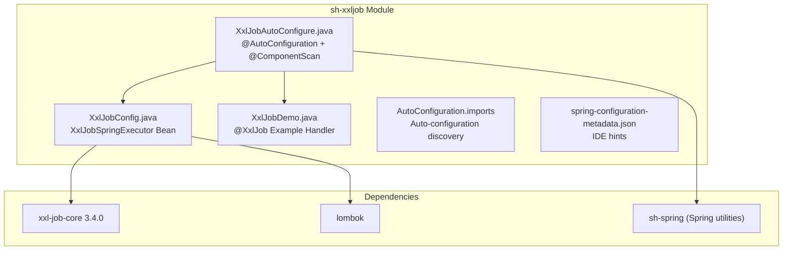
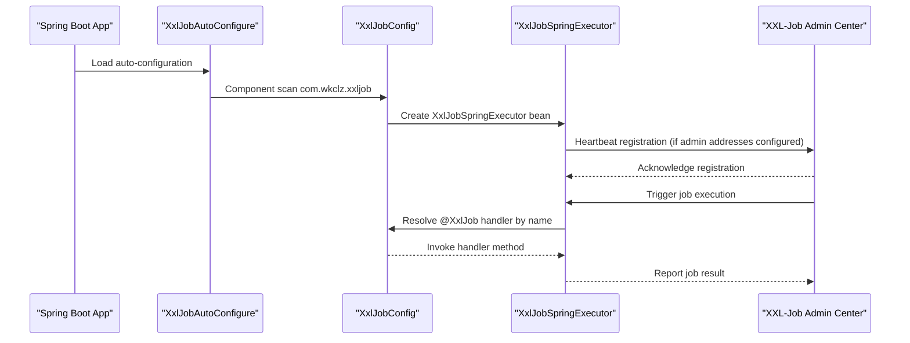
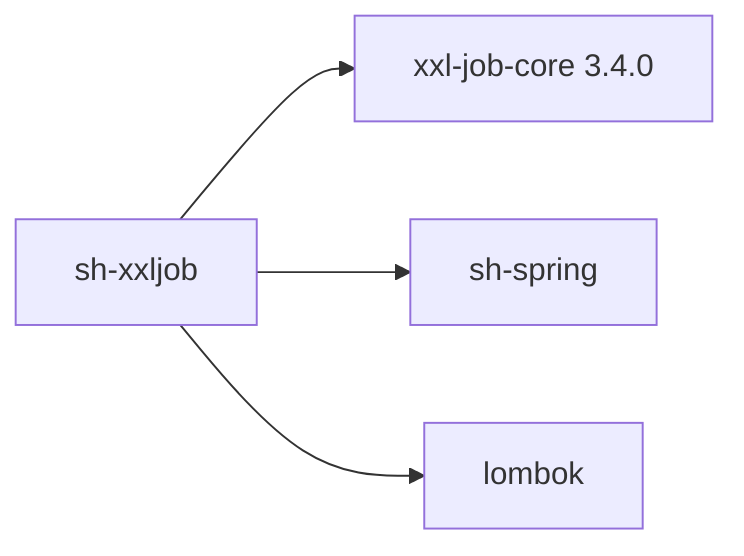

# XXL-Job Integration

<cite>
**Referenced Files in This Document**
- [XxlJobAutoConfigure.java](file://sh-xxljob/src/main/java/com/wkclz/xxljob/XxlJobAutoConfigure.java)
- [XxlJobConfig.java](file://sh-xxljob/src/main/java/com/wkclz/xxljob/config/XxlJobConfig.java)
- [XxlJobDemo.java](file://sh-xxljob/src/main/java/com/wkclz/xxljob/demo/XxlJobDemo.java)
- [org.springframework.boot.autoconfigure.AutoConfiguration.imports](file://sh-xxljob/src/main/resources/META-INF/spring/org.springframework.boot.autoconfigure.AutoConfiguration.imports)
- [spring-configuration-metadata.json](file://sh-xxljob/src/main/resources/META-INF/spring-configuration-metadata.json)
- [sh-xxljob SKILL.md](file://.agents/skills/sh-xxljob/SKILL.md)
- [US-026-XXL-Job定时任务集成.md](file://docs/stories/US-026-XXL-Job定时任务集成.md)
- [pom.xml](file://sh-xxljob/pom.xml)
- [sh-bom pom.xml](file://sh-bom/pom.xml)
- [application.yml](file://sh-demo/src/main/resources/config/application.yml)
- [DemoApplication.java](file://sh-demo/src/main/java/com/wkclz/demo/DemoApplication.java)
</cite>

## Table of Contents
1. [Introduction](#introduction)
2. [Project Structure](#project-structure)
3. [Core Components](#core-components)
4. [Architecture Overview](#architecture-overview)
5. [Detailed Component Analysis](#detailed-component-analysis)
6. [Dependency Analysis](#dependency-analysis)
7. [Performance Considerations](#performance-considerations)
8. [Troubleshooting Guide](#troubleshooting-guide)
9. [Conclusion](#conclusion)
10. [Appendices](#appendices)

## Introduction
This document provides comprehensive documentation for the XXL-Job integration within the sh-framework. It explains how the framework enables Spring Boot applications to act as XXL-Job executors with minimal configuration, covering auto-configuration, scheduler settings, job registration patterns, trigger configurations, execution strategies, and operational monitoring. It also documents the demo implementation and provides guidance for production-grade deployment, including distributed coordination, failover, load balancing, and performance optimization.

## Project Structure
The XXL-Job integration is encapsulated in the sh-xxljob module, which provides:
- Auto-configuration entry point
- Executor configuration bean
- Example job handler
- Spring Boot auto-configuration metadata

**Diagram sources**
- [XxlJobAutoConfigure.java:1-12](file://sh-xxljob/src/main/java/com/wkclz/xxljob/XxlJobAutoConfigure.java#L1-L12)
- [XxlJobConfig.java:1-68](file://sh-xxljob/src/main/java/com/wkclz/xxljob/config/XxlJobConfig.java#L1-L68)
- [XxlJobDemo.java:1-14](file://sh-xxljob/src/main/java/com/wkclz/xxljob/demo/XxlJobDemo.java#L1-L14)
- [org.springframework.boot.autoconfigure.AutoConfiguration.imports:1-1](file://sh-xxljob/src/main/resources/META-INF/spring/org.springframework.boot.autoconfigure.AutoConfiguration.imports#L1-L1)
- [spring-configuration-metadata.json:1-4](file://sh-xxljob/src/main/resources/META-INF/spring-configuration-metadata.json#L1-L4)
- [pom.xml:21-40](file://sh-xxljob/pom.xml#L21-L40)
- [sh-bom pom.xml:30-30](file://sh-bom/pom.xml#L30-L30)

**Section sources**
- [XxlJobAutoConfigure.java:1-12](file://sh-xxljob/src/main/java/com/wkclz/xxljob/XxlJobAutoConfigure.java#L1-L12)
- [XxlJobConfig.java:1-68](file://sh-xxljob/src/main/java/com/wkclz/xxljob/config/XxlJobConfig.java#L1-L68)
- [XxlJobDemo.java:1-14](file://sh-xxljob/src/main/java/com/wkclz/xxljob/demo/XxlJobDemo.java#L1-L14)
- [org.springframework.boot.autoconfigure.AutoConfiguration.imports:1-1](file://sh-xxljob/src/main/resources/META-INF/spring/org.springframework.boot.autoconfigure.AutoConfiguration.imports#L1-L1)
- [spring-configuration-metadata.json:1-4](file://sh-xxljob/src/main/resources/META-INF/spring-configuration-metadata.json#L1-L4)
- [pom.xml:21-40](file://sh-xxljob/pom.xml#L21-L40)
- [sh-bom pom.xml:30-30](file://sh-bom/pom.xml#L30-L30)

## Core Components
- XxlJobAutoConfigure: Provides Spring Boot auto-configuration discovery and component scanning for the XXL-Job integration package.
- XxlJobConfig: Defines the XxlJobSpringExecutor bean and exposes configuration properties for connecting to the XXL-Job admin center and executor runtime settings.
- XxlJobDemo: Demonstrates a minimal job handler using the @XxlJob annotation.

Key responsibilities:
- Auto-configuration discovery via Spring Boot’s META-INF metadata.
- Centralized executor configuration with sensible defaults.
- Minimal developer friction for registering job handlers.

**Section sources**
- [XxlJobAutoConfigure.java:1-12](file://sh-xxljob/src/main/java/com/wkclz/xxljob/XxlJobAutoConfigure.java#L1-L12)
- [XxlJobConfig.java:1-68](file://sh-xxljob/src/main/java/com/wkclz/xxljob/config/XxlJobConfig.java#L1-L68)
- [XxlJobDemo.java:1-14](file://sh-xxljob/src/main/java/com/wkclz/xxljob/demo/XxlJobDemo.java#L1-L14)

## Architecture Overview
The integration follows Spring Boot’s auto-configuration pattern. On application startup, Spring loads the auto-configuration class, scans the package for components, registers the executor bean, and attempts to register the executor with the XXL-Job admin center.

**Diagram sources**
- [XxlJobAutoConfigure.java:1-12](file://sh-xxljob/src/main/java/com/wkclz/xxljob/XxlJobAutoConfigure.java#L1-L12)
- [XxlJobConfig.java:52-66](file://sh-xxljob/src/main/java/com/wkclz/xxljob/config/XxlJobConfig.java#L52-L66)
- [org.springframework.boot.autoconfigure.AutoConfiguration.imports:1-1](file://sh-xxljob/src/main/resources/META-INF/spring/org.springframework.boot.autoconfigure.AutoConfiguration.imports#L1-L1)

## Detailed Component Analysis

### XxlJobAutoConfigure
- Purpose: Declares the module’s auto-configuration and enables component scanning for the integration package.
- Behavior: Uses @AutoConfiguration and @ComponentScan to expose beans and enable job handler discovery.

Operational notes:
- Scans the com.wkclz.xxljob package for components.
- Works seamlessly with Spring Boot’s auto-configuration discovery mechanism.

**Section sources**
- [XxlJobAutoConfigure.java:1-12](file://sh-xxljob/src/main/java/com/wkclz/xxljob/XxlJobAutoConfigure.java#L1-L12)
- [org.springframework.boot.autoconfigure.AutoConfiguration.imports:1-1](file://sh-xxljob/src/main/resources/META-INF/spring/org.springframework.boot.autoconfigure.AutoConfiguration.imports#L1-L1)

### XxlJobConfig (Scheduler Settings)
- Purpose: Creates and configures the XxlJobSpringExecutor bean with properties for admin connectivity, executor identity, network binding, logging, and timeouts.
- Configuration properties:
  - xxl.job.admin.addresses: Admin center endpoints (comma-separated for clustering).
  - xxl.job.admin.accessToken: Optional token for admin communication.
  - xxl.job.admin.timeout: Communication timeout in seconds.
  - xxl.job.executor.appname: Executor group name; defaults to spring.application.name.
  - xxl.job.executor.address: Preferred registration address (useful for containerized environments).
  - xxl.job.executor.ip: Specific IP for executor communication.
  - xxl.job.executor.port: Executor port; default 9999.
  - xxl.job.executor.logpath: Log storage path.
  - xxl.job.executor.logretentiondays: Log retention days; >=3 enabled, -1 disables cleanup.

Executor lifecycle:
- Bean creation sets all configured properties on the XxlJobSpringExecutor.
- Registration to admin occurs automatically if admin addresses are provided.

**Section sources**
- [XxlJobConfig.java:1-68](file://sh-xxljob/src/main/java/com/wkclz/xxljob/config/XxlJobConfig.java#L1-L68)
- [spring-configuration-metadata.json:1-4](file://sh-xxljob/src/main/resources/META-INF/spring-configuration-metadata.json#L1-L4)

### Job Registration Patterns and Execution Strategies
- Job registration: Handlers are registered automatically when annotated with @XxlJob and reside in the scanned package.
- Execution strategy: The executor receives triggers from the admin center, resolves the handler by name, executes the method, logs progress, and reports results.

```mermaid
flowchart TD
Start(["Job Trigger"]) --> Resolve["Resolve @XxlJob Handler by Name"]
Resolve --> Found{"Handler Found?"}
Found --> |Yes| Execute["Execute Handler Method"]
Found --> |No| Fail["Report Handler Not Found"]
Execute --> Log["Write Logs via XxlJobHelper.log"]
Log --> Result["Return Execution Result"]
Result --> End(["Complete"])
Fail --> End
```

**Diagram sources**
- [XxlJobDemo.java:1-14](file://sh-xxljob/src/main/java/com/wkclz/xxljob/demo/XxlJobDemo.java#L1-L14)
- [XxlJobConfig.java:52-66](file://sh-xxljob/src/main/java/com/wkclz/xxljob/config/XxlJobConfig.java#L52-L66)

**Section sources**
- [XxlJobDemo.java:1-14](file://sh-xxljob/src/main/java/com/wkclz/xxljob/demo/XxlJobDemo.java#L1-L14)
- [XxlJobConfig.java:52-66](file://sh-xxljob/src/main/java/com/wkclz/xxljob/config/XxlJobConfig.java#L52-L66)

### Demo Implementation
- The demo handler demonstrates a minimal job using @XxlJob and XxlJobHelper.log for logging.
- It illustrates the simplest way to define a job handler that integrates with the XXL-Job admin center.

Practical guidance:
- Use handler names that match the job configuration in the admin center.
- Prefer explicit return values for richer result reporting when needed.

**Section sources**
- [XxlJobDemo.java:1-14](file://sh-xxljob/src/main/java/com/wkclz/xxljob/demo/XxlJobDemo.java#L1-L14)

### Distributed Coordination, Failover, and Load Balancing
- Coordinator: XXL-Job Admin Center manages scheduling and dispatch.
- Failover: If an executor becomes unavailable, the admin center can route subsequent executions to healthy instances based on appname grouping.
- Load balancing: Multiple executors with the same appname can share the workload; the admin center distributes jobs among available instances.

Operational recommendations:
- Use distinct appnames for different logical groups.
- Configure multiple executors behind a load balancer for high availability.
- Monitor executor health and adjust log retention and timeouts accordingly.

**Section sources**
- [XxlJobConfig.java:16-30](file://sh-xxljob/src/main/java/com/wkclz/xxljob/config/XxlJobConfig.java#L16-L30)
- [US-026-XXL-Job定时任务集成.md:1-40](file://docs/stories/US-026-XXL-Job定时任务集成.md#L1-L40)

### Configuration Options and Monitoring Integration
- Admin connectivity: Configure admin addresses and optional access tokens and timeouts.
- Executor identity: Appname, address, IP, and port define executor registration and discovery.
- Logging: Log path and retention days control disk usage and retention.
- Monitoring: Use XxlJobHelper.log to emit structured logs visible in the admin center.

Best practices:
- Keep admin addresses up to date for cluster deployments.
- Align log retention with compliance and storage capacity.
- Use appname to segment workloads and simplify monitoring.

**Section sources**
- [XxlJobConfig.java:16-50](file://sh-xxljob/src/main/java/com/wkclz/xxljob/config/XxlJobConfig.java#L16-L50)
- [XxlJobDemo.java:10-12](file://sh-xxljob/src/main/java/com/wkclz/xxljob/demo/XxlJobDemo.java#L10-L12)

### Examples: Cron-Based Schedules, Event-Triggered Jobs, and Workflow Orchestration
- Cron-based schedules: Define cron expressions in the XXL-Job admin center; the executor runs according to the schedule.
- Event-triggered jobs: Use the admin center to trigger jobs manually or via external integrations.
- Workflow orchestration: Chain multiple jobs by configuring dependencies and sequential execution in the admin center; each job can report results and errors.

Note: The demo module focuses on a basic handler; orchestration is managed by the admin center configuration.

**Section sources**
- [XxlJobDemo.java:1-14](file://sh-xxljob/src/main/java/com/wkclz/xxljob/demo/XxlJobDemo.java#L1-L14)
- [US-026-XXL-Job定时任务集成.md:1-40](file://docs/stories/US-026-XXL-Job定时任务集成.md#L1-L40)

## Dependency Analysis
The sh-xxljob module depends on:
- xxl-job-core: Provides the core executor and job execution infrastructure.
- sh-spring: Supplies Spring utilities used by the module.
- Lombok: Reduces boilerplate in configuration classes.

**Diagram sources**
- [pom.xml:21-40](file://sh-xxljob/pom.xml#L21-L40)
- [sh-bom pom.xml:30-30](file://sh-bom/pom.xml#L30-L30)

**Section sources**
- [pom.xml:21-40](file://sh-xxljob/pom.xml#L21-L40)
- [sh-bom pom.xml:30-30](file://sh-bom/pom.xml#L30-L30)

## Performance Considerations
- Executor port management: Ensure unique ports for multiple executors on the same host.
- Log path permissions: Ensure the executor process has write access to the configured log path.
- Timeout tuning: Adjust admin timeout based on network conditions and admin center responsiveness.
- Log retention: Balance storage costs and audit requirements with log retention days.
- Resource allocation: Size JVM and container resources according to job complexity and concurrency.

[No sources needed since this section provides general guidance]

## Troubleshooting Guide
Common scenarios and resolutions:
- Admin addresses not configured: The executor initializes without registering to the admin center, but the application still starts successfully.
- Handler not found: Verify the @XxlJob handler name matches the job configuration in the admin center.
- Port conflicts: Change the executor port for multiple instances on the same machine.
- Log path issues: Confirm the path exists and is writable by the executor process.

Validation criteria:
- Application startup completes successfully.
- Executor registers with the admin center when addresses are configured.
- Jobs execute and log messages appear in the admin center.

**Section sources**
- [US-026-XXL-Job定时任务集成.md:36-40](file://docs/stories/US-026-XXL-Job定时任务集成.md#L36-L40)
- [XxlJobConfig.java:16-50](file://sh-xxljob/src/main/java/com/wkclz/xxljob/config/XxlJobConfig.java#L16-L50)

## Conclusion
The sh-xxljob module delivers a streamlined, production-ready integration of XXL-Job executors into Spring Boot applications. With minimal configuration, developers can register job handlers, leverage distributed scheduling, and monitor execution outcomes through the admin center. The module’s auto-configuration, centralized executor settings, and example handler provide a solid foundation for building robust, scalable task automation systems.

[No sources needed since this section summarizes without analyzing specific files]

## Appendices

### Configuration Reference
- xxl.job.admin.addresses: Admin center endpoints (comma-separated).
- xxl.job.admin.accessToken: Optional admin communication token.
- xxl.job.admin.timeout: Communication timeout in seconds.
- xxl.job.executor.appname: Executor group name; defaults to spring.application.name.
- xxl.job.executor.address: Preferred registration address.
- xxl.job.executor.ip: Specific IP for executor communication.
- xxl.job.executor.port: Executor port; default 9999.
- xxl.job.executor.logpath: Log storage path.
- xxl.job.executor.logretentiondays: Log retention days.

**Section sources**
- [XxlJobConfig.java:16-50](file://sh-xxljob/src/main/java/com/wkclz/xxljob/config/XxlJobConfig.java#L16-L50)

### Demo Application Context
- The demo application showcases the integration within a typical Spring Boot setup, demonstrating how the XXL-Job executor can coexist with other framework modules.

**Section sources**
- [application.yml:1-26](file://sh-demo/src/main/resources/config/application.yml#L1-L26)
- [DemoApplication.java:1-15](file://sh-demo/src/main/java/com/wkclz/demo/DemoApplication.java#L1-L15)