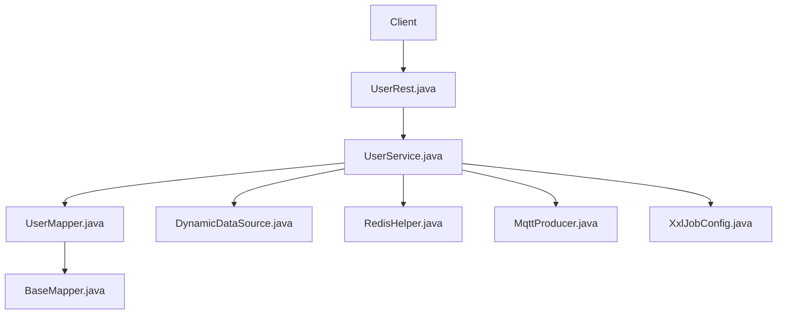
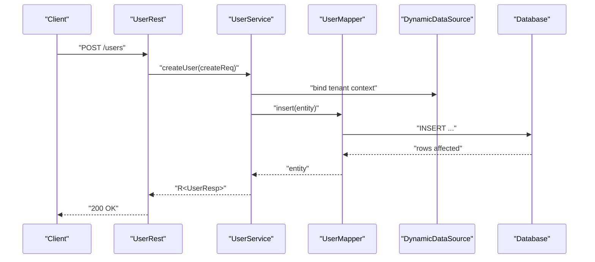
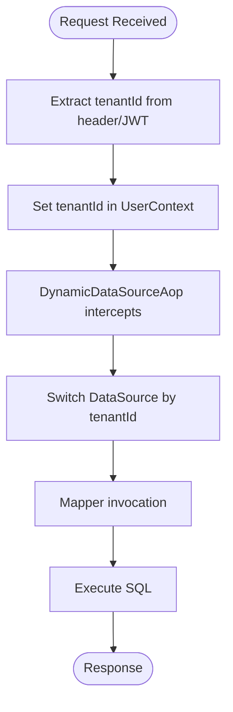
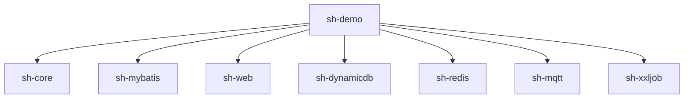

# Integration Examples

<cite>
**Referenced Files in This Document**
- [README.md](file://README.md)
- [DemoApplication.java](file://sh-demo/src/main/java/com/wkclz/demo/DemoApplication.java)
- [application.yml](file://sh-demo/src/main/resources/config/application.yml)
- [User.java](file://sh-demo/src/main/java/com/wkclz/demo/bean/entity/User.java)
- [UserCreateReq.java](file://sh-demo/src/main/java/com/wkclz/demo/bean/vo/user/UserCreateReq.java)
- [UserUpdateReq.java](file://sh-demo/src/main/java/com/wkclz/demo/bean/vo/user/UserUpdateReq.java)
- [UserPageReq.java](file://sh-demo/src/main/java/com/wkclz/demo/bean/vo/user/UserPageReq.java)
- [UserResp.java](file://sh-demo/src/main/java/com/wkclz/demo/bean/vo/user/UserResp.java)
- [UserPageResp.java](file://sh-demo/src/main/java/com/wkclz/demo/bean/vo/user/UserPageResp.java)
- [UserMapper.java](file://sh-demo/src/main/java/com/wkclz/demo/mapper/UserMapper.java)
- [UserRest.java](file://sh-demo/src/main/java/com/wkclz/demo/rest/UserRest.java)
- [UserService.java](file://sh-demo/src/main/java/com/wkclz/demo/service/UserService.java)
- [Route.java](file://sh-demo/src/main/java/com/wkclz/demo/rest/Route.java)
- [BaseEntity.java](file://sh-core/src/main/java/com/wkclz/core/base/BaseEntity.java)
- [R.java](file://sh-core/src/main/java/com/wkclz/core/base/R.java)
- [UserInfo.java](file://sh-core/src/main/java/com/wkclz/core/base/UserInfo.java)
- [UserContext.java](file://sh-core/src/main/java/com/wkclz/core/user/UserContext.java)
- [ApiDesc.java](file://sh-core/src/main/java/com/wkclz/core/annotation/ApiDesc.java)
- [Desc.java](file://sh-core/src/main/java/com/wkclz/core/annotation/Desc.java)
- [FieldDesc.java](file://sh-core/src/main/java/com/wkclz/core/annotation/FieldDesc.java)
- [Router.java](file://sh-core/src/main/java/com/wkclz/core/annotation/Router.java)
- [ResultCode.java](file://sh-core/src/main/java/com/wkclz/core/enums/ResultCode.java)
- [ApiException.java](file://sh-core/src/main/java/com/wkclz/core/exception/ApiException.java)
- [ApplicationException.java](file://sh-core/src/main/java/com/wkclz/core/exception/ApplicationException.java)
- [CommonException.java](file://sh-core/src/main/java/com/wkclz/core/exception/CommonException.java)
- [NotFoundException.java](file://sh-core/src/main/java/com/wkclz/core/exception/NotFoundException.java)
- [SystemException.java](file://sh-core/src/main/java/com/wkclz/core/exception/SystemException.java)
- [UnauthorizedException.java](file://sh-core/src/main/java/com/wkclz/core/exception/UnauthorizedException.java)
- [ValidationException.java](file://sh-core/src/main/java/com/wkclz/core/exception/ValidationException.java)
- [BaseMapper.java](file://sh-mybatis/src/main/java/com/wkclz/mybatis/mapper/BaseMapper.java)
- [TableInfoMapper.java](file://sh-mybatis/src/main/java/com/wkclz/mybatis/mapper/TableInfoMapper.java)
- [ShMyBatisConfig.java](file://sh-mybatis/src/main/java/com/wkclz/mybatis/config/ShMyBatisConfig.java)
- [ShMyBatisAutoConfig.java](file://sh-mybatis/src/main/java/com/wkclz/mybatis/ShMyBatisAutoConfig.java)
- [PageQuery.java](file://sh-mybatis/src/main/java/com/wkclz/mybatis/helper/PageQuery.java)
- [PageData.java](file://sh-core/src/main/java/com/wkclz/core/base/PageData.java)
- [Pageable.java](file://sh-core/src/main/java/com/wkclz/core/base/Pageable.java)
- [DynamicDataSourceAutoConfig.java](file://sh-dynamicdb/src/main/java/com/wkclz/dynamicdb/config/DynamicDataSourceAutoConfig.java)
- [DynamicDataSourceConfig.java](file://sh-dynamicdb/src/main/java/com/wkclz/dynamicdb/config/DynamicDataSourceConfig.java)
- [DynamicDataSource.java](file://sh-dynamicdb/src/main/java/com/wkclz/dynamicdb/DynamicDataSource.java)
- [DynamicDataSourceAop.java](file://sh-dynamicdb/src/main/java/com/wkclz/dynamicdb/aop/DynamicDataSourceAop.java)
- [DefaultDataSourceConfig.java](file://sh-dynamicdb/src/main/java/com/wkclz/dynamicdb/bean/DefaultDataSourceConfig.java)
- [ShDynamicdbAutoConfig.java](file://sh-dynamicdb/src/main/java/com/wkclz/dynamicdb/ShDynamicdbAutoConfig.java)
- [RedisConfig.java](file://sh-redis/src/main/java/com/wkclz/redis/config/RedisConfig.java)
- [RedisTemplateConfig.java](file://sh-redis/src/main/java/com/wkclz/redis/config/RedisTemplateConfig.java)
- [RedisHelper.java](file://sh-redis/src/main/java/com/wkclz/redis/helper/RedisHelper.java)
- [RedisLock.java](file://sh-redis/src/main/java/com/wkclz/redis/helper/RedisLock.java)
- [RedisIdGenerator.java](file://sh-redis/src/main/java/com/wkclz/redis/helper/RedisIdGenerator.java)
- [ShRedisAutoConfig.java](file://sh-redis/src/main/java/com/wkclz/redis/ShRedisAutoConfig.java)
- [MqttConfig.java](file://sh-mqtt/src/main/java/com/wkclz/mqtt/config/MqttConfig.java)
- [MqttProducer.java](file://sh-mqtt/src/main/java/com/wkclz/mqtt/client/MqttProducer.java)
- [MqttHandlerFactory.java](file://sh-mqtt/src/main/java/com/wkclz/mqtt/handler/MqttHandlerFactory.java)
- [MqttAutoConfigure.java](file://sh-mqtt/src/main/java/com/wkclz/mqtt/MqttAutoConfigure.java)
- [XxlJobConfig.java](file://sh-xxljob/src/main/java/com/wkclz/xxljob/config/XxlJobConfig.java)
- [XxlJobAutoConfigure.java](file://sh-xxljob/src/main/java/com/wkclz/xxljob/XxlJobAutoConfigure.java)
- [UserNameBodyAdvice.java](file://sh-web/src/main/java/com/wkclz/web/rest/UserNameBodyAdvice.java)
- [ErrorHandler.java](file://sh-web/src/main/java/com/wkclz/web/rest/ErrorHandler.java)
- [RestHelper.java](file://sh-web/src/main/java/com/wkclz/web/helper/RestHelper.java)
- [RequestHelper.java](file://sh-web/src/main/java/com/wkclz/web/helper/RequestHelper.java)
- [ResponseHelper.java](file://sh-web/src/main/java/com/wkclz/web/helper/ResponseHelper.java)
- [ShWebAutoConfig.java](file://sh-web/src/main/java/com/wkclz/web/ShWebAutoConfig.java)
- [US-030-示例模块CRUD标准范式.md](file://docs/stories/US-030-示例模块CRUD标准范式.md)
</cite>

## Table of Contents
1. [Introduction](#introduction)
2. [Project Structure](#project-structure)
3. [Core Components](#core-components)
4. [Architecture Overview](#architecture-overview)
5. [Detailed Component Analysis](#detailed-component-analysis)
6. [Dependency Analysis](#dependency-analysis)
7. [Performance Considerations](#performance-considerations)
8. [Troubleshooting Guide](#troubleshooting-guide)
9. [Conclusion](#conclusion)
10. [Appendices](#appendices)

## Introduction
This document provides comprehensive integration examples for the SH Framework, focusing on end-to-end usage patterns across the stack. It demonstrates a complete CRUD implementation using the demo module, explains multi-tenant configuration and usage patterns, and covers real-world scenarios such as e-commerce and SaaS multi-tenant architectures. Step-by-step tutorials guide common development tasks, best practices for integrating each component, and troubleshooting tips for typical integration issues.

The framework emphasizes:
- Clean separation of concerns across entity, mapper, service, and REST layers
- Unified response and exception handling
- Multi-tenancy support via user context and dynamic data source switching
- Optional integrations for caching, messaging, scheduling, and web enhancements

## Project Structure
The repository is organized as a multi-module Maven project with specialized modules for core utilities, persistence, web, caching, messaging, scheduling, and a demonstration application showcasing CRUD patterns.

```mermaid
graph TB
subgraph "Demo Application"
DA["DemoApplication.java"]
CFG["application.yml"]
ENT["User.java"]
VO["VOs: UserCreateReq, UserUpdateReq, UserPageReq, UserResp, UserPageResp"]
MAP["UserMapper.java"]
SVC["UserService.java"]
REST["UserRest.java"]
ROUTE["Route.java"]
end
subgraph "Core"
BASE["BaseEntity.java"]
RESP["R.java"]
PAGE["PageData.java"]
PAGEABLE["Pageable.java"]
UC["UserContext.java"]
RC["ResultCode.java"]
EXC["ApiException.java"]
end
subgraph "MyBatis"
BM["BaseMapper.java"]
TBL["TableInfoMapper.java"]
CFG_MY["ShMyBatisConfig.java"]
AUTO_MY["ShMyBatisAutoConfig.java"]
PQ["PageQuery.java"]
end
subgraph "DynamicDB"
DSAUTO["DynamicDataSourceAutoConfig.java"]
DSCFG["DynamicDataSourceConfig.java"]
DSDS["DynamicDataSource.java"]
DSAOP["DynamicDataSourceAop.java"]
DSH["DefaultDataSourceConfig.java"]
DSAUTO2["ShDynamicdbAutoConfig.java"]
end
subgraph "Redis"
REDCFG["RedisConfig.java"]
REDT["RedisTemplateConfig.java"]
REDH["RedisHelper.java"]
REDL["RedisLock.java"]
REDID["RedisIdGenerator.java"]
REDAUTO["ShRedisAutoConfig.java"]
end
subgraph "Web"
WEBHELP["RestHelper.java"]
REQ["RequestHelper.java"]
RESPHELP["ResponseHelper.java"]
ERR["ErrorHandler.java"]
NAMEADVICE["UserNameBodyAdvice.java"]
WEBAUTO["ShWebAutoConfig.java"]
end
subgraph "MQTT"
MQCFG["MqttConfig.java"]
MQPROD["MqttProducer.java"]
MQHAND["MqttHandlerFactory.java"]
MQAUTO["MqttAutoConfigure.java"]
end
subgraph "XXL Job"
XXLCFG["XxlJobConfig.java"]
XXLAUTO["XxlJobAutoConfigure.java"]
end
DA --> CFG
REST --> SVC
SVC --> MAP
MAP --> BM
SVC --> RESP
REST --> RESP
SVC --> PAGE
SVC --> UC
SVC --> RC
SVC --> EXC
SVC --> REDH
SVC --> DSDS
SVC --> MQPROD
SVC --> XXLCFG
REST --> WEBHELP
REST --> ERR
REST --> NAMEADVICE
```

**Diagram sources**
- [DemoApplication.java:1-200](file://sh-demo/src/main/java/com/wkclz/demo/DemoApplication.java#L1-L200)
- [application.yml:1-200](file://sh-demo/src/main/resources/config/application.yml#L1-L200)
- [User.java:1-200](file://sh-demo/src/main/java/com/wkclz/demo/bean/entity/User.java#L1-L200)
- [UserCreateReq.java:1-200](file://sh-demo/src/main/java/com/wkclz/demo/bean/vo/user/UserCreateReq.java#L1-L200)
- [UserUpdateReq.java:1-200](file://sh-demo/src/main/java/com/wkclz/demo/bean/vo/user/UserUpdateReq.java#L1-L200)
- [UserPageReq.java:1-200](file://sh-demo/src/main/java/com/wkclz/demo/bean/vo/user/UserPageReq.java#L1-L200)
- [UserResp.java:1-200](file://sh-demo/src/main/java/com/wkclz/demo/bean/vo/user/UserResp.java#L1-L200)
- [UserPageResp.java:1-200](file://sh-demo/src/main/java/com/wkclz/demo/bean/vo/user/UserPageResp.java#L1-L200)
- [UserMapper.java:1-200](file://sh-demo/src/main/java/com/wkclz/demo/mapper/UserMapper.java#L1-L200)
- [UserRest.java:1-200](file://sh-demo/src/main/java/com/wkclz/demo/rest/UserRest.java#L1-L200)
- [UserService.java:1-200](file://sh-demo/src/main/java/com/wkclz/demo/service/UserService.java#L1-L200)
- [Route.java:1-200](file://sh-demo/src/main/java/com/wkclz/demo/rest/Route.java#L1-L200)
- [BaseEntity.java:1-200](file://sh-core/src/main/java/com/wkclz/core/base/BaseEntity.java#L1-L200)
- [R.java:1-200](file://sh-core/src/main/java/com/wkclz/core/base/R.java#L1-L200)
- [PageData.java:1-200](file://sh-core/src/main/java/com/wkclz/core/base/PageData.java#L1-L200)
- [Pageable.java:1-200](file://sh-core/src/main/java/com/wkclz/core/base/Pageable.java#L1-L200)
- [UserContext.java:1-200](file://sh-core/src/main/java/com/wkclz/core/user/UserContext.java#L1-L200)
- [ResultCode.java:1-200](file://sh-core/src/main/java/com/wkclz/core/enums/ResultCode.java#L1-L200)
- [ApiException.java:1-200](file://sh-core/src/main/java/com/wkclz/core/exception/ApiException.java#L1-L200)
- [BaseMapper.java:1-200](file://sh-mybatis/src/main/java/com/wkclz/mybatis/mapper/BaseMapper.java#L1-L200)
- [TableInfoMapper.java:1-200](file://sh-mybatis/src/main/java/com/wkclz/mybatis/mapper/TableInfoMapper.java#L1-L200)
- [ShMyBatisConfig.java:1-200](file://sh-mybatis/src/main/java/com/wkclz/mybatis/config/ShMyBatisConfig.java#L1-L200)
- [ShMyBatisAutoConfig.java:1-200](file://sh-mybatis/src/main/java/com/wkclz/mybatis/ShMyBatisAutoConfig.java#L1-L200)
- [PageQuery.java:1-200](file://sh-mybatis/src/main/java/com/wkclz/mybatis/helper/PageQuery.java#L1-L200)
- [DynamicDataSourceAutoConfig.java:1-200](file://sh-dynamicdb/src/main/java/com/wkclz/dynamicdb/config/DynamicDataSourceAutoConfig.java#L1-L200)
- [DynamicDataSourceConfig.java:1-200](file://sh-dynamicdb/src/main/java/com/wkclz/dynamicdb/config/DynamicDataSourceConfig.java#L1-L200)
- [DynamicDataSource.java:1-200](file://sh-dynamicdb/src/main/java/com/wkclz/dynamicdb/DynamicDataSource.java#L1-L200)
- [DynamicDataSourceAop.java:1-200](file://sh-dynamicdb/src/main/java/com/wkclz/dynamicdb/aop/DynamicDataSourceAop.java#L1-L200)
- [DefaultDataSourceConfig.java:1-200](file://sh-dynamicdb/src/main/java/com/wkclz/dynamicdb/bean/DefaultDataSourceConfig.java#L1-L200)
- [ShDynamicdbAutoConfig.java:1-200](file://sh-dynamicdb/src/main/java/com/wkclz/dynamicdb/ShDynamicdbAutoConfig.java#L1-L200)
- [RedisConfig.java:1-200](file://sh-redis/src/main/java/com/wkclz/redis/config/RedisConfig.java#L1-L200)
- [RedisTemplateConfig.java:1-200](file://sh-redis/src/main/java/com/wkclz/redis/config/RedisTemplateConfig.java#L1-L200)
- [RedisHelper.java:1-200](file://sh-redis/src/main/java/com/wkclz/redis/helper/RedisHelper.java#L1-L200)
- [RedisLock.java:1-200](file://sh-redis/src/main/java/com/wkclz/redis/helper/RedisLock.java#L1-L200)
- [RedisIdGenerator.java:1-200](file://sh-redis/src/main/java/com/wkclz/redis/helper/RedisIdGenerator.java#L1-L200)
- [ShRedisAutoConfig.java:1-200](file://sh-redis/src/main/java/com/wkclz/redis/ShRedisAutoConfig.java#L1-L200)
- [MqttConfig.java:1-200](file://sh-mqtt/src/main/java/com/wkclz/mqtt/config/MqttConfig.java#L1-L200)
- [MqttProducer.java:1-200](file://sh-mqtt/src/main/java/com/wkclz/mqtt/client/MqttProducer.java#L1-L200)
- [MqttHandlerFactory.java:1-200](file://sh-mqtt/src/main/java/com/wkclz/mqtt/handler/MqttHandlerFactory.java#L1-L200)
- [MqttAutoConfigure.java:1-200](file://sh-mqtt/src/main/java/com/wkclz/mqtt/MqttAutoConfigure.java#L1-L200)
- [XxlJobConfig.java:1-200](file://sh-xxljob/src/main/java/com/wkclz/xxljob/config/XxlJobConfig.java#L1-L200)
- [XxlJobAutoConfigure.java:1-200](file://sh-xxljob/src/main/java/com/wkclz/xxljob/XxlJobAutoConfigure.java#L1-L200)
- [RestHelper.java:1-200](file://sh-web/src/main/java/com/wkclz/web/helper/RestHelper.java#L1-L200)
- [RequestHelper.java:1-200](file://sh-web/src/main/java/com/wkclz/web/helper/RequestHelper.java#L1-L200)
- [ResponseHelper.java:1-200](file://sh-web/src/main/java/com/wkclz/web/helper/ResponseHelper.java#L1-L200)
- [ErrorHandler.java:1-200](file://sh-web/src/main/java/com/wkclz/web/rest/ErrorHandler.java#L1-L200)
- [UserNameBodyAdvice.java:1-200](file://sh-web/src/main/java/com/wkclz/web/rest/UserNameBodyAdvice.java#L1-L200)
- [ShWebAutoConfig.java:1-200](file://sh-web/src/main/java/com/wkclz/web/ShWebAutoConfig.java#L1-L200)

**Section sources**
- [README.md:1-200](file://README.md#L1-L200)
- [DemoApplication.java:1-200](file://sh-demo/src/main/java/com/wkclz/demo/DemoApplication.java#L1-L200)
- [application.yml:1-200](file://sh-demo/src/main/resources/config/application.yml#L1-L200)

## Core Components
This section introduces the foundational building blocks leveraged by the integration examples.

- Core abstractions and utilities:
  - BaseEntity: Base entity model with audit fields and lifecycle hooks
  - R: Unified response envelope for REST APIs
  - PageData and Pageable: Pagination primitives
  - UserInfo and UserContext: Tenant-aware user context for multi-tenancy
  - ResultCode: Standardized result codes for responses
  - Exception hierarchy: ApiException, ApplicationException, CommonException, NotFoundException, SystemException, UnauthorizedException, ValidationException

- Web layer:
  - RestHelper, RequestHelper, ResponseHelper: Helpers for request/response handling
  - UserNameBodyAdvice: Auto-fill username in response bodies
  - ErrorHandler: Global exception handling for REST endpoints

- MyBatis integration:
  - BaseMapper: Generic CRUD operations for entities
  - TableInfoMapper: Metadata operations
  - ShMyBatisConfig and ShMyBatisAutoConfig: Configuration and auto-configuration
  - PageQuery: Pagination query builder

- DynamicDB (multi-tenant data source):
  - DynamicDataSourceAutoConfig and DynamicDataSourceConfig: Auto-configuration and runtime configuration
  - DynamicDataSource and DynamicDataSourceAop: Runtime data source routing and AOP interception
  - DefaultDataSourceConfig: Default data source settings

- Redis integration:
  - RedisConfig and RedisTemplateConfig: Redis configuration
  - RedisHelper, RedisLock, RedisIdGenerator: Caching, distributed locking, and ID generation

- MQTT and XXL Job:
  - MqttConfig, MqttProducer, MqttHandlerFactory: MQTT publish/subscribe configuration
  - XxlJobConfig and XxlJobAutoConfigure: Scheduling integration

**Section sources**
- [BaseEntity.java:1-200](file://sh-core/src/main/java/com/wkclz/core/base/BaseEntity.java#L1-L200)
- [R.java:1-200](file://sh-core/src/main/java/com/wkclz/core/base/R.java#L1-L200)
- [PageData.java:1-200](file://sh-core/src/main/java/com/wkclz/core/base/PageData.java#L1-L200)
- [Pageable.java:1-200](file://sh-core/src/main/java/com/wkclz/core/base/Pageable.java#L1-L200)
- [UserInfo.java:1-200](file://sh-core/src/main/java/com/wkclz/core/base/UserInfo.java#L1-L200)
- [UserContext.java:1-200](file://sh-core/src/main/java/com/wkclz/core/user/UserContext.java#L1-L200)
- [ResultCode.java:1-200](file://sh-core/src/main/java/com/wkclz/core/enums/ResultCode.java#L1-L200)
- [ApiException.java:1-200](file://sh-core/src/main/java/com/wkclz/core/exception/ApiException.java#L1-L200)
- [ApplicationException.java:1-200](file://sh-core/src/main/java/com/wkclz/core/exception/ApplicationException.java#L1-L200)
- [CommonException.java:1-200](file://sh-core/src/main/java/com/wkclz/core/exception/CommonException.java#L1-L200)
- [NotFoundException.java:1-200](file://sh-core/src/main/java/com/wkclz/core/exception/NotFoundException.java#L1-L200)
- [SystemException.java:1-200](file://sh-core/src/main/java/com/wkclz/core/exception/SystemException.java#L1-L200)
- [UnauthorizedException.java:1-200](file://sh-core/src/main/java/com/wkclz/core/exception/UnauthorizedException.java#L1-L200)
- [ValidationException.java:1-200](file://sh-core/src/main/java/com/wkclz/core/exception/ValidationException.java#L1-L200)
- [RestHelper.java:1-200](file://sh-web/src/main/java/com/wkclz/web/helper/RestHelper.java#L1-L200)
- [RequestHelper.java:1-200](file://sh-web/src/main/java/com/wkclz/web/helper/RequestHelper.java#L1-L200)
- [ResponseHelper.java:1-200](file://sh-web/src/main/java/com/wkclz/web/helper/ResponseHelper.java#L1-L200)
- [UserNameBodyAdvice.java:1-200](file://sh-web/src/main/java/com/wkclz/web/rest/UserNameBodyAdvice.java#L1-L200)
- [ErrorHandler.java:1-200](file://sh-web/src/main/java/com/wkclz/web/rest/ErrorHandler.java#L1-L200)
- [BaseMapper.java:1-200](file://sh-mybatis/src/main/java/com/wkclz/mybatis/mapper/BaseMapper.java#L1-L200)
- [TableInfoMapper.java:1-200](file://sh-mybatis/src/main/java/com/wkclz/mybatis/mapper/TableInfoMapper.java#L1-L200)
- [ShMyBatisConfig.java:1-200](file://sh-mybatis/src/main/java/com/wkclz/mybatis/config/ShMyBatisConfig.java#L1-L200)
- [ShMyBatisAutoConfig.java:1-200](file://sh-mybatis/src/main/java/com/wkclz/mybatis/ShMyBatisAutoConfig.java#L1-L200)
- [PageQuery.java:1-200](file://sh-mybatis/src/main/java/com/wkclz/mybatis/helper/PageQuery.java#L1-L200)
- [DynamicDataSourceAutoConfig.java:1-200](file://sh-dynamicdb/src/main/java/com/wkclz/dynamicdb/config/DynamicDataSourceAutoConfig.java#L1-L200)
- [DynamicDataSourceConfig.java:1-200](file://sh-dynamicdb/src/main/java/com/wkclz/dynamicdb/config/DynamicDataSourceConfig.java#L1-L200)
- [DynamicDataSource.java:1-200](file://sh-dynamicdb/src/main/java/com/wkclz/dynamicdb/DynamicDataSource.java#L1-L200)
- [DynamicDataSourceAop.java:1-200](file://sh-dynamicdb/src/main/java/com/wkclz/dynamicdb/aop/DynamicDataSourceAop.java#L1-L200)
- [DefaultDataSourceConfig.java:1-200](file://sh-dynamicdb/src/main/java/com/wkclz/dynamicdb/bean/DefaultDataSourceConfig.java#L1-L200)
- [ShDynamicdbAutoConfig.java:1-200](file://sh-dynamicdb/src/main/java/com/wkclz/dynamicdb/ShDynamicdbAutoConfig.java#L1-L200)
- [RedisConfig.java:1-200](file://sh-redis/src/main/java/com/wkclz/redis/config/RedisConfig.java#L1-L200)
- [RedisTemplateConfig.java:1-200](file://sh-redis/src/main/java/com/wkclz/redis/config/RedisTemplateConfig.java#L1-L200)
- [RedisHelper.java:1-200](file://sh-redis/src/main/java/com/wkclz/redis/helper/RedisHelper.java#L1-L200)
- [RedisLock.java:1-200](file://sh-redis/src/main/java/com/wkclz/redis/helper/RedisLock.java#L1-L200)
- [RedisIdGenerator.java:1-200](file://sh-redis/src/main/java/com/wkclz/redis/helper/RedisIdGenerator.java#L1-L200)
- [ShRedisAutoConfig.java:1-200](file://sh-redis/src/main/java/com/wkclz/redis/ShRedisAutoConfig.java#L1-L200)
- [MqttConfig.java:1-200](file://sh-mqtt/src/main/java/com/wkclz/mqtt/config/MqttConfig.java#L1-L200)
- [MqttProducer.java:1-200](file://sh-mqtt/src/main/java/com/wkclz/mqtt/client/MqttProducer.java#L1-L200)
- [MqttHandlerFactory.java:1-200](file://sh-mqtt/src/main/java/com/wkclz/mqtt/handler/MqttHandlerFactory.java#L1-L200)
- [MqttAutoConfigure.java:1-200](file://sh-mqtt/src/main/java/com/wkclz/mqtt/MqttAutoConfigure.java#L1-L200)
- [XxlJobConfig.java:1-200](file://sh-xxljob/src/main/java/com/wkclz/xxljob/config/XxlJobConfig.java#L1-L200)
- [XxlJobAutoConfigure.java:1-200](file://sh-xxljob/src/main/java/com/wkclz/xxljob/XxlJobAutoConfigure.java#L1-L200)

## Architecture Overview
The SH Framework follows a layered architecture:
- Presentation Layer: REST controllers expose endpoints and delegate to services
- Service Layer: Orchestrates business logic, coordinates mappers, handles exceptions, and integrates optional subsystems (cache, messaging, scheduling)
- Persistence Layer: MyBatis mappers backed by BaseMapper provide generic CRUD operations
- Infrastructure Layer: DynamicDB for multi-tenant data source routing, Redis for caching and locks, MQTT for messaging, XXL Job for scheduling
- Core Utilities: Unified response, pagination, user context, and exception handling

**Diagram sources**
- [UserRest.java:1-200](file://sh-demo/src/main/java/com/wkclz/demo/rest/UserRest.java#L1-L200)
- [UserService.java:1-200](file://sh-demo/src/main/java/com/wkclz/demo/service/UserService.java#L1-L200)
- [UserMapper.java:1-200](file://sh-demo/src/main/java/com/wkclz/demo/mapper/UserMapper.java#L1-L200)
- [BaseMapper.java:1-200](file://sh-mybatis/src/main/java/com/wkclz/mybatis/mapper/BaseMapper.java#L1-L200)
- [DynamicDataSource.java:1-200](file://sh-dynamicdb/src/main/java/com/wkclz/dynamicdb/DynamicDataSource.java#L1-L200)
- [RedisHelper.java:1-200](file://sh-redis/src/main/java/com/wkclz/redis/helper/RedisHelper.java#L1-L200)
- [MqttProducer.java:1-200](file://sh-mqtt/src/main/java/com/wkclz/mqtt/client/MqttProducer.java#L1-L200)
- [XxlJobConfig.java:1-200](file://sh-xxljob/src/main/java/com/wkclz/xxljob/config/XxlJobConfig.java#L1-L200)

## Detailed Component Analysis

### Complete CRUD Example: User Module
This section demonstrates a full CRUD implementation using the demo module as a blueprint.

- Entity Definition
  - Define the persistent entity extending the core base entity
  - Add domain-specific fields and annotations as needed

- Mapper Creation
  - Extend the generic BaseMapper to inherit CRUD operations
  - Optionally define custom SQL in XML or annotations

- Service Layer Implementation
  - Implement business logic, validation, and integration with cache/data source/messaging
  - Use unified response envelopes and standardized result codes
  - Handle exceptions using the framework’s exception hierarchy

- REST Controller Setup
  - Expose endpoints for create, retrieve, update, delete, and page queries
  - Use helpers for request/response handling and global error handling
  - Leverage route metadata annotations for API documentation

**Diagram sources**
- [UserRest.java:1-200](file://sh-demo/src/main/java/com/wkclz/demo/rest/UserRest.java#L1-L200)
- [UserService.java:1-200](file://sh-demo/src/main/java/com/wkclz/demo/service/UserService.java#L1-L200)
- [UserMapper.java:1-200](file://sh-demo/src/main/java/com/wkclz/demo/mapper/UserMapper.java#L1-L200)
- [DynamicDataSource.java:1-200](file://sh-dynamicdb/src/main/java/com/wkclz/dynamicdb/DynamicDataSource.java#L1-L200)

**Section sources**
- [User.java:1-200](file://sh-demo/src/main/java/com/wkclz/demo/bean/entity/User.java#L1-L200)
- [UserCreateReq.java:1-200](file://sh-demo/src/main/java/com/wkclz/demo/bean/vo/user/UserCreateReq.java#L1-L200)
- [UserUpdateReq.java:1-200](file://sh-demo/src/main/java/com/wkclz/demo/bean/vo/user/UserUpdateReq.java#L1-L200)
- [UserPageReq.java:1-200](file://sh-demo/src/main/java/com/wkclz/demo/bean/vo/user/UserPageReq.java#L1-L200)
- [UserResp.java:1-200](file://sh-demo/src/main/java/com/wkclz/demo/bean/vo/user/UserResp.java#L1-L200)
- [UserPageResp.java:1-200](file://sh-demo/src/main/java/com/wkclz/demo/bean/vo/user/UserPageResp.java#L1-L200)
- [UserMapper.java:1-200](file://sh-demo/src/main/java/com/wkclz/demo/mapper/UserMapper.java#L1-L200)
- [UserRest.java:1-200](file://sh-demo/src/main/java/com/wkclz/demo/rest/UserRest.java#L1-L200)
- [UserService.java:1-200](file://sh-demo/src/main/java/com/wkclz/demo/service/UserService.java#L1-L200)
- [BaseMapper.java:1-200](file://sh-mybatis/src/main/java/com/wkclz/mybatis/mapper/BaseMapper.java#L1-L200)
- [R.java:1-200](file://sh-core/src/main/java/com/wkclz/core/base/R.java#L1-L200)
- [PageData.java:1-200](file://sh-core/src/main/java/com/wkclz/core/base/PageData.java#L1-L200)
- [ResultCode.java:1-200](file://sh-core/src/main/java/com/wkclz/core/enums/ResultCode.java#L1-L200)
- [ApiException.java:1-200](file://sh-core/src/main/java/com/wkclz/core/exception/ApiException.java#L1-L200)

### Multi-Tenant Configuration and Usage Patterns
Multi-tenancy is achieved through:
- UserContext: Stores tenant identifiers and user info in thread-local storage
- DynamicDataSource: Routes database connections based on tenant context
- DynamicDataSourceAop: Intercepts method calls to set the appropriate data source
- DynamicDataSourceAutoConfig and DynamicDataSourceConfig: Auto-configuration and runtime settings

Usage pattern:
- On request arrival, extract tenant identifier from headers or JWT and set it in UserContext
- AOP interceptors switch the data source before mapper invocations
- All subsequent DB operations are isolated per tenant

**Diagram sources**
- [UserContext.java:1-200](file://sh-core/src/main/java/com/wkclz/core/user/UserContext.java#L1-L200)
- [DynamicDataSourceAop.java:1-200](file://sh-dynamicdb/src/main/java/com/wkclz/dynamicdb/aop/DynamicDataSourceAop.java#L1-L200)
- [DynamicDataSource.java:1-200](file://sh-dynamicdb/src/main/java/com/wkclz/dynamicdb/DynamicDataSource.java#L1-L200)

**Section sources**
- [UserContext.java:1-200](file://sh-core/src/main/java/com/wkclz/core/user/UserContext.java#L1-L200)
- [DynamicDataSourceAutoConfig.java:1-200](file://sh-dynamicdb/src/main/java/com/wkclz/dynamicdb/config/DynamicDataSourceAutoConfig.java#L1-L200)
- [DynamicDataSourceConfig.java:1-200](file://sh-dynamicdb/src/main/java/com/wkclz/dynamicdb/config/DynamicDataSourceConfig.java#L1-L200)
- [DynamicDataSourceAop.java:1-200](file://sh-dynamicdb/src/main/java/com/wkclz/dynamicdb/aop/DynamicDataSourceAop.java#L1-L200)
- [DynamicDataSource.java:1-200](file://sh-dynamicdb/src/main/java/com/wkclz/dynamicdb/DynamicDataSource.java#L1-L200)

### Real-World Scenarios

#### E-commerce Use Cases
- Product Catalog Management: Use BaseMapper for product CRUD, integrate Redis for caching product details, and use PageData for paginated browsing
- Order Processing: Implement order service with transaction boundaries, integrate MQTT for inventory updates, and use XXL Job for scheduled cleanup
- Payment and Inventory: Use RedisLock to prevent race conditions during stock updates; fallback to optimistic locking via MyBatis interceptors

#### SaaS Multi-Tenant Architectures
- Tenant Isolation: Configure DynamicDataSource with tenant routing keys; ensure all requests set tenant context early
- Shared Services: Use shared caches (Redis) for common configurations; keep tenant-specific data in separate schemas/tables routed by tenant
- Audit and Compliance: Use BaseEntity to capture audit fields; leverage ResultCode and R for consistent responses across tenants

[No sources needed since this section provides conceptual guidance]

### Step-by-Step Tutorials

#### Tutorial 1: Create a New Entity and CRUD Endpoints
1. Define the entity extending the base entity and annotate fields as needed
2. Create a VO for request/response payloads
3. Implement the mapper extending BaseMapper
4. Implement the service with business logic and integrate cache/data source/messaging
5. Create the REST controller with endpoints and route metadata
6. Configure application properties for MyBatis and optional integrations

**Section sources**
- [User.java:1-200](file://sh-demo/src/main/java/com/wkclz/demo/bean/entity/User.java#L1-L200)
- [UserCreateReq.java:1-200](file://sh-demo/src/main/java/com/wkclz/demo/bean/vo/user/UserCreateReq.java#L1-L200)
- [UserUpdateReq.java:1-200](file://sh-demo/src/main/java/com/wkclz/demo/bean/vo/user/UserUpdateReq.java#L1-L200)
- [UserPageReq.java:1-200](file://sh-demo/src/main/java/com/wkclz/demo/bean/vo/user/UserPageReq.java#L1-L200)
- [UserResp.java:1-200](file://sh-demo/src/main/java/com/wkclz/demo/bean/vo/user/UserResp.java#L1-L200)
- [UserPageResp.java:1-200](file://sh-demo/src/main/java/com/wkclz/demo/bean/vo/user/UserPageResp.java#L1-L200)
- [UserMapper.java:1-200](file://sh-demo/src/main/java/com/wkclz/demo/mapper/UserMapper.java#L1-L200)
- [UserRest.java:1-200](file://sh-demo/src/main/java/com/wkclz/demo/rest/UserRest.java#L1-L200)
- [UserService.java:1-200](file://sh-demo/src/main/java/com/wkclz/demo/service/UserService.java#L1-L200)
- [BaseMapper.java:1-200](file://sh-mybatis/src/main/java/com/wkclz/mybatis/mapper/BaseMapper.java#L1-L200)
- [application.yml:1-200](file://sh-demo/src/main/resources/config/application.yml#L1-L200)

#### Tutorial 2: Enable Multi-Tenancy
1. Configure tenant extraction from incoming requests (headers/JWT)
2. Set tenant context in UserContext before controller invocation
3. Ensure DynamicDataSourceAop is active to route data sources
4. Verify tenant isolation by running queries across tenants

**Section sources**
- [UserContext.java:1-200](file://sh-core/src/main/java/com/wkclz/core/user/UserContext.java#L1-L200)
- [DynamicDataSourceAop.java:1-200](file://sh-dynamicdb/src/main/java/com/wkclz/dynamicdb/aop/DynamicDataSourceAop.java#L1-L200)
- [DynamicDataSource.java:1-200](file://sh-dynamicdb/src/main/java/com/wkclz/dynamicdb/DynamicDataSource.java#L1-L200)

#### Tutorial 3: Integrate Redis for Caching and Distributed Locking
1. Configure Redis connection settings
2. Use RedisHelper for cache operations
3. Use RedisLock for critical sections to avoid race conditions
4. Use RedisIdGenerator for generating IDs in distributed environments

**Section sources**
- [RedisConfig.java:1-200](file://sh-redis/src/main/java/com/wkclz/redis/config/RedisConfig.java#L1-L200)
- [RedisTemplateConfig.java:1-200](file://sh-redis/src/main/java/com/wkclz/redis/config/RedisTemplateConfig.java#L1-L200)
- [RedisHelper.java:1-200](file://sh-redis/src/main/java/com/wkclz/redis/helper/RedisHelper.java#L1-L200)
- [RedisLock.java:1-200](file://sh-redis/src/main/java/com/wkclz/redis/helper/RedisLock.java#L1-L200)
- [RedisIdGenerator.java:1-200](file://sh-redis/src/main/java/com/wkclz/redis/helper/RedisIdGenerator.java#L1-L200)

#### Tutorial 4: Publish/Subscribe with MQTT
1. Configure MQTT broker settings
2. Use MqttProducer to publish messages
3. Register handlers via MqttHandlerFactory for consumption
4. Handle exceptions using Mqtt-related exceptions

**Section sources**
- [MqttConfig.java:1-200](file://sh-mqtt/src/main/java/com/wkclz/mqtt/config/MqttConfig.java#L1-L200)
- [MqttProducer.java:1-200](file://sh-mqtt/src/main/java/com/wkclz/mqtt/client/MqttProducer.java#L1-L200)
- [MqttHandlerFactory.java:1-200](file://sh-mqtt/src/main/java/com/wkclz/mqtt/handler/MqttHandlerFactory.java#L1-L200)

#### Tutorial 5: Schedule Jobs with XXL Job
1. Configure XXL Job properties
2. Use XxlJobConfig to register jobs
3. Implement job handlers and manage triggers

**Section sources**
- [XxlJobConfig.java:1-200](file://sh-xxljob/src/main/java/com/wkclz/xxljob/config/XxlJobConfig.java#L1-L200)
- [XxlJobAutoConfigure.java:1-200](file://sh-xxljob/src/main/java/com/wkclz/xxljob/XxlJobAutoConfigure.java#L1-L200)

### Best Practices for Component Integration
- Keep entities immutable where possible; use VO for mutations
- Centralize tenant context setting in a filter or interceptor
- Use BaseMapper for standard CRUD; add custom mappers only when necessary
- Prefer Redis for hot-path caching; use TTL and invalidation strategies
- Use optimistic locking for high-contention resources; combine with retry logic
- Log sensitive data minimally; mask PII in logs
- Use unified response envelopes and standardized result codes across services
- Apply global exception handling and map framework exceptions to user-friendly messages

[No sources needed since this section provides general guidance]

## Dependency Analysis
The demo module depends on core utilities, MyBatis, web enhancements, and optional integrations. The following diagram shows key dependencies:

**Diagram sources**
- [DemoApplication.java:1-200](file://sh-demo/src/main/java/com/wkclz/demo/DemoApplication.java#L1-L200)
- [BaseEntity.java:1-200](file://sh-core/src/main/java/com/wkclz/core/base/BaseEntity.java#L1-L200)
- [BaseMapper.java:1-200](file://sh-mybatis/src/main/java/com/wkclz/mybatis/mapper/BaseMapper.java#L1-L200)
- [ShMyBatisAutoConfig.java:1-200](file://sh-mybatis/src/main/java/com/wkclz/mybatis/ShMyBatisAutoConfig.java#L1-L200)
- [ShWebAutoConfig.java:1-200](file://sh-web/src/main/java/com/wkclz/web/ShWebAutoConfig.java#L1-L200)
- [ShDynamicdbAutoConfig.java:1-200](file://sh-dynamicdb/src/main/java/com/wkclz/dynamicdb/ShDynamicdbAutoConfig.java#L1-L200)
- [ShRedisAutoConfig.java:1-200](file://sh-redis/src/main/java/com/wkclz/redis/ShRedisAutoConfig.java#L1-L200)
- [MqttAutoConfigure.java:1-200](file://sh-mqtt/src/main/java/com/wkclz/mqtt/MqttAutoConfigure.java#L1-L200)
- [XxlJobAutoConfigure.java:1-200](file://sh-xxljob/src/main/java/com/wkclz/xxljob/XxlJobAutoConfigure.java#L1-L200)

**Section sources**
- [DemoApplication.java:1-200](file://sh-demo/src/main/java/com/wkclz/demo/DemoApplication.java#L1-L200)
- [ShMyBatisAutoConfig.java:1-200](file://sh-mybatis/src/main/java/com/wkclz/mybatis/ShMyBatisAutoConfig.java#L1-L200)
- [ShWebAutoConfig.java:1-200](file://sh-web/src/main/java/com/wkclz/web/ShWebAutoConfig.java#L1-L200)
- [ShDynamicdbAutoConfig.java:1-200](file://sh-dynamicdb/src/main/java/com/wkclz/dynamicdb/ShDynamicdbAutoConfig.java#L1-L200)
- [ShRedisAutoConfig.java:1-200](file://sh-redis/src/main/java/com/wkclz/redis/ShRedisAutoConfig.java#L1-L200)
- [MqttAutoConfigure.java:1-200](file://sh-mqtt/src/main/java/com/wkclz/mqtt/MqttAutoConfigure.java#L1-L200)
- [XxlJobAutoConfigure.java:1-200](file://sh-xxljob/src/main/java/com/wkclz/xxljob/XxlJobAutoConfigure.java#L1-L200)

## Performance Considerations
- Use BaseMapper for efficient generic operations; avoid N+1 queries by leveraging joins and batch operations
- Enable pagination with PageData and PageQuery to limit payload sizes
- Cache frequently accessed data with Redis; apply TTL and invalidate on write
- Use RedisLock judiciously to avoid contention; prefer optimistic concurrency
- Minimize cross-service calls; batch operations where possible
- Monitor slow SQL via MyBatis interceptors and optimize indexes accordingly

[No sources needed since this section provides general guidance]

## Troubleshooting Guide
Common issues and resolutions:
- Tenant context not set: Ensure middleware sets UserContext before controller invocation; verify DynamicDataSourceAop is active
- Incorrect data source routing: Confirm tenantId extraction logic and DynamicDataSource configuration
- MyBatis exceptions: Map framework exceptions to standardized ResultCode and return unified responses
- Redis connectivity: Verify Redis configuration and health checks; monitor connection pool exhaustion
- MQTT delivery failures: Implement retry/backoff and handle MqttSendException/MqttTimeoutException
- XXL Job scheduling: Validate job registration and cron expressions; check job logs for errors

**Section sources**
- [UserContext.java:1-200](file://sh-core/src/main/java/com/wkclz/core/user/UserContext.java#L1-L200)
- [DynamicDataSourceAop.java:1-200](file://sh-dynamicdb/src/main/java/com/wkclz/dynamicdb/aop/DynamicDataSourceAop.java#L1-L200)
- [ApiException.java:1-200](file://sh-core/src/main/java/com/wkclz/core/exception/ApiException.java#L1-L200)
- [RedisConfig.java:1-200](file://sh-redis/src/main/java/com/wkclz/redis/config/RedisConfig.java#L1-L200)
- [MqttProducer.java:1-200](file://sh-mqtt/src/main/java/com/wkclz/mqtt/client/MqttProducer.java#L1-L200)
- [XxlJobConfig.java:1-200](file://sh-xxljob/src/main/java/com/wkclz/xxljob/config/XxlJobConfig.java#L1-L200)

## Conclusion
The SH Framework provides a cohesive foundation for building robust, multi-tenant applications with clean separation of concerns. By following the demonstrated CRUD patterns, enabling multi-tenancy, and integrating optional subsystems (Redis, MQTT, XXL Job), teams can accelerate development while maintaining scalability and reliability. Use the provided tutorials and best practices to adapt the framework to your specific needs.

[No sources needed since this section summarizes without analyzing specific files]

## Appendices

### Appendix A: Example Stories and Reference Materials
- US-030-示例模块CRUD标准范式.md: Reference story for standard CRUD patterns in demo module

**Section sources**
- [US-030-示例模块CRUD标准范式.md:1-200](file://docs/stories/US-030-示例模块CRUD标准范式.md#L1-L200)