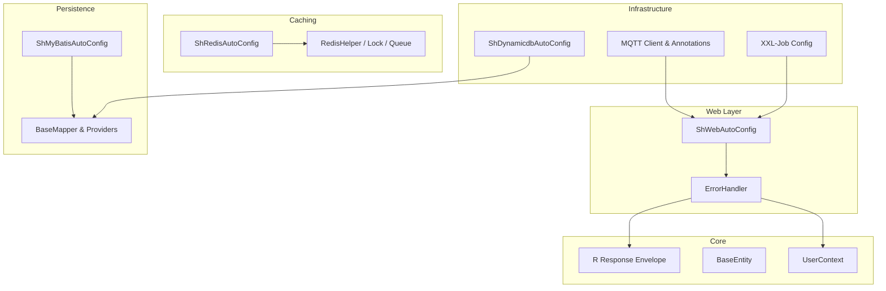
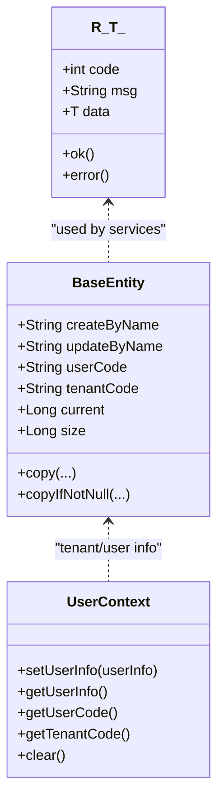
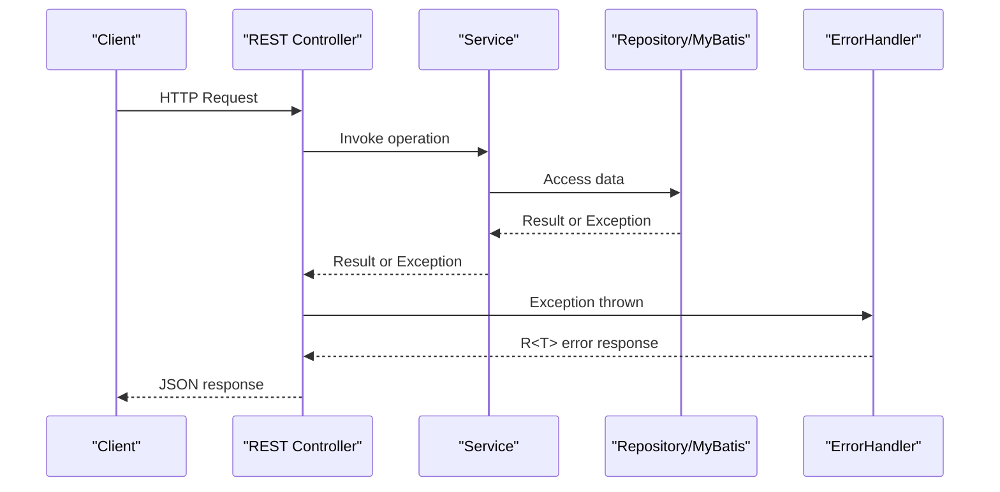
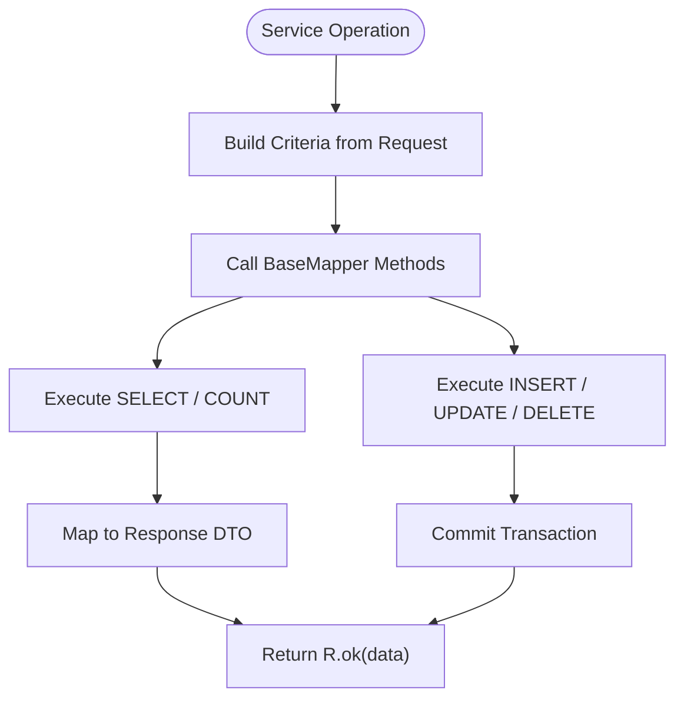
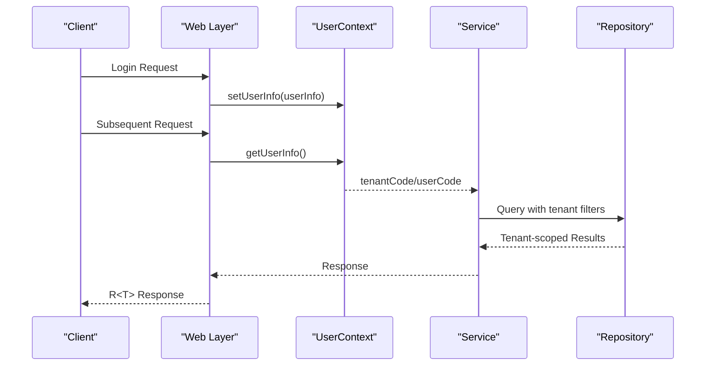
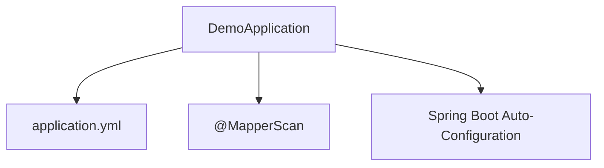
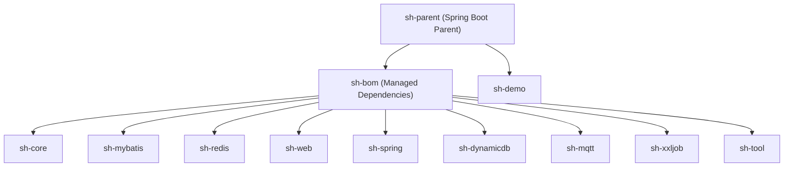

# Project Overview

<cite>
**Referenced Files in This Document**
- [README.md](file://README.md)
- [pom.xml](file://pom.xml)
- [sh-parent/pom.xml](file://sh-parent/pom.xml)
- [sh-bom/pom.xml](file://sh-bom/pom.xml)
- [sh-core/src/main/java/com/wkclz/core/base/BaseEntity.java](file://sh-core/src/main/java/com/wkclz/core/base/BaseEntity.java)
- [sh-core/src/main/java/com/wkclz/core/base/R.java](file://sh-core/src/main/java/com/wkclz/core/base/R.java)
- [sh-core/src/main/java/com/wkclz/core/user/UserContext.java](file://sh-core/src/main/java/com/wkclz/core/user/UserContext.java)
- [sh-web/src/main/java/com/wkclz/web/rest/ErrorHandler.java](file://sh-web/src/main/java/com/wkclz/web/rest/ErrorHandler.java)
- [sh-web/src/main/java/com/wkclz/web/ShWebAutoConfig.java](file://sh-web/src/main/java/com/wkclz/web/ShWebAutoConfig.java)
- [sh-mybatis/src/main/java/com/wkclz/mybatis/ShMyBatisAutoConfig.java](file://sh-mybatis/src/main/java/com/wkclz/mybatis/ShMyBatisAutoConfig.java)
- [sh-redis/src/main/java/com/wkclz/redis/ShRedisAutoConfig.java](file://sh-redis/src/main/java/com/wkclz/redis/ShRedisAutoConfig.java)
- [sh-dynamicdb/src/main/java/com/wkclz/dynamicdb/ShDynamicdbAutoConfig.java](file://sh-dynamicdb/src/main/java/com/wkclz/dynamicdb/ShDynamicdbAutoConfig.java)
- [sh-demo/src/main/java/com/wkclz/demo/DemoApplication.java](file://sh-demo/src/main/java/com/wkclz/demo/DemoApplication.java)
- [sh-demo/src/main/resources/config/application.yml](file://sh-demo/src/main/resources/config/application.yml)
</cite>

## Table of Contents
1. [Introduction](#introduction)
2. [Project Structure](#project-structure)
3. [Core Components](#core-components)
4. [Architecture Overview](#architecture-overview)
5. [Detailed Component Analysis](#detailed-component-analysis)
6. [Dependency Analysis](#dependency-analysis)
7. [Performance Considerations](#performance-considerations)
8. [Troubleshooting Guide](#troubleshooting-guide)
9. [Conclusion](#conclusion)

## Introduction
SH Framework is a Spring Boot-based Java framework designed to accelerate enterprise backend development. It provides standardized patterns and infrastructure components to streamline common tasks such as CRUD operations, multi-tenancy, and distributed caching. The framework is organized as a multi-module Maven project with a curated set of reusable modules that encapsulate best practices and reduce boilerplate code.

Key value propositions:
- Standardized CRUD patterns and request/response models for rapid development
- Built-in multi-tenancy support via user context and tenant-aware entities
- Infrastructure modules for database access (MyBatis), caching (Redis), dynamic data sources, messaging (MQTT), scheduling (XXL-Job), and web layer utilities
- Consistent global exception handling and unified response envelope
- Developer-friendly auto-configuration and Spring Boot integration

## Project Structure
The repository is a Maven multi-module project centered around a parent POM and a Bill of Materials (BOM) for dependency alignment. The modules are organized by responsibility, enabling teams to adopt only the components they need while maintaining consistency across services.

High-level module grouping:
- Parent and BOM: Centralized dependency and build configuration
- Core utilities and shared abstractions
- Persistence and caching integrations
- Web layer and infrastructure
- Messaging and scheduling
- Demo application showcasing typical usage

```mermaid
graph TB
Root["sh-framework (Root POM)"]
Parent["sh-parent (Spring Boot Parent)"]
BOM["sh-bom (Dependency Management)"]
Tool["sh-tool (Utilities)"]
Core["sh-core (Shared Abstractions)"]
MyBatis["sh-mybatis (ORM & CRUD)"]
Spring["sh-spring (Spring Extensions)"]
DynamicDB["sh-dynamicdb (Dynamic Datasource)"]
Redis["sh-redis (Caching)"]
Web["sh-web (Web Layer)"]
XXL["sh-xxljob (Scheduling)"]
MQTT["sh-mqtt (Messaging)"]
Demo["sh-demo (Sample App)"]
Root --> Parent
Root --> BOM
Root --> Tool
Root --> Core
Root --> MyBatis
Root --> Spring
Root --> DynamicDB
Root --> Redis
Root --> Web
Root --> XXL
Root --> MQTT
Root --> Demo
```

**Diagram sources**
- [pom.xml:21-34](file://pom.xml#L21-L34)
- [sh-parent/pom.xml:32-159](file://sh-parent/pom.xml#L32-L159)
- [sh-bom/pom.xml:53-280](file://sh-bom/pom.xml#L53-L280)

**Section sources**
- [pom.xml:1-36](file://pom.xml#L1-L36)
- [sh-parent/pom.xml:1-247](file://sh-parent/pom.xml#L1-L247)
- [sh-bom/pom.xml:1-285](file://sh-bom/pom.xml#L1-L285)

## Core Components
This section introduces the foundational building blocks that define the framework’s design philosophy and enable standardized development practices.

- Unified response envelope: A generic response wrapper standardizes API responses, including metadata such as timestamps and cost metrics.
- Base entity and pagination: Shared entity models carry tenant and user context, plus pagination and filtering helpers.
- Global exception handling: A centralized error handler translates exceptions into consistent responses and optionally sends alarm emails.
- User context: A thread-local holder stores user and tenant identifiers for tenant-aware operations.

These components collectively enforce consistent behavior across services and simplify cross-cutting concerns.

**Section sources**
- [sh-core/src/main/java/com/wkclz/core/base/R.java:1-76](file://sh-core/src/main/java/com/wkclz/core/base/R.java#L1-L76)
- [sh-core/src/main/java/com/wkclz/core/base/BaseEntity.java:1-94](file://sh-core/src/main/java/com/wkclz/core/base/BaseEntity.java#L1-L94)
- [sh-core/src/main/java/com/wkclz/core/user/UserContext.java:1-54](file://sh-core/src/main/java/com/wkclz/core/user/UserContext.java#L1-L54)
- [sh-web/src/main/java/com/wkclz/web/rest/ErrorHandler.java:1-267](file://sh-web/src/main/java/com/wkclz/web/rest/ErrorHandler.java#L1-L267)

## Architecture Overview
SH Framework follows a layered architecture with clear separation of concerns. The web layer handles HTTP requests and delegates to services, which operate against repositories backed by MyBatis. Caching and persistence are abstracted behind dedicated modules. Multi-tenancy is enforced via user context propagated through the request lifecycle.

**Diagram sources**
- [sh-web/src/main/java/com/wkclz/web/ShWebAutoConfig.java:1-12](file://sh-web/src/main/java/com/wkclz/web/ShWebAutoConfig.java#L1-L12)
- [sh-web/src/main/java/com/wkclz/web/rest/ErrorHandler.java:1-267](file://sh-web/src/main/java/com/wkclz/web/rest/ErrorHandler.java#L1-L267)
- [sh-core/src/main/java/com/wkclz/core/base/R.java:1-76](file://sh-core/src/main/java/com/wkclz/core/base/R.java#L1-L76)
- [sh-core/src/main/java/com/wkclz/core/base/BaseEntity.java:1-94](file://sh-core/src/main/java/com/wkclz/core/base/BaseEntity.java#L1-L94)
- [sh-core/src/main/java/com/wkclz/core/user/UserContext.java:1-54](file://sh-core/src/main/java/com/wkclz/core/user/UserContext.java#L1-L54)
- [sh-mybatis/src/main/java/com/wkclz/mybatis/ShMyBatisAutoConfig.java:1-14](file://sh-mybatis/src/main/java/com/wkclz/mybatis/ShMyBatisAutoConfig.java#L1-L14)
- [sh-redis/src/main/java/com/wkclz/redis/ShRedisAutoConfig.java:1-12](file://sh-redis/src/main/java/com/wkclz/redis/ShRedisAutoConfig.java#L1-L12)
- [sh-dynamicdb/src/main/java/com/wkclz/dynamicdb/ShDynamicdbAutoConfig.java:1-12](file://sh-dynamicdb/src/main/java/com/wkclz/dynamicdb/ShDynamicdbAutoConfig.java#L1-L12)

## Detailed Component Analysis

### Design Philosophy and Standards
- Standardized CRUD operations: The MyBatis module provides base mappers and providers that implement common operations (insert, select by ID/entity, update, delete, batch operations) with consistent behavior and SQL generation.
- Multi-tenancy support: Entities extend a base type that includes tenant and user codes, and a user context holder stores per-request user/tenant identity for automatic application-wide use.
- Infrastructure components: Dedicated modules encapsulate Redis operations, dynamic data source switching, MQTT messaging, and XXL-Job scheduling, each with auto-configuration and helper utilities.

**Diagram sources**
- [sh-core/src/main/java/com/wkclz/core/base/R.java:1-76](file://sh-core/src/main/java/com/wkclz/core/base/R.java#L1-L76)
- [sh-core/src/main/java/com/wkclz/core/base/BaseEntity.java:1-94](file://sh-core/src/main/java/com/wkclz/core/base/BaseEntity.java#L1-L94)
- [sh-core/src/main/java/com/wkclz/core/user/UserContext.java:1-54](file://sh-core/src/main/java/com/wkclz/core/user/UserContext.java#L1-L54)

**Section sources**
- [sh-core/src/main/java/com/wkclz/core/base/BaseEntity.java:1-94](file://sh-core/src/main/java/com/wkclz/core/base/BaseEntity.java#L1-L94)
- [sh-core/src/main/java/com/wkclz/core/base/R.java:1-76](file://sh-core/src/main/java/com/wkclz/core/base/R.java#L1-L76)
- [sh-core/src/main/java/com/wkclz/core/user/UserContext.java:1-54](file://sh-core/src/main/java/com/wkclz/core/user/UserContext.java#L1-L54)

### Web Layer and Error Handling
The web module centralizes error handling and response formatting. It provides a global exception handler that converts various exceptions into the unified response envelope, logs request context, and optionally sends email alerts for system errors.

**Diagram sources**
- [sh-web/src/main/java/com/wkclz/web/rest/ErrorHandler.java:1-267](file://sh-web/src/main/java/com/wkclz/web/rest/ErrorHandler.java#L1-L267)
- [sh-core/src/main/java/com/wkclz/core/base/R.java:1-76](file://sh-core/src/main/java/com/wkclz/core/base/R.java#L1-L76)

**Section sources**
- [sh-web/src/main/java/com/wkclz/web/rest/ErrorHandler.java:1-267](file://sh-web/src/main/java/com/wkclz/web/rest/ErrorHandler.java#L1-L267)
- [sh-web/src/main/java/com/wkclz/web/ShWebAutoConfig.java:1-12](file://sh-web/src/main/java/com/wkclz/web/ShWebAutoConfig.java#L1-L12)

### Persistence and CRUD Patterns
The MyBatis module offers auto-configuration and a set of base mappers/providers that implement standard CRUD operations. This enables services to focus on business logic rather than repetitive SQL and mapping code.

**Diagram sources**
- [sh-mybatis/src/main/java/com/wkclz/mybatis/ShMyBatisAutoConfig.java:1-14](file://sh-mybatis/src/main/java/com/wkclz/mybatis/ShMyBatisAutoConfig.java#L1-L14)

**Section sources**
- [sh-mybatis/src/main/java/com/wkclz/mybatis/ShMyBatisAutoConfig.java:1-14](file://sh-mybatis/src/main/java/com/wkclz/mybatis/ShMyBatisAutoConfig.java#L1-L14)

### Multi-Tenancy Support
Multi-tenancy is supported through user context propagation and tenant-aware entities. The user context stores tenant and user codes for the duration of a request, enabling downstream components to filter or route data by tenant.

**Diagram sources**
- [sh-core/src/main/java/com/wkclz/core/user/UserContext.java:1-54](file://sh-core/src/main/java/com/wkclz/core/user/UserContext.java#L1-L54)
- [sh-core/src/main/java/com/wkclz/core/base/BaseEntity.java:1-94](file://sh-core/src/main/java/com/wkclz/core/base/BaseEntity.java#L1-L94)

**Section sources**
- [sh-core/src/main/java/com/wkclz/core/user/UserContext.java:1-54](file://sh-core/src/main/java/com/wkclz/core/user/UserContext.java#L1-L54)
- [sh-core/src/main/java/com/wkclz/core/base/BaseEntity.java:1-94](file://sh-core/src/main/java/com/wkclz/core/base/BaseEntity.java#L1-L94)

### Example Application
The demo module demonstrates how to bootstrap a service using Spring Boot and integrate with MyBatis. It showcases typical configuration for datasource, MyBatis mapper locations, and pagehelper settings.

**Diagram sources**
- [sh-demo/src/main/java/com/wkclz/demo/DemoApplication.java:1-15](file://sh-demo/src/main/java/com/wkclz/demo/DemoApplication.java#L1-L15)
- [sh-demo/src/main/resources/config/application.yml:1-26](file://sh-demo/src/main/resources/config/application.yml#L1-L26)

**Section sources**
- [sh-demo/src/main/java/com/wkclz/demo/DemoApplication.java:1-15](file://sh-demo/src/main/java/com/wkclz/demo/DemoApplication.java#L1-L15)
- [sh-demo/src/main/resources/config/application.yml:1-26](file://sh-demo/src/main/resources/config/application.yml#L1-L26)

## Dependency Analysis
The framework leverages a parent POM aligned with Spring Boot and a BOM for consistent third-party versions. Module dependencies are managed centrally, ensuring compatibility and reducing duplication across projects.

**Diagram sources**
- [sh-parent/pom.xml:32-159](file://sh-parent/pom.xml#L32-L159)
- [sh-bom/pom.xml:53-280](file://sh-bom/pom.xml#L53-L280)
- [pom.xml:21-34](file://pom.xml#L21-L34)

**Section sources**
- [sh-parent/pom.xml:1-247](file://sh-parent/pom.xml#L1-L247)
- [sh-bom/pom.xml:1-285](file://sh-bom/pom.xml#L1-L285)
- [pom.xml:1-36](file://pom.xml#L1-L36)

## Performance Considerations
- Use pagination helpers from the core module to avoid large result sets and reduce memory pressure.
- Prefer batch operations provided by the MyBatis module for bulk inserts/updates to minimize round trips.
- Leverage Redis caching for frequently accessed data and use appropriate serializers to balance throughput and compatibility.
- Configure dynamic data sources judiciously to avoid excessive connection creation; reuse configured pools and monitor health.

## Troubleshooting Guide
- Global error handling: The error handler standardizes responses and logs request context. For system errors, it can send email notifications configured via system settings.
- Parameter validation: Validation exceptions are captured and returned as user-facing errors with structured messages.
- Database errors: SQL syntax and grammar errors are logged and returned as internal server errors; review logs for stack traces and request details.

**Section sources**
- [sh-web/src/main/java/com/wkclz/web/rest/ErrorHandler.java:1-267](file://sh-web/src/main/java/com/wkclz/web/rest/ErrorHandler.java#L1-L267)

## Conclusion
SH Framework accelerates enterprise backend development by providing a cohesive set of modules that standardize CRUD operations, enforce multi-tenancy, and deliver robust infrastructure components. Its modular design, combined with auto-configuration and shared abstractions, allows teams to build scalable, maintainable services quickly while adhering to consistent patterns and best practices.