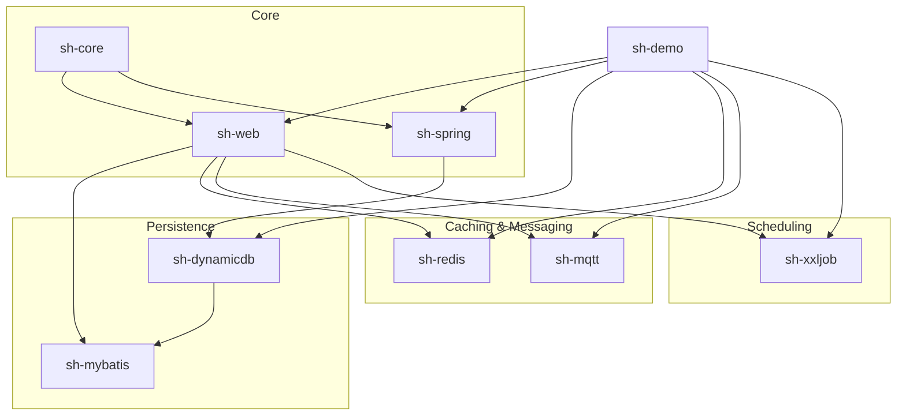
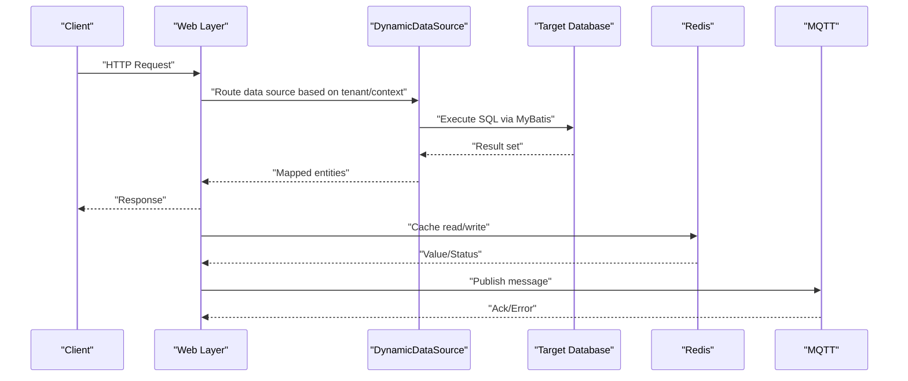
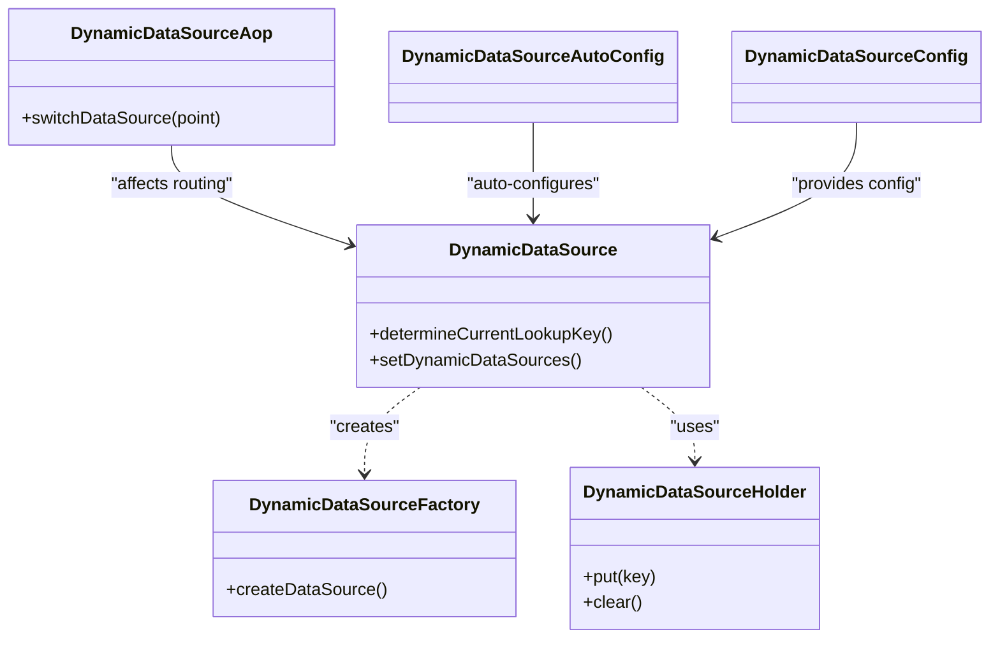
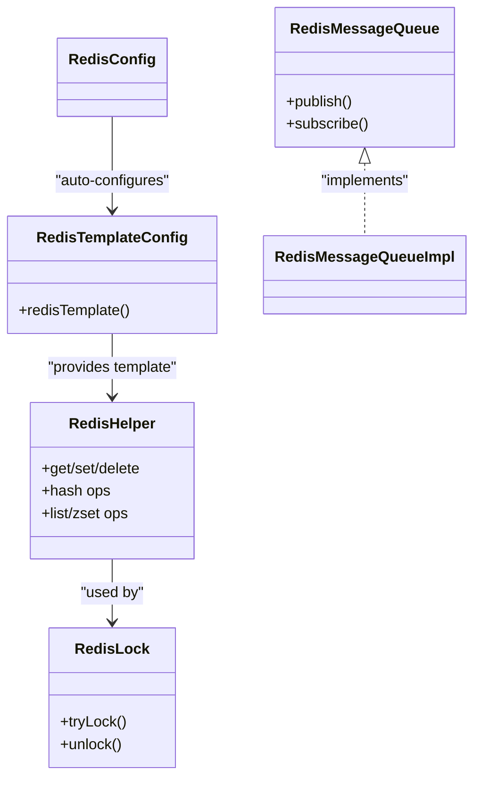
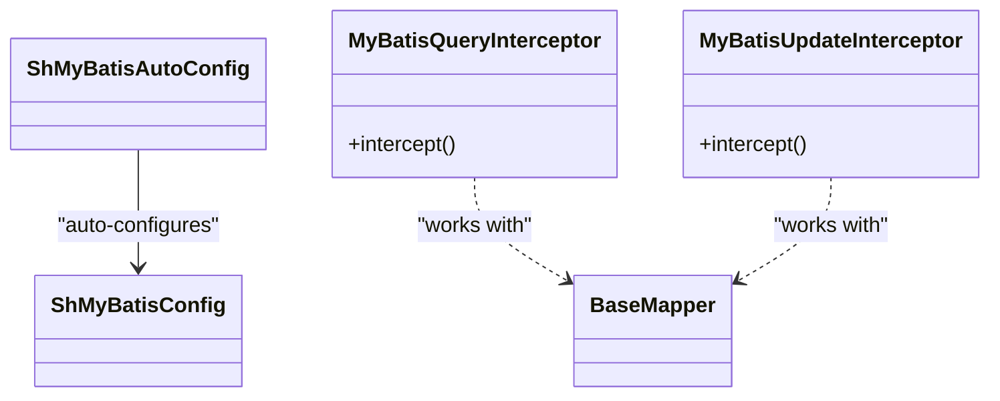
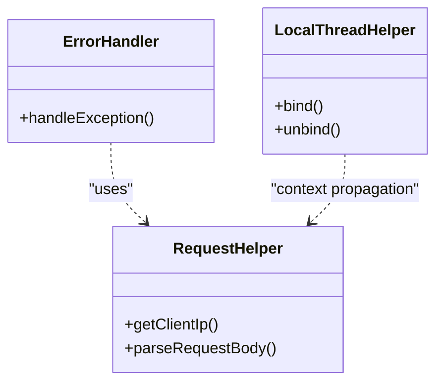
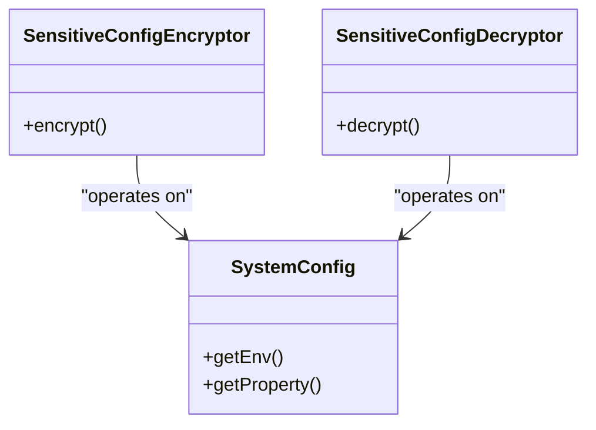
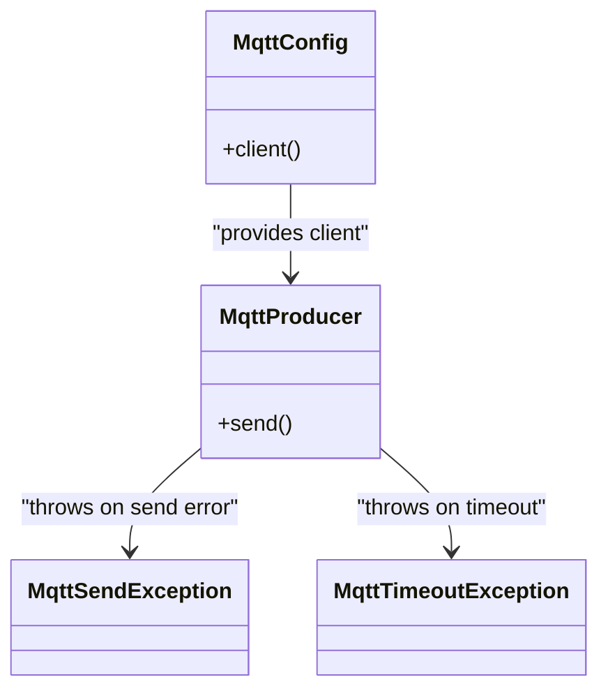
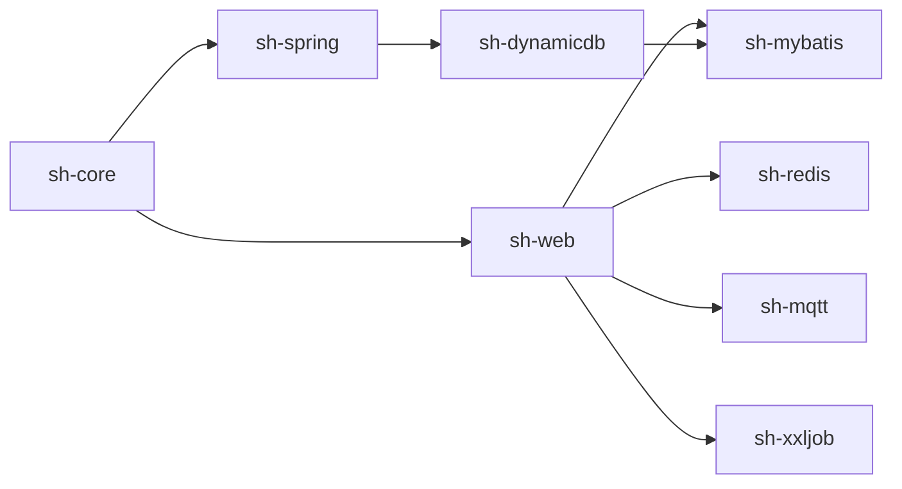

# Troubleshooting and FAQ

<cite>
**Referenced Files in This Document**
- [README.md](file://README.md)
- [sh-mqtt/README.md](file://sh-mqtt/README.md)
- [sh-dynamicdb/src/main/java/com/wkclz/dynamicdb/DynamicDataSource.java](file://sh-dynamicdb/src/main/java/com/wkclz/dynamicdb/DynamicDataSource.java)
- [sh-dynamicdb/src/main/java/com/wkclz/dynamicdb/DynamicDataSourceFactory.java](file://sh-dynamicdb/src/main/java/com/wkclz/dynamicdb/DynamicDataSourceFactory.java)
- [sh-dynamicdb/src/main/java/com/wkclz/dynamicdb/DynamicDataSourceHolder.java](file://sh-dynamicdb/src/main/java/com/wkclz/dynamicdb/DynamicDataSourceHolder.java)
- [sh-dynamicdb/src/main/java/com/wkclz/dynamicdb/aop/DynamicDataSourceAop.java](file://sh-dynamicdb/src/main/java/com/wkclz/dynamicdb/aop/DynamicDataSourceAop.java)
- [sh-dynamicdb/src/main/java/com/wkclz/dynamicdb/config/DynamicDataSourceAutoConfig.java](file://sh-dynamicdb/src/main/java/com/wkclz/dynamicdb/config/DynamicDataSourceAutoConfig.java)
- [sh-dynamicdb/src/main/java/com/wkclz/dynamicdb/config/DynamicDataSourceConfig.java](file://sh-dynamicdb/src/main/java/com/wkclz/dynamicdb/config/DynamicDataSourceConfig.java)
- [sh-dynamicdb/src/main/resources/META-INF/spring/org.springframework.boot.autoconfigure.AutoConfiguration.imports](file://sh-dynamicdb/src/main/resources/META-INF/spring/org.springframework.boot.autoconfigure.AutoConfiguration.imports)
- [sh-redis/src/main/java/com/wkclz/redis/config/RedisConfig.java](file://sh-redis/src/main/java/com/wkclz/redis/config/RedisConfig.java)
- [sh-redis/src/main/java/com/wkclz/redis/config/RedisTemplateConfig.java](file://sh-redis/src/main/java/com/wkclz/redis/config/RedisTemplateConfig.java)
- [sh-redis/src/main/java/com/wkclz/redis/helper/RedisHelper.java](file://sh-redis/src/main/java/com/wkclz/redis/helper/RedisHelper.java)
- [sh-redis/src/main/java/com/wkclz/redis/helper/RedisLock.java](file://sh-redis/src/main/java/com/wkclz/redis/helper/RedisLock.java)
- [sh-redis/src/main/java/com/wkclz/redis/queue/RedisMessageQueue.java](file://sh-redis/src/main/java/com/wkclz/redis/queue/RedisMessageQueue.java)
- [sh-redis/src/main/java/com/wkclz/redis/queue/RedisMessageQueueImpl.java](file://sh-redis/src/main/java/com/wkclz/redis/queue/RedisMessageQueueImpl.java)
- [sh-redis/src/main/resources/META-INF/spring/org.springframework.boot.autoconfigure.AutoConfiguration.imports](file://sh-redis/src/main/resources/META-INF/spring/org.springframework.boot.autoconfigure.AutoConfiguration.imports)
- [sh-mybatis/src/main/java/com/wkclz/mybatis/ShMyBatisAutoConfig.java](file://sh-mybatis/src/main/java/com/wkclz/mybatis/ShMyBatisAutoConfig.java)
- [sh-mybatis/src/main/java/com/wkclz/mybatis/config/ShMyBatisConfig.java](file://sh-mybatis/src/main/java/com/wkclz/mybatis/config/ShMyBatisConfig.java)
- [sh-mybatis/src/main/java/com/wkclz/mybatis/interceptor/MyBatisQueryInterceptor.java](file://sh-mybatis/src/main/java/com/wkclz/mybatis/interceptor/MyBatisQueryInterceptor.java)
- [sh-mybatis/src/main/java/com/wkclz/mybatis/interceptor/MyBatisUpdateInterceptor.java](file://sh-mybatis/src/main/java/com/wkclz/mybatis/interceptor/MyBatisUpdateInterceptor.java)
- [sh-mybatis/src/main/java/com/wkclz/mybatis/mapper/BaseMapper.java](file://sh-mybatis/src/main/java/com/wkclz/mybatis/mapper/BaseMapper.java)
- [sh-mybatis/src/main/resources/META-INF/spring/org.springframework.boot.autoconfigure.AutoConfiguration.imports](file://sh-mybatis/src/main/resources/META-INF/spring/org.springframework.boot.autoconfigure.AutoConfiguration.imports)
- [sh-web/src/main/java/com/wkclz/web/rest/ErrorHandler.java](file://sh-web/src/main/java/com/wkclz/web/rest/ErrorHandler.java)
- [sh-web/src/main/java/com/wkclz/web/helper/RequestHelper.java](file://sh-web/src/main/java/com/wkclz/web/helper/RequestHelper.java)
- [sh-web/src/main/java/com/wkclz/web/helper/LocalThreadHelper.java](file://sh-web/src/main/java/com/wkclz/web/helper/LocalThreadHelper.java)
- [sh-web/src/main/resources/META-INF/spring/org.springframework.boot.autoconfigure.AutoConfiguration.imports](file://sh-web/src/main/resources/META-INF/spring/org.springframework.boot.autoconfigure.AutoConfiguration.imports)
- [sh-spring/src/main/java/com/wkclz/spring/config/SensitiveConfigDecryptor.java](file://sh-spring/src/main/java/com/wkclz/spring/config/SensitiveConfigDecryptor.java)
- [sh-spring/src/main/java/com/wkclz/spring/config/SensitiveConfigEncryptor.java](file://sh-spring/src/main/java/com/wkclz/spring/config/SensitiveConfigEncryptor.java)
- [sh-spring/src/main/java/com/wkclz/spring/config/SystemConfig.java](file://sh-spring/src/main/java/com/wkclz/spring/config/SystemConfig.java)
- [sh-spring/src/main/java/com/wkclz/spring/utils/MailUtil.java](file://sh-spring/src/main/java/com/wkclz/spring/utils/MailUtil.java)
- [sh-spring/src/main/resources/META-INF/spring/org.springframework.boot.autoconfigure.AutoConfiguration.imports](file://sh-spring/src/main/resources/META-INF/spring/org.springframework.boot.autoconfigure.AutoConfiguration.imports)
- [sh-mqtt/src/main/java/com/wkclz/mqtt/config/MqttConfig.java](file://sh-mqtt/src/main/java/com/wkclz/mqtt/config/MqttConfig.java)
- [sh-mqtt/src/main/java/com/wkclz/mqtt/client/MqttProducer.java](file://sh-mqtt/src/main/java/com/wkclz/mqtt/client/MqttProducer.java)
- [sh-mqtt/src/main/java/com/wkclz/mqtt/exception/MqttSendException.java](file://sh-mqtt/src/main/java/com/wkclz/mqtt/exception/MqttSendException.java)
- [sh-mqtt/src/main/java/com/wkclz/mqtt/exception/MqttTimeoutException.java](file://sh-mqtt/src/main/java/com/wkclz/mqtt/exception/MqttTimeoutException.java)
- [sh-mqtt/src/main/resources/META-INF/spring/org.springframework.boot.autoconfigure.AutoConfiguration.imports](file://sh-mqtt/src/main/resources/META-INF/spring/org.springframework.boot.autoconfigure.AutoConfiguration.imports)
- [sh-xxljob/src/main/java/com/wkclz/xxljob/config/XxlJobConfig.java](file://sh-xxljob/src/main/java/com/wkclz/xxljob/config/XxlJobConfig.java)
- [sh-xxljob/src/main/resources/META-INF/spring/org.springframework.boot.autoconfigure.AutoConfiguration.imports](file://sh-xxljob/src/main/resources/META-INF/spring/org.springframework.boot.autoconfigure.AutoConfiguration.imports)
- [sh-demo/src/main/resources/config/application.yml](file://sh-demo/src/main/resources/config/application.yml)
- [.trae/specs/fix-dynamicdb-connection-pool-leak/spec.md](file://.trae/specs/fix-dynamicdb-connection-pool-leak/spec.md)
- [.trae/specs/fix-dynamicdb-dcl-blocking/spec.md](file://.trae/specs/fix-dynamicdb-dcl-blocking/spec.md)
- [.trae/specs/fix-fastjson2-autotype-vuln/spec.md](file://.trae/specs/fix-fastjson2-autotype-vuln/spec.md)
- [.trae/specs/fix-redis-lock-watchdog/spec.md](file://.trae/specs/fix-redis-lock-watchdog/spec.md)
- [.trae/specs/fix-sensitive-config-plaintext/tasks.md](file://.trae/specs/fix-sensitive-config-plaintext/tasks.md)
- [.trae/specs/fix-sql-injection-updateby/spec.md](file://.trae/specs/fix-sql-injection-updateby/spec.md)
- [.trae/specs/fix-threadlocal-leak/spec.md](file://.trae/specs/fix-threadlocal-leak/spec.md)
- [.trae/specs/optimize-sql-provider-reflection/spec.md](file://.trae/specs/optimize-sql-provider-reflection/spec.md)
- [docs/risk-analysis.md](file://docs/risk-analysis.md)
</cite>

## Table of Contents
1. [Introduction](#introduction)
2. [Project Structure](#project-structure)
3. [Core Components](#core-components)
4. [Architecture Overview](#architecture-overview)
5. [Detailed Component Analysis](#detailed-component-analysis)
6. [Dependency Analysis](#dependency-analysis)
7. [Performance Considerations](#performance-considerations)
8. [Troubleshooting Guide](#troubleshooting-guide)
9. [Security Considerations and Mitigations](#security-considerations-and-mitigations)
10. [Migration and Upgrade Guides](#migration-and-upgrade-guides)
11. [Monitoring and Logging Best Practices](#monitoring-and-logging-best-practices)
12. [Frequently Asked Questions (FAQ)](#frequently-asked-questions-faq)
13. [Conclusion](#conclusion)

## Introduction
This document provides comprehensive troubleshooting and FAQ guidance for the SH Framework. It focuses on diagnosing and resolving common issues related to connections, configuration, integrations, performance, and security. It also covers debugging techniques for multi-tenant scenarios, dynamic data source switching, and distributed locking, along with migration and monitoring best practices.

## Project Structure
The SH Framework is organized into modular Spring Boot starters and shared libraries:
- Core utilities and web scaffolding
- Dynamic data source switching
- Redis cache, locks, and queues
- MyBatis integration and interceptors
- Web REST helpers and error handling
- Spring utilities for sensitive configuration and system helpers
- MQTT client integration
- XXL-Job scheduler integration
- Demo application configuration

**Section sources**
- [README.md](file://README.md)

## Core Components
Key components and their roles:
- Dynamic Data Source: Enables runtime switching among multiple data sources with thread-safe routing and factory-backed creation.
- Redis: Provides RedisTemplate configuration, lock primitives, ID generation, and pub/sub queue utilities.
- MyBatis: Auto-configuration, interceptors for queries and updates, and generic mappers.
- Web: REST helpers, error handling, request/response utilities, and local thread helpers.
- Spring: Sensitive configuration encryption/decryption, system configuration, and Snowflake ID helper.
- MQTT: Client configuration, producer, and exception types.
- XXL-Job: Scheduler configuration.

**Section sources**
- [sh-dynamicdb/src/main/java/com/wkclz/dynamicdb/DynamicDataSource.java](file://sh-dynamicdb/src/main/java/com/wkclz/dynamicdb/DynamicDataSource.java)
- [sh-dynamicdb/src/main/java/com/wkclz/dynamicdb/DynamicDataSourceFactory.java](file://sh-dynamicdb/src/main/java/com/wkclz/dynamicdb/DynamicDataSourceFactory.java)
- [sh-redis/src/main/java/com/wkclz/redis/config/RedisTemplateConfig.java](file://sh-redis/src/main/java/com/wkclz/redis/config/RedisTemplateConfig.java)
- [sh-redis/src/main/java/com/wkclz/redis/helper/RedisLock.java](file://sh-redis/src/main/java/com/wkclz/redis/helper/RedisLock.java)
- [sh-mybatis/src/main/java/com/wkclz/mybatis/ShMyBatisAutoConfig.java](file://sh-mybatis/src/main/java/com/wkclz/mybatis/ShMyBatisAutoConfig.java)
- [sh-web/src/main/java/com/wkclz/web/rest/ErrorHandler.java](file://sh-web/src/main/java/com/wkclz/web/rest/ErrorHandler.java)
- [sh-spring/src/main/java/com/wkclz/spring/config/SensitiveConfigDecryptor.java](file://sh-spring/src/main/java/com/wkclz/spring/config/SensitiveConfigDecryptor.java)
- [sh-mqtt/src/main/java/com/wkclz/mqtt/config/MqttConfig.java](file://sh-mqtt/src/main/java/com/wkclz/mqtt/config/MqttConfig.java)
- [sh-xxljob/src/main/java/com/wkclz/xxljob/config/XxlJobConfig.java](file://sh-xxljob/src/main/java/com/wkclz/xxljob/config/XxlJobConfig.java)

## Architecture Overview
High-level runtime flow for typical operations involving dynamic data source switching, Redis operations, and REST endpoints.

**Diagram sources**
- [sh-dynamicdb/src/main/java/com/wkclz/dynamicdb/DynamicDataSource.java](file://sh-dynamicdb/src/main/java/com/wkclz/dynamicdb/DynamicDataSource.java)
- [sh-mybatis/src/main/java/com/wkclz/mybatis/ShMyBatisAutoConfig.java](file://sh-mybatis/src/main/java/com/wkclz/mybatis/ShMyBatisAutoConfig.java)
- [sh-redis/src/main/java/com/wkclz/redis/config/RedisTemplateConfig.java](file://sh-redis/src/main/java/com/wkclz/redis/config/RedisTemplateConfig.java)
- [sh-mqtt/src/main/java/com/wkclz/mqtt/client/MqttProducer.java](file://sh-mqtt/src/main/java/com/wkclz/mqtt/client/MqttProducer.java)

## Detailed Component Analysis

### Dynamic Data Source Switching
Common issues include connection pool leaks, DCL blocking during async creation, and thread-local leaks. The module provides:
- Thread-safe routing and holder for current data source key
- Factory-backed creation of data sources
- Auto-configuration and imports for Spring Boot

**Diagram sources**
- [sh-dynamicdb/src/main/java/com/wkclz/dynamicdb/DynamicDataSource.java](file://sh-dynamicdb/src/main/java/com/wkclz/dynamicdb/DynamicDataSource.java)
- [sh-dynamicdb/src/main/java/com/wkclz/dynamicdb/DynamicDataSourceFactory.java](file://sh-dynamicdb/src/main/java/com/wkclz/dynamicdb/DynamicDataSourceFactory.java)
- [sh-dynamicdb/src/main/java/com/wkclz/dynamicdb/DynamicDataSourceHolder.java](file://sh-dynamicdb/src/main/java/com/wkclz/dynamicdb/DynamicDataSourceHolder.java)
- [sh-dynamicdb/src/main/java/com/wkclz/dynamicdb/aop/DynamicDataSourceAop.java](file://sh-dynamicdb/src/main/java/com/wkclz/dynamicdb/aop/DynamicDataSourceAop.java)
- [sh-dynamicdb/src/main/java/com/wkclz/dynamicdb/config/DynamicDataSourceAutoConfig.java](file://sh-dynamicdb/src/main/java/com/wkclz/dynamicdb/config/DynamicDataSourceAutoConfig.java)
- [sh-dynamicdb/src/main/java/com/wkclz/dynamicdb/config/DynamicDataSourceConfig.java](file://sh-dynamicdb/src/main/java/com/wkclz/dynamicdb/config/DynamicDataSourceConfig.java)

**Section sources**
- [sh-dynamicdb/src/main/java/com/wkclz/dynamicdb/DynamicDataSource.java](file://sh-dynamicdb/src/main/java/com/wkclz/dynamicdb/DynamicDataSource.java)
- [sh-dynamicdb/src/main/java/com/wkclz/dynamicdb/DynamicDataSourceFactory.java](file://sh-dynamicdb/src/main/java/com/wkclz/dynamicdb/DynamicDataSourceFactory.java)
- [sh-dynamicdb/src/main/java/com/wkclz/dynamicdb/DynamicDataSourceHolder.java](file://sh-dynamicdb/src/main/java/com/wkclz/dynamicdb/DynamicDataSourceHolder.java)
- [sh-dynamicdb/src/main/java/com/wkclz/dynamicdb/aop/DynamicDataSourceAop.java](file://sh-dynamicdb/src/main/java/com/wkclz/dynamicdb/aop/DynamicDataSourceAop.java)
- [sh-dynamicdb/src/main/java/com/wkclz/dynamicdb/config/DynamicDataSourceAutoConfig.java](file://sh-dynamicdb/src/main/java/com/wkclz/dynamicdb/config/DynamicDataSourceAutoConfig.java)
- [sh-dynamicdb/src/main/java/com/wkclz/dynamicdb/config/DynamicDataSourceConfig.java](file://sh-dynamicdb/src/main/java/com/wkclz/dynamicdb/config/DynamicDataSourceConfig.java)
- [sh-dynamicdb/src/main/resources/META-INF/spring/org.springframework.boot.autoconfigure.AutoConfiguration.imports](file://sh-dynamicdb/src/main/resources/META-INF/spring/org.springframework.boot.autoconfigure.AutoConfiguration.imports)

### Redis Operations and Distributed Locking
Redis provides template configuration, lock primitives, ID generator, and message queue utilities. Issues commonly involve watchdog behavior for locks and serialization concerns.

**Diagram sources**
- [sh-redis/src/main/java/com/wkclz/redis/config/RedisTemplateConfig.java](file://sh-redis/src/main/java/com/wkclz/redis/config/RedisTemplateConfig.java)
- [sh-redis/src/main/java/com/wkclz/redis/helper/RedisHelper.java](file://sh-redis/src/main/java/com/wkclz/redis/helper/RedisHelper.java)
- [sh-redis/src/main/java/com/wkclz/redis/helper/RedisLock.java](file://sh-redis/src/main/java/com/wkclz/redis/helper/RedisLock.java)
- [sh-redis/src/main/java/com/wkclz/redis/queue/RedisMessageQueue.java](file://sh-redis/src/main/java/com/wkclz/redis/queue/RedisMessageQueue.java)
- [sh-redis/src/main/java/com/wkclz/redis/queue/RedisMessageQueueImpl.java](file://sh-redis/src/main/java/com/wkclz/redis/queue/RedisMessageQueueImpl.java)
- [sh-redis/src/main/java/com/wkclz/redis/config/RedisConfig.java](file://sh-redis/src/main/java/com/wkclz/redis/config/RedisConfig.java)

**Section sources**
- [sh-redis/src/main/java/com/wkclz/redis/config/RedisTemplateConfig.java](file://sh-redis/src/main/java/com/wkclz/redis/config/RedisTemplateConfig.java)
- [sh-redis/src/main/java/com/wkclz/redis/helper/RedisHelper.java](file://sh-redis/src/main/java/com/wkclz/redis/helper/RedisHelper.java)
- [sh-redis/src/main/java/com/wkclz/redis/helper/RedisLock.java](file://sh-redis/src/main/java/com/wkclz/redis/helper/RedisLock.java)
- [sh-redis/src/main/java/com/wkclz/redis/queue/RedisMessageQueue.java](file://sh-redis/src/main/java/com/wkclz/redis/queue/RedisMessageQueue.java)
- [sh-redis/src/main/java/com/wkclz/redis/queue/RedisMessageQueueImpl.java](file://sh-redis/src/main/java/com/wkclz/redis/queue/RedisMessageQueueImpl.java)
- [sh-redis/src/main/java/com/wkclz/redis/config/RedisConfig.java](file://sh-redis/src/main/java/com/wkclz/redis/config/RedisConfig.java)
- [sh-redis/src/main/resources/META-INF/spring/org.springframework.boot.autoconfigure.AutoConfiguration.imports](file://sh-redis/src/main/resources/META-INF/spring/org.springframework.boot.autoconfigure.AutoConfiguration.imports)

### MyBatis Integration and Interceptors
Interceptors handle query and update operations, while auto-configuration sets up the environment. Issues often relate to SQL injection prevention and reflection overhead.

**Diagram sources**
- [sh-mybatis/src/main/java/com/wkclz/mybatis/ShMyBatisAutoConfig.java](file://sh-mybatis/src/main/java/com/wkclz/mybatis/ShMyBatisAutoConfig.java)
- [sh-mybatis/src/main/java/com/wkclz/mybatis/config/ShMyBatisConfig.java](file://sh-mybatis/src/main/java/com/wkclz/mybatis/config/ShMyBatisConfig.java)
- [sh-mybatis/src/main/java/com/wkclz/mybatis/interceptor/MyBatisQueryInterceptor.java](file://sh-mybatis/src/main/java/com/wkclz/mybatis/interceptor/MyBatisQueryInterceptor.java)
- [sh-mybatis/src/main/java/com/wkclz/mybatis/interceptor/MyBatisUpdateInterceptor.java](file://sh-mybatis/src/main/java/com/wkclz/mybatis/interceptor/MyBatisUpdateInterceptor.java)
- [sh-mybatis/src/main/java/com/wkclz/mybatis/mapper/BaseMapper.java](file://sh-mybatis/src/main/java/com/wkclz/mybatis/mapper/BaseMapper.java)

**Section sources**
- [sh-mybatis/src/main/java/com/wkclz/mybatis/ShMyBatisAutoConfig.java](file://sh-mybatis/src/main/java/com/wkclz/mybatis/ShMyBatisAutoConfig.java)
- [sh-mybatis/src/main/java/com/wkclz/mybatis/config/ShMyBatisConfig.java](file://sh-mybatis/src/main/java/com/wkclz/mybatis/config/ShMyBatisConfig.java)
- [sh-mybatis/src/main/java/com/wkclz/mybatis/interceptor/MyBatisQueryInterceptor.java](file://sh-mybatis/src/main/java/com/wkclz/mybatis/interceptor/MyBatisQueryInterceptor.java)
- [sh-mybatis/src/main/java/com/wkclz/mybatis/interceptor/MyBatisUpdateInterceptor.java](file://sh-mybatis/src/main/java/com/wkclz/mybatis/interceptor/MyBatisUpdateInterceptor.java)
- [sh-mybatis/src/main/java/com/wkclz/mybatis/mapper/BaseMapper.java](file://sh-mybatis/src/main/java/com/wkclz/mybatis/mapper/BaseMapper.java)
- [sh-mybatis/src/main/resources/META-INF/spring/org.springframework.boot.autoconfigure.AutoConfiguration.imports](file://sh-mybatis/src/main/resources/META-INF/spring/org.springframework.boot.autoconfigure.AutoConfiguration.imports)

### Web Layer and Error Handling
The web module centralizes request/response helpers, error handling, and local thread utilities for context propagation.

**Diagram sources**
- [sh-web/src/main/java/com/wkclz/web/rest/ErrorHandler.java](file://sh-web/src/main/java/com/wkclz/web/rest/ErrorHandler.java)
- [sh-web/src/main/java/com/wkclz/web/helper/RequestHelper.java](file://sh-web/src/main/java/com/wkclz/web/helper/RequestHelper.java)
- [sh-web/src/main/java/com/wkclz/web/helper/LocalThreadHelper.java](file://sh-web/src/main/java/com/wkclz/web/helper/LocalThreadHelper.java)

**Section sources**
- [sh-web/src/main/java/com/wkclz/web/rest/ErrorHandler.java](file://sh-web/src/main/java/com/wkclz/web/rest/ErrorHandler.java)
- [sh-web/src/main/java/com/wkclz/web/helper/RequestHelper.java](file://sh-web/src/main/java/com/wkclz/web/helper/RequestHelper.java)
- [sh-web/src/main/java/com/wkclz/web/helper/LocalThreadHelper.java](file://sh-web/src/main/java/com/wkclz/web/helper/LocalThreadHelper.java)
- [sh-web/src/main/resources/META-INF/spring/org.springframework.boot.autoconfigure.AutoConfiguration.imports](file://sh-web/src/main/resources/META-INF/spring/org.springframework.boot.autoconfigure.AutoConfiguration.imports)

### Spring Utilities and Sensitive Configurations
Sensitive configuration encryption/decryption and system configuration are provided to mitigate plaintext exposure and improve operational safety.

**Diagram sources**
- [sh-spring/src/main/java/com/wkclz/spring/config/SensitiveConfigEncryptor.java](file://sh-spring/src/main/java/com/wkclz/spring/config/SensitiveConfigEncryptor.java)
- [sh-spring/src/main/java/com/wkclz/spring/config/SensitiveConfigDecryptor.java](file://sh-spring/src/main/java/com/wkclz/spring/config/SensitiveConfigDecryptor.java)
- [sh-spring/src/main/java/com/wkclz/spring/config/SystemConfig.java](file://sh-spring/src/main/java/com/wkclz/spring/config/SystemConfig.java)

**Section sources**
- [sh-spring/src/main/java/com/wkclz/spring/config/SensitiveConfigEncryptor.java](file://sh-spring/src/main/java/com/wkclz/spring/config/SensitiveConfigEncryptor.java)
- [sh-spring/src/main/java/com/wkclz/spring/config/SensitiveConfigDecryptor.java](file://sh-spring/src/main/java/com/wkclz/spring/config/SensitiveConfigDecryptor.java)
- [sh-spring/src/main/java/com/wkclz/spring/config/SystemConfig.java](file://sh-spring/src/main/java/com/wkclz/spring/config/SystemConfig.java)
- [sh-spring/src/main/resources/META-INF/spring/org.springframework.boot.autoconfigure.AutoConfiguration.imports](file://sh-spring/src/main/resources/META-INF/spring/org.springframework.boot.autoconfigure.AutoConfiguration.imports)

### MQTT Integration
MQTT client configuration and producer are provided, with dedicated exceptions for send and timeout scenarios.

**Diagram sources**
- [sh-mqtt/src/main/java/com/wkclz/mqtt/config/MqttConfig.java](file://sh-mqtt/src/main/java/com/wkclz/mqtt/config/MqttConfig.java)
- [sh-mqtt/src/main/java/com/wkclz/mqtt/client/MqttProducer.java](file://sh-mqtt/src/main/java/com/wkclz/mqtt/client/MqttProducer.java)
- [sh-mqtt/src/main/java/com/wkclz/mqtt/exception/MqttSendException.java](file://sh-mqtt/src/main/java/com/wkclz/mqtt/exception/MqttSendException.java)
- [sh-mqtt/src/main/java/com/wkclz/mqtt/exception/MqttTimeoutException.java](file://sh-mqtt/src/main/java/com/wkclz/mqtt/exception/MqttTimeoutException.java)

**Section sources**
- [sh-mqtt/src/main/java/com/wkclz/mqtt/config/MqttConfig.java](file://sh-mqtt/src/main/java/com/wkclz/mqtt/config/MqttConfig.java)
- [sh-mqtt/src/main/java/com/wkclz/mqtt/client/MqttProducer.java](file://sh-mqtt/src/main/java/com/wkclz/mqtt/client/MqttProducer.java)
- [sh-mqtt/src/main/java/com/wkclz/mqtt/exception/MqttSendException.java](file://sh-mqtt/src/main/java/com/wkclz/mqtt/exception/MqttSendException.java)
- [sh-mqtt/src/main/java/com/wkclz/mqtt/exception/MqttTimeoutException.java](file://sh-mqtt/src/main/java/com/wkclz/mqtt/exception/MqttTimeoutException.java)
- [sh-mqtt/src/main/resources/META-INF/spring/org.springframework.boot.autoconfigure.AutoConfiguration.imports](file://sh-mqtt/src/main/resources/META-INF/spring/org.springframework.boot.autoconfigure.AutoConfiguration.imports)

### XXL-Job Scheduler
Scheduler configuration is provided for integrating job execution.

**Diagram sources**
- [sh-xxljob/src/main/java/com/wkclz/xxljob/config/XxlJobConfig.java](file://sh-xxljob/src/main/java/com/wkclz/xxljob/config/XxlJobConfig.java)

**Section sources**
- [sh-xxljob/src/main/java/com/wkclz/xxljob/config/XxlJobConfig.java](file://sh-xxljob/src/main/java/com/wkclz/xxljob/config/XxlJobConfig.java)
- [sh-xxljob/src/main/resources/META-INF/spring/org.springframework.boot.autoconfigure.AutoConfiguration.imports](file://sh-xxljob/src/main/resources/META-INF/spring/org.springframework.boot.autoconfigure.AutoConfiguration.imports)

## Dependency Analysis
The following diagram shows module-level dependencies inferred from imports and configuration:

**Diagram sources**
- [sh-web/src/main/resources/META-INF/spring/org.springframework.boot.autoconfigure.AutoConfiguration.imports](file://sh-web/src/main/resources/META-INF/spring/org.springframework.boot.autoconfigure.AutoConfiguration.imports)
- [sh-dynamicdb/src/main/resources/META-INF/spring/org.springframework.boot.autoconfigure.AutoConfiguration.imports](file://sh-dynamicdb/src/main/resources/META-INF/spring/org.springframework.boot.autoconfigure.AutoConfiguration.imports)
- [sh-redis/src/main/resources/META-INF/spring/org.springframework.boot.autoconfigure.AutoConfiguration.imports](file://sh-redis/src/main/resources/META-INF/spring/org.springframework.boot.autoconfigure.AutoConfiguration.imports)
- [sh-mybatis/src/main/resources/META-INF/spring/org.springframework.boot.autoconfigure.AutoConfiguration.imports](file://sh-mybatis/src/main/resources/META-INF/spring/org.springframework.boot.autoconfigure.AutoConfiguration.imports)
- [sh-mqtt/src/main/resources/META-INF/spring/org.springframework.boot.autoconfigure.AutoConfiguration.imports](file://sh-mqtt/src/main/resources/META-INF/spring/org.springframework.boot.autoconfigure.AutoConfiguration.imports)
- [sh-xxljob/src/main/resources/META-INF/spring/org.springframework.boot.autoconfigure.AutoConfiguration.imports](file://sh-xxljob/src/main/resources/META-INF/spring/org.springframework.boot.autoconfigure.AutoConfiguration.imports)

**Section sources**
- [sh-web/src/main/resources/META-INF/spring/org.springframework.boot.autoconfigure.AutoConfiguration.imports](file://sh-web/src/main/resources/META-INF/spring/org.springframework.boot.autoconfigure.AutoConfiguration.imports)
- [sh-dynamicdb/src/main/resources/META-INF/spring/org.springframework.boot.autoconfigure.AutoConfiguration.imports](file://sh-dynamicdb/src/main/resources/META-INF/spring/org.springframework.boot.autoconfigure.AutoConfiguration.imports)
- [sh-redis/src/main/resources/META-INF/spring/org.springframework.boot.autoconfigure.AutoConfiguration.imports](file://sh-redis/src/main/resources/META-INF/spring/org.springframework.boot.autoconfigure.AutoConfiguration.imports)
- [sh-mybatis/src/main/resources/META-INF/spring/org.springframework.boot.autoconfigure.AutoConfiguration.imports](file://sh-mybatis/src/main/resources/META-INF/spring/org.springframework.boot.autoconfigure.AutoConfiguration.imports)
- [sh-mqtt/src/main/resources/META-INF/spring/org.springframework.boot.autoconfigure.AutoConfiguration.imports](file://sh-mqtt/src/main/resources/META-INF/spring/org.springframework.boot.autoconfigure.AutoConfiguration.imports)
- [sh-xxljob/src/main/resources/META-INF/spring/org.springframework.boot.autoconfigure.AutoConfiguration.imports](file://sh-xxljob/src/main/resources/META-INF/spring/org.springframework.boot.autoconfigure.AutoConfiguration.imports)

## Performance Considerations
- Database connections
  - Monitor active connections, acquire time, and pool exhaustion events. Use connection pool metrics to detect leaks and adjust sizing.
  - Ensure proper cleanup after transactions and avoid long-running connections in thread-local contexts.
- Redis operations
  - Prefer pipeline operations for batch writes. Use appropriate serializers and avoid large payloads.
  - Monitor lock acquisition latency and unlock timing; watch for watchdog-related deadlocks.
- Memory usage
  - Track thread-local retention and ensure cleanup after request completion. Review reflection-heavy components for optimization opportunities.

[No sources needed since this section provides general guidance]

## Troubleshooting Guide

### Connection Problems
- Symptoms: Connection timeouts, pool exhaustion, or frequent reconnects.
- Checks:
  - Verify data source URLs, credentials, and network reachability.
  - Inspect pool metrics and adjust max size, min idle, and eviction settings.
  - Confirm SSL/TLS settings match server configuration.
- Actions:
  - Reinitialize data source pools after configuration changes.
  - Add health checks for upstream databases and retry policies for transient failures.

**Section sources**
- [sh-dynamicdb/src/main/java/com/wkclz/dynamicdb/DynamicDataSource.java](file://sh-dynamicdb/src/main/java/com/wkclz/dynamicdb/DynamicDataSource.java)
- [sh-dynamicdb/src/main/java/com/wkclz/dynamicdb/DynamicDataSourceFactory.java](file://sh-dynamicdb/src/main/java/com/wkclz/dynamicdb/DynamicDataSourceFactory.java)

### Configuration Errors
- Symptoms: Beans not found, auto-configuration not applied, or property binding failures.
- Checks:
  - Validate presence of auto-configuration imports and package scanning.
  - Confirm application.yml entries align with component expectations.
- Actions:
  - Enable debug logging for Spring conditions and auto-configuration reports.
  - Reorder @EnableAutoConfiguration or remove conflicting configurations.

**Section sources**
- [sh-dynamicdb/src/main/resources/META-INF/spring/org.springframework.boot.autoconfigure.AutoConfiguration.imports](file://sh-dynamicdb/src/main/resources/META-INF/spring/org.springframework.boot.autoconfigure.AutoConfiguration.imports)
- [sh-redis/src/main/resources/META-INF/spring/org.springframework.boot.autoconfigure.AutoConfiguration.imports](file://sh-redis/src/main/resources/META-INF/spring/org.springframework.boot.autoconfigure.AutoConfiguration.imports)
- [sh-mybatis/src/main/resources/META-INF/spring/org.springframework.boot.autoconfigure.AutoConfiguration.imports](file://sh-mybatis/src/main/resources/META-INF/spring/org.springframework.boot.autoconfigure.AutoConfiguration.imports)
- [sh-web/src/main/resources/META-INF/spring/org.springframework.boot.autoconfigure.AutoConfiguration.imports](file://sh-web/src/main/resources/META-INF/spring/org.springframework.boot.autoconfigure.AutoConfiguration.imports)
- [sh-spring/src/main/resources/META-INF/spring/org.springframework.boot.autoconfigure.AutoConfiguration.imports](file://sh-spring/src/main/resources/META-INF/spring/org.springframework.boot.autoconfigure.AutoConfiguration.imports)
- [sh-mqtt/src/main/resources/META-INF/spring/org.springframework.boot.autoconfigure.AutoConfiguration.imports](file://sh-mqtt/src/main/resources/META-INF/spring/org.springframework.boot.autoconfigure.AutoConfiguration.imports)
- [sh-xxljob/src/main/resources/META-INF/spring/org.springframework.boot.autoconfigure.AutoConfiguration.imports](file://sh-xxljob/src/main/resources/META-INF/spring/org.springframework.boot.autoconfigure.AutoConfiguration.imports)

### Integration Challenges
- MyBatis
  - Ensure interceptors are registered and mapper XMLs are discoverable.
  - Validate base mapper usage and entity mappings.
- Redis
  - Confirm RedisTemplate serialization matches payload types.
  - Test lock acquisition and release under contention.
- MQTT
  - Validate broker connectivity, authentication, and topic permissions.
  - Monitor send and timeout exceptions.

**Section sources**
- [sh-mybatis/src/main/java/com/wkclz/mybatis/ShMyBatisAutoConfig.java](file://sh-mybatis/src/main/java/com/wkclz/mybatis/ShMyBatisAutoConfig.java)
- [sh-redis/src/main/java/com/wkclz/redis/config/RedisTemplateConfig.java](file://sh-redis/src/main/java/com/wkclz/redis/config/RedisTemplateConfig.java)
- [sh-mqtt/src/main/java/com/wkclz/mqtt/config/MqttConfig.java](file://sh-mqtt/src/main/java/com/wkclz/mqtt/config/MqttConfig.java)

### Multi-Tenant Debugging
- Symptom: Wrong tenant data returned or cross-tenant leakage.
- Checks:
  - Trace the data source key resolution and ensure it is bound per request.
  - Verify thread-local holder cleanup after each request.
- Actions:
  - Log the current lookup key around transaction boundaries.
  - Use AOP advice to enforce tenant isolation.

**Section sources**
- [sh-dynamicdb/src/main/java/com/wkclz/dynamicdb/DynamicDataSourceHolder.java](file://sh-dynamicdb/src/main/java/com/wkclz/dynamicdb/DynamicDataSourceHolder.java)
- [sh-dynamicdb/src/main/java/com/wkclz/dynamicdb/aop/DynamicDataSourceAop.java](file://sh-dynamicdb/src/main/java/com/wkclz/dynamicdb/aop/DynamicDataSourceAop.java)
- [sh-web/src/main/java/com/wkclz/web/helper/LocalThreadHelper.java](file://sh-web/src/main/java/com/wkclz/web/helper/LocalThreadHelper.java)

### Dynamic Data Source Switching
- Symptom: Switch not taking effect or inconsistent routing.
- Checks:
  - Confirm the AOP aspect executes before data access.
  - Validate factory-backed creation and lifecycle of target data sources.
- Actions:
  - Force rebind of the data source key per request.
  - Add explicit switch points around cross-tenant operations.

**Section sources**
- [sh-dynamicdb/src/main/java/com/wkclz/dynamicdb/aop/DynamicDataSourceAop.java](file://sh-dynamicdb/src/main/java/com/wkclz/dynamicdb/aop/DynamicDataSourceAop.java)
- [sh-dynamicdb/src/main/java/com/wkclz/dynamicdb/DynamicDataSourceFactory.java](file://sh-dynamicdb/src/main/java/com/wkclz/dynamicdb/DynamicDataSourceFactory.java)

### Distributed Locking Issues
- Symptom: Deadlocks, lost unlocks, or excessive contention.
- Checks:
  - Verify lock TTL and watchdog behavior.
  - Ensure consistent lock keys and proper unlock semantics.
- Actions:
  - Use lock holders and structured unlock blocks.
  - Monitor lock acquisition latency and contention metrics.

**Section sources**
- [sh-redis/src/main/java/com/wkclz/redis/helper/RedisLock.java](file://sh-redis/src/main/java/com/wkclz/redis/helper/RedisLock.java)
- [.trae/specs/fix-redis-lock-watchdog/spec.md](file://.trae/specs/fix-redis-lock-watchdog/spec.md)

### Security and Vulnerabilities
- Autotype/AutoType vulnerabilities
  - Mitigation: Disable dangerous deserialization features and sanitize input.
- SQL injection in update-by operations
  - Mitigation: Use prepared statements and validated column lists.
- Sensitive configuration in plaintext
  - Mitigation: Encrypt at rest and decrypt at runtime.
- Thread-local leak
  - Mitigation: Ensure cleanup after request completion.

**Section sources**
- [.trae/specs/fix-fastjson2-autotype-vuln/spec.md](file://.trae/specs/fix-fastjson2-autotype-vuln/spec.md)
- [.trae/specs/fix-sql-injection-updateby/spec.md](file://.trae/specs/fix-sql-injection-updateby/spec.md)
- [.trae/specs/fix-sensitive-config-plaintext/tasks.md](file://.trae/specs/fix-sensitive-config-plaintext/tasks.md)
- [.trae/specs/fix-threadlocal-leak/spec.md](file://.trae/specs/fix-threadlocal-leak/spec.md)

### Performance Troubleshooting
- Database
  - Investigate slow queries, connection waits, and transaction durations.
  - Tune pool sizes and query execution plans.
- Redis
  - Measure command latency, memory usage, and lock contention.
  - Optimize serialization and batch operations.
- Memory
  - Profile thread-locals and reflection usage; reduce unnecessary allocations.

**Section sources**
- [sh-dynamicdb/src/main/java/com/wkclz/dynamicdb/DynamicDataSource.java](file://sh-dynamicdb/src/main/java/com/wkclz/dynamicdb/DynamicDataSource.java)
- [sh-redis/src/main/java/com/wkclz/redis/helper/RedisHelper.java](file://sh-redis/src/main/java/com/wkclz/redis/helper/RedisHelper.java)
- [.trae/specs/optimize-sql-provider-reflection/spec.md](file://.trae/specs/optimize-sql-provider-reflection/spec.md)

## Security Considerations and Mitigations
- Encryption/Decryption
  - Use provided encryptor/decryptor utilities for sensitive configuration values.
- Risk Analysis
  - Review documented risks and remediation steps for known issues.

**Section sources**
- [sh-spring/src/main/java/com/wkclz/spring/config/SensitiveConfigEncryptor.java](file://sh-spring/src/main/java/com/wkclz/spring/config/SensitiveConfigEncryptor.java)
- [sh-spring/src/main/java/com/wkclz/spring/config/SensitiveConfigDecryptor.java](file://sh-spring/src/main/java/com/wkclz/spring/config/SensitiveConfigDecryptor.java)
- [docs/risk-analysis.md](file://docs/risk-analysis.md)

## Migration and Upgrade Guides
- Version upgrade checklist
  - Review change logs and compatibility notes for each module.
  - Validate auto-configuration imports and package changes.
  - Re-test dynamic data source switching, Redis operations, and MyBatis mappings.
- Compatibility notes
  - Pay special attention to Redis serializer changes and MyBatis interceptor updates.
  - Ensure MQTT client configuration remains compatible with broker versions.

**Section sources**
- [.trae/specs/fix-dynamicdb-connection-pool-leak/spec.md](file://.trae/specs/fix-dynamicdb-connection-pool-leak/spec.md)
- [.trae/specs/fix-dynamicdb-dcl-blocking/spec.md](file://.trae/specs/fix-dynamicdb-dcl-blocking/spec.md)
- [.trae/specs/fix-fastjson2-autotype-vuln/spec.md](file://.trae/specs/fix-fastjson2-autotype-vuln/spec.md)
- [.trae/specs/fix-redis-lock-watchdog/spec.md](file://.trae/specs/fix-redis-lock-watchdog/spec.md)
- [.trae/specs/fix-sensitive-config-plaintext/tasks.md](file://.trae/specs/fix-sensitive-config-plaintext/tasks.md)
- [.trae/specs/fix-sql-injection-updateby/spec.md](file://.trae/specs/fix-sql-injection-updateby/spec.md)
- [.trae/specs/fix-threadlocal-leak/spec.md](file://.trae/specs/fix-threadlocal-leak/spec.md)
- [.trae/specs/optimize-sql-provider-reflection/spec.md](file://.trae/specs/optimize-sql-provider-reflection/spec.md)

## Monitoring and Logging Best Practices
- Enable debug logging for auto-configuration and conditional outcomes.
- Instrument data source routing keys and Redis lock acquisition/release.
- Capture request correlation IDs and propagate them across services.
- Set up alerts for pool exhaustion, lock contention, and SQL execution timeouts.

**Section sources**
- [sh-web/src/main/java/com/wkclz/web/rest/ErrorHandler.java](file://sh-web/src/main/java/com/wkclz/web/rest/ErrorHandler.java)
- [sh-web/src/main/java/com/wkclz/web/helper/RequestHelper.java](file://sh-web/src/main/java/com/wkclz/web/helper/RequestHelper.java)

## Frequently Asked Questions (FAQ)
- Why does my tenant data show cross-contamination?
  - Ensure the data source key is set per request and cleared afterward.
- Why do Redis locks fail intermittently?
  - Check TTL and watchdog behavior; ensure consistent lock keys and proper unlock semantics.
- How do I prevent SQL injection in dynamic updates?
  - Use prepared statements and restrict allowed columns.
- How do I secure sensitive configuration values?
  - Encrypt at rest and decrypt at runtime using provided utilities.
- What should I check when upgrading the framework?
  - Validate auto-configuration imports, Redis serializers, and MyBatis interceptors.

**Section sources**
- [sh-dynamicdb/src/main/java/com/wkclz/dynamicdb/DynamicDataSourceHolder.java](file://sh-dynamicdb/src/main/java/com/wkclz/dynamicdb/DynamicDataSourceHolder.java)
- [sh-redis/src/main/java/com/wkclz/redis/helper/RedisLock.java](file://sh-redis/src/main/java/com/wkclz/redis/helper/RedisLock.java)
- [sh-mybatis/src/main/java/com/wkclz/mybatis/interceptor/MyBatisUpdateInterceptor.java](file://sh-mybatis/src/main/java/com/wkclz/mybatis/interceptor/MyBatisUpdateInterceptor.java)
- [sh-spring/src/main/java/com/wkclz/spring/config/SensitiveConfigEncryptor.java](file://sh-spring/src/main/java/com/wkclz/spring/config/SensitiveConfigEncryptor.java)
- [sh-spring/src/main/java/com/wkclz/spring/config/SensitiveConfigDecryptor.java](file://sh-spring/src/main/java/com/wkclz/spring/config/SensitiveConfigDecryptor.java)

## Conclusion
This guide consolidates practical troubleshooting steps, security mitigations, performance tuning tips, and migration practices for the SH Framework. Apply the diagnostic flows and mitigation strategies outlined here to maintain robust, secure, and high-performing deployments.