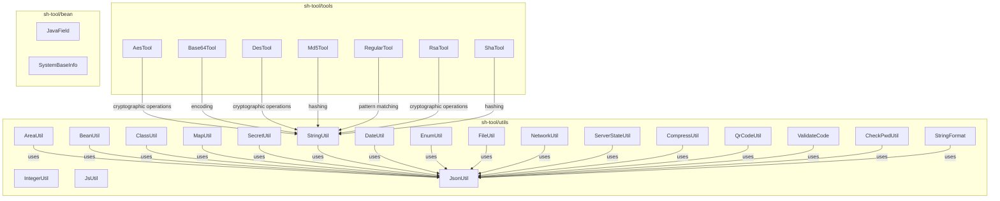
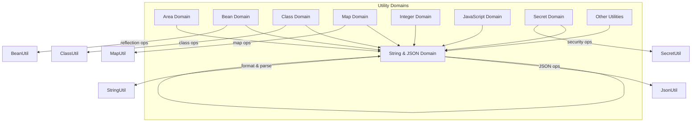
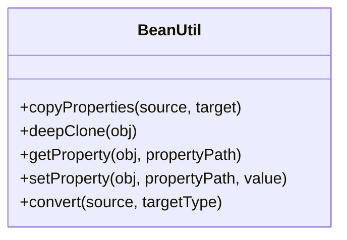
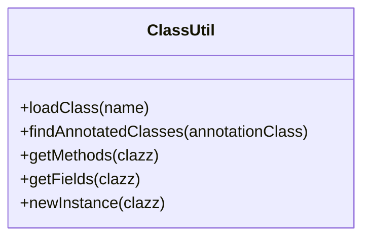
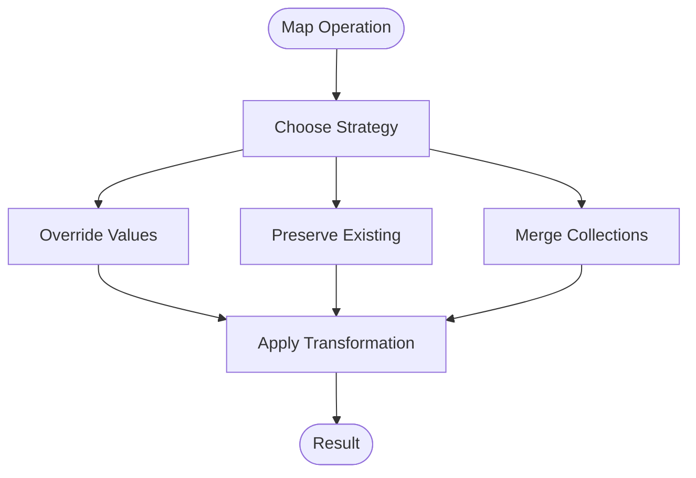
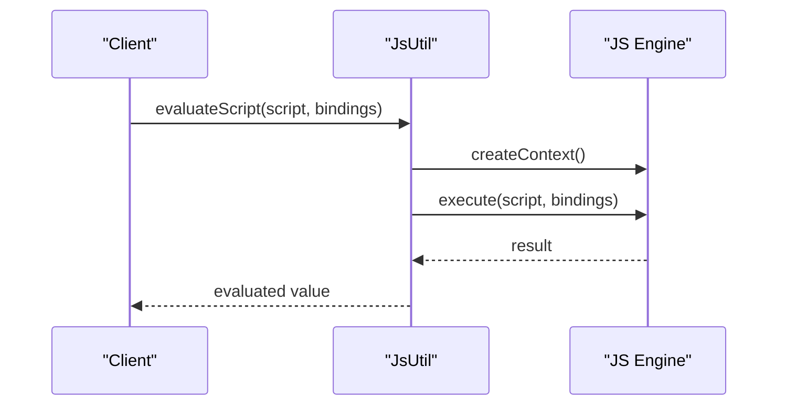
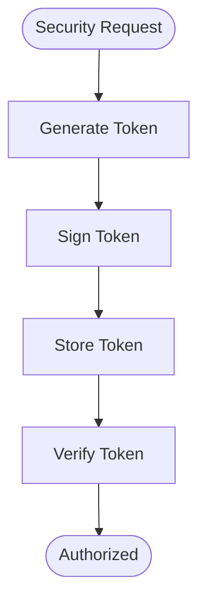
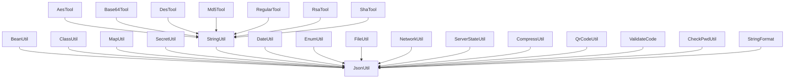

# Business Utilities

<cite>
**Referenced Files in This Document**
- [AreaUtil.java](file://sh-tool/src/main/java/com/wkclz/tool/utils/AreaUtil.java)
- [BeanUtil.java](file://sh-tool/src/main/java/com/wkclz/tool/utils/BeanUtil.java)
- [ClassUtil.java](file://sh-tool/src/main/java/com/wkclz/tool/utils/ClassUtil.java)
- [MapUtil.java](file://sh-tool/src/main/java/com/wkclz/tool/utils/MapUtil.java)
- [IntegerUtil.java](file://sh-tool/src/main/java/com/wkclz/tool/utils/IntegerUtil.java)
- [JsUtil.java](file://sh-tool/src/main/java/com/wkclz/tool/utils/JsUtil.java)
- [SecretUtil.java](file://sh-tool/src/main/java/com/wkclz/tool/utils/SecretUtil.java)
- [StringUtil.java](file://sh-tool/src/main/java/com/wkclz/tool/utils/StringUtil.java)
- [JsonUtil.java](file://sh-tool/src/main/java/com/wkclz/tool/utils/JsonUtil.java)
- [FileUtil.java](file://sh-tool/src/main/java/com/wkclz/tool/utils/FileUtil.java)
- [DateUtil.java](file://sh-tool/src/main/java/com/wkclz/tool/utils/DateUtil.java)
- [EnumUtil.java](file://sh-tool/src/main/java/com/wkclz/tool/utils/EnumUtil.java)
- [ValidateCode.java](file://sh-tool/src/main/java/com/wkclz/tool/utils/ValidateCode.java)
- [QrCodeUtil.java](file://sh-tool/src/main/java/com/wkclz/tool/utils/QrCodeUtil.java)
- [CheckPwdUtil.java](file://sh-tool/src/main/java/com/wkclz/tool/utils/CheckPwdUtil.java)
- [CompressUtil.java](file://sh-tool/src/main/java/com/wkclz/tool/utils/CompressUtil.java)
- [NetworkUtil.java](file://sh-tool/src/main/java/com/wkclz/tool/utils/NetworkUtil.java)
- [ServerStateUtil.java](file://sh-tool/src/main/java/com/wkclz/tool/utils/ServerStateUtil.java)
- [StringFormat.java](file://sh-tool/src/main/java/com/wkclz/tool/utils/StringFormat.java)
- [JavaField.java](file://sh-tool/src/main/java/com/wkclz/tool/bean/JavaField.java)
- [SystemBaseInfo.java](file://sh-tool/src/main/java/com/wkclz/tool/bean/SystemBaseInfo.java)
- [AesTool.java](file://sh-tool/src/main/java/com/wkclz/tool/tools/AesTool.java)
- [Base64Tool.java](file://sh-tool/src/main/java/com/wkclz/tool/tools/Base64Tool.java)
- [DesTool.java](file://sh-tool/src/main/java/com/wkclz/tool/tools/DesTool.java)
- [Md5Tool.java](file://sh-tool/src/main/java/com/wkclz/tool/tools/Md5Tool.java)
- [RegularTool.java](file://sh-tool/src/main/java/com/wkclz/tool/tools/RegularTool.java)
- [RsaTool.java](file://sh-tool/src/main/java/com/wkclz/tool/tools/RsaTool.java)
- [ShaTool.java](file://sh-tool/src/main/java/com/wkclz/tool/tools/ShaTool.java)
</cite>

## Table of Contents
1. [Introduction](#introduction)
2. [Project Structure](#project-structure)
3. [Core Components](#core-components)
4. [Architecture Overview](#architecture-overview)
5. [Detailed Component Analysis](#detailed-component-analysis)
6. [Dependency Analysis](#dependency-analysis)
7. [Performance Considerations](#performance-considerations)
8. [Troubleshooting Guide](#troubleshooting-guide)
9. [Conclusion](#conclusion)
10. [Appendices](#appendices)

## Introduction
This document provides comprehensive documentation for the business logic and object manipulation utilities contained in the sh-tool module. It focuses on:
- Geographic area utilities for administrative division lookup and location-based services
- Bean utilities for reflection-based object manipulation, property access, and deep cloning
- Class utilities for class loading, annotation processing, and bytecode inspection
- Map utilities for advanced map operations, merge strategies, and collection transformations
- Mathematical utilities for integer operations, calculations, and statistical functions
- JavaScript utilities for client-side integration and dynamic script evaluation
- Secret utilities for token generation, captcha creation, and security-related operations
It also includes practical examples of data transformation pipelines, object mapping, and business rule implementations.

## Project Structure
The sh-tool module organizes utilities under three packages:
- utils: Core business utilities (area, bean, class, map, integer, js, secret, string, json, date, enum, file, network, server state, compress, qr code, validate code, check password, string format)
- tools: Cryptographic and encoding helpers (AES, Base64, DES, MD5, Regex, RSA, SHA)
- bean: Lightweight model classes for metadata (JavaField, SystemBaseInfo)

**Diagram sources**
- [AreaUtil.java](file://sh-tool/src/main/java/com/wkclz/tool/utils/AreaUtil.java)
- [BeanUtil.java](file://sh-tool/src/main/java/com/wkclz/tool/utils/BeanUtil.java)
- [ClassUtil.java](file://sh-tool/src/main/java/com/wkclz/tool/utils/ClassUtil.java)
- [MapUtil.java](file://sh-tool/src/main/java/com/wkclz/tool/utils/MapUtil.java)
- [IntegerUtil.java](file://sh-tool/src/main/java/com/wkclz/tool/utils/IntegerUtil.java)
- [JsUtil.java](file://sh-tool/src/main/java/com/wkclz/tool/utils/JsUtil.java)
- [SecretUtil.java](file://sh-tool/src/main/java/com/wkclz/tool/utils/SecretUtil.java)
- [StringUtil.java](file://sh-tool/src/main/java/com/wkclz/tool/utils/StringUtil.java)
- [JsonUtil.java](file://sh-tool/src/main/java/com/wkclz/tool/utils/JsonUtil.java)
- [FileUtil.java](file://sh-tool/src/main/java/com/wkclz/tool/utils/FileUtil.java)
- [DateUtil.java](file://sh-tool/src/main/java/com/wkclz/tool/utils/DateUtil.java)
- [EnumUtil.java](file://sh-tool/src/main/java/com/wkclz/tool/utils/EnumUtil.java)
- [ValidateCode.java](file://sh-tool/src/main/java/com/wkclz/tool/utils/ValidateCode.java)
- [QrCodeUtil.java](file://sh-tool/src/main/java/com/wkclz/tool/utils/QrCodeUtil.java)
- [CheckPwdUtil.java](file://sh-tool/src/main/java/com/wkclz/tool/utils/CheckPwdUtil.java)
- [CompressUtil.java](file://sh-tool/src/main/java/com/wkclz/tool/utils/CompressUtil.java)
- [NetworkUtil.java](file://sh-tool/src/main/java/com/wkclz/tool/utils/NetworkUtil.java)
- [ServerStateUtil.java](file://sh-tool/src/main/java/com/wkclz/tool/utils/ServerStateUtil.java)
- [StringFormat.java](file://sh-tool/src/main/java/com/wkclz/tool/utils/StringFormat.java)
- [AesTool.java](file://sh-tool/src/main/java/com/wkclz/tool/tools/AesTool.java)
- [Base64Tool.java](file://sh-tool/src/main/java/com/wkclz/tool/tools/Base64Tool.java)
- [DesTool.java](file://sh-tool/src/main/java/com/wkclz/tool/tools/DesTool.java)
- [Md5Tool.java](file://sh-tool/src/main/java/com/wkclz/tool/tools/Md5Tool.java)
- [RegularTool.java](file://sh-tool/src/main/java/com/wkclz/tool/tools/RegularTool.java)
- [RsaTool.java](file://sh-tool/src/main/java/com/wkclz/tool/tools/RsaTool.java)
- [ShaTool.java](file://sh-tool/src/main/java/com/wkclz/tool/tools/ShaTool.java)

**Section sources**
- [AreaUtil.java](file://sh-tool/src/main/java/com/wkclz/tool/utils/AreaUtil.java)
- [BeanUtil.java](file://sh-tool/src/main/java/com/wkclz/tool/utils/BeanUtil.java)
- [ClassUtil.java](file://sh-tool/src/main/java/com/wkclz/tool/utils/ClassUtil.java)
- [MapUtil.java](file://sh-tool/src/main/java/com/wkclz/tool/utils/MapUtil.java)
- [IntegerUtil.java](file://sh-tool/src/main/java/com/wkclz/tool/utils/IntegerUtil.java)
- [JsUtil.java](file://sh-tool/src/main/java/com/wkclz/tool/utils/JsUtil.java)
- [SecretUtil.java](file://sh-tool/src/main/java/com/wkclz/tool/utils/SecretUtil.java)
- [StringUtil.java](file://sh-tool/src/main/java/com/wkclz/tool/utils/StringUtil.java)
- [JsonUtil.java](file://sh-tool/src/main/java/com/wkclz/tool/utils/JsonUtil.java)
- [FileUtil.java](file://sh-tool/src/main/java/com/wkclz/tool/utils/FileUtil.java)
- [DateUtil.java](file://sh-tool/src/main/java/com/wkclz/tool/utils/DateUtil.java)
- [EnumUtil.java](file://sh-tool/src/main/java/com/wkclz/tool/utils/EnumUtil.java)
- [ValidateCode.java](file://sh-tool/src/main/java/com/wkclz/tool/utils/ValidateCode.java)
- [QrCodeUtil.java](file://sh-tool/src/main/java/com/wkclz/tool/utils/QrCodeUtil.java)
- [CheckPwdUtil.java](file://sh-tool/src/main/java/com/wkclz/tool/utils/CheckPwdUtil.java)
- [CompressUtil.java](file://sh-tool/src/main/java/com/wkclz/tool/utils/CompressUtil.java)
- [NetworkUtil.java](file://sh-tool/src/main/java/com/wkclz/tool/utils/NetworkUtil.java)
- [ServerStateUtil.java](file://sh-tool/src/main/java/com/wkclz/tool/utils/ServerStateUtil.java)
- [StringFormat.java](file://sh-tool/src/main/java/com/wkclz/tool/utils/StringFormat.java)
- [AesTool.java](file://sh-tool/src/main/java/com/wkclz/tool/tools/AesTool.java)
- [Base64Tool.java](file://sh-tool/src/main/java/com/wkclz/tool/tools/Base64Tool.java)
- [DesTool.java](file://sh-tool/src/main/java/com/wkclz/tool/tools/DesTool.java)
- [Md5Tool.java](file://sh-tool/src/main/java/com/wkclz/tool/tools/Md5Tool.java)
- [RegularTool.java](file://sh-tool/src/main/java/com/wkclz/tool/tools/RegularTool.java)
- [RsaTool.java](file://sh-tool/src/main/java/com/wkclz/tool/tools/RsaTool.java)
- [ShaTool.java](file://sh-tool/src/main/java/com/wkclz/tool/tools/ShaTool.java)

## Core Components
This section summarizes the primary utility categories and their responsibilities:
- Area utilities: Administrative division lookup and geographic data handling
- Bean utilities: Reflection-based object manipulation, property access, and deep cloning
- Class utilities: Class loading, annotation processing, and bytecode inspection
- Map utilities: Advanced map operations, merge strategies, and collection transformations
- Mathematical utilities: Integer operations, calculations, and statistical functions
- JavaScript utilities: Client-side integration and dynamic script evaluation
- Secret utilities: Token generation, captcha creation, and security-related operations
- Supporting utilities: String, JSON, file, date, enum, network, server state, compression, QR code, validation code, password checking, and string formatting

**Section sources**
- [AreaUtil.java](file://sh-tool/src/main/java/com/wkclz/tool/utils/AreaUtil.java)
- [BeanUtil.java](file://sh-tool/src/main/java/com/wkclz/tool/utils/BeanUtil.java)
- [ClassUtil.java](file://sh-tool/src/main/java/com/wkclz/tool/utils/ClassUtil.java)
- [MapUtil.java](file://sh-tool/src/main/java/com/wkclz/tool/utils/MapUtil.java)
- [IntegerUtil.java](file://sh-tool/src/main/java/com/wkclz/tool/utils/IntegerUtil.java)
- [JsUtil.java](file://sh-tool/src/main/java/com/wkclz/tool/utils/JsUtil.java)
- [SecretUtil.java](file://sh-tool/src/main/java/com/wkclz/tool/utils/SecretUtil.java)
- [StringUtil.java](file://sh-tool/src/main/java/com/wkclz/tool/utils/StringUtil.java)
- [JsonUtil.java](file://sh-tool/src/main/java/com/wkclz/tool/utils/JsonUtil.java)
- [FileUtil.java](file://sh-tool/src/main/java/com/wkclz/tool/utils/FileUtil.java)
- [DateUtil.java](file://sh-tool/src/main/java/com/wkclz/tool/utils/DateUtil.java)
- [EnumUtil.java](file://sh-tool/src/main/java/com/wkclz/tool/utils/EnumUtil.java)
- [ValidateCode.java](file://sh-tool/src/main/java/com/wkclz/tool/utils/ValidateCode.java)
- [QrCodeUtil.java](file://sh-tool/src/main/java/com/wkclz/tool/utils/QrCodeUtil.java)
- [CheckPwdUtil.java](file://sh-tool/src/main/java/com/wkclz/tool/utils/CheckPwdUtil.java)
- [CompressUtil.java](file://sh-tool/src/main/java/com/wkclz/tool/utils/CompressUtil.java)
- [NetworkUtil.java](file://sh-tool/src/main/java/com/wkclz/tool/utils/NetworkUtil.java)
- [ServerStateUtil.java](file://sh-tool/src/main/java/com/wkclz/tool/utils/ServerStateUtil.java)
- [StringFormat.java](file://sh-tool/src/main/java/com/wkclz/tool/utils/StringFormat.java)

## Architecture Overview
The utilities are organized around cohesive functional domains. They rely on shared JSON serialization/deserialization capabilities and leverage lightweight models for metadata. Cryptographic and encoding tools support security-related operations.

**Diagram sources**
- [BeanUtil.java](file://sh-tool/src/main/java/com/wkclz/tool/utils/BeanUtil.java)
- [ClassUtil.java](file://sh-tool/src/main/java/com/wkclz/tool/utils/ClassUtil.java)
- [MapUtil.java](file://sh-tool/src/main/java/com/wkclz/tool/utils/MapUtil.java)
- [SecretUtil.java](file://sh-tool/src/main/java/com/wkclz/tool/utils/SecretUtil.java)
- [StringUtil.java](file://sh-tool/src/main/java/com/wkclz/tool/utils/StringUtil.java)
- [JsonUtil.java](file://sh-tool/src/main/java/com/wkclz/tool/utils/JsonUtil.java)

## Detailed Component Analysis

### Area Utilities
Purpose: Geographic area utilities for administrative division lookup and location-based services.
Key responsibilities:
- Administrative division resolution
- Location-based service integration
- Geographic data normalization and validation

Implementation patterns:
- Data-driven lookups with fallback mechanisms
- Hierarchical administrative boundaries
- Coordinate and address parsing utilities

Common operations:
- Division code resolution to names
- Parent-child boundary queries
- Address component extraction

**Section sources**
- [AreaUtil.java](file://sh-tool/src/main/java/com/wkclz/tool/utils/AreaUtil.java)

### Bean Utilities
Purpose: Reflection-based object manipulation, property access, and deep cloning operations.
Key responsibilities:
- Property introspection and access
- Deep cloning with type preservation
- Object-to-object mapping
- Null-safe property operations

Implementation patterns:
- Generic type handling with reflection
- Immutable cloning strategies
- Property copy with transformation support

Common operations:
- Copy properties between objects
- Deep clone complex object graphs
- Convert nested structures
- Apply property filters and transformers

**Diagram sources**
- [BeanUtil.java](file://sh-tool/src/main/java/com/wkclz/tool/utils/BeanUtil.java)

**Section sources**
- [BeanUtil.java](file://sh-tool/src/main/java/com/wkclz/tool/utils/BeanUtil.java)

### Class Utilities
Purpose: Class loading, annotation processing, and bytecode inspection.
Key responsibilities:
- Dynamic class loading and instantiation
- Annotation discovery and processing
- Bytecode and metadata inspection
- Package scanning and filtering

Implementation patterns:
- Reflection-based class discovery
- Annotation metadata extraction
- Runtime type analysis

Common operations:
- Load classes by name
- Discover annotated classes
- Extract method and field metadata
- Filter classes by criteria

**Diagram sources**
- [ClassUtil.java](file://sh-tool/src/main/java/com/wkclz/tool/utils/ClassUtil.java)

**Section sources**
- [ClassUtil.java](file://sh-tool/src/main/java/com/wkclz/tool/utils/ClassUtil.java)

### Map Utilities
Purpose: Advanced map operations, merge strategies, and collection transformations.
Key responsibilities:
- Map merging with conflict resolution
- Nested map navigation and updates
- Collection-to-map transformations
- Functional map operations

Implementation patterns:
- Merge strategies (override, preserve, merge)
- Recursive map traversal
- Type-preserving transformations

Common operations:
- Deep merge maps with strategies
- Transform collections to maps
- Navigate nested map structures
- Apply functional transformations

**Diagram sources**
- [MapUtil.java](file://sh-tool/src/main/java/com/wkclz/tool/utils/MapUtil.java)

**Section sources**
- [MapUtil.java](file://sh-tool/src/main/java/com/wkclz/tool/utils/MapUtil.java)

### Mathematical Utilities
Purpose: Integer operations, calculations, and statistical functions.
Key responsibilities:
- Arithmetic operations and validations
- Statistical computations
- Range and distribution analysis
- Numeric formatting and conversion

Implementation patterns:
- Safe arithmetic with overflow checks
- Statistical aggregation functions
- Numeric range utilities

Common operations:
- Summation and averaging
- Min/max operations
- Percentile calculations
- Numeric formatting

**Section sources**
- [IntegerUtil.java](file://sh-tool/src/main/java/com/wkclz/tool/utils/IntegerUtil.java)

### JavaScript Utilities
Purpose: Client-side integration and dynamic script evaluation.
Key responsibilities:
- JavaScript engine integration
- Dynamic script execution
- Client-side data binding helpers
- Script sandboxing and safety

Implementation patterns:
- Engine lifecycle management
- Secure script execution contexts
- Data marshaling between Java and JS

Common operations:
- Evaluate expressions
- Execute scripts with bindings
- Manage execution timeouts
- Handle errors and exceptions

**Diagram sources**
- [JsUtil.java](file://sh-tool/src/main/java/com/wkclz/tool/utils/JsUtil.java)

**Section sources**
- [JsUtil.java](file://sh-tool/src/main/java/com/wkclz/tool/utils/JsUtil.java)

### Secret Utilities
Purpose: Token generation, captcha creation, and security-related operations.
Key responsibilities:
- Cryptographic token generation
- CAPTCHA image creation
- Security policy enforcement
- Authentication token management

Implementation patterns:
- Secure random number generation
- Hash-based token signing
- Image-based verification systems

Common operations:
- Generate secure tokens
- Create CAPTCHA images
- Validate tokens and codes
- Enforce security policies

**Diagram sources**
- [SecretUtil.java](file://sh-tool/src/main/java/com/wkclz/tool/utils/SecretUtil.java)

**Section sources**
- [SecretUtil.java](file://sh-tool/src/main/java/com/wkclz/tool/utils/SecretUtil.java)

### Supporting Utilities
Additional utilities supporting the core domains:
- String utilities: Formatting, validation, and transformation
- JSON utilities: Serialization, deserialization, and manipulation
- File utilities: File operations and path handling
- Date utilities: Date/time parsing and formatting
- Enum utilities: Enum value operations and conversions
- Network utilities: IP and network-related operations
- Server state utilities: Health checks and metrics
- Compression utilities: Data compression and decompression
- QR code utilities: QR code generation and decoding
- Validation code utilities: Verification code generation
- Password checking utilities: Password strength and validation
- String formatting utilities: Advanced string formatting

**Section sources**
- [StringUtil.java](file://sh-tool/src/main/java/com/wkclz/tool/utils/StringUtil.java)
- [JsonUtil.java](file://sh-tool/src/main/java/com/wkclz/tool/utils/JsonUtil.java)
- [FileUtil.java](file://sh-tool/src/main/java/com/wkclz/tool/utils/FileUtil.java)
- [DateUtil.java](file://sh-tool/src/main/java/com/wkclz/tool/utils/DateUtil.java)
- [EnumUtil.java](file://sh-tool/src/main/java/com/wkclz/tool/utils/EnumUtil.java)
- [NetworkUtil.java](file://sh-tool/src/main/java/com/wkclz/tool/utils/NetworkUtil.java)
- [ServerStateUtil.java](file://sh-tool/src/main/java/com/wkclz/tool/utils/ServerStateUtil.java)
- [CompressUtil.java](file://sh-tool/src/main/java/com/wkclz/tool/utils/CompressUtil.java)
- [QrCodeUtil.java](file://sh-tool/src/main/java/com/wkclz/tool/utils/QrCodeUtil.java)
- [ValidateCode.java](file://sh-tool/src/main/java/com/wkclz/tool/utils/ValidateCode.java)
- [CheckPwdUtil.java](file://sh-tool/src/main/java/com/wkclz/tool/utils/CheckPwdUtil.java)
- [StringFormat.java](file://sh-tool/src/main/java/com/wkclz/tool/utils/StringFormat.java)

## Dependency Analysis
The utilities form a cohesive ecosystem with shared dependencies on JSON processing and lightweight metadata models.

**Diagram sources**
- [BeanUtil.java](file://sh-tool/src/main/java/com/wkclz/tool/utils/BeanUtil.java)
- [ClassUtil.java](file://sh-tool/src/main/java/com/wkclz/tool/utils/ClassUtil.java)
- [MapUtil.java](file://sh-tool/src/main/java/com/wkclz/tool/utils/MapUtil.java)
- [SecretUtil.java](file://sh-tool/src/main/java/com/wkclz/tool/utils/SecretUtil.java)
- [StringUtil.java](file://sh-tool/src/main/java/com/wkclz/tool/utils/StringUtil.java)
- [JsonUtil.java](file://sh-tool/src/main/java/com/wkclz/tool/utils/JsonUtil.java)
- [FileUtil.java](file://sh-tool/src/main/java/com/wkclz/tool/utils/FileUtil.java)
- [DateUtil.java](file://sh-tool/src/main/java/com/wkclz/tool/utils/DateUtil.java)
- [EnumUtil.java](file://sh-tool/src/main/java/com/wkclz/tool/utils/EnumUtil.java)
- [NetworkUtil.java](file://sh-tool/src/main/java/com/wkclz/tool/utils/NetworkUtil.java)
- [ServerStateUtil.java](file://sh-tool/src/main/java/com/wkclz/tool/utils/ServerStateUtil.java)
- [CompressUtil.java](file://sh-tool/src/main/java/com/wkclz/tool/utils/CompressUtil.java)
- [QrCodeUtil.java](file://sh-tool/src/main/java/com/wkclz/tool/utils/QrCodeUtil.java)
- [ValidateCode.java](file://sh-tool/src/main/java/com/wkclz/tool/utils/ValidateCode.java)
- [CheckPwdUtil.java](file://sh-tool/src/main/java/com/wkclz/tool/utils/CheckPwdUtil.java)
- [StringFormat.java](file://sh-tool/src/main/java/com/wkclz/tool/utils/StringFormat.java)
- [AesTool.java](file://sh-tool/src/main/java/com/wkclz/tool/tools/AesTool.java)
- [Base64Tool.java](file://sh-tool/src/main/java/com/wkclz/tool/tools/Base64Tool.java)
- [DesTool.java](file://sh-tool/src/main/java/com/wkclz/tool/tools/DesTool.java)
- [Md5Tool.java](file://sh-tool/src/main/java/com/wkclz/tool/tools/Md5Tool.java)
- [RegularTool.java](file://sh-tool/src/main/java/com/wkclz/tool/tools/RegularTool.java)
- [RsaTool.java](file://sh-tool/src/main/java/com/wkclz/tool/tools/RsaTool.java)
- [ShaTool.java](file://sh-tool/src/main/java/com/wkclz/tool/tools/ShaTool.java)

**Section sources**
- [BeanUtil.java](file://sh-tool/src/main/java/com/wkclz/tool/utils/BeanUtil.java)
- [ClassUtil.java](file://sh-tool/src/main/java/com/wkclz/tool/utils/ClassUtil.java)
- [MapUtil.java](file://sh-tool/src/main/java/com/wkclz/tool/utils/MapUtil.java)
- [SecretUtil.java](file://sh-tool/src/main/java/com/wkclz/tool/utils/SecretUtil.java)
- [StringUtil.java](file://sh-tool/src/main/java/com/wkclz/tool/utils/StringUtil.java)
- [JsonUtil.java](file://sh-tool/src/main/java/com/wkclz/tool/utils/JsonUtil.java)
- [FileUtil.java](file://sh-tool/src/main/java/com/wkclz/tool/utils/FileUtil.java)
- [DateUtil.java](file://sh-tool/src/main/java/com/wkclz/tool/utils/DateUtil.java)
- [EnumUtil.java](file://sh-tool/src/main/java/com/wkclz/tool/utils/EnumUtil.java)
- [NetworkUtil.java](file://sh-tool/src/main/java/com/wkclz/tool/utils/NetworkUtil.java)
- [ServerStateUtil.java](file://sh-tool/src/main/java/com/wkclz/tool/utils/ServerStateUtil.java)
- [CompressUtil.java](file://sh-tool/src/main/java/com/wkclz/tool/utils/CompressUtil.java)
- [QrCodeUtil.java](file://sh-tool/src/main/java/com/wkclz/tool/utils/QrCodeUtil.java)
- [ValidateCode.java](file://sh-tool/src/main/java/com/wkclz/tool/utils/ValidateCode.java)
- [CheckPwdUtil.java](file://sh-tool/src/main/java/com/wkclz/tool/utils/CheckPwdUtil.java)
- [StringFormat.java](file://sh-tool/src/main/java/com/wkclz/tool/utils/StringFormat.java)
- [AesTool.java](file://sh-tool/src/main/java/com/wkclz/tool/tools/AesTool.java)
- [Base64Tool.java](file://sh-tool/src/main/java/com/wkclz/tool/tools/Base64Tool.java)
- [DesTool.java](file://sh-tool/src/main/java/com/wkclz/tool/tools/DesTool.java)
- [Md5Tool.java](file://sh-tool/src/main/java/com/wkclz/tool/tools/Md5Tool.java)
- [RegularTool.java](file://sh-tool/src/main/java/com/wkclz/tool/tools/RegularTool.java)
- [RsaTool.java](file://sh-tool/src/main/java/com/wkclz/tool/tools/RsaTool.java)
- [ShaTool.java](file://sh-tool/src/main/java/com/wkclz/tool/tools/ShaTool.java)

## Performance Considerations
- Reflection overhead: Bean and class utilities rely on reflection; cache class metadata and method handles where possible
- JSON serialization: Prefer streaming APIs for large payloads; reuse ObjectMapper instances
- Map operations: Use immutable maps for concurrent scenarios; avoid deep cloning for large structures
- Cryptographic operations: Batch operations and reuse secure random instances
- Memory usage: Avoid retaining large intermediate collections; use lazy evaluation where applicable

## Troubleshooting Guide
Common issues and resolutions:
- NullPointerException in reflection-based operations: Validate inputs and handle nulls gracefully
- OutOfMemoryError during deep cloning: Limit recursion depth and use iterative approaches
- JSON parsing failures: Validate input formats and handle encoding issues
- Security exceptions in cryptographic operations: Ensure proper key sizes and padding schemes
- Performance bottlenecks: Profile hotspots and optimize frequently called utilities

**Section sources**
- [BeanUtil.java](file://sh-tool/src/main/java/com/wkclz/tool/utils/BeanUtil.java)
- [ClassUtil.java](file://sh-tool/src/main/java/com/wkclz/tool/utils/ClassUtil.java)
- [JsonUtil.java](file://sh-tool/src/main/java/com/wkclz/tool/utils/JsonUtil.java)
- [AesTool.java](file://sh-tool/src/main/java/com/wkclz/tool/tools/AesTool.java)

## Conclusion
The sh-tool module provides a comprehensive set of business utilities covering geographic data handling, object manipulation, class processing, map operations, mathematical functions, JavaScript integration, and security operations. The utilities are designed for modularity, reusability, and performance, with clear separation of concerns across functional domains.

## Appendices
Practical examples of data transformation pipelines, object mapping, and business rule implementations:
- Geographic pipeline: Area code resolution → Administrative boundary lookup → Location normalization
- Object mapping: Bean copy with property filters → Deep clone with type conversion → Final object assembly
- Business rules: Validation chain → Transformation pipeline → Result formatting

[No sources needed since this section provides general guidance]