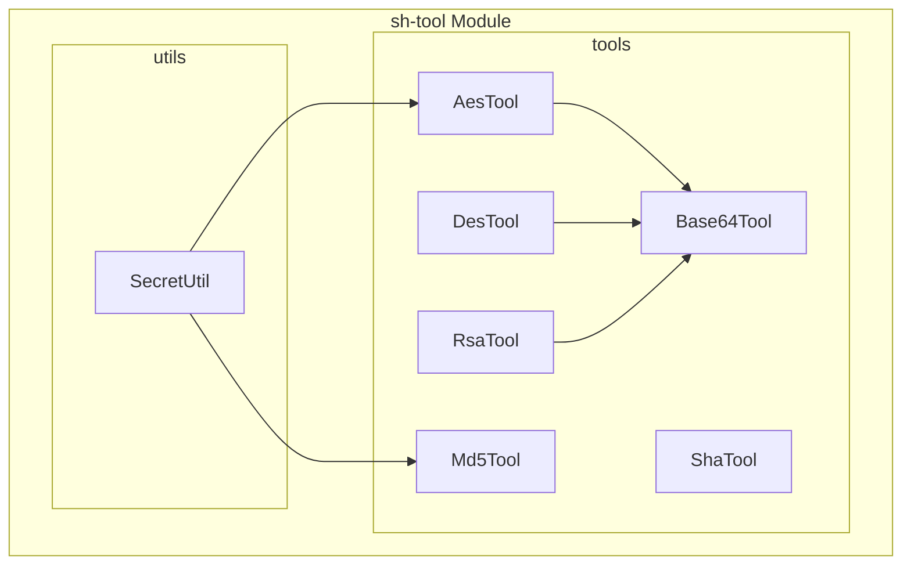
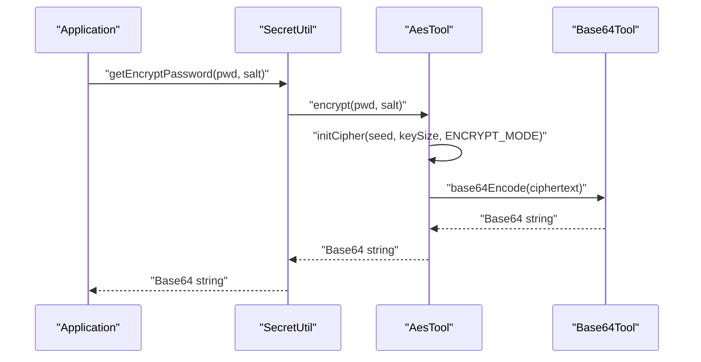
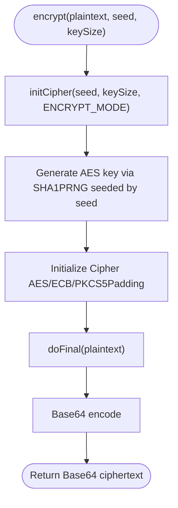
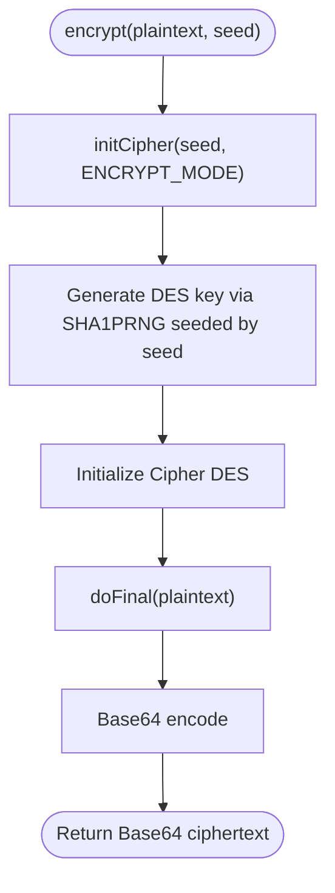
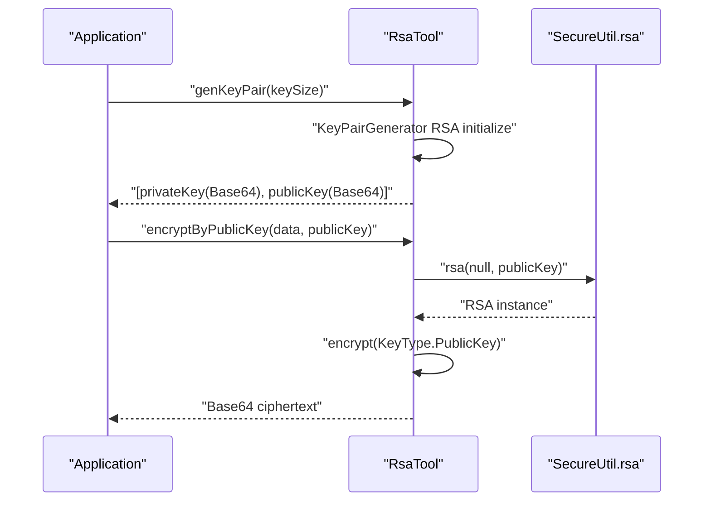
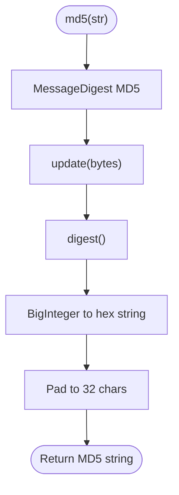
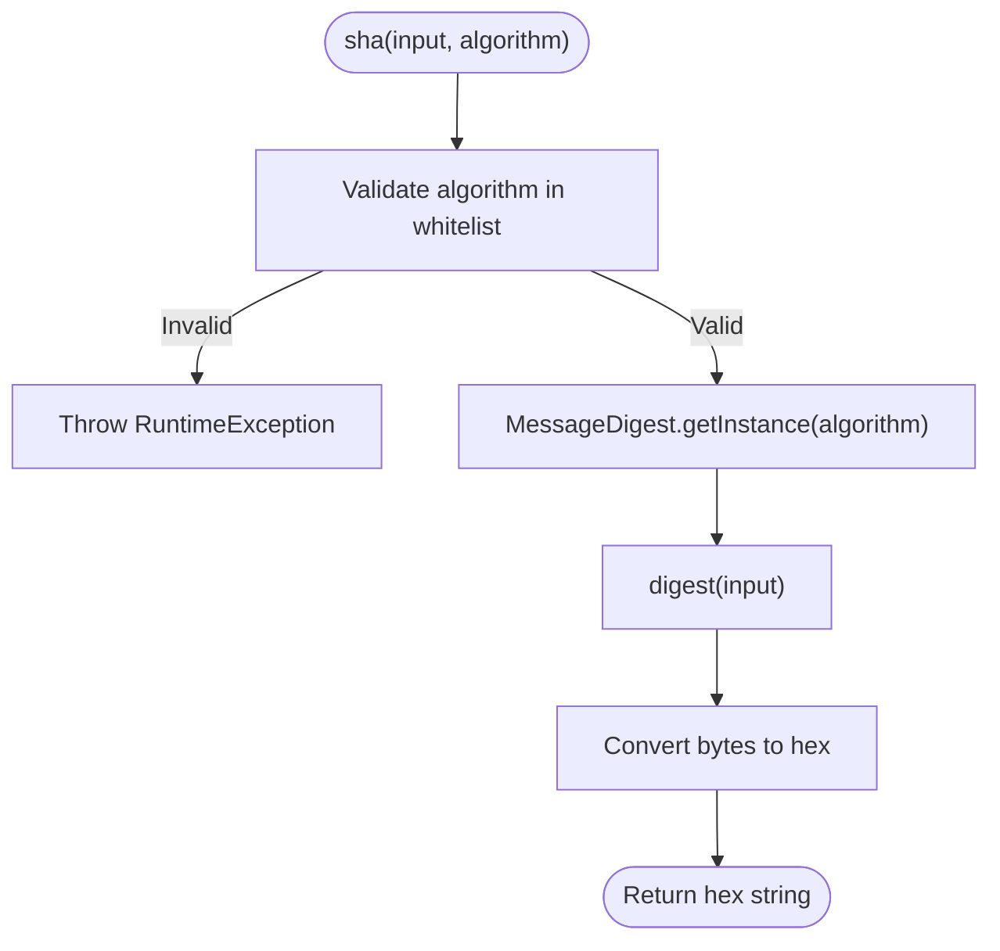
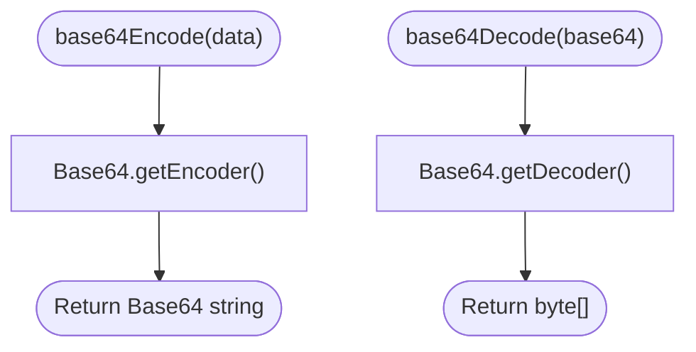
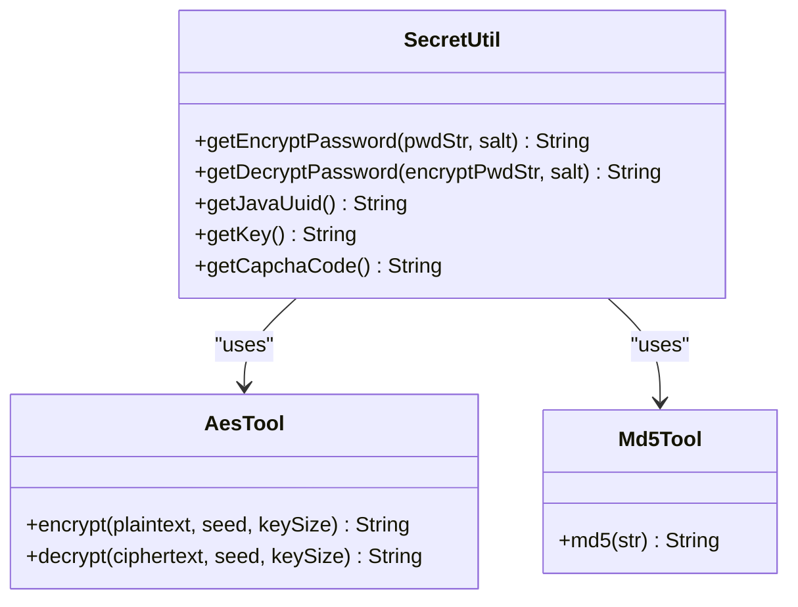
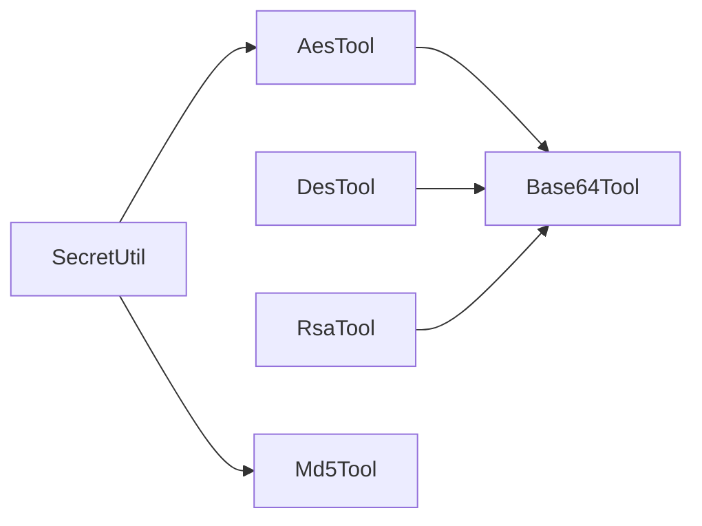

# Encryption Tools

<cite>
**Referenced Files in This Document**
- [AesTool.java](file://sh-tool/src/main/java/com/wkclz/tool/tools/AesTool.java)
- [DesTool.java](file://sh-tool/src/main/java/com/wkclz/tool/tools/DesTool.java)
- [RsaTool.java](file://sh-tool/src/main/java/com/wkclz/tool/tools/RsaTool.java)
- [Md5Tool.java](file://sh-tool/src/main/java/com/wkclz/tool/tools/Md5Tool.java)
- [ShaTool.java](file://sh-tool/src/main/java/com/wkclz/tool/tools/ShaTool.java)
- [Base64Tool.java](file://sh-tool/src/main/java/com/wkclz/tool/tools/Base64Tool.java)
- [SecretUtil.java](file://sh-tool/src/main/java/com/wkclz/tool/utils/SecretUtil.java)
- [US-027-Encryption Tools.md](file://docs/stories/US-027-加密工具集.md)
- [SKILL.md](file://.agents/skills/sh-tool/SKILL.md)
</cite>

## Table of Contents
1. [Introduction](#introduction)
2. [Project Structure](#project-structure)
3. [Core Components](#core-components)
4. [Architecture Overview](#architecture-overview)
5. [Detailed Component Analysis](#detailed-component-analysis)
6. [Dependency Analysis](#dependency-analysis)
7. [Performance Considerations](#performance-considerations)
8. [Troubleshooting Guide](#troubleshooting-guide)
9. [Best Practices and Security Guidelines](#best-practices-and-security-guidelines)
10. [Practical Examples](#practical-examples)
11. [Conclusion](#conclusion)

## Introduction
This document provides comprehensive documentation for the encryption utilities in the sh-framework. It covers symmetric encryption (AES and DES), asymmetric encryption (RSA), cryptographic hashes (MD5 and SHA), and Base64 encoding/decoding. It also documents the sensitive configuration encryption/decryption mechanism via SecretUtil and provides practical examples for securing user data, API communications, and password storage. Guidance on key rotation, secure random number generation, and performance considerations is included to help developers apply these tools safely and efficiently.

## Project Structure
The encryption utilities reside in the sh-tool module under the package com.wkclz.tool.tools, with supporting utilities in com.wkclz.tool.utils. The primary components are:
- Symmetric encryption: AES (AesTool) and DES (DesTool)
- Asymmetric encryption: RSA (RsaTool)
- Hash algorithms: MD5 (Md5Tool) and SHA (ShaTool)
- Encoding/decoding: Base64Tool
- Sensitive configuration utilities: SecretUtil

**Diagram sources**
- [AesTool.java:1-92](file://sh-tool/src/main/java/com/wkclz/tool/tools/AesTool.java#L1-L92)
- [DesTool.java:1-84](file://sh-tool/src/main/java/com/wkclz/tool/tools/DesTool.java#L1-L84)
- [RsaTool.java:1-127](file://sh-tool/src/main/java/com/wkclz/tool/tools/RsaTool.java#L1-L127)
- [Md5Tool.java:1-68](file://sh-tool/src/main/java/com/wkclz/tool/tools/Md5Tool.java#L1-L68)
- [ShaTool.java:1-60](file://sh-tool/src/main/java/com/wkclz/tool/tools/ShaTool.java#L1-L60)
- [Base64Tool.java:1-37](file://sh-tool/src/main/java/com/wkclz/tool/tools/Base64Tool.java#L1-L37)
- [SecretUtil.java:1-156](file://sh-tool/src/main/java/com/wkclz/tool/utils/SecretUtil.java#L1-L156)

**Section sources**
- [SKILL.md:10-47](file://.agents/skills/sh-tool/SKILL.md#L10-L47)
- [US-027-Encryption Tools.md:1-78](file://docs/stories/US-027-加密工具集.md#L1-L78)

## Core Components
- AesTool: Provides AES symmetric encryption/decryption with configurable key sizes (128/192/256 bits). Uses SHA-256 for key derivation and PKCS5Padding with ECB mode. Returns Base64-encoded ciphertext.
- DesTool: Provides DES symmetric encryption/decryption with a 56-bit effective key derived from a seed. Uses SHA-256 for key derivation and ECB mode. Returns Base64-encoded ciphertext.
- RsaTool: Generates RSA key pairs (1024/2048/4096 bits) and supports encryption/decryption using public/private keys. Keys are Base64-encoded. Includes conversion utilities for PEM-formatted keys.
- Md5Tool: Computes MD5 hashes in 32-character lowercase/uppercase and 16-character variants. Includes MD5 pattern validation.
- ShaTool: Computes SHA-1/256/384/512 hashes with strict algorithm whitelist validation.
- Base64Tool: Encodes/decodes binary data to/from Base64 strings.
- SecretUtil: Integrates AES-based password encryption/decryption, UUID generation, captcha code generation, and AES key generation using MD5 hashing.

**Section sources**
- [AesTool.java:11-75](file://sh-tool/src/main/java/com/wkclz/tool/tools/AesTool.java#L11-L75)
- [DesTool.java:11-67](file://sh-tool/src/main/java/com/wkclz/tool/tools/DesTool.java#L11-L67)
- [RsaTool.java:13-124](file://sh-tool/src/main/java/com/wkclz/tool/tools/RsaTool.java#L13-L124)
- [Md5Tool.java:8-64](file://sh-tool/src/main/java/com/wkclz/tool/tools/Md5Tool.java#L8-L64)
- [ShaTool.java:9-57](file://sh-tool/src/main/java/com/wkclz/tool/tools/ShaTool.java#L9-L57)
- [Base64Tool.java:5-33](file://sh-tool/src/main/java/com/wkclz/tool/tools/Base64Tool.java#L5-L33)
- [SecretUtil.java:15-156](file://sh-tool/src/main/java/com/wkclz/tool/utils/SecretUtil.java#L15-L156)

## Architecture Overview
The encryption utilities form a layered architecture:
- Application code invokes SecretUtil for high-level operations (password encryption, key generation).
- SecretUtil delegates to AesTool for AES operations and Md5Tool for key material derivation.
- AesTool and DesTool rely on Base64Tool for encoding/decoding during encryption/decryption.
- RsaTool uses Hutool’s RSA implementation and Base64Tool for key encoding.

**Diagram sources**
- [SecretUtil.java:59-67](file://sh-tool/src/main/java/com/wkclz/tool/utils/SecretUtil.java#L59-L67)
- [AesTool.java:21-36](file://sh-tool/src/main/java/com/wkclz/tool/tools/AesTool.java#L21-L36)
- [Base64Tool.java:12-14](file://sh-tool/src/main/java/com/wkclz/tool/tools/Base64Tool.java#L12-L14)

## Detailed Component Analysis

### AES Encryption (AesTool)
- Key management: Derives AES keys using SHA-256-based SecureRandom seeded from the provided seed. Supports 128/192/256-bit keys.
- Mode and padding: Uses AES/ECB/PKCS5Padding. Note: ECB mode is vulnerable to pattern analysis; consider CBC or GCM for production systems.
- Initialization: Initializes Cipher with a generated SecretKeySpec derived from the seed.
- Encoding: Returns Base64-encoded ciphertext; decryption expects Base64 input.

**Diagram sources**
- [AesTool.java:21-36](file://sh-tool/src/main/java/com/wkclz/tool/tools/AesTool.java#L21-L36)
- [AesTool.java:59-75](file://sh-tool/src/main/java/com/wkclz/tool/tools/AesTool.java#L59-L75)

**Section sources**
- [AesTool.java:11-75](file://sh-tool/src/main/java/com/wkclz/tool/tools/AesTool.java#L11-L75)

### DES Encryption (DesTool)
- Key management: Derives DES key using SHA-256-based SecureRandom seeded from the provided seed. Effective key length is 56 bits.
- Mode and padding: Uses DES in ECB mode without explicit padding.
- Encoding: Returns Base64-encoded ciphertext; decryption expects Base64 input.

**Diagram sources**
- [DesTool.java:19-31](file://sh-tool/src/main/java/com/wkclz/tool/tools/DesTool.java#L19-L31)
- [DesTool.java:51-67](file://sh-tool/src/main/java/com/wkclz/tool/tools/DesTool.java#L51-L67)

**Section sources**
- [DesTool.java:11-67](file://sh-tool/src/main/java/com/wkclz/tool/tools/DesTool.java#L11-L67)

### RSA Asymmetric Encryption (RsaTool)
- Key generation: Generates RSA key pairs with supported sizes 1024/2048/4096 bits using SunRsaSign provider and SecureRandom.
- Encoding: Returns Base64-encoded keys. Supports converting PEM-formatted private keys to PrivateKey objects.
- Operations: Supports encryption/decryption using public/private keys. Uses Hutool RSA utilities internally.

**Diagram sources**
- [RsaTool.java:19-46](file://sh-tool/src/main/java/com/wkclz/tool/tools/RsaTool.java#L19-L46)
- [RsaTool.java:60-70](file://sh-tool/src/main/java/com/wkclz/tool/tools/RsaTool.java#L60-L70)

**Section sources**
- [RsaTool.java:13-124](file://sh-tool/src/main/java/com/wkclz/tool/tools/RsaTool.java#L13-L124)

### MD5 Hash (Md5Tool)
- Computes MD5 hashes in 32-character lowercase/uppercase and 16-character variants (middle 16 characters).
- Validates MD5 strings using a strict 32-character hexadecimal pattern.

**Diagram sources**
- [Md5Tool.java:39-57](file://sh-tool/src/main/java/com/wkclz/tool/tools/Md5Tool.java#L39-L57)

**Section sources**
- [Md5Tool.java:8-64](file://sh-tool/src/main/java/com/wkclz/tool/tools/Md5Tool.java#L8-L64)

### SHA Hash (ShaTool)
- Supports SHA-1, SHA-256, SHA-384, and SHA-512.
- Enforces a whitelist of algorithms; invalid algorithms trigger runtime exceptions.
- Converts byte arrays to uppercase hexadecimal strings.

**Diagram sources**
- [ShaTool.java:26-44](file://sh-tool/src/main/java/com/wkclz/tool/tools/ShaTool.java#L26-L44)

**Section sources**
- [ShaTool.java:9-57](file://sh-tool/src/main/java/com/wkclz/tool/tools/ShaTool.java#L9-L57)

### Base64 Encoding/Decoding (Base64Tool)
- Encodes byte arrays and strings to Base64.
- Decodes Base64 strings to byte arrays and strings.

**Diagram sources**
- [Base64Tool.java:12-28](file://sh-tool/src/main/java/com/wkclz/tool/tools/Base64Tool.java#L12-L28)

**Section sources**
- [Base64Tool.java:5-33](file://sh-tool/src/main/java/com/wkclz/tool/tools/Base64Tool.java#L5-L33)

### Sensitive Configuration Utilities (SecretUtil)
- Password encryption/decryption: Uses AES with a provided salt; logs warnings when default salt is used.
- UUID generation: Produces lowercased UUIDs without hyphens.
- Captcha code generation: Generates 6-digit numeric codes using SecureRandom.
- AES key generation: Creates a 32-character MD5 hash from a UUID plus current timestamp.

**Diagram sources**
- [SecretUtil.java:59-120](file://sh-tool/src/main/java/com/wkclz/tool/utils/SecretUtil.java#L59-L120)
- [AesTool.java:21-57](file://sh-tool/src/main/java/com/wkclz/tool/tools/AesTool.java#L21-L57)
- [Md5Tool.java:39-57](file://sh-tool/src/main/java/com/wkclz/tool/tools/Md5Tool.java#L39-L57)

**Section sources**
- [SecretUtil.java:15-156](file://sh-tool/src/main/java/com/wkclz/tool/utils/SecretUtil.java#L15-L156)

## Dependency Analysis
- AesTool and DesTool depend on Base64Tool for encoding/decoding.
- RsaTool depends on Base64Tool for key encoding and Hutool RSA utilities.
- SecretUtil depends on AesTool and Md5Tool for password encryption and key generation.
- Md5Tool is used by SecretUtil for deriving AES keys.

**Diagram sources**
- [AesTool.java:32-32](file://sh-tool/src/main/java/com/wkclz/tool/tools/AesTool.java#L32-L32)
- [DesTool.java:27-27](file://sh-tool/src/main/java/com/wkclz/tool/tools/DesTool.java#L27-L27)
- [RsaTool.java:36-37](file://sh-tool/src/main/java/com/wkclz/tool/tools/RsaTool.java#L36-L37)
- [SecretUtil.java:62-62](file://sh-tool/src/main/java/com/wkclz/tool/utils/SecretUtil.java#L62-L62)
- [SecretUtil.java:119-119](file://sh-tool/src/main/java/com/wkclz/tool/utils/SecretUtil.java#L119-L119)

**Section sources**
- [SKILL.md:113-125](file://.agents/skills/sh-tool/SKILL.md#L113-L125)

## Performance Considerations
- AES and DES operations are CPU-bound; batch processing can improve throughput.
- Base64 encoding/decoding adds overhead; minimize unnecessary conversions.
- RSA key sizes 1024/2048/4096 trade off security and performance; choose 2048/4096 for modern applications.
- SHA-256/512 are slower than MD5 but recommended for integrity and security; consider hardware acceleration if available.
- ECB mode in AES/DES reveals patterns; for large datasets, prefer CBC/GCM modes to avoid plaintext correlation.

[No sources needed since this section provides general guidance]

## Troubleshooting Guide
Common issues and resolutions:
- Empty or null inputs: AES/DES/MD5/SHA throw runtime exceptions for null/empty inputs. Validate inputs before calling utilities.
- Invalid AES key size: AES restricts key sizes to 128/192/256 bits; ensure correct value is passed.
- Unsupported RSA key size: RSA key generation accepts only 1024/2048/4096 bits; verify key size parameter.
- SHA algorithm not in whitelist: SHA tool validates algorithms strictly; use SHA-1/256/384/512 only.
- ECB mode vulnerabilities: ECB does not hide repeated blocks; consider switching to CBC/GCM for sensitive data.
- Default salt usage warning: SecretUtil warns against default salt; always pass a strong, per-user salt.

**Section sources**
- [AesTool.java:25-27](file://sh-tool/src/main/java/com/wkclz/tool/tools/AesTool.java#L25-L27)
- [AesTool.java:64-66](file://sh-tool/src/main/java/com/wkclz/tool/tools/AesTool.java#L64-L66)
- [DesTool.java:52-54](file://sh-tool/src/main/java/com/wkclz/tool/tools/DesTool.java#L52-L54)
- [RsaTool.java:24-26](file://sh-tool/src/main/java/com/wkclz/tool/tools/RsaTool.java#L24-L26)
- [ShaTool.java:30-32](file://sh-tool/src/main/java/com/wkclz/tool/tools/ShaTool.java#L30-L32)
- [SecretUtil.java:94-97](file://sh-tool/src/main/java/com/wkclz/tool/utils/SecretUtil.java#L94-L97)

## Best Practices and Security Guidelines
- Key Management
  - Use per-user or per-record salts for password hashing; avoid default salts.
  - Rotate keys periodically; maintain old keys during transition for decryption.
  - Store keys separately from encrypted data; use hardware security modules (HSMs) when possible.
- Randomness
  - Use SecureRandom for generating keys, IVs, and salts.
  - Initialize SecureRandom with cryptographically secure seeds.
- Modes and Padding
  - Avoid ECB mode; prefer CBC or GCM with random IVs.
  - Ensure proper padding schemes (PKCS5/PKCS7) are applied consistently.
- Hashing
  - Prefer SHA-256/512 over MD5 for integrity and security.
  - For password hashing, consider bcrypt/scrypt/argon2; MD5 is unsuitable for passwords.
- Encoding
  - Always Base64-encode binary outputs for transport/storage.
- RSA
  - Use 2048-bit minimum; 4096-bit for long-term security.
  - Protect private keys; use PEM format with appropriate permissions.
- Configuration Encryption
  - Use SecretUtil for sensitive configuration encryption; manage salts and keys securely.

[No sources needed since this section provides general guidance]

## Practical Examples
- Encrypting User Data
  - Use AES with a per-user salt for sensitive fields (e.g., phone numbers, addresses).
  - Example invocation paths:
    - [AesTool.encrypt(...):21-23](file://sh-tool/src/main/java/com/wkclz/tool/tools/AesTool.java#L21-L23)
    - [AesTool.decrypt(...):42-44](file://sh-tool/src/main/java/com/wkclz/tool/tools/AesTool.java#L42-L44)
- Securing API Communications
  - Use RSA to exchange AES session keys; then use AES for payload encryption.
  - Example invocation paths:
    - [RsaTool.genKeyPair(...):19-26](file://sh-tool/src/main/java/com/wkclz/tool/tools/RsaTool.java#L19-L26)
    - [RsaTool.encryptByPublicKey(...):60-63](file://sh-tool/src/main/java/com/wkclz/tool/tools/RsaTool.java#L60-L63)
    - [RsaTool.decryptByPrivateKey(...):66-69](file://sh-tool/src/main/java/com/wkclz/tool/tools/RsaTool.java#L66-L69)
- Secure Password Storage
  - Use SecretUtil for AES-based password encryption with strong per-user salts.
  - Example invocation paths:
    - [SecretUtil.getEncryptPassword(...):59-67](file://sh-tool/src/main/java/com/wkclz/tool/utils/SecretUtil.java#L59-L67)
    - [SecretUtil.getDecryptPassword(...):84-92](file://sh-tool/src/main/java/com/wkclz/tool/utils/SecretUtil.java#L84-L92)
- Integrity Verification
  - Use SHA-256/512 for integrity checks; MD5 for legacy compatibility only.
  - Example invocation paths:
    - [ShaTool.sha256(...):16-17](file://sh-tool/src/main/java/com/wkclz/tool/tools/ShaTool.java#L16-L17)
    - [Md5Tool.md5lowerCase32(...):13-15](file://sh-tool/src/main/java/com/wkclz/tool/tools/Md5Tool.java#L13-L15)

**Section sources**
- [US-027-Encryption Tools.md:64-78](file://docs/stories/US-027-加密工具集.md#L64-L78)
- [SKILL.md:85-103](file://.agents/skills/sh-tool/SKILL.md#L85-L103)

## Conclusion
The sh-framework encryption utilities provide a cohesive set of symmetric/asymmetric encryption, hashing, and encoding tools suitable for common security needs. Developers should carefully select algorithms and modes, manage keys and salts securely, and adopt best practices for randomness and padding. SecretUtil offers a convenient integration point for sensitive configuration encryption and password handling, while AES/DES/RSA/MD5/SHA/Base64 provide building blocks for broader security implementations.