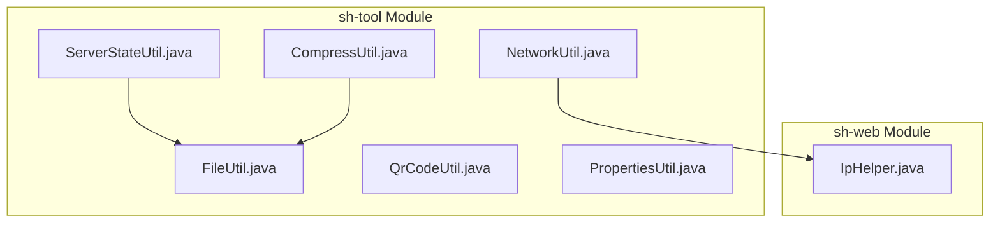
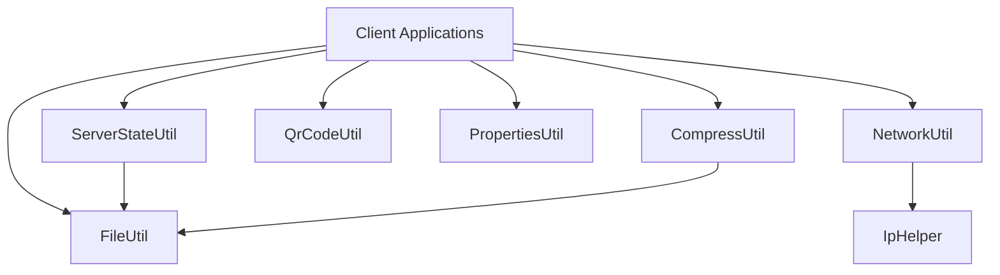
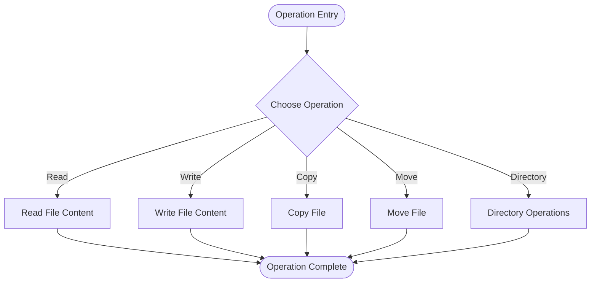
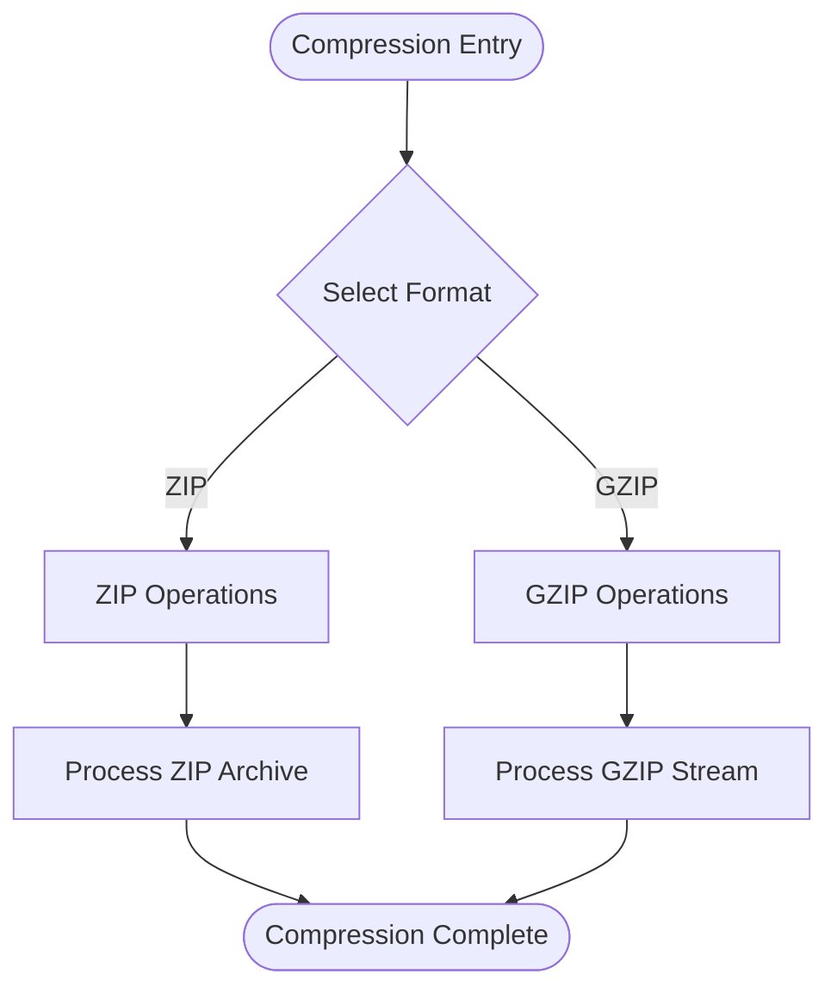
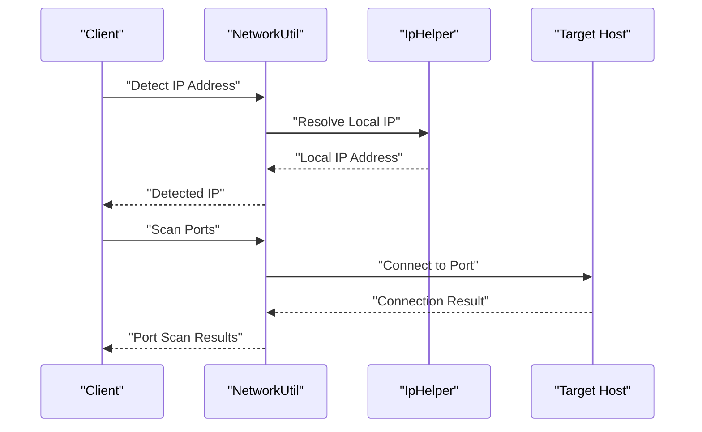
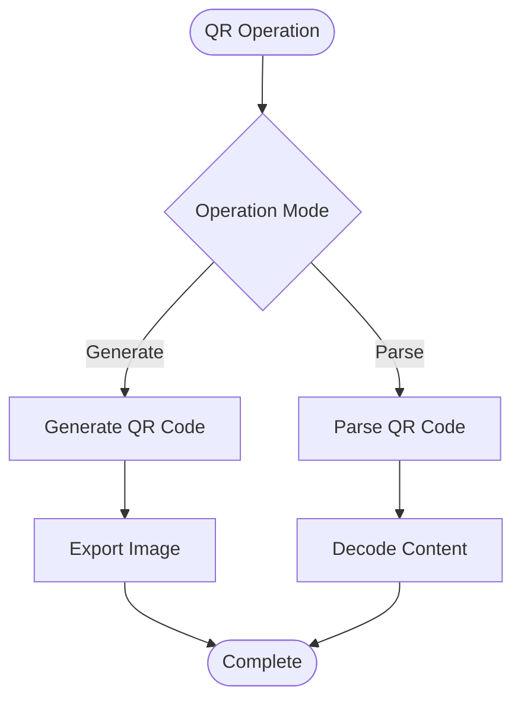
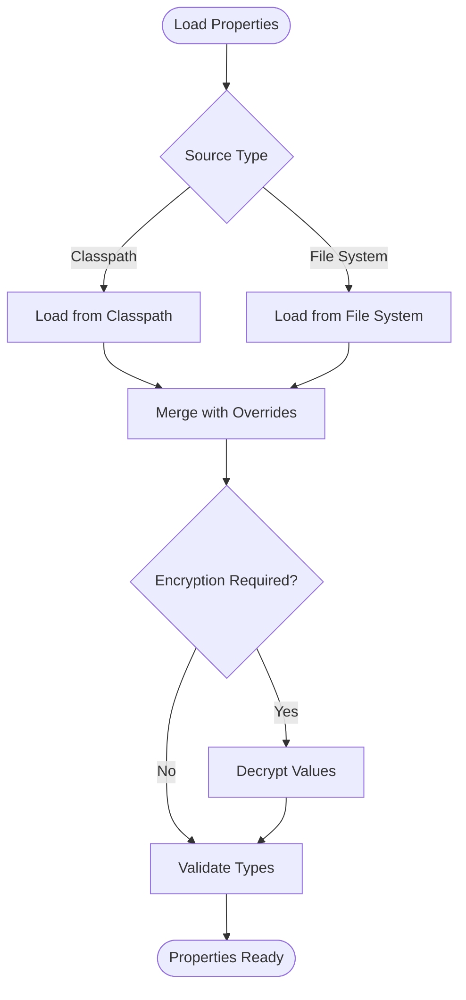
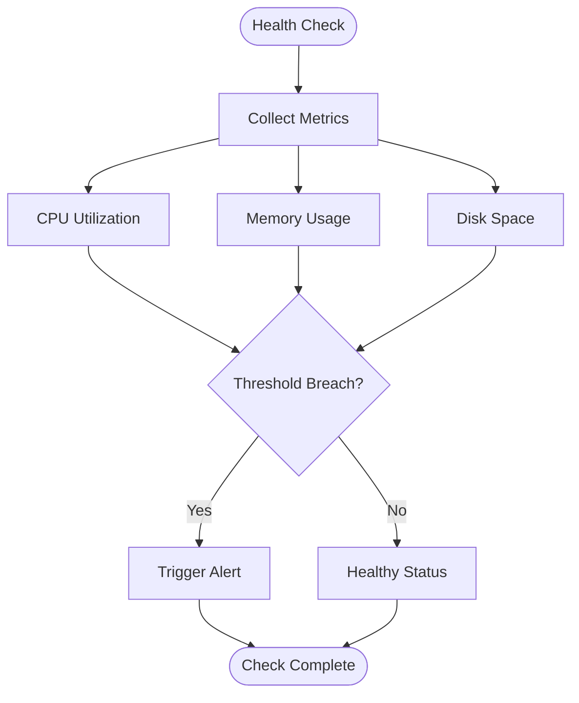
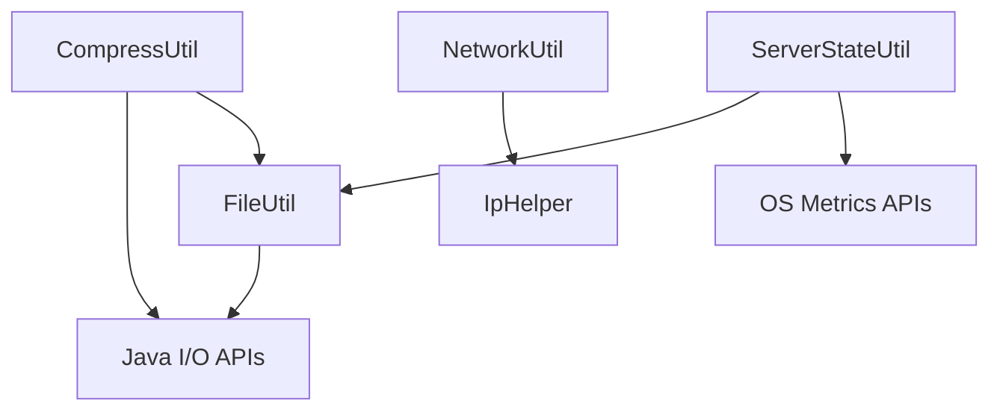

# File and Network Utilities

<cite>
**Referenced Files in This Document**
- [FileUtil.java](file://sh-tool/src/main/java/com/wkclz/tool/utils/FileUtil.java)
- [CompressUtil.java](file://sh-tool/src/main/java/com/wkclz/tool/utils/CompressUtil.java)
- [NetworkUtil.java](file://sh-tool/src/main/java/com/wkclz/tool/utils/NetworkUtil.java)
- [QrCodeUtil.java](file://sh-tool/src/main/java/com/wkclz/tool/utils/QrCodeUtil.java)
- [PropertiesUtil.java](file://sh-tool/src/main/java/com/wkclz/tool/utils/PropertiesUtil.java)
- [ServerStateUtil.java](file://sh-tool/src/main/java/com/wkclz/tool/utils/ServerStateUtil.java)
- [IpHelper.java](file://sh-web/src/main/java/com/wkclz/web/helper/IpHelper.java)
</cite>

## Table of Contents
1. [Introduction](#introduction)
2. [Project Structure](#project-structure)
3. [Core Components](#core-components)
4. [Architecture Overview](#architecture-overview)
5. [Detailed Component Analysis](#detailed-component-analysis)
6. [Dependency Analysis](#dependency-analysis)
7. [Performance Considerations](#performance-considerations)
8. [Troubleshooting Guide](#troubleshooting-guide)
9. [Conclusion](#conclusion)

## Introduction
This document provides comprehensive documentation for file system and network operation utilities within the framework. It covers file utilities for reading, writing, copying, moving, and managing files and directories; compression utilities for ZIP, GZIP, and other archive formats; network utilities for IP address detection, port scanning, URL handling, and HTTP operations; QR code generation and parsing utilities; properties file utilities for configuration management; and server state monitoring utilities for health checks and resource usage tracking. Practical examples demonstrate batch file operations, secure file transfers, network diagnostics, and automated backup processes.

## Project Structure
The utilities are primarily located in the sh-tool module under the utils package. Supporting network utilities are integrated via the sh-web module's IP helper. The following diagram illustrates the relationship between the relevant components.

**Diagram sources**
- [FileUtil.java](file://sh-tool/src/main/java/com/wkclz/tool/utils/FileUtil.java)
- [CompressUtil.java](file://sh-tool/src/main/java/com/wkclz/tool/utils/CompressUtil.java)
- [NetworkUtil.java](file://sh-tool/src/main/java/com/wkclz/tool/utils/NetworkUtil.java)
- [QrCodeUtil.java](file://sh-tool/src/main/java/com/wkclz/tool/utils/QrCodeUtil.java)
- [PropertiesUtil.java](file://sh-tool/src/main/java/com/wkclz/tool/utils/PropertiesUtil.java)
- [ServerStateUtil.java](file://sh-tool/src/main/java/com/wkclz/tool/utils/ServerStateUtil.java)
- [IpHelper.java](file://sh-web/src/main/java/com/wkclz/web/helper/IpHelper.java)

**Section sources**
- [FileUtil.java](file://sh-tool/src/main/java/com/wkclz/tool/utils/FileUtil.java)
- [CompressUtil.java](file://sh-tool/src/main/java/com/wkclz/tool/utils/CompressUtil.java)
- [NetworkUtil.java](file://sh-tool/src/main/java/com/wkclz/tool/utils/NetworkUtil.java)
- [QrCodeUtil.java](file://sh-tool/src/main/java/com/wkclz/tool/utils/QrCodeUtil.java)
- [PropertiesUtil.java](file://sh-tool/src/main/java/com/wkclz/tool/utils/PropertiesUtil.java)
- [ServerStateUtil.java](file://sh-tool/src/main/java/com/wkclz/tool/utils/ServerStateUtil.java)
- [IpHelper.java](file://sh-web/src/main/java/com/wkclz/web/helper/IpHelper.java)

## Core Components
This section outlines the primary utility components and their responsibilities:
- FileUtil: Provides file and directory operations including reading, writing, copying, moving, and metadata retrieval.
- CompressUtil: Handles compression and decompression for ZIP archives and related formats.
- NetworkUtil: Offers network diagnostics capabilities such as IP detection and port scanning.
- QrCodeUtil: Generates and parses QR codes for barcode functionality.
- PropertiesUtil: Manages configuration properties files for environment-specific settings.
- ServerStateUtil: Monitors server health and collects system metrics for resource usage tracking.

**Section sources**
- [FileUtil.java](file://sh-tool/src/main/java/com/wkclz/tool/utils/FileUtil.java)
- [CompressUtil.java](file://sh-tool/src/main/java/com/wkclz/tool/utils/CompressUtil.java)
- [NetworkUtil.java](file://sh-tool/src/main/java/com/wkclz/tool/utils/NetworkUtil.java)
- [QrCodeUtil.java](file://sh-tool/src/main/java/com/wkclz/tool/utils/QrCodeUtil.java)
- [PropertiesUtil.java](file://sh-tool/src/main/java/com/wkclz/tool/utils/PropertiesUtil.java)
- [ServerStateUtil.java](file://sh-tool/src/main/java/com/wkclz/tool/utils/ServerStateUtil.java)

## Architecture Overview
The utilities are designed as standalone components with minimal coupling. File and compression utilities depend on standard Java I/O APIs. Network utilities integrate with the web helper for IP resolution. Server state utilities rely on OS-level metrics and file system inspection for health checks.

**Diagram sources**
- [FileUtil.java](file://sh-tool/src/main/java/com/wkclz/tool/utils/FileUtil.java)
- [CompressUtil.java](file://sh-tool/src/main/java/com/wkclz/tool/utils/CompressUtil.java)
- [NetworkUtil.java](file://sh-tool/src/main/java/com/wkclz/tool/utils/NetworkUtil.java)
- [QrCodeUtil.java](file://sh-tool/src/main/java/com/wkclz/tool/utils/QrCodeUtil.java)
- [PropertiesUtil.java](file://sh-tool/src/main/java/com/wkclz/tool/utils/PropertiesUtil.java)
- [ServerStateUtil.java](file://sh-tool/src/main/java/com/wkclz/tool/utils/ServerStateUtil.java)
- [IpHelper.java](file://sh-web/src/main/java/com/wkclz/web/helper/IpHelper.java)

## Detailed Component Analysis

### File Utilities
FileUtil encapsulates common file and directory operations:
- Reading and writing files with configurable encoding and append modes
- Copying and moving files with overwrite controls
- Directory creation, deletion, and traversal
- File metadata retrieval (size, last modified time, permissions)
- Batch operations for efficient processing of multiple files

**Diagram sources**
- [FileUtil.java](file://sh-tool/src/main/java/com/wkclz/tool/utils/FileUtil.java)

**Section sources**
- [FileUtil.java](file://sh-tool/src/main/java/com/wkclz/tool/utils/FileUtil.java)

### Compression Utilities
CompressUtil provides compression and decompression capabilities:
- ZIP archive creation and extraction
- GZIP compression and decompression
- Archive validation and integrity checks
- Streaming compression for large files
- Multi-format support for interoperability

**Diagram sources**
- [CompressUtil.java](file://sh-tool/src/main/java/com/wkclz/tool/utils/CompressUtil.java)

**Section sources**
- [CompressUtil.java](file://sh-tool/src/main/java/com/wkclz/tool/utils/CompressUtil.java)

### Network Utilities
NetworkUtil offers network diagnostics and connectivity testing:
- IP address detection and validation
- Port scanning for service availability
- URL handling and normalization
- HTTP operations including GET, POST, and HEAD requests
- DNS resolution and reverse lookup

**Diagram sources**
- [NetworkUtil.java](file://sh-tool/src/main/java/com/wkclz/tool/utils/NetworkUtil.java)
- [IpHelper.java](file://sh-web/src/main/java/com/wkclz/web/helper/IpHelper.java)

**Section sources**
- [NetworkUtil.java](file://sh-tool/src/main/java/com/wkclz/tool/utils/NetworkUtil.java)
- [IpHelper.java](file://sh-web/src/main/java/com/wkclz/web/helper/IpHelper.java)

### QR Code Utilities
QrCodeUtil enables QR code generation and parsing:
- QR code generation from text, URLs, and binary data
- QR code parsing from images and byte arrays
- Configurable error correction levels
- Encoding format selection (UTF-8, ASCII, etc.)
- Image export and customization options

**Diagram sources**
- [QrCodeUtil.java](file://sh-tool/src/main/java/com/wkclz/tool/utils/QrCodeUtil.java)

**Section sources**
- [QrCodeUtil.java](file://sh-tool/src/main/java/com/wkclz/tool/utils/QrCodeUtil.java)

### Properties Utilities
PropertiesUtil manages configuration properties files:
- Loading properties from classpath and file system
- Environment-specific property overrides
- Type-safe property retrieval with defaults
- Property encryption and decryption support
- Hot-reload capability for dynamic configuration updates

**Diagram sources**
- [PropertiesUtil.java](file://sh-tool/src/main/java/com/wkclz/tool/utils/PropertiesUtil.java)

**Section sources**
- [PropertiesUtil.java](file://sh-tool/src/main/java/com/wkclz/tool/utils/PropertiesUtil.java)

### Server State Utilities
ServerStateUtil monitors system health and resource usage:
- CPU utilization tracking and thresholds
- Memory usage monitoring and garbage collection metrics
- Disk space and inode usage checks
- Process and thread count monitoring
- Health check endpoints and alerting integration

**Diagram sources**
- [ServerStateUtil.java](file://sh-tool/src/main/java/com/wkclz/tool/utils/ServerStateUtil.java)

**Section sources**
- [ServerStateUtil.java](file://sh-tool/src/main/java/com/wkclz/tool/utils/ServerStateUtil.java)

## Dependency Analysis
The utilities maintain loose coupling through clear interfaces and minimal external dependencies. File and compression utilities depend on standard Java I/O APIs. Network utilities integrate with the web helper for IP resolution. Server state utilities rely on OS-level metrics and file system inspection.

**Diagram sources**
- [FileUtil.java](file://sh-tool/src/main/java/com/wkclz/tool/utils/FileUtil.java)
- [CompressUtil.java](file://sh-tool/src/main/java/com/wkclz/tool/utils/CompressUtil.java)
- [NetworkUtil.java](file://sh-tool/src/main/java/com/wkclz/tool/utils/NetworkUtil.java)
- [IpHelper.java](file://sh-web/src/main/java/com/wkclz/web/helper/IpHelper.java)
- [ServerStateUtil.java](file://sh-tool/src/main/java/com/wkclz/tool/utils/ServerStateUtil.java)

**Section sources**
- [FileUtil.java](file://sh-tool/src/main/java/com/wkclz/tool/utils/FileUtil.java)
- [CompressUtil.java](file://sh-tool/src/main/java/com/wkclz/tool/utils/CompressUtil.java)
- [NetworkUtil.java](file://sh-tool/src/main/java/com/wkclz/tool/utils/NetworkUtil.java)
- [IpHelper.java](file://sh-web/src/main/java/com/wkclz/web/helper/IpHelper.java)
- [ServerStateUtil.java](file://sh-tool/src/main/java/com/wkclz/tool/utils/ServerStateUtil.java)

## Performance Considerations
- Use streaming APIs for large file operations to minimize memory footprint
- Implement batching for bulk operations to reduce I/O overhead
- Leverage compression for network transfers to improve throughput
- Apply connection pooling for HTTP operations to reduce latency
- Monitor resource usage proactively to prevent performance degradation

## Troubleshooting Guide
Common issues and resolutions:
- File permission errors: Verify write permissions and ownership for target directories
- Compression failures: Check available disk space and archive integrity
- Network timeouts: Validate firewall rules and DNS resolution
- QR code parsing errors: Ensure proper lighting and focus during image capture
- Property loading failures: Confirm file paths and encoding compatibility

**Section sources**
- [FileUtil.java](file://sh-tool/src/main/java/com/wkclz/tool/utils/FileUtil.java)
- [CompressUtil.java](file://sh-tool/src/main/java/com/wkclz/tool/utils/CompressUtil.java)
- [NetworkUtil.java](file://sh-tool/src/main/java/com/wkclz/tool/utils/NetworkUtil.java)
- [QrCodeUtil.java](file://sh-tool/src/main/java/com/wkclz/tool/utils/QrCodeUtil.java)
- [PropertiesUtil.java](file://sh-tool/src/main/java/com/wkclz/tool/utils/PropertiesUtil.java)
- [ServerStateUtil.java](file://sh-tool/src/main/java/com/wkclz/tool/utils/ServerStateUtil.java)

## Conclusion
The file system and network utilities provide a robust foundation for file operations, compression, networking, QR code functionality, configuration management, and server monitoring. Their modular design enables easy integration and maintenance while supporting scalable operations across diverse environments.