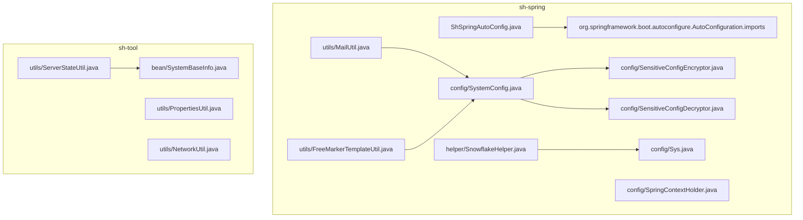
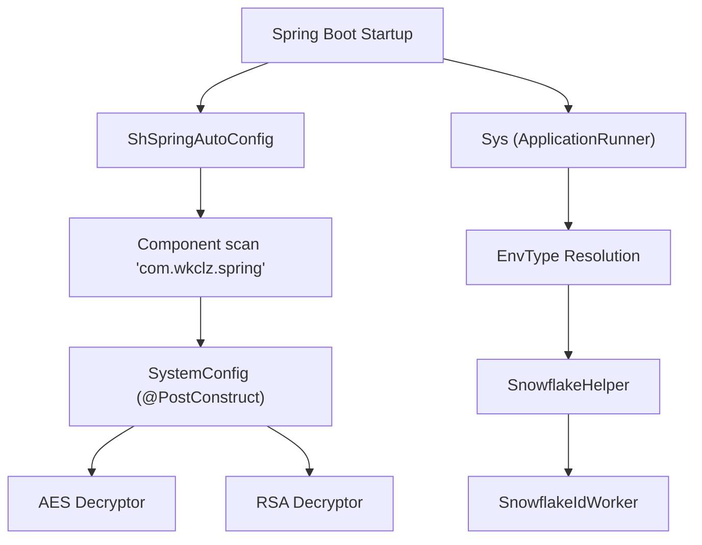
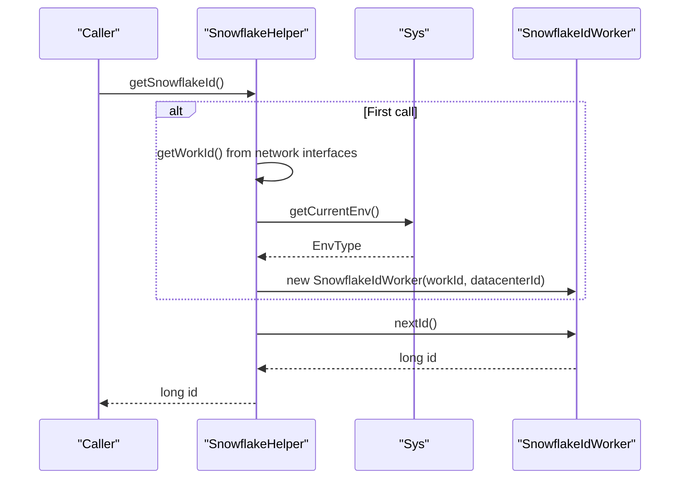
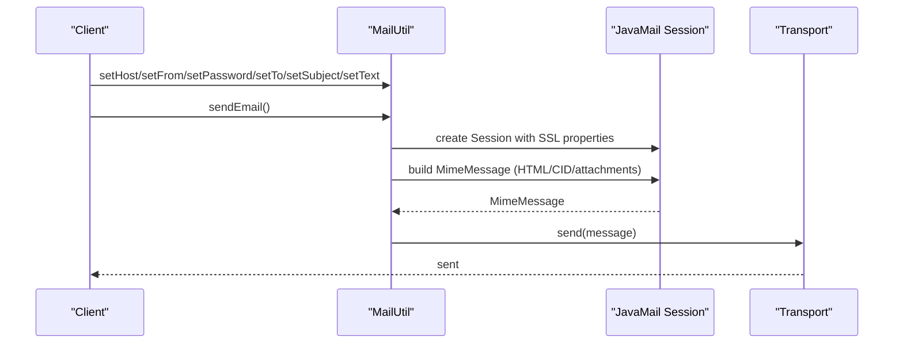
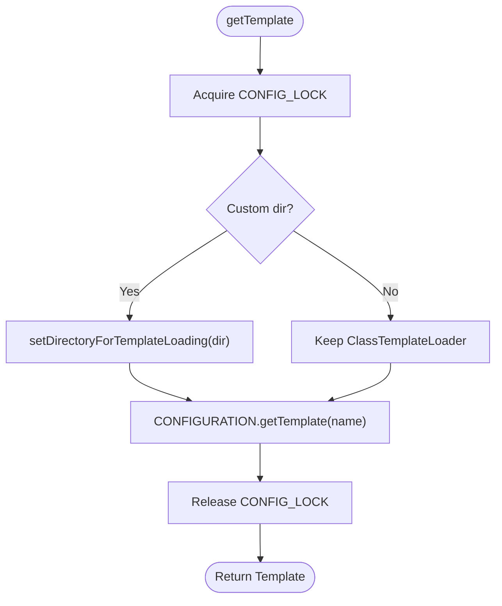
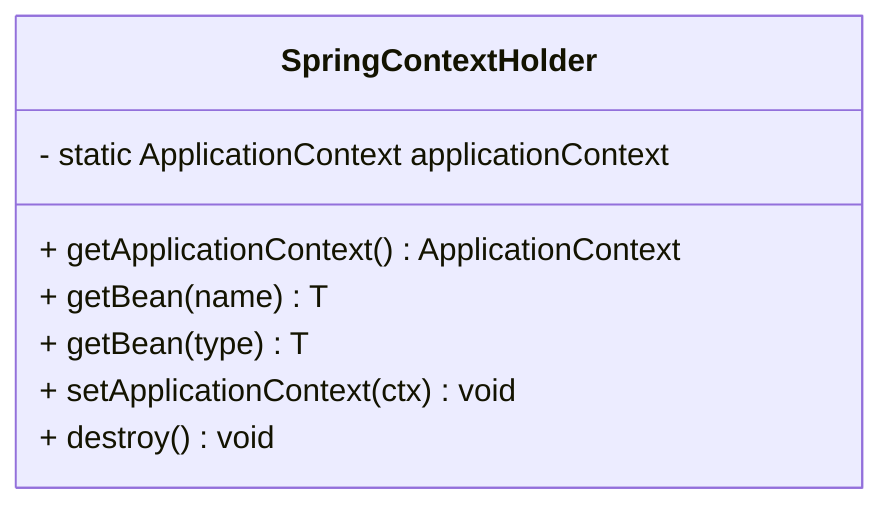
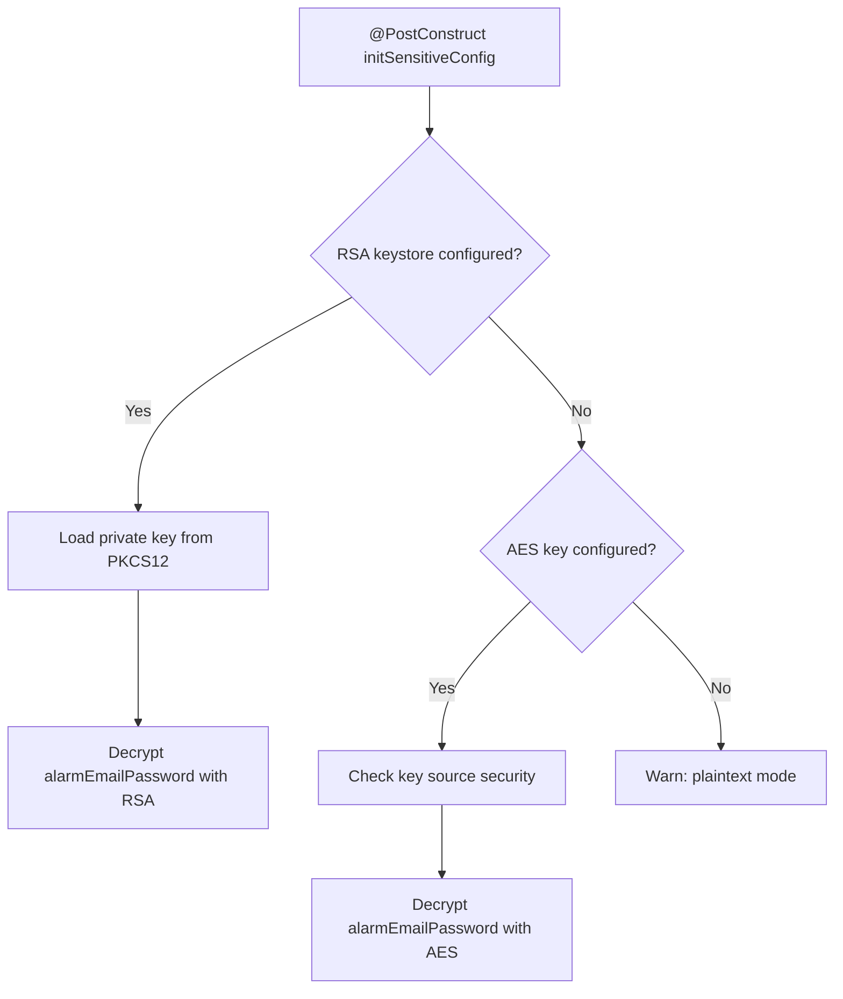
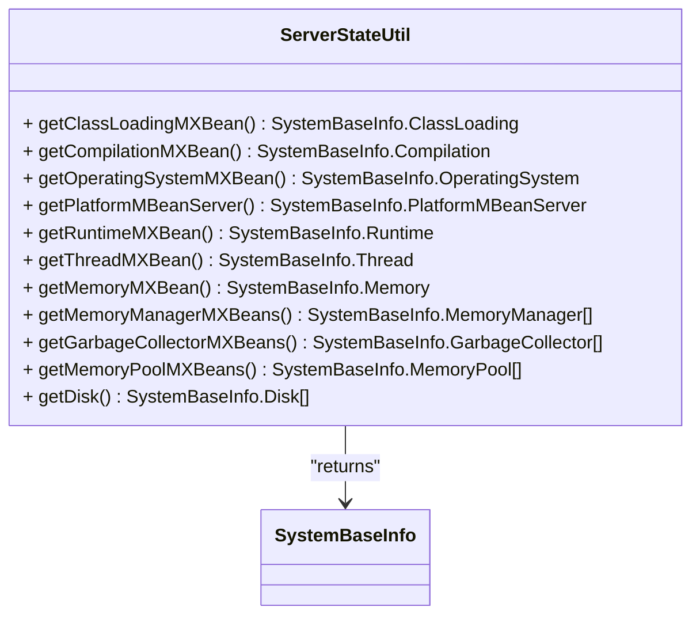
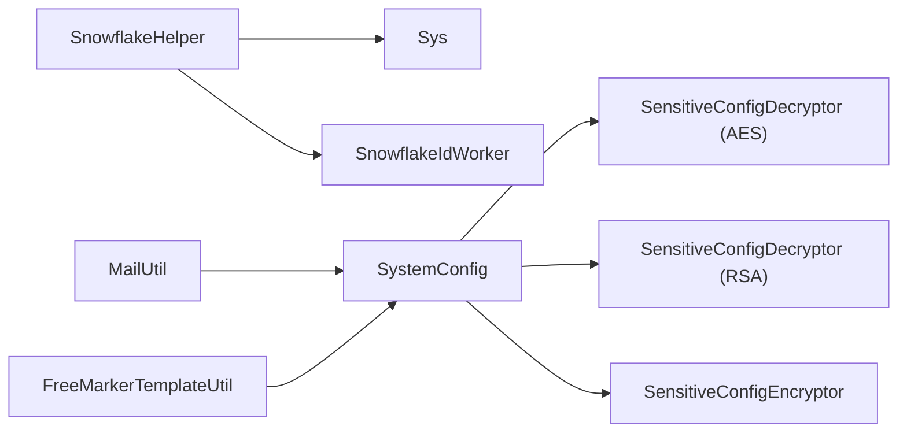

# Spring Boot Extensions

<cite>
**Referenced Files in This Document**
- [SnowflakeHelper.java](file://sh-spring/src/main/java/com/wkclz/spring/helper/SnowflakeHelper.java)
- [MailUtil.java](file://sh-spring/src/main/java/com/wkclz/spring/utils/MailUtil.java)
- [FreeMarkerTemplateUtil.java](file://sh-spring/src/main/java/com/wkclz/spring/utils/FreeMarkerTemplateUtil.java)
- [SpringContextHolder.java](file://sh-spring/src/main/java/com/wkclz/spring/config/SpringContextHolder.java)
- [SystemConfig.java](file://sh-spring/src/main/java/com/wkclz/spring/config/SystemConfig.java)
- [Sys.java](file://sh-spring/src/main/java/com/wkclz/spring/config/Sys.java)
- [ShSpringAutoConfig.java](file://sh-spring/src/main/java/com/wkclz/spring/ShSpringAutoConfig.java)
- [org.springframework.boot.autoconfigure.AutoConfiguration.imports](file://sh-spring/src/main/resources/META-INF/spring/org.springframework.boot.autoconfigure.AutoConfiguration.imports)
- [ServerStateUtil.java](file://sh-tool/src/main/java/com/wkclz/tool/utils/ServerStateUtil.java)
- [SystemBaseInfo.java](file://sh-tool/src/main/java/com/wkclz/tool/bean/SystemBaseInfo.java)
- [PropertiesUtil.java](file://sh-tool/src/main/java/com/wkclz/tool/utils/PropertiesUtil.java)
- [NetworkUtil.java](file://sh-tool/src/main/java/com/wkclz/tool/utils/NetworkUtil.java)
- [SensitiveConfigEncryptor.java](file://sh-spring/src/main/java/com/wkclz/spring/config/SensitiveConfigEncryptor.java)
- [SensitiveConfigDecryptor.java](file://sh-spring/src/main/java/com/wkclz/spring/config/SensitiveConfigDecryptor.java)
- [US-023-雪花ID与系统初始化.md](file://docs/stories/US-023-雪花ID与系统初始化.md)
</cite>

## Table of Contents
1. [Introduction](#introduction)
2. [Project Structure](#project-structure)
3. [Core Components](#core-components)
4. [Architecture Overview](#architecture-overview)
5. [Detailed Component Analysis](#detailed-component-analysis)
6. [Dependency Analysis](#dependency-analysis)
7. [Performance Considerations](#performance-considerations)
8. [Troubleshooting Guide](#troubleshooting-guide)
9. [Conclusion](#conclusion)
10. [Appendices](#appendices)

## Introduction
This document explains the Spring Boot extensions and integrations provided by the sh-spring module and supporting utilities in sh-tool. It covers:
- Snowflake ID generation helper for distributed unique identifiers and scaling considerations
- Mail utilities for sending emails, rendering HTML content, and SMTP configuration
- FreeMarker template utilities for dynamic content generation and email templating
- Spring context holder for accessing the application context outside of Spring-managed beans
- System configuration utilities for environment-specific settings and secure property management
- System utilities for hardware information retrieval and system state monitoring
- Practical integration guidance, auto-configuration, and best practices for thread safety, performance, and resource management

## Project Structure
The sh-spring module contributes Spring Boot auto-configuration and extension utilities. The sh-tool module provides system and property utilities used by sh-spring.

**Diagram sources**
- [ShSpringAutoConfig.java:1-13](file://sh-spring/src/main/java/com/wkclz/spring/ShSpringAutoConfig.java#L1-L13)
- [org.springframework.boot.autoconfigure.AutoConfiguration.imports:1-2](file://sh-spring/src/main/resources/META-INF/spring/org.springframework.boot.autoconfigure.AutoConfiguration.imports#L1-L2)
- [SpringContextHolder.java:1-64](file://sh-spring/src/main/java/com/wkclz/spring/config/SpringContextHolder.java#L1-L64)
- [SystemConfig.java:1-140](file://sh-spring/src/main/java/com/wkclz/spring/config/SystemConfig.java#L1-L140)
- [Sys.java:1-99](file://sh-spring/src/main/java/com/wkclz/spring/config/Sys.java#L1-L99)
- [SnowflakeHelper.java:1-69](file://sh-spring/src/main/java/com/wkclz/spring/helper/SnowflakeHelper.java#L1-L69)
- [MailUtil.java:1-346](file://sh-spring/src/main/java/com/wkclz/spring/utils/MailUtil.java#L1-L346)
- [FreeMarkerTemplateUtil.java:1-94](file://sh-spring/src/main/java/com/wkclz/spring/utils/FreeMarkerTemplateUtil.java#L1-L94)
- [SensitiveConfigEncryptor.java:1-287](file://sh-spring/src/main/java/com/wkclz/spring/config/SensitiveConfigEncryptor.java#L1-L287)
- [SensitiveConfigDecryptor.java:1-90](file://sh-spring/src/main/java/com/wkclz/spring/config/SensitiveConfigDecryptor.java#L1-L90)
- [ServerStateUtil.java:1-218](file://sh-tool/src/main/java/com/wkclz/tool/utils/ServerStateUtil.java#L1-L218)
- [SystemBaseInfo.java:1-156](file://sh-tool/src/main/java/com/wkclz/tool/bean/SystemBaseInfo.java#L1-L156)
- [PropertiesUtil.java:1-150](file://sh-tool/src/main/java/com/wkclz/tool/utils/PropertiesUtil.java#L1-L150)
- [NetworkUtil.java:1-154](file://sh-tool/src/main/java/com/wkclz/tool/utils/NetworkUtil.java#L1-L154)

**Section sources**
- [ShSpringAutoConfig.java:1-13](file://sh-spring/src/main/java/com/wkclz/spring/ShSpringAutoConfig.java#L1-L13)
- [org.springframework.boot.autoconfigure.AutoConfiguration.imports:1-2](file://sh-spring/src/main/resources/META-INF/spring/org.springframework.boot.autoconfigure.AutoConfiguration.imports#L1-L2)

## Core Components
- Snowflake ID generator: Provides globally unique, time-ordered IDs across distributed nodes using network interface hashing for worker ID and environment-based datacenter ID.
- Mail utility: Sends plain/text or HTML emails with inline images and attachments via JavaMail, configured per environment.
- FreeMarker template utility: Renders FreeMarker templates from classpath or custom directories and supports string-based templates.
- Spring context holder: Exposes ApplicationContext and bean lookup outside of managed beans for legacy or utility-style code.
- System configuration: Loads environment-aware properties and securely decrypts sensitive values using RSA or AES modes.
- System state monitor: Collects OS, JVM, memory, GC, and disk metrics for observability and health checks.
- Property utilities: Reads/writes Java properties files and converts between Properties and Map/Object for configuration management.

**Section sources**
- [SnowflakeHelper.java:1-69](file://sh-spring/src/main/java/com/wkclz/spring/helper/SnowflakeHelper.java#L1-L69)
- [MailUtil.java:1-346](file://sh-spring/src/main/java/com/wkclz/spring/utils/MailUtil.java#L1-L346)
- [FreeMarkerTemplateUtil.java:1-94](file://sh-spring/src/main/java/com/wkclz/spring/utils/FreeMarkerTemplateUtil.java#L1-L94)
- [SpringContextHolder.java:1-64](file://sh-spring/src/main/java/com/wkclz/spring/config/SpringContextHolder.java#L1-L64)
- [SystemConfig.java:1-140](file://sh-spring/src/main/java/com/wkclz/spring/config/SystemConfig.java#L1-L140)
- [ServerStateUtil.java:1-218](file://sh-tool/src/main/java/com/wkclz/tool/utils/ServerStateUtil.java#L1-L218)
- [PropertiesUtil.java:1-150](file://sh-tool/src/main/java/com/wkclz/tool/utils/PropertiesUtil.java#L1-L150)

## Architecture Overview
The sh-spring module integrates via Spring Boot’s auto-configuration mechanism. On startup, the auto-configuration scans the package and registers beans. System initialization detects the active environment and exposes it for ID generation and configuration resolution. Sensitive configuration values are decrypted at startup using either RSA (recommended) or AES, ensuring secrets are not stored in plaintext.

**Diagram sources**
- [ShSpringAutoConfig.java:1-13](file://sh-spring/src/main/java/com/wkclz/spring/ShSpringAutoConfig.java#L1-L13)
- [org.springframework.boot.autoconfigure.AutoConfiguration.imports:1-2](file://sh-spring/src/main/resources/META-INF/spring/org.springframework.boot.autoconfigure.AutoConfiguration.imports#L1-L2)
- [SystemConfig.java:1-140](file://sh-spring/src/main/java/com/wkclz/spring/config/SystemConfig.java#L1-L140)
- [SensitiveConfigDecryptor.java:1-90](file://sh-spring/src/main/java/com/wkclz/spring/config/SensitiveConfigDecryptor.java#L1-L90)
- [SensitiveConfigEncryptor.java:1-287](file://sh-spring/src/main/java/com/wkclz/spring/config/SensitiveConfigEncryptor.java#L1-L287)
- [Sys.java:1-99](file://sh-spring/src/main/java/com/wkclz/spring/config/Sys.java#L1-L99)
- [SnowflakeHelper.java:1-69](file://sh-spring/src/main/java/com/wkclz/spring/helper/SnowflakeHelper.java#L1-L69)

## Detailed Component Analysis

### Snowflake ID Generator
SnowflakeHelper generates 64-bit unique IDs using:
- Work ID derived from a hash of network interface details to ensure uniqueness across machines
- Datacenter ID derived from the current environment (DEV/SIT/UAT/PROD) to separate clusters
- Lazy initialization of the underlying SnowflakeIdWorker
- Synchronized access to prevent race conditions during initialization

**Diagram sources**
- [SnowflakeHelper.java:20-27](file://sh-spring/src/main/java/com/wkclz/spring/helper/SnowflakeHelper.java#L20-L27)
- [Sys.java:86-94](file://sh-spring/src/main/java/com/wkclz/spring/config/Sys.java#L86-L94)

Scaling considerations:
- Work ID range 0–31; ensure fewer than 32 instances per datacenter to avoid collisions
- Datacenter ID range 0–31; use distinct environments or clusters
- Clock drift detection in the underlying worker prevents invalid IDs

**Section sources**
- [SnowflakeHelper.java:1-69](file://sh-spring/src/main/java/com/wkclz/spring/helper/SnowflakeHelper.java#L1-L69)
- [US-023-雪花ID与系统初始化.md:1-43](file://docs/stories/US-023-雪花ID与系统初始化.md#L1-L43)

### Mail Utilities
MailUtil encapsulates JavaMail configuration and sending:
- SMTP SSL enabled with trust-all socket factory for development
- Supports HTML content, inline images (CID), and file attachments
- Validates sender credentials and recipient list
- Uses Spring’s MimeMessageHelper for robust multipart messages

**Diagram sources**
- [MailUtil.java:125-205](file://sh-spring/src/main/java/com/wkclz/spring/utils/MailUtil.java#L125-L205)

SMTP configuration highlights:
- Host, port, username, password injected from environment-specific properties
- SSL enabled; debug mode can be toggled by environment
- Attachments and inline images validated before sending

**Section sources**
- [MailUtil.java:1-346](file://sh-spring/src/main/java/com/wkclz/spring/utils/MailUtil.java#L1-L346)

### FreeMarker Template Utilities
FreeMarkerTemplateUtil provides:
- Classpath-based template loading with UTF-8 encoding and rethrow exception handler
- Optional directory-based template loading for custom locations
- Thread-safe configuration updates guarded by a lock
- String-based template rendering for ad-hoc content

**Diagram sources**
- [FreeMarkerTemplateUtil.java:45-77](file://sh-spring/src/main/java/com/wkclz/spring/utils/FreeMarkerTemplateUtil.java#L45-L77)

Best practices:
- Clear template cache after deployment to pick up new templates
- Use NullCacheStorage in production to avoid stale caches
- Validate template existence and parameters to avoid runtime exceptions

**Section sources**
- [FreeMarkerTemplateUtil.java:1-94](file://sh-spring/src/main/java/com/wkclz/spring/utils/FreeMarkerTemplateUtil.java#L1-L94)

### Spring Context Holder
SpringContextHolder enables non-managed classes to access Spring beans:
- Implements ApplicationContextAware to capture the context
- Provides static methods to fetch beans by name or type
- Clears the static reference on application shutdown

**Diagram sources**
- [SpringContextHolder.java:11-64](file://sh-spring/src/main/java/com/wkclz/spring/config/SpringContextHolder.java#L11-L64)

Usage guidance:
- Use only for legacy or utility-style code; prefer constructor injection in managed beans
- Guard against uninitialized context using assertions or defensive checks

**Section sources**
- [SpringContextHolder.java:1-64](file://sh-spring/src/main/java/com/wkclz/spring/config/SpringContextHolder.java#L1-L64)

### System Configuration Utilities
SystemConfig loads environment-specific properties and decrypts sensitive values:
- Supports three modes: RSA (recommended), AES, and plaintext (development only)
- Loads RSA private key from a PKCS12 keystore and environment variable for password
- Validates AES key source security and warns if key is not from environment variables
- Decrypts alarm email password at startup

**Diagram sources**
- [SystemConfig.java:99-121](file://sh-spring/src/main/java/com/wkclz/spring/config/SystemConfig.java#L99-L121)
- [SensitiveConfigEncryptor.java:188-204](file://sh-spring/src/main/java/com/wkclz/spring/config/SensitiveConfigEncryptor.java#L188-L204)
- [SensitiveConfigDecryptor.java:60-88](file://sh-spring/src/main/java/com/wkclz/spring/config/SensitiveConfigDecryptor.java#L60-L88)

Integration tips:
- Store encrypted values using ENC(...) format
- Inject keystore password via environment variable for security
- Keep sensitive configuration out of source-controlled files

**Section sources**
- [SystemConfig.java:1-140](file://sh-spring/src/main/java/com/wkclz/spring/config/SystemConfig.java#L1-L140)
- [SensitiveConfigEncryptor.java:1-287](file://sh-spring/src/main/java/com/wkclz/spring/config/SensitiveConfigEncryptor.java#L1-L287)
- [SensitiveConfigDecryptor.java:1-90](file://sh-spring/src/main/java/com/wkclz/spring/config/SensitiveConfigDecryptor.java#L1-L90)

### System Utilities (Hardware Info and Monitoring)
ServerStateUtil collects JVM and OS metrics using MXBeans and file system stats:
- Class loading, compilation, runtime, threads, memory, memory managers, GC collectors, and pools
- Disk partitions with total/free/used space
- SystemBaseInfo aggregates all collected metrics

**Diagram sources**
- [ServerStateUtil.java:1-218](file://sh-tool/src/main/java/com/wkclz/tool/utils/ServerStateUtil.java#L1-L218)
- [SystemBaseInfo.java:1-156](file://sh-tool/src/main/java/com/wkclz/tool/bean/SystemBaseInfo.java#L1-L156)

**Section sources**
- [ServerStateUtil.java:1-218](file://sh-tool/src/main/java/com/wkclz/tool/utils/ServerStateUtil.java#L1-L218)
- [SystemBaseInfo.java:1-156](file://sh-tool/src/main/java/com/wkclz/tool/bean/SystemBaseInfo.java#L1-L156)

### Property Utilities
PropertiesUtil offers:
- Conversions between Properties, Map, and POJOs
- Safe file-based property read/write with sorting and comments
- Useful for managing externalized configuration files

**Section sources**
- [PropertiesUtil.java:1-150](file://sh-tool/src/main/java/com/wkclz/tool/utils/PropertiesUtil.java#L1-L150)

### Network Utilities
NetworkUtil provides:
- Server IP discovery filtering loopback and Docker interfaces
- Comprehensive IP enumeration and reachability checks
- Utility to detect inner/private addresses across IPv4/IPv6

**Section sources**
- [NetworkUtil.java:1-154](file://sh-tool/src/main/java/com/wkclz/tool/utils/NetworkUtil.java#L1-L154)

## Dependency Analysis
The sh-spring module depends on:
- Core exception and environment enums
- Tool utilities for SnowflakeIdWorker and cryptography
- Spring Boot auto-configuration metadata for discovery

**Diagram sources**
- [SnowflakeHelper.java:1-69](file://sh-spring/src/main/java/com/wkclz/spring/helper/SnowflakeHelper.java#L1-L69)
- [Sys.java:1-99](file://sh-spring/src/main/java/com/wkclz/spring/config/Sys.java#L1-L99)
- [MailUtil.java:1-346](file://sh-spring/src/main/java/com/wkclz/spring/utils/MailUtil.java#L1-L346)
- [FreeMarkerTemplateUtil.java:1-94](file://sh-spring/src/main/java/com/wkclz/spring/utils/FreeMarkerTemplateUtil.java#L1-L94)
- [SystemConfig.java:1-140](file://sh-spring/src/main/java/com/wkclz/spring/config/SystemConfig.java#L1-L140)
- [SensitiveConfigDecryptor.java:1-90](file://sh-spring/src/main/java/com/wkclz/spring/config/SensitiveConfigDecryptor.java#L1-L90)
- [SensitiveConfigEncryptor.java:1-287](file://sh-spring/src/main/java/com/wkclz/spring/config/SensitiveConfigEncryptor.java#L1-L287)

**Section sources**
- [SnowflakeHelper.java:1-69](file://sh-spring/src/main/java/com/wkclz/spring/helper/SnowflakeHelper.java#L1-L69)
- [MailUtil.java:1-346](file://sh-spring/src/main/java/com/wkclz/spring/utils/MailUtil.java#L1-L346)
- [FreeMarkerTemplateUtil.java:1-94](file://sh-spring/src/main/java/com/wkclz/spring/utils/FreeMarkerTemplateUtil.java#L1-L94)
- [SystemConfig.java:1-140](file://sh-spring/src/main/java/com/wkclz/spring/config/SystemConfig.java#L1-L140)

## Performance Considerations
- Snowflake ID generation
  - Use lazy initialization to avoid overhead in single-instance deployments
  - Ensure workId distribution across nodes to prevent hotspots
  - Monitor clock drift and handle exceptions gracefully
- Mail sending
  - Reuse sessions and avoid creating new ones per send
  - Validate recipients and attachments early to fail fast
  - Use asynchronous transports for high-volume scenarios
- FreeMarker rendering
  - Disable caching in development; enable NullCacheStorage in production
  - Pre-warm templates and cache in long-running processes
- System state monitoring
  - Batch metric collection to reduce overhead
  - Cache frequently accessed MXBean data to minimize repeated queries

[No sources needed since this section provides general guidance]

## Troubleshooting Guide
- Snowflake ID generation
  - Symptom: “获取机器编码失败” during workId calculation
  - Cause: SocketException enumerating network interfaces
  - Fix: Verify network interfaces; ensure container/cloud environments expose MAC/IP info
- Mail sending
  - Symptom: Authentication failures or connection refused
  - Cause: Incorrect host/password/to list
  - Fix: Confirm SMTP settings; enable debug logging for environment
  - Symptom: Missing images or attachments
  - Cause: File path errors or missing CID references
  - Fix: Validate paths and CID keys
- FreeMarker templates
  - Symptom: Template not found
  - Cause: Wrong template name or loader misconfiguration
  - Fix: Use classpath loader or set custom directory; clear cache after updates
- Spring context holder
  - Symptom: “applicationContext属性未注入”
  - Cause: Accessing static methods before context initialization
  - Fix: Ensure beans are accessed after application startup
- Sensitive configuration
  - Symptom: “解密失败” or “密钥未配置”
  - Cause: Missing AES key or incorrect RSA keystore configuration
  - Fix: Provide environment variables for keys; verify ENC(...) format

**Section sources**
- [SnowflakeHelper.java:37-46](file://sh-spring/src/main/java/com/wkclz/spring/helper/SnowflakeHelper.java#L37-L46)
- [MailUtil.java:127-139](file://sh-spring/src/main/java/com/wkclz/spring/utils/MailUtil.java#L127-L139)
- [MailUtil.java:176-195](file://sh-spring/src/main/java/com/wkclz/spring/utils/MailUtil.java#L176-L195)
- [FreeMarkerTemplateUtil.java:48-54](file://sh-spring/src/main/java/com/wkclz/spring/utils/FreeMarkerTemplateUtil.java#L48-L54)
- [SpringContextHolder.java:60-63](file://sh-spring/src/main/java/com/wkclz/spring/config/SpringContextHolder.java#L60-L63)
- [SensitiveConfigDecryptor.java:40-49](file://sh-spring/src/main/java/com/wkclz/spring/config/SensitiveConfigDecryptor.java#L40-L49)
- [SensitiveConfigDecryptor.java:67-87](file://sh-spring/src/main/java/com/wkclz/spring/config/SensitiveConfigDecryptor.java#L67-L87)

## Conclusion
The sh-spring and sh-tool modules provide a cohesive set of Spring Boot extensions for generating unique IDs, sending emails, rendering templates, accessing the application context, managing environment-specific configurations, and monitoring system state. By leveraging auto-configuration, secure decryption, and robust utilities, applications can integrate these capabilities with minimal boilerplate while maintaining strong security and performance characteristics.

[No sources needed since this section summarizes without analyzing specific files]

## Appendices

### Integration Examples and Best Practices
- Integrating with existing Spring Boot applications
  - Add the sh-spring dependency; auto-configuration will register beans under com.wkclz.spring
  - Configure environment-specific properties and sensitive values using ENC(...)
- Auto-configuration
  - Ensure META-INF/spring/org.springframework.boot.autoconfigure.AutoConfiguration.imports exists and points to ShSpringAutoConfig
- Extending framework capabilities
  - Use SpringContextHolder sparingly; prefer constructor injection
  - Centralize SMTP and template configuration in SystemConfig and FreeMarkerTemplateUtil
  - Implement environment-aware logic using Sys.getCurrentEnv()

**Section sources**
- [ShSpringAutoConfig.java:1-13](file://sh-spring/src/main/java/com/wkclz/spring/ShSpringAutoConfig.java#L1-L13)
- [org.springframework.boot.autoconfigure.AutoConfiguration.imports:1-2](file://sh-spring/src/main/resources/META-INF/spring/org.springframework.boot.autoconfigure.AutoConfiguration.imports#L1-L2)
- [SystemConfig.java:1-140](file://sh-spring/src/main/java/com/wkclz/spring/config/SystemConfig.java#L1-L140)
- [SpringContextHolder.java:1-64](file://sh-spring/src/main/java/com/wkclz/spring/config/SpringContextHolder.java#L1-L64)