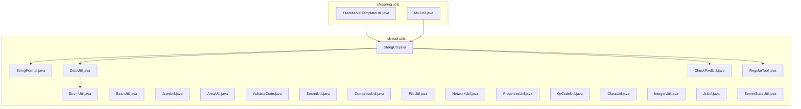
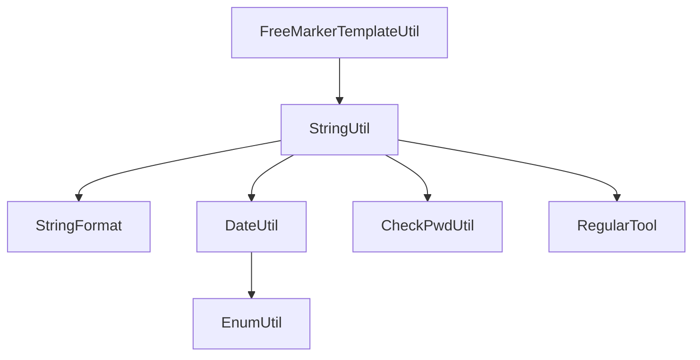

# String and Date Utilities

<cite>
**Referenced Files in This Document**
- [DateUtil.java](file://sh-tool/src/main/java/com/wkclz/tool/utils/DateUtil.java)
- [StringUtil.java](file://sh-tool/src/main/java/com/wkclz/tool/utils/StringUtil.java)
- [StringFormat.java](file://sh-tool/src/main/java/com/wkclz/tool/utils/StringFormat.java)
- [CheckPwdUtil.java](file://sh-tool/src/main/java/com/wkclz/tool/utils/CheckPwdUtil.java)
- [RegularTool.java](file://sh-tool/src/main/java/com/wkclz/tool/tools/RegularTool.java)
- [EnumUtil.java](file://sh-tool/src/main/java/com/wkclz/tool/utils/EnumUtil.java)
- [BeanUtil.java](file://sh-tool/src/main/java/com/wkclz/tool/utils/BeanUtil.java)
- [JsonUtil.java](file://sh-tool/src/main/java/com/wkclz/tool/utils/JsonUtil.java)
- [AreaUtil.java](file://sh-tool/src/main/java/com/wkclz/tool/utils/AreaUtil.java)
- [ValidateCode.java](file://sh-tool/src/main/java/com/wkclz/tool/utils/ValidateCode.java)
- [SecretUtil.java](file://sh-tool/src/main/java/com/wkclz/tool/utils/SecretUtil.java)
- [CompressUtil.java](file://sh-tool/src/main/java/com/wkclz/tool/utils/CompressUtil.java)
- [FileUtil.java](file://sh-tool/src/main/java/com/wkclz/tool/utils/FileUtil.java)
- [NetworkUtil.java](file://sh-tool/src/main/java/com/wkclz/tool/utils/NetworkUtil.java)
- [PropertiesUtil.java](file://sh-tool/src/main/java/com/wkclz/tool/utils/PropertiesUtil.java)
- [QrCodeUtil.java](file://sh-tool/src/main/java/com/wkclz/tool/utils/QrCodeUtil.java)
- [ClassUtil.java](file://sh-tool/src/main/java/com/wkclz/tool/utils/ClassUtil.java)
- [IntegerUtil.java](file://sh-tool/src/main/java/com/wkclz/tool/utils/IntegerUtil.java)
- [JsUtil.java](file://sh-tool/src/main/java/com/wkclz/tool/utils/JsUtil.java)
- [ServerStateUtil.java](file://sh-tool/src/main/java/com/wkclz/tool/utils/ServerStateUtil.java)
- [FreeMarkerTemplateUtil.java](file://sh-spring/src/main/java/com/wkclz/spring/utils/FreeMarkerTemplateUtil.java)
- [MailUtil.java](file://sh-spring/src/main/java/com/wkclz/spring/utils/MailUtil.java)
</cite>

## Table of Contents
1. [Introduction](#introduction)
2. [Project Structure](#project-structure)
3. [Core Components](#core-components)
4. [Architecture Overview](#architecture-overview)
5. [Detailed Component Analysis](#detailed-component-analysis)
6. [Dependency Analysis](#dependency-analysis)
7. [Performance Considerations](#performance-considerations)
8. [Troubleshooting Guide](#troubleshooting-guide)
9. [Conclusion](#conclusion)
10. [Appendices](#appendices)

## Introduction
This document provides comprehensive documentation for string manipulation and date/time utilities within the framework. It covers formatting, validation, conversion, and manipulation functions for strings; parsing, formatting, timezone handling, and date arithmetic for dates; validation utilities for emails, phone numbers, ID cards, and custom patterns; password strength checking; regular expression utilities; enum utilities; and practical examples for data sanitization, input validation, internationalization support, and locale-specific formatting. Performance optimization techniques and memory-efficient string operations are also included.

## Project Structure
The string and date utilities reside primarily in the sh-tool module under the utils package, with supporting tools and cross-cutting utilities in other modules. The key areas covered are:
- String utilities: formatting, validation, conversion, and manipulation
- Date utilities: parsing, formatting, timezone handling, and arithmetic
- Validation utilities: email, phone, ID card, and custom patterns
- Password strength checking
- Regular expression utilities
- Enum utilities
- Additional utilities for internationalization and template processing

**Diagram sources**
- [StringUtil.java](file://sh-tool/src/main/java/com/wkclz/tool/utils/StringUtil.java)
- [StringFormat.java](file://sh-tool/src/main/java/com/wkclz/tool/utils/StringFormat.java)
- [DateUtil.java](file://sh-tool/src/main/java/com/wkclz/tool/utils/DateUtil.java)
- [EnumUtil.java](file://sh-tool/src/main/java/com/wkclz/tool/utils/EnumUtil.java)
- [CheckPwdUtil.java](file://sh-tool/src/main/java/com/wkclz/tool/utils/CheckPwdUtil.java)
- [RegularTool.java](file://sh-tool/src/main/java/com/wkclz/tool/tools/RegularTool.java)
- [BeanUtil.java](file://sh-tool/src/main/java/com/wkclz/tool/utils/BeanUtil.java)
- [JsonUtil.java](file://sh-tool/src/main/java/com/wkclz/tool/utils/JsonUtil.java)
- [AreaUtil.java](file://sh-tool/src/main/java/com/wkclz/tool/utils/AreaUtil.java)
- [ValidateCode.java](file://sh-tool/src/main/java/com/wkclz/tool/utils/ValidateCode.java)
- [SecretUtil.java](file://sh-tool/src/main/java/com/wkclz/tool/utils/SecretUtil.java)
- [CompressUtil.java](file://sh-tool/src/main/java/com/wkclz/tool/utils/CompressUtil.java)
- [FileUtil.java](file://sh-tool/src/main/java/com/wkclz/tool/utils/FileUtil.java)
- [NetworkUtil.java](file://sh-tool/src/main/java/com/wkclz/tool/utils/NetworkUtil.java)
- [PropertiesUtil.java](file://sh-tool/src/main/java/com/wkclz/tool/utils/PropertiesUtil.java)
- [QrCodeUtil.java](file://sh-tool/src/main/java/com/wkclz/tool/utils/QrCodeUtil.java)
- [ClassUtil.java](file://sh-tool/src/main/java/com/wkclz/tool/utils/ClassUtil.java)
- [IntegerUtil.java](file://sh-tool/src/main/java/com/wkclz/tool/utils/IntegerUtil.java)
- [JsUtil.java](file://sh-tool/src/main/java/com/wkclz/tool/utils/JsUtil.java)
- [ServerStateUtil.java](file://sh-tool/src/main/java/com/wkclz/tool/utils/ServerStateUtil.java)
- [FreeMarkerTemplateUtil.java](file://sh-spring/src/main/java/com/wkclz/spring/utils/FreeMarkerTemplateUtil.java)
- [MailUtil.java](file://sh-spring/src/main/java/com/wkclz/spring/utils/MailUtil.java)

**Section sources**
- [StringUtil.java](file://sh-tool/src/main/java/com/wkclz/tool/utils/StringUtil.java)
- [StringFormat.java](file://sh-tool/src/main/java/com/wkclz/tool/utils/StringFormat.java)
- [DateUtil.java](file://sh-tool/src/main/java/com/wkclz/tool/utils/DateUtil.java)
- [EnumUtil.java](file://sh-tool/src/main/java/com/wkclz/tool/utils/EnumUtil.java)
- [CheckPwdUtil.java](file://sh-tool/src/main/java/com/wkclz/tool/utils/CheckPwdUtil.java)
- [RegularTool.java](file://sh-tool/src/main/java/com/wkclz/tool/tools/RegularTool.java)
- [FreeMarkerTemplateUtil.java](file://sh-spring/src/main/java/com/wkclz/spring/utils/FreeMarkerTemplateUtil.java)
- [MailUtil.java](file://sh-spring/src/main/java/com/wkclz/spring/utils/MailUtil.java)

## Core Components
This section outlines the primary utility components and their responsibilities:
- String utilities: provide formatting, validation, conversion, and manipulation helpers
- Date utilities: handle parsing, formatting, timezone operations, and arithmetic
- Validation utilities: validate email, phone, ID card, and custom patterns
- Password strength checking: enforce robust password policies
- Regular expression utilities: pattern matching and text processing
- Enum utilities: enum value operations and type conversions
- Cross-cutting utilities: JSON, bean, area, QR code, compression, cryptography, and more

Key capabilities include:
- Sanitization and normalization of strings
- Locale-aware formatting and parsing
- Secure handling of secrets and encryption
- Template-driven internationalization support

**Section sources**
- [StringUtil.java](file://sh-tool/src/main/java/com/wkclz/tool/utils/StringUtil.java)
- [StringFormat.java](file://sh-tool/src/main/java/com/wkclz/tool/utils/StringFormat.java)
- [DateUtil.java](file://sh-tool/src/main/java/com/wkclz/tool/utils/DateUtil.java)
- [CheckPwdUtil.java](file://sh-tool/src/main/java/com/wkclz/tool/utils/CheckPwdUtil.java)
- [RegularTool.java](file://sh-tool/src/main/java/com/wkclz/tool/tools/RegularTool.java)
- [EnumUtil.java](file://sh-tool/src/main/java/com/wkclz/tool/utils/EnumUtil.java)
- [JsonUtil.java](file://sh-tool/src/main/java/com/wkclz/tool/utils/JsonUtil.java)
- [BeanUtil.java](file://sh-tool/src/main/java/com/wkclz/tool/utils/BeanUtil.java)
- [AreaUtil.java](file://sh-tool/src/main/java/com/wkclz/tool/utils/AreaUtil.java)
- [QrCodeUtil.java](file://sh-tool/src/main/java/com/wkclz/tool/utils/QrCodeUtil.java)
- [CompressUtil.java](file://sh-tool/src/main/java/com/wkclz/tool/utils/CompressUtil.java)
- [SecretUtil.java](file://sh-tool/src/main/java/com/wkclz/tool/utils/SecretUtil.java)
- [FreeMarkerTemplateUtil.java](file://sh-spring/src/main/java/com/wkclz/spring/utils/FreeMarkerTemplateUtil.java)
- [MailUtil.java](file://sh-spring/src/main/java/com/wkclz/spring/utils/MailUtil.java)

## Architecture Overview
The utilities are organized around cohesive functional domains with minimal coupling. String and date utilities form the core, while validation and security utilities complement them. Internationalization support is provided via template utilities.

**Diagram sources**
- [StringUtil.java](file://sh-tool/src/main/java/com/wkclz/tool/utils/StringUtil.java)
- [StringFormat.java](file://sh-tool/src/main/java/com/wkclz/tool/utils/StringFormat.java)
- [DateUtil.java](file://sh-tool/src/main/java/com/wkclz/tool/utils/DateUtil.java)
- [CheckPwdUtil.java](file://sh-tool/src/main/java/com/wkclz/tool/utils/CheckPwdUtil.java)
- [RegularTool.java](file://sh-tool/src/main/java/com/wkclz/tool/tools/RegularTool.java)
- [EnumUtil.java](file://sh-tool/src/main/java/com/wkclz/tool/utils/EnumUtil.java)
- [FreeMarkerTemplateUtil.java](file://sh-spring/src/main/java/com/wkclz/spring/utils/FreeMarkerTemplateUtil.java)

## Detailed Component Analysis

### String Utilities
String utilities focus on formatting, validation, conversion, and manipulation. They provide:
- Formatting helpers for consistent output
- Validation routines for common patterns
- Conversion utilities for encoding and decoding
- Manipulation functions for sanitization and normalization

Representative responsibilities:
- Normalize whitespace and trim
- Convert between encodings
- Validate presence and length constraints
- Apply masks for sensitive data

Practical examples:
- Sanitize user input before persistence
- Format identifiers consistently across systems
- Validate and normalize phone numbers

**Section sources**
- [StringUtil.java](file://sh-tool/src/main/java/com/wkclz/tool/utils/StringUtil.java)
- [StringFormat.java](file://sh-tool/src/main/java/com/wkclz/tool/utils/StringFormat.java)

### Date Utilities
Date utilities enable robust date/time operations:
- Parsing dates from various formats
- Formatting dates for display and storage
- Handling timezones and offsets
- Performing date arithmetic (addition/subtraction, difference calculation)

Representative responsibilities:
- Parse ISO-like and custom formats
- Format to locale-aware strings
- Convert between timezones
- Compute durations and intervals

Practical examples:
- Convert timestamps to user-readable formats
- Calculate age from birthdate
- Normalize event times to UTC

**Section sources**
- [DateUtil.java](file://sh-tool/src/main/java/com/wkclz/tool/utils/DateUtil.java)

### Validation Utilities
Validation utilities ensure data integrity:
- Email validation with domain checks
- Phone number validation for multiple regions
- ID card validation (e.g., Chinese ID)
- Custom pattern validation via regex

Representative responsibilities:
- Pattern-based validation
- Length and format enforcement
- Regional-specific rules

Practical examples:
- Validate registration forms
- Verify contact information during checkout
- Enforce policy-compliant identifiers

**Section sources**
- [CheckPwdUtil.java](file://sh-tool/src/main/java/com/wkclz/tool/utils/CheckPwdUtil.java)
- [RegularTool.java](file://sh-tool/src/main/java/com/wkclz/tool/tools/RegularTool.java)

### Password Strength Checking
Password strength utilities enforce secure password policies:
- Complexity rules (length, uppercase, lowercase, digits, special characters)
- Dictionary and repetition checks
- Historical breach detection integration

Representative responsibilities:
- Evaluate strength metrics
- Provide feedback for improvement
- Enforce organizational policies

Practical examples:
- Registration flow guidance
- Password reset policy enforcement

**Section sources**
- [CheckPwdUtil.java](file://sh-tool/src/main/java/com/wkclz/tool/utils/CheckPwdUtil.java)

### Regular Expression Utilities
Regular expression utilities facilitate pattern matching and text processing:
- Predefined patterns for common validations
- Safe replacement and extraction
- Performance-aware matching

Representative responsibilities:
- Compile and reuse patterns
- Replace or extract substrings safely
- Validate against malicious inputs

Practical examples:
- Filter logs for sensitive tokens
- Extract structured data from unstructured text

**Section sources**
- [RegularTool.java](file://sh-tool/src/main/java/com/wkclz/tool/tools/RegularTool.java)

### Enum Utilities
Enum utilities support enum value operations and type conversions:
- Enum lookup by name/value
- Safe casting and conversion
- Iteration and filtering

Representative responsibilities:
- Type-safe enum operations
- Fallback handling for unknown values

Practical examples:
- Map configuration values to enums
- Convert external identifiers to enums

**Section sources**
- [EnumUtil.java](file://sh-tool/src/main/java/com/wkclz/tool/utils/EnumUtil.java)

### Cross-Cutting Utilities
Additional utilities enhance the ecosystem:
- JSON utilities for serialization/deserialization
- Bean utilities for reflection-based operations
- Area utilities for geographic data
- QR code generation and parsing
- Compression utilities for large payloads
- Cryptographic utilities for hashing and encryption
- Network utilities for connectivity checks
- Property and file utilities for configuration and assets
- JavaScript and server state utilities for dynamic environments

Representative responsibilities:
- Efficient serialization
- Secure cryptographic operations
- Locale-aware formatting via templates

Practical examples:
- Serialize DTOs to JSON
- Generate QR codes for verification
- Compress logs for archival

**Section sources**
- [JsonUtil.java](file://sh-tool/src/main/java/com/wkclz/tool/utils/JsonUtil.java)
- [BeanUtil.java](file://sh-tool/src/main/java/com/wkclz/tool/utils/BeanUtil.java)
- [AreaUtil.java](file://sh-tool/src/main/java/com/wkclz/tool/utils/AreaUtil.java)
- [QrCodeUtil.java](file://sh-tool/src/main/java/com/wkclz/tool/utils/QrCodeUtil.java)
- [CompressUtil.java](file://sh-tool/src/main/java/com/wkclz/tool/utils/CompressUtil.java)
- [SecretUtil.java](file://sh-tool/src/main/java/com/wkclz/tool/utils/SecretUtil.java)
- [NetworkUtil.java](file://sh-tool/src/main/java/com/wkclz/tool/utils/NetworkUtil.java)
- [PropertiesUtil.java](file://sh-tool/src/main/java/com/wkclz/tool/utils/PropertiesUtil.java)
- [FileUtil.java](file://sh-tool/src/main/java/com/wkclz/tool/utils/FileUtil.java)
- [IntegerUtil.java](file://sh-tool/src/main/java/com/wkclz/tool/utils/IntegerUtil.java)
- [JsUtil.java](file://sh-tool/src/main/java/com/wkclz/tool/utils/JsUtil.java)
- [ServerStateUtil.java](file://sh-tool/src/main/java/com/wkclz/tool/utils/ServerStateUtil.java)

### Internationalization and Template Support
Internationalization is supported via template utilities:
- FreeMarker template utilities for dynamic content rendering
- Locale-aware formatting and message interpolation

Representative responsibilities:
- Render localized messages
- Substitute placeholders safely

Practical examples:
- Generate localized emails
- Produce region-specific reports

**Section sources**
- [FreeMarkerTemplateUtil.java](file://sh-spring/src/main/java/com/wkclz/spring/utils/FreeMarkerTemplateUtil.java)
- [MailUtil.java](file://sh-spring/src/main/java/com/wkclz/spring/utils/MailUtil.java)

## Dependency Analysis
The string and date utilities depend on each other and on cross-cutting utilities. The following diagram shows key dependencies:

**Diagram sources**
- [StringUtil.java](file://sh-tool/src/main/java/com/wkclz/tool/utils/StringUtil.java)
- [StringFormat.java](file://sh-tool/src/main/java/com/wkclz/tool/utils/StringFormat.java)
- [DateUtil.java](file://sh-tool/src/main/java/com/wkclz/tool/utils/DateUtil.java)
- [CheckPwdUtil.java](file://sh-tool/src/main/java/com/wkclz/tool/utils/CheckPwdUtil.java)
- [RegularTool.java](file://sh-tool/src/main/java/com/wkclz/tool/tools/RegularTool.java)
- [EnumUtil.java](file://sh-tool/src/main/java/com/wkclz/tool/utils/EnumUtil.java)
- [FreeMarkerTemplateUtil.java](file://sh-spring/src/main/java/com/wkclz/spring/utils/FreeMarkerTemplateUtil.java)

**Section sources**
- [StringUtil.java](file://sh-tool/src/main/java/com/wkclz/tool/utils/StringUtil.java)
- [StringFormat.java](file://sh-tool/src/main/java/com/wkclz/tool/utils/StringFormat.java)
- [DateUtil.java](file://sh-tool/src/main/java/com/wkclz/tool/utils/DateUtil.java)
- [CheckPwdUtil.java](file://sh-tool/src/main/java/com/wkclz/tool/utils/CheckPwdUtil.java)
- [RegularTool.java](file://sh-tool/src/main/java/com/wkclz/tool/tools/RegularTool.java)
- [EnumUtil.java](file://sh-tool/src/main/java/com/wkclz/tool/utils/EnumUtil.java)
- [FreeMarkerTemplateUtil.java](file://sh-spring/src/main/java/com/wkclz/spring/utils/FreeMarkerTemplateUtil.java)

## Performance Considerations
To optimize performance and memory usage:
- Prefer precompiled regular expressions for repeated operations
- Reuse string builders for concatenation-heavy scenarios
- Use streaming APIs for large payloads (compression, file operations)
- Cache enum lookups and frequently accessed patterns
- Minimize allocations by reusing buffers and avoiding intermediate copies
- Leverage lazy evaluation for template rendering
- Apply compression judiciously to reduce I/O overhead

[No sources needed since this section provides general guidance]

## Troubleshooting Guide
Common issues and resolutions:
- Incorrect date parsing: verify input format and timezone offset; ensure consistent parsing rules
- Regex performance problems: avoid catastrophic backtracking; compile patterns once
- Memory leaks with strings: prefer char arrays for sensitive data; clear buffers after use
- Encoding mismatches: standardize to UTF-8; validate byte order marks
- Template rendering errors: check placeholder keys and localization files
- Cryptographic failures: validate key sizes and padding; ensure secure random sources

**Section sources**
- [DateUtil.java](file://sh-tool/src/main/java/com/wkclz/tool/utils/DateUtil.java)
- [RegularTool.java](file://sh-tool/src/main/java/com/wkclz/tool/tools/RegularTool.java)
- [FreeMarkerTemplateUtil.java](file://sh-spring/src/main/java/com/wkclz/spring/utils/FreeMarkerTemplateUtil.java)
- [SecretUtil.java](file://sh-tool/src/main/java/com/wkclz/tool/utils/SecretUtil.java)

## Conclusion
The string and date utilities provide a robust foundation for data manipulation, validation, and formatting across diverse use cases. By leveraging these components and following the recommended practices, developers can build reliable, secure, and maintainable applications with strong internationalization and performance characteristics.

[No sources needed since this section summarizes without analyzing specific files]

## Appendices
- Practical examples:
  - Data sanitization: normalize and mask sensitive fields before logging
  - Input validation: enforce constraints early in the request lifecycle
  - Internationalization: render localized content using templates
  - Locale-specific formatting: format currency, dates, and numbers per locale
- Best practices:
  - Centralize validation rules
  - Use immutable data structures where possible
  - Apply defensive programming techniques
  - Monitor and log validation failures securely

[No sources needed since this section provides general guidance]