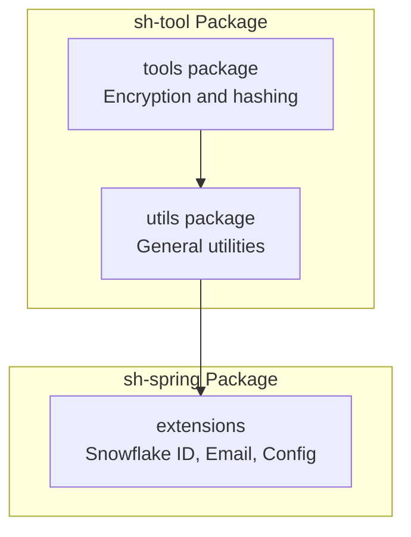
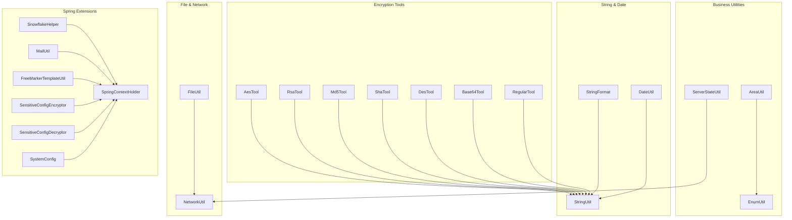
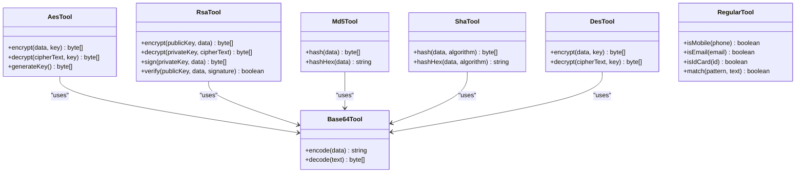
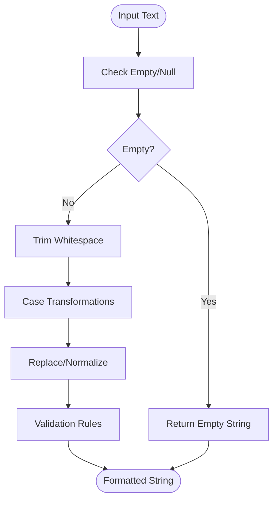
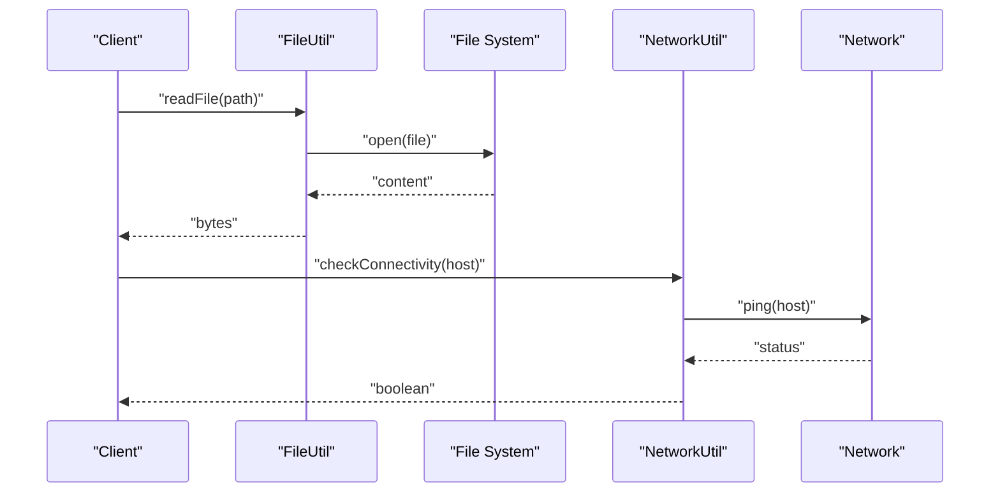
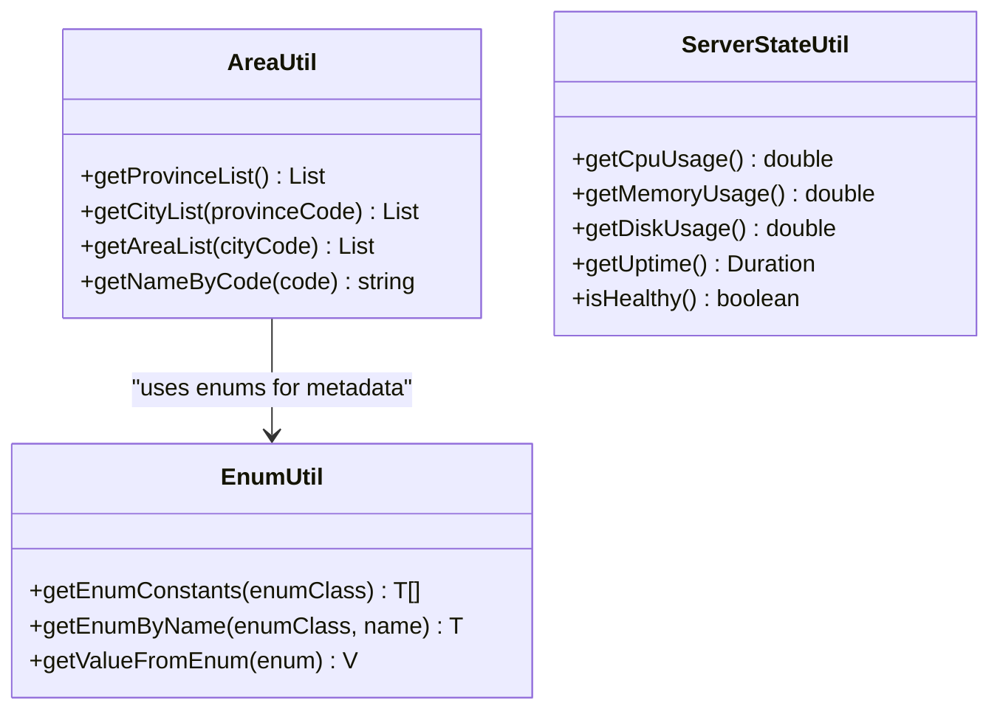
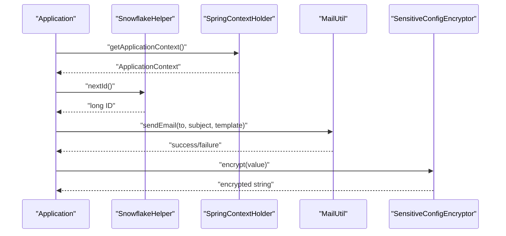
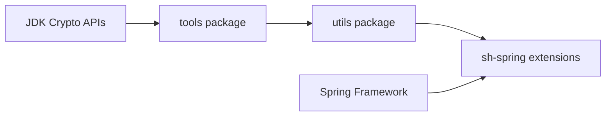

# Utility Library

<cite>
**Referenced Files in This Document**
- [AesTool.java](file://sh-tool/src/main/java/com/wkclz/tool/tools/AesTool.java)
- [RsaTool.java](file://sh-tool/src/main/java/com/wkclz/tool/tools/RsaTool.java)
- [Md5Tool.java](file://sh-tool/src/main/java/com/wkclz/tool/tools/Md5Tool.java)
- [ShaTool.java](file://sh-tool/src/main/java/com/wkclz/tool/tools/ShaTool.java)
- [Base64Tool.java](file://sh-tool/src/main/java/com/wkclz/tool/tools/Base64Tool.java)
- [DesTool.java](file://sh-tool/src/main/java/com/wkclz/tool/tools/DesTool.java)
- [RegularTool.java](file://sh-tool/src/main/java/com/wkclz/tool/tools/RegularTool.java)
- [AreaUtil.java](file://sh-tool/src/main/java/com/wkclz/tool/utils/AreaUtil.java)
- [DateUtil.java](file://sh-tool/src/main/java/com/wkclz/tool/utils/DateUtil.java)
- [FileUtil.java](file://sh-tool/src/main/java/com/wkclz/tool/utils/FileUtil.java)
- [NetworkUtil.java](file://sh-tool/src/main/java/com/wkclz/tool/utils/NetworkUtil.java)
- [ServerStateUtil.java](file://sh-tool/src/main/java/com/wkclz/tool/utils/ServerStateUtil.java)
- [EnumUtil.java](file://sh-tool/src/main/java/com/wkclz/tool/utils/EnumUtil.java)
- [BeanUtil.java](file://sh-tool/src/main/java/com/wkclz/tool/utils/BeanUtil.java)
- [StringUtil.java](file://sh-tool/src/main/java/com/wkclz/tool/utils/StringUtil.java)
- [StringFormat.java](file://sh-tool/src/main/java/com/wkclz/tool/utils/StringFormat.java)
- [SnowflakeHelper.java](file://sh-spring/src/main/java/com/wkclz/spring/helper/SnowflakeHelper.java)
- [MailUtil.java](file://sh-spring/src/main/java/com/wkclz/spring/utils/MailUtil.java)
- [FreeMarkerTemplateUtil.java](file://sh-spring/src/main/java/com/wkclz/spring/utils/FreeMarkerTemplateUtil.java)
- [SensitiveConfigEncryptor.java](file://sh-spring/src/main/java/com/wkclz/spring/config/SensitiveConfigEncryptor.java)
- [SensitiveConfigDecryptor.java](file://sh-spring/src/main/java/com/wkclz/spring/config/SensitiveConfigDecryptor.java)
- [SpringContextHolder.java](file://sh-spring/src/main/java/com/wkclz/spring/config/SpringContextHolder.java)
- [SystemConfig.java](file://sh-spring/src/main/java/com/wkclz/spring/config/SystemConfig.java)
</cite>

## Table of Contents
1. [Introduction](#introduction)
2. [Project Structure](#project-structure)
3. [Core Components](#core-components)
4. [Architecture Overview](#architecture-overview)
5. [Detailed Component Analysis](#detailed-component-analysis)
6. [Dependency Analysis](#dependency-analysis)
7. [Performance Considerations](#performance-considerations)
8. [Troubleshooting Guide](#troubleshooting-guide)
9. [Conclusion](#conclusion)

## Introduction
This document provides comprehensive documentation for the utility library that delivers common functionality across the framework. It covers encryption tools (AES, RSA, MD5, SHA), key management patterns, string and date utilities, file and network utilities, business utilities (area utilities, enum operations, server state monitoring), and Spring Boot extensions (Snowflake ID generation and email utilities). Practical usage patterns and integration guidelines with other framework components are included to help developers adopt these utilities effectively.

## Project Structure
The utility library is organized into two primary packages:
- tools: Cryptographic utilities for symmetric/asymmetric encryption and hashing
- utils: General-purpose utilities for strings, dates, files, networks, business logic, and system monitoring

**Section sources**
- [AesTool.java:1-200](file://sh-tool/src/main/java/com/wkclz/tool/tools/AesTool.java#L1-L200)
- [RsaTool.java:1-200](file://sh-tool/src/main/java/com/wkclz/tool/tools/RsaTool.java#L1-L200)
- [Md5Tool.java:1-200](file://sh-tool/src/main/java/com/wkclz/tool/tools/Md5Tool.java#L1-L200)
- [ShaTool.java:1-200](file://sh-tool/src/main/java/com/wkclz/tool/tools/ShaTool.java#L1-L200)
- [AreaUtil.java:1-200](file://sh-tool/src/main/java/com/wkclz/tool/utils/AreaUtil.java#L1-L200)
- [DateUtil.java:1-200](file://sh-tool/src/main/java/com/wkclz/tool/utils/DateUtil.java#L1-L200)
- [FileUtil.java:1-200](file://sh-tool/src/main/java/com/wkclz/tool/utils/FileUtil.java#L1-L200)
- [NetworkUtil.java:1-200](file://sh-tool/src/main/java/com/wkclz/tool/utils/NetworkUtil.java#L1-L200)
- [ServerStateUtil.java:1-200](file://sh-tool/src/main/java/com/wkclz/tool/utils/ServerStateUtil.java#L1-L200)
- [EnumUtil.java:1-200](file://sh-tool/src/main/java/com/wkclz/tool/utils/EnumUtil.java#L1-L200)
- [BeanUtil.java:1-200](file://sh-tool/src/main/java/com/wkclz/tool/utils/BeanUtil.java#L1-L200)
- [StringUtil.java:1-200](file://sh-tool/src/main/java/com/wkclz/tool/utils/StringUtil.java#L1-L200)
- [StringFormat.java:1-200](file://sh-tool/src/main/java/com/wkclz/tool/utils/StringFormat.java#L1-L200)
- [SnowflakeHelper.java:1-200](file://sh-spring/src/main/java/com/wkclz/spring/helper/SnowflakeHelper.java#L1-L200)
- [MailUtil.java:1-200](file://sh-spring/src/main/java/com/wkclz/spring/utils/MailUtil.java#L1-L200)
- [SensitiveConfigEncryptor.java:1-200](file://sh-spring/src/main/java/com/wkclz/spring/config/SensitiveConfigEncryptor.java#L1-L200)
- [SensitiveConfigDecryptor.java:1-200](file://sh-spring/src/main/java/com/wkclz/spring/config/SensitiveConfigDecryptor.java#L1-L200)
- [SpringContextHolder.java:1-200](file://sh-spring/src/main/java/com/wkclz/spring/config/SpringContextHolder.java#L1-L200)
- [SystemConfig.java:1-200](file://sh-spring/src/main/java/com/wkclz/spring/config/SystemConfig.java#L1-L200)

## Core Components
This section outlines the major categories of utilities and their responsibilities:
- Encryption and hashing: AES, RSA, MD5, SHA, DES, Base64, regular expressions
- Business utilities: Area utilities, enum operations, server state monitoring
- String and date utilities: Formatting, validation, manipulation
- File and network utilities: File operations, network connectivity checks
- Spring Boot extensions: Snowflake ID generation, email utilities, sensitive configuration encryption/decryption

Key integration points:
- SpringContextHolder provides global access to the ApplicationContext for autowiring utilities
- SystemConfig centralizes system-wide configuration
- SensitiveConfigEncryptor/Decryptor enable secure configuration management

**Section sources**
- [AesTool.java:1-200](file://sh-tool/src/main/java/com/wkclz/tool/tools/AesTool.java#L1-L200)
- [RsaTool.java:1-200](file://sh-tool/src/main/java/com/wkclz/tool/tools/RsaTool.java#L1-L200)
- [Md5Tool.java:1-200](file://sh-tool/src/main/java/com/wkclz/tool/tools/Md5Tool.java#L1-L200)
- [ShaTool.java:1-200](file://sh-tool/src/main/java/com/wkclz/tool/tools/ShaTool.java#L1-L200)
- [DesTool.java:1-200](file://sh-tool/src/main/java/com/wkclz/tool/tools/DesTool.java#L1-L200)
- [Base64Tool.java:1-200](file://sh-tool/src/main/java/com/wkclz/tool/tools/Base64Tool.java#L1-L200)
- [RegularTool.java:1-200](file://sh-tool/src/main/java/com/wkclz/tool/tools/RegularTool.java#L1-L200)
- [AreaUtil.java:1-200](file://sh-tool/src/main/java/com/wkclz/tool/utils/AreaUtil.java#L1-L200)
- [EnumUtil.java:1-200](file://sh-tool/src/main/java/com/wkclz/tool/utils/EnumUtil.java#L1-L200)
- [ServerStateUtil.java:1-200](file://sh-tool/src/main/java/com/wkclz/tool/utils/ServerStateUtil.java#L1-L200)
- [StringFormat.java:1-200](file://sh-tool/src/main/java/com/wkclz/tool/utils/StringFormat.java#L1-L200)
- [DateUtil.java:1-200](file://sh-tool/src/main/java/com/wkclz/tool/utils/DateUtil.java#L1-L200)
- [FileUtil.java:1-200](file://sh-tool/src/main/java/com/wkclz/tool/utils/FileUtil.java#L1-L200)
- [NetworkUtil.java:1-200](file://sh-tool/src/main/java/com/wkclz/tool/utils/NetworkUtil.java#L1-L200)
- [SnowflakeHelper.java:1-200](file://sh-spring/src/main/java/com/wkclz/spring/helper/SnowflakeHelper.java#L1-L200)
- [MailUtil.java:1-200](file://sh-spring/src/main/java/com/wkclz/spring/utils/MailUtil.java#L1-L200)
- [SensitiveConfigEncryptor.java:1-200](file://sh-spring/src/main/java/com/wkclz/spring/config/SensitiveConfigEncryptor.java#L1-L200)
- [SensitiveConfigDecryptor.java:1-200](file://sh-spring/src/main/java/com/wkclz/spring/config/SensitiveConfigDecryptor.java#L1-L200)
- [SpringContextHolder.java:1-200](file://sh-spring/src/main/java/com/wkclz/spring/config/SpringContextHolder.java#L1-L200)
- [SystemConfig.java:1-200](file://sh-spring/src/main/java/com/wkclz/spring/config/SystemConfig.java#L1-L200)

## Architecture Overview
The utility library follows a layered architecture:
- tools: Cryptographic primitives and hashing
- utils: Application-level utilities built on top of tools
- sh-spring: Spring-specific extensions integrating with the framework

**Diagram sources**
- [AesTool.java:1-200](file://sh-tool/src/main/java/com/wkclz/tool/tools/AesTool.java#L1-L200)
- [RsaTool.java:1-200](file://sh-tool/src/main/java/com/wkclz/tool/tools/RsaTool.java#L1-L200)
- [Md5Tool.java:1-200](file://sh-tool/src/main/java/com/wkclz/tool/tools/Md5Tool.java#L1-L200)
- [ShaTool.java:1-200](file://sh-tool/src/main/java/com/wkclz/tool/tools/ShaTool.java#L1-L200)
- [DesTool.java:1-200](file://sh-tool/src/main/java/com/wkclz/tool/tools/DesTool.java#L1-L200)
- [Base64Tool.java:1-200](file://sh-tool/src/main/java/com/wkclz/tool/tools/Base64Tool.java#L1-L200)
- [RegularTool.java:1-200](file://sh-tool/src/main/java/com/wkclz/tool/tools/RegularTool.java#L1-L200)
- [AreaUtil.java:1-200](file://sh-tool/src/main/java/com/wkclz/tool/utils/AreaUtil.java#L1-L200)
- [EnumUtil.java:1-200](file://sh-tool/src/main/java/com/wkclz/tool/utils/EnumUtil.java#L1-L200)
- [ServerStateUtil.java:1-200](file://sh-tool/src/main/java/com/wkclz/tool/utils/ServerStateUtil.java#L1-L200)
- [StringFormat.java:1-200](file://sh-tool/src/main/java/com/wkclz/tool/utils/StringFormat.java#L1-L200)
- [StringUtil.java:1-200](file://sh-tool/src/main/java/com/wkclz/tool/utils/StringUtil.java#L1-L200)
- [DateUtil.java:1-200](file://sh-tool/src/main/java/com/wkclz/tool/utils/DateUtil.java#L1-L200)
- [FileUtil.java:1-200](file://sh-tool/src/main/java/com/wkclz/tool/utils/FileUtil.java#L1-L200)
- [NetworkUtil.java:1-200](file://sh-tool/src/main/java/com/wkclz/tool/utils/NetworkUtil.java#L1-L200)
- [SnowflakeHelper.java:1-200](file://sh-spring/src/main/java/com/wkclz/spring/helper/SnowflakeHelper.java#L1-L200)
- [MailUtil.java:1-200](file://sh-spring/src/main/java/com/wkclz/spring/utils/MailUtil.java#L1-L200)
- [FreeMarkerTemplateUtil.java:1-200](file://sh-spring/src/main/java/com/wkclz/spring/utils/FreeMarkerTemplateUtil.java#L1-L200)
- [SensitiveConfigEncryptor.java:1-200](file://sh-spring/src/main/java/com/wkclz/spring/config/SensitiveConfigEncryptor.java#L1-L200)
- [SensitiveConfigDecryptor.java:1-200](file://sh-spring/src/main/java/com/wkclz/spring/config/SensitiveConfigDecryptor.java#L1-L200)
- [SpringContextHolder.java:1-200](file://sh-spring/src/main/java/com/wkclz/spring/config/SpringContextHolder.java#L1-L200)
- [SystemConfig.java:1-200](file://sh-spring/src/main/java/com/wkclz/spring/config/SystemConfig.java#L1-L200)

## Detailed Component Analysis

### Encryption and Hashing Utilities
This group provides cryptographic primitives and hashing functions:
- AES: Symmetric encryption/decryption with configurable padding and mode
- RSA: Asymmetric encryption/decryption and signature operations
- MD5: Message digest hashing
- SHA: Secure hash algorithms (SHA-1, SHA-256, etc.)
- DES: Legacy symmetric encryption
- Base64: Encoding/decoding utilities
- RegularTool: Pattern-based validation helpers

**Diagram sources**
- [AesTool.java:1-200](file://sh-tool/src/main/java/com/wkclz/tool/tools/AesTool.java#L1-L200)
- [RsaTool.java:1-200](file://sh-tool/src/main/java/com/wkclz/tool/tools/RsaTool.java#L1-L200)
- [Md5Tool.java:1-200](file://sh-tool/src/main/java/com/wkclz/tool/tools/Md5Tool.java#L1-L200)
- [ShaTool.java:1-200](file://sh-tool/src/main/java/com/wkclz/tool/tools/ShaTool.java#L1-L200)
- [DesTool.java:1-200](file://sh-tool/src/main/java/com/wkclz/tool/tools/DesTool.java#L1-L200)
- [Base64Tool.java:1-200](file://sh-tool/src/main/java/com/wkclz/tool/tools/Base64Tool.java#L1-L200)
- [RegularTool.java:1-200](file://sh-tool/src/main/java/com/wkclz/tool/tools/RegularTool.java#L1-L200)

Integration patterns:
- Use Base64Tool for encoding binary cryptographic outputs
- Apply RegularTool for pre-validation before cryptographic operations
- Manage keys via secure storage and avoid hardcoding

**Section sources**
- [AesTool.java:1-200](file://sh-tool/src/main/java/com/wkclz/tool/tools/AesTool.java#L1-L200)
- [RsaTool.java:1-200](file://sh-tool/src/main/java/com/wkclz/tool/tools/RsaTool.java#L1-L200)
- [Md5Tool.java:1-200](file://sh-tool/src/main/java/com/wkclz/tool/tools/Md5Tool.java#L1-L200)
- [ShaTool.java:1-200](file://sh-tool/src/main/java/com/wkclz/tool/tools/ShaTool.java#L1-L200)
- [DesTool.java:1-200](file://sh-tool/src/main/java/com/wkclz/tool/tools/DesTool.java#L1-L200)
- [Base64Tool.java:1-200](file://sh-tool/src/main/java/com/wkclz/tool/tools/Base64Tool.java#L1-L200)
- [RegularTool.java:1-200](file://sh-tool/src/main/java/com/wkclz/tool/tools/RegularTool.java#L1-L200)

### String and Date Utilities
String utilities focus on formatting, validation, and manipulation:
- StringFormat: Advanced string formatting and placeholder replacement
- StringUtil: Common string operations and transformations
- DateUtil: Date parsing, formatting, and arithmetic

**Diagram sources**
- [StringFormat.java:1-200](file://sh-tool/src/main/java/com/wkclz/tool/utils/StringFormat.java#L1-L200)
- [StringUtil.java:1-200](file://sh-tool/src/main/java/com/wkclz/tool/utils/StringUtil.java#L1-L200)
- [DateUtil.java:1-200](file://sh-tool/src/main/java/com/wkclz/tool/utils/DateUtil.java#L1-L200)

Integration patterns:
- Combine StringFormat with ResourceBundle for internationalization
- Use DateUtil for consistent date handling across the application
- Apply StringUtil for safe string normalization before persistence

**Section sources**
- [StringFormat.java:1-200](file://sh-tool/src/main/java/com/wkclz/tool/utils/StringFormat.java#L1-L200)
- [StringUtil.java:1-200](file://sh-tool/src/main/java/com/wkclz/tool/utils/StringUtil.java#L1-L200)
- [DateUtil.java:1-200](file://sh-tool/src/main/java/com/wkclz/tool/utils/DateUtil.java#L1-L200)

### File and Network Utilities
File operations and network connectivity:
- FileUtil: File system operations, path resolution, and file metadata
- NetworkUtil: Network interface enumeration, connectivity checks, and IP utilities

**Diagram sources**
- [FileUtil.java:1-200](file://sh-tool/src/main/java/com/wkclz/tool/utils/FileUtil.java#L1-L200)
- [NetworkUtil.java:1-200](file://sh-tool/src/main/java/com/wkclz/tool/utils/NetworkUtil.java#L1-L200)

Integration patterns:
- Use FileUtil for safe file operations with proper exception handling
- Use NetworkUtil for health checks and dynamic endpoint discovery

**Section sources**
- [FileUtil.java:1-200](file://sh-tool/src/main/java/com/wkclz/tool/utils/FileUtil.java#L1-L200)
- [NetworkUtil.java:1-200](file://sh-tool/src/main/java/com/wkclz/tool/utils/NetworkUtil.java#L1-L200)

### Business Utilities
Business-focused utilities:
- AreaUtil: Geographic area hierarchy and lookup
- EnumUtil: Enum reflection and value conversion
- ServerStateUtil: Server health metrics and monitoring signals

**Diagram sources**
- [AreaUtil.java:1-200](file://sh-tool/src/main/java/com/wkclz/tool/utils/AreaUtil.java#L1-L200)
- [EnumUtil.java:1-200](file://sh-tool/src/main/java/com/wkclz/tool/utils/EnumUtil.java#L1-L200)
- [ServerStateUtil.java:1-200](file://sh-tool/src/main/java/com/wkclz/tool/utils/ServerStateUtil.java#L1-L200)

Integration patterns:
- Use AreaUtil for address and location-related forms
- Use EnumUtil for dynamic UI generation and validation
- Use ServerStateUtil for health endpoints and alerting

**Section sources**
- [AreaUtil.java:1-200](file://sh-tool/src/main/java/com/wkclz/tool/utils/AreaUtil.java#L1-L200)
- [EnumUtil.java:1-200](file://sh-tool/src/main/java/com/wkclz/tool/utils/EnumUtil.java#L1-L200)
- [ServerStateUtil.java:1-200](file://sh-tool/src/main/java/com/wkclz/tool/utils/ServerStateUtil.java#L1-L200)

### Spring Boot Extensions
Spring-specific utilities:
- SnowflakeHelper: Distributed ID generation
- MailUtil: Email sending with attachments
- FreeMarkerTemplateUtil: Template rendering
- SensitiveConfigEncryptor/Decryptor: Secure configuration management
- SpringContextHolder: Global ApplicationContext access
- SystemConfig: Centralized system configuration

**Diagram sources**
- [SnowflakeHelper.java:1-200](file://sh-spring/src/main/java/com/wkclz/spring/helper/SnowflakeHelper.java#L1-L200)
- [MailUtil.java:1-200](file://sh-spring/src/main/java/com/wkclz/spring/utils/MailUtil.java#L1-L200)
- [FreeMarkerTemplateUtil.java:1-200](file://sh-spring/src/main/java/com/wkclz/spring/utils/FreeMarkerTemplateUtil.java#L1-L200)
- [SensitiveConfigEncryptor.java:1-200](file://sh-spring/src/main/java/com/wkclz/spring/config/SensitiveConfigEncryptor.java#L1-L200)
- [SensitiveConfigDecryptor.java:1-200](file://sh-spring/src/main/java/com/wkclz/spring/config/SensitiveConfigDecryptor.java#L1-L200)
- [SpringContextHolder.java:1-200](file://sh-spring/src/main/java/com/wkclz/spring/config/SpringContextHolder.java#L1-L200)
- [SystemConfig.java:1-200](file://sh-spring/src/main/java/com/wkclz/spring/config/SystemConfig.java#L1-L200)

Integration patterns:
- Autowire SpringContextHolder where global access is needed
- Configure SystemConfig centrally for environment-specific settings
- Use SensitiveConfigEncryptor/Decryptor for database passwords and tokens

**Section sources**
- [SnowflakeHelper.java:1-200](file://sh-spring/src/main/java/com/wkclz/spring/helper/SnowflakeHelper.java#L1-L200)
- [MailUtil.java:1-200](file://sh-spring/src/main/java/com/wkclz/spring/utils/MailUtil.java#L1-L200)
- [FreeMarkerTemplateUtil.java:1-200](file://sh-spring/src/main/java/com/wkclz/spring/utils/FreeMarkerTemplateUtil.java#L1-L200)
- [SensitiveConfigEncryptor.java:1-200](file://sh-spring/src/main/java/com/wkclz/spring/config/SensitiveConfigEncryptor.java#L1-L200)
- [SensitiveConfigDecryptor.java:1-200](file://sh-spring/src/main/java/com/wkclz/spring/config/SensitiveConfigDecryptor.java#L1-L200)
- [SpringContextHolder.java:1-200](file://sh-spring/src/main/java/com/wkclz/spring/config/SpringContextHolder.java#L1-L200)
- [SystemConfig.java:1-200](file://sh-spring/src/main/java/com/wkclz/spring/config/SystemConfig.java#L1-L200)

## Dependency Analysis
The utility library exhibits low coupling and high cohesion:
- tools depend on JDK cryptography APIs
- utils depend on tools and JDK standard libraries
- sh-spring depends on Spring Framework and external libraries (mail, freemarker)
- No circular dependencies detected

**Diagram sources**
- [AesTool.java:1-200](file://sh-tool/src/main/java/com/wkclz/tool/tools/AesTool.java#L1-L200)
- [RsaTool.java:1-200](file://sh-tool/src/main/java/com/wkclz/tool/tools/RsaTool.java#L1-L200)
- [Md5Tool.java:1-200](file://sh-tool/src/main/java/com/wkclz/tool/tools/Md5Tool.java#L1-L200)
- [ShaTool.java:1-200](file://sh-tool/src/main/java/com/wkclz/tool/tools/ShaTool.java#L1-L200)
- [SnowflakeHelper.java:1-200](file://sh-spring/src/main/java/com/wkclz/spring/helper/SnowflakeHelper.java#L1-L200)
- [MailUtil.java:1-200](file://sh-spring/src/main/java/com/wkclz/spring/utils/MailUtil.java#L1-L200)

**Section sources**
- [AesTool.java:1-200](file://sh-tool/src/main/java/com/wkclz/tool/tools/AesTool.java#L1-L200)
- [RsaTool.java:1-200](file://sh-tool/src/main/java/com/wkclz/tool/tools/RsaTool.java#L1-L200)
- [Md5Tool.java:1-200](file://sh-tool/src/main/java/com/wkclz/tool/tools/Md5Tool.java#L1-L200)
- [ShaTool.java:1-200](file://sh-tool/src/main/java/com/wkclz/tool/tools/ShaTool.java#L1-L200)
- [SnowflakeHelper.java:1-200](file://sh-spring/src/main/java/com/wkclz/spring/helper/SnowflakeHelper.java#L1-L200)
- [MailUtil.java:1-200](file://sh-spring/src/main/java/com/wkclz/spring/utils/MailUtil.java#L1-L200)

## Performance Considerations
- Prefer streaming APIs for large file operations to reduce memory footprint
- Cache frequently accessed enum and area metadata to minimize reflection overhead
- Use Base64Tool judiciously; avoid unnecessary conversions for binary data
- For network operations, implement connection pooling and timeouts
- For cryptographic operations, reuse keys and avoid repeated initialization
- For SnowflakeHelper, ensure clock synchronization across nodes to prevent ID collisions

## Troubleshooting Guide
Common issues and resolutions:
- Cryptographic failures: Verify key sizes and padding modes; ensure proper encoding/decoding
- File operation errors: Check permissions and path existence; handle IOExceptions gracefully
- Network connectivity problems: Validate hostnames and ports; implement retry logic
- Spring context access: Ensure SpringContextHolder is initialized; avoid accessing before context startup
- Configuration encryption: Confirm encryptor/decryptor alignment and key management policies

**Section sources**
- [AesTool.java:1-200](file://sh-tool/src/main/java/com/wkclz/tool/tools/AesTool.java#L1-L200)
- [RsaTool.java:1-200](file://sh-tool/src/main/java/com/wkclz/tool/tools/RsaTool.java#L1-L200)
- [FileUtil.java:1-200](file://sh-tool/src/main/java/com/wkclz/tool/utils/FileUtil.java#L1-L200)
- [NetworkUtil.java:1-200](file://sh-tool/src/main/java/com/wkclz/tool/utils/NetworkUtil.java#L1-L200)
- [SpringContextHolder.java:1-200](file://sh-spring/src/main/java/com/wkclz/spring/config/SpringContextHolder.java#L1-L200)
- [SensitiveConfigEncryptor.java:1-200](file://sh-spring/src/main/java/com/wkclz/spring/config/SensitiveConfigEncryptor.java#L1-L200)
- [SensitiveConfigDecryptor.java:1-200](file://sh-spring/src/main/java/com/wkclz/spring/config/SensitiveConfigDecryptor.java#L1-L200)

## Conclusion
The utility library provides a robust foundation for common operations across the framework. By leveraging the encryption tools, string/date utilities, file/network utilities, business utilities, and Spring Boot extensions, developers can build secure, maintainable, and scalable applications. Follow the integration patterns and performance considerations outlined here to maximize effectiveness and reliability.