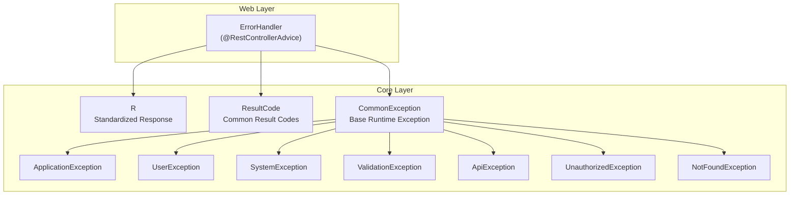
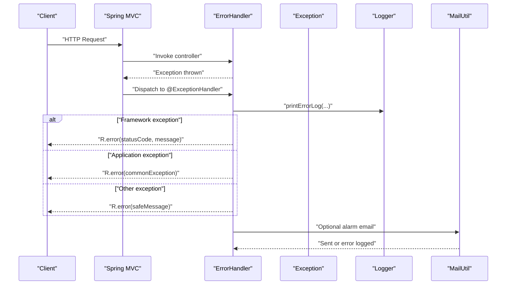
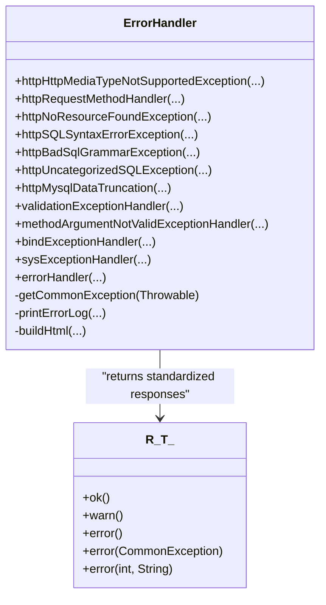
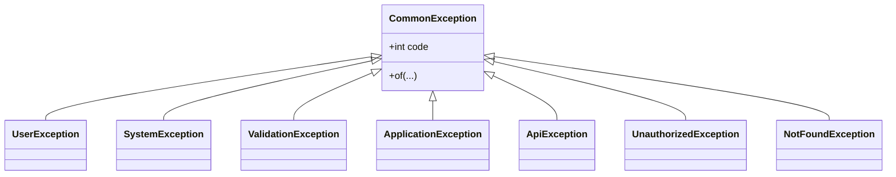
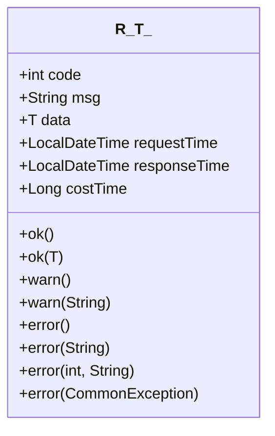
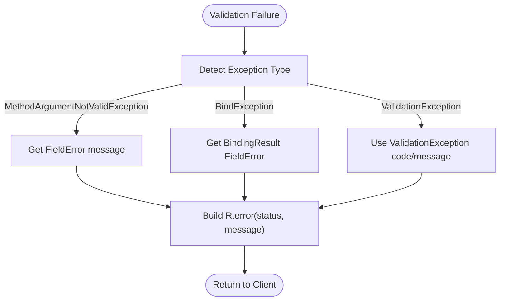
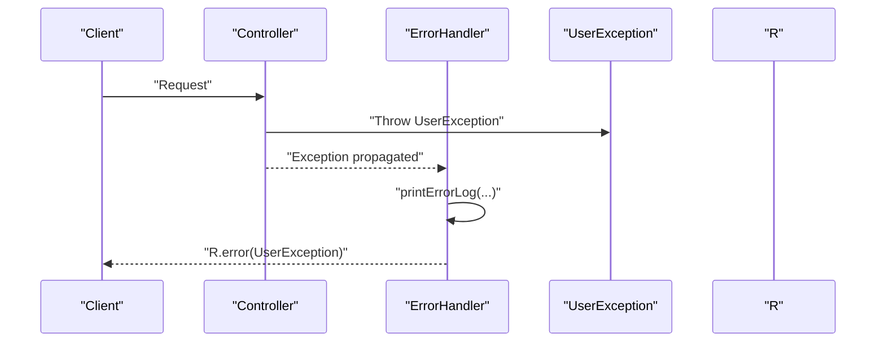
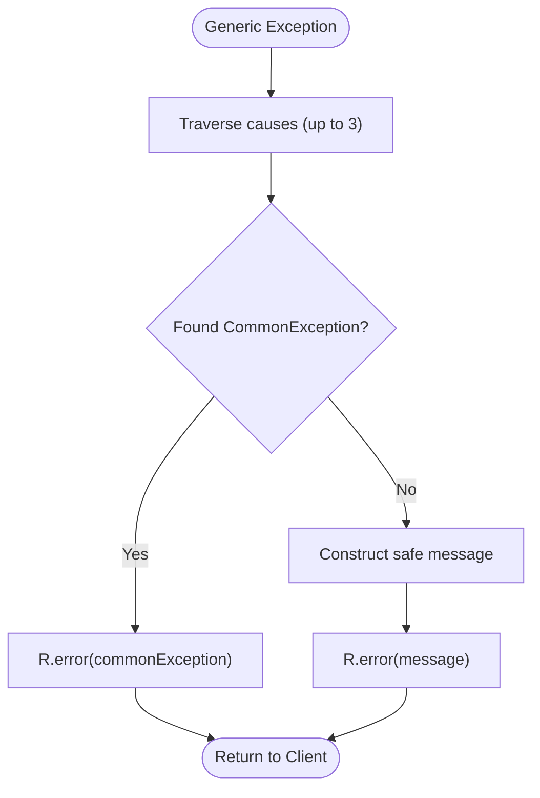
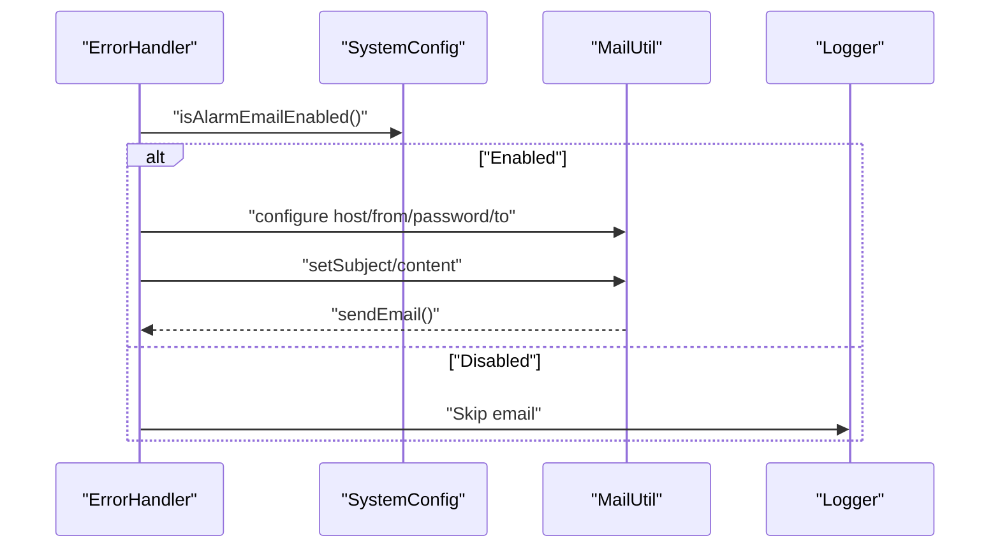
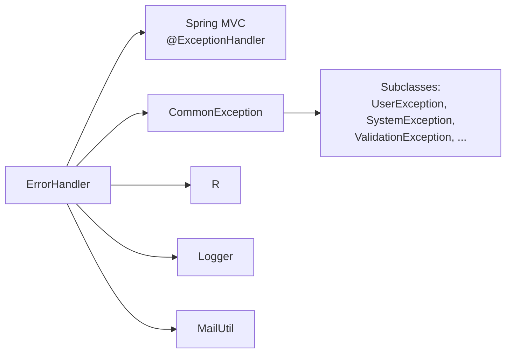

# Error Handling

<cite>
**Referenced Files in This Document**
- [ErrorHandler.java](file://sh-web/src/main/java/com/wkclz/web/rest/ErrorHandler.java)
- [R.java](file://sh-core/src/main/java/com/wkclz/core/base/R.java)
- [CommonException.java](file://sh-core/src/main/java/com/wkclz/core/exception/CommonException.java)
- [ApplicationException.java](file://sh-core/src/main/java/com/wkclz/core/exception/ApplicationException.java)
- [UserException.java](file://sh-core/src/main/java/com/wkclz/core/exception/UserException.java)
- [SystemException.java](file://sh-core/src/main/java/com/wkclz/core/exception/SystemException.java)
- [ValidationException.java](file://sh-core/src/main/java/com/wkclz/core/exception/ValidationException.java)
- [ApiException.java](file://sh-core/src/main/java/com/wkclz/core/exception/ApiException.java)
- [UnauthorizedException.java](file://sh-core/src/main/java/com/wkclz/core/exception/UnauthorizedException.java)
- [NotFoundException.java](file://sh-core/src/main/java/com/wkclz/core/exception/NotFoundException.java)
- [ResultCode.java](file://sh-core/src/main/java/com/wkclz/core/enums/ResultCode.java)
</cite>

## Table of Contents
1. [Introduction](#introduction)
2. [Project Structure](#project-structure)
3. [Core Components](#core-components)
4. [Architecture Overview](#architecture-overview)
5. [Detailed Component Analysis](#detailed-component-analysis)
6. [Dependency Analysis](#dependency-analysis)
7. [Performance Considerations](#performance-considerations)
8. [Troubleshooting Guide](#troubleshooting-guide)
9. [Conclusion](#conclusion)

## Introduction
This document describes the global error handling system in the web layer. It focuses on the ErrorHandler class and its integration with Spring’s exception handling mechanism to convert framework and application exceptions into standardized error responses. It explains how framework exceptions are caught, processed, and transformed into unified responses, and how the web error handling integrates with the core exception hierarchy. Practical guidance is provided for handling validation failures, business logic exceptions, and system errors, along with strategies for graceful degradation, error logging, masking sensitive information, and customizing error response formats.

## Project Structure
The error handling system spans two modules:
- Web module: Provides the global exception handler via a Spring @RestControllerAdvice.
- Core module: Defines the exception hierarchy and standardized response envelope.

Key files:
- Global exception handler: ErrorHandler.java
- Standardized response envelope: R.java
- Exception hierarchy: CommonException.java and its subclasses
- Result codes: ResultCode.java

**Diagram sources**
- [ErrorHandler.java:40-263](file://sh-web/src/main/java/com/wkclz/web/rest/ErrorHandler.java#L40-L263)
- [R.java:11-76](file://sh-core/src/main/java/com/wkclz/core/base/R.java#L11-L76)
- [CommonException.java:10-64](file://sh-core/src/main/java/com/wkclz/core/exception/CommonException.java#L10-L64)
- [ApplicationException.java:10-48](file://sh-core/src/main/java/com/wkclz/core/exception/ApplicationException.java#L10-L48)
- [UserException.java:10-48](file://sh-core/src/main/java/com/wkclz/core/exception/UserException.java#L10-L48)
- [SystemException.java:10-48](file://sh-core/src/main/java/com/wkclz/core/exception/SystemException.java#L10-L48)
- [ValidationException.java:10-48](file://sh-core/src/main/java/com/wkclz/core/exception/ValidationException.java#L10-L48)
- [ApiException.java:10-48](file://sh-core/src/main/java/com/wkclz/core/exception/ApiException.java#L10-L48)
- [UnauthorizedException.java:10-48](file://sh-core/src/main/java/com/wkclz/core/exception/UnauthorizedException.java#L10-L48)
- [NotFoundException.java:10-48](file://sh-core/src/main/java/com/wkclz/core/exception/NotFoundException.java#L10-L48)
- [ResultCode.java:7-77](file://sh-core/src/main/java/com/wkclz/core/enums/ResultCode.java#L7-L77)

**Section sources**
- [ErrorHandler.java:40-263](file://sh-web/src/main/java/com/wkclz/web/rest/ErrorHandler.java#L40-L263)
- [R.java:11-76](file://sh-core/src/main/java/com/wkclz/core/base/R.java#L11-L76)
- [CommonException.java:10-64](file://sh-core/src/main/java/com/wkclz/core/exception/CommonException.java#L10-L64)

## Core Components
- ErrorHandler: A Spring @RestControllerAdvice that intercepts unhandled and handled exceptions, logs them, and returns standardized error responses using R<T>.
- R<T>: The standardized response envelope carrying code, msg, data, and timing metadata. Provides factory methods for success and error responses, including overloads for CommonException.
- Exception hierarchy: CommonException serves as the base for all business/system-related runtime exceptions. Specializations include ApplicationException, UserException, SystemException, ValidationException, ApiException, UnauthorizedException, and NotFoundException.

Key responsibilities:
- Catch framework exceptions (HTTP method/media type/resource not found, SQL grammar/binding/truncation, validation binding) and convert them to appropriate HTTP statuses and error messages.
- Normalize application exceptions to standardized codes/messages and propagate them to clients.
- Log errors with safe message handling and optional alarm emails.
- Provide graceful degradation by returning informative but non-sensitive error messages to clients while preserving stack traces in logs.

**Section sources**
- [ErrorHandler.java:40-263](file://sh-web/src/main/java/com/wkclz/web/rest/ErrorHandler.java#L40-L263)
- [R.java:37-76](file://sh-core/src/main/java/com/wkclz/core/base/R.java#L37-L76)
- [CommonException.java:10-64](file://sh-core/src/main/java/com/wkclz/core/exception/CommonException.java#L10-L64)

## Architecture Overview
The web layer’s ErrorHandler acts as a centralized exception resolver. It leverages Spring’s exception handling mechanism to map exceptions to HTTP responses. The core exception hierarchy ensures consistent error semantics across the application. The standardized R<T> response envelope guarantees uniform client-facing error payloads.

**Diagram sources**
- [ErrorHandler.java:131-148](file://sh-web/src/main/java/com/wkclz/web/rest/ErrorHandler.java#L131-L148)
- [R.java:61-71](file://sh-core/src/main/java/com/wkclz/core/base/R.java#L61-L71)

## Detailed Component Analysis

### ErrorHandler: Centralized Web Error Handling
ErrorHandler is a Spring @RestControllerAdvice that:
- Registers multiple @ExceptionHandler methods for framework exceptions (HTTP method/media type/resource not found, SQL grammar/binding/truncation, validation binding).
- Handles ValidationException and converts it to HTTP 400 with a structured error payload.
- Converts MethodArgumentNotValidException and BindException into user-friendly messages derived from field errors.
- Normalizes application exceptions by detecting CommonException in the cause chain and returning a standardized error response.
- Falls back to a generic handler that extracts a safe message and returns a generic internal server error response.
- Logs requests and errors, sets HTTP status, and optionally sends alarm emails with sanitized HTML content.

**Diagram sources**
- [ErrorHandler.java:49-148](file://sh-web/src/main/java/com/wkclz/web/rest/ErrorHandler.java#L49-L148)
- [R.java:37-76](file://sh-core/src/main/java/com/wkclz/core/base/R.java#L37-L76)

**Section sources**
- [ErrorHandler.java:49-148](file://sh-web/src/main/java/com/wkclz/web/rest/ErrorHandler.java#L49-L148)

### Exception Hierarchy and Standardization
The core exception hierarchy builds upon CommonException, enabling ErrorHandler to detect and normalize application exceptions consistently. Subclasses specialize for different categories:
- UserException: User-facing business errors.
- SystemException: Unexpected system-level errors.
- ValidationException: Parameter/data validation failures.
- ApplicationException: General application-level business errors.
- ApiException: API invocation errors.
- UnauthorizedException: Authorization failures.
- NotFoundException: Resource not found.

**Diagram sources**
- [CommonException.java:10-64](file://sh-core/src/main/java/com/wkclz/core/exception/CommonException.java#L10-L64)
- [UserException.java:10-48](file://sh-core/src/main/java/com/wkclz/core/exception/UserException.java#L10-L48)
- [SystemException.java:10-48](file://sh-core/src/main/java/com/wkclz/core/exception/SystemException.java#L10-L48)
- [ValidationException.java:10-48](file://sh-core/src/main/java/com/wkclz/core/exception/ValidationException.java#L10-L48)
- [ApplicationException.java:10-48](file://sh-core/src/main/java/com/wkclz/core/exception/ApplicationException.java#L10-L48)
- [ApiException.java:10-48](file://sh-core/src/main/java/com/wkclz/core/exception/ApiException.java#L10-L48)
- [UnauthorizedException.java:10-48](file://sh-core/src/main/java/com/wkclz/core/exception/UnauthorizedException.java#L10-L48)
- [NotFoundException.java:10-48](file://sh-core/src/main/java/com/wkclz/core/exception/NotFoundException.java#L10-L48)

**Section sources**
- [CommonException.java:10-64](file://sh-core/src/main/java/com/wkclz/core/exception/CommonException.java#L10-L64)
- [UserException.java:10-48](file://sh-core/src/main/java/com/wkclz/core/exception/UserException.java#L10-L48)
- [SystemException.java:10-48](file://sh-core/src/main/java/com/wkclz/core/exception/SystemException.java#L10-L48)
- [ValidationException.java:10-48](file://sh-core/src/main/java/com/wkclz/core/exception/ValidationException.java#L10-L48)
- [ApplicationException.java:10-48](file://sh-core/src/main/java/com/wkclz/core/exception/ApplicationException.java#L10-L48)
- [ApiException.java:10-48](file://sh-core/src/main/java/com/wkclz/core/exception/ApiException.java#L10-L48)
- [UnauthorizedException.java:10-48](file://sh-core/src/main/java/com/wkclz/core/exception/UnauthorizedException.java#L10-L48)
- [NotFoundException.java:10-48](file://sh-core/src/main/java/com/wkclz/core/exception/NotFoundException.java#L10-L48)

### Standardized Response Envelope (R<T>)
R<T> encapsulates the response shape and provides convenience methods:
- Success responses: ok(), ok(data)
- Warning/error responses: warn(), warn(message), error(), error(message), error(code, message), error(commonException)
- Metadata: requestTime, responseTime, costTime

**Diagram sources**
- [R.java:12-76](file://sh-core/src/main/java/com/wkclz/core/base/R.java#L12-L76)

**Section sources**
- [R.java:37-76](file://sh-core/src/main/java/com/wkclz/core/base/R.java#L37-L76)

### Handling Different Types of Exceptions

#### Validation Failures
- MethodArgumentNotValidException: Extracts the first field error message and returns HTTP 400 with a concise message.
- BindException: Similar to validation binding failure, returns HTTP 400 with a fallback message if no field error is present.
- ValidationException: Returns HTTP 400 with a structured error payload using the exception’s code and message.

**Diagram sources**
- [ErrorHandler.java:106-122](file://sh-web/src/main/java/com/wkclz/web/rest/ErrorHandler.java#L106-L122)
- [ValidationException.java:10-48](file://sh-core/src/main/java/com/wkclz/core/exception/ValidationException.java#L10-L48)

**Section sources**
- [ErrorHandler.java:106-122](file://sh-web/src/main/java/com/wkclz/web/rest/ErrorHandler.java#L106-L122)
- [ValidationException.java:10-48](file://sh-core/src/main/java/com/wkclz/core/exception/ValidationException.java#L10-L48)

#### Business Logic Exceptions
- UserException: Logged as “biz error” and returned as an error response. The code and message come from the exception.
- Other CommonException subclasses: Returned via R.error(commonException) to preserve code/message semantics.

**Diagram sources**
- [ErrorHandler.java:124-129](file://sh-web/src/main/java/com/wkclz/web/rest/ErrorHandler.java#L124-L129)
- [UserException.java:10-48](file://sh-core/src/main/java/com/wkclz/core/exception/UserException.java#L10-L48)

**Section sources**
- [ErrorHandler.java:124-129](file://sh-web/src/main/java/com/wkclz/web/rest/ErrorHandler.java#L124-L129)
- [UserException.java:10-48](file://sh-core/src/main/java/com/wkclz/core/exception/UserException.java#L10-L48)

#### System Errors
- Generic Exception: Detected via getCommonException traversal up to two causes. If a CommonException is found, it is returned as-is; otherwise, a safe message is constructed and returned as HTTP 500.

**Diagram sources**
- [ErrorHandler.java:131-148](file://sh-web/src/main/java/com/wkclz/web/rest/ErrorHandler.java#L131-L148)
- [CommonException.java:10-64](file://sh-core/src/main/java/com/wkclz/core/exception/CommonException.java#L10-L64)

**Section sources**
- [ErrorHandler.java:131-148](file://sh-web/src/main/java/com/wkclz/web/rest/ErrorHandler.java#L131-L148)
- [CommonException.java:10-64](file://sh-core/src/main/java/com/wkclz/core/exception/CommonException.java#L10-L64)

### Customizing Error Response Formats
- Use R.error(...) overloads to tailor the response:
  - R.error(message): Returns a generic error with a message.
  - R.error(code, message): Returns a structured error with a custom code.
  - R.error(commonException): Returns a structured error using the exception’s code and message.
- Customize messages for validation failures by adjusting field error messages in the controller bindings or validators.

Practical references:
- [R.java:57-76](file://sh-core/src/main/java/com/wkclz/core/base/R.java#L57-L76)
- [ErrorHandler.java:106-122](file://sh-web/src/main/java/com/wkclz/web/rest/ErrorHandler.java#L106-L122)

**Section sources**
- [R.java:57-76](file://sh-core/src/main/java/com/wkclz/core/base/R.java#L57-L76)
- [ErrorHandler.java:106-122](file://sh-web/src/main/java/com/wkclz/web/rest/ErrorHandler.java#L106-L122)

### Graceful Degradation Strategies
- Return informative but minimal messages to clients to avoid leaking internal details.
- Use structured codes/messages via CommonException subclasses to enable client-side handling and internationalization.
- Log full stack traces internally and send alarm emails only when configured, reducing noise and protecting sensitive data.

References:
- [ErrorHandler.java:141-147](file://sh-web/src/main/java/com/wkclz/web/rest/ErrorHandler.java#L141-L147)
- [ErrorHandler.java:191-215](file://sh-web/src/main/java/com/wkclz/web/rest/ErrorHandler.java#L191-L215)

**Section sources**
- [ErrorHandler.java:141-147](file://sh-web/src/main/java/com/wkclz/web/rest/ErrorHandler.java#L141-L147)
- [ErrorHandler.java:191-215](file://sh-web/src/main/java/com/wkclz/web/rest/ErrorHandler.java#L191-L215)

### Error Logging and Email Alarms
- printErrorLog sets the HTTP status, captures method and URI, sanitizes the error message, and logs either a business error or a system error.
- Optional alarm emails are sent when enabled in SystemConfig, with sanitized HTML content and request context.

**Diagram sources**
- [ErrorHandler.java:191-215](file://sh-web/src/main/java/com/wkclz/web/rest/ErrorHandler.java#L191-L215)

**Section sources**
- [ErrorHandler.java:167-217](file://sh-web/src/main/java/com/wkclz/web/rest/ErrorHandler.java#L167-L217)

## Dependency Analysis
ErrorHandler depends on:
- Spring MVC exception handling mechanisms (@ExceptionHandler).
- Core exception hierarchy for normalization.
- R<T> for standardized responses.
- Logging infrastructure and optional mail utilities for alerting.

**Diagram sources**
- [ErrorHandler.java:49-148](file://sh-web/src/main/java/com/wkclz/web/rest/ErrorHandler.java#L49-L148)
- [CommonException.java:10-64](file://sh-core/src/main/java/com/wkclz/core/exception/CommonException.java#L10-L64)
- [R.java:12-76](file://sh-core/src/main/java/com/wkclz/core/base/R.java#L12-L76)

**Section sources**
- [ErrorHandler.java:49-148](file://sh-web/src/main/java/com/wkclz/web/rest/ErrorHandler.java#L49-L148)
- [CommonException.java:10-64](file://sh-core/src/main/java/com/wkclz/core/exception/CommonException.java#L10-L64)
- [R.java:12-76](file://sh-core/src/main/java/com/wkclz/core/base/R.java#L12-L76)

## Performance Considerations
- Minimize expensive operations in exception handlers (e.g., avoid heavy I/O). The current implementation logs and conditionally sends emails; keep email operations asynchronous if needed.
- Prefer lightweight message extraction and avoid deep cause traversal beyond what is necessary.
- Reuse shared utilities (e.g., logging helpers) to reduce overhead.

## Troubleshooting Guide
- Validation errors not formatted as expected:
  - Verify that MethodArgumentNotValidException and BindException handlers are invoked by ensuring controller methods use proper validation annotations and binding.
  - Confirm that field errors are populated so the default messages reflect meaningful feedback.
  - References: [ErrorHandler.java:106-122](file://sh-web/src/main/java/com/wkclz/web/rest/ErrorHandler.java#L106-L122)

- Business exceptions not returned with expected codes:
  - Ensure exceptions extend CommonException or its subclasses and carry the intended code/message.
  - Confirm that getCommonException traverses causes correctly and returns the intended exception.
  - References: [ErrorHandler.java:135-139](file://sh-web/src/main/java/com/wkclz/web/rest/ErrorHandler.java#L135-L139), [CommonException.java:10-64](file://sh-core/src/main/java/com/wkclz/core/exception/CommonException.java#L10-L64)

- Generic exceptions exposing internal details:
  - The handler constructs a safe message when the original message is null/empty; ensure logs capture the full stack trace for debugging.
  - References: [ErrorHandler.java:141-147](file://sh-web/src/main/java/com/wkclz/web/rest/ErrorHandler.java#L141-L147)

- Alarm emails not sent:
  - Check SystemConfig settings for alarm email toggles and credentials.
  - Review logs for email sending exceptions.
  - References: [ErrorHandler.java:191-215](file://sh-web/src/main/java/com/wkclz/web/rest/ErrorHandler.java#L191-L215)

**Section sources**
- [ErrorHandler.java:106-147](file://sh-web/src/main/java/com/wkclz/web/rest/ErrorHandler.java#L106-L147)
- [CommonException.java:10-64](file://sh-core/src/main/java/com/wkclz/core/exception/CommonException.java#L10-L64)

## Conclusion
The web layer’s ErrorHandler provides robust, centralized error handling integrated with Spring’s exception dispatch. By leveraging the core exception hierarchy and the standardized R<T> response envelope, it delivers consistent, informative, and secure error responses. The system supports graceful degradation, safe logging, and optional alerting, while offering flexible customization for different exception categories.