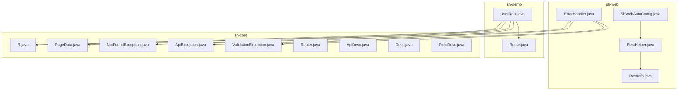
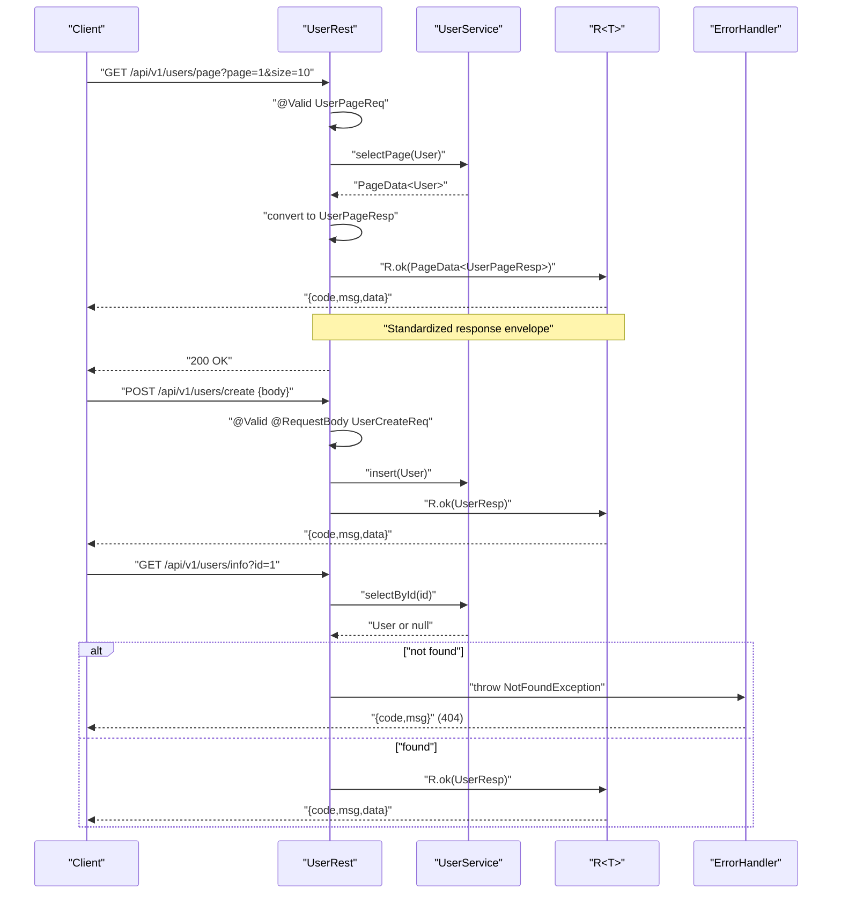
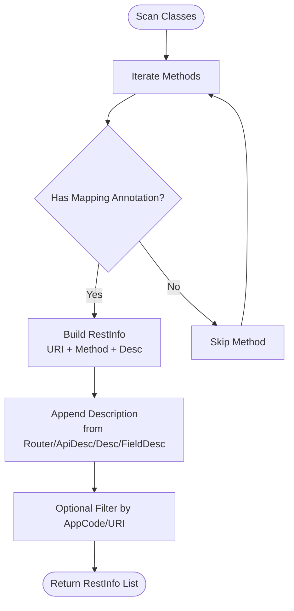
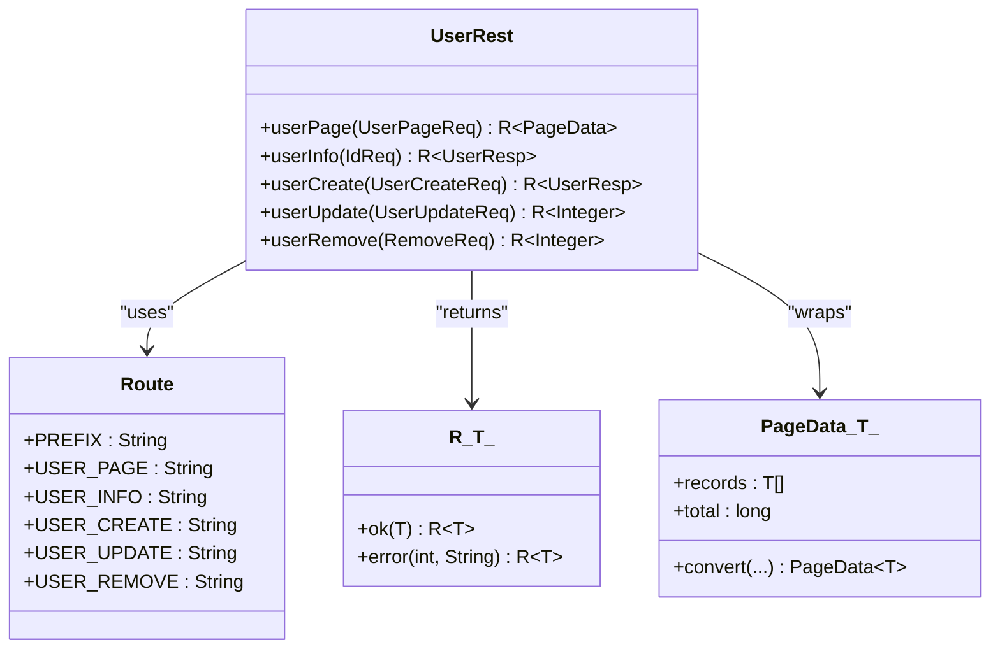
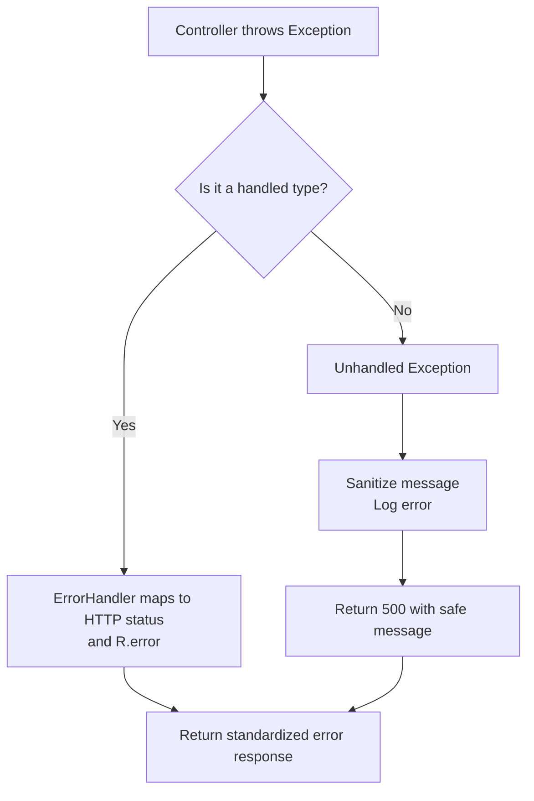
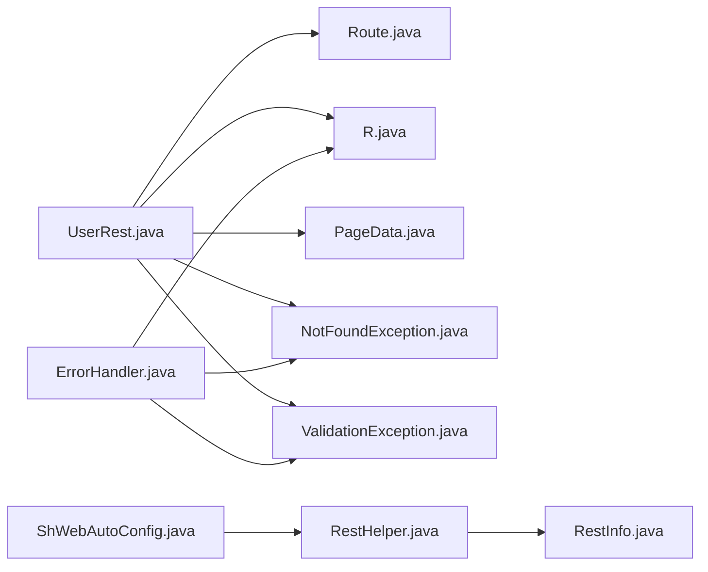

# REST Controllers

<cite>
**Referenced Files in This Document**
- [Route.java](file://sh-demo/src/main/java/com/wkclz/demo/rest/Route.java)
- [UserRest.java](file://sh-demo/src/main/java/com/wkclz/demo/rest/UserRest.java)
- [ShWebAutoConfig.java](file://sh-web/src/main/java/com/wkclz/web/ShWebAutoConfig.java)
- [RestHelper.java](file://sh-web/src/main/java/com/wkclz/web/helper/RestHelper.java)
- [RestInfo.java](file://sh-web/src/main/java/com/wkclz/web/bean/RestInfo.java)
- [ErrorHandler.java](file://sh-web/src/main/java/com/wkclz/web/rest/ErrorHandler.java)
- [R.java](file://sh-core/src/main/java/com/wkclz/core/base/R.java)
- [PageData.java](file://sh-core/src/main/java/com/wkclz/core/base/PageData.java)
- [IdReq.java](file://sh-web/src/main/java/com/wkclz/web/bean/IdReq.java)
- [RemoveReq.java](file://sh-web/src/main/java/com/wkclz/web/bean/RemoveReq.java)
- [UserPageReq.java](file://sh-demo/src/main/java/com/wkclz/demo/bean/vo/user/UserPageReq.java)
- [UserCreateReq.java](file://sh-demo/src/main/java/com/wkclz/demo/bean/vo/user/UserCreateReq.java)
- [UserUpdateReq.java](file://sh-demo/src/main/java/com/wkclz/demo/bean/vo/user/UserUpdateReq.java)
- [UserResp.java](file://sh-demo/src/main/java/com/wkclz/demo/bean/vo/user/UserResp.java)
- [UserPageResp.java](file://sh-demo/src/main/java/com/wkclz/demo/bean/vo/user/UserPageResp.java)
- [NotFoundException.java](file://sh-core/src/main/java/com/wkclz/core/exception/NotFoundException.java)
- [ApiException.java](file://sh-core/src/main/java/com/wkclz/core/exception/ApiException.java)
- [ValidationException.java](file://sh-core/src/main/java/com/wkclz/core/exception/ValidationException.java)
- [Router.java](file://sh-core/src/main/java/com/wkclz/core/annotation/Router.java)
- [ApiDesc.java](file://sh-core/src/main/java/com/wkclz/core/annotation/ApiDesc.java)
- [Desc.java](file://sh-core/src/main/java/com/wkclz/core/annotation/Desc.java)
- [FieldDesc.java](file://sh-core/src/main/java/com/wkclz/core/annotation/FieldDesc.java)
- [SKILL.md](file://.agents/skills/sh-web/SKILL.md)
</cite>

## Table of Contents
1. [Introduction](#introduction)
2. [Project Structure](#project-structure)
3. [Core Components](#core-components)
4. [Architecture Overview](#architecture-overview)
5. [Detailed Component Analysis](#detailed-component-analysis)
6. [Dependency Analysis](#dependency-analysis)
7. [Performance Considerations](#performance-considerations)
8. [Troubleshooting Guide](#troubleshooting-guide)
9. [Conclusion](#conclusion)
10. [Appendices](#appendices)

## Introduction
This document explains how to build REST controllers using the SH Framework’s conventions and auto-configuration. It covers standardized controller patterns, HTTP method mapping, URL patterns via the Route annotation system, parameter binding, response formatting, error handling, validation integration, and testing strategies. The goal is to enable developers to implement scalable, consistent REST APIs aligned with the framework’s design.

## Project Structure
The REST controller implementation spans three primary areas:
- Auto-configuration and web infrastructure live under sh-web.
- Example REST controllers and route definitions live under sh-demo.
- Core response wrappers and annotations live under sh-core.

**Diagram sources**
- [ShWebAutoConfig.java:1-9](file://sh-web/src/main/java/com/wkclz/web/ShWebAutoConfig.java#L1-L9)
- [RestHelper.java:97-159](file://sh-web/src/main/java/com/wkclz/web/helper/RestHelper.java#L97-L159)
- [RestInfo.java](file://sh-web/src/main/java/com/wkclz/web/bean/RestInfo.java)
- [ErrorHandler.java:28-59](file://sh-web/src/main/java/com/wkclz/web/rest/ErrorHandler.java#L28-L59)
- [UserRest.java:1-70](file://sh-demo/src/main/java/com/wkclz/demo/rest/UserRest.java#L1-L70)
- [Route.java](file://sh-demo/src/main/java/com/wkclz/demo/rest/Route.java)
- [R.java](file://sh-core/src/main/java/com/wkclz/core/base/R.java)
- [PageData.java](file://sh-core/src/main/java/com/wkclz/core/base/PageData.java)
- [NotFoundException.java](file://sh-core/src/main/java/com/wkclz/core/exception/NotFoundException.java)
- [ApiException.java](file://sh-core/src/main/java/com/wkclz/core/exception/ApiException.java)
- [ValidationException.java](file://sh-core/src/main/java/com/wkclz/core/exception/ValidationException.java)
- [Router.java](file://sh-core/src/main/java/com/wkclz/core/annotation/Router.java)
- [ApiDesc.java](file://sh-core/src/main/java/com/wkclz/core/annotation/ApiDesc.java)
- [Desc.java](file://sh-core/src/main/java/com/wkclz/core/annotation/Desc.java)
- [FieldDesc.java](file://sh-core/src/main/java/com/wkclz/core/annotation/FieldDesc.java)

**Section sources**
- [ShWebAutoConfig.java:1-9](file://sh-web/src/main/java/com/wkclz/web/ShWebAutoConfig.java#L1-L9)
- [UserRest.java:1-70](file://sh-demo/src/main/java/com/wkclz/demo/rest/UserRest.java#L1-L70)
- [Route.java](file://sh-demo/src/main/java/com/wkclz/demo/rest/Route.java)

## Core Components
- Auto-configuration: Enables component scanning for web infrastructure and REST-related helpers.
- Route annotation system: Centralizes URI patterns for controllers.
- REST metadata helper: Scans controllers for REST endpoints and builds metadata for documentation or introspection.
- Standardized response wrapper: Provides consistent JSON envelopes for all responses.
- Global error handling: Unified exception mapping and safe error responses.
- Validation integration: Uses Spring validation with framework-specific exceptions.

Key implementation references:
- Auto-configuration and component scan: [ShWebAutoConfig.java:1-9](file://sh-web/src/main/java/com/wkclz/web/ShWebAutoConfig.java#L1-L9)
- Route definition and controller mapping: [Route.java](file://sh-demo/src/main/java/com/wkclz/demo/rest/Route.java), [UserRest.java:24-25](file://sh-demo/src/main/java/com/wkclz/demo/rest/UserRest.java#L24-L25)
- REST metadata extraction: [RestHelper.java:97-159](file://sh-web/src/main/java/com/wkclz/web/helper/RestHelper.java#L97-L159), [RestInfo.java](file://sh-web/src/main/java/com/wkclz/web/bean/RestInfo.java)
- Response envelope: [R.java](file://sh-core/src/main/java/com/wkclz/core/base/R.java)
- Error handling: [ErrorHandler.java:28-59](file://sh-web/src/main/java/com/wkclz/web/rest/ErrorHandler.java#L28-L59)
- Validation and exceptions: [ValidationException.java](file://sh-core/src/main/java/com/wkclz/core/exception/ValidationException.java), [ApiException.java](file://sh-core/src/main/java/com/wkclz/core/exception/ApiException.java), [NotFoundException.java](file://sh-core/src/main/java/com/wkclz/core/exception/NotFoundException.java)

**Section sources**
- [ShWebAutoConfig.java:1-9](file://sh-web/src/main/java/com/wkclz/web/ShWebAutoConfig.java#L1-L9)
- [RestHelper.java:97-159](file://sh-web/src/main/java/com/wkclz/web/helper/RestHelper.java#L97-L159)
- [RestInfo.java](file://sh-web/src/main/java/com/wkclz/web/bean/RestInfo.java)
- [R.java](file://sh-core/src/main/java/com/wkclz/core/base/R.java)
- [ErrorHandler.java:28-59](file://sh-web/src/main/java/com/wkclz/web/rest/ErrorHandler.java#L28-L59)
- [ValidationException.java](file://sh-core/src/main/java/com/wkclz/core/exception/ValidationException.java)
- [ApiException.java](file://sh-core/src/main/java/com/wkclz/core/exception/ApiException.java)
- [NotFoundException.java](file://sh-core/src/main/java/com/wkclz/core/exception/NotFoundException.java)

## Architecture Overview
The REST controller architecture integrates Spring MVC with framework conventions:
- Controllers are annotated with @RestController and mapped under a shared prefix from Route.
- HTTP methods are mapped using Spring’s mapping annotations (@GetMapping, @PostMapping, etc.).
- Requests are validated using @Valid with framework DTOs (e.g., IdReq, RemoveReq, PageReq).
- Responses are wrapped using R<T>, ensuring consistent structure.
- Global error handling standardizes error responses and logging.

**Diagram sources**
- [UserRest.java:30-70](file://sh-demo/src/main/java/com/wkclz/demo/rest/UserRest.java#L30-L70)
- [UserPageReq.java](file://sh-demo/src/main/java/com/wkclz/demo/bean/vo/user/UserPageReq.java)
- [UserCreateReq.java](file://sh-demo/src/main/java/com/wkclz/demo/bean/vo/user/UserCreateReq.java)
- [UserResp.java](file://sh-demo/src/main/java/com/wkclz/demo/bean/vo/user/UserResp.java)
- [UserPageResp.java](file://sh-demo/src/main/java/com/wkclz/demo/bean/vo/user/UserPageResp.java)
- [IdReq.java](file://sh-web/src/main/java/com/wkclz/web/bean/IdReq.java)
- [RemoveReq.java](file://sh-web/src/main/java/com/wkclz/web/bean/RemoveReq.java)
- [R.java](file://sh-core/src/main/java/com/wkclz/core/base/R.java)
- [NotFoundException.java](file://sh-core/src/main/java/com/wkclz/core/exception/NotFoundException.java)
- [ErrorHandler.java:28-59](file://sh-web/src/main/java/com/wkclz/web/rest/ErrorHandler.java#L28-L59)

## Detailed Component Analysis

### Auto-Configuration and Web Infrastructure
- Purpose: Enable automatic discovery and registration of web infrastructure components.
- Mechanism: A Spring Boot @AutoConfiguration with component scanning for the com.wkclz.web package.
- Impact: Ensures RestHelper and other web beans are available for endpoint metadata collection and error handling.

Implementation reference:
- [ShWebAutoConfig.java:1-9](file://sh-web/src/main/java/com/wkclz/web/ShWebAutoConfig.java#L1-L9)

**Section sources**
- [ShWebAutoConfig.java:1-9](file://sh-web/src/main/java/com/wkclz/web/ShWebAutoConfig.java#L1-L9)

### Route Annotation System and Controller Organization
- Purpose: Define centralized URI patterns for REST endpoints.
- Mechanism: A Route class defines constants for endpoint suffixes. Controllers annotate @RequestMapping(Route.PREFIX) and individual methods with suffix constants (e.g., Route.USER_PAGE).
- Benefits: Consistent URL patterns, easy refactoring, and discoverability.

Implementation reference:
- [Route.java](file://sh-demo/src/main/java/com/wkclz/demo/rest/Route.java)
- [UserRest.java:24-25](file://sh-demo/src/main/java/com/wkclz/demo/rest/UserRest.java#L24-L25)

**Section sources**
- [Route.java](file://sh-demo/src/main/java/com/wkclz/demo/rest/Route.java)
- [UserRest.java:24-25](file://sh-demo/src/main/java/com/wkclz/demo/rest/UserRest.java#L24-L25)

### REST Endpoint Metadata Extraction
- Purpose: Scan controllers for REST endpoints and collect metadata (URI, method, description).
- Mechanism: RestHelper inspects methods for Spring MVC mapping annotations and constructs RestInfo entries. It supports RequestMapping, GetMapping, PostMapping, PutMapping, DeleteMapping and appends descriptions from Router/ApiDesc/Desc/FieldDesc annotations.
- Output: A list of RestInfo objects suitable for documentation or introspection.

Implementation reference:
- [RestHelper.java:97-159](file://sh-web/src/main/java/com/wkclz/web/helper/RestHelper.java#L97-L159)
- [RestInfo.java](file://sh-web/src/main/java/com/wkclz/web/bean/RestInfo.java)
- [Router.java](file://sh-core/src/main/java/com/wkclz/core/annotation/Router.java)
- [ApiDesc.java](file://sh-core/src/main/java/com/wkclz/core/annotation/ApiDesc.java)
- [Desc.java](file://sh-core/src/main/java/com/wkclz/core/annotation/Desc.java)
- [FieldDesc.java](file://sh-core/src/main/java/com/wkclz/core/annotation/FieldDesc.java)

**Diagram sources**
- [RestHelper.java:97-159](file://sh-web/src/main/java/com/wkclz/web/helper/RestHelper.java#L97-L159)
- [Router.java](file://sh-core/src/main/java/com/wkclz/core/annotation/Router.java)
- [ApiDesc.java](file://sh-core/src/main/java/com/wkclz/core/annotation/ApiDesc.java)
- [Desc.java](file://sh-core/src/main/java/com/wkclz/core/annotation/Desc.java)
- [FieldDesc.java](file://sh-core/src/main/java/com/wkclz/core/annotation/FieldDesc.java)

**Section sources**
- [RestHelper.java:97-159](file://sh-web/src/main/java/com/wkclz/web/helper/RestHelper.java#L97-L159)
- [RestInfo.java](file://sh-web/src/main/java/com/wkclz/web/bean/RestInfo.java)
- [Router.java](file://sh-core/src/main/java/com/wkclz/core/annotation/Router.java)
- [ApiDesc.java](file://sh-core/src/main/java/com/wkclz/core/annotation/ApiDesc.java)
- [Desc.java](file://sh-core/src/main/java/com/wkclz/core/annotation/Desc.java)
- [FieldDesc.java](file://sh-core/src/main/java/com/wkclz/core/annotation/FieldDesc.java)

### Creating REST Endpoints: Conventions and Patterns
- HTTP method mapping: Use @GetMapping, @PostMapping, @PutMapping, @DeleteMapping per operation.
- URL patterns: Combine @RequestMapping(Route.PREFIX) with Route constants for suffixes.
- Parameter binding: Use @Valid with request DTOs (e.g., IdReq, RemoveReq, PageReq).
- Response handling: Wrap results with R<T> and use PageData<T> for paginated responses.
- Example operations: Page query, info retrieval, creation, update, removal.

Implementation reference:
- [UserRest.java:30-70](file://sh-demo/src/main/java/com/wkclz/demo/rest/UserRest.java#L30-L70)
- [Route.java](file://sh-demo/src/main/java/com/wkclz/demo/rest/Route.java)
- [R.java](file://sh-core/src/main/java/com/wkclz/core/base/R.java)
- [PageData.java](file://sh-core/src/main/java/com/wkclz/core/base/PageData.java)
- [IdReq.java](file://sh-web/src/main/java/com/wkclz/web/bean/IdReq.java)
- [RemoveReq.java](file://sh-web/src/main/java/com/wkclz/web/bean/RemoveReq.java)
- [UserPageReq.java](file://sh-demo/src/main/java/com/wkclz/demo/bean/vo/user/UserPageReq.java)
- [UserCreateReq.java](file://sh-demo/src/main/java/com/wkclz/demo/bean/vo/user/UserCreateReq.java)
- [UserUpdateReq.java](file://sh-demo/src/main/java/com/wkclz/demo/bean/vo/user/UserUpdateReq.java)
- [UserResp.java](file://sh-demo/src/main/java/com/wkclz/demo/bean/vo/user/UserResp.java)
- [UserPageResp.java](file://sh-demo/src/main/java/com/wkclz/demo/bean/vo/user/UserPageResp.java)

**Diagram sources**
- [UserRest.java:30-70](file://sh-demo/src/main/java/com/wkclz/demo/rest/UserRest.java#L30-L70)
- [Route.java](file://sh-demo/src/main/java/com/wkclz/demo/rest/Route.java)
- [R.java](file://sh-core/src/main/java/com/wkclz/core/base/R.java)
- [PageData.java](file://sh-core/src/main/java/com/wkclz/core/base/PageData.java)

**Section sources**
- [UserRest.java:30-70](file://sh-demo/src/main/java/com/wkclz/demo/rest/UserRest.java#L30-L70)
- [Route.java](file://sh-demo/src/main/java/com/wkclz/demo/rest/Route.java)
- [R.java](file://sh-core/src/main/java/com/wkclz/core/base/R.java)
- [PageData.java](file://sh-core/src/main/java/com/wkclz/core/base/PageData.java)

### Error Handling Within Controllers and Globally
- Controller-level errors: Throw framework exceptions (e.g., NotFoundException) to signal not-found scenarios.
- Global error handling: ErrorHandler maps specific exceptions to appropriate HTTP statuses and wraps messages in R.error.
- Safe error responses: Prevents stack traces from leaking by sanitizing messages for unhandled exceptions.
- Logging and alerts: Non-user exceptions trigger error logs and optional email alerts.

Implementation reference:
- [UserRest.java:51-53](file://sh-demo/src/main/java/com/wkclz/demo/rest/UserRest.java#L51-L53)
- [ErrorHandler.java:28-59](file://sh-web/src/main/java/com/wkclz/web/rest/ErrorHandler.java#L28-L59)
- [NotFoundException.java](file://sh-core/src/main/java/com/wkclz/core/exception/NotFoundException.java)
- [ApiException.java](file://sh-core/src/main/java/com/wkclz/core/exception/ApiException.java)
- [ValidationException.java](file://sh-core/src/main/java/com/wkclz/core/exception/ValidationException.java)

**Diagram sources**
- [ErrorHandler.java:28-59](file://sh-web/src/main/java/com/wkclz/web/rest/ErrorHandler.java#L28-L59)
- [NotFoundException.java](file://sh-core/src/main/java/com/wkclz/core/exception/NotFoundException.java)
- [ApiException.java](file://sh-core/src/main/java/com/wkclz/core/exception/ApiException.java)
- [ValidationException.java](file://sh-core/src/main/java/com/wkclz/core/exception/ValidationException.java)

**Section sources**
- [UserRest.java:51-53](file://sh-demo/src/main/java/com/wkclz/demo/rest/UserRest.java#L51-L53)
- [ErrorHandler.java:28-59](file://sh-web/src/main/java/com/wkclz/web/rest/ErrorHandler.java#L28-L59)
- [NotFoundException.java](file://sh-core/src/main/java/com/wkclz/core/exception/NotFoundException.java)
- [ApiException.java](file://sh-core/src/main/java/com/wkclz/core/exception/ApiException.java)
- [ValidationException.java](file://sh-core/src/main/java/com/wkclz/core/exception/ValidationException.java)

### Integration with the Framework’s Validation System
- Validation annotations: Use @Valid on request DTOs to trigger Spring validation.
- Validation exceptions: Framework converts validation failures into structured error responses.
- Request DTOs: Reuse common request beans (e.g., IdReq, RemoveReq) for consistent parameter binding.

Implementation reference:
- [UserRest.java:32](file://sh-demo/src/main/java/com/wkclz/demo/rest/UserRest.java#L32)
- [UserRest.java:48](file://sh-demo/src/main/java/com/wkclz/demo/rest/UserRest.java#L48)
- [UserRest.java:61](file://sh-demo/src/main/java/com/wkclz/demo/rest/UserRest.java#L61)
- [ValidationException.java](file://sh-core/src/main/java/com/wkclz/core/exception/ValidationException.java)
- [IdReq.java](file://sh-web/src/main/java/com/wkclz/web/bean/IdReq.java)
- [RemoveReq.java](file://sh-web/src/main/java/com/wkclz/web/bean/RemoveReq.java)

**Section sources**
- [UserRest.java:32](file://sh-demo/src/main/java/com/wkclz/demo/rest/UserRest.java#L32)
- [UserRest.java:48](file://sh-demo/src/main/java/com/wkclz/demo/rest/UserRest.java#L48)
- [UserRest.java:61](file://sh-demo/src/main/java/com/wkclz/demo/rest/UserRest.java#L61)
- [ValidationException.java](file://sh-core/src/main/java/com/wkclz/core/exception/ValidationException.java)
- [IdReq.java](file://sh-web/src/main/java/com/wkclz/web/bean/IdReq.java)
- [RemoveReq.java](file://sh-web/src/main/java/com/wkclz/web/bean/RemoveReq.java)

### Testing Strategies for REST Controllers
Recommended patterns:
- Unit tests for controller logic: Mock service dependencies, assert response wrapping and status codes.
- Validation tests: Verify @Valid triggers appropriate error responses for invalid inputs.
- Edge-case tests: Test not-found scenarios and exception flows routed through ErrorHandler.
- Contract tests: Use the Route constants and R<T> envelope to validate endpoint contracts.

Reference materials:
- [SKILL.md](file://.agents/skills/sh-web/SKILL.md) documents standard CRUD interface patterns and expected behaviors.

**Section sources**
- [SKILL.md](file://.agents/skills/sh-web/SKILL.md)

## Dependency Analysis
The REST controller layer depends on:
- sh-web for auto-configuration, error handling, and REST metadata helpers.
- sh-core for response envelopes, pagination, and exception types.
- sh-demo for concrete controller examples and route definitions.

**Diagram sources**
- [UserRest.java:1-70](file://sh-demo/src/main/java/com/wkclz/demo/rest/UserRest.java#L1-L70)
- [Route.java](file://sh-demo/src/main/java/com/wkclz/demo/rest/Route.java)
- [R.java](file://sh-core/src/main/java/com/wkclz/core/base/R.java)
- [PageData.java](file://sh-core/src/main/java/com/wkclz/core/base/PageData.java)
- [NotFoundException.java](file://sh-core/src/main/java/com/wkclz/core/exception/NotFoundException.java)
- [ValidationException.java](file://sh-core/src/main/java/com/wkclz/core/exception/ValidationException.java)
- [ShWebAutoConfig.java:1-9](file://sh-web/src/main/java/com/wkclz/web/ShWebAutoConfig.java#L1-L9)
- [RestHelper.java:97-159](file://sh-web/src/main/java/com/wkclz/web/helper/RestHelper.java#L97-L159)
- [RestInfo.java](file://sh-web/src/main/java/com/wkclz/web/bean/RestInfo.java)
- [ErrorHandler.java:28-59](file://sh-web/src/main/java/com/wkclz/web/rest/ErrorHandler.java#L28-L59)

**Section sources**
- [UserRest.java:1-70](file://sh-demo/src/main/java/com/wkclz/demo/rest/UserRest.java#L1-L70)
- [Route.java](file://sh-demo/src/main/java/com/wkclz/demo/rest/Route.java)
- [R.java](file://sh-core/src/main/java/com/wkclz/core/base/R.java)
- [PageData.java](file://sh-core/src/main/java/com/wkclz/core/base/PageData.java)
- [NotFoundException.java](file://sh-core/src/main/java/com/wkclz/core/exception/NotFoundException.java)
- [ValidationException.java](file://sh-core/src/main/java/com/wkclz/core/exception/ValidationException.java)
- [ShWebAutoConfig.java:1-9](file://sh-web/src/main/java/com/wkclz/web/ShWebAutoConfig.java#L1-L9)
- [RestHelper.java:97-159](file://sh-web/src/main/java/com/wkclz/web/helper/RestHelper.java#L97-L159)
- [RestInfo.java](file://sh-web/src/main/java/com/wkclz/web/bean/RestInfo.java)
- [ErrorHandler.java:28-59](file://sh-web/src/main/java/com/wkclz/web/rest/ErrorHandler.java#L28-L59)

## Performance Considerations
- Minimize object copying: Convert entities to response DTOs efficiently; avoid unnecessary allocations.
- Pagination: Use PageData to limit payload sizes and improve client performance.
- Validation overhead: Keep validation DTOs concise; leverage @Valid only where needed.
- Error handling cost: Centralized error handling reduces duplication and improves consistency.

## Troubleshooting Guide
Common issues and resolutions:
- 404 Not Found: Verify Route constants and @RequestMapping prefix; confirm endpoint exists and is scanned by RestHelper.
- 400 Bad Request: Inspect @Valid DTOs and ValidationException mapping; ensure request body matches expected structure.
- 405 Method Not Allowed: Confirm HTTP method mapping aligns with controller annotations.
- 500 Internal Server Error: Review ErrorHandler behavior; check logs for sanitized messages and potential email alerts.

References:
- [ErrorHandler.java:28-59](file://sh-web/src/main/java/com/wkclz/web/rest/ErrorHandler.java#L28-L59)
- [SKILL.md](file://.agents/skills/sh-web/SKILL.md)

**Section sources**
- [ErrorHandler.java:28-59](file://sh-web/src/main/java/com/wkclz/web/rest/ErrorHandler.java#L28-L59)
- [SKILL.md](file://.agents/skills/sh-web/SKILL.md)

## Conclusion
The SH Framework provides a cohesive, convention-driven approach to building REST controllers. By centralizing routes, standardizing responses, integrating validation, and offering global error handling, it enables teams to deliver scalable, maintainable APIs quickly. Following the documented patterns ensures consistency across services and simplifies testing and maintenance.

## Appendices
- Standard CRUD interface patterns and expected behaviors are documented in [SKILL.md](file://.agents/skills/sh-web/SKILL.md).