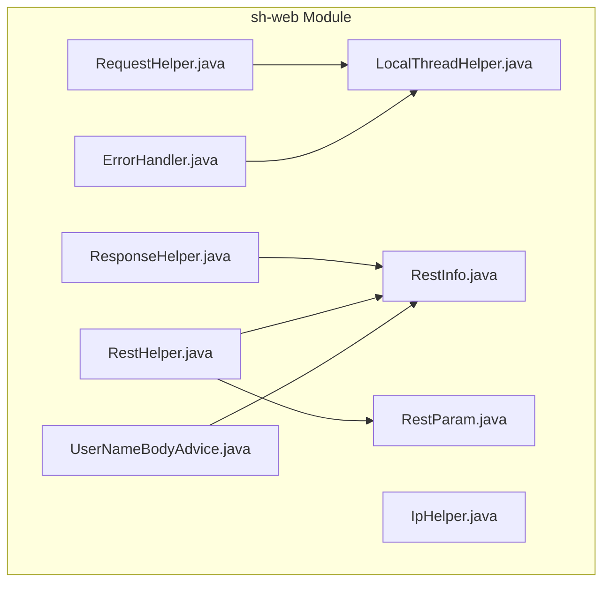
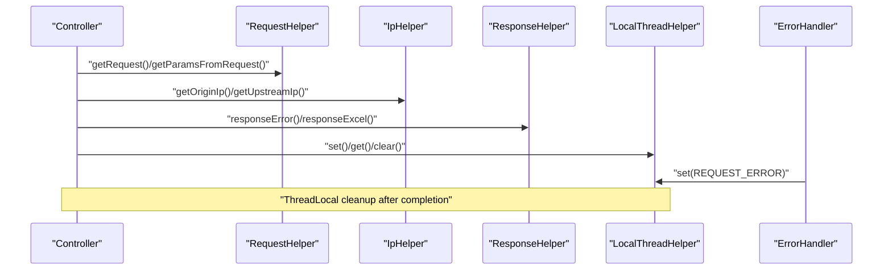
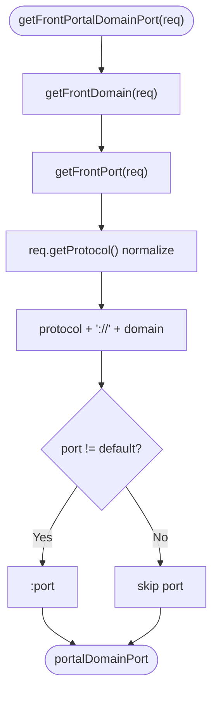
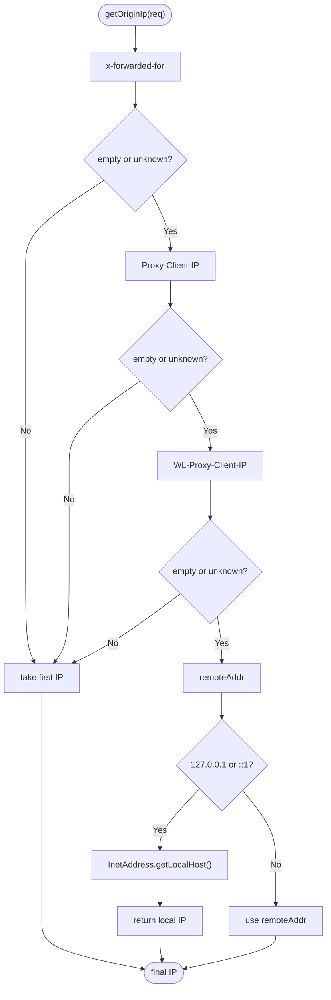
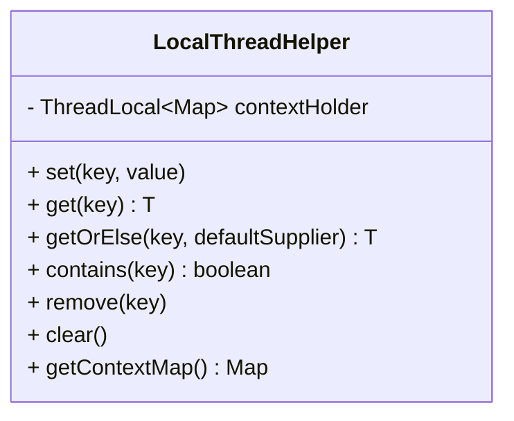
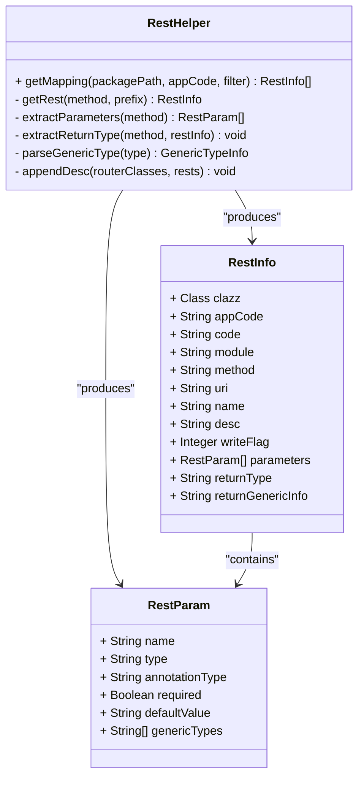
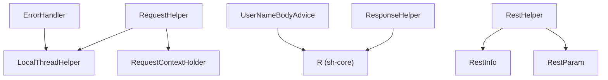

# Request/Response Helpers

<cite>
**Referenced Files in This Document**
- [RequestHelper.java](file://sh-web/src/main/java/com/wkclz/web/helper/RequestHelper.java)
- [ResponseHelper.java](file://sh-web/src/main/java/com/wkclz/web/helper/ResponseHelper.java)
- [IpHelper.java](file://sh-web/src/main/java/com/wkclz/web/helper/IpHelper.java)
- [LocalThreadHelper.java](file://sh-web/src/main/java/com/wkclz/web/helper/LocalThreadHelper.java)
- [RestHelper.java](file://sh-web/src/main/java/com/wkclz/web/helper/RestHelper.java)
- [RestInfo.java](file://sh-web/src/main/java/com/wkclz/web/bean/RestInfo.java)
- [RestParam.java](file://sh-web/src/main/java/com/wkclz/web/bean/RestParam.java)
- [ErrorHandler.java](file://sh-web/src/main/java/com/wkclz/web/rest/ErrorHandler.java)
- [UserNameBodyAdvice.java](file://sh-web/src/main/java/com/wkclz/web/rest/UserNameBodyAdvice.java)
- [SKILL.md](file://.agents/skills/sh-web/SKILL.md)
- [US-002-统一响应结果封装.md](file://docs/stories/US-002-统一响应结果封装.md)
- [US-013-响应体用户名自动填充.md](file://docs/stories/US-013-响应体用户名自动填充.md)
- [fix-threadlocal-leak/spec.md](file://.trae/specs/fix-threadlocal-leak/spec.md)
- [RestHelperTest.java](file://sh-web/src/test/java/com/wkclz/web/helper/RestHelperTest.java)
</cite>

## Table of Contents
1. [Introduction](#introduction)
2. [Project Structure](#project-structure)
3. [Core Components](#core-components)
4. [Architecture Overview](#architecture-overview)
5. [Detailed Component Analysis](#detailed-component-analysis)
6. [Dependency Analysis](#dependency-analysis)
7. [Performance Considerations](#performance-considerations)
8. [Troubleshooting Guide](#troubleshooting-guide)
9. [Conclusion](#conclusion)
10. [Appendices](#appendices)

## Introduction
This document provides comprehensive documentation for the web layer helper classes that streamline request and response processing in the framework. It covers:
- RequestHelper: extracting request information, resolving client IPs, and managing request context
- ResponseHelper: formatting responses, content negotiation, and HTTP status handling
- IpHelper: robust client IP detection across proxy and load balancer environments
- LocalThreadHelper: thread-local context management with lifecycle-aware cleanup
- RestHelper: unified REST metadata extraction and documentation generation

Practical usage scenarios demonstrate how these helpers integrate with controllers, middleware, and utility functions. The guide also addresses performance characteristics, thread safety, and common use cases.

## Project Structure
The web helpers reside under the sh-web module and are supported by shared beans and Spring MVC integration points.



**Diagram sources**
- [RequestHelper.java:1-173](file://sh-web/src/main/java/com/wkclz/web/helper/RequestHelper.java#L1-L173)
- [ResponseHelper.java:1-71](file://sh-web/src/main/java/com/wkclz/web/helper/ResponseHelper.java#L1-L71)
- [IpHelper.java:1-51](file://sh-web/src/main/java/com/wkclz/web/helper/IpHelper.java#L1-L51)
- [LocalThreadHelper.java:1-95](file://sh-web/src/main/java/com/wkclz/web/helper/LocalThreadHelper.java#L1-L95)
- [RestHelper.java:1-554](file://sh-web/src/main/java/com/wkclz/web/helper/RestHelper.java#L1-L554)
- [RestInfo.java:1-37](file://sh-web/src/main/java/com/wkclz/web/bean/RestInfo.java#L1-L37)
- [RestParam.java:1-50](file://sh-web/src/main/java/com/wkclz/web/bean/RestParam.java#L1-L50)
- [ErrorHandler.java](file://sh-web/src/main/java/com/wkclz/web/rest/ErrorHandler.java)
- [UserNameBodyAdvice.java](file://sh-web/src/main/java/com/wkclz/web/rest/UserNameBodyAdvice.java)

**Section sources**
- [RequestHelper.java:1-173](file://sh-web/src/main/java/com/wkclz/web/helper/RequestHelper.java#L1-L173)
- [ResponseHelper.java:1-71](file://sh-web/src/main/java/com/wkclz/web/helper/ResponseHelper.java#L1-L71)
- [IpHelper.java:1-51](file://sh-web/src/main/java/com/wkclz/web/helper/IpHelper.java#L1-L51)
- [LocalThreadHelper.java:1-95](file://sh-web/src/main/java/com/wkclz/web/helper/LocalThreadHelper.java#L1-L95)
- [RestHelper.java:1-554](file://sh-web/src/main/java/com/wkclz/web/helper/RestHelper.java#L1-L554)
- [RestInfo.java:1-37](file://sh-web/src/main/java/com/wkclz/web/bean/RestInfo.java#L1-L37)
- [RestParam.java:1-50](file://sh-web/src/main/java/com/wkclz/web/bean/RestParam.java#L1-L50)

## Core Components
This section introduces each helper and its primary responsibilities.

- RequestHelper
  - Extracts request parameters and builds a normalized Map
  - Resolves frontend origin domain/port/protocol for cross-origin scenarios
  - Retrieves current HttpServletRequest via RequestContextHolder or LocalThreadHelper fallback
  - Provides Ant-style URI matching for routing and filtering

- ResponseHelper
  - Writes standardized JSON error responses with sanitized timing fields
  - Streams binary downloads (e.g., Excel) with proper headers and RFC 5987 filename encoding

- IpHelper
  - Implements a robust chain to detect the original client IP behind proxies/load balancers
  - Handles loopback addresses by resolving local host IP

- LocalThreadHelper
  - Provides a thread-safe, multi-key context store backed by ThreadLocal and ConcurrentHashMap
  - Offers set/get/remove/clear operations and safe default retrieval
  - Requires explicit cleanup to prevent memory leaks

- RestHelper
  - Scans controller classes to extract REST metadata (URI, method, parameters, return types)
  - Supports annotations like @RequestMapping, @GetMapping, @PostMapping, @PutMapping, @DeleteMapping
  - Integrates with @Desc and @ApiDesc for descriptions and @Router for grouping

**Section sources**
- [RequestHelper.java:50-173](file://sh-web/src/main/java/com/wkclz/web/helper/RequestHelper.java#L50-L173)
- [ResponseHelper.java:19-71](file://sh-web/src/main/java/com/wkclz/web/helper/ResponseHelper.java#L19-L71)
- [IpHelper.java:17-48](file://sh-web/src/main/java/com/wkclz/web/helper/IpHelper.java#L17-L48)
- [LocalThreadHelper.java:30-95](file://sh-web/src/main/java/com/wkclz/web/helper/LocalThreadHelper.java#L30-L95)
- [RestHelper.java:42-115](file://sh-web/src/main/java/com/wkclz/web/helper/RestHelper.java#L42-L115)

## Architecture Overview
The helpers collaborate with Spring MVC and shared beans to provide a cohesive web layer.



**Diagram sources**
- [RequestHelper.java:83-90](file://sh-web/src/main/java/com/wkclz/web/helper/RequestHelper.java#L83-L90)
- [IpHelper.java:17-48](file://sh-web/src/main/java/com/wkclz/web/helper/IpHelper.java#L17-L48)
- [ResponseHelper.java:19-68](file://sh-web/src/main/java/com/wkclz/web/helper/ResponseHelper.java#L19-L68)
- [LocalThreadHelper.java:30-84](file://sh-web/src/main/java/com/wkclz/web/helper/LocalThreadHelper.java#L30-L84)
- [ErrorHandler.java](file://sh-web/src/main/java/com/wkclz/web/rest/ErrorHandler.java)

## Detailed Component Analysis

### RequestHelper
Purpose:
- Normalize request parameters into a Map
- Resolve frontend origin domain/port/protocol
- Retrieve current HttpServletRequest from RequestContextHolder or LocalThreadHelper
- Match URIs using AntPathMatcher

Key methods and behaviors:
- Parameter normalization: Iterates over parameterMap and concatenates multiple values with commas
- Frontend origin resolution: Prefers Origin header, falls back to Referer, then current URL
- Domain/port extraction: Robust parsing with URI/URL conversion and exception handling
- Protocol normalization: Converts "HTTP/1.1"/"HTTPS/1.1" to "http"/"https"
- Request retrieval: Dual-source strategy using RequestContextHolder and LocalThreadHelper



**Diagram sources**
- [RequestHelper.java:154-169](file://sh-web/src/main/java/com/wkclz/web/helper/RequestHelper.java#L154-L169)

Usage examples:
- Controllers can call getRequest() to access the current request context
- Middleware can use getParamsFromRequest() to build a normalized parameter map
- Utilities can compute frontend portal URLs for redirect or logging

Performance and thread safety:
- Uses AntPathMatcher as a singleton constant
- Relies on RequestContextHolder and LocalThreadHelper for request context
- Safe for concurrent use within a single request lifecycle

**Section sources**
- [RequestHelper.java:50-173](file://sh-web/src/main/java/com/wkclz/web/helper/RequestHelper.java#L50-L173)

### ResponseHelper
Purpose:
- Standardize error responses using the unified R<T> envelope
- Stream binary downloads with appropriate headers and filename encoding

Key methods and behaviors:
- Error response: Sets Content-Type to application/json, removes timing fields, writes JSON via PrintWriter
- Excel download: Encodes filename per RFC 5987, sets Content-Disposition and Content-Length, streams 8KB buffers

```mermaid
sequenceDiagram
participant C as "Controller"
participant RSH as "ResponseHelper"
participant Resp as "HttpServletResponse"
C->>RSH : "responseError(rep, R.error(...))"
RSH->>Resp : "setHeader('Content-Type', 'application/json;charset=UTF-8')"
RSH->>Resp : "getWriter()"
RSH->>Resp : "print(JSON)"
Resp-->>C : "error response written"
C->>RSH : "responseExcel(response, file)"
RSH->>Resp : "setContentType('application/x-excel')"
RSH->>Resp : "setHeader('Content-Disposition', 'attachment; filename*=UTF-8''...')"
RSH->>Resp : "setHeader('Content-Length', size)"
RSH->>Resp : "stream file bytes"
```

**Diagram sources**
- [ResponseHelper.java:19-68](file://sh-web/src/main/java/com/wkclz/web/helper/ResponseHelper.java#L19-L68)

Usage examples:
- Global exception handlers call responseError() to return standardized error envelopes
- Export endpoints call responseExcel() to deliver downloadable files

Performance and thread safety:
- Uses buffered streaming for large files
- PrintWriter-based JSON writing avoids intermediate collections

**Section sources**
- [ResponseHelper.java:19-71](file://sh-web/src/main/java/com/wkclz/web/helper/ResponseHelper.java#L19-L71)

### IpHelper
Purpose:
- Accurately resolve the original client IP address across diverse deployment topologies

Algorithm:
- Checks x-forwarded-for, Proxy-Client-IP, WL-Proxy-Client-IP headers
- Falls back to remoteAddr; if loopback, resolves local host IP
- Handles comma-separated lists by taking the first IP



**Diagram sources**
- [IpHelper.java:22-48](file://sh-web/src/main/java/com/wkclz/web/helper/IpHelper.java#L22-L48)

Usage examples:
- Logging services can capture real client IPs
- Security components can enforce policies based on origin IPs

**Section sources**
- [IpHelper.java:17-48](file://sh-web/src/main/java/com/wkclz/web/helper/IpHelper.java#L17-L48)

### LocalThreadHelper
Purpose:
- Provide a thread-safe, multi-key context store for request-scoped data (e.g., user info, trace IDs)

Design:
- ThreadLocal-backed storage with ConcurrentHashMap for per-thread map operations
- Supports set/get/remove/clear and default value supplier
- Exposes a read-only snapshot of current context for diagnostics

Lifecycle management:
- Requires explicit clear() at the end of request processing to avoid memory leaks
- Integrated with Spring MVC via a dedicated interceptor that cleans up after completion



**Diagram sources**
- [LocalThreadHelper.java:12-95](file://sh-web/src/main/java/com/wkclz/web/helper/LocalThreadHelper.java#L12-L95)

Integration:
- ErrorHandler stores error messages in LocalThreadHelper for downstream consumption
- A dedicated interceptor ensures clear() is invoked after every request

**Section sources**
- [LocalThreadHelper.java:30-95](file://sh-web/src/main/java/com/wkclz/web/helper/LocalThreadHelper.java#L30-L95)
- [ErrorHandler.java](file://sh-web/src/main/java/com/wkclz/web/rest/ErrorHandler.java)
- [fix-threadlocal-leak/spec.md:39-44](file://.trae/specs/fix-threadlocal-leak/spec.md#L39-L44)

### RestHelper
Purpose:
- Scan controller classes and extract REST metadata for documentation and runtime introspection

Capabilities:
- Discovers @RestController and @Controller classes
- Reads @RequestMapping and HTTP-method-specific annotations
- Extracts parameter metadata (@RequestBody, @PathVariable, @RequestParam) and defaults
- Parses return types and nested generics into structured metadata
- Augments metadata with descriptions from @Desc/@ApiDesc and @Router



**Diagram sources**
- [RestHelper.java:42-115](file://sh-web/src/main/java/com/wkclz/web/helper/RestHelper.java#L42-L115)
- [RestInfo.java:8-37](file://sh-web/src/main/java/com/wkclz/web/bean/RestInfo.java#L8-L37)
- [RestParam.java:10-50](file://sh-web/src/main/java/com/wkclz/web/bean/RestParam.java#L10-L50)

Usage examples:
- Generate API catalogs for documentation systems
- Build dynamic permission matrices based on writeFlag derived from URI patterns
- Support automated testing and contract-first development

Validation and tests:
- Unit tests verify extraction of single-level, nested, and deep generic return types
- Tests cover void methods and plain classes

**Section sources**
- [RestHelper.java:42-554](file://sh-web/src/main/java/com/wkclz/web/helper/RestHelper.java#L42-L554)
- [RestInfo.java:8-37](file://sh-web/src/main/java/com/wkclz/web/bean/RestInfo.java#L8-L37)
- [RestParam.java:10-50](file://sh-web/src/main/java/com/wkclz/web/bean/RestParam.java#L10-L50)
- [RestHelperTest.java:18-57](file://sh-web/src/test/java/com/wkclz/web/helper/RestHelperTest.java#L18-L57)

## Dependency Analysis
Relationships among the helpers and supporting components:



**Diagram sources**
- [RequestHelper.java:83-90](file://sh-web/src/main/java/com/wkclz/web/helper/RequestHelper.java#L83-L90)
- [ResponseHelper.java:19-32](file://sh-web/src/main/java/com/wkclz/web/helper/ResponseHelper.java#L19-L32)
- [RestHelper.java:117-209](file://sh-web/src/main/java/com/wkclz/web/helper/RestHelper.java#L117-L209)
- [ErrorHandler.java](file://sh-web/src/main/java/com/wkclz/web/rest/ErrorHandler.java)
- [UserNameBodyAdvice.java](file://sh-web/src/main/java/com/wkclz/web/rest/UserNameBodyAdvice.java)

**Section sources**
- [RequestHelper.java:83-90](file://sh-web/src/main/java/com/wkclz/web/helper/RequestHelper.java#L83-L90)
- [ResponseHelper.java:19-32](file://sh-web/src/main/java/com/wkclz/web/helper/ResponseHelper.java#L19-L32)
- [RestHelper.java:117-209](file://sh-web/src/main/java/com/wkclz/web/helper/RestHelper.java#L117-L209)
- [ErrorHandler.java](file://sh-web/src/main/java/com/wkclz/web/rest/ErrorHandler.java)
- [UserNameBodyAdvice.java](file://sh-web/src/main/java/com/wkclz/web/rest/UserNameBodyAdvice.java)

## Performance Considerations
- RequestHelper
  - Parameter normalization iterates over all keys; keep request payloads reasonable
  - AntPathMatcher is reused as a singleton constant to minimize overhead
- ResponseHelper
  - JSON error responses use streaming writer to avoid large in-memory allocations
  - Excel downloads stream in 8KB chunks; ensure server-side buffering aligns with network throughput
- IpHelper
  - Header parsing is O(n) with n headers; negligible overhead
  - Local host resolution occurs only on loopback; cache results at higher layers if needed
- LocalThreadHelper
  - ThreadLocal per-thread map operations are O(1); avoid storing large objects
  - Clear on completion prevents memory leaks; ensure interceptor registration is effective
- RestHelper
  - Reflection-based scanning occurs at startup or on-demand; cache results in production
  - Generic type parsing traverses nested generics; limit depth in API designs for performance

[No sources needed since this section provides general guidance]

## Troubleshooting Guide
Common issues and resolutions:

- ThreadLocal leaks
  - Symptom: Memory growth across requests
  - Cause: Missing cleanup of LocalThreadHelper context
  - Resolution: Ensure interceptor invokes clear() after request completion
  - Reference: [fix-threadlocal-leak/spec.md:39-44](file://.trae/specs/fix-threadlocal-leak/spec.md#L39-L44)

- Incorrect client IP in logs
  - Symptom: Proxy or load balancer IPs logged instead of real clients
  - Cause: Misconfigured headers or missing precedence
  - Resolution: Verify x-forwarded-for and related headers; use IpHelper.getOriginIp()
  - Reference: [IpHelper.java:22-48](file://sh-web/src/main/java/com/wkclz/web/helper/IpHelper.java#L22-L48)

- Excel download filename issues
  - Symptom: Garbled or truncated filenames in browsers
  - Cause: Missing RFC 5987 encoding
  - Resolution: Use ResponseHelper.responseExcel() which applies proper encoding
  - Reference: [ResponseHelper.java:35-68](file://sh-web/src/main/java/com/wkclz/web/helper/ResponseHelper.java#L35-L68)

- Unified response envelope mismatch
  - Symptom: Frontend expects standardized R<T> but receives raw data
  - Cause: Direct writes bypass ResponseHelper
  - Resolution: Always return R<T> and use ResponseHelper for errors
  - References:
    - [ResponseHelper.java:19-32](file://sh-web/src/main/java/com/wkclz/web/helper/ResponseHelper.java#L19-L32)
    - [US-002-统一响应结果封装.md:1-34](file://docs/stories/US-002-统一响应结果封装.md#L1-L34)

- Username auto-fill not working
  - Symptom: createByName/updateByName not populated
  - Cause: UserNameProvider not registered or response body not traversable
  - Resolution: Implement UserNameProvider and ensure response bodies are traversable structures
  - References:
    - [UserNameBodyAdvice.java](file://sh-web/src/main/java/com/wkclz/web/rest/UserNameBodyAdvice.java)
    - [US-013-响应体用户名自动填充.md:1-41](file://docs/stories/US-013-响应体用户名自动填充.md#L1-L41)

**Section sources**
- [fix-threadlocal-leak/spec.md:39-44](file://.trae/specs/fix-threadlocal-leak/spec.md#L39-L44)
- [IpHelper.java:22-48](file://sh-web/src/main/java/com/wkclz/web/helper/IpHelper.java#L22-L48)
- [ResponseHelper.java:35-68](file://sh-web/src/main/java/com/wkclz/web/helper/ResponseHelper.java#L35-L68)
- [US-002-统一响应结果封装.md:1-34](file://docs/stories/US-002-统一响应结果封装.md#L1-L34)
- [UserNameBodyAdvice.java](file://sh-web/src/main/java/com/wkclz/web/rest/UserNameBodyAdvice.java)
- [US-013-响应体用户名自动填充.md:1-41](file://docs/stories/US-013-响应体用户名自动填充.md#L1-L41)

## Conclusion
These web layer helpers provide a robust foundation for request processing, response formatting, IP resolution, thread-local context management, and REST metadata extraction. By following the usage patterns and lifecycle guidelines outlined here—especially around LocalThreadHelper cleanup—you can achieve predictable, maintainable, and performant web applications.

[No sources needed since this section summarizes without analyzing specific files]

## Appendices

### Practical Usage Examples
- Controllers
  - Use RequestHelper.getRequest() to access the current request context
  - Use IpHelper.getOriginIp() for audit logs and security checks
  - Use ResponseHelper.responseError() for standardized error responses
- Middleware
  - Use RequestHelper.getParamsFromRequest() to normalize parameters
  - Use RequestHelper.match() for route-based filtering
- Utility functions
  - Use RestHelper.getMapping() to generate API catalogs
  - Use LocalThreadHelper.set()/get()/clear() for request-scoped data

References:
- [SKILL.md:196-280](file://.agents/skills/sh-web/SKILL.md#L196-L280)

**Section sources**
- [.agents/skills/sh-web/SKILL.md:196-280](file://.agents/skills/sh-web/SKILL.md#L196-L280)