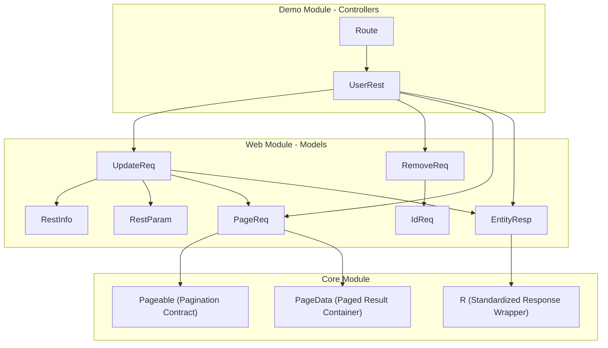
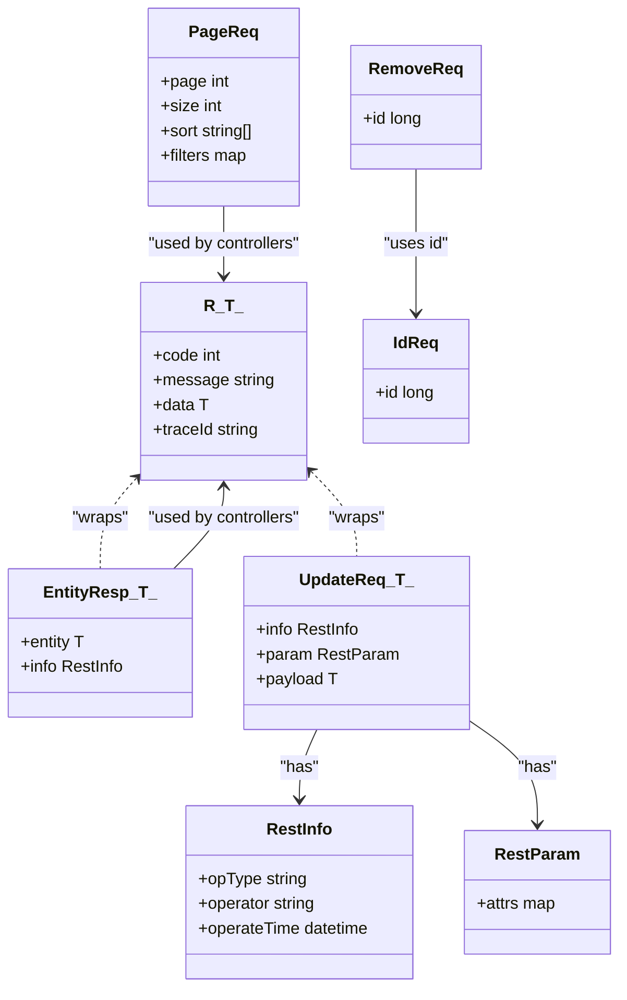
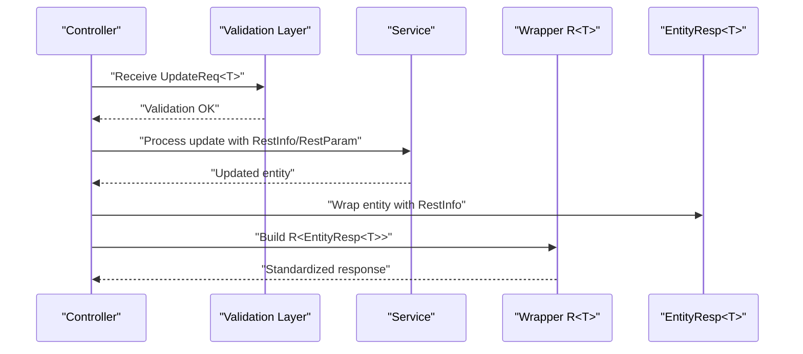
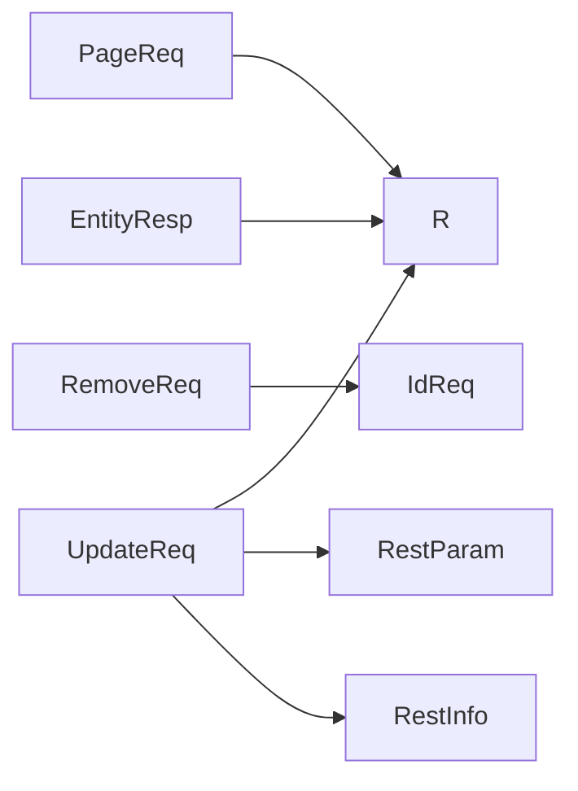

# Response Models

<cite>
**Referenced Files in This Document**
- [EntityResp.java](file://sh-web/src/main/java/com/wkclz/web/bean/EntityResp.java)
- [PageReq.java](file://sh-web/src/main/java/com/wkclz/web/bean/PageReq.java)
- [IdReq.java](file://sh-web/src/main/java/com/wkclz/web/bean/IdReq.java)
- [RemoveReq.java](file://sh-web/src/main/java/com/wkclz/web/bean/RemoveReq.java)
- [UpdateReq.java](file://sh-web/src/main/java/com/wkclz/web/bean/UpdateReq.java)
- [RestInfo.java](file://sh-web/src/main/java/com/wkclz/web/bean/RestInfo.java)
- [RestParam.java](file://sh-web/src/main/java/com/wkclz/web/bean/RestParam.java)
- [R.java](file://sh-core/src/main/java/com/wkclz/core/base/R.java)
- [UserRest.java](file://sh-demo/src/main/java/com/wkclz/demo/rest/UserRest.java)
- [UserCreateReq.java](file://sh-demo/src/main/java/com/wkclz/demo/bean/vo/user/UserCreateReq.java)
- [UserUpdateReq.java](file://sh-demo/src/main/java/com/wkclz/demo/bean/vo/user/UserUpdateReq.java)
- [UserPageReq.java](file://sh-demo/src/main/java/com/wkclz/demo/bean/vo/user/UserPageReq.java)
- [UserResp.java](file://sh-demo/src/main/java/com/wkclz/demo/bean/vo/user/UserResp.java)
- [UserPageResp.java](file://sh-demo/src/main/java/com/wkclz/demo/bean/vo/user/UserPageResp.java)
- [Route.java](file://sh-demo/src/main/java/com/wkclz/demo/rest/Route.java)
- [Pageable.java](file://sh-core/src/main/java/com/wkclz/core/base/Pageable.java)
- [PageData.java](file://sh-core/src/main/java/com/wkclz/core/base/PageData.java)
</cite>

## Table of Contents
1. [Introduction](#introduction)
2. [Project Structure](#project-structure)
3. [Core Components](#core-components)
4. [Architecture Overview](#architecture-overview)
5. [Detailed Component Analysis](#detailed-component-analysis)
6. [Dependency Analysis](#dependency-analysis)
7. [Performance Considerations](#performance-considerations)
8. [Troubleshooting Guide](#troubleshooting-guide)
9. [Conclusion](#conclusion)
10. [Appendices](#appendices)

## Introduction
This document describes the standardized response and request model classes that unify API communication patterns across the framework. It focuses on:
- EntityResp for wrapping individual entity responses
- PageReq for pagination requests
- IdReq for identifier-based operations
- RemoveReq, UpdateReq, and RestInfo for common CRUD operations
- RestParam for request parameter handling
- The overall response/request model hierarchy and its relationship to the framework’s standardized response wrapper R<T>
- Practical controller usage, serialization patterns, API contract maintenance, versioning, and backward compatibility

These models are designed to ensure consistent request/response shapes, improve maintainability, and support long-term API evolution.

## Project Structure
The response/request models live under the web module, while the framework’s standardized response wrapper R<T> resides in the core module. Example usage appears in the demo module, demonstrating how controllers integrate these models.

**Diagram sources**
- [R.java](file://sh-core/src/main/java/com/wkclz/core/base/R.java)
- [Pageable.java](file://sh-core/src/main/java/com/wkclz/core/base/Pageable.java)
- [PageData.java](file://sh-core/src/main/java/com/wkclz/core/base/PageData.java)
- [EntityResp.java](file://sh-web/src/main/java/com/wkclz/web/bean/EntityResp.java)
- [PageReq.java](file://sh-web/src/main/java/com/wkclz/web/bean/PageReq.java)
- [IdReq.java](file://sh-web/src/main/java/com/wkclz/web/bean/IdReq.java)
- [RemoveReq.java](file://sh-web/src/main/java/com/wkclz/web/bean/RemoveReq.java)
- [UpdateReq.java](file://sh-web/src/main/java/com/wkclz/web/bean/UpdateReq.java)
- [RestInfo.java](file://sh-web/src/main/java/com/wkclz/web/bean/RestInfo.java)
- [RestParam.java](file://sh-web/src/main/java/com/wkclz/web/bean/RestParam.java)
- [UserRest.java](file://sh-demo/src/main/java/com/wkclz/demo/rest/UserRest.java)
- [Route.java](file://sh-demo/src/main/java/com/wkclz/demo/rest/Route.java)

**Section sources**
- [R.java](file://sh-core/src/main/java/com/wkclz/core/base/R.java)
- [Pageable.java](file://sh-core/src/main/java/com/wkclz/core/base/Pageable.java)
- [PageData.java](file://sh-core/src/main/java/com/wkclz/core/base/PageData.java)
- [EntityResp.java](file://sh-web/src/main/java/com/wkclz/web/bean/EntityResp.java)
- [PageReq.java](file://sh-web/src/main/java/com/wkclz/web/bean/PageReq.java)
- [IdReq.java](file://sh-web/src/main/java/com/wkclz/web/bean/IdReq.java)
- [RemoveReq.java](file://sh-web/src/main/java/com/wkclz/web/bean/RemoveReq.java)
- [UpdateReq.java](file://sh-web/src/main/java/com/wkclz/web/bean/UpdateReq.java)
- [RestInfo.java](file://sh-web/src/main/java/com/wkclz/web/bean/RestInfo.java)
- [RestParam.java](file://sh-web/src/main/java/com/wkclz/web/bean/RestParam.java)
- [UserRest.java](file://sh-demo/src/main/java/com/wkclz/demo/rest/UserRest.java)
- [Route.java](file://sh-demo/src/main/java/com/wkclz/demo/rest/Route.java)

## Core Components
This section introduces the primary model classes and their roles in standardizing API communication.

- EntityResp<T>: Wraps a single entity result with metadata for consistent response shape.
- PageReq: Encapsulates pagination parameters for list queries.
- IdReq: Carries a single identifier for operations requiring an ID.
- RemoveReq: Standardizes deletion requests by ID.
- UpdateReq: General-purpose update request carrying RestInfo and optional RestParam plus a payload T.
- RestInfo: Provides common operation metadata (operation type, timestamps, operator info).
- RestParam: Holds optional request parameters for flexible API calls.

These models are intentionally lightweight and serializable, enabling consistent JSON marshalling/unmarshalling across the platform.

**Section sources**
- [EntityResp.java](file://sh-web/src/main/java/com/wkclz/web/bean/EntityResp.java)
- [PageReq.java](file://sh-web/src/main/java/com/wkclz/web/bean/PageReq.java)
- [IdReq.java](file://sh-web/src/main/java/com/wkclz/web/bean/IdReq.java)
- [RemoveReq.java](file://sh-web/src/main/java/com/wkclz/web/bean/RemoveReq.java)
- [UpdateReq.java](file://sh-web/src/main/java/com/wkclz/web/bean/UpdateReq.java)
- [RestInfo.java](file://sh-web/src/main/java/com/wkclz/web/bean/RestInfo.java)
- [RestParam.java](file://sh-web/src/main/java/com/wkclz/web/bean/RestParam.java)

## Architecture Overview
The standardized response wrapper R<T> serves as the canonical envelope for all HTTP responses. Individual models like EntityResp<T>, PageReq, and UpdateReq are composed within controllers to produce consistent payloads.

**Diagram sources**
- [R.java](file://sh-core/src/main/java/com/wkclz/core/base/R.java)
- [EntityResp.java](file://sh-web/src/main/java/com/wkclz/web/bean/EntityResp.java)
- [PageReq.java](file://sh-web/src/main/java/com/wkclz/web/bean/PageReq.java)
- [IdReq.java](file://sh-web/src/main/java/com/wkclz/web/bean/IdReq.java)
- [RemoveReq.java](file://sh-web/src/main/java/com/wkclz/web/bean/RemoveReq.java)
- [UpdateReq.java](file://sh-web/src/main/java/com/wkclz/web/bean/UpdateReq.java)
- [RestInfo.java](file://sh-web/src/main/java/com/wkclz/web/bean/RestInfo.java)
- [RestParam.java](file://sh-web/src/main/java/com/wkclz/web/bean/RestParam.java)

## Detailed Component Analysis

### EntityResp<T> — Standardized Single-Entity Response
Purpose:
- Wrap a single entity result with optional metadata via RestInfo.
- Produce a response aligned with R<T> for consistent API envelopes.

Key characteristics:
- Serializable DTO suitable for JSON.
- Supports generic entity types T.
- Includes info field for audit/tracing metadata.

Usage pattern:
- Controllers return R<EntityResp<T>> after successful retrieval or creation/update operations.

Serialization considerations:
- Prefer explicit getters/setters and avoid transient fields.
- Keep entity fields stable; introduce new fields as optional additions.

**Section sources**
- [EntityResp.java](file://sh-web/src/main/java/com/wkclz/web/bean/EntityResp.java)
- [R.java](file://sh-core/src/main/java/com/wkclz/core/base/R.java)

### PageReq — Pagination Request Model
Purpose:
- Define pagination parameters for list queries.
- Support sorting and filtering via filters map.

Key characteristics:
- page and size define paging window.
- sort array enables server-side ordering.
- filters map supports arbitrary filter key-value pairs.

Integration:
- Often combined with Pageable and PageData for backend pagination support.

**Section sources**
- [PageReq.java](file://sh-web/src/main/java/com/wkclz/web/bean/PageReq.java)
- [Pageable.java](file://sh-core/src/main/java/com/wkclz/core/base/Pageable.java)
- [PageData.java](file://sh-core/src/main/java/com/wkclz/core/base/PageData.java)

### IdReq — Identifier-Based Requests
Purpose:
- Carry a single identifier for operations that require an ID (e.g., GET, DELETE, UPDATE).

Key characteristics:
- Minimal footprint; focused on id field.
- Used as a base for RemoveReq and other ID-dependent operations.

**Section sources**
- [IdReq.java](file://sh-web/src/main/java/com/wkclz/web/bean/IdReq.java)
- [RemoveReq.java](file://sh-web/src/main/java/com/wkclz/web/bean/RemoveReq.java)

### RemoveReq — Deletion Requests
Purpose:
- Standardize removal operations by ID.

Relationship:
- Typically built from IdReq; ensures consistent deletion payloads.

**Section sources**
- [RemoveReq.java](file://sh-web/src/main/java/com/wkclz/web/bean/RemoveReq.java)
- [IdReq.java](file://sh-web/src/main/java/com/wkclz/web/bean/IdReq.java)

### UpdateReq<T> — Generic Update Requests
Purpose:
- Provide a unified update envelope with metadata and optional parameters.

Structure:
- info: RestInfo for operation metadata.
- param: RestParam for optional attributes.
- payload: T representing the entity update body.

Usage pattern:
- Controllers validate UpdateReq, extract payload, apply RestInfo/RestParam, and process updates.

**Section sources**
- [UpdateReq.java](file://sh-web/src/main/java/com/wkclz/web/bean/UpdateReq.java)
- [RestInfo.java](file://sh-web/src/main/java/com/wkclz/web/bean/RestInfo.java)
- [RestParam.java](file://sh-web/src/main/java/com/wkclz/web/bean/RestParam.java)

### RestInfo — Operation Metadata
Purpose:
- Capture operation context such as operator, operation type, and timestamps.

Usage:
- Included in EntityResp and UpdateReq to enrich auditability and tracing.

**Section sources**
- [RestInfo.java](file://sh-web/src/main/java/com/wkclz/web/bean/RestInfo.java)

### RestParam — Optional Request Parameters
Purpose:
- Allow flexible, optional attributes to accompany requests.

Usage:
- Included in UpdateReq to pass hints or flags without altering payload structure.

**Section sources**
- [RestParam.java](file://sh-web/src/main/java/com/wkclz/web/bean/RestParam.java)

### Relationship to R<T> — Standardized Response Wrapper
R<T> is the canonical response envelope used across the framework. It standardizes:
- Response code and message
- Data payload (T)
- Trace identifiers for observability

Models compose into R<T>:
- EntityResp<T> → R<T>.data
- PageReq is consumed by controllers to build paged responses
- UpdateReq<T> → R<T>.data for update operations

**Diagram sources**
- [UpdateReq.java](file://sh-web/src/main/java/com/wkclz/web/bean/UpdateReq.java)
- [EntityResp.java](file://sh-web/src/main/java/com/wkclz/web/bean/EntityResp.java)
- [R.java](file://sh-core/src/main/java/com/wkclz/core/base/R.java)

**Section sources**
- [R.java](file://sh-core/src/main/java/com/wkclz/core/base/R.java)
- [EntityResp.java](file://sh-web/src/main/java/com/wkclz/web/bean/EntityResp.java)
- [UpdateReq.java](file://sh-web/src/main/java/com/wkclz/web/bean/UpdateReq.java)

### Practical Examples in Controllers
The demo module demonstrates typical usage patterns:
- UserRest integrates PageReq for listing, UpdateReq for updates, and EntityResp for wrapping single-entity results.
- Route defines REST endpoints that align with these models.

Representative usage references:
- Controller method signatures and parameter types using PageReq, UpdateReq, and EntityResp
- Endpoint routing and parameter binding

**Section sources**
- [UserRest.java](file://sh-demo/src/main/java/com/wkclz/demo/rest/UserRest.java)
- [Route.java](file://sh-demo/src/main/java/com/wkclz/demo/rest/Route.java)
- [UserCreateReq.java](file://sh-demo/src/main/java/com/wkclz/demo/bean/vo/user/UserCreateReq.java)
- [UserUpdateReq.java](file://sh-demo/src/main/java/com/wkclz/demo/bean/vo/user/UserUpdateReq.java)
- [UserPageReq.java](file://sh-demo/src/main/java/com/wkclz/demo/bean/vo/user/UserPageReq.java)
- [UserResp.java](file://sh-demo/src/main/java/com/wkclz/demo/bean/vo/user/UserResp.java)
- [UserPageResp.java](file://sh-demo/src/main/java/com/wkclz/demo/bean/vo/user/UserPageResp.java)

### Serialization Patterns
Recommendations:
- Use consistent naming and casing for JSON fields.
- Keep entity fields stable; introduce new fields as optional additions.
- Avoid exposing internal state; prefer DTOs like EntityResp<T>.
- Validate serialization/deserialization in tests to prevent regressions.

[No sources needed since this section provides general guidance]

### API Contract Maintenance
Guidelines:
- Version endpoints explicitly (e.g., /api/v1/resource) to preserve backward compatibility.
- Mark deprecated fields with deprecation notices and continue supporting deserialization.
- Add new fields as optional and nullable to avoid breaking existing clients.
- Maintain separate model sets per API version when necessary.

[No sources needed since this section provides general guidance]

### Versioning and Backward Compatibility
- Use semantic versioning for APIs and evolve models incrementally.
- For request/response models, prefer additive changes and avoid removing fields.
- Introduce new models for major changes and keep old ones supported during transition periods.

[No sources needed since this section provides general guidance]

## Dependency Analysis
The following diagram shows how models depend on each other and on the standardized response wrapper.

**Diagram sources**
- [R.java](file://sh-core/src/main/java/com/wkclz/core/base/R.java)
- [EntityResp.java](file://sh-web/src/main/java/com/wkclz/web/bean/EntityResp.java)
- [PageReq.java](file://sh-web/src/main/java/com/wkclz/web/bean/PageReq.java)
- [IdReq.java](file://sh-web/src/main/java/com/wkclz/web/bean/IdReq.java)
- [RemoveReq.java](file://sh-web/src/main/java/com/wkclz/web/bean/RemoveReq.java)
- [UpdateReq.java](file://sh-web/src/main/java/com/wkclz/web/bean/UpdateReq.java)
- [RestInfo.java](file://sh-web/src/main/java/com/wkclz/web/bean/RestInfo.java)
- [RestParam.java](file://sh-web/src/main/java/com/wkclz/web/bean/RestParam.java)

**Section sources**
- [R.java](file://sh-core/src/main/java/com/wkclz/core/base/R.java)
- [EntityResp.java](file://sh-web/src/main/java/com/wkclz/web/bean/EntityResp.java)
- [PageReq.java](file://sh-web/src/main/java/com/wkclz/web/bean/PageReq.java)
- [IdReq.java](file://sh-web/src/main/java/com/wkclz/web/bean/IdReq.java)
- [RemoveReq.java](file://sh-web/src/main/java/com/wkclz/web/bean/RemoveReq.java)
- [UpdateReq.java](file://sh-web/src/main/java/com/wkclz/web/bean/UpdateReq.java)
- [RestInfo.java](file://sh-web/src/main/java/com/wkclz/web/bean/RestInfo.java)
- [RestParam.java](file://sh-web/src/main/java/com/wkclz/web/bean/RestParam.java)

## Performance Considerations
- Keep models small and focused to minimize serialization overhead.
- Avoid deep nesting in filters and params to simplify parsing.
- Reuse shared metadata (RestInfo) to reduce duplication across requests.

[No sources needed since this section provides general guidance]

## Troubleshooting Guide
Common issues and resolutions:
- Validation failures: Ensure PageReq and UpdateReq conform to expected shapes; verify presence of required fields.
- Serialization errors: Confirm JSON naming conventions match DTO fields; check for missing getters/setters.
- Pagination mismatches: Verify page/size/sort alignment with backend expectations.
- Audit gaps: Confirm RestInfo is populated consistently for UpdateReq operations.

**Section sources**
- [PageReq.java](file://sh-web/src/main/java/com/wkclz/web/bean/PageReq.java)
- [UpdateReq.java](file://sh-web/src/main/java/com/wkclz/web/bean/UpdateReq.java)
- [RestInfo.java](file://sh-web/src/main/java/com/wkclz/web/bean/RestInfo.java)

## Conclusion
The response/request model suite provides a cohesive foundation for API communication across the framework. By composing EntityResp<T>, PageReq, IdReq, RemoveReq, UpdateReq<T>, RestInfo, and RestParam within the standardized R<T> wrapper, teams can achieve consistent, maintainable, and evolvable APIs. Adopt versioning and backward-compatibility practices to ensure long-term stability as systems evolve.

[No sources needed since this section summarizes without analyzing specific files]

## Appendices
- Example controller references for integrating these models
- Additional guidance on testing serialized payloads and maintaining API contracts

**Section sources**
- [UserRest.java](file://sh-demo/src/main/java/com/wkclz/demo/rest/UserRest.java)
- [Route.java](file://sh-demo/src/main/java/com/wkclz/demo/rest/Route.java)