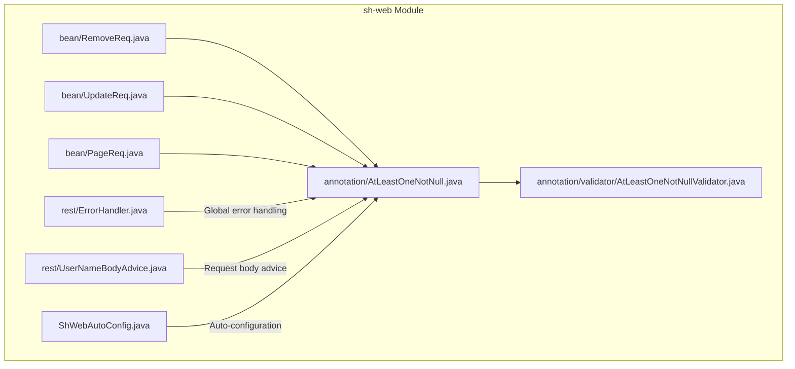
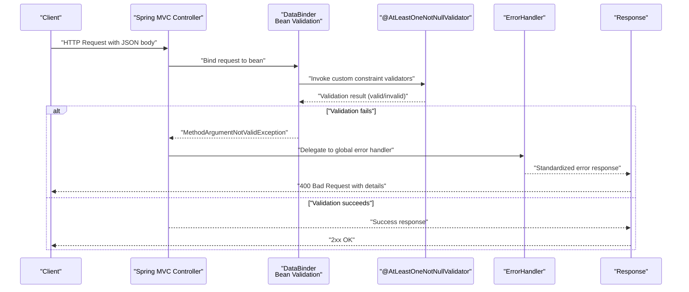
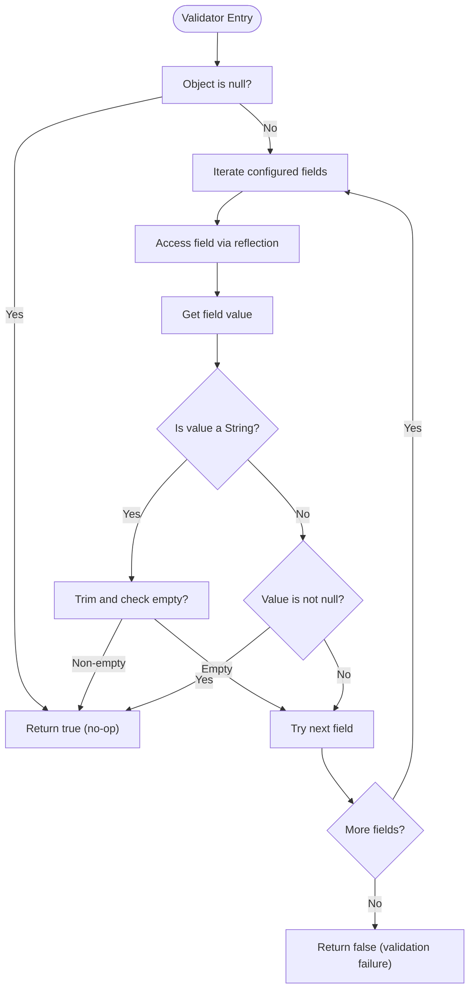
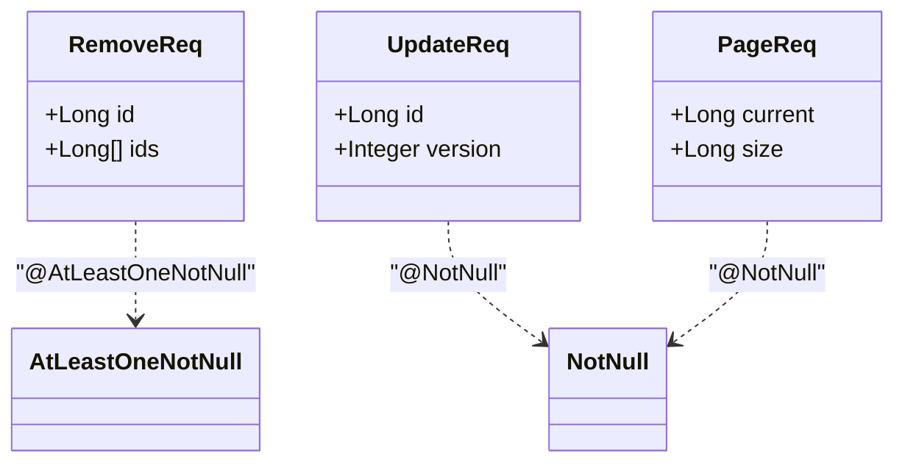
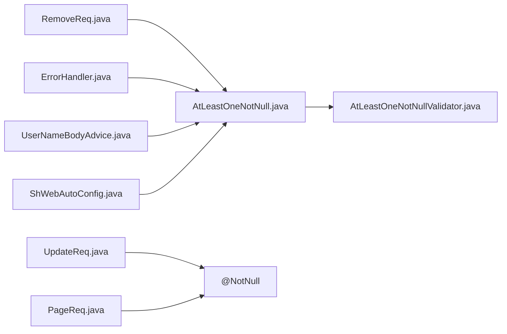

# Validation Support

<cite>
**Referenced Files in This Document**
- [AtLeastOneNotNull.java](file://sh-web/src/main/java/com/wkclz/web/annotation/AtLeastOneNotNull.java)
- [AtLeastOneNotNullValidator.java](file://sh-web/src/main/java/com/wkclz/web/annotation/validator/AtLeastOneNotNullValidator.java)
- [RemoveReq.java](file://sh-web/src/main/java/com/wkclz/web/bean/RemoveReq.java)
- [UpdateReq.java](file://sh-web/src/main/java/com/wkclz/web/bean/UpdateReq.java)
- [PageReq.java](file://sh-web/src/main/java/com/wkclz/web/bean/PageReq.java)
- [ErrorHandler.java](file://sh-web/src/main/java/com/wkclz/web/rest/ErrorHandler.java)
- [UserNameBodyAdvice.java](file://sh-web/src/main/java/com/wkclz/web/rest/UserNameBodyAdvice.java)
- [ShWebAutoConfig.java](file://sh-web/src/main/java/com/wkclz/web/ShWebAutoConfig.java)
- [US-015-自定义参数校验与标准请求Bean.md](file://docs/stories/US-015-自定义参数校验与标准请求Bean.md)
- [SKILL.md](file://.agents/skills/sh-web/SKILL.md)
</cite>

## Table of Contents
1. [Introduction](#introduction)
2. [Project Structure](#project-structure)
3. [Core Components](#core-components)
4. [Architecture Overview](#architecture-overview)
5. [Detailed Component Analysis](#detailed-component-analysis)
6. [Dependency Analysis](#dependency-analysis)
7. [Performance Considerations](#performance-considerations)
8. [Troubleshooting Guide](#troubleshooting-guide)
9. [Conclusion](#conclusion)

## Introduction
This document describes the validation support system in the web layer, focusing on custom validation annotations and their integration with Spring's Bean Validation framework. It explains how to implement conditional validation scenarios using a custom annotation (@AtLeastOneNotNull), how to compose Bean Validation annotations with custom validators, and how validation errors are handled globally. Practical examples demonstrate validating different request types, handling validation failures, and generating meaningful error responses. Guidance is also provided on performance optimization and best practices for designing validation rules.

## Project Structure
The validation system resides primarily in the web module under the annotation and bean packages. The key elements are:
- Custom constraint annotation definition
- Custom constraint validator implementation
- Standard request beans that apply Bean Validation and custom constraints
- Global error handling and advice for validation failures
- Auto-configuration enabling validation support

**Diagram sources**
- [AtLeastOneNotNull.java:1-27](file://sh-web/src/main/java/com/wkclz/web/annotation/AtLeastOneNotNull.java#L1-L27)
- [AtLeastOneNotNullValidator.java:1-37](file://sh-web/src/main/java/com/wkclz/web/annotation/validator/AtLeastOneNotNullValidator.java#L1-L37)
- [RemoveReq.java:1-40](file://sh-web/src/main/java/com/wkclz/web/bean/RemoveReq.java#L1-L40)
- [UpdateReq.java:1-40](file://sh-web/src/main/java/com/wkclz/web/bean/UpdateReq.java#L1-L40)
- [PageReq.java:1-40](file://sh-web/src/main/java/com/wkclz/web/bean/PageReq.java#L1-L40)
- [ErrorHandler.java:1-200](file://sh-web/src/main/java/com/wkclz/web/rest/ErrorHandler.java#L1-L200)
- [UserNameBodyAdvice.java:1-200](file://sh-web/src/main/java/com/wkclz/web/rest/UserNameBodyAdvice.java#L1-L200)
- [ShWebAutoConfig.java:1-200](file://sh-web/src/main/java/com/wkclz/web/ShWebAutoConfig.java#L1-L200)

**Section sources**
- [AtLeastOneNotNull.java:1-27](file://sh-web/src/main/java/com/wkclz/web/annotation/AtLeastOneNotNull.java#L1-L27)
- [AtLeastOneNotNullValidator.java:1-37](file://sh-web/src/main/java/com/wkclz/web/annotation/validator/AtLeastOneNotNullValidator.java#L1-L37)
- [RemoveReq.java:1-40](file://sh-web/src/main/java/com/wkclz/web/bean/RemoveReq.java#L1-L40)
- [UpdateReq.java:1-40](file://sh-web/src/main/java/com/wkclz/web/bean/UpdateReq.java#L1-L40)
- [PageReq.java:1-40](file://sh-web/src/main/java/com/wkclz/web/bean/PageReq.java#L1-L40)
- [ErrorHandler.java:1-200](file://sh-web/src/main/java/com/wkclz/web/rest/ErrorHandler.java#L1-L200)
- [UserNameBodyAdvice.java:1-200](file://sh-web/src/main/java/com/wkclz/web/rest/UserNameBodyAdvice.java#L1-L200)
- [ShWebAutoConfig.java:1-200](file://sh-web/src/main/java/com/wkclz/web/ShWebAutoConfig.java#L1-L200)

## Core Components
- Custom constraint annotation @AtLeastOneNotNull: Defines a class-level constraint ensuring that at least one of the specified fields is present and non-empty. It supports configurable message, groups, and payload, and accepts an array of field names to validate.
- Custom validator AtLeastOneNotNullValidator: Implements the validation logic via reflection, checking each specified field for nullity and trimming whitespace for String values. Returns true if at least one field passes the check.
- Standard request beans:
  - RemoveReq: Demonstrates @AtLeastOneNotNull usage for mutually exclusive identifiers (single ID vs. list of IDs).
  - UpdateReq: Uses @NotNull for mandatory fields (ID and version).
  - PageReq: Provides pagination fields with optional defaults.
- Global error handling: ErrorHandler translates validation failures into standardized error responses.
- Body advice: UserNameBodyAdvice enriches request bodies with contextual information during binding/validation.

**Section sources**
- [AtLeastOneNotNull.java:12-27](file://sh-web/src/main/java/com/wkclz/web/annotation/AtLeastOneNotNull.java#L12-L27)
- [AtLeastOneNotNullValidator.java:11-37](file://sh-web/src/main/java/com/wkclz/web/annotation/validator/AtLeastOneNotNullValidator.java#L11-L37)
- [RemoveReq.java:12-27](file://sh-web/src/main/java/com/wkclz/web/bean/RemoveReq.java#L12-L27)
- [UpdateReq.java:160-176](file://sh-web/src/main/java/com/wkclz/web/bean/UpdateReq.java#L160-L176)
- [PageReq.java:146-149](file://sh-web/src/main/java/com/wkclz/web/bean/PageReq.java#L146-L149)
- [ErrorHandler.java:1-200](file://sh-web/src/main/java/com/wkclz/web/rest/ErrorHandler.java#L1-L200)
- [UserNameBodyAdvice.java:1-200](file://sh-web/src/main/java/com/wkclz/web/rest/UserNameBodyAdvice.java#L1-L200)

## Architecture Overview
The validation workflow integrates annotation-driven Bean Validation with custom validators and Spring MVC's binding/validation lifecycle. Errors are captured and transformed into unified error responses.

**Diagram sources**
- [AtLeastOneNotNull.java:12-27](file://sh-web/src/main/java/com/wkclz/web/annotation/AtLeastOneNotNull.java#L12-L27)
- [AtLeastOneNotNullValidator.java:16-37](file://sh-web/src/main/java/com/wkclz/web/annotation/validator/AtLeastOneNotNullValidator.java#L16-L37)
- [ErrorHandler.java:1-200](file://sh-web/src/main/java/com/wkclz/web/rest/ErrorHandler.java#L1-L200)

## Detailed Component Analysis

### Custom Annotation: @AtLeastOneNotNull
- Purpose: Enforce that at least one of the specified fields in a class is present and non-empty.
- Scope: Class-level constraint.
- Attributes:
  - message: Default error message.
  - groups: Validation groups.
  - payload: Additional metadata.
  - fields: Array of field names to validate.
- Typical usage: Ensures either a single identifier or a collection of identifiers is provided, preventing ambiguous or empty operations.

**Section sources**
- [AtLeastOneNotNull.java:12-27](file://sh-web/src/main/java/com/wkclz/web/annotation/AtLeastOneNotNull.java#L12-L27)

### Custom Validator: AtLeastOneNotNullValidator
- Implementation pattern: Uses reflection to access declared fields and checks for null and trimmed empty string conditions for String fields.
- Behavior:
  - Skips validation for null target objects.
  - Iterates through configured field names.
  - Treats empty String after trim as invalid.
  - Returns true if at least one field satisfies the condition.
- Complexity: O(n) per validated object, where n is the number of configured fields.

**Diagram sources**
- [AtLeastOneNotNullValidator.java:21-37](file://sh-web/src/main/java/com/wkclz/web/annotation/validator/AtLeastOneNotNullValidator.java#L21-L37)

**Section sources**
- [AtLeastOneNotNullValidator.java:11-37](file://sh-web/src/main/java/com/wkclz/web/annotation/validator/AtLeastOneNotNullValidator.java#L11-L37)

### Standard Request Beans and Validation Composition
- RemoveReq: Applies @AtLeastOneNotNull to ensure either a single ID or a list of IDs is provided. Supports @NotNull on individual fields for mandatory presence.
- UpdateReq: Uses @NotNull for ID and version to enforce optimistic locking and identity.
- PageReq: Defines pagination fields suitable for list queries.

**Diagram sources**
- [RemoveReq.java:12-27](file://sh-web/src/main/java/com/wkclz/web/bean/RemoveReq.java#L12-L27)
- [UpdateReq.java:160-176](file://sh-web/src/main/java/com/wkclz/web/bean/UpdateReq.java#L160-L176)
- [PageReq.java:146-149](file://sh-web/src/main/java/com/wkclz/web/bean/PageReq.java#L146-L149)
- [AtLeastOneNotNull.java:12-27](file://sh-web/src/main/java/com/wkclz/web/annotation/AtLeastOneNotNull.java#L12-L27)

**Section sources**
- [RemoveReq.java:12-27](file://sh-web/src/main/java/com/wkclz/web/bean/RemoveReq.java#L12-L27)
- [UpdateReq.java:160-176](file://sh-web/src/main/java/com/wkclz/web/bean/UpdateReq.java#L160-L176)
- [PageReq.java:146-149](file://sh-web/src/main/java/com/wkclz/web/bean/PageReq.java#L146-L149)

### Global Error Handling for Validation Failures
- ErrorHandler transforms method argument validation exceptions into a standardized error response format, ensuring consistent error reporting across the application.
- Integration: Works with Spring MVC's exception resolution mechanism to intercept validation failures during request binding.

**Section sources**
- [ErrorHandler.java:1-200](file://sh-web/src/main/java/com/wkclz/web/rest/ErrorHandler.java#L1-L200)

### Request Body Advice for Validation Context
- UserNameBodyAdvice enriches request bodies with contextual information during the binding phase, supporting downstream validation and processing logic.

**Section sources**
- [UserNameBodyAdvice.java:1-200](file://sh-web/src/main/java/com/wkclz/web/rest/UserNameBodyAdvice.java#L1-L200)

### Auto-Configuration for Validation Support
- ShWebAutoConfig enables the validation subsystem and registers necessary components for annotation processing and error handling.

**Section sources**
- [ShWebAutoConfig.java:1-200](file://sh-web/src/main/java/com/wkclz/web/ShWebAutoConfig.java#L1-L200)

## Dependency Analysis
The validation system exhibits low coupling and clear separation of concerns:
- Annotation and validator are tightly coupled by design to implement the custom constraint.
- Request beans depend on standard Bean Validation annotations and the custom constraint.
- ErrorHandler and UserNameBodyAdvice depend on Spring MVC infrastructure and are decoupled from specific beans.
- Auto-configuration wires the subsystem together.

**Diagram sources**
- [AtLeastOneNotNull.java:12-27](file://sh-web/src/main/java/com/wkclz/web/annotation/AtLeastOneNotNull.java#L12-L27)
- [AtLeastOneNotNullValidator.java:11-37](file://sh-web/src/main/java/com/wkclz/web/annotation/validator/AtLeastOneNotNullValidator.java#L11-L37)
- [RemoveReq.java:12-27](file://sh-web/src/main/java/com/wkclz/web/bean/RemoveReq.java#L12-L27)
- [UpdateReq.java:160-176](file://sh-web/src/main/java/com/wkclz/web/bean/UpdateReq.java#L160-L176)
- [PageReq.java:146-149](file://sh-web/src/main/java/com/wkclz/web/bean/PageReq.java#L146-L149)
- [ErrorHandler.java:1-200](file://sh-web/src/main/java/com/wkclz/web/rest/ErrorHandler.java#L1-L200)
- [UserNameBodyAdvice.java:1-200](file://sh-web/src/main/java/com/wkclz/web/rest/UserNameBodyAdvice.java#L1-L200)
- [ShWebAutoConfig.java:1-200](file://sh-web/src/main/java/com/wkclz/web/ShWebAutoConfig.java#L1-L200)

**Section sources**
- [AtLeastOneNotNull.java:12-27](file://sh-web/src/main/java/com/wkclz/web/annotation/AtLeastOneNotNull.java#L12-L27)
- [AtLeastOneNotNullValidator.java:11-37](file://sh-web/src/main/java/com/wkclz/web/annotation/validator/AtLeastOneNotNullValidator.java#L11-L37)
- [RemoveReq.java:12-27](file://sh-web/src/main/java/com/wkclz/web/bean/RemoveReq.java#L12-L27)
- [UpdateReq.java:160-176](file://sh-web/src/main/java/com/wkclz/web/bean/UpdateReq.java#L160-L176)
- [PageReq.java:146-149](file://sh-web/src/main/java/com/wkclz/web/bean/PageReq.java#L146-L149)
- [ErrorHandler.java:1-200](file://sh-web/src/main/java/com/wkclz/web/rest/ErrorHandler.java#L1-L200)
- [UserNameBodyAdvice.java:1-200](file://sh-web/src/main/java/com/wkclz/web/rest/UserNameBodyAdvice.java#L1-L200)
- [ShWebAutoConfig.java:1-200](file://sh-web/src/main/java/com/wkclz/web/ShWebAutoConfig.java#L1-L200)

## Performance Considerations
- Reflection cost: The validator uses reflection to access fields. Keep the number of configured fields reasonable to minimize overhead.
- Early exit: The validator short-circuits upon finding the first valid field, reducing unnecessary checks.
- String trimming: Trimming strings adds minimal overhead but improves accuracy for empty-string detection.
- Grouping and payload: Use groups to partition validations when appropriate, allowing selective validation in different contexts.
- Caching: For frequently reused constraints, consider caching field metadata if extending the validator to avoid repeated reflection lookups.
- Batch operations: When validating lists of beans, prefer streaming APIs and parallel processing cautiously, ensuring thread safety and avoiding excessive contention.

## Troubleshooting Guide
Common issues and resolutions:
- No validation triggered:
  - Ensure the bean is annotated at class level with @AtLeastOneNotNull and the fields array includes existing field names.
  - Confirm the controller method uses @Valid or @Validated on the binding target.
- Unexpected success:
  - Verify that String fields are not only whitespace when trimmed; the validator treats trimmed-empty strings as invalid.
  - Check that null objects are not inadvertently passed to the validator.
- Error response format:
  - ErrorHandler converts validation exceptions into a standardized structure. Confirm the global exception handler is registered and active.
- Mixed validation:
  - Combine @NotNull and @AtLeastOneNotNull to enforce mandatory fields and conditional presence. Ensure the order of annotations does not conflict.

**Section sources**
- [AtLeastOneNotNull.java:12-27](file://sh-web/src/main/java/com/wkclz/web/annotation/AtLeastOneNotNull.java#L12-L27)
- [AtLeastOneNotNullValidator.java:21-37](file://sh-web/src/main/java/com/wkclz/web/annotation/validator/AtLeastOneNotNullValidator.java#L21-L37)
- [ErrorHandler.java:1-200](file://sh-web/src/main/java/com/wkclz/web/rest/ErrorHandler.java#L1-L200)

## Conclusion
The validation support system leverages Bean Validation standards alongside a custom constraint to handle conditional validation scenarios effectively. By composing standard annotations with custom validators and integrating with global error handling, the system ensures predictable, consistent, and meaningful error responses. Following the best practices outlined here will help maintain performance and clarity as validation rules evolve.