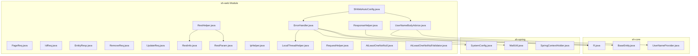
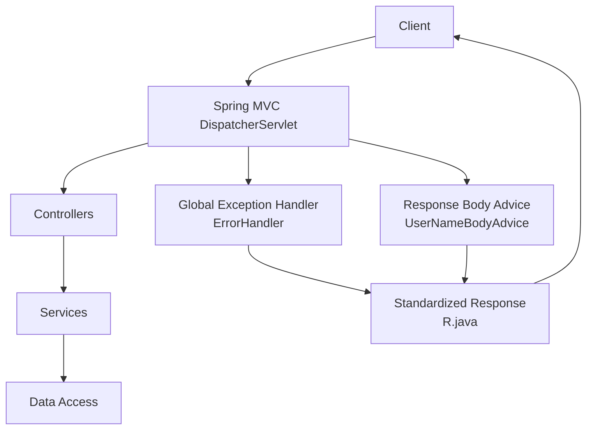
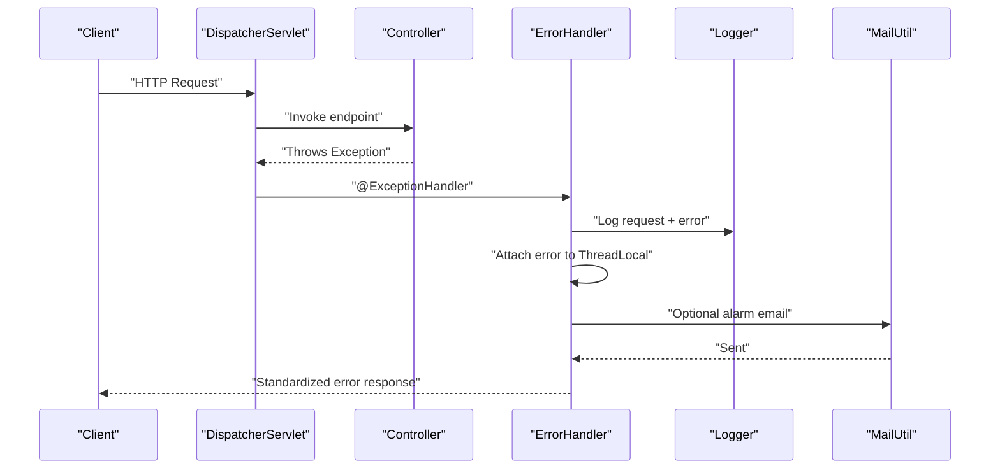
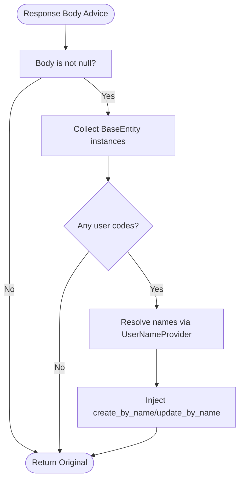
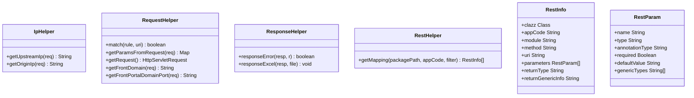
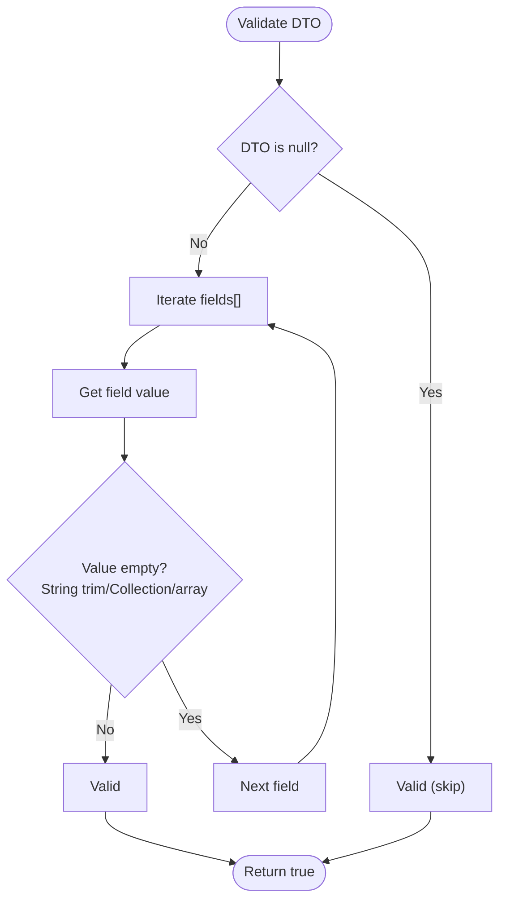
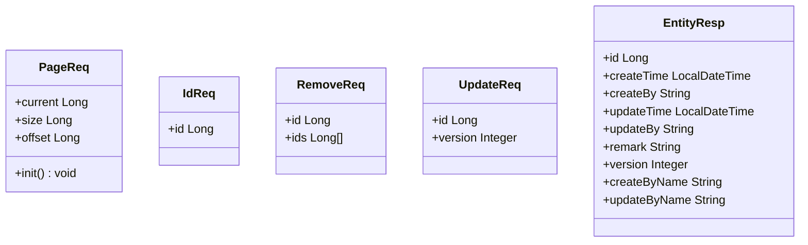
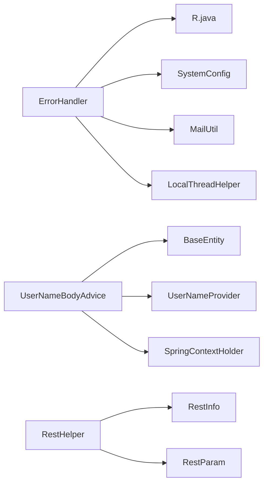

# Web Layer

<cite>
**Referenced Files in This Document**
- [ShWebAutoConfig.java](file://sh-web/src/main/java/com/wkclz/web/ShWebAutoConfig.java)
- [ErrorHandler.java](file://sh-web/src/main/java/com/wkclz/web/rest/ErrorHandler.java)
- [UserNameBodyAdvice.java](file://sh-web/src/main/java/com/wkclz/web/rest/UserNameBodyAdvice.java)
- [PageReq.java](file://sh-web/src/main/java/com/wkclz/web/bean/PageReq.java)
- [IdReq.java](file://sh-web/src/main/java/com/wkclz/web/bean/IdReq.java)
- [EntityResp.java](file://sh-web/src/main/java/com/wkclz/web/bean/EntityResp.java)
- [RemoveReq.java](file://sh-web/src/main/java/com/wkclz/web/bean/RemoveReq.java)
- [UpdateReq.java](file://sh-web/src/main/java/com/wkclz/web/bean/UpdateReq.java)
- [RestInfo.java](file://sh-web/src/main/java/com/wkclz/web/bean/RestInfo.java)
- [RestParam.java](file://sh-web/src/main/java/com/wkclz/web/bean/RestParam.java)
- [IpHelper.java](file://sh-web/src/main/java/com/wkclz/web/helper/IpHelper.java)
- [LocalThreadHelper.java](file://sh-web/src/main/java/com/wkclz/web/helper/LocalThreadHelper.java)
- [RequestHelper.java](file://sh-web/src/main/java/com/wkclz/web/helper/RequestHelper.java)
- [ResponseHelper.java](file://sh-web/src/main/java/com/wkclz/web/helper/ResponseHelper.java)
- [RestHelper.java](file://sh-web/src/main/java/com/wkclz/web/helper/RestHelper.java)
- [AtLeastOneNotNull.java](file://sh-web/src/main/java/com/wkclz/web/annotation/AtLeastOneNotNull.java)
- [AtLeastOneNotNullValidator.java](file://sh-web/src/main/java/com/wkclz/web/annotation/validator/AtLeastOneNotNullValidator.java)
- [R.java](file://sh-core/src/main/java/com/wkclz/core/base/R.java)
- [SystemConfig.java](file://sh-spring/src/main/java/com/wkclz/spring/config/SystemConfig.java)
- [MailUtil.java](file://sh-spring/src/main/java/com/wkclz/spring/utils/MailUtil.java)
- [SpringContextHolder.java](file://sh-spring/src/main/java/com/wkclz/spring/config/SpringContextHolder.java)
- [BaseEntity.java](file://sh-core/src/main/java/com/wkclz/core/base/BaseEntity.java)
- [UserNameProvider.java](file://sh-core/src/main/java/com/wkclz/core/spi/UserNameProvider.java)
- [UserRest.java](file://sh-demo/src/main/java/com/wkclz/demo/rest/UserRest.java)
- [Route.java](file://sh-demo/src/main/java/com/wkclz/demo/rest/Route.java)
</cite>

## Table of Contents
1. [Introduction](#introduction)
2. [Project Structure](#project-structure)
3. [Core Components](#core-components)
4. [Architecture Overview](#architecture-overview)
5. [Detailed Component Analysis](#detailed-component-analysis)
6. [Dependency Analysis](#dependency-analysis)
7. [Performance Considerations](#performance-considerations)
8. [Troubleshooting Guide](#troubleshooting-guide)
9. [Security Considerations](#security-considerations)
10. [Practical Examples](#practical-examples)
11. [Conclusion](#conclusion)

## Introduction
This document explains the web layer components responsible for handling HTTP requests and responses in the framework. It covers the REST controller infrastructure, global exception handling, request/response helpers, validation support, auto-configuration, and integration with Spring MVC. It also documents helper classes for IP resolution, request/response manipulation, thread-local context management, and value-object (VO) classes for request/response mapping such as PageReq, IdReq, and EntityResp. Practical examples demonstrate building REST endpoints, handling different HTTP methods, and implementing proper error responses. Security considerations and CORS configuration guidance are included.

## Project Structure
The web layer resides under the sh-web module and integrates with core framework modules for shared types, exceptions, and Spring utilities. The structure emphasizes:
- Auto-configuration enabling component scanning for the web package
- Global exception handling via a Spring @RestControllerAdvice
- Response body enrichment for user names through a ResponseBodyAdvice
- Helper utilities for IP resolution, request/response manipulation, and thread-local context
- VO classes for standardized request/response contracts
- Validation annotations and validators for request DTOs

**Diagram sources**
- [ShWebAutoConfig.java:1-12](file://sh-web/src/main/java/com/wkclz/web/ShWebAutoConfig.java#L1-L12)
- [ErrorHandler.java:1-267](file://sh-web/src/main/java/com/wkclz/web/rest/ErrorHandler.java#L1-L267)
- [UserNameBodyAdvice.java:1-198](file://sh-web/src/main/java/com/wkclz/web/rest/UserNameBodyAdvice.java#L1-L198)
- [PageReq.java:1-45](file://sh-web/src/main/java/com/wkclz/web/bean/PageReq.java#L1-L45)
- [IdReq.java:1-19](file://sh-web/src/main/java/com/wkclz/web/bean/IdReq.java#L1-L19)
- [EntityResp.java:1-42](file://sh-web/src/main/java/com/wkclz/web/bean/EntityResp.java#L1-L42)
- [RemoveReq.java:1-26](file://sh-web/src/main/java/com/wkclz/web/bean/RemoveReq.java#L1-L26)
- [UpdateReq.java:1-22](file://sh-web/src/main/java/com/wkclz/web/bean/UpdateReq.java#L1-L22)
- [RestInfo.java:1-37](file://sh-web/src/main/java/com/wkclz/web/bean/RestInfo.java#L1-L37)
- [RestParam.java:1-50](file://sh-web/src/main/java/com/wkclz/web/bean/RestParam.java#L1-L50)
- [IpHelper.java:1-51](file://sh-web/src/main/java/com/wkclz/web/helper/IpHelper.java#L1-L51)
- [LocalThreadHelper.java:1-95](file://sh-web/src/main/java/com/wkclz/web/helper/LocalThreadHelper.java#L1-L95)
- [RequestHelper.java:1-173](file://sh-web/src/main/java/com/wkclz/web/helper/RequestHelper.java#L1-L173)
- [ResponseHelper.java:1-71](file://sh-web/src/main/java/com/wkclz/web/helper/ResponseHelper.java#L1-L71)
- [RestHelper.java:1-554](file://sh-web/src/main/java/com/wkclz/web/helper/RestHelper.java#L1-L554)
- [AtLeastOneNotNull.java:1-27](file://sh-web/src/main/java/com/wkclz/web/annotation/AtLeastOneNotNull.java#L1-L27)
- [AtLeastOneNotNullValidator.java:1-57](file://sh-web/src/main/java/com/wkclz/web/annotation/validator/AtLeastOneNotNullValidator.java#L1-L57)
- [R.java](file://sh-core/src/main/java/com/wkclz/core/base/R.java)
- [SystemConfig.java](file://sh-spring/src/main/java/com/wkclz/spring/config/SystemConfig.java)
- [MailUtil.java](file://sh-spring/src/main/java/com/wkclz/spring/utils/MailUtil.java)
- [SpringContextHolder.java](file://sh-spring/src/main/java/com/wkclz/spring/config/SpringContextHolder.java)
- [BaseEntity.java](file://sh-core/src/main/java/com/wkclz/core/base/BaseEntity.java)
- [UserNameProvider.java](file://sh-core/src/main/java/com/wkclz/core/spi/UserNameProvider.java)

**Section sources**
- [ShWebAutoConfig.java:1-12](file://sh-web/src/main/java/com/wkclz/web/ShWebAutoConfig.java#L1-L12)

## Core Components
- Auto-configuration: Enables component scanning for the web package so controllers, advice, and helpers are picked up automatically.
- Global exception handling: Centralized error handling via @RestControllerAdvice that maps exceptions to standardized responses and logs with optional alarm emails.
- Response body enrichment: A ResponseBodyAdvice that enriches BaseResponse-wrapped payloads with user names by resolving user codes.
- Request/response helpers: Utilities for IP resolution, request metadata extraction, response streaming, and Excel export.
- Validation support: Custom validation annotations and validators for DTOs.
- VO classes: Standardized request/response DTOs for pagination, ID-based operations, removal, updates, and entity responses.

**Section sources**
- [ErrorHandler.java:1-267](file://sh-web/src/main/java/com/wkclz/web/rest/ErrorHandler.java#L1-L267)
- [UserNameBodyAdvice.java:1-198](file://sh-web/src/main/java/com/wkclz/web/rest/UserNameBodyAdvice.java#L1-L198)
- [IpHelper.java:1-51](file://sh-web/src/main/java/com/wkclz/web/helper/IpHelper.java#L1-L51)
- [RequestHelper.java:1-173](file://sh-web/src/main/java/com/wkclz/web/helper/RequestHelper.java#L1-L173)
- [ResponseHelper.java:1-71](file://sh-web/src/main/java/com/wkclz/web/helper/ResponseHelper.java#L1-L71)
- [RestHelper.java:1-554](file://sh-web/src/main/java/com/wkclz/web/helper/RestHelper.java#L1-L554)
- [AtLeastOneNotNull.java:1-27](file://sh-web/src/main/java/com/wkclz/web/annotation/AtLeastOneNotNull.java#L1-L27)
- [AtLeastOneNotNullValidator.java:1-57](file://sh-web/src/main/java/com/wkclz/web/annotation/validator/AtLeastOneNotNullValidator.java#L1-L57)
- [PageReq.java:1-45](file://sh-web/src/main/java/com/wkclz/web/bean/PageReq.java#L1-L45)
- [IdReq.java:1-19](file://sh-web/src/main/java/com/wkclz/web/bean/IdReq.java#L1-L19)
- [EntityResp.java:1-42](file://sh-web/src/main/java/com/wkclz/web/bean/EntityResp.java#L1-L42)
- [RemoveReq.java:1-26](file://sh-web/src/main/java/com/wkclz/web/bean/RemoveReq.java#L1-L26)
- [UpdateReq.java:1-22](file://sh-web/src/main/java/com/wkclz/web/bean/UpdateReq.java#L1-L22)

## Architecture Overview
The web layer integrates with Spring MVC and the core framework to provide:
- Auto-configuration for component discovery
- Global exception handling mapped to a unified response envelope
- Optional user name enrichment on response payloads
- Utility classes for IP, request, response, and REST metadata extraction
- Validation support for DTOs

**Diagram sources**
- [ErrorHandler.java:1-267](file://sh-web/src/main/java/com/wkclz/web/rest/ErrorHandler.java#L1-L267)
- [UserNameBodyAdvice.java:1-198](file://sh-web/src/main/java/com/wkclz/web/rest/UserNameBodyAdvice.java#L1-L198)
- [R.java](file://sh-core/src/main/java/com/wkclz/core/base/R.java)

## Detailed Component Analysis

### Auto-Configuration
- Purpose: Enable component scanning for the web package so Spring picks up controllers, advice, and helpers.
- Behavior: Registers component scan base packages for automatic discovery.

**Section sources**
- [ShWebAutoConfig.java:1-12](file://sh-web/src/main/java/com/wkclz/web/ShWebAutoConfig.java#L1-L12)

### Global Exception Handling
- Mechanism: A centralized @RestControllerAdvice handles exceptions and returns standardized responses.
- Coverage:
  - HTTP method/media/type mismatch and resource-not-found scenarios
  - SQL syntax and JDBC errors
  - Validation and binding failures
  - Common exceptions and generic catch-all
- Logging and alerting:
  - Logs request context and attaches error info to thread-local storage
  - Optionally sends HTML-formatted alarm emails via configured mail settings
- Response format: Uses the unified response envelope.

**Diagram sources**
- [ErrorHandler.java:1-267](file://sh-web/src/main/java/com/wkclz/web/rest/ErrorHandler.java#L1-L267)
- [R.java](file://sh-core/src/main/java/com/wkclz/core/base/R.java)
- [SystemConfig.java](file://sh-spring/src/main/java/com/wkclz/spring/config/SystemConfig.java)
- [MailUtil.java](file://sh-spring/src/main/java/com/wkclz/spring/utils/MailUtil.java)
- [LocalThreadHelper.java:1-95](file://sh-web/src/main/java/com/wkclz/web/helper/LocalThreadHelper.java#L1-L95)

**Section sources**
- [ErrorHandler.java:1-267](file://sh-web/src/main/java/com/wkclz/web/rest/ErrorHandler.java#L1-L267)

### Response Body Enrichment (User Names)
- Mechanism: A ResponseBodyAdvice scans response payloads for BaseResponse-wrapped data containing BaseResponse entities with user codes.
- Behavior:
  - Collects distinct create_by and update_by codes
  - Resolves user names via UserNameProvider SPI
  - Injects create_by_name and update_by_name into entities
- Safety: Uses caching and defensive checks; logs warnings on failures.

**Diagram sources**
- [UserNameBodyAdvice.java:1-198](file://sh-web/src/main/java/com/wkclz/web/rest/UserNameBodyAdvice.java#L1-L198)
- [BaseEntity.java](file://sh-core/src/main/java/com/wkclz/core/base/BaseEntity.java)
- [UserNameProvider.java](file://sh-core/src/main/java/com/wkclz/core/spi/UserNameProvider.java)

**Section sources**
- [UserNameBodyAdvice.java:1-198](file://sh-web/src/main/java/com/wkclz/web/rest/UserNameBodyAdvice.java#L1-L198)

### Request/Response Helpers
- IpHelper: Extracts upstream and origin IPs considering proxies and loopback addresses.
- RequestHelper: Matches patterns, extracts request parameters, resolves current request, and parses front-end domain/port.
- ResponseHelper: Writes standardized JSON responses and streams Excel downloads with proper headers.
- RestHelper: Scans controllers for REST metadata (URIs, methods, parameters, return types) and builds interface catalogs.

**Diagram sources**
- [IpHelper.java:1-51](file://sh-web/src/main/java/com/wkclz/web/helper/IpHelper.java#L1-L51)
- [RequestHelper.java:1-173](file://sh-web/src/main/java/com/wkclz/web/helper/RequestHelper.java#L1-L173)
- [ResponseHelper.java:1-71](file://sh-web/src/main/java/com/wkclz/web/helper/ResponseHelper.java#L1-L71)
- [RestHelper.java:1-554](file://sh-web/src/main/java/com/wkclz/web/helper/RestHelper.java#L1-L554)
- [RestInfo.java:1-37](file://sh-web/src/main/java/com/wkclz/web/bean/RestInfo.java#L1-L37)
- [RestParam.java:1-50](file://sh-web/src/main/java/com/wkclz/web/bean/RestParam.java#L1-L50)

**Section sources**
- [IpHelper.java:1-51](file://sh-web/src/main/java/com/wkclz/web/helper/IpHelper.java#L1-L51)
- [RequestHelper.java:1-173](file://sh-web/src/main/java/com/wkclz/web/helper/RequestHelper.java#L1-L173)
- [ResponseHelper.java:1-71](file://sh-web/src/main/java/com/wkclz/web/helper/ResponseHelper.java#L1-L71)
- [RestHelper.java:1-554](file://sh-web/src/main/java/com/wkclz/web/helper/RestHelper.java#L1-L554)

### Validation Support
- AtLeastOneNotNull: Ensures at least one of the specified fields is present (non-empty for strings/collections/arrays).
- Validator: Reflectively checks annotated DTOs and returns validity based on presence of any non-empty target field.

**Diagram sources**
- [AtLeastOneNotNull.java:1-27](file://sh-web/src/main/java/com/wkclz/web/annotation/AtLeastOneNotNull.java#L1-L27)
- [AtLeastOneNotNullValidator.java:1-57](file://sh-web/src/main/java/com/wkclz/web/annotation/validator/AtLeastOneNotNullValidator.java#L1-L57)

**Section sources**
- [AtLeastOneNotNull.java:1-27](file://sh-web/src/main/java/com/wkclz/web/annotation/AtLeastOneNotNull.java#L1-L27)
- [AtLeastOneNotNullValidator.java:1-57](file://sh-web/src/main/java/com/wkclz/web/annotation/validator/AtLeastOneNotNullValidator.java#L1-L57)

### VO Classes for Request/Response Mapping
- PageReq: Encapsulates pagination parameters with initialization defaults and computed offset.
- IdReq: Minimal request carrying a single ID with validation.
- RemoveReq: Supports deletion by either a single ID or a list of IDs, validated by the custom annotation.
- UpdateReq: Carries ID and version for optimistic locking.
- EntityResp: Standardized entity envelope including audit fields and resolved user names.

**Diagram sources**
- [PageReq.java:1-45](file://sh-web/src/main/java/com/wkclz/web/bean/PageReq.java#L1-L45)
- [IdReq.java:1-19](file://sh-web/src/main/java/com/wkclz/web/bean/IdReq.java#L1-L19)
- [RemoveReq.java:1-26](file://sh-web/src/main/java/com/wkclz/web/bean/RemoveReq.java#L1-L26)
- [UpdateReq.java:1-22](file://sh-web/src/main/java/com/wkclz/web/bean/UpdateReq.java#L1-L22)
- [EntityResp.java:1-42](file://sh-web/src/main/java/com/wkclz/web/bean/EntityResp.java#L1-L42)

**Section sources**
- [PageReq.java:1-45](file://sh-web/src/main/java/com/wkclz/web/bean/PageReq.java#L1-L45)
- [IdReq.java:1-19](file://sh-web/src/main/java/com/wkclz/web/bean/IdReq.java#L1-L19)
- [RemoveReq.java:1-26](file://sh-web/src/main/java/com/wkclz/web/bean/RemoveReq.java#L1-L26)
- [UpdateReq.java:1-22](file://sh-web/src/main/java/com/wkclz/web/bean/UpdateReq.java#L1-L22)
- [EntityResp.java:1-42](file://sh-web/src/main/java/com/wkclz/web/bean/EntityResp.java#L1-L42)

## Dependency Analysis
- ErrorHandler depends on:
  - Unified response envelope (R.java)
  - System configuration and mail utilities for alerts
  - Thread-local helper for attaching error context
- UserNameBodyAdvice depends on:
  - BaseEntity for entity detection
  - UserNameProvider SPI for name resolution
  - Spring context for provider lookup
- RestHelper depends on:
  - Reflection and annotations to extract REST metadata
  - Tool utilities for class scanning

**Diagram sources**
- [ErrorHandler.java:1-267](file://sh-web/src/main/java/com/wkclz/web/rest/ErrorHandler.java#L1-L267)
- [UserNameBodyAdvice.java:1-198](file://sh-web/src/main/java/com/wkclz/web/rest/UserNameBodyAdvice.java#L1-L198)
- [RestHelper.java:1-554](file://sh-web/src/main/java/com/wkclz/web/helper/RestHelper.java#L1-L554)
- [R.java](file://sh-core/src/main/java/com/wkclz/core/base/R.java)
- [SystemConfig.java](file://sh-spring/src/main/java/com/wkclz/spring/config/SystemConfig.java)
- [MailUtil.java](file://sh-spring/src/main/java/com/wkclz/spring/utils/MailUtil.java)
- [LocalThreadHelper.java:1-95](file://sh-web/src/main/java/com/wkclz/web/helper/LocalThreadHelper.java#L1-L95)
- [BaseEntity.java](file://sh-core/src/main/java/com/wkclz/core/base/BaseEntity.java)
- [UserNameProvider.java](file://sh-core/src/main/java/com/wkclz/core/spi/UserNameProvider.java)
- [RestInfo.java:1-37](file://sh-web/src/main/java/com/wkclz/web/bean/RestInfo.java#L1-L37)
- [RestParam.java:1-50](file://sh-web/src/main/java/com/wkclz/web/bean/RestParam.java#L1-L50)

**Section sources**
- [ErrorHandler.java:1-267](file://sh-web/src/main/java/com/wkclz/web/rest/ErrorHandler.java#L1-L267)
- [UserNameBodyAdvice.java:1-198](file://sh-web/src/main/java/com/wkclz/web/rest/UserNameBodyAdvice.java#L1-L198)
- [RestHelper.java:1-554](file://sh-web/src/main/java/com/wkclz/web/helper/RestHelper.java#L1-L554)

## Performance Considerations
- Avoid excessive reflection in hot paths; the response body advice caches field lists per class to reduce overhead.
- Limit deep traversal of complex objects during enrichment to prevent performance degradation.
- Prefer streaming for large file downloads (already supported by ResponseHelper).
- Keep exception handlers lightweight; avoid heavy computations inside logging/alerting blocks.

## Troubleshooting Guide
- Standardized error responses:
  - Global exception handler returns unified envelopes and sets appropriate HTTP status codes.
  - For unhandled exceptions, a safe generic message is returned while the stack trace is logged securely.
- Email alerts:
  - Ensure SystemConfig exposes alarm email settings and credentials; verify SMTP configuration.
- User name enrichment:
  - If UserNameProvider is missing, the advice gracefully skips enrichment and logs a debug message.
- Thread-local leaks:
  - Always clear thread-local context after requests to prevent memory leaks.

**Section sources**
- [ErrorHandler.java:1-267](file://sh-web/src/main/java/com/wkclz/web/rest/ErrorHandler.java#L1-L267)
- [UserNameBodyAdvice.java:1-198](file://sh-web/src/main/java/com/wkclz/web/rest/UserNameBodyAdvice.java#L1-L198)
- [LocalThreadHelper.java:1-95](file://sh-web/src/main/java/com/wkclz/web/helper/LocalThreadHelper.java#L1-L95)

## Security Considerations
- Input validation:
  - Use DTOs with annotations (e.g., NotNull, custom validators) to enforce required fields and cross-field constraints.
- Secure error messages:
  - Avoid exposing internal stack traces to clients; the global handler sanitizes messages.
- CORS:
  - Configure CORS globally via Spring WebMvcConfigurer to whitelist origins, methods, headers, and expose headers as needed.
- Content-type and encoding:
  - Ensure proper Content-Type and UTF-8 encoding for JSON and file downloads.
- IP resolution:
  - Use origin IP helper carefully; trust proxy headers only from known gateways.

[No sources needed since this section provides general guidance]

## Practical Examples
- Building REST endpoints:
  - Define a controller under the scanned package; annotate methods with HTTP mapping annotations.
  - Use VO DTOs (e.g., PageReq, IdReq, RemoveReq, UpdateReq) for request bodies and parameters.
  - Return standardized responses via the unified envelope (R.java) or rely on global exception handling.
- Handling different HTTP methods:
  - GET: Use @GetMapping with @RequestParam or path variables; consider PageReq for pagination.
  - POST: Use @PostMapping with @RequestBody DTOs; apply validation annotations.
  - PUT/PATCH: Use @PutMapping/@PatchMapping with UpdateReq for optimistic locking.
  - DELETE: Use @DeleteMapping with RemoveReq supporting single or batch deletions.
- Implementing proper error responses:
  - Throw domain-specific exceptions; the global handler converts them to standardized responses.
  - For validation failures, rely on MethodArgumentNotValidException and BindException handling.
- Example references:
  - Demo REST controller and route definitions are available in the demo module.

**Section sources**
- [UserRest.java](file://sh-demo/src/main/java/com/wkclz/demo/rest/UserRest.java)
- [Route.java](file://sh-demo/src/main/java/com/wkclz/demo/rest/Route.java)

## Conclusion
The web layer provides a cohesive foundation for REST APIs with auto-configuration, robust global exception handling, response enrichment, and reusable helpers. The VO classes and validation annotations standardize request/response contracts and improve maintainability. By following the examples and security guidance, teams can implement secure, consistent, and scalable REST endpoints.