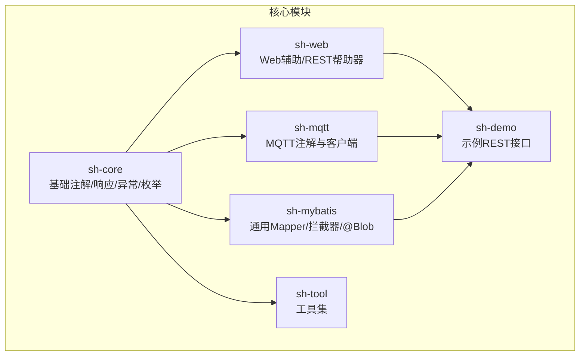
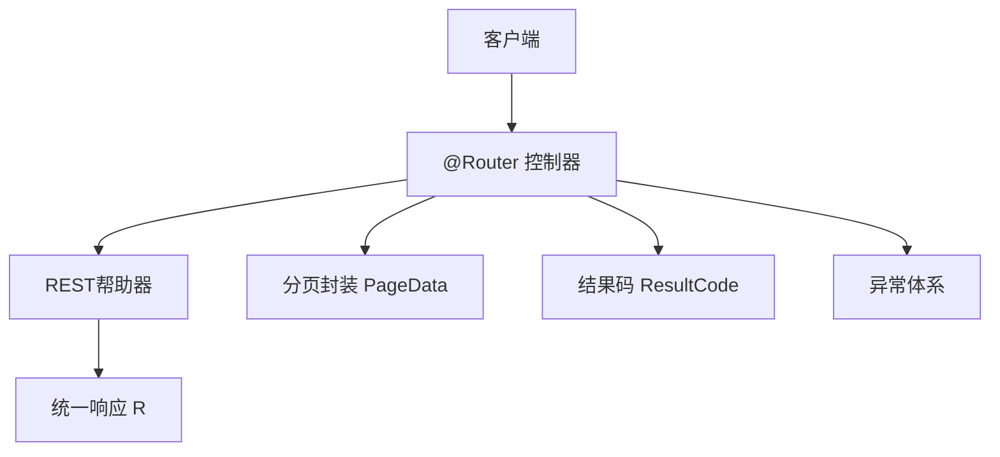
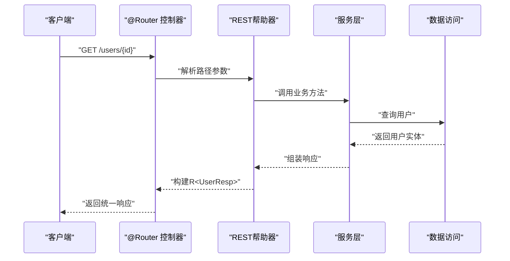
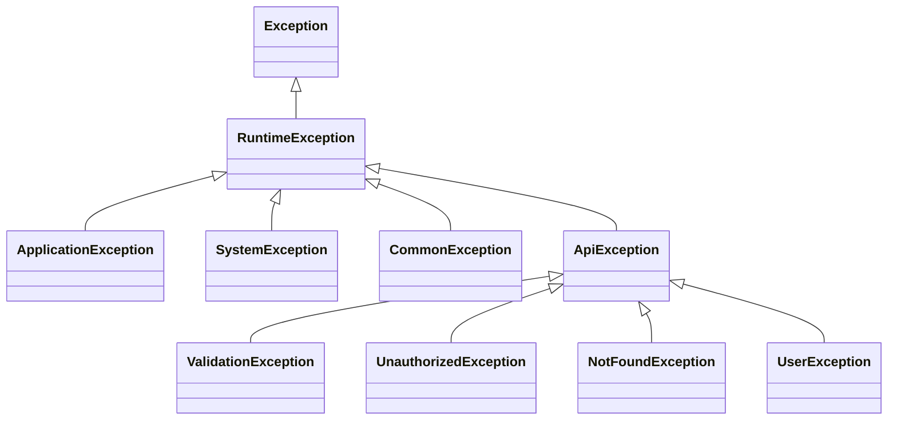
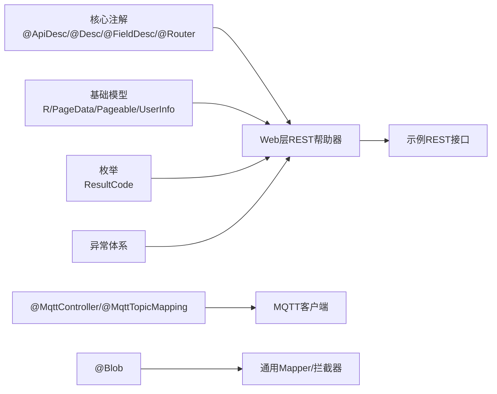

# API参考手册

<cite>
**本文档引用的文件**
- [ApiDesc.java](file://sh-core/src/main/java/com/wkclz/core/annotation/ApiDesc.java)
- [Desc.java](file://sh-core/src/main/java/com/wkclz/core/annotation/Desc.java)
- [FieldDesc.java](file://sh-core/src/main/java/com/wkclz/core/annotation/FieldDesc.java)
- [Router.java](file://sh-core/src/main/java/com/wkclz/core/annotation/Router.java)
- [R.java](file://sh-core/src/main/java/com/wkclz/core/base/R.java)
- [PageData.java](file://sh-core/src/main/java/com/wkclz/core/base/PageData.java)
- [Pageable.java](file://sh-core/src/main/java/com/wkclz/core/base/Pageable.java)
- [UserInfo.java](file://sh-core/src/main/java/com/wkclz/core/base/UserInfo.java)
- [ResultCode.java](file://sh-core/src/main/java/com/wkclz/core/enums/ResultCode.java)
- [ApiException.java](file://sh-core/src/main/java/com/wkclz/core/exception/ApiException.java)
- [ApplicationException.java](file://sh-core/src/main/java/com/wkclz/core/exception/ApplicationException.java)
- [CommonException.java](file://sh-core/src/main/java/com/wkclz/core/exception/CommonException.java)
- [NotFoundException.java](file://sh-core/src/main/java/com/wkclz/core/exception/NotFoundException.java)
- [SystemException.java](file://sh-core/src/main/java/com/wkclz/core/exception/SystemException.java)
- [UnauthorizedException.java](file://sh-core/src/main/java/com/wkclz/core/exception/UnauthorizedException.java)
- [UserException.java](file://sh-core/src/main/java/com/wkclz/core/exception/UserException.java)
- [ValidationException.java](file://sh-core/src/main/java/com/wkclz/core/exception/ValidationException.java)
- [MqttController.java](file://sh-mqtt/src/main/java/com/wkclz/mqtt/annotation/MqttController.java)
- [MqttTopicMapping.java](file://sh-mqtt/src/main/java/com/wkclz/mqtt/annotation/MqttTopicMapping.java)
- [Blob.java](file://sh-mybatis/src/main/java/com/wkclz/mybatis/annotation/Blob.java)
- [Route.java](file://sh-demo/src/main/java/com/wkclz/demo/rest/Route.java)
- [UserRest.java](file://sh-demo/src/main/java/com/wkclz/demo/rest/UserRest.java)
- [AesTool.java](file://sh-tool/src/main/java/com/wkclz/tool/tools/AesTool.java)
- [Base64Tool.java](file://sh-tool/src/main/java/com/wkclz/tool/tools/Base64Tool.java)
- [DesTool.java](file://sh-tool/src/main/java/com/wkclz/tool/tools/DesTool.java)
- [Md5Tool.java](file://sh-tool/src/main/java/com/wkclz/tool/tools/Md5Tool.java)
- [RegularTool.java](file://sh-tool/src/main/java/com/wkclz/tool/tools/RegularTool.java)
- [RsaTool.java](file://sh-tool/src/main/java/com/wkclz/tool/tools/RsaTool.java)
- [ShaTool.java](file://sh-tool/src/main/java/com/wkclz/tool/tools/ShaTool.java)
- [AreaUtil.java](file://sh-tool/src/main/java/com/wkclz/tool/utils/AreaUtil.java)
- [BeanUtil.java](file://sh-tool/src/main/java/com/wkclz/tool/utils/BeanUtil.java)
- [CheckPwdUtil.java](file://sh-tool/src/main/java/com/wkclz/tool/utils/CheckPwdUtil.java)
- [ClassUtil.java](file://sh-tool/src/main/java/com/wkclz/tool/utils/ClassUtil.java)
- [CompressUtil.java](file://sh-tool/src/main/java/com/wkclz/tool/utils/CompressUtil.java)
- [DateUtil.java](file://sh-tool/src/main/java/com/wkclz/tool/utils/DateUtil.java)
- [EnumUtil.java](file://sh-tool/src/main/java/com/wkclz/tool/utils/EnumUtil.java)
- [FileUtil.java](file://sh-tool/src/main/java/com/wkclz/tool/utils/FileUtil.java)
- [IntegerUtil.java](file://sh-tool/src/main/java/com/wkclz/tool/utils/IntegerUtil.java)
- [JsUtil.java](file://sh-tool/src/main/java/com/wkclz/tool/utils/JsUtil.java)
- [JsonUtil.java](file://sh-tool/src/main/java/com/wkclz/tool/utils/JsonUtil.java)
- [MapUtil.java](file://sh-tool/src/main/java/com/wkclz/tool/utils/MapUtil.java)
- [NetworkUtil.java](file://sh-tool/src/main/java/com/wkclz/tool/utils/NetworkUtil.java)
- [PropertiesUtil.java](file://sh-tool/src/main/java/com/wkclz/tool/utils/PropertiesUtil.java)
- [QrCodeUtil.java](file://sh-tool/src/main/java/com/wkclz/tool/utils/QrCodeUtil.java)
- [SecretUtil.java](file://sh-tool/src/main/java/com/wkclz/tool/utils/SecretUtil.java)
- [ServerStateUtil.java](file://sh-tool/src/main/java/com/wkclz/tool/utils/ServerStateUtil.java)
- [StringFormat.java](file://sh-tool/src/main/java/com/wkclz/tool/utils/StringFormat.java)
- [StringUtil.java](file://sh-tool/src/main/java/com/wkclz/tool/utils/StringUtil.java)
- [ValidateCode.java](file://sh-tool/src/main/java/com/wkclz/tool/utils/ValidateCode.java)
</cite>

## 目录
1. [简介](#简介)
2. [项目结构](#项目结构)
3. [核心组件](#核心组件)
4. [架构总览](#架构总览)
5. [详细组件分析](#详细组件分析)
6. [依赖关系分析](#依赖关系分析)
7. [性能考虑](#性能考虑)
8. [故障排除指南](#故障排除指南)
9. [结论](#结论)
10. [附录](#附录)

## 简介
本手册面向sh-framework框架的使用者与维护者，提供完整的API参考与最佳实践指南。内容涵盖：
- 注解系统：@Router、@MqttController、@Blob等的定义与用法
- REST API：HTTP方法、URL模式、请求/响应格式与错误码
- 工具类：密码学、字符串、日期、网络、压缩、二维码等工具方法
- 配置参数：环境变量、开关项与取值范围
- 异常体系：异常类型、错误码与处理建议
- 版本兼容与废弃API迁移

## 项目结构
sh-framework采用多模块架构，核心能力分布在以下模块：
- sh-core：基础注解、统一响应、枚举、异常、用户上下文等
- sh-web：Web层辅助、REST帮助器、错误处理器、用户名注入等
- sh-mqtt：MQTT注解驱动的消息发布/订阅
- sh-mybatis：通用Mapper、拦截器、注解@Blob等
- sh-tool：密码学、字符串、日期、网络、压缩、二维码等工具集
- sh-demo：示例应用，演示REST接口与分页查询
- sh-dynamicdb、sh-redis、sh-spring、sh-xxljob：可选扩展模块（本手册聚焦核心API）

## 核心组件

### 基础注解
- @ApiDesc：用于标注API的描述信息，便于生成文档或元数据收集
- @Desc：通用描述注解，可用于字段或类级别
- @FieldDesc：针对字段的描述注解，配合字段校验与文档生成
- @Router：路由注解，用于声明REST控制器的路由前缀与规则

**章节来源**
- [ApiDesc.java](file://sh-core/src/main/java/com/wkclz/core/annotation/ApiDesc.java)
- [Desc.java](file://sh-core/src/main/java/com/wkclz/core/annotation/Desc.java)
- [FieldDesc.java](file://sh-core/src/main/java/com/wkclz/core/annotation/FieldDesc.java)
- [Router.java](file://sh-core/src/main/java/com/wkclz/core/annotation/Router.java)

### 统一响应与分页
- R：统一响应包装器，包含状态码、消息与数据载体
- PageData：分页结果封装，包含列表、总数、页码等
- Pageable：分页请求参数抽象
- UserInfo：用户上下文信息载体

**章节来源**
- [R.java](file://sh-core/src/main/java/com/wkclz/core/base/R.java)
- [PageData.java](file://sh-core/src/main/java/com/wkclz/core/base/PageData.java)
- [Pageable.java](file://sh-core/src/main/java/com/wkclz/core/base/Pageable.java)
- [UserInfo.java](file://sh-core/src/main/java/com/wkclz/core/base/UserInfo.java)

### 枚举与异常
- ResultCode：结果码枚举，定义业务/系统/验证等各类状态码
- 异常体系：ApiException、ApplicationException、CommonException、NotFoundException、SystemException、UnauthorizedException、UserException、ValidationException

**章节来源**
- [ResultCode.java](file://sh-core/src/main/java/com/wkclz/core/enums/ResultCode.java)
- [ApiException.java](file://sh-core/src/main/java/com/wkclz/core/exception/ApiException.java)
- [ApplicationException.java](file://sh-core/src/main/java/com/wkclz/core/exception/ApplicationException.java)
- [CommonException.java](file://sh-core/src/main/java/com/wkclz/core/exception/CommonException.java)
- [NotFoundException.java](file://sh-core/src/main/java/com/wkclz/core/exception/NotFoundException.java)
- [SystemException.java](file://sh-core/src/main/java/com/wkclz/core/exception/SystemException.java)
- [UnauthorizedException.java](file://sh-core/src/main/java/com/wkclz/core/exception/UnauthorizedException.java)
- [UserException.java](file://sh-core/src/main/java/com/wkclz/core/exception/UserException.java)
- [ValidationException.java](file://sh-core/src/main/java/com/wkclz/core/exception/ValidationException.java)

## 架构总览
下图展示了核心模块之间的交互关系，以及示例REST接口如何利用统一响应与分页。

**图表来源**
- [R.java](file://sh-core/src/main/java/com/wkclz/core/base/R.java)
- [PageData.java](file://sh-core/src/main/java/com/wkclz/core/base/PageData.java)
- [ResultCode.java](file://sh-core/src/main/java/com/wkclz/core/enums/ResultCode.java)
- [Route.java](file://sh-demo/src/main/java/com/wkclz/demo/rest/Route.java)
- [UserRest.java](file://sh-demo/src/main/java/com/wkclz/demo/rest/UserRest.java)

## 详细组件分析

### 注解系统参考

#### @Router
- 作用域：类级别
- 功能：声明REST控制器的路由前缀与匹配规则
- 典型属性：value（前缀）、method（HTTP方法集合）、consumes/produces（媒体类型）
- 使用场景：集中管理控制器路由，避免硬编码路径

**章节来源**
- [Router.java](file://sh-core/src/main/java/com/wkclz/core/annotation/Router.java)

#### @MqttController
- 作用域：类级别
- 功能：标记MQTT消息控制器，声明订阅主题与消息处理入口
- 典型属性：topic（主题）、qos（服务质量）、consumer（消费者标识）
- 使用场景：基于注解驱动的MQTT消息订阅与发布

**章节来源**
- [MqttController.java](file://sh-mqtt/src/main/java/com/wkclz/mqtt/annotation/MqttController.java)

#### @MqttTopicMapping
- 作用域：方法级别
- 功能：将方法映射到特定MQTT主题，支持通配符与参数占位
- 典型属性：value（主题表达式）、qos（服务质量）、payloadType（负载类型）
- 使用场景：细粒度控制消息处理逻辑

**章节来源**
- [MqttTopicMapping.java](file://sh-mqtt/src/main/java/com/wkclz/mqtt/annotation/MqttTopicMapping.java)

#### @Blob
- 作用域：字段级别
- 功能：标记数据库中的大对象字段（如BLOB/CLOB），用于MyBatis生成对应SQL与映射
- 典型属性：type（类型）、compress（是否压缩存储）
- 使用场景：二进制数据、JSON文本、长文本的高效存储与检索

**章节来源**
- [Blob.java](file://sh-mybatis/src/main/java/com/wkclz/mybatis/annotation/Blob.java)

#### @ApiDesc、@Desc、@FieldDesc
- 作用域：类/方法/字段级别
- 功能：提供API与字段的描述信息，便于文档生成与元数据收集
- 典型属性：value（描述文本）、required（是否必填）、example（示例）
- 使用场景：与文档工具链集成，自动化生成接口文档

**章节来源**
- [ApiDesc.java](file://sh-core/src/main/java/com/wkclz/core/annotation/ApiDesc.java)
- [Desc.java](file://sh-core/src/main/java/com/wkclz/core/annotation/Desc.java)
- [FieldDesc.java](file://sh-core/src/main/java/com/wkclz/core/annotation/FieldDesc.java)

### REST API 接口规范

#### 示例：用户管理接口（基于sh-demo）
- 路由前缀：由@Router定义
- GET /users/{id}：按ID查询用户
  - 请求参数：id（路径参数）
  - 响应：R<UserResp>
- POST /users：创建用户
  - 请求体：UserCreateReq
  - 响应：R<UserResp>
- PUT /users：更新用户
  - 请求体：UserUpdateReq
  - 响应：R<UserResp>
- DELETE /users/{id}：删除用户
  - 请求参数：id（路径参数）
  - 响应：R<Void>
- GET /users/page：分页查询
  - 查询参数：page（页码）、size（每页数量）
  - 响应：R<PageData<UserPageResp>>

**图表来源**
- [Route.java](file://sh-demo/src/main/java/com/wkclz/demo/rest/Route.java)
- [UserRest.java](file://sh-demo/src/main/java/com/wkclz/demo/rest/UserRest.java)
- [R.java](file://sh-core/src/main/java/com/wkclz/core/base/R.java)
- [PageData.java](file://sh-core/src/main/java/com/wkclz/core/base/PageData.java)

**章节来源**
- [Route.java](file://sh-demo/src/main/java/com/wkclz/demo/rest/Route.java)
- [UserRest.java](file://sh-demo/src/main/java/com/wkclz/demo/rest/UserRest.java)

### 工具类API文档

#### 密码学工具
- AesTool：AES加解密、密钥生成、填充模式
- Base64Tool：Base64编解码
- DesTool：DES加解密
- Md5Tool：MD5摘要
- RsaTool：RSA加解密与签名
- ShaTool：SHA系列摘要

**章节来源**
- [AesTool.java](file://sh-tool/src/main/java/com/wkclz/tool/tools/AesTool.java)
- [Base64Tool.java](file://sh-tool/src/main/java/com/wkclz/tool/tools/Base64Tool.java)
- [DesTool.java](file://sh-tool/src/main/java/com/wkclz/tool/tools/DesTool.java)
- [Md5Tool.java](file://sh-tool/src/main/java/com/wkclz/tool/tools/Md5Tool.java)
- [RsaTool.java](file://sh-tool/src/main/java/com/wkclz/tool/tools/RsaTool.java)
- [ShaTool.java](file://sh-tool/src/main/java/com/wkclz/tool/tools/ShaTool.java)

#### 字符串与格式化
- StringUtil：字符串判空、截取、替换、驼峰转换
- StringFormat：数字格式化、千分位、货币格式
- JsonUtil：JSON序列化/反序列化、字段过滤、时间格式
- BeanUtil：JavaBean复制、字段拷贝、默认值设置
- EnumUtil：枚举名称/值互查、枚举集合转换

**章节来源**
- [StringUtil.java](file://sh-tool/src/main/java/com/wkclz/tool/utils/StringUtil.java)
- [StringFormat.java](file://sh-tool/src/main/java/com/wkclz/tool/utils/StringFormat.java)
- [JsonUtil.java](file://sh-tool/src/main/java/com/wkclz/tool/utils/JsonUtil.java)
- [BeanUtil.java](file://sh-tool/src/main/java/com/wkclz/tool/utils/BeanUtil.java)
- [EnumUtil.java](file://sh-tool/src/main/java/com/wkclz/tool/utils/EnumUtil.java)

#### 日期与时间
- DateUtil：日期解析/格式化、时区转换、区间计算、节假日判断

**章节来源**
- [DateUtil.java](file://sh-tool/src/main/java/com/wkclz/tool/utils/DateUtil.java)

#### 网络与IO
- NetworkUtil：IP解析、端口检测、DNS查询
- FileUtil：文件读写、路径拼接、权限检查、MIME类型
- CompressUtil：ZIP/GZIP压缩/解压、文件夹打包
- QrCodeUtil：二维码生成与识别
- PropertiesUtil：配置文件读取与键值解析

**章节来源**
- [NetworkUtil.java](file://sh-tool/src/main/java/com/wkclz/tool/utils/NetworkUtil.java)
- [FileUtil.java](file://sh-tool/src/main/java/com/wkclz/tool/utils/FileUtil.java)
- [CompressUtil.java](file://sh-tool/src/main/java/com/wkclz/tool/utils/CompressUtil.java)
- [QrCodeUtil.java](file://sh-tool/src/main/java/com/wkclz/tool/utils/QrCodeUtil.java)
- [PropertiesUtil.java](file://sh-tool/src/main/java/com/wkclz/tool/utils/PropertiesUtil.java)

#### 校验与安全
- CheckPwdUtil：密码强度校验（长度、字符集、历史重复）
- ValidateCode：图形验证码生成与校验
- SecretUtil：敏感信息掩码、脱敏显示

**章节来源**
- [CheckPwdUtil.java](file://sh-tool/src/main/java/com/wkclz/tool/utils/CheckPwdUtil.java)
- [ValidateCode.java](file://sh-tool/src/main/java/com/wkclz/tool/utils/ValidateCode.java)
- [SecretUtil.java](file://sh-tool/src/main/java/com/wkclz/tool/utils/SecretUtil.java)

#### 其他实用工具
- AreaUtil：地区编码/层级查询
- IntegerUtil：整数范围校验、进制转换
- JsUtil：JavaScript表达式安全执行（沙箱）
- ClassUtil：类加载、注解扫描、泛型解析
- MapUtil：Map合并、过滤、排序、嵌套字段访问

**章节来源**
- [AreaUtil.java](file://sh-tool/src/main/java/com/wkclz/tool/utils/AreaUtil.java)
- [IntegerUtil.java](file://sh-tool/src/main/java/com/wkclz/tool/utils/IntegerUtil.java)
- [JsUtil.java](file://sh-tool/src/main/java/com/wkclz/tool/utils/JsUtil.java)
- [ClassUtil.java](file://sh-tool/src/main/java/com/wkclz/tool/utils/ClassUtil.java)
- [MapUtil.java](file://sh-tool/src/main/java/com/wkclz/tool/utils/MapUtil.java)

### 配置参数说明
- 环境类型：通过枚举定义开发/测试/生产等环境，影响日志输出、降级策略与敏感配置解密行为
- 结果码：统一的状态码体系，覆盖成功、参数校验失败、未授权、业务异常、系统异常等
- 分页参数：page（从1开始）、size（最大限制由后端配置决定）
- 日志脱敏：MaskingPatternLayout支持对敏感字段进行脱敏输出

**章节来源**
- [ResultCode.java](file://sh-core/src/main/java/com/wkclz/core/enums/ResultCode.java)
- [Pageable.java](file://sh-core/src/main/java/com/wkclz/core/base/Pageable.java)

### 异常类型与错误处理
- ApiException：业务异常基类，携带业务错误码与提示
- ApplicationException：应用异常基类，用于框架内部错误
- CommonException：通用异常
- NotFoundException：资源不存在
- SystemException：系统异常
- UnauthorizedException：未授权访问
- UserException：用户相关异常
- ValidationException：参数校验失败

**图表来源**
- [ApiException.java](file://sh-core/src/main/java/com/wkclz/core/exception/ApiException.java)
- [ApplicationException.java](file://sh-core/src/main/java/com/wkclz/core/exception/ApplicationException.java)
- [CommonException.java](file://sh-core/src/main/java/com/wkclz/core/exception/CommonException.java)
- [NotFoundException.java](file://sh-core/src/main/java/com/wkclz/core/exception/NotFoundException.java)
- [SystemException.java](file://sh-core/src/main/java/com/wkclz/core/exception/SystemException.java)
- [UnauthorizedException.java](file://sh-core/src/main/java/com/wkclz/core/exception/UnauthorizedException.java)
- [UserException.java](file://sh-core/src/main/java/com/wkclz/core/exception/UserException.java)
- [ValidationException.java](file://sh-core/src/main/java/com/wkclz/core/exception/ValidationException.java)

## 依赖关系分析

**图表来源**
- [Router.java](file://sh-core/src/main/java/com/wkclz/core/annotation/Router.java)
- [R.java](file://sh-core/src/main/java/com/wkclz/core/base/R.java)
- [PageData.java](file://sh-core/src/main/java/com/wkclz/core/base/PageData.java)
- [Pageable.java](file://sh-core/src/main/java/com/wkclz/core/base/Pageable.java)
- [ResultCode.java](file://sh-core/src/main/java/com/wkclz/core/enums/ResultCode.java)
- [MqttController.java](file://sh-mqtt/src/main/java/com/wkclz/mqtt/annotation/MqttController.java)
- [MqttTopicMapping.java](file://sh-mqtt/src/main/java/com/wkclz/mqtt/annotation/MqttTopicMapping.java)
- [Blob.java](file://sh-mybatis/src/main/java/com/wkclz/mybatis/annotation/Blob.java)
- [Route.java](file://sh-demo/src/main/java/com/wkclz/demo/rest/Route.java)
- [UserRest.java](file://sh-demo/src/main/java/com/wkclz/demo/rest/UserRest.java)

**章节来源**
- [Router.java](file://sh-core/src/main/java/com/wkclz/core/annotation/Router.java)
- [R.java](file://sh-core/src/main/java/com/wkclz/core/base/R.java)
- [PageData.java](file://sh-core/src/main/java/com/wkclz/core/base/PageData.java)
- [Pageable.java](file://sh-core/src/main/java/com/wkclz/core/base/Pageable.java)
- [ResultCode.java](file://sh-core/src/main/java/com/wkclz/core/enums/ResultCode.java)
- [MqttController.java](file://sh-mqtt/src/main/java/com/wkclz/mqtt/annotation/MqttController.java)
- [MqttTopicMapping.java](file://sh-mqtt/src/main/java/com/wkclz/mqtt/annotation/MqttTopicMapping.java)
- [Blob.java](file://sh-mybatis/src/main/java/com/wkclz/mybatis/annotation/Blob.java)
- [Route.java](file://sh-demo/src/main/java/com/wkclz/demo/rest/Route.java)
- [UserRest.java](file://sh-demo/src/main/java/com/wkclz/demo/rest/UserRest.java)

## 性能考虑
- 统一响应R：减少重复封装，降低序列化开销
- 分页PageData：限制每页大小，避免超大数据量传输
- @Blob：对大字段启用压缩存储，减少IO与带宽占用
- 工具类：优先选择内存友好的实现（如StringBuilder、Stream API），避免频繁装箱拆箱
- 日志脱敏：在高并发场景下避免对敏感字段进行复杂正则匹配

## 故障排除指南
- 参数校验失败：检查ValidationException与@FieldDesc/@Desc描述，确认必填字段与格式
- 未授权访问：核对UnauthorizedException触发条件，确保鉴权流程正确
- 资源不存在：使用NotFoundException定位ID/路径问题
- 系统异常：SystemException通常由底层异常引发，需结合堆栈与日志排查
- 业务异常：ApiException携带业务错误码，依据ResultCode快速定位问题

**章节来源**
- [ValidationException.java](file://sh-core/src/main/java/com/wkclz/core/exception/ValidationException.java)
- [UnauthorizedException.java](file://sh-core/src/main/java/com/wkclz/core/exception/UnauthorizedException.java)
- [NotFoundException.java](file://sh-core/src/main/java/com/wkclz/core/exception/NotFoundException.java)
- [SystemException.java](file://sh-core/src/main/java/com/wkclz/core/exception/SystemException.java)
- [ApiException.java](file://sh-core/src/main/java/com/wkclz/core/exception/ApiException.java)
- [ResultCode.java](file://sh-core/src/main/java/com/wkclz/core/enums/ResultCode.java)

## 结论
本手册提供了sh-framework的核心API参考与最佳实践，涵盖注解、REST接口、工具类、异常与配置等方面。建议在实际项目中：
- 使用统一响应与分页，保证前后端契约一致
- 合理运用注解驱动开发，提升可维护性
- 重视参数校验与异常处理，保障系统稳定性
- 按需引入扩展模块，避免过度依赖

## 附录

### 错误码对照表（节选）
- 成功：00000
- 参数校验失败：A0400
- 未授权：A0401
- 资源不存在：A0404
- 业务异常：A0500
- 系统异常：A0503

**章节来源**
- [ResultCode.java](file://sh-core/src/main/java/com/wkclz/core/enums/ResultCode.java)

### 版本兼容与废弃API迁移
- 迁移建议：遵循语义化版本，小版本升级保持向后兼容；大版本升级时关注注解属性变更与异常类型调整
- 废弃API：若存在已标记为废弃的注解或方法，请及时替换为新接口，并清理遗留代码