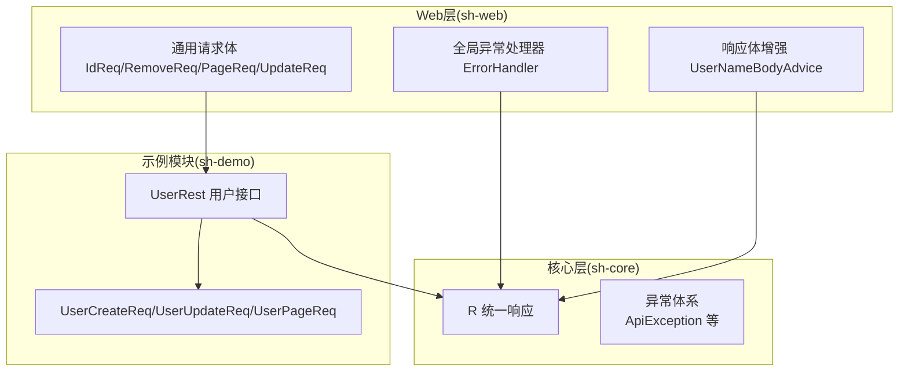
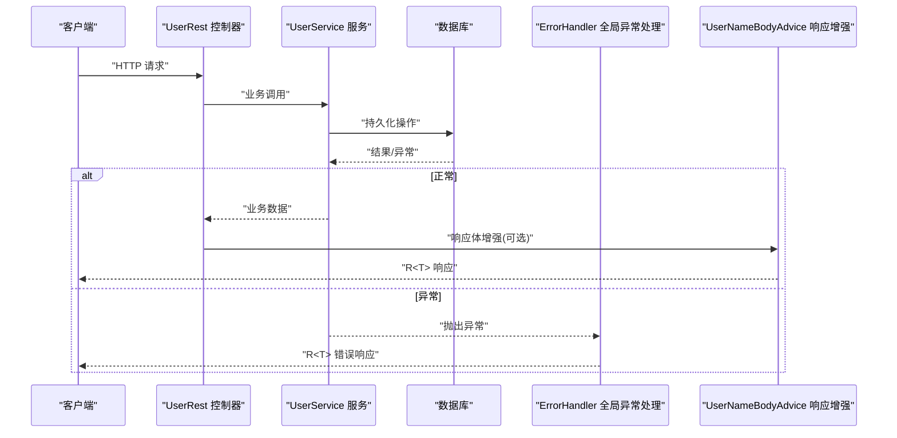
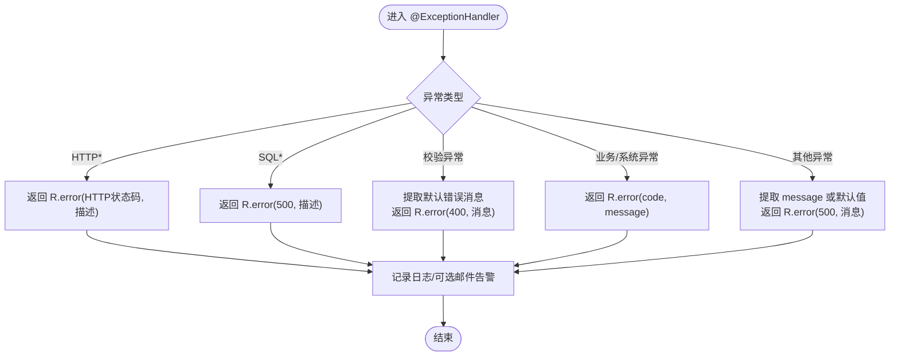
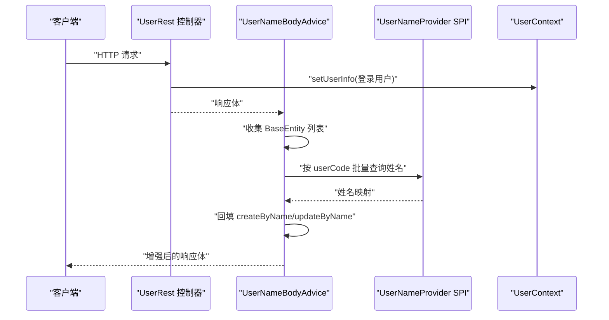
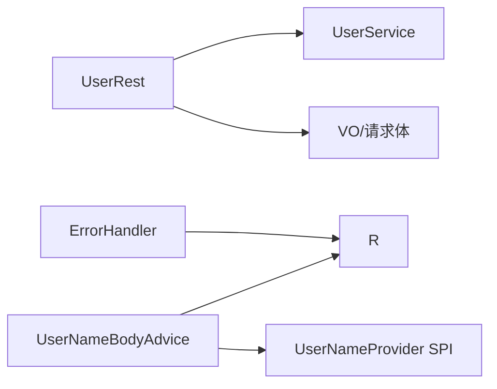

# REST API参考

<cite>
**本文引用的文件**
- [R.java](file://sh-core/src/main/java/com/wkclz/core/base/R.java)
- [ApiException.java](file://sh-core/src/main/java/com/wkclz/core/exception/ApiException.java)
- [ErrorHandler.java](file://sh-web/src/main/java/com/wkclz/web/rest/ErrorHandler.java)
- [UserNameBodyAdvice.java](file://sh-web/src/main/java/com/wkclz/web/rest/UserNameBodyAdvice.java)
- [UserRest.java](file://sh-demo/src/main/java/com/wkclz/demo/rest/UserRest.java)
- [UserCreateReq.java](file://sh-demo/src/main/java/com/wkclz/demo/bean/vo/user/UserCreateReq.java)
- [UserUpdateReq.java](file://sh-demo/src/main/java/com/wkclz/demo/bean/vo/user/UserUpdateReq.java)
- [UserPageReq.java](file://sh-demo/src/main/java/com/wkclz/demo/bean/vo/user/UserPageReq.java)
- [IdReq.java](file://sh-web/src/main/java/com/wkclz/web/bean/IdReq.java)
- [RemoveReq.java](file://sh-web/src/main/java/com/wkclz/web/bean/RemoveReq.java)
</cite>

## 目录
1. [简介](#简介)
2. [项目结构](#项目结构)
3. [核心组件](#核心组件)
4. [架构总览](#架构总览)
5. [详细组件分析](#详细组件分析)
6. [依赖分析](#依赖分析)
7. [性能考虑](#性能考虑)
8. [故障排查指南](#故障排查指南)
9. [结论](#结论)
10. [附录](#附录)

## 简介
本文件为 sh-framework 框架的 REST API 参考文档，覆盖统一响应格式 R<T> 的设计与使用、全局异常处理机制、请求参数校验规范、用户上下文与自动填充行为，以及基于示例模块的完整 CRUD 接口定义与最佳实践。文档以“可落地”的方式组织内容，既适合开发者快速上手，也便于测试与运维人员查阅。

## 项目结构
围绕 REST API 的关键模块与文件分布如下：
- 统一响应与异常：sh-core 提供 R<T> 响应封装与各类异常类型
- 全局异常处理：sh-web 提供 @RestControllerAdvice 统一捕获与返回
- 用户上下文与自动填充：sh-web 提供 ResponseBodyAdvice 自动回填创建/修改人名称
- 示例接口与请求体：sh-demo 提供用户管理 REST 接口与 VO/请求体定义
- 通用请求体与校验注解：sh-web 提供分页、更新、删除等标准请求体与自定义校验

**图表来源**
- [R.java:1-76](file://sh-core/src/main/java/com/wkclz/core/base/R.java#L1-L76)
- [ApiException.java:1-48](file://sh-core/src/main/java/com/wkclz/core/exception/ApiException.java#L1-L48)
- [ErrorHandler.java:1-267](file://sh-web/src/main/java/com/wkclz/web/rest/ErrorHandler.java#L1-L267)
- [UserNameBodyAdvice.java:1-198](file://sh-web/src/main/java/com/wkclz/web/rest/UserNameBodyAdvice.java#L1-L198)
- [UserRest.java:1-98](file://sh-demo/src/main/java/com/wkclz/demo/rest/UserRest.java#L1-L98)
- [UserCreateReq.java:1-29](file://sh-demo/src/main/java/com/wkclz/demo/bean/vo/user/UserCreateReq.java#L1-L29)
- [UserUpdateReq.java:1-21](file://sh-demo/src/main/java/com/wkclz/demo/bean/vo/user/UserUpdateReq.java#L1-L21)
- [UserPageReq.java:1-24](file://sh-demo/src/main/java/com/wkclz/demo/bean/vo/user/UserPageReq.java#L1-L24)
- [IdReq.java:1-19](file://sh-web/src/main/java/com/wkclz/web/bean/IdReq.java#L1-L19)
- [RemoveReq.java:1-26](file://sh-web/src/main/java/com/wkclz/web/bean/RemoveReq.java#L1-L26)

**章节来源**
- [R.java:1-76](file://sh-core/src/main/java/com/wkclz/core/base/R.java#L1-L76)
- [ErrorHandler.java:1-267](file://sh-web/src/main/java/com/wkclz/web/rest/ErrorHandler.java#L1-L267)
- [UserNameBodyAdvice.java:1-198](file://sh-web/src/main/java/com/wkclz/web/rest/UserNameBodyAdvice.java#L1-L198)
- [UserRest.java:1-98](file://sh-demo/src/main/java/com/wkclz/demo/rest/UserRest.java#L1-L98)

## 核心组件
- 统一响应 R<T>
  - 字段：code、msg、data、requestTime、responseTime、costTime
  - 工厂方法：ok(data)、warn(...)、error(...) 多种重载
  - 与 ResultCode、CommonException 协作，保证响应一致性
- 全局异常处理 ErrorHandler
  - 捕获常见异常（HTTP 方法/媒体类型不支持、资源未找到、SQL语法错误、参数校验失败等）
  - 将异常映射为 R<T> 错误响应，并记录日志与可选邮件告警
- 用户名自动填充 UserNameBodyAdvice
  - 在响应体中自动识别 BaseEntity 的 createBy/updateBy 并回填真实姓名
  - 支持对象树深度遍历与缓存字段反射信息，避免重复开销

**章节来源**
- [R.java:11-76](file://sh-core/src/main/java/com/wkclz/core/base/R.java#L11-L76)
- [ErrorHandler.java:40-267](file://sh-web/src/main/java/com/wkclz/web/rest/ErrorHandler.java#L40-L267)
- [UserNameBodyAdvice.java:22-198](file://sh-web/src/main/java/com/wkclz/web/rest/UserNameBodyAdvice.java#L22-L198)

## 架构总览
下图展示一次典型请求从控制器到响应体的流转路径，以及异常如何被统一处理：

**图表来源**
- [UserRest.java:30-98](file://sh-demo/src/main/java/com/wkclz/demo/rest/UserRest.java#L30-L98)
- [ErrorHandler.java:131-148](file://sh-web/src/main/java/com/wkclz/web/rest/ErrorHandler.java#L131-L148)
- [UserNameBodyAdvice.java:37-96](file://sh-web/src/main/java/com/wkclz/web/rest/UserNameBodyAdvice.java#L37-L96)

## 详细组件分析

### 统一响应 R<T> 设计与使用
- 设计要点
  - 统一响应结构，便于前端与监控系统解析
  - 内置时间戳与耗时字段，便于链路追踪与性能分析
  - 多种工厂方法，简化成功/警告/错误场景的构造
- 使用建议
  - 成功场景优先使用 R.ok(data)
  - 参数校验失败使用 R.warn(...)
  - 业务异常使用 R.error(code, msg) 或 R.error(commonException)
  - 未知异常由全局异常处理器兜底，返回标准化错误

**章节来源**
- [R.java:22-76](file://sh-core/src/main/java/com/wkclz/core/base/R.java#L22-L76)

### 全局异常处理机制
- 覆盖范围
  - HTTP 方法/媒体类型不支持、资源未找到
  - SQL 语法错误、数据库异常、数据截断
  - 参数校验异常（MethodArgumentNotValidException、BindException）
  - 业务异常（ValidationException、UserException）、系统异常（CommonException）
  - 通用异常兜底，屏蔽内部堆栈细节
- 行为特征
  - 记录请求上下文与异常信息
  - 可选邮件告警（需配置系统参数）
  - 始终返回 R<T> 错误响应

**图表来源**
- [ErrorHandler.java:49-148](file://sh-web/src/main/java/com/wkclz/web/rest/ErrorHandler.java#L49-L148)

**章节来源**
- [ErrorHandler.java:40-267](file://sh-web/src/main/java/com/wkclz/web/rest/ErrorHandler.java#L40-L267)

### 用户上下文与响应体自动填充
- 用户上下文注入
  - 示例控制器在每个接口内设置当前登录用户信息到 UserContext
  - 建议在网关或过滤器中统一注入，减少重复代码
- 响应体自动填充
  - UserNameBodyAdvice 在响应前扫描响应体中的 BaseEntity
  - 依据 createBy/updateBy 查询真实姓名并回填 createByName/updateByName
  - 支持对象数组、集合、Map、嵌套对象与 R<T> 包裹的数据

**图表来源**
- [UserRest.java:91-96](file://sh-demo/src/main/java/com/wkclz/demo/rest/UserRest.java#L91-L96)
- [UserNameBodyAdvice.java:40-96](file://sh-web/src/main/java/com/wkclz/web/rest/UserNameBodyAdvice.java#L40-L96)

**章节来源**
- [UserNameBodyAdvice.java:22-198](file://sh-web/src/main/java/com/wkclz/web/rest/UserNameBodyAdvice.java#L22-L198)
- [UserRest.java:91-96](file://sh-demo/src/main/java/com/wkclz/demo/rest/UserRest.java#L91-L96)

### 请求参数校验与标准Bean
- 标准请求体
  - IdReq：单个主键校验
  - RemoveReq：id 或 ids 至少一个非空（自定义组合校验）
  - PageReq/UpdateReq：分页与更新基类（示例模块中可见）
- 示例请求体
  - UserCreateReq：必填字段校验（用户名、状态）
  - UserUpdateReq：继承更新基类，按需扩展
  - UserPageReq：继承分页基类，按需扩展查询条件
- 校验触发
  - 控制器参数使用 @Valid 触发 JSR-303 校验
  - 失败时由全局异常处理器返回 R.error(400, 消息)

**章节来源**
- [IdReq.java:11-19](file://sh-web/src/main/java/com/wkclz/web/bean/IdReq.java#L11-L19)
- [RemoveReq.java:14-26](file://sh-web/src/main/java/com/wkclz/web/bean/RemoveReq.java#L14-L26)
- [UserCreateReq.java:14-28](file://sh-demo/src/main/java/com/wkclz/demo/bean/vo/user/UserCreateReq.java#L14-L28)
- [UserUpdateReq.java:9-21](file://sh-demo/src/main/java/com/wkclz/demo/bean/vo/user/UserUpdateReq.java#L9-L21)
- [UserPageReq.java:9-24](file://sh-demo/src/main/java/com/wkclz/demo/bean/vo/user/UserPageReq.java#L9-L24)
- [UserRest.java:30-98](file://sh-demo/src/main/java/com/wkclz/demo/rest/UserRest.java#L30-L98)

### REST 接口定义与示例

- 基础路由前缀
  - 示例模块使用 Route.PREFIX 作为路由前缀（具体值以实际实现为准）

- GET /user/page
  - 功能：分页查询用户
  - 请求参数：UserPageReq（继承 PageReq），支持模糊查询字段
  - 响应：R<PageData<UserPageResp>>
  - 状态码：200 成功；400 参数校验失败；500 系统异常
  - 最佳实践：分页大小限制、排序字段白名单、敏感字段脱敏

- GET /user/info
  - 功能：根据 ID 查询用户详情
  - 请求参数：IdReq（@Valid）
  - 响应：R<UserResp>
  - 状态码：200 成功；404 用户不存在；500 系统异常

- POST /user/create
  - 功能：创建用户
  - 请求体：UserCreateReq（@Valid）
  - 响应：R<UserResp>
  - 状态码：200 成功；400 参数校验失败；500 系统异常

- POST /user/update
  - 功能：更新用户（支持选择性更新）
  - 请求体：UserUpdateReq（@Valid）
  - 响应：R<Integer>（影响行数）
  - 状态码：200 成功；400 参数校验失败；500 系统异常

- POST /user/remove
  - 功能：删除用户（支持单个与批量）
  - 请求体：RemoveReq（@Valid，id 或 ids 至少一个）
  - 响应：R<Integer>（影响行数）
  - 状态码：200 成功；400 参数校验失败；500 系统异常

- 请求参数校验与错误响应
  - 字段级校验失败：返回 R.error(400, 消息)
  - 组合校验失败（如 RemoveReq）：返回 R.error(400, 消息)
  - 业务异常（如用户不存在）：返回 R.error(code, message)

- 响应体增强
  - 若响应体包含 BaseEntity，且 createBy/updateBy 存在，UserNameBodyAdvice 将自动回填真实姓名

**章节来源**
- [UserRest.java:30-98](file://sh-demo/src/main/java/com/wkclz/demo/rest/UserRest.java#L30-L98)
- [UserCreateReq.java:14-28](file://sh-demo/src/main/java/com/wkclz/demo/bean/vo/user/UserCreateReq.java#L14-L28)
- [UserUpdateReq.java:9-21](file://sh-demo/src/main/java/com/wkclz/demo/bean/vo/user/UserUpdateReq.java#L9-L21)
- [UserPageReq.java:9-24](file://sh-demo/src/main/java/com/wkclz/demo/bean/vo/user/UserPageReq.java#L9-L24)
- [IdReq.java:11-19](file://sh-web/src/main/java/com/wkclz/web/bean/IdReq.java#L11-L19)
- [RemoveReq.java:14-26](file://sh-web/src/main/java/com/wkclz/web/bean/RemoveReq.java#L14-L26)
- [UserNameBodyAdvice.java:40-96](file://sh-web/src/main/java/com/wkclz/web/rest/UserNameBodyAdvice.java#L40-L96)

## 依赖分析
- 组件耦合
  - 控制器依赖服务层与 VO/请求体
  - 服务层依赖持久层与业务规则
  - 全局异常处理器与统一响应解耦业务
  - 响应体增强通过 SPI 获取用户名映射，降低对具体实现的耦合
- 关键依赖关系

**图表来源**
- [UserRest.java:27-28](file://sh-demo/src/main/java/com/wkclz/demo/rest/UserRest.java#L27-L28)
- [ErrorHandler.java:40-41](file://sh-web/src/main/java/com/wkclz/web/rest/ErrorHandler.java#L40-L41)
- [UserNameBodyAdvice.java:22-23](file://sh-web/src/main/java/com/wkclz/web/rest/UserNameBodyAdvice.java#L22-L23)

**章节来源**
- [UserRest.java:27-28](file://sh-demo/src/main/java/com/wkclz/demo/rest/UserRest.java#L27-L28)
- [ErrorHandler.java:40-41](file://sh-web/src/main/java/com/wkclz/web/rest/ErrorHandler.java#L40-L41)
- [UserNameBodyAdvice.java:22-23](file://sh-web/src/main/java/com/wkclz/web/rest/UserNameBodyAdvice.java#L22-L23)

## 性能考虑
- 响应体增强
  - 对象树遍历有最大深度限制，避免深层嵌套导致的性能问题
  - 字段反射结果缓存，减少重复反射开销
- 日志与告警
  - 异常日志记录包含请求上下文，便于定位问题但需注意日志级别与敏感信息脱敏
  - 邮件告警仅在系统配置开启时触发，避免频繁告警影响性能
- 分页查询
  - 建议在服务层限制最大分页条数，防止超大分页造成数据库压力

[本节为通用指导，无需列出章节来源]

## 故障排查指南
- 常见问题与定位
  - 参数校验失败：检查请求体是否符合 VO 注解约束，查看 R.error(400, 消息) 中的具体字段提示
  - 删除接口报错：确认 RemoveReq 中 id 与 ids 至少一个非空
  - 用户名未回填：确认 UserNameProvider SPI 是否注册，且 createBy/updateBy 不为空
  - 业务异常：查看全局异常处理器返回的 code/msg，结合日志定位
- 排查步骤
  - 查看响应体中的 code/msg
  - 检查服务端日志（ERROR 级别）与异常堆栈
  - 如启用邮件告警，核对告警邮件内容与收件人配置

**章节来源**
- [ErrorHandler.java:131-148](file://sh-web/src/main/java/com/wkclz/web/rest/ErrorHandler.java#L131-L148)
- [RemoveReq.java:14-26](file://sh-web/src/main/java/com/wkclz/web/bean/RemoveReq.java#L14-L26)
- [UserNameBodyAdvice.java:98-115](file://sh-web/src/main/java/com/wkclz/web/rest/UserNameBodyAdvice.java#L98-L115)

## 结论
sh-framework 提供了一套完整的 REST API 开发与治理方案：统一响应、全局异常处理、参数校验与响应体增强，配合示例模块的 CRUD 实践，能够帮助团队快速构建高质量、易维护的后端服务。建议在生产环境中：
- 统一使用 R<T> 与全局异常处理
- 在网关层集中注入用户上下文
- 合理配置分页与校验规则
- 开启必要的日志与告警策略

[本节为总结性内容，无需列出章节来源]

## 附录

### 统一响应 R<T> 字段说明
- code：整型状态码
- msg：描述信息
- data：泛型业务数据
- requestTime/responseTime/costTime：请求/响应时间与耗时

**章节来源**
- [R.java:14-21](file://sh-core/src/main/java/com/wkclz/core/base/R.java#L14-L21)

### 全局异常映射（节选）
- HTTP 方法/媒体类型不支持：返回 R.error(状态码, 描述)
- 资源未找到：返回 R.error(404, 描述)
- SQL 语法错误/数据库异常：返回 R.error(500, 描述)
- 参数校验失败：返回 R.error(400, 默认消息)
- 业务异常：返回 R.error(code, message)
- 通用异常兜底：返回 R.error(500, 消息)

**章节来源**
- [ErrorHandler.java:49-148](file://sh-web/src/main/java/com/wkclz/web/rest/ErrorHandler.java#L49-L148)

### 用户上下文与自动填充行为
- 用户上下文：在控制器中设置当前登录用户信息
- 响应增强：自动回填 createByName/updateByName，支持复杂嵌套结构

**章节来源**
- [UserRest.java:91-96](file://sh-demo/src/main/java/com/wkclz/demo/rest/UserRest.java#L91-L96)
- [UserNameBodyAdvice.java:40-96](file://sh-web/src/main/java/com/wkclz/web/rest/UserNameBodyAdvice.java#L40-L96)