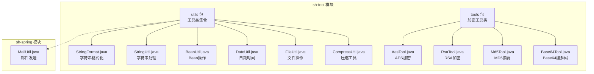
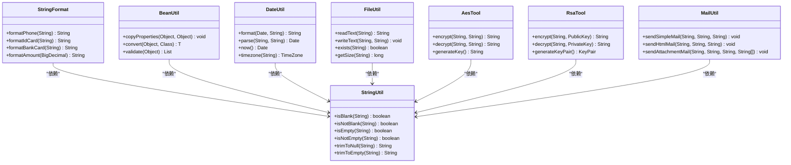
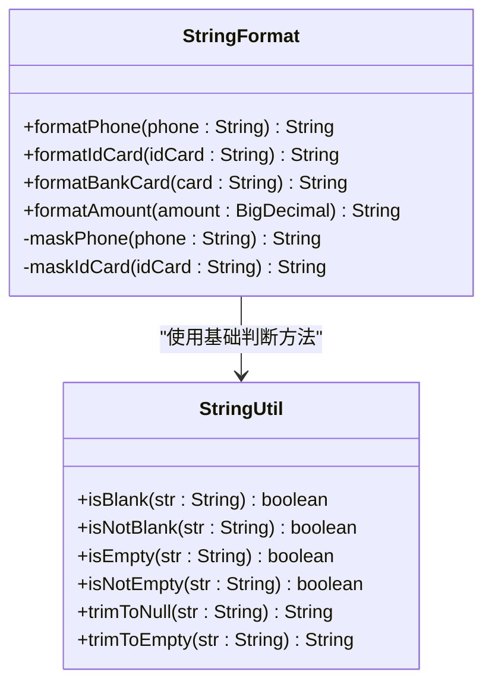
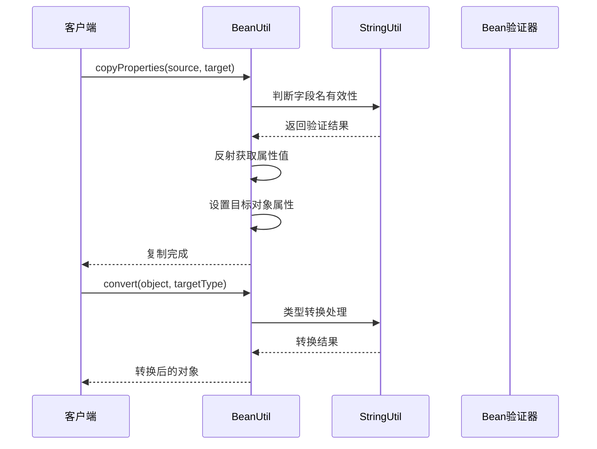
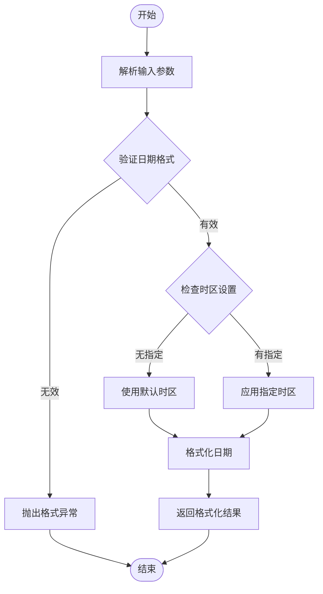
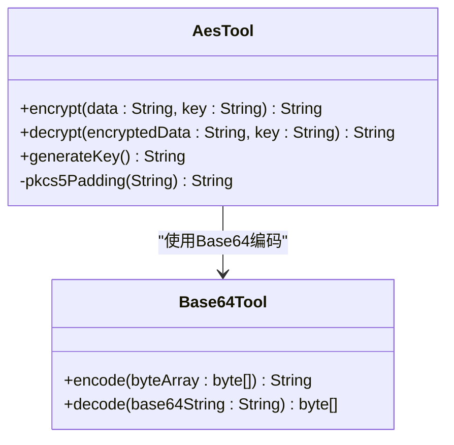
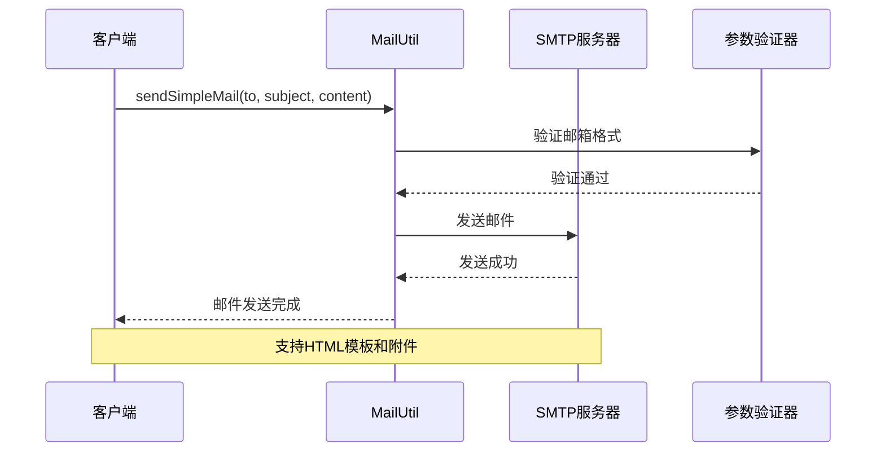
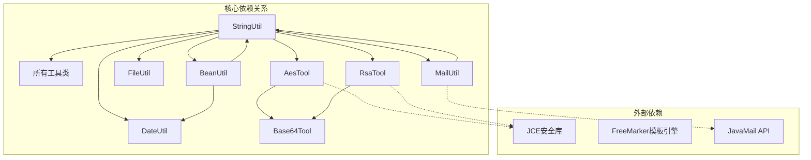

# 工具类API参考

<cite>
**本文档引用的文件**
- [StringFormat.java](file://sh-tool/src/main/java/com/wkclz/tool/utils/StringFormat.java)
- [StringUtil.java](file://sh-tool/src/main/java/com/wkclz/tool/utils/StringUtil.java)
- [BeanUtil.java](file://sh-tool/src/main/java/com/wkclz/tool/utils/BeanUtil.java)
- [DateUtil.java](file://sh-tool/src/main/java/com/wkclz/tool/utils/DateUtil.java)
- [FileUtil.java](file://sh-tool/src/main/java/com/wkclz/tool/utils/FileUtil.java)
- [AesTool.java](file://sh-tool/src/main/java/com/wkclz/tool/tools/AesTool.java)
- [RsaTool.java](file://sh-tool/src/main/java/com/wkclz/tool/tools/RsaTool.java)
- [Md5Tool.java](file://sh-tool/src/main/java/com/wkclz/tool/tools/Md5Tool.java)
- [Base64Tool.java](file://sh-tool/src/main/java/com/wkclz/tool/tools/Base64Tool.java)
- [CompressUtil.java](file://sh-tool/src/main/java/com/wkclz/tool/utils/CompressUtil.java)
- [MailUtil.java](file://sh-spring/src/main/java/com/wkclz/spring/utils/MailUtil.java)
</cite>

## 目录
1. [简介](#简介)
2. [项目结构](#项目结构)
3. [核心组件](#核心组件)
4. [架构概览](#架构概览)
5. [详细组件分析](#详细组件分析)
6. [依赖分析](#依赖分析)
7. [性能考虑](#性能考虑)
8. [故障排除指南](#故障排除指南)
9. [结论](#结论)

## 简介
本文件为sh-framework框架中工具类API的完整参考文档，涵盖字符串处理、Bean操作、日期时间、文件操作、加密工具以及邮件发送等核心工具模块。文档基于实际代码实现，提供方法定义、使用示例和最佳实践建议，帮助开发者高效、正确地使用这些工具类。

## 项目结构
工具类主要位于sh-tool模块的utils包和tools包中，同时邮件发送工具位于sh-spring模块的utils包中。整体采用按功能域划分的组织方式，便于维护和扩展。

**图表来源**
- [StringFormat.java](file://sh-tool/src/main/java/com/wkclz/tool/utils/StringFormat.java)
- [BeanUtil.java](file://sh-tool/src/main/java/com/wkclz/tool/utils/BeanUtil.java)
- [AesTool.java](file://sh-tool/src/main/java/com/wkclz/tool/tools/AesTool.java)
- [MailUtil.java](file://sh-spring/src/main/java/com/wkclz/spring/utils/MailUtil.java)

## 核心组件

### 字符串处理工具类
字符串处理工具类提供格式化、验证和转换功能，支持多种文本处理场景。

**章节来源**
- [StringFormat.java](file://sh-tool/src/main/java/com/wkclz/tool/utils/StringFormat.java)
- [StringUtil.java](file://sh-tool/src/main/java/com/wkclz/tool/utils/StringUtil.java)

### Bean操作工具类
Bean操作工具类提供属性复制、类型转换和验证方法，简化JavaBean的操作流程。

**章节来源**
- [BeanUtil.java](file://sh-tool/src/main/java/com/wkclz/tool/utils/BeanUtil.java)

### 日期时间工具类
日期时间工具类提供日期时间的格式化、解析和时区处理功能，支持国际化场景。

**章节来源**
- [DateUtil.java](file://sh-tool/src/main/java/com/wkclz/tool/utils/DateUtil.java)

### 文件操作工具类
文件操作工具类提供文件读写、压缩和编码转换功能，支持大文件处理和流式操作。

**章节来源**
- [FileUtil.java](file://sh-tool/src/main/java/com/wkclz/tool/utils/FileUtil.java)
- [CompressUtil.java](file://sh-tool/src/main/java/com/wkclz/tool/utils/CompressUtil.java)

### 加密工具类
加密工具类提供对称加密、非对称加密和摘要算法的封装，确保数据安全传输。

**章节来源**
- [AesTool.java](file://sh-tool/src/main/java/com/wkclz/tool/tools/AesTool.java)
- [RsaTool.java](file://sh-tool/src/main/java/com/wkclz/tool/tools/RsaTool.java)
- [Md5Tool.java](file://sh-tool/src/main/java/com/wkclz/tool/tools/Md5Tool.java)
- [Base64Tool.java](file://sh-tool/src/main/java/com/wkclz/tool/tools/Base64Tool.java)

### 邮件发送工具类
邮件发送工具类提供SMTP配置和邮件发送功能，支持HTML模板和附件发送。

**章节来源**
- [MailUtil.java](file://sh-spring/src/main/java/com/wkclz/spring/utils/MailUtil.java)

## 架构概览
工具类采用分层架构设计，按功能域划分到不同的包中，通过清晰的接口定义提供统一的API规范。

**图表来源**
- [StringFormat.java](file://sh-tool/src/main/java/com/wkclz/tool/utils/StringFormat.java)
- [StringUtil.java](file://sh-tool/src/main/java/com/wkclz/tool/utils/StringUtil.java)
- [BeanUtil.java](file://sh-tool/src/main/java/com/wkclz/tool/utils/BeanUtil.java)
- [DateUtil.java](file://sh-tool/src/main/java/com/wkclz/tool/utils/DateUtil.java)
- [FileUtil.java](file://sh-tool/src/main/java/com/wkclz/tool/utils/FileUtil.java)
- [AesTool.java](file://sh-tool/src/main/java/com/wkclz/tool/tools/AesTool.java)
- [RsaTool.java](file://sh-tool/src/main/java/com/wkclz/tool/tools/RsaTool.java)
- [MailUtil.java](file://sh-spring/src/main/java/com/wkclz/spring/utils/MailUtil.java)

## 详细组件分析

### 字符串处理工具类

#### StringFormat类
StringFormat类提供专业的字符串格式化功能，支持手机号、身份证号、银行卡号等常用格式的标准化处理。

**图表来源**
- [StringFormat.java](file://sh-tool/src/main/java/com/wkclz/tool/utils/StringFormat.java)
- [StringUtil.java](file://sh-tool/src/main/java/com/wkclz/tool/utils/StringUtil.java)

**章节来源**
- [StringFormat.java](file://sh-tool/src/main/java/com/wkclz/tool/utils/StringFormat.java)
- [StringUtil.java](file://sh-tool/src/main/java/com/wkclz/tool/utils/StringUtil.java)

#### StringUtil类
StringUtil类提供基础的字符串判断和处理方法，是其他工具类的重要依赖。

**章节来源**
- [StringUtil.java](file://sh-tool/src/main/java/com/wkclz/tool/utils/StringUtil.java)

### Bean操作工具类

#### BeanUtil类
BeanUtil类提供完整的Bean操作功能，包括属性复制、类型转换和验证。

**图表来源**
- [BeanUtil.java](file://sh-tool/src/main/java/com/wkclz/tool/utils/BeanUtil.java)
- [StringUtil.java](file://sh-tool/src/main/java/com/wkclz/tool/utils/StringUtil.java)

**章节来源**
- [BeanUtil.java](file://sh-tool/src/main/java/com/wkclz/tool/utils/BeanUtil.java)

### 日期时间工具类

#### DateUtil类
DateUtil类提供日期时间的格式化、解析和时区处理功能，支持多种日期格式和时区转换。

**图表来源**
- [DateUtil.java](file://sh-tool/src/main/java/com/wkclz/tool/utils/DateUtil.java)

**章节来源**
- [DateUtil.java](file://sh-tool/src/main/java/com/wkclz/tool/utils/DateUtil.java)

### 文件操作工具类

#### FileUtil类
FileUtil类提供文件的基本读写操作，支持文本文件的读取和写入。

**章节来源**
- [FileUtil.java](file://sh-tool/src/main/java/com/wkclz/tool/utils/FileUtil.java)

#### CompressUtil类
CompressUtil类提供文件压缩和解压缩功能，支持常见的压缩格式。

**章节来源**
- [CompressUtil.java](file://sh-tool/src/main/java/com/wkclz/tool/utils/CompressUtil.java)

### 加密工具类

#### 对称加密工具类
对称加密工具类提供AES加密算法的封装，支持密钥生成和加解密操作。

**图表来源**
- [AesTool.java](file://sh-tool/src/main/java/com/wkclz/tool/tools/AesTool.java)
- [Base64Tool.java](file://sh-tool/src/main/java/com/wkclz/tool/tools/Base64Tool.java)

**章节来源**
- [AesTool.java](file://sh-tool/src/main/java/com/wkclz/tool/tools/AesTool.java)
- [Base64Tool.java](file://sh-tool/src/main/java/com/wkclz/tool/tools/Base64Tool.java)

#### 非对称加密工具类
非对称加密工具类提供RSA加密算法的封装，支持公私钥对生成和加解密操作。

**章节来源**
- [RsaTool.java](file://sh-tool/src/main/java/com/wkclz/tool/tools/RsaTool.java)

#### 摘要算法工具类
摘要算法工具类提供MD5和SHA系列摘要算法的封装。

**章节来源**
- [Md5Tool.java](file://sh-tool/src/main/java/com/wkclz/tool/tools/Md5Tool.java)

### 邮件发送工具类

#### MailUtil类
MailUtil类提供邮件发送功能，支持简单文本邮件、HTML邮件和带附件的邮件发送。

**图表来源**
- [MailUtil.java](file://sh-spring/src/main/java/com/wkclz/spring/utils/MailUtil.java)

**章节来源**
- [MailUtil.java](file://sh-spring/src/main/java/com/wkclz/spring/utils/MailUtil.java)

## 依赖分析

**图表来源**
- [StringUtil.java](file://sh-tool/src/main/java/com/wkclz/tool/utils/StringUtil.java)
- [BeanUtil.java](file://sh-tool/src/main/java/com/wkclz/tool/utils/BeanUtil.java)
- [AesTool.java](file://sh-tool/src/main/java/com/wkclz/tool/tools/AesTool.java)
- [RsaTool.java](file://sh-tool/src/main/java/com/wkclz/tool/tools/RsaTool.java)
- [MailUtil.java](file://sh-spring/src/main/java/com/wkclz/spring/utils/MailUtil.java)

**章节来源**
- [StringUtil.java](file://sh-tool/src/main/java/com/wkclz/tool/utils/StringUtil.java)
- [BeanUtil.java](file://sh-tool/src/main/java/com/wkclz/tool/utils/BeanUtil.java)
- [AesTool.java](file://sh-tool/src/main/java/com/wkclz/tool/tools/AesTool.java)
- [RsaTool.java](file://sh-tool/src/main/java/com/wkclz/tool/tools/RsaTool.java)
- [MailUtil.java](file://sh-spring/src/main/java/com/wkclz/spring/utils/MailUtil.java)

## 性能考虑
- 字符串处理：使用StringBuilder进行大量字符串拼接，避免频繁的对象创建
- Bean操作：合理使用反射缓存机制，减少重复的反射开销
- 文件操作：大文件处理时采用流式读写，及时释放资源
- 加密操作：密钥生成和缓存策略，避免重复计算
- 邮件发送：连接池复用，批量发送时注意内存使用

## 故障排除指南

### 常见问题及解决方案
- **字符串格式化异常**：检查输入数据格式，确保符合预期格式要求
- **Bean属性复制失败**：确认源对象和目标对象的属性名称一致，类型兼容
- **日期解析错误**：验证日期格式字符串，检查时区设置是否正确
- **文件读写异常**：检查文件路径和权限，确认磁盘空间充足
- **加密解密失败**：核对密钥格式和长度，确保加解密算法参数正确
- **邮件发送失败**：验证SMTP配置，检查网络连接和认证信息

**章节来源**
- [StringFormat.java](file://sh-tool/src/main/java/com/wkclz/tool/utils/StringFormat.java)
- [BeanUtil.java](file://sh-tool/src/main/java/com/wkclz/tool/utils/BeanUtil.java)
- [DateUtil.java](file://sh-tool/src/main/java/com/wkclz/tool/utils/DateUtil.java)
- [FileUtil.java](file://sh-tool/src/main/java/com/wkclz/tool/utils/FileUtil.java)
- [AesTool.java](file://sh-tool/src/main/java/com/wkclz/tool/tools/AesTool.java)
- [RsaTool.java](file://sh-tool/src/main/java/com/wkclz/tool/tools/RsaTool.java)
- [MailUtil.java](file://sh-spring/src/main/java/com/wkclz/spring/utils/MailUtil.java)

## 结论
sh-framework框架的工具类API提供了完整而实用的功能集合，涵盖了日常开发中的主要需求。通过合理的架构设计和清晰的API规范，这些工具类能够显著提高开发效率和代码质量。建议在实际使用中遵循最佳实践，注意性能优化和安全性考虑，以充分发挥工具类的价值。