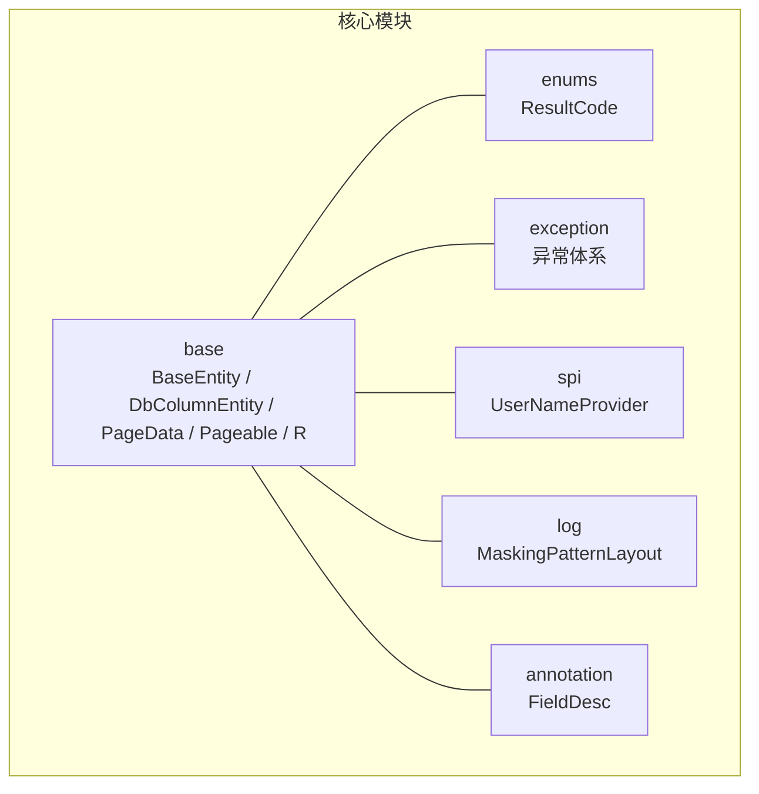
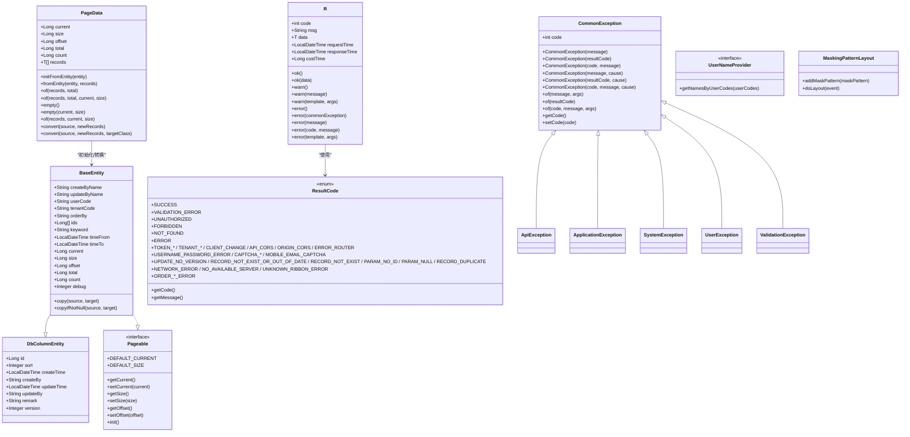
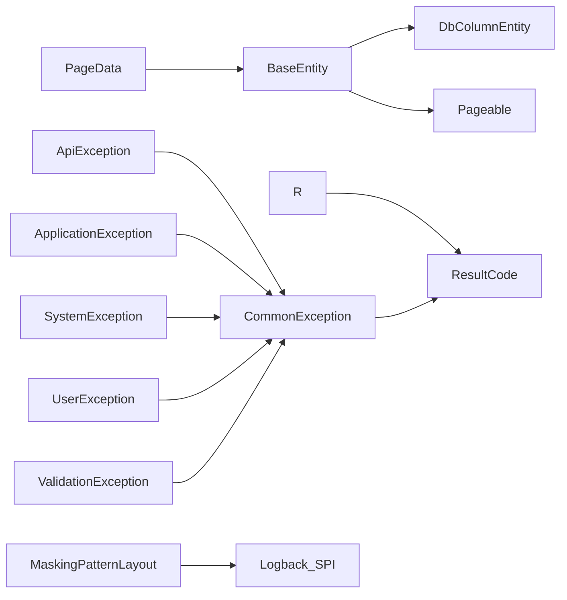

# 核心API参考

<cite>
**本文引用的文件**
- [BaseEntity.java](file://sh-core/src/main/java/com/wkclz/core/base/BaseEntity.java)
- [DbColumnEntity.java](file://sh-core/src/main/java/com/wkclz/core/base/DbColumnEntity.java)
- [PageData.java](file://sh-core/src/main/java/com/wkclz/core/base/PageData.java)
- [Pageable.java](file://sh-core/src/main/java/com/wkclz/core/base/Pageable.java)
- [R.java](file://sh-core/src/main/java/com/wkclz/core/base/R.java)
- [ResultCode.java](file://sh-core/src/main/java/com/wkclz/core/enums/ResultCode.java)
- [CommonException.java](file://sh-core/src/main/java/com/wkclz/core/exception/CommonException.java)
- [ApiException.java](file://sh-core/src/main/java/com/wkclz/core/exception/ApiException.java)
- [ApplicationException.java](file://sh-core/src/main/java/com/wkclz/core/exception/ApplicationException.java)
- [SystemException.java](file://sh-core/src/main/java/com/wkclz/core/exception/SystemException.java)
- [UserException.java](file://sh-core/src/main/java/com/wkclz/core/exception/UserException.java)
- [ValidationException.java](file://sh-core/src/main/java/com/wkclz/core/exception/ValidationException.java)
- [UserNameProvider.java](file://sh-core/src/main/java/com/wkclz/core/spi/UserNameProvider.java)
- [MaskingPatternLayout.java](file://sh-core/src/main/java/com/wkclz/core/log/MaskingPatternLayout.java)
- [FieldDesc.java](file://sh-core/src/main/java/com/wkclz/core/annotation/FieldDesc.java)
</cite>

## 目录
1. [简介](#简介)
2. [项目结构](#项目结构)
3. [核心组件](#核心组件)
4. [架构概览](#架构概览)
5. [详细组件分析](#详细组件分析)
6. [依赖分析](#依赖分析)
7. [性能考虑](#性能考虑)
8. [故障排查指南](#故障排查指南)
9. [结论](#结论)
10. [附录](#附录)

## 简介
本参考文档聚焦于 sh-framework 框架的核心API，涵盖以下主题：
- BaseEntity 实体基类的设计与使用，包括审计字段、分页参数与业务字段
- PageData 分页数据封装类的 API 规范与使用场景
- R<T> 统一响应封装的设计理念与使用方法
- ResultCode 枚举的错误码定义与业务含义
- 异常体系的完整 API 说明（含构造方法与使用场景）
- SPI 扩展接口 UserNameProvider 的设计与实现要求
- 日志脱敏配置的 API 说明与使用示例

## 项目结构
本节聚焦核心模块中的关键文件及其职责划分：
- base 包：实体基类、分页与统一响应封装
- enums 包：统一结果码枚举
- exception 包：异常体系
- spi 包：可插拔扩展接口
- log 包：日志脱敏布局
- annotation 包：字段描述注解

**章节来源**
- [BaseEntity.java:1-94](file://sh-core/src/main/java/com/wkclz/core/base/BaseEntity.java#L1-L94)
- [DbColumnEntity.java:1-39](file://sh-core/src/main/java/com/wkclz/core/base/DbColumnEntity.java#L1-L39)
- [PageData.java:1-185](file://sh-core/src/main/java/com/wkclz/core/base/PageData.java#L1-L185)
- [Pageable.java:1-93](file://sh-core/src/main/java/com/wkclz/core/base/Pageable.java#L1-L93)
- [R.java:1-76](file://sh-core/src/main/java/com/wkclz/core/base/R.java#L1-L76)
- [ResultCode.java:1-77](file://sh-core/src/main/java/com/wkclz/core/enums/ResultCode.java#L1-L77)
- [CommonException.java:1-64](file://sh-core/src/main/java/com/wkclz/core/exception/CommonException.java#L1-L64)
- [UserNameProvider.java:1-13](file://sh-core/src/main/java/com/wkclz/core/spi/UserNameProvider.java#L1-L13)
- [MaskingPatternLayout.java:1-45](file://sh-core/src/main/java/com/wkclz/core/log/MaskingPatternLayout.java#L1-L45)
- [FieldDesc.java:1-27](file://sh-core/src/main/java/com/wkclz/core/annotation/FieldDesc.java#L1-L27)

## 核心组件
- BaseEntity：继承数据库规范字段基类，并实现分页接口；提供复制工具方法与常用查询/分页辅助字段
- DbColumnEntity：数据库规范字段基类（id、sort、createTime、createBy、updateTime、updateBy、remark、version）
- PageData：泛型分页容器，支持从实体初始化、快速构建、空分页、类型转换等
- Pageable：分页参数接口，定义默认页码与大小、获取/设置方法及初始化逻辑
- R<T>：统一响应封装，包含 code、msg、data、requestTime、responseTime、costTime
- ResultCode：统一结果码枚举，覆盖通用HTTP语义与业务特定错误码
- 异常体系：CommonException 为基类，派生出 ApiException、ApplicationException、SystemException、UserException、ValidationException
- UserNameProvider：SPI 扩展接口，默认提供批量用户编码到用户名映射能力
- MaskingPatternLayout：基于 Logback 的脱敏布局，支持正则模式匹配与掩码

**章节来源**
- [BaseEntity.java:11-94](file://sh-core/src/main/java/com/wkclz/core/base/BaseEntity.java#L11-L94)
- [DbColumnEntity.java:9-39](file://sh-core/src/main/java/com/wkclz/core/base/DbColumnEntity.java#L9-L39)
- [PageData.java:8-185](file://sh-core/src/main/java/com/wkclz/core/base/PageData.java#L8-L185)
- [Pageable.java:12-93](file://sh-core/src/main/java/com/wkclz/core/base/Pageable.java#L12-L93)
- [R.java:11-76](file://sh-core/src/main/java/com/wkclz/core/base/R.java#L11-L76)
- [ResultCode.java:7-77](file://sh-core/src/main/java/com/wkclz/core/enums/ResultCode.java#L7-L77)
- [CommonException.java:10-64](file://sh-core/src/main/java/com/wkclz/core/exception/CommonException.java#L10-L64)
- [UserNameProvider.java:7-13](file://sh-core/src/main/java/com/wkclz/core/spi/UserNameProvider.java#L7-L13)
- [MaskingPatternLayout.java:12-45](file://sh-core/src/main/java/com/wkclz/core/log/MaskingPatternLayout.java#L12-L45)

## 架构概览
下图展示核心组件之间的关系与交互：

**图表来源**
- [BaseEntity.java:11-94](file://sh-core/src/main/java/com/wkclz/core/base/BaseEntity.java#L11-L94)
- [DbColumnEntity.java:9-39](file://sh-core/src/main/java/com/wkclz/core/base/DbColumnEntity.java#L9-L39)
- [PageData.java:8-185](file://sh-core/src/main/java/com/wkclz/core/base/PageData.java#L8-L185)
- [Pageable.java:12-93](file://sh-core/src/main/java/com/wkclz/core/base/Pageable.java#L12-L93)
- [R.java:11-76](file://sh-core/src/main/java/com/wkclz/core/base/R.java#L11-L76)
- [ResultCode.java:7-77](file://sh-core/src/main/java/com/wkclz/core/enums/ResultCode.java#L7-L77)
- [CommonException.java:10-64](file://sh-core/src/main/java/com/wkclz/core/exception/CommonException.java#L10-L64)
- [ApiException.java:10-48](file://sh-core/src/main/java/com/wkclz/core/exception/ApiException.java#L10-L48)
- [ApplicationException.java:10-48](file://sh-core/src/main/java/com/wkclz/core/exception/ApplicationException.java#L10-L48)
- [SystemException.java:10-48](file://sh-core/src/main/java/com/wkclz/core/exception/SystemException.java#L10-L48)
- [UserException.java:10-48](file://sh-core/src/main/java/com/wkclz/core/exception/UserException.java#L10-L48)
- [ValidationException.java:10-48](file://sh-core/src/main/java/com/wkclz/core/exception/ValidationException.java#L10-L48)
- [UserNameProvider.java:7-13](file://sh-core/src/main/java/com/wkclz/core/spi/UserNameProvider.java#L7-L13)
- [MaskingPatternLayout.java:12-45](file://sh-core/src/main/java/com/wkclz/core/log/MaskingPatternLayout.java#L12-L45)

## 详细组件分析

### BaseEntity 实体基类
- 设计要点
  - 继承数据库规范字段基类，复用 id、sort、createTime、createBy、updateTime、updateBy、remark、version
  - 实现分页接口，提供 current、size、offset、total、count 等分页参数
  - 提供查询辅助字段：orderBy、ids、keyword、timeFrom、timeTo
  - 提供审计相关字段：createByName、updateByName、userCode、tenantCode
  - 提供调试字段：debug
  - 提供静态工具方法：copy、copyIfNotNull，支持空 target 自动实例化与属性拷贝
- 使用建议
  - 在业务实体中直接继承 BaseEntity，即可获得统一的分页与审计能力
  - 使用 copy/copyIfNotNull 进行实体间属性拷贝，避免手动赋值
  - 通过 init() 对分页参数进行校验与默认值设置

**章节来源**
- [BaseEntity.java:11-94](file://sh-core/src/main/java/com/wkclz/core/base/BaseEntity.java#L11-L94)
- [DbColumnEntity.java:9-39](file://sh-core/src/main/java/com/wkclz/core/base/DbColumnEntity.java#L9-L39)
- [Pageable.java:77-93](file://sh-core/src/main/java/com/wkclz/core/base/Pageable.java#L77-L93)

### PageData 分页数据封装类
- 设计要点
  - 泛型容器，承载分页信息与数据列表
  - 支持从 BaseEntity 初始化分页信息
  - 提供多种 of/empty 工厂方法，便于快速构建
  - 提供 convert 转换方法，支持类型检查与无类型检查两种
- API 一览
  - initFromEntity(entity)：从实体复制 current、size、offset、total、count
  - fromEntity(entity, records)：从实体与数据列表构建 PageData
  - of(records, total) / of(records, total, current, size)：快速构建分页对象
  - empty() / empty(current, size)：创建空分页对象
  - of(records, current, size)：自动计算 total
  - convert(source, newRecords) / convert(source, newRecords, targetClass)：类型转换与校验
- 使用场景
  - 查询接口返回统一分页结构
  - 与 MyBatis/分页插件配合，将查询结果与总数封装为 PageData

**章节来源**
- [PageData.java:8-185](file://sh-core/src/main/java/com/wkclz/core/base/PageData.java#L8-L185)

### R<T> 统一响应封装
- 设计理念
  - 统一对外响应结构，包含业务码、消息、数据以及请求/响应时间与耗时
  - 通过 ResultCode 提供标准化业务码
- API 一览
  - 构造：R()、R(ResultCode, data)、R(code, msg, data)
  - 成功：ok()、ok(data)
  - 警告：warn()、warn(message)、warn(template, args)
  - 错误：error()、error(commonException)、error(message)、error(code, message)、error(template, args)
- 使用建议
  - 接口层统一返回 R<T>，便于前端与网关侧统一处理
  - 警告与错误分别使用 warn/error，结合 ResultCode 或自定义 code/msg

**章节来源**
- [R.java:11-76](file://sh-core/src/main/java/com/wkclz/core/base/R.java#L11-L76)
- [ResultCode.java:7-77](file://sh-core/src/main/java/com/wkclz/core/enums/ResultCode.java#L7-L77)

### ResultCode 枚举
- 覆盖范围
  - 通用 HTTP 语义：SUCCESS、VALIDATION_ERROR、UNAUTHORIZED、FORBIDDEN、NOT_FOUND、ERROR
  - 令牌与登录：TOKEN_*、LOGIN_TIMEOUT、LOGIN_FORCE_TIMEOUT
  - 应用与租户：APP_CODE_NULL、TENANT_NULL
  - CORS 与路由：CLIENT_CHANGE、API_CORS、ORIGIN_CORS、ERROR_ROUTER
  - 登录与验证码：USERNAME_PASSWORD_ERROR、CAPTCHA_*、MOBILE_EMAIL_CAPTCHA
  - 数据一致性：UPDATE_NO_VERSION、RECORD_NOT_EXIST_OR_OUT_OF_DATE、RECORD_NOT_EXIST、PARAM_NO_ID、PARAM_NULL、RECORD_DUPLICATE
  - 网络与服务：NETWORK_ERROR、NO_AVAILABLE_SERVER、UNKNOWN_RIBBON_ERROR
  - 订单相关：ORDER_*_ERROR
- 使用建议
  - 优先使用枚举值，确保前后端一致
  - 自定义错误码时，遵循命名规范与业务领域划分

**章节来源**
- [ResultCode.java:7-77](file://sh-core/src/main/java/com/wkclz/core/enums/ResultCode.java#L7-L77)

### 异常体系
- 层级关系
  - CommonException：所有业务异常的基类，提供 code、message、Throwable 构造与 of 工厂方法
  - ApiException、ApplicationException、SystemException、UserException、ValidationException：按异常类型细分
- 构造与工厂
  - 支持多种构造方式：message、ResultCode、(code, message)、带 cause 的变体
  - 提供 of(...) 工厂方法，支持字符串模板
- 使用场景
  - 参数校验失败：ValidationException
  - 用户操作异常：UserException
  - 应用业务异常：ApplicationException
  - API 调用异常：ApiException
  - 系统级异常：SystemException
  - 其他通用异常：CommonException

**章节来源**
- [CommonException.java:10-64](file://sh-core/src/main/java/com/wkclz/core/exception/CommonException.java#L10-L64)
- [ApiException.java:10-48](file://sh-core/src/main/java/com/wkclz/core/exception/ApiException.java#L10-L48)
- [ApplicationException.java:10-48](file://sh-core/src/main/java/com/wkclz/core/exception/ApplicationException.java#L10-L48)
- [SystemException.java:10-48](file://sh-core/src/main/java/com/wkclz/core/exception/SystemException.java#L10-L48)
- [UserException.java:10-48](file://sh-core/src/main/java/com/wkclz/core/exception/UserException.java#L10-L48)
- [ValidationException.java:10-48](file://sh-core/src/main/java/com/wkclz/core/exception/ValidationException.java#L10-L48)

### SPI 扩展接口 UserNameProvider
- 设计目标
  - 提供用户编码到用户名的批量映射能力，便于在日志、审计、响应体等场景自动填充
- API 说明
  - getNamesByUserCodes(Set<String>)：默认返回空映射，可由实现类覆盖
- 实现建议
  - 结合用户中心或缓存实现高性能批量查询
  - 注意幂等与缓存命中策略

**章节来源**
- [UserNameProvider.java:7-13](file://sh-core/src/main/java/com/wkclz/core/spi/UserNameProvider.java#L7-L13)

### 日志脱敏配置 MaskingPatternLayout
- 设计目标
  - 基于 Logback 的 PatternLayout 扩展，支持正则匹配敏感信息并进行掩码
- API 说明
  - addMaskPattern(maskPattern)：添加脱敏正则模式
  - doLayout(event)：输出前对日志消息执行掩码处理
- 使用建议
  - 在 logback 配置中注册该 Layout
  - 合理配置多个脱敏模式，覆盖手机号、身份证、银行卡号等敏感字段
  - 注意正则性能与匹配准确性

**章节来源**
- [MaskingPatternLayout.java:12-45](file://sh-core/src/main/java/com/wkclz/core/log/MaskingPatternLayout.java#L12-L45)

## 依赖分析
- 组件耦合
  - BaseEntity 依赖 DbColumnEntity 与 Pageable，提供复制工具方法
  - PageData 依赖 BaseEntity 以初始化分页参数
  - R<T> 依赖 ResultCode 与工具类进行字符串格式化
  - 异常体系统一继承 CommonException，便于集中处理
  - UserNameProvider 为可选 SPI，不引入强耦合
  - MaskingPatternLayout 仅依赖 Logback SPI 与正则表达式
- 外部依赖
  - Lombok 注解简化 getter/setter/toString
  - 工具类 StringFormat、BeanUtil（来自 tool 模块）

**图表来源**
- [BaseEntity.java:11-94](file://sh-core/src/main/java/com/wkclz/core/base/BaseEntity.java#L11-L94)
- [PageData.java:8-185](file://sh-core/src/main/java/com/wkclz/core/base/PageData.java#L8-L185)
- [R.java:11-76](file://sh-core/src/main/java/com/wkclz/core/base/R.java#L11-L76)
- [ResultCode.java:7-77](file://sh-core/src/main/java/com/wkclz/core/enums/ResultCode.java#L7-L77)
- [CommonException.java:10-64](file://sh-core/src/main/java/com/wkclz/core/exception/CommonException.java#L10-L64)
- [ApiException.java:10-48](file://sh-core/src/main/java/com/wkclz/core/exception/ApiException.java#L10-L48)
- [ApplicationException.java:10-48](file://sh-core/src/main/java/com/wkclz/core/exception/ApplicationException.java#L10-L48)
- [SystemException.java:10-48](file://sh-core/src/main/java/com/wkclz/core/exception/SystemException.java#L10-L48)
- [UserException.java:10-48](file://sh-core/src/main/java/com/wkclz/core/exception/UserException.java#L10-L48)
- [ValidationException.java:10-48](file://sh-core/src/main/java/com/wkclz/core/exception/ValidationException.java#L10-L48)
- [MaskingPatternLayout.java:12-45](file://sh-core/src/main/java/com/wkclz/core/log/MaskingPatternLayout.java#L12-L45)

## 性能考虑
- BaseEntity.copy/copyIfNotNull
  - 使用反射/工具类进行属性拷贝，注意在大批量对象拷贝时的性能开销
  - 建议在高频路径上谨慎使用，必要时采用 DTO 映射方案
- PageData.convert
  - 类型检查会遍历列表，大数据量时建议在上层控制 records 规模
- MaskingPatternLayout
  - 正则匹配可能带来 CPU 开销，建议合理配置脱敏模式数量与复杂度
- 分页参数
  - Pageable.init() 仅做简单计算，性能影响可忽略

## 故障排查指南
- 分页参数无效
  - 确认调用 Pageable.init() 或在服务层统一初始化
  - 检查 current、size 是否为 null 或小于 1
- PageData 转换异常
  - 若使用带类型检查的 convert，确保 newRecords 中元素类型与 targetClass 一致
- 统一响应未生效
  - 确认接口返回的是 R<T>，且未被全局异常处理器覆盖
- 异常未携带业务码
  - 确保抛出的异常来自 CommonException 或其子类，或使用 R.error(error)
- 日志脱敏未生效
  - 确认已在 logback 配置中注册 MaskingPatternLayout，并正确添加脱敏模式

**章节来源**
- [Pageable.java:77-93](file://sh-core/src/main/java/com/wkclz/core/base/Pageable.java#L77-L93)
- [PageData.java:173-183](file://sh-core/src/main/java/com/wkclz/core/base/PageData.java#L173-L183)
- [R.java:37-76](file://sh-core/src/main/java/com/wkclz/core/base/R.java#L37-L76)
- [CommonException.java:10-64](file://sh-core/src/main/java/com/wkclz/core/exception/CommonException.java#L10-L64)
- [MaskingPatternLayout.java:17-43](file://sh-core/src/main/java/com/wkclz/core/log/MaskingPatternLayout.java#L17-L43)

## 结论
本参考文档系统梳理了 sh-framework 的核心API，包括实体基类、分页封装、统一响应、错误码、异常体系、SPI 扩展与日志脱敏。建议在实际开发中：
- 统一使用 BaseEntity 与 PageData，保证分页与审计的一致性
- 使用 R<T> 与 ResultCode 提升接口一致性与可观测性
- 严格区分异常类型，确保错误信息与业务码准确传递
- 通过 UserNameProvider 与 MaskingPatternLayout 提升用户体验与数据安全

## 附录
- 字段描述注解 FieldDesc
  - 用于标注字段含义与非空约束，便于文档生成与校验
  - 支持 value 与 notNull 属性

**章节来源**
- [FieldDesc.java:18-27](file://sh-core/src/main/java/com/wkclz/core/annotation/FieldDesc.java#L18-L27)