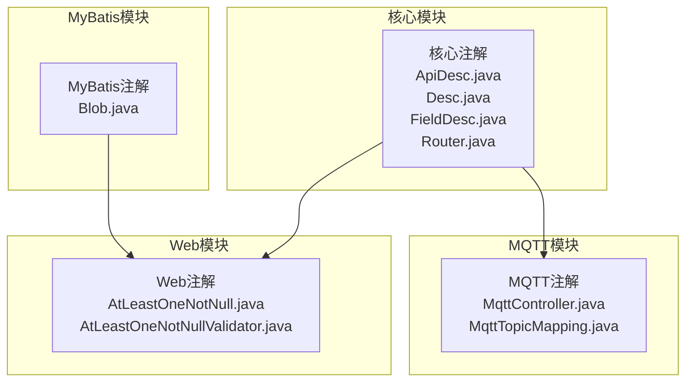
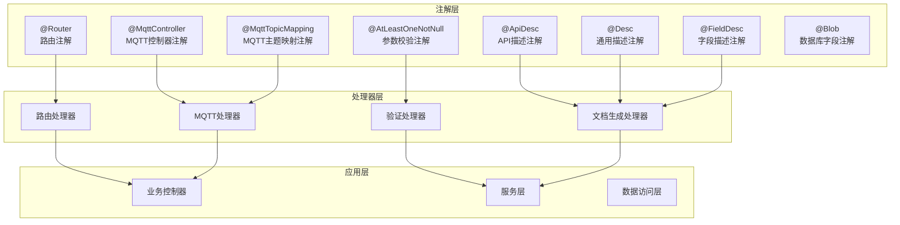
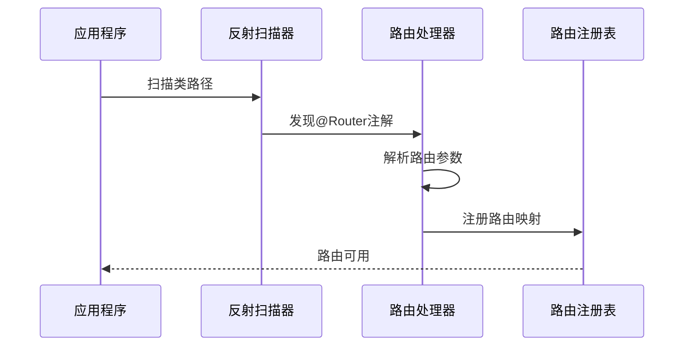
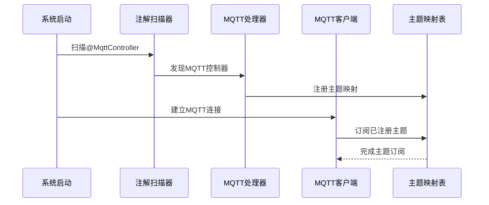
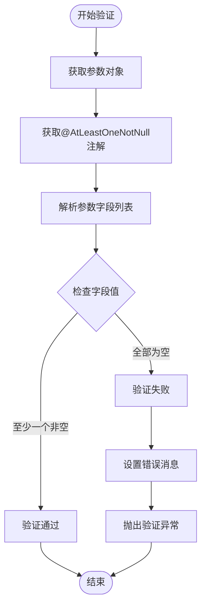
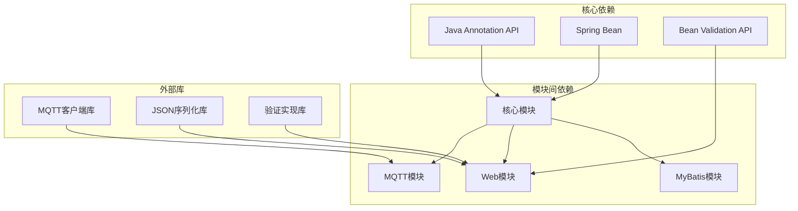

# 注解API参考

<cite>
**本文档引用的文件**
- [ApiDesc.java](file://sh-core/src/main/java/com/wkclz/core/annotation/ApiDesc.java)
- [Desc.java](file://sh-core/src/main/java/com/wkclz/core/annotation/Desc.java)
- [FieldDesc.java](file://sh-core/src/main/java/com/wkclz/core/annotation/FieldDesc.java)
- [Router.java](file://sh-core/src/main/java/com/wkclz/core/annotation/Router.java)
- [MqttController.java](file://sh-mqtt/src/main/java/com/wkclz/mqtt/annotation/MqttController.java)
- [MqttTopicMapping.java](file://sh-mqtt/src/main/java/com/wkclz/mqtt/annotation/MqttTopicMapping.java)
- [Blob.java](file://sh-mybatis/src/main/java/com/wkclz/mybatis/annotation/Blob.java)
- [AtLeastOneNotNull.java](file://sh-web/src/main/java/com/wkclz/web/annotation/AtLeastOneNotNull.java)
- [AtLeastOneNotNullValidator.java](file://sh-web/src/main/java/com/wkclz/web/annotation/validator/AtLeastOneNotNullValidator.java)
</cite>

## 目录
1. [简介](#简介)
2. [项目结构](#项目结构)
3. [核心注解组件](#核心注解组件)
4. [架构概览](#架构概览)
5. [详细组件分析](#详细组件分析)
6. [依赖关系分析](#依赖关系分析)
7. [性能考虑](#性能考虑)
8. [故障排除指南](#故障排除指南)
9. [结论](#结论)

## 简介
本文件为sh-framework框架的注解系统提供详细的API参考文档。内容涵盖所有自定义注解的定义、参数、作用域、使用方法以及注解处理器的工作原理。重点包括：
- 路由注解：@Router
- MQTT消息控制器注解：@MqttController、@MqttTopicMapping
- API描述注解：@ApiDesc、@Desc、@FieldDesc
- 参数校验注解：@AtLeastOneNotNull（及其验证器）
- 数据库字段注解：@Blob

文档旨在帮助开发者快速理解各注解的功能特性，并提供最佳实践指导。

## 项目结构
注解分布在多个模块中，按功能领域划分：
- 核心注解：位于sh-core模块，提供基础的API描述和路由注解
- MQTT注解：位于sh-mqtt模块，支持基于注解的消息发布订阅
- MyBatis注解：位于sh-mybatis模块，增强数据库字段映射能力
- Web注解：位于sh-web模块，提供参数校验等Web相关注解



**图表来源**
- [ApiDesc.java:1-50](file://sh-core/src/main/java/com/wkclz/core/annotation/ApiDesc.java#L1-L50)
- [MqttController.java:1-30](file://sh-mqtt/src/main/java/com/wkclz/mqtt/annotation/MqttController.java#L1-L30)
- [Blob.java:1-30](file://sh-mybatis/src/main/java/com/wkclz/mybatis/annotation/Blob.java#L1-L30)
- [AtLeastOneNotNull.java:1-40](file://sh-web/src/main/java/com/wkclz/web/annotation/AtLeastOneNotNull.java#L1-L40)

## 核心注解组件

### 路由注解 - @Router
@Router是核心路由注解，用于标识类级别的路由信息。

**作用域与目标元素**
- 作用域：类级别
- 目标元素：TYPE
- 生命周期：RUNTIME

**参数定义**
- value：String类型，必填参数，指定路由路径
- method：HttpMethod数组，可选参数，默认值为所有HTTP方法
- description：String类型，可选参数，用于路由描述

**使用示例**
```java
// 基础用法
@Router("/users")
public class UserRoute {
    // 处理用户相关路由
}

// 指定HTTP方法
@Router(value = "/admin", method = {GET, POST})
public class AdminRoute {
    // 管理员专用路由
}
```

**最佳实践**
- 路由路径应遵循RESTful设计原则
- 合理使用method参数限制HTTP方法
- 在大型项目中建议按功能模块组织路由类

### API描述注解族

#### @ApiDesc - API描述注解
用于为API端点提供详细描述信息。

**作用域与目标元素**
- 作用域：类或方法级别
- 目标元素：TYPE, METHOD
- 生命周期：RUNTIME

**参数定义**
- value：String类型，必填参数，API的主要描述
- tags：String数组，可选参数，用于分类标记
- summary：String类型，可选参数，简短摘要

**使用示例**
```java
@ApiDesc(
    value = "用户管理API",
    tags = {"用户", "管理"},
    summary = "提供用户增删改查功能"
)
@RestController
public class UserController {
    // 控制器实现
}
```

#### @Desc - 通用描述注解
提供通用的描述信息，适用于各种元素。

**作用域与目标元素**
- 作用域：类或方法级别
- 目标元素：TYPE, METHOD
- 生命周期：RUNTIME

**参数定义**
- value：String类型，必填参数，描述文本

**使用示例**
```java
@Desc("用户实体描述")
@Entity
public class User {
    // 实体定义
}
```

#### @FieldDesc - 字段描述注解
专门用于描述实体字段的含义和约束。

**作用域与目标元素**
- 作用域：字段级别
- 目标元素：FIELD
- 生命周期：RUNTIME

**参数定义**
- value：String类型，必填参数，字段描述
- required：boolean类型，可选参数，是否必填
- example：String类型，可选参数，示例值

**使用示例**
```java
public class User {
    @FieldDesc(
        value = "用户唯一标识",
        required = true,
        example = "1001"
    )
    private Long id;
    
    @FieldDesc(
        value = "用户姓名",
        required = true,
        example = "张三"
    )
    private String name;
}
```

### MQTT消息控制器注解

#### @MqttController - MQTT控制器注解
标识一个类为MQTT消息控制器，负责处理MQTT主题消息。

**作用域与目标元素**
- 作用域：类级别
- 目标元素：TYPE
- 生命周期：RUNTIME

**参数定义**
- value：String类型，必填参数，控制器标识符
- qos：int类型，可选参数，消息质量等级，默认0

**使用示例**
```java
@MqttController("device-status")
public class DeviceStatusController {
    
    @MqttTopicMapping("sensor/data")
    public void handleSensorData(String message) {
        // 处理传感器数据
    }
}
```

#### @MqttTopicMapping - MQTT主题映射注解
将方法映射到特定的MQTT主题，实现消息监听。

**作用域与目标元素**
- 作用域：方法级别
- 目标元素：METHOD
- 生命周期：RUNTIME

**参数定义**
- value：String类型，必填参数，MQTT主题名称
- qos：int类型，可选参数，消息质量等级，默认0

**使用示例**
```java
@MqttController("weather-station")
public class WeatherController {
    
    @MqttTopicMapping(value = "temperature", qos = 1)
    public void handleTemperature(String temperature) {
        // 处理温度数据
    }
    
    @MqttTopicMapping("humidity")
    public void handleHumidity(String humidity) {
        // 处理湿度数据
    }
}
```

### 参数校验注解 - @AtLeastOneNotNull

#### @AtLeastOneNotNull - 至少一个参数不为空校验注解
确保在指定的参数组中至少有一个参数不为空。

**作用域与目标元素**
- 作用域：类级别
- 目标元素：TYPE
- 生命周期：RUNTIME

**参数定义**
- value：String数组，必填参数，参数名称数组
- message：String类型，可选参数，验证失败时的错误消息

**使用示例**
```java
@AtLeastOneNotNull(
    value = {"phone", "email", "userId"},
    message = "手机号、邮箱或用户ID必须至少填写一项"
)
public class ContactInfo {
    private String phone;
    private String email;
    private String userId;
}
```

**最佳实践**
- 合理选择参数组，避免过于复杂的组合
- 提供清晰的错误消息，便于前端处理
- 结合其他验证注解使用，形成完整的验证策略

### 数据库字段注解 - @Blob

#### @Blob - 二进制大对象注解
用于标识数据库字段为BLOB类型，支持大数据存储。

**作用域与目标元素**
- 作用域：字段级别
- 目标元素：FIELD
- 生命周期：RUNTIME

**参数定义**
- value：String类型，可选参数，字段别名
- length：int类型，可选参数，最大长度限制

**使用示例**
```java
public class Document {
    @Blob("content")
    private byte[] content;
    
    @Blob(length = 10485760) // 10MB限制
    private byte[] attachment;
}
```

## 架构概览



**图表来源**
- [Router.java:1-20](file://sh-core/src/main/java/com/wkclz/core/annotation/Router.java#L1-L20)
- [MqttController.java:1-20](file://sh-mqtt/src/main/java/com/wkclz/mqtt/annotation/MqttController.java#L1-L20)
- [AtLeastOneNotNull.java:1-25](file://sh-web/src/main/java/com/wkclz/web/annotation/AtLeastOneNotNull.java#L1-L25)
- [ApiDesc.java:1-20](file://sh-core/src/main/java/com/wkclz/core/annotation/ApiDesc.java#L1-L20)

## 详细组件分析

### 注解处理器工作原理

#### 路由注解处理器
路由注解处理器通过反射机制扫描@Router注解，提取路由信息并注册到路由表中。



**图表来源**
- [Router.java:1-20](file://sh-core/src/main/java/com/wkclz/core/annotation/Router.java#L1-L20)

#### MQTT注解处理器
MQTT注解处理器负责建立主题与方法的映射关系，实现消息的自动分发。



**图表来源**
- [MqttController.java:1-20](file://sh-mqtt/src/main/java/com/wkclz/mqtt/annotation/MqttController.java#L1-L20)
- [MqttTopicMapping.java:1-20](file://sh-mqtt/src/main/java/com/wkclz/mqtt/annotation/MqttTopicMapping.java#L1-L20)

#### 参数校验处理器
参数校验处理器结合Bean Validation API实现复杂参数组合的验证。



**图表来源**
- [AtLeastOneNotNull.java:1-25](file://sh-web/src/main/java/com/wkclz/web/annotation/AtLeastOneNotNull.java#L1-L25)
- [AtLeastOneNotNullValidator.java:1-50](file://sh-web/src/main/java/com/wkclz/web/annotation/validator/AtLeastOneNotNullValidator.java#L1-L50)

### 注解组合使用规则

#### 路由与描述注解组合
```java
@Router("/api/v1/users")
@ApiDesc(
    value = "用户管理接口",
    tags = ["用户", "API v1"],
    summary = "提供用户CRUD操作"
)
@RestController
public class UserApiController {
    
    @GetMapping
    @ApiDesc("获取用户列表")
    public List<User> getUsers() {
        return userService.getAllUsers();
    }
}
```

#### MQTT控制器与主题映射组合
```java
@MqttController("device-control")
public class DeviceController {
    
    @MqttTopicMapping("device/status")
    @ApiDesc("设备状态更新")
    public void updateDeviceStatus(String status) {
        deviceService.updateStatus(status);
    }
    
    @MqttTopicMapping(value = "device/command", qos = 1)
    @ApiDesc("设备命令接收")
    public void receiveCommand(String command) {
        deviceService.executeCommand(command);
    }
}
```

#### 参数校验与描述注解组合
```java
@AtLeastOneNotNull(
    value = ["phone", "email", "userId"],
    message = "请至少提供一种联系方式"
)
@ApiDesc("联系信息")
public class ContactForm {
    
    @FieldDesc("手机号码")
    private String phone;
    
    @FieldDesc("电子邮箱")
    private String email;
    
    @FieldDesc("用户ID")
    private String userId;
}
```

## 依赖关系分析



**图表来源**
- [Router.java:1-20](file://sh-core/src/main/java/com/wkclz/core/annotation/Router.java#L1-L20)
- [AtLeastOneNotNull.java:1-25](file://sh-web/src/main/java/com/wkclz/web/annotation/AtLeastOneNotNull.java#L1-L25)
- [MqttController.java:1-20](file://sh-mqtt/src/main/java/com/wkclz/mqtt/annotation/MqttController.java#L1-L20)

**章节来源**
- [ApiDesc.java:1-50](file://sh-core/src/main/java/com/wkclz/core/annotation/ApiDesc.java#L1-L50)
- [Router.java:1-20](file://sh-core/src/main/java/com/wkclz/core/annotation/Router.java#L1-L20)
- [MqttController.java:1-20](file://sh-mqtt/src/main/java/com/wkclz/mqtt/annotation/MqttController.java#L1-L20)
- [MqttTopicMapping.java:1-20](file://sh-mqtt/src/main/java/com/wkclz/mqtt/annotation/MqttTopicMapping.java#L1-L20)
- [AtLeastOneNotNull.java:1-40](file://sh-web/src/main/java/com/wkclz/web/annotation/AtLeastOneNotNull.java#L1-L40)
- [AtLeastOneNotNullValidator.java:1-50](file://sh-web/src/main/java/com/wkclz/web/annotation/validator/AtLeastOneNotNullValidator.java#L1-L50)

## 性能考虑
- 注解扫描性能：建议在应用启动时进行一次性扫描，避免运行时重复扫描
- 缓存机制：对频繁访问的注解信息建立缓存，减少反射开销
- 内存占用：合理控制注解元数据的存储，避免内存泄漏
- 并发安全：确保注解处理器的线程安全性，特别是在多线程环境下

## 故障排除指南

### 常见问题及解决方案

#### 注解未生效
**症状**：注解标记的类或方法没有按预期工作
**可能原因**：
- 注解缺少必要的参数
- 作用域不匹配
- 处理器未正确配置

**解决步骤**：
1. 检查注解的必要参数是否完整
2. 验证注解的作用域是否正确
3. 确认对应的处理器已启用

#### 参数校验失败
**症状**：@AtLeastOneNotNull注解总是返回验证失败
**可能原因**：
- 参数名称不匹配
- 对象属性访问权限问题
- 验证器配置错误

**解决步骤**：
1. 确认参数名称与对象属性一致
2. 检查属性的getter/setter方法
3. 验证验证器的配置

#### MQTT消息处理异常
**症状**：MQTT消息无法正确分发到对应的方法
**可能原因**：
- 主题名称不匹配
- 方法签名不正确
- 订阅配置错误

**解决步骤**：
1. 检查主题名称的一致性
2. 验证方法签名与消息格式
3. 确认订阅配置的正确性

**章节来源**
- [AtLeastOneNotNullValidator.java:1-50](file://sh-web/src/main/java/com/wkclz/web/annotation/validator/AtLeastOneNotNullValidator.java#L1-L50)

## 结论
sh-framework的注解系统提供了完整的元数据描述和自动化处理能力。通过合理的注解组合使用，可以显著提高开发效率和代码可维护性。建议在实际项目中：

1. 建立统一的注解使用规范
2. 充分利用注解的组合能力
3. 结合文档生成工具提升API文档质量
4. 注意注解处理器的性能优化
5. 建立完善的测试覆盖确保注解行为正确

通过遵循本文档的最佳实践，开发者可以充分利用sh-framework的注解系统，构建高质量的企业级应用。