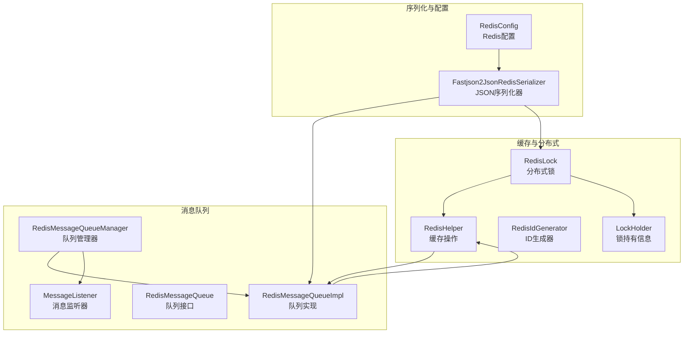
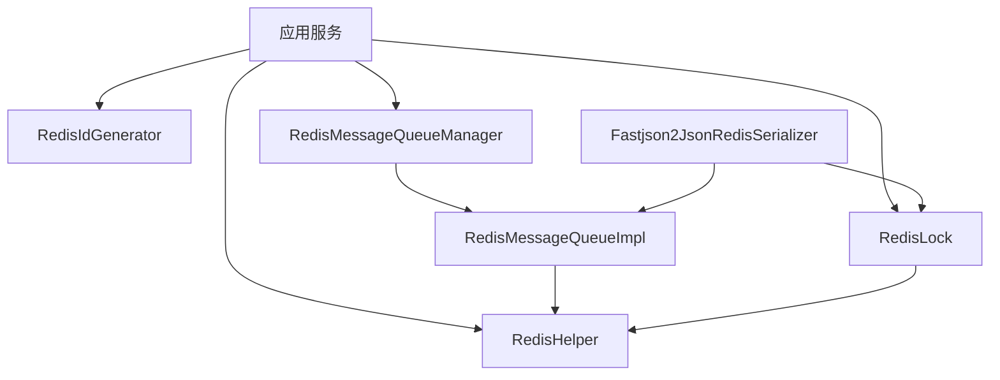
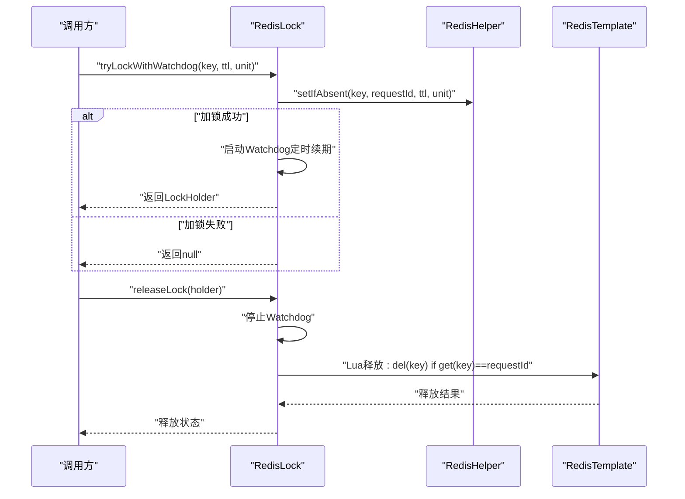
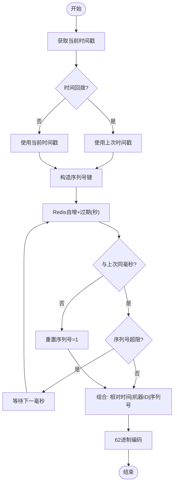
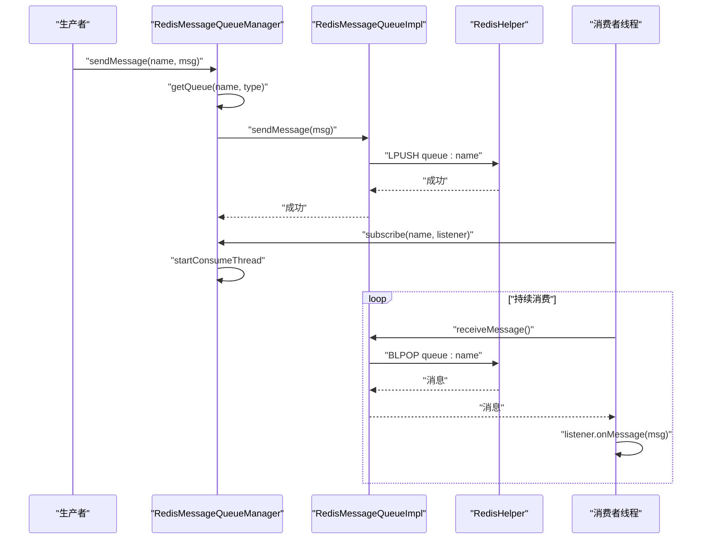
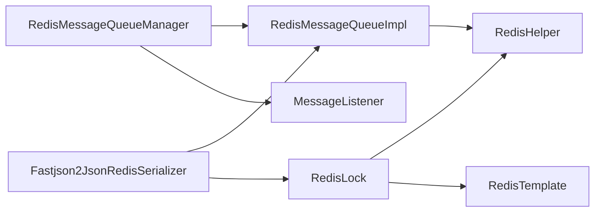

# 缓存与消息API参考

<cite>
**本文引用的文件**
- [RedisHelper.java](file://sh-redis/src/main/java/com/wkclz/redis/helper/RedisHelper.java)
- [RedisLock.java](file://sh-redis/src/main/java/com/wkclz/redis/helper/RedisLock.java)
- [RedisIdGenerator.java](file://sh-redis/src/main/java/com/wkclz/redis/helper/RedisIdGenerator.java)
- [LockHolder.java](file://sh-redis/src/main/java/com/wkclz/redis/helper/LockHolder.java)
- [RedisMessageQueue.java](file://sh-redis/src/main/java/com/wkclz/redis/queue/RedisMessageQueue.java)
- [RedisMessageQueueImpl.java](file://sh-redis/src/main/java/com/wkclz/redis/queue/RedisMessageQueueImpl.java)
- [MessageListener.java](file://sh-redis/src/main/java/com/wkclz/redis/queue/MessageListener.java)
- [RedisMessageQueueManager.java](file://sh-redis/src/main/java/com/wkclz/redis/queue/RedisMessageQueueManager.java)
- [Fastjson2JsonRedisSerializer.java](file://sh-redis/src/main/java/com/wkclz/redis/serializer/Fastjson2JsonRedisSerializer.java)
- [RedisConfig.java](file://sh-redis/src/main/java/com/wkclz/redis/config/RedisConfig.java)
</cite>

## 目录
1. [简介](#简介)
2. [项目结构](#项目结构)
3. [核心组件](#核心组件)
4. [架构总览](#架构总览)
5. [详细组件分析](#详细组件分析)
6. [依赖关系分析](#依赖关系分析)
7. [性能考虑](#性能考虑)
8. [故障排查指南](#故障排查指南)
9. [结论](#结论)
10. [附录](#附录)

## 简介
本文件为 sh-framework 框架中“缓存与消息”能力的权威参考，覆盖以下主题：
- RedisHelper 缓存操作 API：涵盖 String、Hash、List、Set、ZSet 等数据类型的完整操作方法
- Redis 分布式锁：加锁、解锁、续期（Watchdog）机制与使用 API
- Redis ID 生成器：基于时间戳 + Redis 自增序列号的高性能 ID 生成方案
- Redis 消息队列：生产者与消费者 API、管理器与监听器扩展机制
- 序列化器与配置：基于 fastjson2 的安全序列化器与 AutoType 白名单扩展
- MQTT 客户端 API：发布、订阅与连接管理（位于 sh-mqtt 模块）

## 项目结构
本模块位于 sh-redis 子模块，核心文件组织如下：
- helper：缓存与分布式能力（RedisHelper、RedisLock、RedisIdGenerator、LockHolder）
- queue：消息队列接口、实现与管理器（RedisMessageQueue、RedisMessageQueueImpl、RedisMessageQueueManager、MessageListener）
- serializer：Redis 序列化器（Fastjson2JsonRedisSerializer）
- config：Redis 配置（RedisConfig）

图表来源
- [RedisHelper.java:1-513](file://sh-redis/src/main/java/com/wkclz/redis/helper/RedisHelper.java#L1-L513)
- [RedisLock.java:1-328](file://sh-redis/src/main/java/com/wkclz/redis/helper/RedisLock.java#L1-L328)
- [RedisIdGenerator.java:1-257](file://sh-redis/src/main/java/com/wkclz/redis/helper/RedisIdGenerator.java#L1-L257)
- [LockHolder.java:1-24](file://sh-redis/src/main/java/com/wkclz/redis/helper/LockHolder.java#L1-L24)
- [RedisMessageQueue.java:1-56](file://sh-redis/src/main/java/com/wkclz/redis/queue/RedisMessageQueue.java#L1-L56)
- [RedisMessageQueueImpl.java:1-121](file://sh-redis/src/main/java/com/wkclz/redis/queue/RedisMessageQueueImpl.java#L1-L121)
- [MessageListener.java:1-24](file://sh-redis/src/main/java/com/wkclz/redis/queue/MessageListener.java#L1-L24)
- [RedisMessageQueueManager.java:1-162](file://sh-redis/src/main/java/com/wkclz/redis/queue/RedisMessageQueueManager.java#L1-L162)
- [Fastjson2JsonRedisSerializer.java:1-82](file://sh-redis/src/main/java/com/wkclz/redis/serializer/Fastjson2JsonRedisSerializer.java#L1-L82)
- [RedisConfig.java:1-41](file://sh-redis/src/main/java/com/wkclz/redis/config/RedisConfig.java#L1-L41)

章节来源
- [RedisHelper.java:1-513](file://sh-redis/src/main/java/com/wkclz/redis/helper/RedisHelper.java#L1-L513)
- [RedisLock.java:1-328](file://sh-redis/src/main/java/com/wkclz/redis/helper/RedisLock.java#L1-L328)
- [RedisIdGenerator.java:1-257](file://sh-redis/src/main/java/com/wkclz/redis/helper/RedisIdGenerator.java#L1-L257)
- [RedisMessageQueue.java:1-56](file://sh-redis/src/main/java/com/wkclz/redis/queue/RedisMessageQueue.java#L1-L56)
- [RedisMessageQueueImpl.java:1-121](file://sh-redis/src/main/java/com/wkclz/redis/queue/RedisMessageQueueImpl.java#L1-L121)
- [MessageListener.java:1-24](file://sh-redis/src/main/java/com/wkclz/redis/queue/MessageListener.java#L1-L24)
- [RedisMessageQueueManager.java:1-162](file://sh-redis/src/main/java/com/wkclz/redis/queue/RedisMessageQueueManager.java#L1-L162)
- [Fastjson2JsonRedisSerializer.java:1-82](file://sh-redis/src/main/java/com/wkclz/redis/serializer/Fastjson2JsonRedisSerializer.java#L1-L82)
- [RedisConfig.java:1-41](file://sh-redis/src/main/java/com/wkclz/redis/config/RedisConfig.java#L1-L41)

## 核心组件
- RedisHelper：提供 Redis 全数据类型缓存操作，包括对象、字符串、数字、Hash、List、Set、ZSet，以及通用的过期、存在性检查等操作
- RedisLock：基于 Redis 的分布式锁，支持 Watchdog 自动续期、原子释放、重试获取等能力
- RedisIdGenerator：高并发下基于时间戳 + Redis 自增序列号的 ID 生成器，具备时间回拨保护与本地降级
- RedisMessageQueue / RedisMessageQueueImpl：基于 List 的阻塞式消息队列，支持阻塞/非阻塞接收、计数、清空
- RedisMessageQueueManager：统一管理多个队列、订阅与消费线程池
- MessageListener：消息监听器接口，业务侧实现 onMessage 即可接入消费流程
- Fastjson2JsonRedisSerializer：基于 fastjson2 的安全序列化器，默认白名单 + 可扩展 AutoType 白名单
- RedisConfig：Redis 连接与序列化器白名单配置入口

章节来源
- [RedisHelper.java:1-513](file://sh-redis/src/main/java/com/wkclz/redis/helper/RedisHelper.java#L1-L513)
- [RedisLock.java:1-328](file://sh-redis/src/main/java/com/wkclz/redis/helper/RedisLock.java#L1-L328)
- [RedisIdGenerator.java:1-257](file://sh-redis/src/main/java/com/wkclz/redis/helper/RedisIdGenerator.java#L1-L257)
- [RedisMessageQueue.java:1-56](file://sh-redis/src/main/java/com/wkclz/redis/queue/RedisMessageQueue.java#L1-L56)
- [RedisMessageQueueImpl.java:1-121](file://sh-redis/src/main/java/com/wkclz/redis/queue/RedisMessageQueueImpl.java#L1-L121)
- [MessageListener.java:1-24](file://sh-redis/src/main/java/com/wkclz/redis/queue/MessageListener.java#L1-L24)
- [RedisMessageQueueManager.java:1-162](file://sh-redis/src/main/java/com/wkclz/redis/queue/RedisMessageQueueManager.java#L1-L162)
- [Fastjson2JsonRedisSerializer.java:1-82](file://sh-redis/src/main/java/com/wkclz/redis/serializer/Fastjson2JsonRedisSerializer.java#L1-L82)
- [RedisConfig.java:1-41](file://sh-redis/src/main/java/com/wkclz/redis/config/RedisConfig.java#L1-L41)

## 架构总览
下图展示缓存与消息模块的整体交互关系。

图表来源
- [RedisHelper.java:1-513](file://sh-redis/src/main/java/com/wkclz/redis/helper/RedisHelper.java#L1-L513)
- [RedisLock.java:1-328](file://sh-redis/src/main/java/com/wkclz/redis/helper/RedisLock.java#L1-L328)
- [RedisIdGenerator.java:1-257](file://sh-redis/src/main/java/com/wkclz/redis/helper/RedisIdGenerator.java#L1-L257)
- [RedisMessageQueueManager.java:1-162](file://sh-redis/src/main/java/com/wkclz/redis/queue/RedisMessageQueueManager.java#L1-L162)
- [RedisMessageQueueImpl.java:1-121](file://sh-redis/src/main/java/com/wkclz/redis/queue/RedisMessageQueueImpl.java#L1-L121)
- [Fastjson2JsonRedisSerializer.java:1-82](file://sh-redis/src/main/java/com/wkclz/redis/serializer/Fastjson2JsonRedisSerializer.java#L1-L82)

## 详细组件分析

### RedisHelper 缓存操作 API
- 对象存储
  - set(key, value) / set(key, value, timeout, timeUnit)
  - setIfAbsent(key, value, timeout, timeUnit)
  - get(key)
  - delete(key) / delete(Set keys)
- 字符串/数字存储
  - setString(key, value) / setString(key, value, timeout, timeUnit)
  - setNumber(key, value) / setNumber(key, value, timeout, timeUnit)
  - getString(key)
  - increment(key) / increment(key, timeout, timeUnit)
- Hash
  - hSet(key, hashKey, value)
  - hGet(key, hashKey)
  - hGetAll(key)
- List
  - lPush(key, value)
  - lPop(key) / rPop(key)
  - bLPop(key, timeout, timeUnit)
  - lLen(key)
  - lRange(key, start, end)
- Set
  - sAdd(key, values...)
  - sMembers(key)
- ZSet
  - zAdd(key, value, score)
  - zRange(key, start, end, isDesc)
- 通用
  - expire(key, timeout, unit)
  - getExpire(key, unit)
  - hasKey(key)

使用要点
- 所有方法均对异常进行捕获并记录日志，返回布尔或数值时会进行空值判断
- String 与 Object 使用不同 RedisTemplate，避免序列化差异带来的问题
- List 的阻塞弹出采用 BLPOP，适合消息队列消费场景

章节来源
- [RedisHelper.java:1-513](file://sh-redis/src/main/java/com/wkclz/redis/helper/RedisHelper.java#L1-L513)

### Redis 分布式锁
- 加锁
  - tryLock(lockKey, lockTime, timeUnit)：一次性加锁，返回 requestId 或 null
  - tryLockWithWatchdog(lockKey, lockTime, timeUnit)：加锁并启动 Watchdog 续期，返回 LockHolder
  - tryLockWithRetry(lockKey, lockTime, timeUnit, retryCount, retryDelay, retryTimeUnit)：带重试的加锁
- 解锁
  - releaseLock(lockKey, requestId)：基于 Lua 原子释放
  - releaseLock(LockHolder)：通过持有者释放
- 续期（Watchdog）
  - 内部以锁时长的 1/3 为周期定时续期，使用 Lua 原子判断与过期
  - 异常或失败时自动停止续期任务
- 请求标识
  - LockHolder 包含 lockKey 与 requestId，便于后续释放与续期管理

图表来源
- [RedisLock.java:1-328](file://sh-redis/src/main/java/com/wkclz/redis/helper/RedisLock.java#L1-L328)
- [RedisHelper.java:1-513](file://sh-redis/src/main/java/com/wkclz/redis/helper/RedisHelper.java#L1-L513)
- [LockHolder.java:1-24](file://sh-redis/src/main/java/com/wkclz/redis/helper/LockHolder.java#L1-L24)

章节来源
- [RedisLock.java:1-328](file://sh-redis/src/main/java/com/wkclz/redis/helper/RedisLock.java#L1-L328)
- [LockHolder.java:1-24](file://sh-redis/src/main/java/com/wkclz/redis/helper/LockHolder.java#L1-L24)

### Redis ID 生成器
- 设计目标
  - 基于时间戳 + Redis 自增序列号，支持每秒最多约 16384 个 ID
  - 处理时间回拨，保证 ID 不重复
  - 降级策略：Redis 不可用时使用本地自增序列号
- 关键字段
  - 基础时间（2024-01-01）、序列号位数（14 位）、机器标识位数（6 位）
  - 机器标识由 IP 掩码或安全随机数生成
- 生成流程
  - 通过 Redis 自增获取序列号并设置过期时间
  - 同一毫秒内序列号超限则等待下一毫秒
  - 组合相对时间戳、机器标识与序列号，输出 62 进制字符串
- API
  - generateIdWithType(businessType)：按业务类型生成 ID
  - generateIdWithPrefix(prefix)：带前缀的 ID 生成
  - 提供测试辅助方法（当前时间戳、基础时间、相对时间）

图表来源
- [RedisIdGenerator.java:1-257](file://sh-redis/src/main/java/com/wkclz/redis/helper/RedisIdGenerator.java#L1-L257)

章节来源
- [RedisIdGenerator.java:1-257](file://sh-redis/src/main/java/com/wkclz/redis/helper/RedisIdGenerator.java#L1-L257)

### Redis 消息队列
- 接口定义（RedisMessageQueue）
  - sendMessage(message)：发送消息
  - receiveMessage()/receiveMessage(timeout, timeUnit)/receiveMessageNonBlocking()：接收消息
  - getMessageCount()/clear()：统计与清空
- 实现（RedisMessageQueueImpl）
  - 基于 List 的 LPUSH/RPOP/BLPOP 实现阻塞式消费
  - 队列键命名规则：queue:{name}
  - 通过 RedisHelper 封装底层操作
- 管理器（RedisMessageQueueManager）
  - getQueue(queueName, messageType)：按名称与类型获取/创建队列
  - subscribe(queueName, listener)：订阅队列并启动消费线程
  - unsubscribe(queueName)：取消订阅
  - sendMessage(queueName, message)：向指定队列发送消息
  - 内置有界线程池，拒绝策略为 CallerRunsPolicy

图表来源
- [RedisMessageQueueManager.java:1-162](file://sh-redis/src/main/java/com/wkclz/redis/queue/RedisMessageQueueManager.java#L1-L162)
- [RedisMessageQueueImpl.java:1-121](file://sh-redis/src/main/java/com/wkclz/redis/queue/RedisMessageQueueImpl.java#L1-L121)
- [RedisMessageQueue.java:1-56](file://sh-redis/src/main/java/com/wkclz/redis/queue/RedisMessageQueue.java#L1-L56)
- [MessageListener.java:1-24](file://sh-redis/src/main/java/com/wkclz/redis/queue/MessageListener.java#L1-L24)
- [RedisHelper.java:1-513](file://sh-redis/src/main/java/com/wkclz/redis/helper/RedisHelper.java#L1-L513)

章节来源
- [RedisMessageQueue.java:1-56](file://sh-redis/src/main/java/com/wkclz/redis/queue/RedisMessageQueue.java#L1-L56)
- [RedisMessageQueueImpl.java:1-121](file://sh-redis/src/main/java/com/wkclz/redis/queue/RedisMessageQueueImpl.java#L1-L121)
- [RedisMessageQueueManager.java:1-162](file://sh-redis/src/main/java/com/wkclz/redis/queue/RedisMessageQueueManager.java#L1-L162)
- [MessageListener.java:1-24](file://sh-redis/src/main/java/com/wkclz/redis/queue/MessageListener.java#L1-L24)

### 序列化器与配置
- Fastjson2JsonRedisSerializer
  - 默认白名单：com.wkclz. / java.util. / java.lang. / java.time.
  - 支持扩展白名单，防止 AutoType 恶意注入
  - serialize/deserialize 均抛出 SerializationException
- RedisConfig
  - 提供 host/port/password/database 等基础连接配置
  - autoTypeWhitelist：扩展 AutoType 白名单，支持业务自定义类包前缀
  - 提供 RedisMessageListenerContainer Bean，便于发布订阅场景

章节来源
- [Fastjson2JsonRedisSerializer.java:1-82](file://sh-redis/src/main/java/com/wkclz/redis/serializer/Fastjson2JsonRedisSerializer.java#L1-L82)
- [RedisConfig.java:1-41](file://sh-redis/src/main/java/com/wkclz/redis/config/RedisConfig.java#L1-L41)

### MQTT 客户端 API（来自 sh-mqtt 模块）
- 发布
  - MqttProducer：封装消息发布，支持 QoS 等级
- 订阅
  - MqttSubscribe：注解驱动的订阅注册
  - MqttHandlerFactory：消息处理器工厂，支持自定义处理器实现
- 连接管理
  - MqttConfig：连接参数与 SSL/TLS 配置
  - MqttBeanPostProcessor：自动装配与生命周期管理
  - 断线重连与异常处理（MqttTimeoutException/MqttSendException/MqttRemoteException）

章节来源
- [MqttProducer.java](file://sh-mqtt/src/main/java/com/wkclz/mqtt/client/MqttProducer.java)
- [MqttHandlerFactory.java](file://sh-mqtt/src/main/java/com/wkclz/mqtt/handler/MqttHandlerFactory.java)
- [MqttSubscribe.java](file://sh-mqtt/src/main/java/com/wkclz/mqtt/config/MqttSubscribe.java)
- [MqttConfig.java](file://sh-mqtt/src/main/java/com/wkclz/mqtt/config/MqttConfig.java)
- [MqttBeanPostProcessor.java](file://sh-mqtt/src/main/java/com/wkclz/mqtt/config/MqttBeanPostProcessor.java)
- [MqttTimeoutException.java](file://sh-mqtt/src/main/java/com/wkclz/mqtt/exception/MqttTimeoutException.java)
- [MqttSendException.java](file://sh-mqtt/src/main/java/com/wkclz/mqtt/exception/MqttSendException.java)
- [MqttRemoteException.java](file://sh-mqtt/src/main/java/com/wkclz/mqtt/exception/MqttRemoteException.java)

## 依赖关系分析
- 组件耦合
  - RedisMessageQueueImpl 依赖 RedisHelper；RedisLock 依赖 RedisHelper 与 RedisTemplate
  - RedisMessageQueueManager 统一管理队列与监听器，内部使用线程池
  - Fastjson2JsonRedisSerializer 作为序列化器被队列与锁组件间接使用
- 外部依赖
  - Spring Data Redis（RedisTemplate/StringRedisTemplate）
  - fastjson2（序列化）
  - Lombok（日志与数据类简化）

图表来源
- [RedisMessageQueueImpl.java:1-121](file://sh-redis/src/main/java/com/wkclz/redis/queue/RedisMessageQueueImpl.java#L1-L121)
- [RedisHelper.java:1-513](file://sh-redis/src/main/java/com/wkclz/redis/helper/RedisHelper.java#L1-L513)
- [RedisLock.java:1-328](file://sh-redis/src/main/java/com/wkclz/redis/helper/RedisLock.java#L1-L328)
- [RedisMessageQueueManager.java:1-162](file://sh-redis/src/main/java/com/wkclz/redis/queue/RedisMessageQueueManager.java#L1-L162)
- [Fastjson2JsonRedisSerializer.java:1-82](file://sh-redis/src/main/java/com/wkclz/redis/serializer/Fastjson2JsonRedisSerializer.java#L1-L82)

章节来源
- [RedisMessageQueueImpl.java:1-121](file://sh-redis/src/main/java/com/wkclz/redis/queue/RedisMessageQueueImpl.java#L1-L121)
- [RedisHelper.java:1-513](file://sh-redis/src/main/java/com/wkclz/redis/helper/RedisHelper.java#L1-L513)
- [RedisLock.java:1-328](file://sh-redis/src/main/java/com/wkclz/redis/helper/RedisLock.java#L1-L328)
- [RedisMessageQueueManager.java:1-162](file://sh-redis/src/main/java/com/wkclz/redis/queue/RedisMessageQueueManager.java#L1-L162)
- [Fastjson2JsonRedisSerializer.java:1-82](file://sh-redis/src/main/java/com/wkclz/redis/serializer/Fastjson2JsonRedisSerializer.java#L1-L82)

## 性能考虑
- 缓存操作
  - 优先使用 StringRedisTemplate 处理纯字符串/数字，减少对象序列化开销
  - 批量删除使用 delete(Set keys)，降低网络往返
- 分布式锁
  - Watchdog 续期周期为锁时长的 1/3，避免频繁续期与锁竞争
  - 使用 Lua 原子释放，避免误删他人锁
- ID 生成器
  - Redis 自增 + 过期时间，避免持久化压力；序列号位数限制并发上限
  - 时间回拨保护与本地降级保障可用性
- 消息队列
  - BLPOP 阻塞式消费降低 CPU 空转
  - 管理器内置有界线程池，CallerRunsPolicy 在高负载时让调用线程参与消费，避免丢消息
- 序列化
  - 默认白名单 + 可扩展白名单，兼顾安全性与灵活性

## 故障排查指南
- RedisHelper
  - 所有操作均记录错误日志，返回布尔/数值时进行空值判断；若出现异常，检查 Redis 连接与权限
- RedisLock
  - 若续期失败或锁提前释放，检查 Watchdog 线程与 Lua 脚本；确认 requestId 未被篡改
  - 释放失败时，确认锁键与 requestId 一致
- RedisIdGenerator
  - Redis 不可用时自动降级为本地生成，但需关注跨节点重复风险
  - 序列号超限导致等待下一毫秒，检查系统时钟与 Redis 过期策略
- RedisMessageQueue
  - 订阅冲突：同一队列重复订阅会返回 false 并记录警告
  - 消费异常：监听器异常被捕获并记录，不影响整体消费线程
- 序列化
  - AutoType 白名单缺失导致反序列化失败，检查 RedisConfig 中的扩展白名单配置

章节来源
- [RedisHelper.java:1-513](file://sh-redis/src/main/java/com/wkclz/redis/helper/RedisHelper.java#L1-L513)
- [RedisLock.java:1-328](file://sh-redis/src/main/java/com/wkclz/redis/helper/RedisLock.java#L1-L328)
- [RedisIdGenerator.java:1-257](file://sh-redis/src/main/java/com/wkclz/redis/helper/RedisIdGenerator.java#L1-L257)
- [RedisMessageQueueManager.java:1-162](file://sh-redis/src/main/java/com/wkclz/redis/queue/RedisMessageQueueManager.java#L1-L162)
- [Fastjson2JsonRedisSerializer.java:1-82](file://sh-redis/src/main/java/com/wkclz/redis/serializer/Fastjson2JsonRedisSerializer.java#L1-L82)
- [RedisConfig.java:1-41](file://sh-redis/src/main/java/com/wkclz/redis/config/RedisConfig.java#L1-L41)

## 结论
本参考文档系统性地梳理了 sh-framework 的缓存与消息能力，覆盖 Redis 全数据类型操作、分布式锁、ID 生成器、消息队列与序列化配置。结合注解驱动的 MQTT 客户端，可快速构建高可用的分布式缓存与消息基础设施。建议在生产环境关注序列化白名单、锁续期与队列线程池配置，并结合监控与日志进行持续优化。

## 附录
- 使用示例（路径指引）
  - 缓存操作：参见 [RedisHelper.java:1-513](file://sh-redis/src/main/java/com/wkclz/redis/helper/RedisHelper.java#L1-L513)
  - 分布式锁：参见 [RedisLock.java:1-328](file://sh-redis/src/main/java/com/wkclz/redis/helper/RedisLock.java#L1-L328) 与 [LockHolder.java:1-24](file://sh-redis/src/main/java/com/wkclz/redis/helper/LockHolder.java#L1-L24)
  - ID 生成器：参见 [RedisIdGenerator.java:1-257](file://sh-redis/src/main/java/com/wkclz/redis/helper/RedisIdGenerator.java#L1-L257)
  - 消息队列：参见 [RedisMessageQueue.java:1-56](file://sh-redis/src/main/java/com/wkclz/redis/queue/RedisMessageQueue.java#L1-L56)、[RedisMessageQueueImpl.java:1-121](file://sh-redis/src/main/java/com/wkclz/redis/queue/RedisMessageQueueImpl.java#L1-L121)、[RedisMessageQueueManager.java:1-162](file://sh-redis/src/main/java/com/wkclz/redis/queue/RedisMessageQueueManager.java#L1-L162)、[MessageListener.java:1-24](file://sh-redis/src/main/java/com/wkclz/redis/queue/MessageListener.java#L1-L24)
  - 序列化与配置：参见 [Fastjson2JsonRedisSerializer.java:1-82](file://sh-redis/src/main/java/com/wkclz/redis/serializer/Fastjson2JsonRedisSerializer.java#L1-L82)、[RedisConfig.java:1-41](file://sh-redis/src/main/java/com/wkclz/redis/config/RedisConfig.java#L1-L41)
  - MQTT 客户端：参见各 sh-mqtt 文件（如 MqttProducer、MqttHandlerFactory、MqttSubscribe、MqttConfig、MqttBeanPostProcessor、异常类）