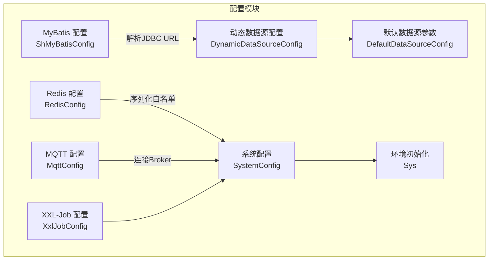
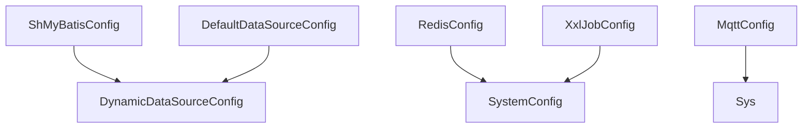
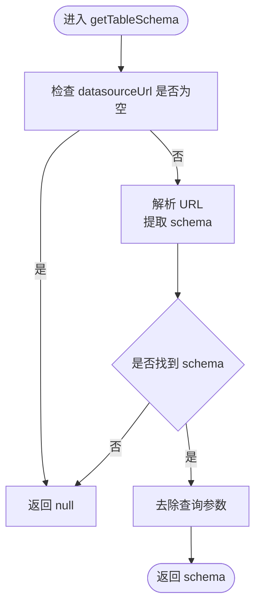
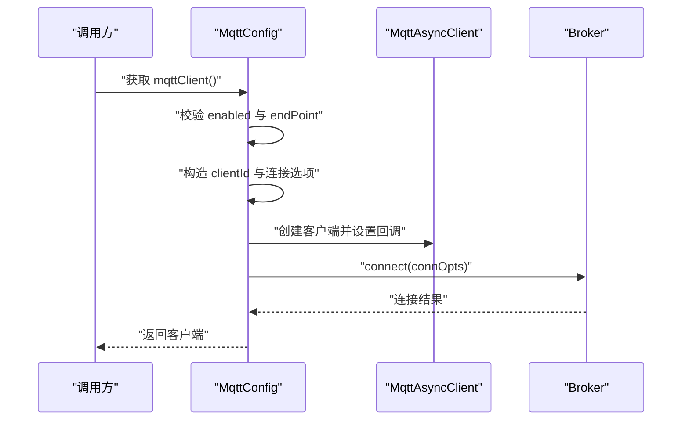
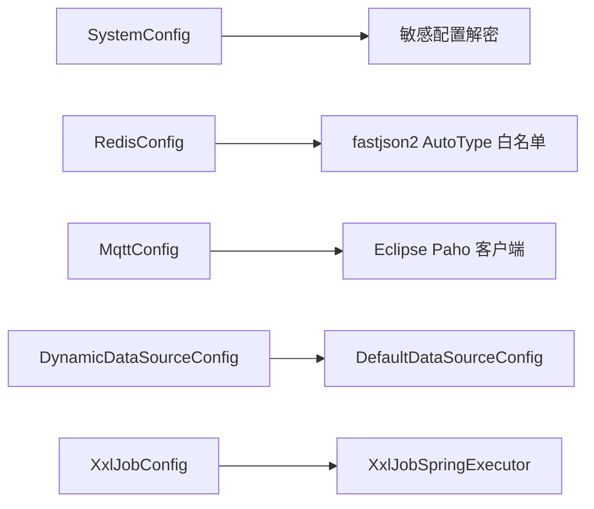

# 配置API参考

<cite>
**本文引用的文件**
- [ShMyBatisConfig.java](file://sh-mybatis/src/main/java/com/wkclz/mybatis/config/ShMyBatisConfig.java)
- [RedisConfig.java](file://sh-redis/src/main/java/com/wkclz/redis/config/RedisConfig.java)
- [MqttConfig.java](file://sh-mqtt/src/main/java/com/wkclz/mqtt/config/MqttConfig.java)
- [DynamicDataSourceConfig.java](file://sh-dynamicdb/src/main/java/com/wkclz/dynamicdb/config/DynamicDataSourceConfig.java)
- [DefaultDataSourceConfig.java](file://sh-dynamicdb/src/main/java/com/wkclz/dynamicdb/bean/DefaultDataSourceConfig.java)
- [XxlJobConfig.java](file://sh-xxljob/src/main/java/com/wkclz/xxljob/config/XxlJobConfig.java)
- [SystemConfig.java](file://sh-spring/src/main/java/com/wkclz/spring/config/SystemConfig.java)
- [Sys.java](file://sh-spring/src/main/java/com/wkclz/spring/config/Sys.java)
- [application.yml](file://sh-demo/src/main/resources/config/application.yml)
</cite>

## 目录
1. [简介](#简介)
2. [项目结构](#项目结构)
3. [核心组件](#核心组件)
4. [架构总览](#架构总览)
5. [详细组件分析](#详细组件分析)
6. [依赖分析](#依赖分析)
7. [性能考虑](#性能考虑)
8. [故障排查指南](#故障排查指南)
9. [结论](#结论)
10. [附录](#附录)

## 简介
本文件为 sh-framework 框架的配置API参考文档，覆盖以下主题：
- 各模块配置类的属性、默认值与用途
- 动态数据源配置API与多数据源配置方法
- XXL-Job 调度配置的API设计与任务注册机制
- 系统配置类的使用方法与环境变量要求
- 配置参数的数据类型、取值范围与验证规则
- 配置文件的 YAML/Properties 格式示例与最佳实践
- 配置加载顺序与优先级规则

## 项目结构
本仓库采用按功能域划分的多模块结构，配置相关的关键模块如下：
- sh-mybatis：MyBatis 配置与表信息解析
- sh-redis：Redis 客户端与序列化白名单配置
- sh-mqtt：MQTT 客户端与连接参数配置
- sh-dynamicdb：动态数据源配置与默认数据源参数
- sh-xxljob：XXL-Job 执行器配置
- sh-spring：系统配置与敏感配置解密、环境初始化
- sh-demo：示例配置文件

**图表来源**
- [ShMyBatisConfig.java:1-42](file://sh-mybatis/src/main/java/com/wkclz/mybatis/config/ShMyBatisConfig.java#L1-L42)
- [RedisConfig.java:1-41](file://sh-redis/src/main/java/com/wkclz/redis/config/RedisConfig.java#L1-L41)
- [MqttConfig.java:1-256](file://sh-mqtt/src/main/java/com/wkclz/mqtt/config/MqttConfig.java#L1-L256)
- [DynamicDataSourceConfig.java:1-18](file://sh-dynamicdb/src/main/java/com/wkclz/dynamicdb/config/DynamicDataSourceConfig.java#L1-L18)
- [DefaultDataSourceConfig.java:1-33](file://sh-dynamicdb/src/main/java/com/wkclz/dynamicdb/bean/DefaultDataSourceConfig.java#L1-L33)
- [XxlJobConfig.java:1-68](file://sh-xxljob/src/main/java/com/wkclz/xxljob/config/XxlJobConfig.java#L1-L68)
- [SystemConfig.java:1-140](file://sh-spring/src/main/java/com/wkclz/spring/config/SystemConfig.java#L1-L140)
- [Sys.java:1-99](file://sh-spring/src/main/java/com/wkclz/spring/config/Sys.java#L1-L99)

**章节来源**
- [ShMyBatisConfig.java:1-42](file://sh-mybatis/src/main/java/com/wkclz/mybatis/config/ShMyBatisConfig.java#L1-L42)
- [RedisConfig.java:1-41](file://sh-redis/src/main/java/com/wkclz/redis/config/RedisConfig.java#L1-L41)
- [MqttConfig.java:1-256](file://sh-mqtt/src/main/java/com/wkclz/mqtt/config/MqttConfig.java#L1-L256)
- [DynamicDataSourceConfig.java:1-18](file://sh-dynamicdb/src/main/java/com/wkclz/dynamicdb/config/DynamicDataSourceConfig.java#L1-L18)
- [DefaultDataSourceConfig.java:1-33](file://sh-dynamicdb/src/main/java/com/wkclz/dynamicdb/bean/DefaultDataSourceConfig.java#L1-L33)
- [XxlJobConfig.java:1-68](file://sh-xxljob/src/main/java/com/wkclz/xxljob/config/XxlJobConfig.java#L1-L68)
- [SystemConfig.java:1-140](file://sh-spring/src/main/java/com/wkclz/spring/config/SystemConfig.java#L1-L140)
- [Sys.java:1-99](file://sh-spring/src/main/java/com/wkclz/spring/config/Sys.java#L1-L99)

## 核心组件
本节汇总各配置类的核心属性、默认值与用途。

- MyBatis 配置（ShMyBatisConfig）
  - 属性
    - dataLengthCheck：整型，默认值参见属性行
    - datasourceUrl：字符串，默认值参见属性行
  - 行为
    - 提供解析 JDBC URL 获取 schema 的辅助方法
  - 数据类型与默认值
    - dataLengthCheck：整型
    - datasourceUrl：字符串
  - 取值范围与验证规则
    - 若 datasourceUrl 为空，schema 返回空
    - 解析遵循 JDBC URL 规范，若缺少 schema 则返回空
  - 适用场景
    - 与数据库 schema 相关的自动识别与校验

- Redis 配置（RedisConfig）
  - 属性
    - host：主机，默认 localhost
    - port：端口，默认 6379
    - password：密码，默认空
    - database：库索引，默认 0
    - autoTypeWhitelist：序列化白名单扩展列表，默认空
  - 行为
    - 提供 RedisMessageListenerContainer Bean
  - 数据类型与默认值
    - host：字符串
    - port：整型
    - password：字符串
    - database：整型
    - autoTypeWhitelist：字符串列表
  - 取值范围与验证规则
    - port 应为合法端口范围
    - database 应为非负整数
    - autoTypeWhitelist 为包前缀白名单，扩展默认白名单
  - 适用场景
    - Redis 客户端连接与消息监听容器装配

- MQTT 配置（MqttConfig）
  - 属性
    - enabled：是否启用，默认 true
    - username/password：认证凭据，默认空
    - caPath：CA 证书路径，默认空
    - endPoint：Broker 地址，必填
    - clientIdPrefix：客户端ID前缀，默认空
    - keepAliveInterval：保活间隔，默认 60
    - keepAliveTask：保活任务策略，默认 0
    - instanceId/accessKey/secretKey：阿里云实例鉴权参数，默认空
  - 行为
    - 构造并初始化 MqttAsyncClient，设置连接选项、超时、自动重连、保活
    - 支持 SSL/TLS 单向认证（基于 CA 证书）
    - 断线重连时重新订阅主题
  - 数据类型与默认值
    - enabled：字符串
    - keepAliveInterval/keepAliveTask：整型
    - 其余为字符串
  - 取值范围与验证规则
    - enabled 为布尔语义字符串（如 "true"/"false"）
    - keepAliveInterval 非负
    - endPoint 必填且在启用时不能为空
    - SSL 模式下 caPath 需有效
  - 适用场景
    - MQTT 客户端连接、认证、保活与断线重连

- 动态数据源配置（DynamicDataSourceConfig）
  - 属性
    - dynamicdbCacheSecond：缓存有效期（秒），默认 60
    - cleanupIntervalSecond：清理周期（秒），默认 120
  - 数据类型与默认值
    - 整型
  - 取值范围与验证规则
    - 建议为正整数
  - 适用场景
    - 控制动态数据源的缓存与清理节奏

- 默认数据源参数（DefaultDataSourceConfig）
  - 属性
    - name：数据源名称，默认 default
    - username/password/url/driverClassName：连接参数
    - druid.initialSize/maxActive/minIdle/maxWait：Druid 连接池参数
    - filters：Druid 过滤器，默认 stat,wall,slf4j
  - 数据类型与默认值
    - 字符串与数值字符串
  - 取值范围与验证规则
    - 数值类参数应为合法数值字符串
    - filters 为逗号分隔的过滤器名集合
  - 适用场景
    - 定义默认数据源的连接与池化参数

- XXL-Job 配置（XxlJobConfig）
  - 属性
    - adminAddresses：调度中心地址，默认空（关闭自动注册）
    - accessToken：访问令牌，默认空
    - timeout：通信超时（秒），默认 3
    - appName：执行器应用名，默认取 spring.application.name
    - address/ip/port：注册地址/IP/端口
    - logPath：日志目录，默认 ./xxl-job/jobhandler
    - logRetentionDays：日志保留天数，默认 30
  - 行为
    - 注册 XxlJobSpringExecutor Bean
  - 数据类型与默认值
    - 字符串与整型
  - 取值范围与验证规则
    - timeout 为正整数
    - port 为合法端口（<=0 表示自动）
    - logRetentionDays >=3 生效，否则关闭清理
  - 适用场景
    - 集成 XXL-Job 执行器，完成心跳与任务回调

- 系统配置（SystemConfig）
  - 属性
    - configKeystorePath：RSA 密钥库路径，默认空
    - configKeystoreAlias：密钥别名，默认 config-decrypt
    - configKeystorePassword：密钥库密码，优先从环境变量注入
    - configDecryptAesKey：AES 解密密钥，优先从环境变量注入
    - applicationName/profiles：应用名与激活的 Profile
    - alarmEmailEnabled/host/from/password/to：告警邮箱开关与收发配置
  - 行为
    - 启动时根据模式自动解密敏感配置
    - 提供安全提示与异常
  - 数据类型与默认值
    - 字符串与布尔
  - 取值范围与验证规则
    - 密钥库与 AES 密钥二选一或均为空（明文模式）
    - 明文模式下禁止使用 ENC(...) 格式
  - 适用场景
    - 敏感配置的安全存储与自动解密

- 环境初始化（Sys）
  - 行为
    - 在应用启动后确定当前环境（DEV/UAT/SIT/PROD）
    - 记录启动时间与状态
  - 适用场景
    - 系统启动后的环境与状态初始化

**章节来源**
- [ShMyBatisConfig.java:10-41](file://sh-mybatis/src/main/java/com/wkclz/mybatis/config/ShMyBatisConfig.java#L10-L41)
- [RedisConfig.java:14-40](file://sh-redis/src/main/java/com/wkclz/redis/config/RedisConfig.java#L14-L40)
- [MqttConfig.java:28-256](file://sh-mqtt/src/main/java/com/wkclz/mqtt/config/MqttConfig.java#L28-L256)
- [DynamicDataSourceConfig.java:9-17](file://sh-dynamicdb/src/main/java/com/wkclz/dynamicdb/config/DynamicDataSourceConfig.java#L9-L17)
- [DefaultDataSourceConfig.java:9-32](file://sh-dynamicdb/src/main/java/com/wkclz/dynamicdb/bean/DefaultDataSourceConfig.java#L9-L32)
- [XxlJobConfig.java:14-68](file://sh-xxljob/src/main/java/com/wkclz/xxljob/config/XxlJobConfig.java#L14-L68)
- [SystemConfig.java:42-140](file://sh-spring/src/main/java/com/wkclz/spring/config/SystemConfig.java#L42-L140)
- [Sys.java:25-99](file://sh-spring/src/main/java/com/wkclz/spring/config/Sys.java#L25-L99)

## 架构总览
下图展示配置类之间的交互关系与职责边界：

**图表来源**
- [ShMyBatisConfig.java:1-42](file://sh-mybatis/src/main/java/com/wkclz/mybatis/config/ShMyBatisConfig.java#L1-L42)
- [DynamicDataSourceConfig.java:1-18](file://sh-dynamicdb/src/main/java/com/wkclz/dynamicdb/config/DynamicDataSourceConfig.java#L1-L18)
- [DefaultDataSourceConfig.java:1-33](file://sh-dynamicdb/src/main/java/com/wkclz/dynamicdb/bean/DefaultDataSourceConfig.java#L1-L33)
- [RedisConfig.java:1-41](file://sh-redis/src/main/java/com/wkclz/redis/config/RedisConfig.java#L1-L41)
- [SystemConfig.java:1-140](file://sh-spring/src/main/java/com/wkclz/spring/config/SystemConfig.java#L1-L140)
- [MqttConfig.java:1-256](file://sh-mqtt/src/main/java/com/wkclz/mqtt/config/MqttConfig.java#L1-L256)
- [Sys.java:1-99](file://sh-spring/src/main/java/com/wkclz/spring/config/Sys.java#L1-L99)
- [XxlJobConfig.java:1-68](file://sh-xxljob/src/main/java/com/wkclz/xxljob/config/XxlJobConfig.java#L1-L68)

## 详细组件分析

### MyBatis 配置（ShMyBatisConfig）
- 设计要点
  - 通过 @Value 绑定外部配置
  - 提供解析 JDBC URL 中 schema 的工具方法，便于跨库/多租户场景
- 参数与默认值
  - dataLengthCheck：整型，来源于配置键
  - datasourceUrl：字符串，来源于配置键
- 复杂度与性能
  - 解析算法为线性扫描，复杂度 O(n)，n 为 URL 长度
- 错误处理
  - URL 缺失或格式不规范时返回空，避免抛出异常
- 最佳实践
  - 在多 schema 环境中结合 schema 解析结果进行路由

**图表来源**
- [ShMyBatisConfig.java:17-38](file://sh-mybatis/src/main/java/com/wkclz/mybatis/config/ShMyBatisConfig.java#L17-L38)

**章节来源**
- [ShMyBatisConfig.java:10-41](file://sh-mybatis/src/main/java/com/wkclz/mybatis/config/ShMyBatisConfig.java#L10-L41)

### Redis 配置（RedisConfig）
- 设计要点
  - 提供 RedisMessageListenerContainer Bean，便于订阅消息
  - autoTypeWhitelist 用于扩展 fastjson2 AutoType 白名单
- 参数与默认值
  - host：localhost
  - port：6379
  - password：空
  - database：0
  - autoTypeWhitelist：空列表
- 性能与安全
  - 合理设置 database 与连接池参数（由其他组件负责）
  - 白名单应最小化，仅包含必要包前缀
- 最佳实践
  - 在生产环境开启密码与网络隔离
  - 将敏感配置放入环境变量或密钥管理

**章节来源**
- [RedisConfig.java:14-40](file://sh-redis/src/main/java/com/wkclz/redis/config/RedisConfig.java#L14-L40)

### MQTT 配置（MqttConfig）
- 设计要点
  - 支持启用/禁用、用户名密码、阿里云鉴权、SSL/TLS 单向认证
  - 自动重连与断线重订阅
- 参数与默认值
  - enabled：true
  - keepAliveInterval：60
  - endPoint：必填
  - caPath：可选（启用 SSL 时）
- 连接流程

**图表来源**
- [MqttConfig.java:61-119](file://sh-mqtt/src/main/java/com/wkclz/mqtt/config/MqttConfig.java#L61-L119)

**章节来源**
- [MqttConfig.java:28-256](file://sh-mqtt/src/main/java/com/wkclz/mqtt/config/MqttConfig.java#L28-L256)

### 动态数据源配置（DynamicDataSourceConfig 与 DefaultDataSourceConfig）
- 设计要点
  - DynamicDataSourceConfig 控制缓存与清理周期
  - DefaultDataSourceConfig 定义默认数据源的连接与池化参数
- 参数与默认值
  - dynamicdbCacheSecond：60
  - cleanupIntervalSecond：120
  - name：default
  - druid.*：若干连接池参数默认值
- 多数据源配置方法
  - 在运行时通过动态数据源路由切换数据源
  - 通过 DefaultDataSourceConfig 提供默认参数模板
- 最佳实践
  - 为每个数据源设置独立的连接池参数
  - 合理设置缓存与清理周期，避免资源泄漏

**章节来源**
- [DynamicDataSourceConfig.java:9-17](file://sh-dynamicdb/src/main/java/com/wkclz/dynamicdb/config/DynamicDataSourceConfig.java#L9-L17)
- [DefaultDataSourceConfig.java:9-32](file://sh-dynamicdb/src/main/java/com/wkclz/dynamicdb/bean/DefaultDataSourceConfig.java#L9-L32)

### XXL-Job 配置（XxlJobConfig）
- 设计要点
  - 通过 @Bean 注册 XxlJobSpringExecutor
  - 支持自动注册到调度中心与任务回调
- 参数与默认值
  - adminAddresses：空（关闭自动注册）
  - accessToken：空
  - timeout：3
  - appName：取 spring.application.name
  - port：9999
  - logPath：./xxl-job/jobhandler
  - logRetentionDays：30
- 任务注册机制
  - 执行器启动时向调度中心注册
  - 心跳保持与任务结果回调

**章节来源**
- [XxlJobConfig.java:14-68](file://sh-xxljob/src/main/java/com/wkclz/xxljob/config/XxlJobConfig.java#L14-L68)

### 系统配置（SystemConfig）与环境初始化（Sys）
- 设计要点
  - SystemConfig 支持 RSA/AES/明文三种解密模式
  - Sys 在启动后确定环境并记录启动时间
- 参数与默认值
  - configKeystorePath/alias/password：RSA 模式
  - configDecryptAesKey：AES 模式
  - alarmEmail*：告警邮箱配置
- 安全要求
  - RSA 模式：密钥库密码通过环境变量注入
  - AES 模式：建议通过环境变量注入密钥
- 最佳实践
  - 生产环境优先使用 RSA 模式
  - 明文模式仅限开发环境

**章节来源**
- [SystemConfig.java:42-140](file://sh-spring/src/main/java/com/wkclz/spring/config/SystemConfig.java#L42-L140)
- [Sys.java:25-99](file://sh-spring/src/main/java/com/wkclz/spring/config/Sys.java#L25-L99)

## 依赖分析
- 内聚与耦合
  - 各配置类相对独立，通过 Spring 环境变量与 Bean 注入耦合
  - 动态数据源配置与默认数据源参数存在组合关系
- 外部依赖
  - MyBatis：JDBC URL 解析
  - Redis：Spring Data Redis、fastjson2 AutoType 白名单
  - MQTT：Eclipse Paho 客户端、BouncyCastle
  - XXL-Job：XxlJobSpringExecutor
  - 系统配置：敏感配置解密工具

**图表来源**
- [SystemConfig.java:100-121](file://sh-spring/src/main/java/com/wkclz/spring/config/SystemConfig.java#L100-L121)
- [RedisConfig.java:25-31](file://sh-redis/src/main/java/com/wkclz/redis/config/RedisConfig.java#L25-L31)
- [MqttConfig.java:86-103](file://sh-mqtt/src/main/java/com/wkclz/mqtt/config/MqttConfig.java#L86-L103)
- [DynamicDataSourceConfig.java:9-17](file://sh-dynamicdb/src/main/java/com/wkclz/dynamicdb/config/DynamicDataSourceConfig.java#L9-L17)
- [DefaultDataSourceConfig.java:9-32](file://sh-dynamicdb/src/main/java/com/wkclz/dynamicdb/bean/DefaultDataSourceConfig.java#L9-L32)
- [XxlJobConfig.java:52-66](file://sh-xxljob/src/main/java/com/wkclz/xxljob/config/XxlJobConfig.java#L52-L66)

**章节来源**
- [SystemConfig.java:100-121](file://sh-spring/src/main/java/com/wkclz/spring/config/SystemConfig.java#L100-L121)
- [RedisConfig.java:25-31](file://sh-redis/src/main/java/com/wkclz/redis/config/RedisConfig.java#L25-L31)
- [MqttConfig.java:86-103](file://sh-mqtt/src/main/java/com/wkclz/mqtt/config/MqttConfig.java#L86-L103)
- [DynamicDataSourceConfig.java:9-17](file://sh-dynamicdb/src/main/java/com/wkclz/dynamicdb/config/DynamicDataSourceConfig.java#L9-L17)
- [DefaultDataSourceConfig.java:9-32](file://sh-dynamicdb/src/main/java/com/wkclz/dynamicdb/bean/DefaultDataSourceConfig.java#L9-L32)
- [XxlJobConfig.java:52-66](file://sh-xxljob/src/main/java/com/wkclz/xxljob/config/XxlJobConfig.java#L52-L66)

## 性能考虑
- 连接与池化
  - Redis/数据库连接池参数需结合业务峰值合理设置
  - 动态数据源缓存与清理周期影响切换性能与内存占用
- 序列化
  - AutoType 白名单应最小化，避免反序列化风险与性能损耗
- MQTT
  - 保活间隔与自动重连策略需平衡网络波动与资源消耗
- XXL-Job
  - 日志路径与保留天数影响磁盘空间与 IO

## 故障排查指南
- Redis
  - 若无法连接，检查 host/port/password/database 与网络策略
  - AutoType 白名单缺失导致反序列化失败时，补充白名单
- MQTT
  - 启用 SSL 时确保 caPath 指向有效证书
  - 连接超时或断线重连频繁时，调整 keepAliveInterval 与自动重连策略
- 动态数据源
  - 缓存过期或清理过于频繁时，调整缓存与清理周期
- XXL-Job
  - 无法注册到调度中心时，检查 adminAddresses 与网络连通性
  - 日志目录无权限时，修正 logPath 并赋予读写权限
- 系统配置
  - 敏感配置解密失败时，确认密钥库路径/别名/密码或 AES 密钥来源
  - 明文模式下出现 ENC(...) 报错，需配置正确解密模式

**章节来源**
- [RedisConfig.java:16-31](file://sh-redis/src/main/java/com/wkclz/redis/config/RedisConfig.java#L16-L31)
- [MqttConfig.java:61-119](file://sh-mqtt/src/main/java/com/wkclz/mqtt/config/MqttConfig.java#L61-L119)
- [DynamicDataSourceConfig.java:11-15](file://sh-dynamicdb/src/main/java/com/wkclz/dynamicdb/config/DynamicDataSourceConfig.java#L11-L15)
- [XxlJobConfig.java:17-50](file://sh-xxljob/src/main/java/com/wkclz/xxljob/config/XxlJobConfig.java#L17-L50)
- [SystemConfig.java:100-137](file://sh-spring/src/main/java/com/wkclz/spring/config/SystemConfig.java#L100-L137)

## 结论
本参考文档梳理了 sh-framework 框架中与配置相关的关键组件及其参数、默认值、验证规则与最佳实践。通过合理的配置与参数调优，可在保证安全性的前提下提升系统性能与稳定性。

## 附录

### 配置文件格式与示例
- YAML 示例（摘自示例工程）
  - 参考路径：[application.yml](file://sh-demo/src/main/resources/config/application.yml)
  - 建议在该文件中集中定义各模块配置键，如：
    - sh.mybatis.data-length-check
    - spring.data.redis.*
    - shrimp.cloud.mqtt.*
    - sh.dynamicdb.*
    - xxl.job.*
    - sh.config.*
    - alarm.email.*

- Properties 示例
  - 与 YAML 等价的键名映射，适用于传统项目迁移

**章节来源**
- [application.yml](file://sh-demo/src/main/resources/config/application.yml)

### 配置加载顺序与优先级规则
- Spring Boot 配置优先级（从高到低）
  1) 命令行参数
  2) SPRING_APPLICATION_JSON（环境变量或系统属性）
  3) 系统环境变量
  4) JNDI 属性
  5) ServletConfig 初始化参数
  6) ServletContext 初始化参数
  7) application-{profile}.yml / application-{profile}.properties
  8) application.yml / application.properties
  9) @PropertySource 注解
  10) 默认属性
- 框架内行为
  - SystemConfig 支持通过环境变量注入密钥库密码与 AES 密钥，优先级高于配置文件
  - XXL-Job appName 默认取 spring.application.name，可被显式覆盖

**章节来源**
- [SystemConfig.java:65-74](file://sh-spring/src/main/java/com/wkclz/spring/config/SystemConfig.java#L65-L74)
- [XxlJobConfig.java:29-30](file://sh-xxljob/src/main/java/com/wkclz/xxljob/config/XxlJobConfig.java#L29-L30)