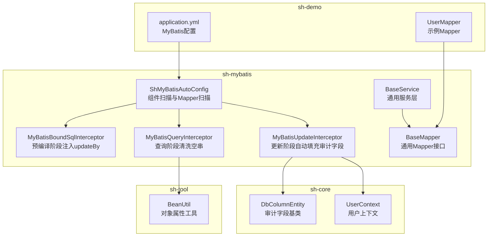
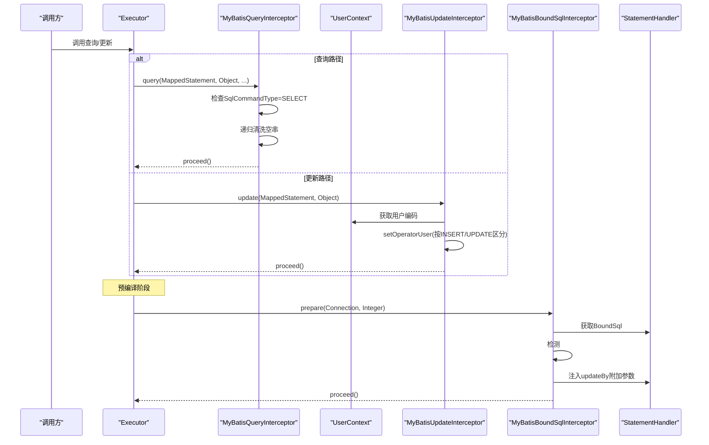
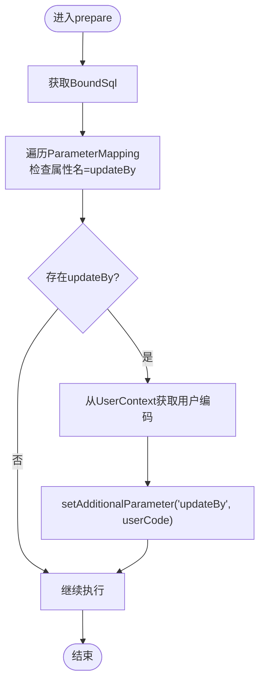
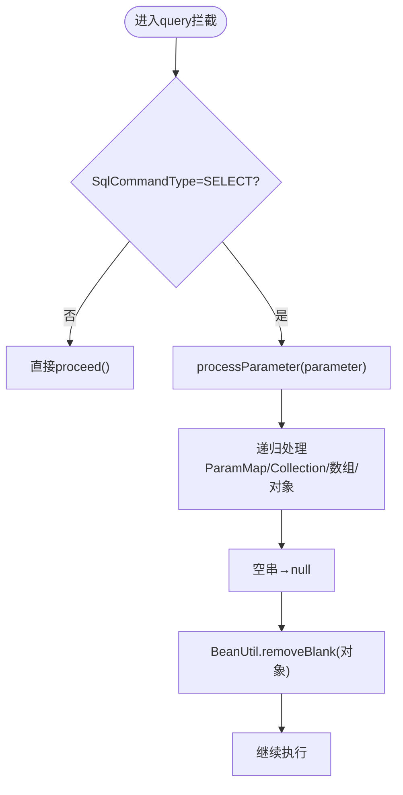
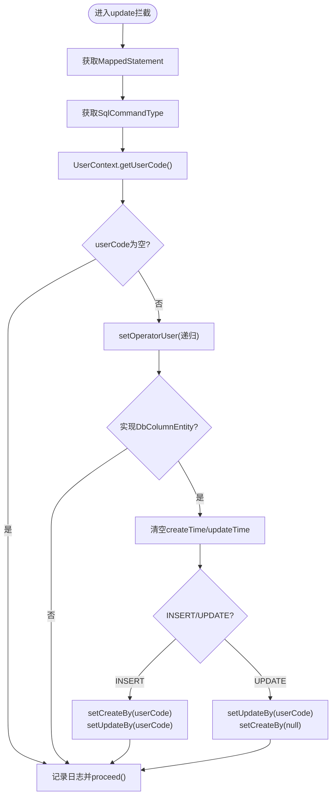
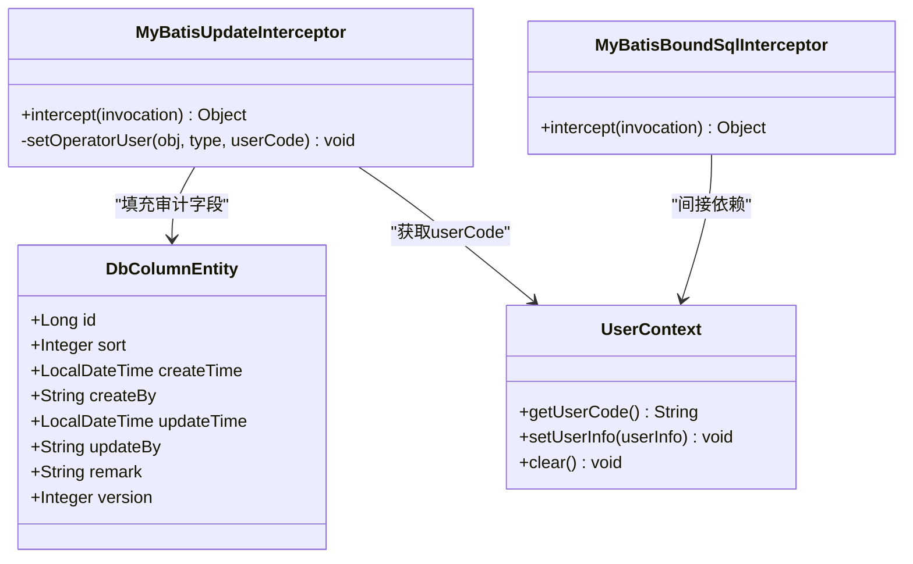
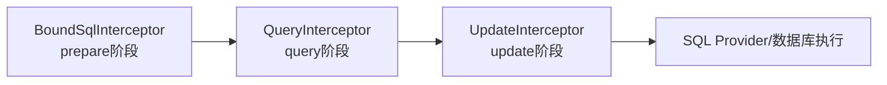
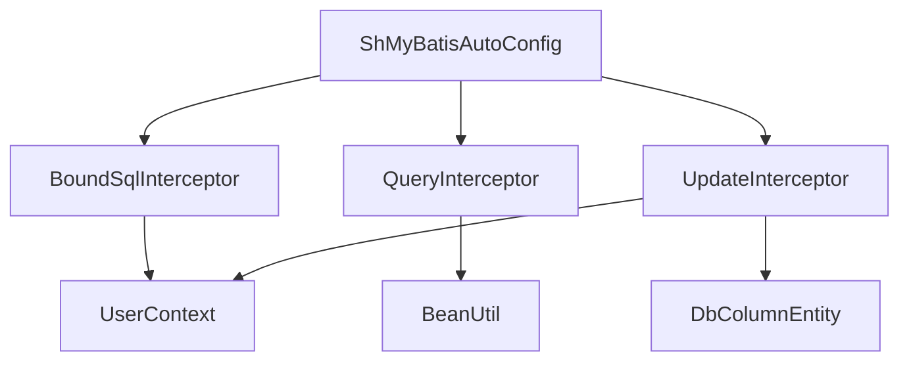

# MyBatis拦截器链

<cite>
**本文引用的文件**
- [MyBatisBoundSqlInterceptor.java](file://sh-mybatis/src/main/java/com/wkclz/mybatis/interceptor/MyBatisBoundSqlInterceptor.java)
- [MyBatisQueryInterceptor.java](file://sh-mybatis/src/main/java/com/wkclz/mybatis/interceptor/MyBatisQueryInterceptor.java)
- [MyBatisUpdateInterceptor.java](file://sh-mybatis/src/main/java/com/wkclz/mybatis/interceptor/MyBatisUpdateInterceptor.java)
- [DbColumnEntity.java](file://sh-core/src/main/java/com/wkclz/core/base/DbColumnEntity.java)
- [UserContext.java](file://sh-core/src/main/java/com/wkclz/core/user/UserContext.java)
- [BeanUtil.java](file://sh-tool/src/main/java/com/wkclz/tool/utils/BeanUtil.java)
- [BaseMapper.java](file://sh-mybatis/src/main/java/com/wkclz/mybatis/mapper/BaseMapper.java)
- [BaseService.java](file://sh-mybatis/src/main/java/com/wkclz/mybatis/service/BaseService.java)
- [ShMyBatisAutoConfig.java](file://sh-mybatis/src/main/java/com/wkclz/mybatis/ShMyBatisAutoConfig.java)
- [ShMyBatisConfig.java](file://sh-mybatis/src/main/java/com/wkclz/mybatis/config/ShMyBatisConfig.java)
- [application.yml](file://sh-demo/src/main/resources/config/application.yml)
- [US-010-MyBatis拦截器与自动填充.md](file://docs/stories/US-010-MyBatis拦截器与自动填充.md)
</cite>

## 目录
1. [简介](#简介)
2. [项目结构](#项目结构)
3. [核心组件](#核心组件)
4. [架构总览](#架构总览)
5. [详细组件分析](#详细组件分析)
6. [依赖分析](#依赖分析)
7. [性能考虑](#性能考虑)
8. [故障排查指南](#故障排查指南)
9. [结论](#结论)
10. [附录](#附录)

## 简介
本技术文档围绕 MyBatis 拦截器链展开，系统性解析三个核心拦截器的功能与实现原理，并阐明其在执行流程中的职责划分与协作方式。重点覆盖以下主题：
- SQL 解析与优化：通过 BoundSql 检测与参数注入，保障非实体参数场景下的占位符解析。
- 查询处理：对查询参数进行空字符串清洗，提升查询健壮性与一致性。
- 更新处理：自动填充审计字段（创建人、修改人、创建时间、修改时间），并按 INSERT/UPDATE 区分处理。
- 自动填充机制：基于用户上下文与实体基类，实现跨操作的审计字段标准化。
- SQL 优化策略与性能监控：结合拦截器链与配置项，给出可落地的优化建议与监控手段。
- 扩展与自定义：提供拦截器扩展点与最佳实践，便于二次开发。

## 项目结构
本项目采用多模块结构，MyBatis 相关能力集中在 sh-mybatis 模块，核心实体与用户上下文位于 sh-core，通用工具位于 sh-tool，演示应用位于 sh-demo。拦截器链由 Spring 自动装配扫描注册，配合 MyBatis Mapper 与服务层协同工作。

**图表来源**
- [ShMyBatisAutoConfig.java:1-14](file://sh-mybatis/src/main/java/com/wkclz/mybatis/ShMyBatisAutoConfig.java#L1-L14)
- [MyBatisBoundSqlInterceptor.java:1-50](file://sh-mybatis/src/main/java/com/wkclz/mybatis/interceptor/MyBatisBoundSqlInterceptor.java#L1-L50)
- [MyBatisQueryInterceptor.java:1-122](file://sh-mybatis/src/main/java/com/wkclz/mybatis/interceptor/MyBatisQueryInterceptor.java#L1-L122)
- [MyBatisUpdateInterceptor.java:1-86](file://sh-mybatis/src/main/java/com/wkclz/mybatis/interceptor/MyBatisUpdateInterceptor.java#L1-L86)
- [DbColumnEntity.java:1-39](file://sh-core/src/main/java/com/wkclz/core/base/DbColumnEntity.java#L1-L39)
- [UserContext.java:1-54](file://sh-core/src/main/java/com/wkclz/core/user/UserContext.java#L1-L54)
- [BeanUtil.java:1-293](file://sh-tool/src/main/java/com/wkclz/tool/utils/BeanUtil.java#L1-L293)
- [BaseMapper.java:1-88](file://sh-mybatis/src/main/java/com/wkclz/mybatis/mapper/BaseMapper.java#L1-L88)
- [BaseService.java:1-214](file://sh-mybatis/src/main/java/com/wkclz/mybatis/service/BaseService.java#L1-L214)
- [application.yml:1-26](file://sh-demo/src/main/resources/config/application.yml#L1-L26)

**章节来源**
- [ShMyBatisAutoConfig.java:1-14](file://sh-mybatis/src/main/java/com/wkclz/mybatis/ShMyBatisAutoConfig.java#L1-L14)
- [application.yml:14-26](file://sh-demo/src/main/resources/config/application.yml#L14-L26)

## 核心组件
- MyBatisBoundSqlInterceptor：在 StatementHandler.prepare 阶段检测 BoundSql 中是否存在 updateBy 占位符，若存在则将当前用户编码注入为附加参数，解决 deleteById/deleteByIds 等非实体参数场景下 #{updateBy} 无法解析的问题。
- MyBatisQueryInterceptor：在 Executor.query 阶段对查询参数进行空字符串清洗，将空字符串替换为 null，避免因空串导致的查询偏差；同时递归处理复杂对象、集合与数组，保证深层属性也被清理。
- MyBatisUpdateInterceptor：在 Executor.update 阶段自动填充审计字段。依据 SqlCommandType 判断 INSERT/UPDATE，分别设置 createBy/updateBy，并清空 createTime/updateTime 让数据库自动填充；对非实体参数场景通过 BoundSqlInterceptor 注入 updateBy。

上述拦截器均以 Spring 组件形式注册，由 MyBatis 插件机制织入目标方法调用链。

**章节来源**
- [MyBatisBoundSqlInterceptor.java:15-50](file://sh-mybatis/src/main/java/com/wkclz/mybatis/interceptor/MyBatisBoundSqlInterceptor.java#L15-L50)
- [MyBatisQueryInterceptor.java:16-122](file://sh-mybatis/src/main/java/com/wkclz/mybatis/interceptor/MyBatisQueryInterceptor.java#L16-L122)
- [MyBatisUpdateInterceptor.java:16-86](file://sh-mybatis/src/main/java/com/wkclz/mybatis/interceptor/MyBatisUpdateInterceptor.java#L16-L86)

## 架构总览
拦截器链在不同阶段切入 MyBatis 执行流程，形成“预编译注入—查询清洗—更新填充”的闭环，确保 SQL 参数规范化与审计字段一致性。

**图表来源**
- [MyBatisQueryInterceptor.java:26-42](file://sh-mybatis/src/main/java/com/wkclz/mybatis/interceptor/MyBatisQueryInterceptor.java#L26-L42)
- [MyBatisUpdateInterceptor.java:24-43](file://sh-mybatis/src/main/java/com/wkclz/mybatis/interceptor/MyBatisUpdateInterceptor.java#L24-L43)
- [MyBatisBoundSqlInterceptor.java:24-39](file://sh-mybatis/src/main/java/com/wkclz/mybatis/interceptor/MyBatisBoundSqlInterceptor.java#L24-L39)
- [UserContext.java:32-35](file://sh-core/src/main/java/com/wkclz/core/user/UserContext.java#L32-L35)

## 详细组件分析

### MyBatisBoundSqlInterceptor（SQL解析与参数注入）
- 责任边界：仅在 StatementHandler.prepare 阶段介入，针对包含 updateBy 占位符的 SQL 注入用户编码。
- 关键逻辑：
  - 读取 BoundSql 的 ParameterMapping，判断是否存在属性名为 updateBy 的映射。
  - 若存在，则从 UserContext 获取用户编码，若为空则回退为默认值，并通过 setAdditionalParameter 注入到 BoundSql 附加参数中。
- 适用场景：deleteById/deleteByIds 等非实体参数传入的 SQL，确保 #{updateBy} 可被正确解析与绑定。

**图表来源**
- [MyBatisBoundSqlInterceptor.java:24-39](file://sh-mybatis/src/main/java/com/wkclz/mybatis/interceptor/MyBatisBoundSqlInterceptor.java#L24-L39)

**章节来源**
- [MyBatisBoundSqlInterceptor.java:15-50](file://sh-mybatis/src/main/java/com/wkclz/mybatis/interceptor/MyBatisBoundSqlInterceptor.java#L15-L50)
- [UserContext.java:32-35](file://sh-core/src/main/java/com/wkclz/core/user/UserContext.java#L32-L35)

### MyBatisQueryInterceptor（查询参数清洗）
- 责任边界：仅对 SELECT 类型的查询进行参数处理，其他类型直接放行。
- 关键逻辑：
  - 递归遍历参数对象，识别 ParamMap、Collection、数组与普通对象等类型。
  - 对字符串类型的空串替换为 null；对普通对象调用 BeanUtil.removeBlank 递归清理空串属性。
- 性能影响：对复杂对象树进行反射访问，应避免在超大对象上频繁调用；建议在服务层或控制器侧先做必要裁剪。

**图表来源**
- [MyBatisQueryInterceptor.java:26-92](file://sh-mybatis/src/main/java/com/wkclz/mybatis/interceptor/MyBatisQueryInterceptor.java#L26-L92)
- [BeanUtil.java:38-56](file://sh-tool/src/main/java/com/wkclz/tool/utils/BeanUtil.java#L38-L56)

**章节来源**
- [MyBatisQueryInterceptor.java:16-122](file://sh-mybatis/src/main/java/com/wkclz/mybatis/interceptor/MyBatisQueryInterceptor.java#L16-L122)
- [BeanUtil.java:38-56](file://sh-tool/src/main/java/com/wkclz/tool/utils/BeanUtil.java#L38-L56)

### MyBatisUpdateInterceptor（更新操作审计字段管理）
- 责任边界：对 INSERT/UPDATE 操作自动填充审计字段，确保 createBy/updateBy 与时间字段的一致性。
- 关键逻辑：
  - 从 UserContext 获取用户编码；若为空则跳过自动填充。
  - 递归处理参数对象，若实现 DbColumnEntity，则：
    - 清空 createTime/updateTime（交由数据库自动填充）。
    - INSERT：设置 createBy 与 updateBy。
    - UPDATE：仅设置 updateBy，并将 createBy 置空，避免误改创建人。
- 适用范围：所有通过 BaseMapper/Service 触发的增删改操作。

**图表来源**
- [MyBatisUpdateInterceptor.java:24-72](file://sh-mybatis/src/main/java/com/wkclz/mybatis/interceptor/MyBatisUpdateInterceptor.java#L24-L72)
- [DbColumnEntity.java:13-39](file://sh-core/src/main/java/com/wkclz/core/base/DbColumnEntity.java#L13-L39)
- [UserContext.java:32-35](file://sh-core/src/main/java/com/wkclz/core/user/UserContext.java#L32-L35)

**章节来源**
- [MyBatisUpdateInterceptor.java:16-86](file://sh-mybatis/src/main/java/com/wkclz/mybatis/interceptor/MyBatisUpdateInterceptor.java#L16-L86)
- [DbColumnEntity.java:9-39](file://sh-core/src/main/java/com/wkclz/core/base/DbColumnEntity.java#L9-L39)

### 审计字段自动填充机制
- 数据模型：DbColumnEntity 提供标准审计字段（创建人、修改人、创建时间、修改时间等），实体继承该基类即可受益。
- 上下文来源：UserContext 在登录后写入用户信息，拦截器从其中提取 userCode 并填充到 createBy/updateBy。
- 执行顺序：BoundSqlInterceptor 先于 Executor 层注入 updateBy，随后 UpdateInterceptor 再根据操作类型设置 createBy/updateBy，确保三者协同。

**图表来源**
- [DbColumnEntity.java:13-39](file://sh-core/src/main/java/com/wkclz/core/base/DbColumnEntity.java#L13-L39)
- [UserContext.java:32-35](file://sh-core/src/main/java/com/wkclz/core/user/UserContext.java#L32-L35)
- [MyBatisUpdateInterceptor.java:46-72](file://sh-mybatis/src/main/java/com/wkclz/mybatis/interceptor/MyBatisUpdateInterceptor.java#L46-L72)
- [MyBatisBoundSqlInterceptor.java:24-39](file://sh-mybatis/src/main/java/com/wkclz/mybatis/interceptor/MyBatisBoundSqlInterceptor.java#L24-L39)

**章节来源**
- [DbColumnEntity.java:9-39](file://sh-core/src/main/java/com/wkclz/core/base/DbColumnEntity.java#L9-L39)
- [UserContext.java:8-54](file://sh-core/src/main/java/com/wkclz/core/user/UserContext.java#L8-L54)
- [MyBatisUpdateInterceptor.java:16-86](file://sh-mybatis/src/main/java/com/wkclz/mybatis/interceptor/MyBatisUpdateInterceptor.java#L16-L86)
- [MyBatisBoundSqlInterceptor.java:15-50](file://sh-mybatis/src/main/java/com/wkclz/mybatis/interceptor/MyBatisBoundSqlInterceptor.java#L15-L50)

### SQL 优化策略与性能监控
- SQL 优化策略
  - 参数清洗：在查询前将空串替换为 null，减少无效 LIKE 或模糊匹配带来的索引失效风险。
  - 占位符注入：通过 BoundSqlInterceptor 确保 deleteById 等场景下的 updateBy 正确解析，避免因参数缺失导致的 SQL 重写或回退。
  - 审计字段清空：在插入时清空 createTime/updateTime，让数据库默认值生效，减少应用端时间计算误差。
- 性能监控
  - 开启 MyBatis 日志：在 application.yml 中启用 StdOutImpl 或更详细的日志实现，观察 SQL 与参数变化。
  - 分页插件：结合 PageHelper 使用，避免一次性加载大量数据；合理设置批量大小与分页参数。
  - 配置项：ShMyBatisConfig 支持从 JDBC URL 解析 schema，便于诊断连接与库名问题。

**章节来源**
- [application.yml:14-26](file://sh-demo/src/main/resources/config/application.yml#L14-L26)
- [MyBatisQueryInterceptor.java:48-92](file://sh-mybatis/src/main/java/com/wkclz/mybatis/interceptor/MyBatisQueryInterceptor.java#L48-L92)
- [MyBatisBoundSqlInterceptor.java:28-39](file://sh-mybatis/src/main/java/com/wkclz/mybatis/interceptor/MyBatisBoundSqlInterceptor.java#L28-L39)
- [ShMyBatisConfig.java:17-38](file://sh-mybatis/src/main/java/com/wkclz/mybatis/config/ShMyBatisConfig.java#L17-L38)

### 执行顺序与责任划分
- 预编译阶段（StatementHandler.prepare）：BoundSqlInterceptor 注入 updateBy，确保 deleteById 等非实体参数场景可用。
- 查询阶段（Executor.query）：QueryInterceptor 仅对 SELECT 进行参数清洗，其他类型放行。
- 更新阶段（Executor.update）：UpdateInterceptor 根据 INSERT/UPDATE 设置审计字段，同时依赖 BoundSqlInterceptor 注入的 updateBy。

**图表来源**
- [MyBatisBoundSqlInterceptor.java:21-21](file://sh-mybatis/src/main/java/com/wkclz/mybatis/interceptor/MyBatisBoundSqlInterceptor.java#L21-L21)
- [MyBatisQueryInterceptor.java:21-23](file://sh-mybatis/src/main/java/com/wkclz/mybatis/interceptor/MyBatisQueryInterceptor.java#L21-L23)
- [MyBatisUpdateInterceptor.java:21-21](file://sh-mybatis/src/main/java/com/wkclz/mybatis/interceptor/MyBatisUpdateInterceptor.java#L21-L21)

**章节来源**
- [MyBatisBoundSqlInterceptor.java:21-21](file://sh-mybatis/src/main/java/com/wkclz/mybatis/interceptor/MyBatisBoundSqlInterceptor.java#L21-L21)
- [MyBatisQueryInterceptor.java:21-23](file://sh-mybatis/src/main/java/com/wkclz/mybatis/interceptor/MyBatisQueryInterceptor.java#L21-L23)
- [MyBatisUpdateInterceptor.java:21-21](file://sh-mybatis/src/main/java/com/wkclz/mybatis/interceptor/MyBatisUpdateInterceptor.java#L21-L21)

### 扩展与自定义
- 新增拦截器
  - 实现 Interceptor 接口，使用 @Intercepts/@Signature 指定目标类型与方法签名。
  - 在 Spring 自动配置扫描范围内（ShMyBatisAutoConfig 已扫描 com.wkclz.mybatis），拦截器将被 MyBatis 插件机制自动注册。
- 与现有拦截器协作
  - 注意执行顺序：BoundSqlInterceptor 应在 Executor 层之前注入参数，QueryInterceptor 仅处理 SELECT，UpdateInterceptor 仅处理 INSERT/UPDATE。
  - 避免重复处理：如需对同一对象多次处理，应在拦截器内部做好类型判断与短路返回。
- 最佳实践
  - 将“空串清洗”放在查询拦截器，避免污染非查询语义。
  - 审计字段填充尽量集中在 UpdateInterceptor，保持职责单一。
  - 对复杂对象的反射操作应谨慎，必要时在服务层做预处理。

**章节来源**
- [ShMyBatisAutoConfig.java:7-11](file://sh-mybatis/src/main/java/com/wkclz/mybatis/ShMyBatisAutoConfig.java#L7-L11)
- [BaseMapper.java:15-88](file://sh-mybatis/src/main/java/com/wkclz/mybatis/mapper/BaseMapper.java#L15-L88)
- [BaseService.java:19-214](file://sh-mybatis/src/main/java/com/wkclz/mybatis/service/BaseService.java#L19-L214)

## 依赖分析
- 组件内聚与耦合
  - BoundSqlInterceptor 仅依赖 UserContext 与 BoundSql 结构，耦合度低。
  - QueryInterceptor 依赖 BeanUtil 进行对象属性清洗，但仅限于查询路径。
  - UpdateInterceptor 依赖 DbColumnEntity 与 UserContext，负责审计字段填充。
- 外部依赖
  - MyBatis 核心类型：Executor、StatementHandler、MappedStatement、BoundSql。
  - Spring 组件扫描：ShMyBatisAutoConfig 负责扫描与注册。
- 循环依赖
  - 拦截器之间无直接循环依赖，通过 MyBatis 插件链路串联。

**图表来源**
- [MyBatisBoundSqlInterceptor.java:3-3](file://sh-mybatis/src/main/java/com/wkclz/mybatis/interceptor/MyBatisBoundSqlInterceptor.java#L3-L3)
- [MyBatisQueryInterceptor.java:3-3](file://sh-mybatis/src/main/java/com/wkclz/mybatis/interceptor/MyBatisQueryInterceptor.java#L3-L3)
- [MyBatisUpdateInterceptor.java:3-4](file://sh-mybatis/src/main/java/com/wkclz/mybatis/interceptor/MyBatisUpdateInterceptor.java#L3-L4)
- [ShMyBatisAutoConfig.java:7-11](file://sh-mybatis/src/main/java/com/wkclz/mybatis/ShMyBatisAutoConfig.java#L7-L11)

**章节来源**
- [MyBatisBoundSqlInterceptor.java:1-50](file://sh-mybatis/src/main/java/com/wkclz/mybatis/interceptor/MyBatisBoundSqlInterceptor.java#L1-L50)
- [MyBatisQueryInterceptor.java:1-122](file://sh-mybatis/src/main/java/com/wkclz/mybatis/interceptor/MyBatisQueryInterceptor.java#L1-L122)
- [MyBatisUpdateInterceptor.java:1-86](file://sh-mybatis/src/main/java/com/wkclz/mybatis/interceptor/MyBatisUpdateInterceptor.java#L1-L86)
- [ShMyBatisAutoConfig.java:1-14](file://sh-mybatis/src/main/java/com/wkclz/mybatis/ShMyBatisAutoConfig.java#L1-L14)

## 性能考虑
- 反射与递归成本：BeanUtil.removeBlank 与拦截器递归处理对象树可能带来额外开销，建议：
  - 在服务层对输入参数进行必要的裁剪与清洗，减少拦截器层面的深度遍历。
  - 控制批量大小（BaseService 默认每批最多 1000 条），避免单次处理过大集合。
- SQL 生成与绑定：BoundSqlInterceptor 仅在检测到 updateBy 占位符时注入，不会对所有 SQL 做无谓修改。
- 日志与可观测性：开启 MyBatis 日志输出，定位慢查询与异常参数；结合分页插件避免全表扫描。

[本节为通用指导，无需特定文件引用]

## 故障排查指南
- 现象：deleteById 等方法报错提示 updateBy 未绑定
  - 排查：确认 BoundSqlInterceptor 是否生效；检查 SQL 中是否包含 updateBy 占位符；确认 UserContext 是否已设置用户信息。
- 现象：查询结果异常或返回空集
  - 排查：确认 QueryInterceptor 是否对参数做了空串替换；检查 BeanUtil 递归清理是否影响了预期字段。
- 现象：审计字段未填充或填充错误
  - 排查：确认 UpdateInterceptor 是否拦截到对应操作；检查 DbColumnEntity 是否被正确继承；核对 INSERT/UPDATE 分支逻辑。
- 现象：性能抖动或内存占用上升
  - 排查：评估拦截器对复杂对象的反射次数；调整批量大小与分页参数；开启日志定位热点 SQL。

**章节来源**
- [MyBatisBoundSqlInterceptor.java:28-39](file://sh-mybatis/src/main/java/com/wkclz/mybatis/interceptor/MyBatisBoundSqlInterceptor.java#L28-L39)
- [MyBatisQueryInterceptor.java:48-92](file://sh-mybatis/src/main/java/com/wkclz/mybatis/interceptor/MyBatisQueryInterceptor.java#L48-L92)
- [MyBatisUpdateInterceptor.java:46-72](file://sh-mybatis/src/main/java/com/wkclz/mybatis/interceptor/MyBatisUpdateInterceptor.java#L46-L72)
- [BaseService.java:23-54](file://sh-mybatis/src/main/java/com/wkclz/mybatis/service/BaseService.java#L23-L54)

## 结论
本拦截器链通过“预编译注入—查询清洗—更新填充”的分工协作，实现了对 SQL 参数与审计字段的自动化治理。结合合理的批量控制与日志监控，可在保证数据一致性的同时兼顾性能与可维护性。对于扩展需求，遵循单一职责与类型判断原则，即可平滑接入新的拦截器或增强既有逻辑。

[本节为总结性内容，无需特定文件引用]

## 附录
- 示例与参考
  - 用户上下文设置与清理：参见 UserContext 的 setUserInfo/clear。
  - 通用 Mapper 与服务层：BaseMapper 与 BaseService 提供标准 CRUD 能力。
  - 文档故事：US-010-MyBatis拦截器与自动填充，描述了拦截器链的整体流程与交互。

**章节来源**
- [UserContext.java:16-51](file://sh-core/src/main/java/com/wkclz/core/user/UserContext.java#L16-L51)
- [BaseMapper.java:15-88](file://sh-mybatis/src/main/java/com/wkclz/mybatis/mapper/BaseMapper.java#L15-L88)
- [BaseService.java:19-214](file://sh-mybatis/src/main/java/com/wkclz/mybatis/service/BaseService.java#L19-L214)
- [US-010-MyBatis拦截器与自动填充.md:1-40](file://docs/stories/US-010-MyBatis拦截器与自动填充.md#L1-L40)