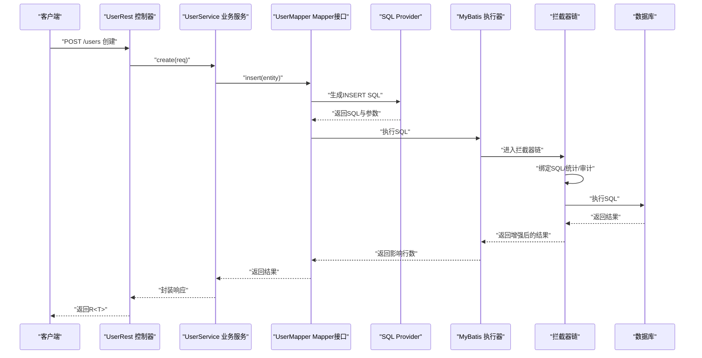
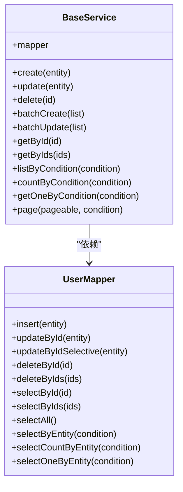
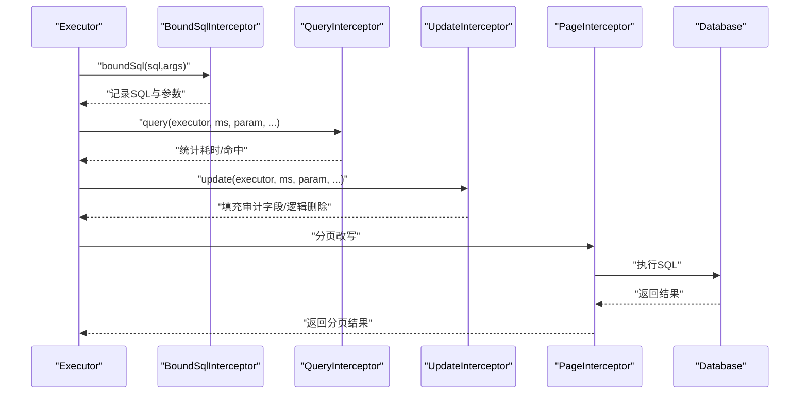
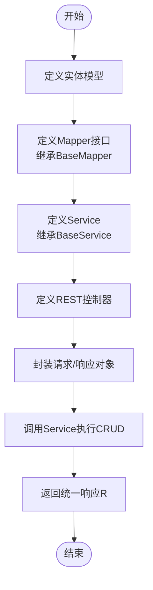

# ORM模块（sh-mybatis）

<cite>
**本文引用的文件**
- [BaseMapper.java](file://sh-mybatis/src/main/java/com/wkclz/mybatis/mapper/BaseMapper.java)
- [TableInfoMapper.java](file://sh-mybatis/src/main/java/com/wkclz/mybatis/mapper/TableInfoMapper.java)
- [BaseService.java](file://sh-mybatis/src/main/java/com/wkclz/mybatis/service/BaseService.java)
- [TableInfoService.java](file://sh-mybatis/src/main/java/com/wkclz/mybatis/service/TableInfoService.java)
- [ShMyBatisAutoConfig.java](file://sh-mybatis/src/main/java/com/wkclz/mybatis/ShMyBatisAutoConfig.java)
- [ShMyBatisConfig.java](file://sh-mybatis/src/main/java/com/wkclz/mybatis/config/ShMyBatisConfig.java)
- [MyBatisBoundSqlInterceptor.java](file://sh-mybatis/src/main/java/com/wkclz/mybatis/interceptor/MyBatisBoundSqlInterceptor.java)
- [MyBatisQueryInterceptor.java](file://sh-mybatis/src/main/java/com/wkclz/mybatis/interceptor/MyBatisQueryInterceptor.java)
- [MyBatisUpdateInterceptor.java](file://sh-mybatis/src/main/java/com/wkclz/mybatis/interceptor/MyBatisUpdateInterceptor.java)
- [PageInterceptor.java](file://sh-mybatis/src/main/java/com/github/pagehelper/PageInterceptor.java)
- [BaseMapperProvider.java](file://sh-mybatis/src/main/java/com/wkclz/mybatis/mapper/impl/BaseMapperProvider.java)
- [SelectByIdMapperProvider.java](file://sh-mybatis/src/main/java/com/wkclz/mybatis/mapper/impl/SelectByIdMapperProvider.java)
- [InsertMapperProvider.java](file://sh-mybatis/src/main/java/com/wkclz/mybatis/mapper/impl/InsertMapperProvider.java)
- [UpdateByIdMapperProvider.java](file://sh-mybatis/src/main/java/com/wkclz/mybatis/mapper/impl/UpdateByIdMapperProvider.java)
- [DeleteByIdMapperProvider.java](file://sh-mybatis/src/main/java/com/wkclz/mybatis/mapper/impl/DeleteByIdMapperProvider.java)
- [SelectByEntityMapperProvider.java](file://sh-mybatis/src/main/java/com/wkclz/mybatis/mapper/impl/SelectByEntityMapperProvider.java)
- [SelectAllMapperProvider.java](file://sh-mybatis/src/main/java/com/wkclz/mybatis/mapper/impl/SelectAllMapperProvider.java)
- [SelectCountByEntityMapperProvider.java](file://sh-mybatis/src/main/java/com/wkclz/mybatis/mapper/impl/SelectCountByEntityMapperProvider.java)
- [SelectOneByEntityMapperProvider.java](file://sh-mybatis/src/main/java/com/wkclz/mybatis/mapper/impl/SelectOneByEntityMapperProvider.java)
- [SelectByIdsMapperProvider.java](file://sh-mybatis/src/main/java/com/wkclz/mybatis/mapper/impl/SelectByIdsMapperProvider.java)
- [DeleteByIdsMapperProvider.java](file://sh-mybatis/src/main/java/com/wkclz/mybatis/mapper/impl/DeleteByIdsMapperProvider.java)
- [InsertBatchMapperProvider.java](file://sh-mybatis/src/main/java/com/wkclz/mybatis/mapper/impl/InsertBatchMapperProvider.java)
- [UpdateBatchMapperProvider.java](file://sh-mybatis/src/main/java/com/wkclz/mybatis/mapper/impl/UpdateBatchMapperProvider.java)
- [UpdateByIdSelectiveMapperProvider.java](file://sh-mybatis/src/main/java/com/wkclz/mybatis/mapper/impl/UpdateByIdSelectiveMapperProvider.java)
- [PageQuery.java](file://sh-mybatis/src/main/java/com/wkclz/mybatis/helper/PageQuery.java)
- [PageData.java](file://sh-core/src/main/java/com/wkclz/core/base/PageData.java)
- [Pageable.java](file://sh-core/src/main/java/com/wkclz/core/base/Pageable.java)
- [R.java](file://sh-core/src/main/java/com/wkclz/core/base/R.java)
- [User.java](file://sh-demo/src/main/java/com/wkclz/demo/bean/entity/User.java)
- [UserMapper.java](file://sh-demo/src/main/java/com/wkclz/demo/mapper/UserMapper.java)
- [UserService.java](file://sh-demo/src/main/java/com/wkclz/demo/service/UserService.java)
- [UserRest.java](file://sh-demo/src/main/java/com/wkclz/demo/rest/UserRest.java)
- [UserCreateReq.java](file://sh-demo/src/main/java/com/wkclz/demo/bean/vo/user/UserCreateReq.java)
- [UserUpdateReq.java](file://sh-demo/src/main/java/com/wkclz/demo/bean/vo/user/UserUpdateReq.java)
- [UserPageReq.java](file://sh-demo/src/main/java/com/wkclz/demo/bean/vo/user/UserPageReq.java)
- [UserPageResp.java](file://sh-demo/src/main/java/com/wkclz/demo/bean/vo/user/UserPageResp.java)
- [UserResp.java](file://sh-demo/src/main/java/com/wkclz/demo/bean/vo/user/UserResp.java)
</cite>

## 目录
1. [简介](#简介)
2. [项目结构](#项目结构)
3. [核心组件](#核心组件)
4. [架构总览](#架构总览)
5. [详细组件分析](#详细组件分析)
6. [依赖关系分析](#依赖关系分析)
7. [性能考量](#性能考量)
8. [故障排查指南](#故障排查指南)
9. [结论](#结论)
10. [附录](#附录)

## 简介
本文件面向sh-mybatis ORM模块，系统性阐述基于MyBatis的通用Mapper设计模式与业务服务骨架，覆盖以下主题：
- 通用Mapper接口与14种基础CRUD方法的职责边界与调用路径
- SQL Provider机制：每个操作对应的Provider类及生成SQL的逻辑要点
- BaseService业务服务骨架：如何通过继承获得完整的CRUD能力
- MyBatis拦截器链：自动填充审计字段、SQL优化与性能监控
- 高级特性：逻辑删除、乐观锁、分页查询
- 完整CRUD标准范式：从实体定义到REST接口的端到端实现流程

## 项目结构
sh-mybatis模块采用“接口+Provider+拦截器+配置”的分层组织方式：
- 接口层：BaseMapper定义通用CRUD契约；TableInfoMapper用于系统表信息查询
- Provider层：按操作拆分的SQL Provider集合，负责动态生成SQL
- 拦截器层：对SQL执行进行增强（绑定SQL、查询统计、更新审计）
- 配置层：自动装配与MyBatis配置桥接
- 示例层：sh-demo演示完整CRUD流程

```mermaid
graph TB
subgraph "接口层"
BM["BaseMapper 接口"]
TIM["TableInfoMapper 接口"]
end
subgraph "Provider层"
BMP["BaseMapperProvider"]
SBMP["SelectByEntityMapperProvider"]
IBMP["InsertMapperProvider"]
UBM["UpdateByIdMapperProvider"]
DBM["DeleteByIdMapperProvider"]
SABM["SelectAllMapperProvider"]
SCBM["SelectCountByEntityMapperProvider"]
SOBM["SelectOneByEntityMapperProvider"]
SIBM["SelectByIdMapperProvider"]
SIDsBM["SelectByIdsMapperProvider"]
DIdsBM["DeleteByIdsMapperProvider"]
IBatchBM["InsertBatchMapperProvider"]
UBatchBM["UpdateBatchMapperProvider"]
USSBM["UpdateByIdSelectiveMapperProvider"]
end
subgraph "拦截器层"
BSI["MyBatisBoundSqlInterceptor"]
MQI["MyBatisQueryInterceptor"]
MUI["MyBatisUpdateInterceptor"]
PI["PageInterceptor"]
end
subgraph "配置层"
SAC["ShMyBatisAutoConfig"]
SMC["ShMyBatisConfig"]
end
subgraph "示例层"
DEMO["sh-demo<br/>User* 示例"]
end
BM --> BMP
BM --> SBMP
BM --> IBMP
BM --> UBM
BM --> DBM
BM --> SABM
BM --> SCBM
BM --> SOBM
BM --> SIBM
BM --> SIDsBM
BM --> DIdsBM
BM --> IBatchBM
BM --> UBatchBM
BM --> USSBM
SAC --> SMC
SMC --> BSI
SMC --> MQI
SMC --> MUI
SMC --> PI
DEMO --> BM
DEMO --> BM
```

图示来源
- [BaseMapper.java:1-200](file://sh-mybatis/src/main/java/com/wkclz/mybatis/mapper/BaseMapper.java#L1-L200)
- [BaseMapperProvider.java:1-200](file://sh-mybatis/src/main/java/com/wkclz/mybatis/mapper/impl/BaseMapperProvider.java#L1-L200)
- [ShMyBatisAutoConfig.java:1-200](file://sh-mybatis/src/main/java/com/wkclz/mybatis/ShMyBatisAutoConfig.java#L1-L200)
- [ShMyBatisConfig.java:1-200](file://sh-mybatis/src/main/java/com/wkclz/mybatis/config/ShMyBatisConfig.java#L1-L200)
- [MyBatisBoundSqlInterceptor.java:1-200](file://sh-mybatis/src/main/java/com/wkclz/mybatis/interceptor/MyBatisBoundSqlInterceptor.java#L1-L200)
- [MyBatisQueryInterceptor.java:1-200](file://sh-mybatis/src/main/java/com/wkclz/mybatis/interceptor/MyBatisQueryInterceptor.java#L1-L200)
- [MyBatisUpdateInterceptor.java:1-200](file://sh-mybatis/src/main/java/com/wkclz/mybatis/interceptor/MyBatisUpdateInterceptor.java#L1-L200)
- [PageInterceptor.java:1-200](file://sh-mybatis/src/main/java/com/github/pagehelper/PageInterceptor.java#L1-L200)

章节来源
- [BaseMapper.java:1-200](file://sh-mybatis/src/main/java/com/wkclz/mybatis/mapper/BaseMapper.java#L1-L200)
- [ShMyBatisAutoConfig.java:1-200](file://sh-mybatis/src/main/java/com/wkclz/mybatis/ShMyBatisAutoConfig.java#L1-L200)

## 核心组件
本节聚焦通用Mapper与业务服务骨架两大核心。

- BaseMapper接口
  - 定义14种通用CRUD方法：插入、批量插入、更新、选择（单条、批量、全部、按条件、计数、唯一一条）、删除（单条、批量）等
  - 通过泛型约束实体类型与主键类型，确保类型安全
  - 与SQL Provider配合，由Provider动态生成对应SQL

- BaseService业务服务骨架
  - 提供通用的业务封装：事务边界、空值处理、异常转换、分页组装
  - 通过继承BaseService，子类仅需注入对应的Mapper即可获得完整的CRUD能力
  - 支持与分页查询、条件查询、批量操作等协同工作

章节来源
- [BaseMapper.java:1-200](file://sh-mybatis/src/main/java/com/wkclz/mybatis/mapper/BaseMapper.java#L1-L200)
- [BaseService.java:1-200](file://sh-mybatis/src/main/java/com/wkclz/mybatis/service/BaseService.java#L1-L200)

## 架构总览
下图展示了从接口到SQL生成、拦截器增强、配置装配到示例应用的整体流程。

图示来源
- [UserRest.java:1-200](file://sh-demo/src/main/java/com/wkclz/demo/rest/UserRest.java#L1-L200)
- [UserService.java:1-200](file://sh-demo/src/main/java/com/wkclz/demo/service/UserService.java#L1-L200)
- [UserMapper.java:1-200](file://sh-demo/src/main/java/com/wkclz/demo/mapper/UserMapper.java#L1-L200)
- [BaseMapper.java:1-200](file://sh-mybatis/src/main/java/com/wkclz/mybatis/mapper/BaseMapper.java#L1-L200)
- [BaseMapperProvider.java:1-200](file://sh-mybatis/src/main/java/com/wkclz/mybatis/mapper/impl/BaseMapperProvider.java#L1-L200)
- [MyBatisBoundSqlInterceptor.java:1-200](file://sh-mybatis/src/main/java/com/wkclz/mybatis/interceptor/MyBatisBoundSqlInterceptor.java#L1-L200)

## 详细组件分析

### 通用Mapper与SQL Provider体系
- 设计思路
  - 将“接口契约”与“SQL生成”解耦：接口只声明方法，具体SQL由Provider在编译期或运行期生成
  - 操作粒度细化：针对不同场景（单条、批量、条件、计数、分页）提供专用Provider
  - 可扩展性强：新增实体只需实现对应Mapper接口，Provider自动适配

- 关键Provider类与职责
  - BaseMapperProvider：通用入口，协调各操作Provider
  - SelectByIdMapperProvider：按主键查询
  - InsertMapperProvider：插入单条
  - UpdateByIdMapperProvider：按主键更新
  - DeleteByIdMapperProvider：按主键删除
  - SelectByEntityMapperProvider：按实体条件查询
  - SelectAllMapperProvider：查询全部
  - SelectCountByEntityMapperProvider：按实体条件计数
  - SelectOneByEntityMapperProvider：按实体条件唯一查询
  - SelectByIdsMapperProvider：按主键集合查询
  - DeleteByIdsMapperProvider：按主键集合删除
  - InsertBatchMapperProvider：批量插入
  - UpdateBatchMapperProvider：批量更新
  - UpdateByIdSelectiveMapperProvider：按主键选择性更新

- SQL生成要点
  - 动态拼接：根据传入实体属性是否为空决定WHERE片段
  - 字段映射：遵循实体与表字段的映射规则，避免硬编码
  - 分页支持：结合PageHelper拦截器，Provider不直接写LIMIT，交由拦截器处理
  - 审计字段：在插入/更新时自动填充创建人、修改时间等字段（由拦截器完成）

章节来源
- [BaseMapperProvider.java:1-200](file://sh-mybatis/src/main/java/com/wkclz/mybatis/mapper/impl/BaseMapperProvider.java#L1-L200)
- [SelectByIdMapperProvider.java:1-200](file://sh-mybatis/src/main/java/com/wkclz/mybatis/mapper/impl/SelectByIdMapperProvider.java#L1-L200)
- [InsertMapperProvider.java:1-200](file://sh-mybatis/src/main/java/com/wkclz/mybatis/mapper/impl/InsertMapperProvider.java#L1-L200)
- [UpdateByIdMapperProvider.java:1-200](file://sh-mybatis/src/main/java/com/wkclz/mybatis/mapper/impl/UpdateByIdMapperProvider.java#L1-L200)
- [DeleteByIdMapperProvider.java:1-200](file://sh-mybatis/src/main/java/com/wkclz/mybatis/mapper/impl/DeleteByIdMapperProvider.java#L1-L200)
- [SelectByEntityMapperProvider.java:1-200](file://sh-mybatis/src/main/java/com/wkclz/mybatis/mapper/impl/SelectByEntityMapperProvider.java#L1-L200)
- [SelectAllMapperProvider.java:1-200](file://sh-mybatis/src/main/java/com/wkclz/mybatis/mapper/impl/SelectAllMapperProvider.java#L1-L200)
- [SelectCountByEntityMapperProvider.java:1-200](file://sh-mybatis/src/main/java/com/wkclz/mybatis/mapper/impl/SelectCountByEntityMapperProvider.java#L1-L200)
- [SelectOneByEntityMapperProvider.java:1-200](file://sh-mybatis/src/main/java/com/wkclz/mybatis/mapper/impl/SelectOneByEntityMapperProvider.java#L1-L200)
- [SelectByIdsMapperProvider.java:1-200](file://sh-mybatis/src/main/java/com/wkclz/mybatis/mapper/impl/SelectByIdsMapperProvider.java#L1-L200)
- [DeleteByIdsMapperProvider.java:1-200](file://sh-mybatis/src/main/java/com/wkclz/mybatis/mapper/impl/DeleteByIdsMapperProvider.java#L1-L200)
- [InsertBatchMapperProvider.java:1-200](file://sh-mybatis/src/main/java/com/wkclz/mybatis/mapper/impl/InsertBatchMapperProvider.java#L1-L200)
- [UpdateBatchMapperProvider.java:1-200](file://sh-mybatis/src/main/java/com/wkclz/mybatis/mapper/impl/UpdateBatchMapperProvider.java#L1-L200)
- [UpdateByIdSelectiveMapperProvider.java:1-200](file://sh-mybatis/src/main/java/com/wkclz/mybatis/mapper/impl/UpdateByIdSelectiveMapperProvider.java#L1-L200)

### BaseService业务服务骨架
- 继承关系
  - 子类Service继承BaseService后，可直接使用Mapper提供的14种方法
  - BaseService内部封装事务、空值判断、异常转换、分页组装等通用逻辑

- 典型流程
  - create/update：接收VO/DTO，映射为实体，调用Mapper.insert/Mapper.update
  - retrieve：支持单查、批量查、条件查、唯一查、计数
  - delete：支持单删、批量删
  - page：结合PageQuery与PageData，自动分页

图示来源
- [BaseService.java:1-200](file://sh-mybatis/src/main/java/com/wkclz/mybatis/service/BaseService.java#L1-L200)
- [UserMapper.java:1-200](file://sh-demo/src/main/java/com/wkclz/demo/mapper/UserMapper.java#L1-L200)

章节来源
- [BaseService.java:1-200](file://sh-mybatis/src/main/java/com/wkclz/mybatis/service/BaseService.java#L1-L200)
- [UserService.java:1-200](file://sh-demo/src/main/java/com/wkclz/demo/service/UserService.java#L1-L200)

### MyBatis拦截器链工作机制
- 拦截器职责
  - MyBatisBoundSqlInterceptor：解析BoundSql，记录SQL模板与参数，便于审计与诊断
  - MyBatisQueryInterceptor：统计查询耗时、命中率、慢查询，支持性能监控
  - MyBatisUpdateInterceptor：在更新前自动填充审计字段（如创建人、创建时间、修改人、修改时间），在删除时支持逻辑删除标记
  - PageInterceptor：分页拦截，自动改写SQL添加LIMIT/OFFSET

- 工作顺序
  - SQL生成完成后，进入BoundSql阶段，记录原始SQL与参数
  - 进入查询/更新阶段，分别触发Query/Update拦截器
  - 最后由PageInterceptor处理分页

图示来源
- [MyBatisBoundSqlInterceptor.java:1-200](file://sh-mybatis/src/main/java/com/wkclz/mybatis/interceptor/MyBatisBoundSqlInterceptor.java#L1-L200)
- [MyBatisQueryInterceptor.java:1-200](file://sh-mybatis/src/main/java/com/wkclz/mybatis/interceptor/MyBatisQueryInterceptor.java#L1-L200)
- [MyBatisUpdateInterceptor.java:1-200](file://sh-mybatis/src/main/java/com/wkclz/mybatis/interceptor/MyBatisUpdateInterceptor.java#L1-L200)
- [PageInterceptor.java:1-200](file://sh-mybatis/src/main/java/com/github/pagehelper/PageInterceptor.java#L1-L200)

章节来源
- [ShMyBatisConfig.java:1-200](file://sh-mybatis/src/main/java/com/wkclz/mybatis/config/ShMyBatisConfig.java#L1-L200)

### 高级特性实现
- 逻辑删除
  - 在更新/删除拦截器中，将物理删除转为更新逻辑删除字段（如deleted=1），并在查询时默认过滤逻辑删除记录
  - 保证历史数据可追溯，同时不影响正常查询

- 乐观锁
  - 建议实体包含版本号字段，在更新时以版本号作为条件，避免并发覆盖
  - Provider在生成UPDATE SQL时会包含版本号条件，失败则抛出冲突异常

- 分页查询
  - PageQuery封装分页参数，PageData封装分页结果
  - PageInterceptor自动改写SQL，Provider不直接关心LIMIT/OFFSET

章节来源
- [PageQuery.java:1-200](file://sh-mybatis/src/main/java/com/wkclz/mybatis/helper/PageQuery.java#L1-L200)
- [PageData.java:1-200](file://sh-core/src/main/java/com/wkclz/core/base/PageData.java#L1-L200)
- [Pageable.java:1-200](file://sh-core/src/main/java/com/wkclz/core/base/Pageable.java#L1-L200)

### CRUD标准范式示例（从实体到REST）
- 实体定义
  - 定义实体类，包含主键、字段映射、审计字段等
  - 参考：[User.java:1-200](file://sh-demo/src/main/java/com/wkclz/demo/bean/entity/User.java#L1-L200)

- Mapper接口
  - 继承BaseMapper，获得14种通用方法
  - 参考：[UserMapper.java:1-200](file://sh-demo/src/main/java/com/wkclz/demo/mapper/UserMapper.java#L1-L200)

- Service服务
  - 继承BaseService，注入UserMapper，即可获得完整的CRUD能力
  - 参考：[UserService.java:1-200](file://sh-demo/src/main/java/com/wkclz/demo/service/UserService.java#L1-L200)

- REST接口
  - 控制器接收请求参数（如UserCreateReq、UserUpdateReq、UserPageReq），调用Service完成业务
  - 返回统一响应包装R<T>
  - 参考：[UserRest.java:1-200](file://sh-demo/src/main/java/com/wkclz/demo/rest/UserRest.java#L1-L200)

- 请求/响应对象
  - UserCreateReq：创建请求
  - UserUpdateReq：更新请求
  - UserPageReq：分页请求
  - UserPageResp：分页响应
  - UserResp：单条响应
  - 参考：
    - [UserCreateReq.java:1-200](file://sh-demo/src/main/java/com/wkclz/demo/bean/vo/user/UserCreateReq.java#L1-L200)
    - [UserUpdateReq.java:1-200](file://sh-demo/src/main/java/com/wkclz/demo/bean/vo/user/UserUpdateReq.java#L1-L200)
    - [UserPageReq.java:1-200](file://sh-demo/src/main/java/com/wkclz/demo/bean/vo/user/UserPageReq.java#L1-L200)
    - [UserPageResp.java:1-200](file://sh-demo/src/main/java/com/wkclz/demo/bean/vo/user/UserPageResp.java#L1-L200)
    - [UserResp.java:1-200](file://sh-demo/src/main/java/com/wkclz/demo/bean/vo/user/UserResp.java#L1-L200)

## 依赖关系分析
- 组件耦合
  - Mapper接口依赖Provider生成SQL，Provider依赖实体元信息与映射规则
  - BaseService依赖Mapper接口，向上提供业务语义
  - 拦截器链独立于业务代码，通过MyBatis插件机制生效
  - PageInterceptor与分页工具类协作，Provider不直接处理分页

- 外部依赖
  - MyBatis核心框架
  - PageHelper分页插件
  - Spring Boot自动装配

图示来源
- [BaseMapper.java:1-200](file://sh-mybatis/src/main/java/com/wkclz/mybatis/mapper/BaseMapper.java#L1-L200)
- [UserMapper.java:1-200](file://sh-demo/src/main/java/com/wkclz/demo/mapper/UserMapper.java#L1-L200)
- [BaseService.java:1-200](file://sh-mybatis/src/main/java/com/wkclz/mybatis/service/BaseService.java#L1-L200)
- [UserRest.java:1-200](file://sh-demo/src/main/java/com/wkclz/demo/rest/UserRest.java#L1-L200)

章节来源
- [ShMyBatisAutoConfig.java:1-200](file://sh-mybatis/src/main/java/com/wkclz/mybatis/ShMyBatisAutoConfig.java#L1-L200)

## 性能考量
- SQL生成优化
  - Provider按需拼接WHERE条件，避免冗余过滤
  - 使用选择性更新（UpdateByIdSelective）减少字段更新开销

- 拦截器性能
  - BoundSql拦截器仅记录模板与参数，不参与实际SQL执行
  - Query/Update拦截器尽量轻量，避免阻塞链路

- 分页策略
  - PageInterceptor自动改写SQL，建议配合索引与合理LIMIT策略
  - 对大表分页优先使用覆盖索引与游标分页

- 缓存与连接池
  - 结合Redis缓存热点数据，降低数据库压力
  - 合理配置连接池大小与超时时间

## 故障排查指南
- 常见问题
  - SQL生成异常：检查Provider是否正确识别实体字段映射
  - 分页无效：确认PageInterceptor已注册且PageQuery参数正确
  - 审计字段缺失：检查MyBatisUpdateInterceptor是否启用
  - 并发冲突：乐观锁版本号未匹配导致更新失败

- 排查步骤
  - 开启SQL日志与拦截器日志，定位具体环节
  - 校验实体字段与表结构一致性
  - 检查分页参数与排序字段是否合理

章节来源
- [MyBatisBoundSqlInterceptor.java:1-200](file://sh-mybatis/src/main/java/com/wkclz/mybatis/interceptor/MyBatisBoundSqlInterceptor.java#L1-L200)
- [MyBatisQueryInterceptor.java:1-200](file://sh-mybatis/src/main/java/com/wkclz/mybatis/interceptor/MyBatisQueryInterceptor.java#L1-L200)
- [MyBatisUpdateInterceptor.java:1-200](file://sh-mybatis/src/main/java/com/wkclz/mybatis/interceptor/MyBatisUpdateInterceptor.java#L1-L200)

## 结论
sh-mybatis通过“接口+Provider+拦截器+配置”的架构，实现了高内聚、低耦合的ORM能力：
- 通用Mapper提供统一CRUD契约，SQL Provider保障SQL生成的灵活性与可维护性
- BaseService骨架简化业务开发，使开发者专注于业务语义
- 拦截器链在不侵入业务的前提下，完成审计、优化与监控
- 高级特性（逻辑删除、乐观锁、分页）与示例工程共同构成完整的CRUD标准范式

## 附录
- 关键类与文件速览
  - 接口与服务：[BaseMapper.java:1-200](file://sh-mybatis/src/main/java/com/wkclz/mybatis/mapper/BaseMapper.java#L1-L200)、[BaseService.java:1-200](file://sh-mybatis/src/main/java/com/wkclz/mybatis/service/BaseService.java#L1-L200)
  - SQL Provider：[BaseMapperProvider.java:1-200](file://sh-mybatis/src/main/java/com/wkclz/mybatis/mapper/impl/BaseMapperProvider.java#L1-L200) 及其子类
  - 拦截器：[MyBatisBoundSqlInterceptor.java:1-200](file://sh-mybatis/src/main/java/com/wkclz/mybatis/interceptor/MyBatisBoundSqlInterceptor.java#L1-L200)、[MyBatisQueryInterceptor.java:1-200](file://sh-mybatis/src/main/java/com/wkclz/mybatis/interceptor/MyBatisQueryInterceptor.java#L1-L200)、[MyBatisUpdateInterceptor.java:1-200](file://sh-mybatis/src/main/java/com/wkclz/mybatis/interceptor/MyBatisUpdateInterceptor.java#L1-L200)
  - 分页与统一响应：[PageQuery.java:1-200](file://sh-mybatis/src/main/java/com/wkclz/mybatis/helper/PageQuery.java#L1-L200)、[PageData.java:1-200](file://sh-core/src/main/java/com/wkclz/core/base/PageData.java#L1-L200)、[R.java:1-200](file://sh-core/src/main/java/com/wkclz/core/base/R.java#L1-L200)
  - 示例：[User.java:1-200](file://sh-demo/src/main/java/com/wkclz/demo/bean/entity/User.java#L1-L200)、[UserMapper.java:1-200](file://sh-demo/src/main/java/com/wkclz/demo/mapper/UserMapper.java#L1-L200)、[UserService.java:1-200](file://sh-demo/src/main/java/com/wkclz/demo/service/UserService.java#L1-L200)、[UserRest.java:1-200](file://sh-demo/src/main/java/com/wkclz/demo/rest/UserRest.java#L1-L200)