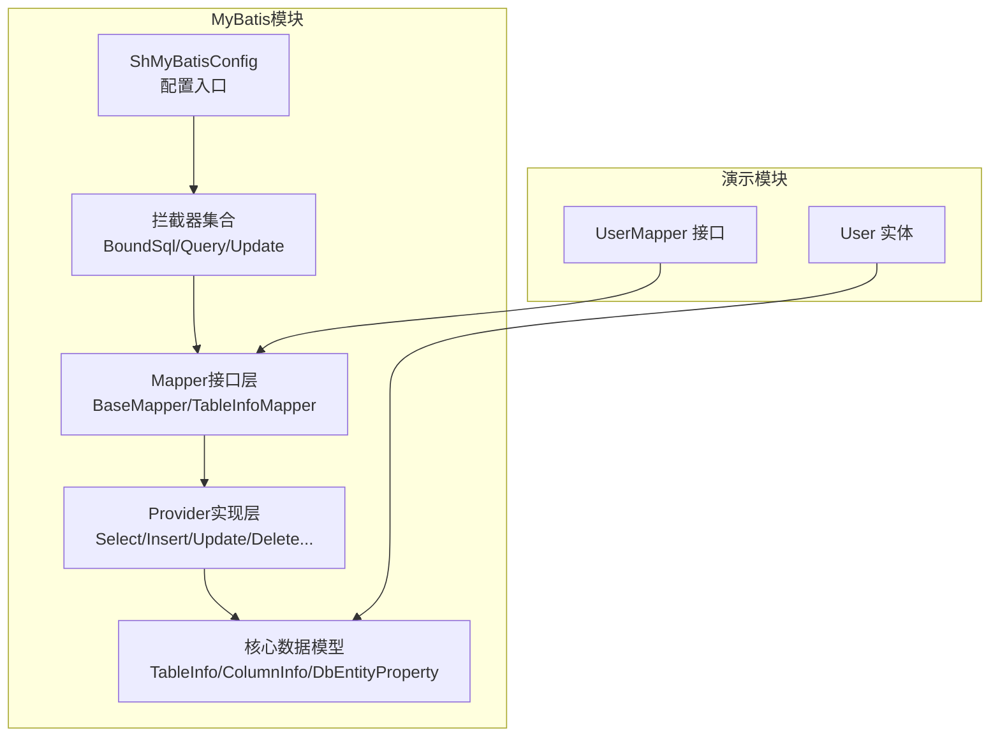
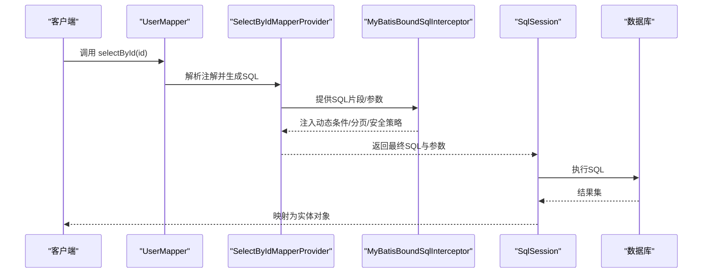
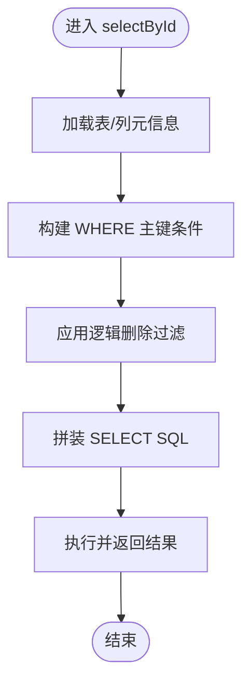
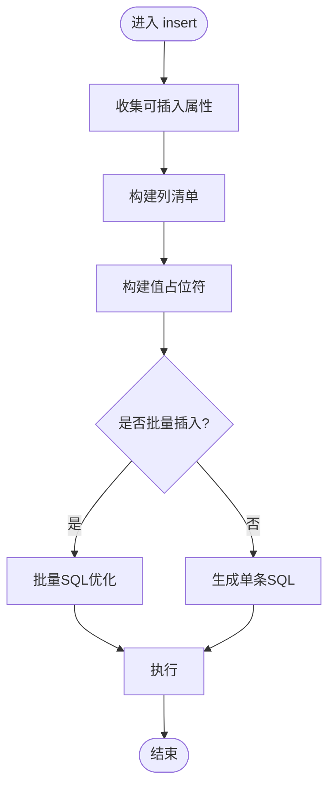
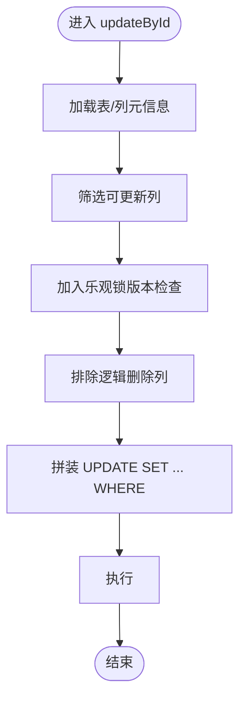
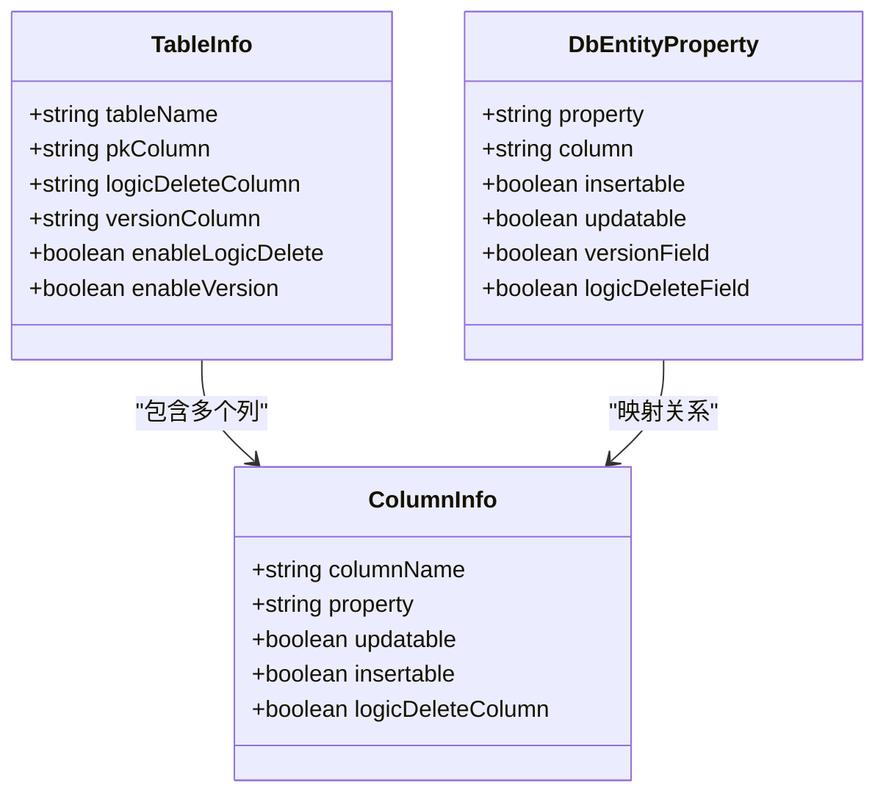
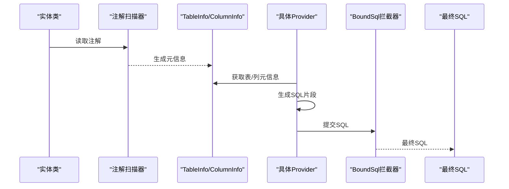
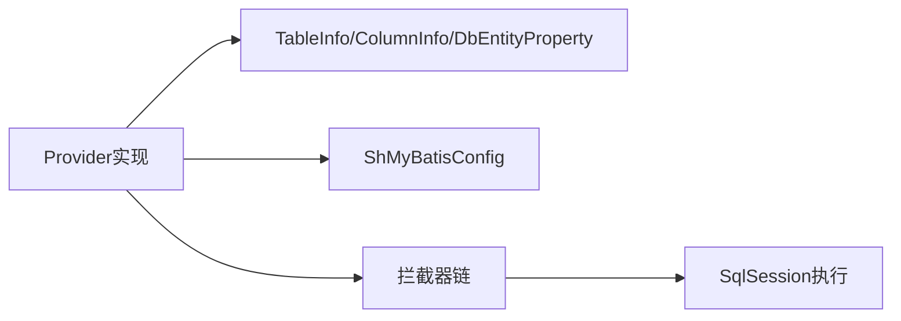

# SQL Provider体系

<cite>
**本文档引用的文件**
- [SelectByIdMapperProvider.java](file://sh-mybatis/src/main/java/com/wkclz/mybatis/mapper/impl/SelectByIdMapperProvider.java)
- [InsertMapperProvider.java](file://sh-mybatis/src/main/java/com/wkclz/mybatis/mapper/impl/InsertMapperProvider.java)
- [UpdateByIdMapperProvider.java](file://sh-mybatis/src/main/java/com/wkclz/mybatis/mapper/impl/UpdateByIdMapperProvider.java)
- [BaseMapperProvider.java](file://sh-mybatis/src/main/java/com/wkclz/mybatis/mapper/impl/BaseMapperProvider.java)
- [TableInfo.java](file://sh-mybatis/src/main/java/com/wkclz/mybatis/bean/TableInfo.java)
- [ColumnInfo.java](file://sh-mybatis/src/main/java/com/wkclz/mybatis/bean/ColumnInfo.java)
- [DbEntityProperty.java](file://sh-mybatis/src/main/java/com/wkclz/mybatis/bean/DbEntityProperty.java)
- [ShMyBatisConfig.java](file://sh-mybatis/src/main/java/com/wkclz/mybatis/config/ShMyBatisConfig.java)
- [MyBatisBoundSqlInterceptor.java](file://sh-mybatis/src/main/java/com/wkclz/mybatis/interceptor/MyBatisBoundSqlInterceptor.java)
- [MyBatisQueryInterceptor.java](file://sh-mybatis/src/main/java/com/wkclz/mybatis/interceptor/MyBatisQueryInterceptor.java)
- [MyBatisUpdateInterceptor.java](file://sh-mybatis/src/main/java/com/wkclz/mybatis/interceptor/MyBatisUpdateInterceptor.java)
- [TableInfoMapper.java](file://sh-mybatis/src/main/java/com/wkclz/mybatis/mapper/TableInfoMapper.java)
- [TableInfoMapper.xml](file://sh-mybatis/src/main/resources/mapper/TableInfoMapper.xml)
- [UserMapper.java](file://sh-demo/src/main/java/com/wkclz/demo/mapper/UserMapper.java)
- [User.java](file://sh-demo/src/main/java/com/wkclz/demo/bean/entity/User.java)
</cite>

## 目录
1. [简介](#简介)
2. [项目结构](#项目结构)
3. [核心组件](#核心组件)
4. [架构总览](#架构总览)
5. [详细组件分析](#详细组件分析)
6. [依赖关系分析](#依赖关系分析)
7. [性能考虑](#性能考虑)
8. [故障排查指南](#故障排查指南)
9. [结论](#结论)
10. [附录](#附录)

## 简介
本文件面向SQL Provider体系，系统性阐述基于注解驱动的动态SQL生成机制与实现细节。重点覆盖以下方面：
- Provider类的设计模式与职责边界：如SelectByIdMapperProvider、InsertMapperProvider、UpdateByIdMapperProvider等
- 核心数据结构：TableInfo、ColumnInfo、DbEntityProperty的作用与关系
- 注解到SQL的映射流程：如何从实体类注解信息生成对应SQL语句
- 动态SQL生成算法与优化策略
- 完整使用示例：展示如何在现有框架上扩展新的Provider类型
- 性能优化技巧与调试方法

## 项目结构
SQL Provider体系位于sh-mybatis模块中，采用“接口+Provider实现”的分层设计，并通过MyBatis拦截器与配置完成SQL构建与执行链路的织入。

图示来源
- [ShMyBatisConfig.java](file://sh-mybatis/src/main/java/com/wkclz/mybatis/config/ShMyBatisConfig.java)
- [MyBatisBoundSqlInterceptor.java](file://sh-mybatis/src/main/java/com/wkclz/mybatis/interceptor/MyBatisBoundSqlInterceptor.java)
- [TableInfoMapper.java](file://sh-mybatis/src/main/java/com/wkclz/mybatis/mapper/TableInfoMapper.java)
- [BaseMapperProvider.java](file://sh-mybatis/src/main/java/com/wkclz/mybatis/mapper/impl/BaseMapperProvider.java)

章节来源
- [ShMyBatisConfig.java](file://sh-mybatis/src/main/java/com/wkclz/mybatis/config/ShMyBatisConfig.java)
- [TableInfoMapper.java](file://sh-mybatis/src/main/java/com/wkclz/mybatis/mapper/TableInfoMapper.java)

## 核心组件
- Provider实现层：以BaseMapperProvider为基类，派生出SelectByIdMapperProvider、InsertMapperProvider、UpdateByIdMapperProvider等具体Provider，负责根据实体注解生成对应SQL片段或完整SQL。
- 核心数据模型：
  - TableInfo：描述数据库表级元信息（表名、主键、逻辑删除字段、乐观锁字段等）
  - ColumnInfo：描述列级元信息（列名、Java字段映射、是否更新、是否插入忽略等）
  - DbEntityProperty：描述实体属性与数据库字段的映射关系及注解元数据
- 拦截器层：MyBatisBoundSqlInterceptor、MyBatisQueryInterceptor、MyBatisUpdateInterceptor分别在不同阶段参与SQL构建与优化
- 配置层：ShMyBatisConfig注册拦截器与扫描Mapper包

章节来源
- [BaseMapperProvider.java](file://sh-mybatis/src/main/java/com/wkclz/mybatis/mapper/impl/BaseMapperProvider.java)
- [TableInfo.java](file://sh-mybatis/src/main/java/com/wkclz/mybatis/bean/TableInfo.java)
- [ColumnInfo.java](file://sh-mybatis/src/main/java/com/wkclz/mybatis/bean/ColumnInfo.java)
- [DbEntityProperty.java](file://sh-mybatis/src/main/java/com/wkclz/mybatis/bean/DbEntityProperty.java)
- [ShMyBatisConfig.java](file://sh-mybatis/src/main/java/com/wkclz/mybatis/config/ShMyBatisConfig.java)

## 架构总览
下图展示了从Mapper接口调用到SQL生成与执行的关键路径，以及Provider与拦截器的协作关系。

图示来源
- [UserMapper.java](file://sh-demo/src/main/java/com/wkclz/demo/mapper/UserMapper.java)
- [SelectByIdMapperProvider.java](file://sh-mybatis/src/main/java/com/wkclz/mybatis/mapper/impl/SelectByIdMapperProvider.java)
- [MyBatisBoundSqlInterceptor.java](file://sh-mybatis/src/main/java/com/wkclz/mybatis/interceptor/MyBatisBoundSqlInterceptor.java)

## 详细组件分析

### 基础Provider基类：BaseMapperProvider
- 设计要点
  - 统一的注解解析入口：从Mapper接口与实体类注解中提取TableInfo、ColumnInfo、DbEntityProperty
  - SQL模板拼装：提供可复用的SQL片段构造能力（INSERT/UPDATE/SELECT/WHERE等）
  - 参数绑定：确保参数名与占位符一致，支持批量与单条操作
- 关键职责
  - 表与列元信息缓存：避免重复反射开销
  - 条件拼接：根据注解决定是否包含某列到SET/INSERT/WHERE子句
  - 特殊字段处理：逻辑删除、乐观锁、自动填充字段的参与规则

章节来源
- [BaseMapperProvider.java](file://sh-mybatis/src/main/java/com/wkclz/mybatis/mapper/impl/BaseMapperProvider.java)

### 查询Provider：SelectByIdMapperProvider
- 作用
  - 依据主键生成精确查询SQL，支持单条记录返回
- 实现要点
  - 从TableInfo获取主键列
  - 从ColumnInfo筛选需要返回的列
  - 使用拦截器注入额外过滤条件（如逻辑删除）
- 典型流程

图示来源
- [SelectByIdMapperProvider.java](file://sh-mybatis/src/main/java/com/wkclz/mybatis/mapper/impl/SelectByIdMapperProvider.java)

章节来源
- [SelectByIdMapperProvider.java](file://sh-mybatis/src/main/java/com/wkclz/mybatis/mapper/impl/SelectByIdMapperProvider.java)

### 插入Provider：InsertMapperProvider
- 作用
  - 根据实体属性生成INSERT语句，支持全部字段或选择性插入
- 实现要点
  - 从DbEntityProperty判断是否插入该字段（如自增主键、默认值字段）
  - 从ColumnInfo确定列名与占位符
  - 支持批量插入的SQL优化
- 典型流程

图示来源
- [InsertMapperProvider.java](file://sh-mybatis/src/main/java/com/wkclz/mybatis/mapper/impl/InsertMapperProvider.java)

章节来源
- [InsertMapperProvider.java](file://sh-mybatis/src/main/java/com/wkclz/mybatis/mapper/impl/InsertMapperProvider.java)

### 更新Provider：UpdateByIdMapperProvider
- 作用
  - 基于主键更新实体，支持全量更新与选择性更新
- 实现要点
  - 从TableInfo获取主键列
  - 从ColumnInfo筛选需要更新的列（排除只读/自增字段）
  - 乐观锁字段参与版本校验
  - 逻辑删除字段不参与常规更新
- 典型流程

图示来源
- [UpdateByIdMapperProvider.java](file://sh-mybatis/src/main/java/com/wkclz/mybatis/mapper/impl/UpdateByIdMapperProvider.java)

章节来源
- [UpdateByIdMapperProvider.java](file://sh-mybatis/src/main/java/com/wkclz/mybatis/mapper/impl/UpdateByIdMapperProvider.java)

### 核心数据结构：TableInfo、ColumnInfo、DbEntityProperty
- TableInfo
  - 描述表级元信息：表名、主键列、逻辑删除字段、乐观锁字段、自动填充字段等
  - 用途：作为Provider生成SQL的权威来源，确保所有列处理遵循表级约束
- ColumnInfo
  - 描述列级元信息：列名、Java字段映射、是否更新、是否插入忽略、是否逻辑删除字段等
  - 用途：控制INSERT/UPDATE/SELECT时的列参与规则
- DbEntityProperty
  - 描述实体属性与数据库字段的映射关系及注解元数据
  - 用途：Provider解析注解的基础数据源，决定哪些属性参与SQL生成

图示来源
- [TableInfo.java](file://sh-mybatis/src/main/java/com/wkclz/mybatis/bean/TableInfo.java)
- [ColumnInfo.java](file://sh-mybatis/src/main/java/com/wkclz/mybatis/bean/ColumnInfo.java)
- [DbEntityProperty.java](file://sh-mybatis/src/main/java/com/wkclz/mybatis/bean/DbEntityProperty.java)

章节来源
- [TableInfo.java](file://sh-mybatis/src/main/java/com/wkclz/mybatis/bean/TableInfo.java)
- [ColumnInfo.java](file://sh-mybatis/src/main/java/com/wkclz/mybatis/bean/ColumnInfo.java)
- [DbEntityProperty.java](file://sh-mybatis/src/main/java/com/wkclz/mybatis/bean/DbEntityProperty.java)

### 注解到SQL的映射流程
- 元信息采集
  - 通过反射读取实体类注解，构建DbEntityProperty列表
  - 通过TableInfoMapper.xml或运行时扫描，补充TableInfo与ColumnInfo
- SQL生成
  - Provider根据DbEntityProperty与ColumnInfo筛选列
  - 结合TableInfo中的特殊字段（逻辑删除、乐观锁）生成过滤条件
- 拦截器增强
  - BoundSql拦截器：在SQL构建完成后进行二次加工（如分页、安全过滤）
  - Query/Update拦截器：对查询/更新语句进行统一增强（如自动填充、审计字段）

图示来源
- [TableInfoMapper.xml](file://sh-mybatis/src/main/resources/mapper/TableInfoMapper.xml)
- [BaseMapperProvider.java](file://sh-mybatis/src/main/java/com/wkclz/mybatis/mapper/impl/BaseMapperProvider.java)
- [MyBatisBoundSqlInterceptor.java](file://sh-mybatis/src/main/java/com/wkclz/mybatis/interceptor/MyBatisBoundSqlInterceptor.java)

章节来源
- [TableInfoMapper.xml](file://sh-mybatis/src/main/resources/mapper/TableInfoMapper.xml)
- [BaseMapperProvider.java](file://sh-mybatis/src/main/java/com/wkclz/mybatis/mapper/impl/BaseMapperProvider.java)
- [MyBatisBoundSqlInterceptor.java](file://sh-mybatis/src/main/java/com/wkclz/mybatis/interceptor/MyBatisBoundSqlInterceptor.java)

### 动态SQL生成算法与优化策略
- 算法要点
  - 列筛选：依据insertable/updatable标志与特殊字段标记决定列参与
  - 条件拼接：WHERE子句按主键/非空/注解条件动态拼接
  - 批量优化：批量INSERT/UPDATE使用IN或批量参数，减少往返
- 优化策略
  - 反射缓存：元信息缓存避免重复反射
  - 占位符一致性：参数名与SQL占位符严格匹配，降低绑定错误
  - 拦截器链路：在BoundSql阶段集中处理，避免多次遍历
  - 分页与安全：Query拦截器统一注入分页与逻辑删除过滤

章节来源
- [BaseMapperProvider.java](file://sh-mybatis/src/main/java/com/wkclz/mybatis/mapper/impl/BaseMapperProvider.java)
- [MyBatisBoundSqlInterceptor.java](file://sh-mybatis/src/main/java/com/wkclz/mybatis/interceptor/MyBatisBoundSqlInterceptor.java)
- [MyBatisQueryInterceptor.java](file://sh-mybatis/src/main/java/com/wkclz/mybatis/interceptor/MyBatisQueryInterceptor.java)
- [MyBatisUpdateInterceptor.java](file://sh-mybatis/src/main/java/com/wkclz/mybatis/interceptor/MyBatisUpdateInterceptor.java)

### 使用示例：扩展新的Provider类型
- 步骤
  1) 在sh-mybatis模块的mapper/impl目录新增Provider类，继承BaseMapperProvider
  2) 在Provider中实现目标SQL的生成逻辑（参考SelectById/Insert/Update等已有实现）
  3) 在Mapper接口中声明对应方法
  4) 在ShMyBatisConfig中确保扫描到新Provider所在包
  5) 编写单元测试验证注解映射与SQL生成正确性
- 示例参考
  - 新增Provider类：[SelectByIdMapperProvider.java](file://sh-mybatis/src/main/java/com/wkclz/mybatis/mapper/impl/SelectByIdMapperProvider.java)
  - Mapper接口：[UserMapper.java](file://sh-demo/src/main/java/com/wkclz/demo/mapper/UserMapper.java)
  - 实体类：[User.java](file://sh-demo/src/main/java/com/wkclz/demo/bean/entity/User.java)

章节来源
- [SelectByIdMapperProvider.java](file://sh-mybatis/src/main/java/com/wkclz/mybatis/mapper/impl/SelectByIdMapperProvider.java)
- [UserMapper.java](file://sh-demo/src/main/java/com/wkclz/demo/mapper/UserMapper.java)
- [User.java](file://sh-demo/src/main/java/com/wkclz/demo/bean/entity/User.java)

## 依赖关系分析
- Provider与拦截器
  - Provider负责SQL生成，拦截器负责SQL后处理（分页、逻辑删除、安全过滤）
- Provider与数据模型
  - Provider强依赖TableInfo/ColumnInfo/DbEntityProperty提供的元信息
- 配置与扫描
  - ShMyBatisConfig负责注册拦截器与Mapper扫描路径

图示来源
- [BaseMapperProvider.java](file://sh-mybatis/src/main/java/com/wkclz/mybatis/mapper/impl/BaseMapperProvider.java)
- [ShMyBatisConfig.java](file://sh-mybatis/src/main/java/com/wkclz/mybatis/config/ShMyBatisConfig.java)
- [MyBatisBoundSqlInterceptor.java](file://sh-mybatis/src/main/java/com/wkclz/mybatis/interceptor/MyBatisBoundSqlInterceptor.java)

章节来源
- [ShMyBatisConfig.java](file://sh-mybatis/src/main/java/com/wkclz/mybatis/config/ShMyBatisConfig.java)
- [BaseMapperProvider.java](file://sh-mybatis/src/main/java/com/wkclz/mybatis/mapper/impl/BaseMapperProvider.java)

## 性能考虑
- 反射与缓存
  - 将实体类的注解元信息缓存至内存，避免重复反射
- SQL生成成本
  - 合理拆分SQL生成步骤，避免在热路径中做复杂计算
- 批量操作
  - 批量插入/更新使用批量参数，减少网络往返
- 拦截器链路
  - 将通用逻辑集中在拦截器，减少Provider重复实现
- 分页与过滤
  - 在Query拦截器中统一注入分页与逻辑删除，避免每个Provider重复处理

## 故障排查指南
- 常见问题
  - 列未被包含：检查ColumnInfo的insertable/updatable标志与特殊字段标记
  - 主键条件缺失：确认TableInfo的pkColumn配置正确
  - 逻辑删除导致无结果：检查enableLogicDelete与logicDeleteColumn配置
  - 乐观锁冲突：确认versionColumn与版本号传递正确
- 调试建议
  - 开启SQL日志，观察最终BoundSql
  - 在BoundSql拦截器中打印SQL与参数，定位生成问题
  - 单元测试覆盖注解场景与边界条件

章节来源
- [MyBatisBoundSqlInterceptor.java](file://sh-mybatis/src/main/java/com/wkclz/mybatis/interceptor/MyBatisBoundSqlInterceptor.java)
- [TableInfo.java](file://sh-mybatis/src/main/java/com/wkclz/mybatis/bean/TableInfo.java)
- [ColumnInfo.java](file://sh-mybatis/src/main/java/com/wkclz/mybatis/bean/ColumnInfo.java)

## 结论
SQL Provider体系通过“注解+元信息+拦截器”的组合，实现了高度可扩展的动态SQL生成机制。其核心在于：
- Provider专注于SQL生成与参数绑定
- 元信息模型统一了表/列/属性的映射规则
- 拦截器提供了横切的分页、安全与审计能力
在此基础上，开发者可以快速扩展新的Provider类型，满足多样化的CRUD需求，并通过缓存、批量与拦截器链路获得良好的性能表现。

## 附录
- 相关文件索引
  - Provider实现：[SelectByIdMapperProvider.java](file://sh-mybatis/src/main/java/com/wkclz/mybatis/mapper/impl/SelectByIdMapperProvider.java)，[InsertMapperProvider.java](file://sh-mybatis/src/main/java/com/wkclz/mybatis/mapper/impl/InsertMapperProvider.java)，[UpdateByIdMapperProvider.java](file://sh-mybatis/src/main/java/com/wkclz/mybatis/mapper/impl/UpdateByIdMapperProvider.java)
  - 数据模型：[TableInfo.java](file://sh-mybatis/src/main/java/com/wkclz/mybatis/bean/TableInfo.java)，[ColumnInfo.java](file://sh-mybatis/src/main/java/com/wkclz/mybatis/bean/ColumnInfo.java)，[DbEntityProperty.java](file://sh-mybatis/src/main/java/com/wkclz/mybatis/bean/DbEntityProperty.java)
  - 配置与拦截器：[ShMyBatisConfig.java](file://sh-mybatis/src/main/java/com/wkclz/mybatis/config/ShMyBatisConfig.java)，[MyBatisBoundSqlInterceptor.java](file://sh-mybatis/src/main/java/com/wkclz/mybatis/interceptor/MyBatisBoundSqlInterceptor.java)，[MyBatisQueryInterceptor.java](file://sh-mybatis/src/main/java/com/wkclz/mybatis/interceptor/MyBatisQueryInterceptor.java)，[MyBatisUpdateInterceptor.java](file://sh-mybatis/src/main/java/com/wkclz/mybatis/interceptor/MyBatisUpdateInterceptor.java)
  - 示例：[UserMapper.java](file://sh-demo/src/main/java/com/wkclz/demo/mapper/UserMapper.java)，[User.java](file://sh-demo/src/main/java/com/wkclz/demo/bean/entity/User.java)