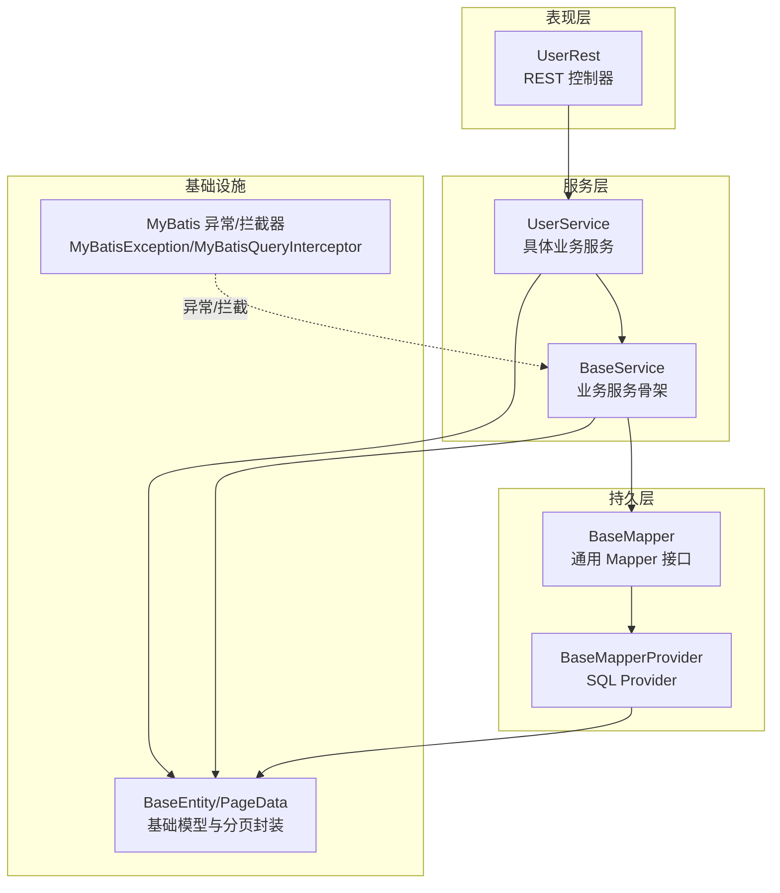
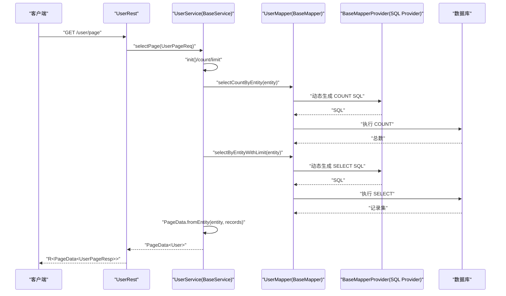
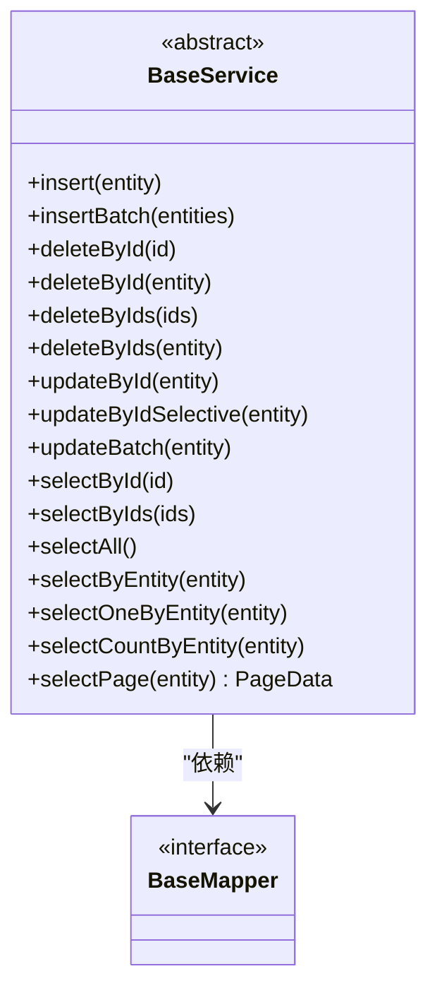
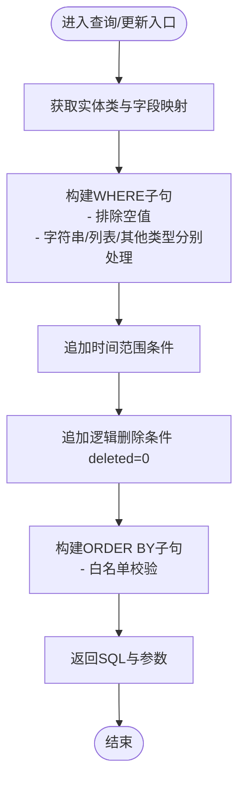
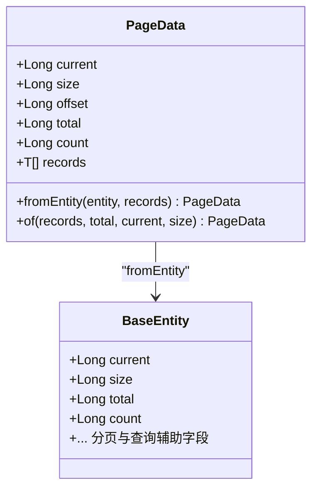
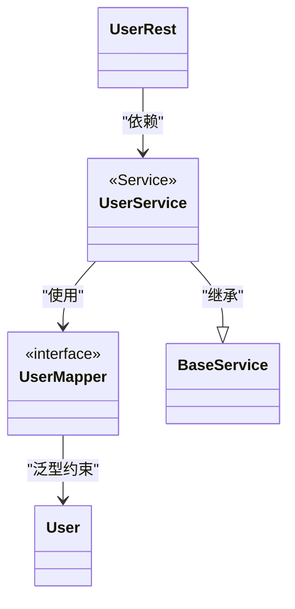
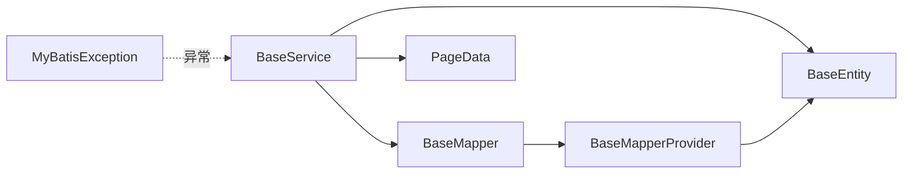

# 业务服务骨架

<cite>
**本文引用的文件**
- [BaseService.java](file://sh-mybatis/src/main/java/com/wkclz/mybatis/service/BaseService.java)
- [BaseMapper.java](file://sh-mybatis/src/main/java/com/wkclz/mybatis/mapper/BaseMapper.java)
- [BaseMapperProvider.java](file://sh-mybatis/src/main/java/com/wkclz/mybatis/mapper/impl/BaseMapperProvider.java)
- [BaseEntity.java](file://sh-core/src/main/java/com/wkclz/core/base/BaseEntity.java)
- [PageData.java](file://sh-core/src/main/java/com/wkclz/core/base/PageData.java)
- [UserService.java](file://sh-demo/src/main/java/com/wkclz/demo/service/UserService.java)
- [UserMapper.java](file://sh-demo/src/main/java/com/wkclz/demo/mapper/UserMapper.java)
- [User.java](file://sh-demo/src/main/java/com/wkclz/demo/bean/entity/User.java)
- [UserRest.java](file://sh-demo/src/main/java/com/wkclz/demo/rest/UserRest.java)
- [MyBatisException.java](file://sh-mybatis/src/main/java/com/wkclz/mybatis/exception/MyBatisException.java)
- [MyBatisQueryInterceptor.java](file://sh-mybatis/src/main/java/com/wkclz/mybatis/interceptor/MyBatisQueryInterceptor.java)
- [AGENTS.md](file://AGENTS.md)
</cite>

## 目录
1. [引言](#引言)
2. [项目结构](#项目结构)
3. [核心组件](#核心组件)
4. [架构总览](#架构总览)
5. [详细组件分析](#详细组件分析)
6. [依赖分析](#依赖分析)
7. [性能考量](#性能考量)
8. [故障排查指南](#故障排查指南)
9. [结论](#结论)
10. [附录](#附录)

## 引言
本文件围绕“业务服务骨架”展开，系统性阐述 BaseService 抽象类的设计思想、模板方法模式的应用方式，以及如何通过继承 BaseService 获得完整的单表 CRUD 业务能力。文档还深入说明 Service 层与 Mapper 层的协作关系与调用流程，并以 sh-demo 中的 UserService 为例，给出可复用的实现范式。最后总结事务管理、异常处理与方法重写最佳实践，以及服务层设计原则与扩展方法。

## 项目结构
本项目采用多模块分层组织，其中与“业务服务骨架”直接相关的模块包括：
- sh-core：基础实体、分页封装、异常体系等
- sh-mybatis：通用 Mapper 接口、BaseService 抽象类、SQL Provider 动态 SQL 生成
- sh-demo：示例业务（用户）的实体、Mapper、Service、REST 控制器

下面以概念图展示模块间关系与数据流向：

## 核心组件
本节聚焦 BaseService、BaseMapper、BaseEntity、PageData 的职责与协作方式。

- BaseService：提供单表 CRUD 的模板方法，内置分页封装、批量操作与事务注解，子类只需声明实体类型与 Mapper 接口即可获得完整能力。
- BaseMapper：定义单表基础操作契约，配合 SQL Provider 动态生成 SQL，屏蔽重复 SQL。
- BaseMapperProvider：负责反射解析实体、构建 WHERE/IN/ORDER BY 等子句，保证安全与一致性。
- BaseEntity/PageData：提供分页参数、审计字段与分页结果统一封装。
- 示例 UserService：通过继承 BaseService，零样板代码即具备 CRUD 能力；若需定制可在子类中重写特定方法。

章节来源
- [BaseService.java:13-214](file://sh-mybatis/src/main/java/com/wkclz/mybatis/service/BaseService.java#L13-L214)
- [BaseMapper.java:10-88](file://sh-mybatis/src/main/java/com/wkclz/mybatis/mapper/BaseMapper.java#L10-L88)
- [BaseMapperProvider.java:19-244](file://sh-mybatis/src/main/java/com/wkclz/mybatis/mapper/impl/BaseMapperProvider.java#L19-L244)
- [BaseEntity.java:11-94](file://sh-core/src/main/java/com/wkclz/core/base/BaseEntity.java#L11-L94)
- [PageData.java:8-185](file://sh-core/src/main/java/com/wkclz/core/base/PageData.java#L8-L185)

## 架构总览
下图展示一次典型“分页查询”的端到端流程，体现 Service 层与 Mapper 层的协作关系：

图表来源
- [UserRest.java:30-44](file://sh-demo/src/main/java/com/wkclz/demo/rest/UserRest.java#L30-L44)
- [BaseService.java:194-211](file://sh-mybatis/src/main/java/com/wkclz/mybatis/service/BaseService.java#L194-L211)
- [BaseMapper.java:76-86](file://sh-mybatis/src/main/java/com/wkclz/mybatis/mapper/BaseMapper.java#L76-L86)
- [BaseMapperProvider.java:124-178](file://sh-mybatis/src/main/java/com/wkclz/mybatis/mapper/impl/BaseMapperProvider.java#L124-L178)

## 详细组件分析

### BaseService 抽象类
- 设计思想
  - 模板方法模式：将“分页初始化、计数、查询、封装”等固定流程固化在父类，子类仅关注实体类型与 Mapper 接口。
  - 事务边界：类级别 @Transactional，确保 CRUD 在同一事务内执行，简化业务一致性。
  - 批量策略：insertBatch/updateBatch 内置分批处理，避免单次提交过大导致内存与性能问题。
- 关键方法
  - 插入：insert、insertBatch
  - 删除：deleteById、deleteByIds、deleteByIdEntity、deleteByIdsEntity
  - 更新：updateById、updateByIdSelective、updateBatch
  - 查询：selectById、selectByIds、selectAll、selectByEntity、selectOneByEntity、selectCountByEntity
  - 分页：selectPage（含 init、count、limit、PageData 封装）
- 扩展点
  - 子类可通过重写 selectPage 或新增方法，注入业务特有的过滤条件、排序或后处理逻辑。

图表来源
- [BaseService.java:21-214](file://sh-mybatis/src/main/java/com/wkclz/mybatis/service/BaseService.java#L21-L214)
- [BaseMapper.java:15-88](file://sh-mybatis/src/main/java/com/wkclz/mybatis/mapper/BaseMapper.java#L15-L88)

章节来源
- [BaseService.java:29-211](file://sh-mybatis/src/main/java/com/wkclz/mybatis/service/BaseService.java#L29-L211)

### BaseMapper 接口与 SQL Provider
- BaseMapper：定义单表基础操作契约，使用 @InsertProvider/@DeleteProvider/@UpdateProvider/@SelectProvider 指向对应 Provider 方法，实现“接口即契约、Provider 即 SQL”的解耦。
- BaseMapperProvider：负责反射解析实体、构建 WHERE/IN/ORDER BY 等子句，自动追加逻辑删除条件与安全校验，避免 SQL 注入风险。
- 关键特性
  - 自动排除空值字段（字符串空串、null）
  - IN 子句安全拼接
  - 排序字段白名单校验
  - 乐观锁字段参与更新（由拦截器/Provider 协作）

图表来源
- [BaseMapperProvider.java:124-178](file://sh-mybatis/src/main/java/com/wkclz/mybatis/mapper/impl/BaseMapperProvider.java#L124-L178)
- [BaseMapperProvider.java:189-242](file://sh-mybatis/src/main/java/com/wkclz/mybatis/mapper/impl/BaseMapperProvider.java#L189-L242)

章节来源
- [BaseMapper.java:17-86](file://sh-mybatis/src/main/java/com/wkclz/mybatis/mapper/BaseMapper.java#L17-L86)
- [BaseMapperProvider.java:25-89](file://sh-mybatis/src/main/java/com/wkclz/mybatis/mapper/impl/BaseMapperProvider.java#L25-L89)

### 分页封装 PageData
- PageData.fromEntity：将 BaseEntity 的分页参数与记录集封装为统一的分页结果对象，供上层控制器使用。
- BaseEntity.Pageable：提供 current/size/offset/total/count 等分页辅助字段，便于 Service 层统一处理。

图表来源
- [PageData.java:56-100](file://sh-core/src/main/java/com/wkclz/core/base/PageData.java#L56-L100)
- [BaseEntity.java:40-51](file://sh-core/src/main/java/com/wkclz/core/base/BaseEntity.java#L40-L51)

章节来源
- [PageData.java:14-185](file://sh-core/src/main/java/com/wkclz/core/base/PageData.java#L14-L185)
- [BaseEntity.java:11-94](file://sh-core/src/main/java/com/wkclz/core/base/BaseEntity.java#L11-L94)

### 示例：UserService 的实现范式
- 继承关系：UserService 仅需继承 BaseService<User, UserMapper>，即可获得完整的 CRUD 能力。
- Mapper 声明：UserMapper 继承 BaseMapper<User>，无需手写 SQL。
- 控制器对接：UserRest 将 VO/Req 转换为 User 实体，调用 UserService 的模板方法，再将结果转换为 VO/Resp。

图表来源
- [UserService.java:8-11](file://sh-demo/src/main/java/com/wkclz/demo/service/UserService.java#L8-L11)
- [UserMapper.java:7-9](file://sh-demo/src/main/java/com/wkclz/demo/mapper/UserMapper.java#L7-L9)
- [User.java:14](file://sh-demo/src/main/java/com/wkclz/demo/bean/entity/User.java#L14)
- [UserRest.java:27-28](file://sh-demo/src/main/java/com/wkclz/demo/rest/UserRest.java#L27-L28)

章节来源
- [UserService.java:1-12](file://sh-demo/src/main/java/com/wkclz/demo/service/UserService.java#L1-L12)
- [UserMapper.java:1-10](file://sh-demo/src/main/java/com/wkclz/demo/mapper/UserMapper.java#L1-L10)
- [User.java:1-28](file://sh-demo/src/main/java/com/wkclz/demo/bean/entity/User.java#L1-L28)
- [UserRest.java:30-89](file://sh-demo/src/main/java/com/wkclz/demo/rest/UserRest.java#L30-L89)

## 依赖分析
- 组件耦合
  - BaseService 与 BaseMapper：强契约依赖，通过泛型约束保证类型安全。
  - BaseMapper 与 BaseMapperProvider：Provider 负责 SQL 生成，接口与实现解耦。
  - Service 与 Entity/PageData：Service 层依赖 BaseEntity 的分页与查询辅助字段，输出 PageData 统一封装。
- 外部依赖
  - Spring 事务注解：@Transactional 提供事务边界。
  - MyBatis 拦截器链：参数预处理、自动填充、SQL 注入防护等。
  - 异常体系：MyBatisException 与全局异常处理器协同，保障异常可追踪与可控。

图表来源
- [BaseService.java:26-27](file://sh-mybatis/src/main/java/com/wkclz/mybatis/service/BaseService.java#L26-L27)
- [BaseMapper.java:15-88](file://sh-mybatis/src/main/java/com/wkclz/mybatis/mapper/BaseMapper.java#L15-L88)
- [BaseMapperProvider.java:25-28](file://sh-mybatis/src/main/java/com/wkclz/mybatis/mapper/impl/BaseMapperProvider.java#L25-L28)
- [PageData.java:56-61](file://sh-core/src/main/java/com/wkclz/core/base/PageData.java#L56-L61)
- [BaseEntity.java:11-12](file://sh-core/src/main/java/com/wkclz/core/base/BaseEntity.java#L11-L12)
- [MyBatisException.java:10-43](file://sh-mybatis/src/main/java/com/wkclz/mybatis/exception/MyBatisException.java#L10-L43)

章节来源
- [AGENTS.md:185-205](file://AGENTS.md#L185-L205)
- [MyBatisQueryInterceptor.java:37-79](file://sh-mybatis/src/main/java/com/wkclz/mybatis/interceptor/MyBatisQueryInterceptor.java#L37-L79)

## 性能考量
- 批量操作分批提交：BaseService.insertBatch/updateBatch 默认批次大小为 1000，避免单次提交过大引发内存压力与数据库锁竞争。
- 动态 SQL 安全：Provider 对 ORDER BY 进行白名单校验，避免 SQL 注入同时兼顾灵活性。
- 查询参数预处理：MyBatisQueryInterceptor 将空字符串转换为 null，减少无效条件带来的索引失效风险。
- 分页优化：先 count 再 limit，结合 BaseEntity 的分页字段，避免一次性加载大量数据。

章节来源
- [BaseService.java:23-24](file://sh-mybatis/src/main/java/com/wkclz/mybatis/service/BaseService.java#L23-L24)
- [BaseService.java:43-54](file://sh-mybatis/src/main/java/com/wkclz/mybatis/service/BaseService.java#L43-L54)
- [BaseMapperProvider.java:189-242](file://sh-mybatis/src/main/java/com/wkclz/mybatis/mapper/impl/BaseMapperProvider.java#L189-L242)
- [MyBatisQueryInterceptor.java:48-79](file://sh-mybatis/src/main/java/com/wkclz/mybatis/interceptor/MyBatisQueryInterceptor.java#L48-L79)

## 故障排查指南
- 常见异常来源
  - MyBatis 操作异常：MyBatisException 作为业务异常基类之一，统一承载数据库操作异常。
  - 全局异常处理：遵循 AGENTS.md 中的异常映射与处理策略，确保异常可追踪且不泄露敏感信息。
- 排查步骤
  - 确认 Service 是否处于 @Transactional 边界内，避免跨方法事务失效。
  - 检查 BaseEntity 的分页字段是否正确设置，避免 selectPage 结果异常。
  - 核对 SQL Provider 的 WHERE/IN/ORDER BY 生成逻辑，确认空值与时间范围条件是否符合预期。
  - 关注拦截器链路（参数预处理、自动填充），定位是否因参数转换导致查询条件异常。
- 最佳实践
  - 优先使用 updateByIdSelective 进行部分字段更新，降低锁冲突概率。
  - 对大事务拆分，避免长时间持锁影响并发。
  - 对外统一返回 PageData，便于前端分页与调试。

章节来源
- [MyBatisException.java:10-43](file://sh-mybatis/src/main/java/com/wkclz/mybatis/exception/MyBatisException.java#L10-L43)
- [AGENTS.md:390-404](file://AGENTS.md#L390-L404)
- [BaseService.java:194-211](file://sh-mybatis/src/main/java/com/wkclz/mybatis/service/BaseService.java#L194-L211)
- [BaseMapperProvider.java:124-178](file://sh-mybatis/src/main/java/com/wkclz/mybatis/mapper/impl/BaseMapperProvider.java#L124-L178)

## 结论
通过 BaseService 抽象类与 BaseMapper 接口的组合，实现了“零样板代码”的单表 CRUD 能力，配合分页封装与拦截器链路，既保证了开发效率，也兼顾了安全性与性能。示例 UserService 展示了最小化实现即可获得完整能力的范式。在实际项目中，建议遵循事务边界、异常分类与方法重写最佳实践，持续演进服务层设计。

## 附录
- 服务层设计原则
  - 单一职责：Service 专注业务编排，不直接处理 SQL。
  - 事务边界：将相关操作置于同一事务，确保一致性。
  - 可测试性：通过接口与泛型约束，便于单元测试与替换实现。
- 扩展方法
  - 重写 selectPage：注入业务过滤条件或排序。
  - 新增业务方法：在子类中添加领域方法，复用 BaseService 的 CRUD 能力。
  - 自定义异常：结合 MyBatisException 与全局异常处理器，形成一致的错误语义。