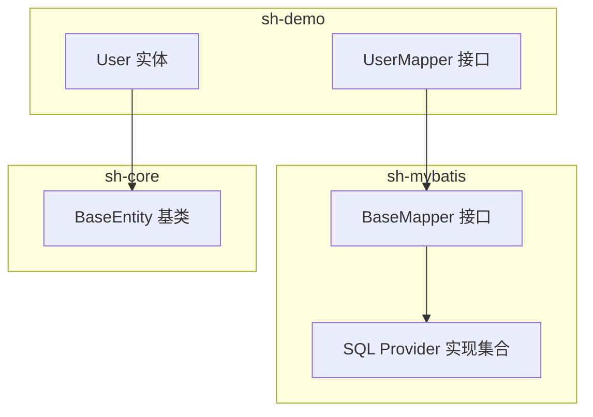
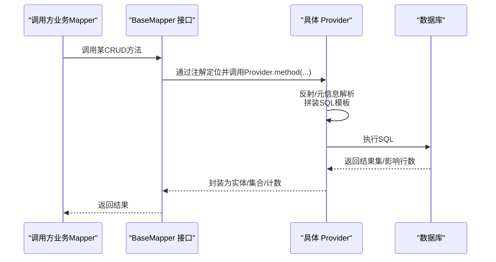
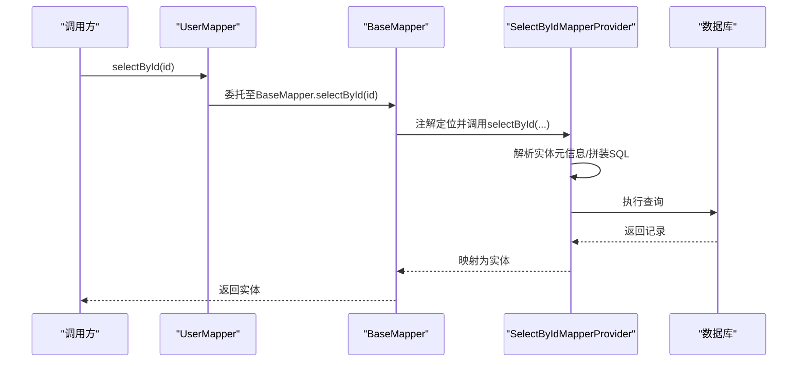
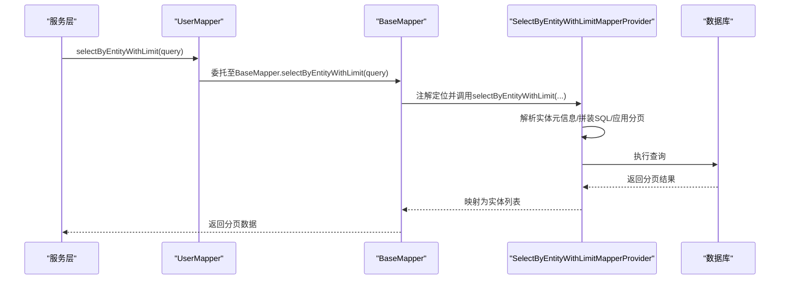
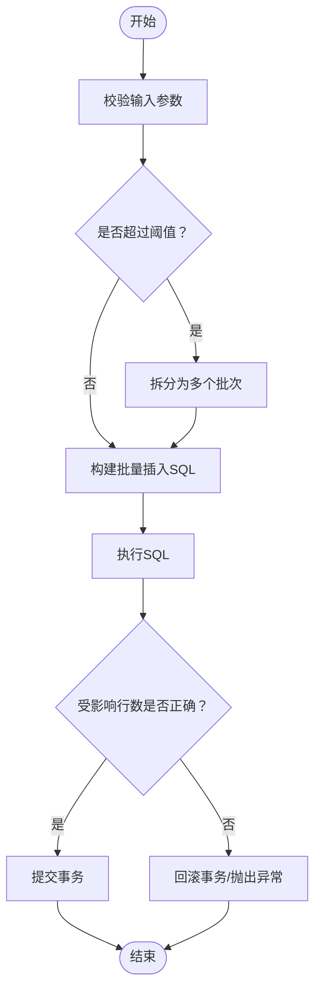
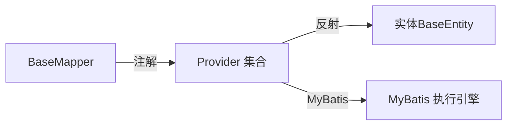

# 通用Mapper接口设计

<cite>
**本文引用的文件**
- [BaseMapper.java](file://sh-mybatis/src/main/java/com/wkclz/mybatis/mapper/BaseMapper.java)
- [UserMapper.java](file://sh-demo/src/main/java/com/wkclz/demo/mapper/UserMapper.java)
- [User.java](file://sh-demo/src/main/java/com/wkclz/demo/bean/entity/User.java)
- [BaseEntity.java](file://sh-core/src/main/java/com/wkclz/core/base/BaseEntity.java)
- [InsertMapperProvider.java](file://sh-mybatis/src/main/java/com/wkclz/mybatis/mapper/impl/InsertMapperProvider.java)
- [SelectByIdMapperProvider.java](file://sh-mybatis/src/main/java/com/wkclz/mybatis/mapper/impl/SelectByIdMapperProvider.java)
- [UpdateByIdMapperProvider.java](file://sh-mybatis/src/main/java/com/wkclz/mybatis/mapper/impl/UpdateByIdMapperProvider.java)
- [DeleteByIdMapperProvider.java](file://sh-mybatis/src/main/java/com/wkclz/mybatis/mapper/impl/DeleteByIdMapperProvider.java)
- [SelectByEntityMapperProvider.java](file://sh-mybatis/src/main/java/com/wkclz/mybatis/mapper/impl/SelectByEntityMapperProvider.java)
- [SelectAllMapperProvider.java](file://sh-mybatis/src/main/java/com/wkclz/mybatis/mapper/impl/SelectAllMapperProvider.java)
- [SelectCountByEntityMapperProvider.java](file://sh-mybatis/src/main/java/com/wkclz/mybatis/mapper/impl/SelectCountByEntityMapperProvider.java)
- [SelectOneByEntityMapperProvider.java](file://sh-mybatis/src/main/java/com/wkclz/mybatis/mapper/impl/SelectOneByEntityMapperProvider.java)
- [SelectByIdsMapperProvider.java](file://sh-mybatis/src/main/java/com/wkclz/mybatis/mapper/impl/SelectByIdsMapperProvider.java)
- [SelectByEntityWithLimitMapperProvider.java](file://sh-mybatis/src/main/java/com/wkclz/mybatis/mapper/impl/SelectByEntityWithLimitMapperProvider.java)
- [UpdateByIdSelectiveMapperProvider.java](file://sh-mybatis/src/main/java/com/wkclz/mybatis/mapper/impl/UpdateByIdSelectiveMapperProvider.java)
- [UpdateBatchMapperProvider.java](file://sh-mybatis/src/main/java/com/wkclz/mybatis/mapper/impl/UpdateBatchMapperProvider.java)
- [InsertBatchMapperProvider.java](file://sh-mybatis/src/main/java/com/wkclz/mybatis/mapper/impl/InsertBatchMapperProvider.java)
- [DeleteByIdsMapperProvider.java](file://sh-mybatis/src/main/java/com/wkclz/mybatis/mapper/impl/DeleteByIdsMapperProvider.java)
- [DeleteByIdEntityMapperProvider.java](file://sh-mybatis/src/main/java/com/wkclz/mybatis/mapper/impl/DeleteByIdEntityMapperProvider.java)
- [DeleteByIdsEntityMapperProvider.java](file://sh-mybatis/src/main/java/com/wkclz/mybatis/mapper/impl/DeleteByIdsEntityMapperProvider.java)
- [BaseMapperProvider.java](file://sh-mybatis/src/main/java/com/wkclz/mybatis/mapper/impl/BaseMapperProvider.java)
</cite>

## 目录
1. [引言](#引言)
2. [项目结构](#项目结构)
3. [核心组件](#核心组件)
4. [架构总览](#架构总览)
5. [详细组件分析](#详细组件分析)
6. [依赖分析](#依赖分析)
7. [性能考虑](#性能考虑)
8. [故障排查指南](#故障排查指南)
9. [结论](#结论)
10. [附录](#附录)

## 引言
本文件围绕通用Mapper接口设计展开，重点解析BaseMapper接口的设计理念与14种通用CRUD方法的职责边界，并结合SQL Provider机制说明注解驱动的动态SQL生成方式。文档同时阐述泛型设计与反射机制在类型安全CRUD中的作用，给出最佳实践与常见问题解决方案，并通过示例展示如何在业务实体中实现BaseMapper。

## 项目结构
- 通用Mapper位于 sh-mybatis 模块，接口定义于 com.wkclz.mybatis.mapper，配套的SQL Provider实现位于同包下的 impl 子包。
- 示例业务位于 sh-demo 模块，包含实体类与Mapper接口，用于演示如何继承与扩展通用能力。
- 核心基类 BaseEntity 位于 sh-core 模块，作为所有实体的父类，承载公共字段与行为。

图示来源
- [BaseMapper.java:15-88](file://sh-mybatis/src/main/java/com/wkclz/mybatis/mapper/BaseMapper.java#L15-L88)
- [UserMapper.java](file://sh-demo/src/main/java/com/wkclz/demo/mapper/UserMapper.java)
- [User.java](file://sh-demo/src/main/java/com/wkclz/demo/bean/entity/User.java)
- [BaseEntity.java](file://sh-core/src/main/java/com/wkclz/core/base/BaseEntity.java)

章节来源
- [BaseMapper.java:15-88](file://sh-mybatis/src/main/java/com/wkclz/mybatis/mapper/BaseMapper.java#L15-L88)
- [UserMapper.java](file://sh-demo/src/main/java/com/wkclz/demo/mapper/UserMapper.java)
- [User.java](file://sh-demo/src/main/java/com/wkclz/demo/bean/entity/User.java)
- [BaseEntity.java](file://sh-core/src/main/java/com/wkclz/core/base/BaseEntity.java)

## 核心组件
- BaseMapper<T extends BaseEntity>：定义了面向单表的14种通用CRUD方法，覆盖插入、批量插入、删除（单个/多个/按实体）、更新（全量/选择性/批量）、查询（单条/多条/全部/按条件/带分页/计数/唯一）等场景。
- SQL Provider：每个方法均通过 @InsertProvider/@DeleteProvider/@UpdateProvider/@SelectProvider 注解绑定到对应的Provider类，实现注解驱动的动态SQL生成。
- 泛型与反射：通过泛型约束实体类型，结合Provider内部的反射与元信息（如表名、字段映射）实现类型安全的CRUD。

章节来源
- [BaseMapper.java:15-88](file://sh-mybatis/src/main/java/com/wkclz/mybatis/mapper/BaseMapper.java#L15-L88)

## 架构总览
下图展示了调用方（业务Mapper）与通用Mapper及Provider之间的交互关系，体现“接口+注解+Provider”的解耦设计。

```mermaid
graph TB
Caller["业务 Mapper 接口<br/>如 UserMapper"]
BM["BaseMapper 接口"]
P1["InsertMapperProvider"]
P2["SelectByIdMapperProvider"]
P3["UpdateByIdMapperProvider"]
P4["DeleteByIdMapperProvider"]
P5["SelectByEntityMapperProvider"]
P6["SelectAllMapperProvider"]
P7["SelectCountByEntityMapperProvider"]
P8["SelectOneByEntityMapperProvider"]
P9["SelectByIdsMapperProvider"]
P10["SelectByEntityWithLimitMapperProvider"]
P11["UpdateByIdSelectiveMapperProvider"]
P12["UpdateBatchMapperProvider"]
P13["InsertBatchMapperProvider"]
P14["DeleteByIdsMapperProvider"]
P15["DeleteByIdEntityMapperProvider"]
P16["DeleteByIdsEntityMapperProvider"]
Caller --> BM
BM --> P1
BM --> P2
BM --> P3
BM --> P4
BM --> P5
BM --> P6
BM --> P7
BM --> P8
BM --> P9
BM --> P10
BM --> P11
BM --> P12
BM --> P13
BM --> P14
BM --> P15
BM --> P16
```

图示来源
- [BaseMapper.java:15-88](file://sh-mybatis/src/main/java/com/wkclz/mybatis/mapper/BaseMapper.java#L15-L88)
- [InsertMapperProvider.java](file://sh-mybatis/src/main/java/com/wkclz/mybatis/mapper/impl/InsertMapperProvider.java)
- [SelectByIdMapperProvider.java](file://sh-mybatis/src/main/java/com/wkclz/mybatis/mapper/impl/SelectByIdMapperProvider.java)
- [UpdateByIdMapperProvider.java](file://sh-mybatis/src/main/java/com/wkclz/mybatis/mapper/impl/UpdateByIdMapperProvider.java)
- [DeleteByIdMapperProvider.java](file://sh-mybatis/src/main/java/com/wkclz/mybatis/mapper/impl/DeleteByIdMapperProvider.java)
- [SelectByEntityMapperProvider.java](file://sh-mybatis/src/main/java/com/wkclz/mybatis/mapper/impl/SelectByEntityMapperProvider.java)
- [SelectAllMapperProvider.java](file://sh-mybatis/src/main/java/com/wkclz/mybatis/mapper/impl/SelectAllMapperProvider.java)
- [SelectCountByEntityMapperProvider.java](file://sh-mybatis/src/main/java/com/wkclz/mybatis/mapper/impl/SelectCountByEntityMapperProvider.java)
- [SelectOneByEntityMapperProvider.java](file://sh-mybatis/src/main/java/com/wkclz/mybatis/mapper/impl/SelectOneByEntityMapperProvider.java)
- [SelectByIdsMapperProvider.java](file://sh-mybatis/src/main/java/com/wkclz/mybatis/mapper/impl/SelectByIdsMapperProvider.java)
- [SelectByEntityWithLimitMapperProvider.java](file://sh-mybatis/src/main/java/com/wkclz/mybatis/mapper/impl/SelectByEntityWithLimitMapperProvider.java)
- [UpdateByIdSelectiveMapperProvider.java](file://sh-mybatis/src/main/java/com/wkclz/mybatis/mapper/impl/UpdateByIdSelectiveMapperProvider.java)
- [UpdateBatchMapperProvider.java](file://sh-mybatis/src/main/java/com/wkclz/mybatis/mapper/impl/UpdateBatchMapperProvider.java)
- [InsertBatchMapperProvider.java](file://sh-mybatis/src/main/java/com/wkclz/mybatis/mapper/impl/InsertBatchMapperProvider.java)
- [DeleteByIdsMapperProvider.java](file://sh-mybatis/src/main/java/com/wkclz/mybatis/mapper/impl/DeleteByIdsMapperProvider.java)
- [DeleteByIdEntityMapperProvider.java](file://sh-mybatis/src/main/java/com/wkclz/mybatis/mapper/impl/DeleteByIdEntityMapperProvider.java)
- [DeleteByIdsEntityMapperProvider.java](file://sh-mybatis/src/main/java/com/wkclz/mybatis/mapper/impl/DeleteByIdsEntityMapperProvider.java)

## 详细组件分析

### BaseMapper 接口方法详解
- 插入
  - insert(entity)：插入单条记录，返回受影响行数；主键生成策略由注解配置。
  - insertBatch(entities)：批量插入，需控制批次大小以避免单次过大。
- 删除
  - deleteById(id)、deleteByIdEntity(entity)：按ID删除单条；后者基于实体传参。
  - deleteByIds(ids)、deleteByIdsEntity(entity)：按ID列表批量删除；后者基于实体传参。
- 更新
  - updateById(entity)：按ID全量更新，通常配合乐观锁字段。
  - updateByIdSelective(entity)：按ID选择性更新（非空字段），通常配合乐观锁。
  - updateBatch(entity)：批量更新，不带乐观锁。
- 查询
  - selectById(id)：按ID查询单条。
  - selectByIds(ids)：按ID列表查询多条，不包含大字段。
  - selectAll()：查询全表，不包含大字段。
  - selectByEntity(entity)：按实体条件查询多条，不包含大字段。
  - selectByEntityWithLimit(entity)：按实体条件分页查询，不包含大字段。
  - selectCountByEntity(entity)：按实体条件统计数量。
  - selectOneByEntity(entity)：按实体条件查询单条，要求唯一，否则抛异常。

章节来源
- [BaseMapper.java:15-88](file://sh-mybatis/src/main/java/com/wkclz/mybatis/mapper/BaseMapper.java#L15-L88)

### SQL Provider 工作原理
- 注解驱动：每个方法通过 @InsertProvider/@DeleteProvider/@UpdateProvider/@SelectProvider 将SQL生成委托给对应Provider类。
- 动态SQL：Provider内部利用实体元信息（表名、字段映射、主键、乐观锁字段等）拼装SQL，保证类型安全与可维护性。
- 继承复用：各Provider类继承统一的基类，共享元信息解析与SQL模板构建逻辑。

图示来源
- [BaseMapper.java:15-88](file://sh-mybatis/src/main/java/com/wkclz/mybatis/mapper/BaseMapper.java#L15-L88)
- [BaseMapperProvider.java](file://sh-mybatis/src/main/java/com/wkclz/mybatis/mapper/impl/BaseMapperProvider.java)

### 泛型与反射的类型安全设计
- 泛型约束：T extends BaseEntity 确保所有实体具备统一的元信息与字段约定，便于Provider进行一致性的SQL生成。
- 反射与元信息：Provider通过反射读取实体类的表名、字段、主键、版本号（乐观锁）等信息，避免手写SQL带来的重复与错误。
- 类型安全：由于Provider对T进行统一处理，调用侧无需关心底层SQL细节，即可获得类型匹配的结果。

```mermaid
classDiagram
class BaseEntity {
+ "通用字段与行为"
}
class BaseMapper~T~ {
+ "14种CRUD方法"
}
class BaseMapperProvider {
+ "元信息解析"
+ "SQL模板构建"
}
class InsertMapperProvider
class SelectByIdMapperProvider
class UpdateByIdMapperProvider
class DeleteByIdMapperProvider
class SelectByEntityMapperProvider
class SelectAllMapperProvider
class SelectCountByEntityMapperProvider
class SelectOneByEntityMapperProvider
class SelectByIdsMapperProvider
class SelectByEntityWithLimitMapperProvider
class UpdateByIdSelectiveMapperProvider
class UpdateBatchMapperProvider
class InsertBatchMapperProvider
class DeleteByIdsMapperProvider
class DeleteByIdEntityMapperProvider
class DeleteByIdsEntityMapperProvider
BaseMapper~T~ --> BaseEntity : "泛型约束"
BaseMapperProvider <|-- InsertMapperProvider
BaseMapperProvider <|-- SelectByIdMapperProvider
BaseMapperProvider <|-- UpdateByIdMapperProvider
BaseMapperProvider <|-- DeleteByIdMapperProvider
BaseMapperProvider <|-- SelectByEntityMapperProvider
BaseMapperProvider <|-- SelectAllMapperProvider
BaseMapperProvider <|-- SelectCountByEntityMapperProvider
BaseMapperProvider <|-- SelectOneByEntityMapperProvider
BaseMapperProvider <|-- SelectByIdsMapperProvider
BaseMapperProvider <|-- SelectByEntityWithLimitMapperProvider
BaseMapperProvider <|-- UpdateByIdSelectiveMapperProvider
BaseMapperProvider <|-- UpdateBatchMapperProvider
BaseMapperProvider <|-- InsertBatchMapperProvider
BaseMapperProvider <|-- DeleteByIdsMapperProvider
BaseMapperProvider <|-- DeleteByIdEntityMapperProvider
BaseMapperProvider <|-- DeleteByIdsEntityMapperProvider
```

图示来源
- [BaseMapper.java:15-88](file://sh-mybatis/src/main/java/com/wkclz/mybatis/mapper/BaseMapper.java#L15-L88)
- [BaseEntity.java](file://sh-core/src/main/java/com/wkclz/core/base/BaseEntity.java)
- [BaseMapperProvider.java](file://sh-mybatis/src/main/java/com/wkclz/mybatis/mapper/impl/BaseMapperProvider.java)
- [InsertMapperProvider.java](file://sh-mybatis/src/main/java/com/wkclz/mybatis/mapper/impl/InsertMapperProvider.java)
- [SelectByIdMapperProvider.java](file://sh-mybatis/src/main/java/com/wkclz/mybatis/mapper/impl/SelectByIdMapperProvider.java)
- [UpdateByIdMapperProvider.java](file://sh-mybatis/src/main/java/com/wkclz/mybatis/mapper/impl/UpdateByIdMapperProvider.java)
- [DeleteByIdMapperProvider.java](file://sh-mybatis/src/main/java/com/wkclz/mybatis/mapper/impl/DeleteByIdMapperProvider.java)
- [SelectByEntityMapperProvider.java](file://sh-mybatis/src/main/java/com/wkclz/mybatis/mapper/impl/SelectByEntityMapperProvider.java)
- [SelectAllMapperProvider.java](file://sh-mybatis/src/main/java/com/wkclz/mybatis/mapper/impl/SelectAllMapperProvider.java)
- [SelectCountByEntityMapperProvider.java](file://sh-mybatis/src/main/java/com/wkclz/mybatis/mapper/impl/SelectCountByEntityMapperProvider.java)
- [SelectOneByEntityMapperProvider.java](file://sh-mybatis/src/main/java/com/wkclz/mybatis/mapper/impl/SelectOneByEntityMapperProvider.java)
- [SelectByIdsMapperProvider.java](file://sh-mybatis/src/main/java/com/wkclz/mybatis/mapper/impl/SelectByIdsMapperProvider.java)
- [SelectByEntityWithLimitMapperProvider.java](file://sh-mybatis/src/main/java/com/wkclz/mybatis/mapper/impl/SelectByEntityWithLimitMapperProvider.java)
- [UpdateByIdSelectiveMapperProvider.java](file://sh-mybatis/src/main/java/com/wkclz/mybatis/mapper/impl/UpdateByIdSelectiveMapperProvider.java)
- [UpdateBatchMapperProvider.java](file://sh-mybatis/src/main/java/com/wkclz/mybatis/mapper/impl/UpdateBatchMapperProvider.java)
- [InsertBatchMapperProvider.java](file://sh-mybatis/src/main/java/com/wkclz/mybatis/mapper/impl/InsertBatchMapperProvider.java)
- [DeleteByIdsMapperProvider.java](file://sh-mybatis/src/main/java/com/wkclz/mybatis/mapper/impl/DeleteByIdsMapperProvider.java)
- [DeleteByIdEntityMapperProvider.java](file://sh-mybatis/src/main/java/com/wkclz/mybatis/mapper/impl/DeleteByIdEntityMapperProvider.java)
- [DeleteByIdsEntityMapperProvider.java](file://sh-mybatis/src/main/java/com/wkclz/mybatis/mapper/impl/DeleteByIdsEntityMapperProvider.java)

### 典型流程：按ID查询

图示来源
- [BaseMapper.java:60-66](file://sh-mybatis/src/main/java/com/wkclz/mybatis/mapper/BaseMapper.java#L60-L66)
- [SelectByIdMapperProvider.java](file://sh-mybatis/src/main/java/com/wkclz/mybatis/mapper/impl/SelectByIdMapperProvider.java)

### 典型流程：按实体条件查询（含分页）

图示来源
- [BaseMapper.java:76-78](file://sh-mybatis/src/main/java/com/wkclz/mybatis/mapper/BaseMapper.java#L76-L78)
- [SelectByEntityWithLimitMapperProvider.java](file://sh-mybatis/src/main/java/com/wkclz/mybatis/mapper/impl/SelectByEntityWithLimitMapperProvider.java)

### 典型流程：批量插入

图示来源
- [BaseMapper.java:22-24](file://sh-mybatis/src/main/java/com/wkclz/mybatis/mapper/BaseMapper.java#L22-L24)
- [InsertBatchMapperProvider.java](file://sh-mybatis/src/main/java/com/wkclz/mybatis/mapper/impl/InsertBatchMapperProvider.java)

### 在业务实体中实现BaseMapper
- 定义实体类：继承 BaseEntity，确保具备统一的元信息基础。
- 定义Mapper接口：声明业务专属方法，并继承 BaseMapper<T>，从而自动获得14种通用CRUD能力。
- 示例参考：sh-demo 模块中的 UserMapper 与 User 实体，展示如何在实际项目中落地。

章节来源
- [UserMapper.java](file://sh-demo/src/main/java/com/wkclz/demo/mapper/UserMapper.java)
- [User.java](file://sh-demo/src/main/java/com/wkclz/demo/bean/entity/User.java)
- [BaseEntity.java](file://sh-core/src/main/java/com/wkclz/core/base/BaseEntity.java)

## 依赖分析
- 耦合度：BaseMapper 与 Provider 之间通过注解解耦；Provider 与实体之间通过泛型与反射耦合，但对上层调用透明。
- 外部依赖：MyBatis 注解驱动与类型处理器；实体需遵循 BaseEntity 约定。
- 潜在风险：Provider 的SQL拼装复杂度随实体字段增多而上升，应通过合理的分页与字段选择规避大字段传输。

图示来源
- [BaseMapper.java:15-88](file://sh-mybatis/src/main/java/com/wkclz/mybatis/mapper/BaseMapper.java#L15-L88)
- [BaseMapperProvider.java](file://sh-mybatis/src/main/java/com/wkclz/mybatis/mapper/impl/BaseMapperProvider.java)

## 性能考虑
- 分批批量操作：insertBatch/updateBatch 应合理设置批次大小，避免单次SQL过长或内存压力过大。
- 大字段规避：查询接口默认不包含大字段，避免不必要的网络与内存开销。
- 分页查询：selectByEntityWithLimit 支持分页，建议在高基数表上优先使用。
- 乐观锁：updateById 与 updateByIdSelective 建议配合版本号字段，减少冲突与无效更新。
- 索引与条件：selectByEntity/selectOneByEntity 的条件应尽量命中索引，避免全表扫描。

## 故障排查指南
- SQL生成异常：检查实体是否正确继承 BaseEntity，字段命名与表映射是否符合Provider预期。
- 主键生成失败：确认 insert 方法的主键生成策略配置与数据库主键设置一致。
- 并发更新冲突：若使用乐观锁，请确保版本号字段存在且更新逻辑正确。
- 大量数据插入失败：适当降低 insertBatch 的批次大小，或改用流式/异步写入策略。
- 条件查询结果非唯一：selectOneByEntity 要求唯一性，若存在重复请优化条件或添加唯一索引。

## 结论
BaseMapper 通过“接口+注解+Provider”的组合，实现了面向单表的14种通用CRUD能力，借助泛型与反射保障类型安全与可维护性。SQL Provider机制让动态SQL生成与业务逻辑解耦，既降低了重复劳动，也提升了扩展性。结合分页、批量与乐观锁等特性，可在保证性能与一致性的同时，快速支撑各类业务场景。

## 附录
- 最佳实践
  - 统一继承 BaseEntity，确保Provider可解析的元信息完整。
  - 对高基数表优先使用分页查询与条件过滤。
  - 批量操作控制批次大小，避免数据库压力峰值。
  - 使用选择性更新与乐观锁，提升并发安全性。
- 常见问题
  - “找不到Provider”：确认注解中的 type/method 与Provider类签名一致。
  - “SQL语法错误”：检查实体字段与表结构映射，尤其是关键字转义与大小写。
  - “查询结果为空”：确认条件字段与索引匹配，必要时添加索引或调整查询语义。