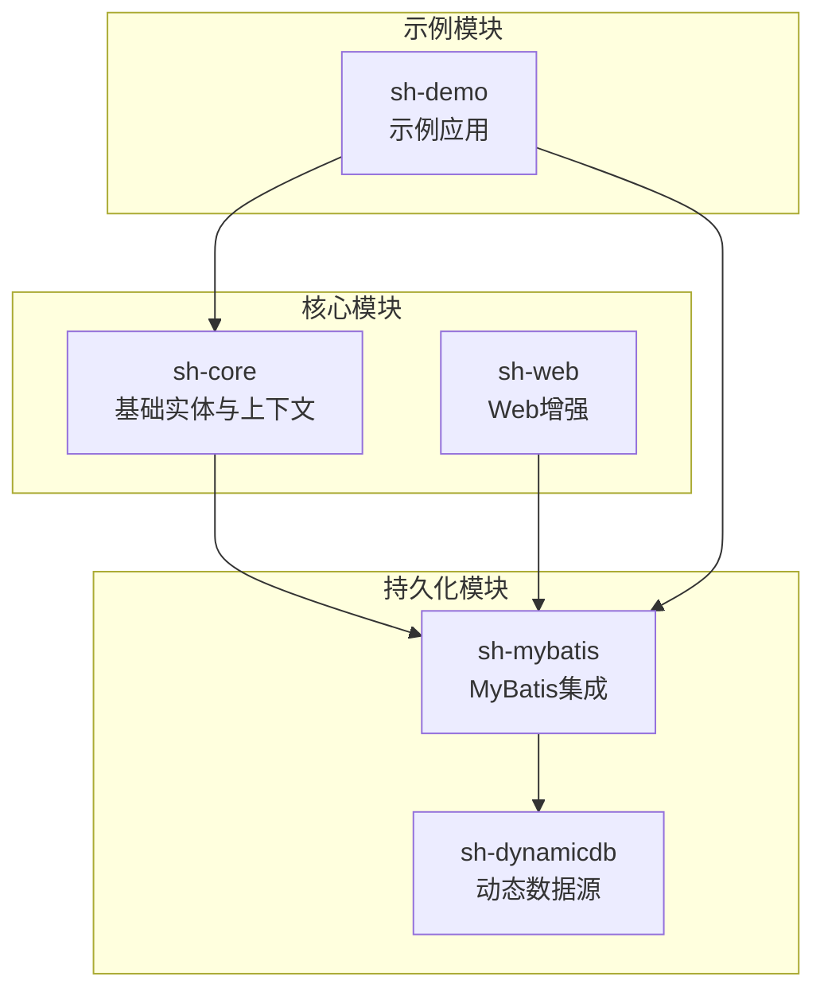
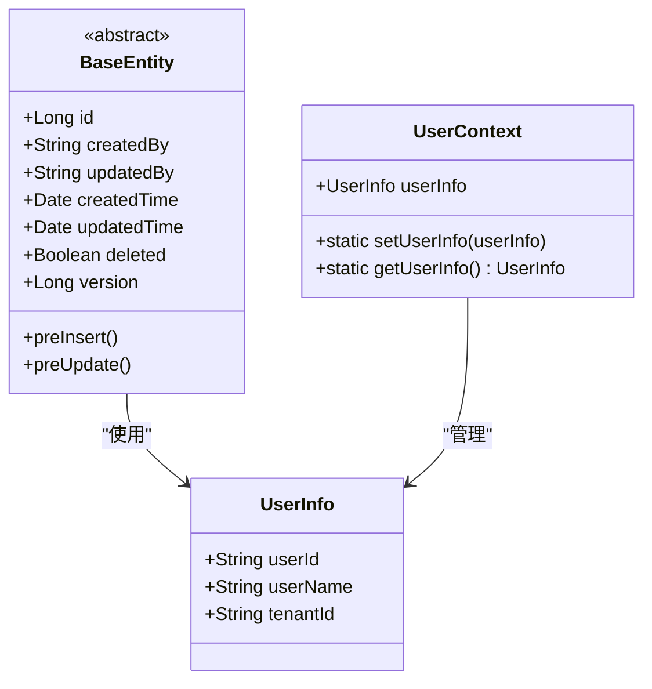
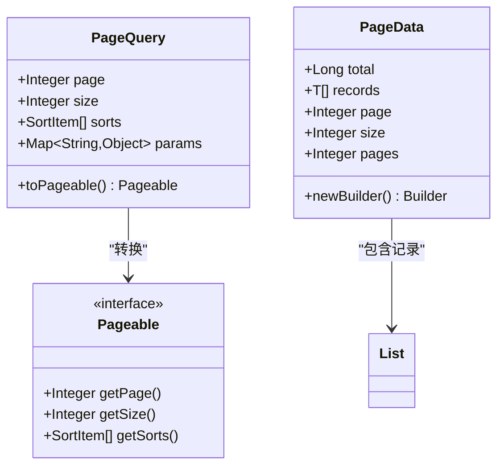
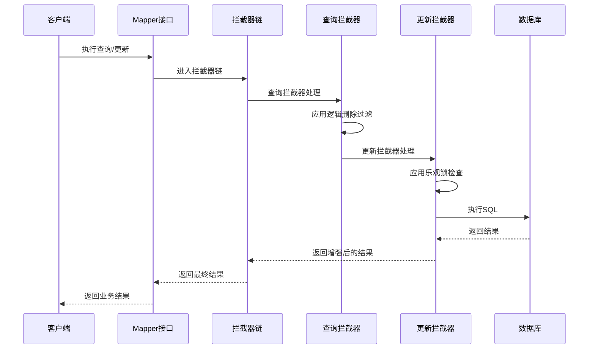
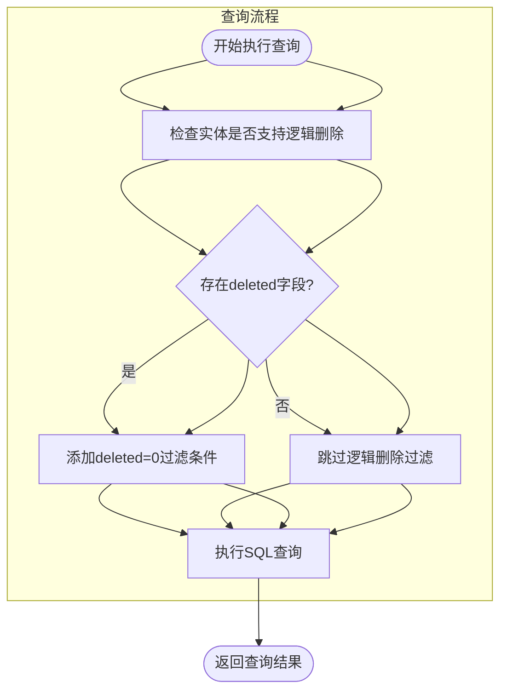
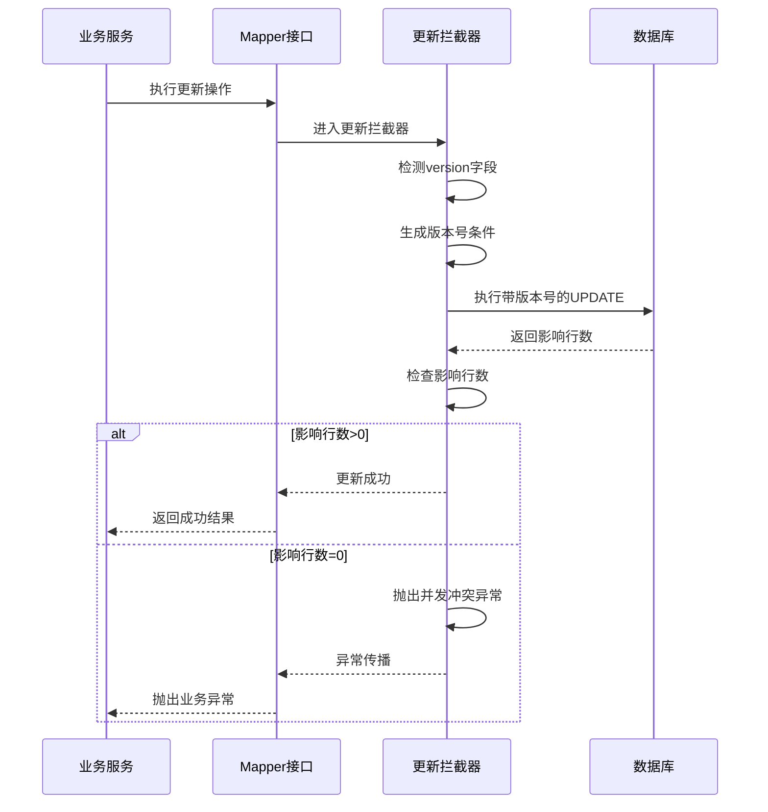
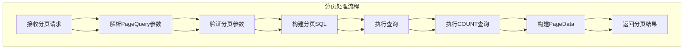
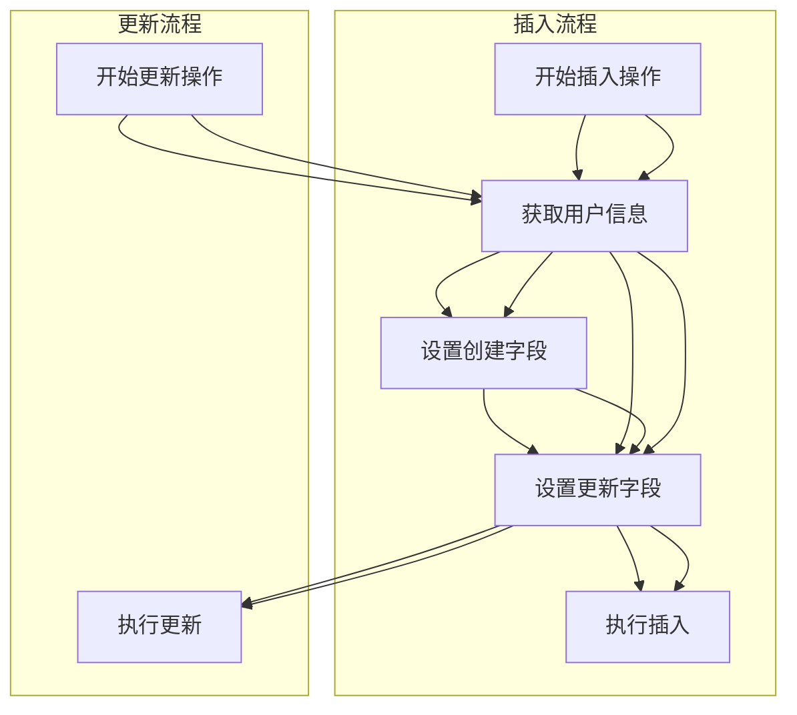
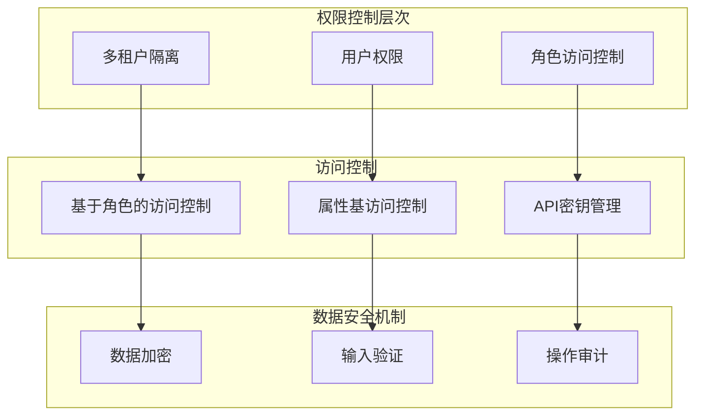
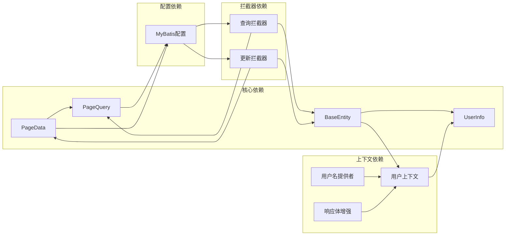

# 高级特性实现

<cite>
**本文档引用的文件**
- [BaseEntity.java](file://sh-core/src/main/java/com/wkclz/core/base/BaseEntity.java)
- [PageData.java](file://sh-core/src/main/java/com/wkclz/core/base/PageData.java)
- [PageQuery.java](file://sh-mybatis/src/main/java/com/wkclz/mybatis/helper/PageQuery.java)
- [MyBatisQueryInterceptor.java](file://sh-mybatis/src/main/java/com/wkclz/mybatis/interceptor/MyBatisQueryInterceptor.java)
- [MyBatisUpdateInterceptor.java](file://sh-mybatis/src/main/java/com/wkclz/mybatis/interceptor/MyBatisUpdateInterceptor.java)
- [ShMyBatisConfig.java](file://sh-mybatis/src/main/java/com/wkclz/mybatis/config/ShMyBatisConfig.java)
- [UserInfo.java](file://sh-core/src/main/java/com/wkclz/core/base/UserInfo.java)
- [UserContext.java](file://sh-core/src/main/java/com/wkclz/core/user/UserContext.java)
- [UserNameProvider.java](file://sh-core/src/main/java/com/wkclz/core/spi/UserNameProvider.java)
- [UserNameBodyAdvice.java](file://sh-web/src/main/java/com/wkclz/web/rest/UserNameBodyAdvice.java)
- [User.java](file://sh-demo/src/main/java/com/wkclz/demo/bean/entity/User.java)
- [UserMapper.java](file://sh-demo/src/main/java/com/wkclz/demo/mapper/UserMapper.java)
- [UserRest.java](file://sh-demo/src/main/java/com/wkclz/demo/rest/UserRest.java)
- [application.yml](file://sh-demo/src/main/resources/config/application.yml)
</cite>

## 目录
1. [简介](#简介)
2. [项目结构](#项目结构)
3. [核心组件](#核心组件)
4. [架构概览](#架构概览)
5. [详细组件分析](#详细组件分析)
6. [依赖关系分析](#依赖关系分析)
7. [性能考虑](#性能考虑)
8. [故障排除指南](#故障排除指南)
9. [结论](#结论)
10. [附录](#附录)

## 简介
本文件为ORM模块的高级特性实现文档，涵盖逻辑删除、乐观锁、分页查询、自动填充审计字段等核心功能。通过分析代码库中的实际实现，提供完整的使用示例、配置方法、性能优化建议和最佳实践指南。

## 项目结构
项目采用多模块架构，ORM相关功能主要分布在以下模块中：
- sh-core：基础实体类、分页封装、用户上下文等核心基础设施
- sh-mybatis：MyBatis集成、拦截器、分页查询辅助类
- sh-web：Web层增强、响应体自动填充
- sh-demo：示例应用，展示完整用法

**图表来源**
- [BaseEntity.java](file://sh-core/src/main/java/com/wkclz/core/base/BaseEntity.java)
- [ShMyBatisConfig.java](file://sh-mybatis/src/main/java/com/wkclz/mybatis/config/ShMyBatisConfig.java)

**章节来源**
- [BaseEntity.java](file://sh-core/src/main/java/com/wkclz/core/base/BaseEntity.java)
- [PageData.java](file://sh-core/src/main/java/com/wkclz/core/base/PageData.java)
- [PageQuery.java](file://sh-mybatis/src/main/java/com/wkclz/mybatis/helper/PageQuery.java)

## 核心组件
本节介绍ORM模块的关键组件及其职责分工。

### 基础实体类体系
基础实体类提供了统一的业务模型基类，支持审计字段自动填充和逻辑删除功能。

**图表来源**
- [BaseEntity.java](file://sh-core/src/main/java/com/wkclz/core/base/BaseEntity.java)
- [UserInfo.java](file://sh-core/src/main/java/com/wkclz/core/base/UserInfo.java)
- [UserContext.java](file://sh-core/src/main/java/com/wkclz/core/user/UserContext.java)

### 分页数据封装
分页查询通过PageQuery和PageData实现完整的分页功能，支持排序、条件查询和数据封装。

**图表来源**
- [PageQuery.java](file://sh-mybatis/src/main/java/com/wkclz/mybatis/helper/PageQuery.java)
- [PageData.java](file://sh-core/src/main/java/com/wkclz/core/base/PageData.java)

**章节来源**
- [BaseEntity.java](file://sh-core/src/main/java/com/wkclz/core/base/BaseEntity.java)
- [PageData.java](file://sh-core/src/main/java/com/wkclz/core/base/PageData.java)
- [PageQuery.java](file://sh-mybatis/src/main/java/com/wkclz/mybatis/helper/PageQuery.java)

## 架构概览
ORM模块采用拦截器模式实现高级特性，通过MyBatis拦截器在SQL执行前后进行增强处理。

**图表来源**
- [MyBatisQueryInterceptor.java](file://sh-mybatis/src/main/java/com/wkclz/mybatis/interceptor/MyBatisQueryInterceptor.java)
- [MyBatisUpdateInterceptor.java](file://sh-mybatis/src/main/java/com/wkclz/mybatis/interceptor/MyBatisUpdateInterceptor.java)

## 详细组件分析

### 逻辑删除机制实现
逻辑删除通过拦截器在查询时自动添加删除条件，在更新时避免更新已删除记录。

**图表来源**
- [MyBatisQueryInterceptor.java](file://sh-mybatis/src/main/java/com/wkclz/mybatis/interceptor/MyBatisQueryInterceptor.java)
- [BaseEntity.java](file://sh-core/src/main/java/com/wkclz/core/base/BaseEntity.java)

#### 实现要点
- **字段识别**：通过反射检测实体类的deleted字段，自动应用逻辑删除过滤
- **查询过滤**：在WHERE子句中自动添加deleted=0条件，确保只查询未删除记录
- **安全性**：避免误删数据，支持数据恢复和审计追踪

**章节来源**
- [MyBatisQueryInterceptor.java](file://sh-mybatis/src/main/java/com/wkclz/mybatis/interceptor/MyBatisQueryInterceptor.java)
- [BaseEntity.java](file://sh-core/src/main/java/com/wkclz/core/base/BaseEntity.java)

### 乐观锁实现机制
乐观锁通过版本号字段防止并发更新冲突，确保数据一致性。

**图表来源**
- [MyBatisUpdateInterceptor.java](file://sh-mybatis/src/main/java/com/wkclz/mybatis/interceptor/MyBatisUpdateInterceptor.java)
- [BaseEntity.java](file://sh-core/src/main/java/com/wkclz/core/base/BaseEntity.java)

#### 实现策略
- **版本号检测**：自动识别实体类中的version字段
- **条件构建**：在WHERE子句中添加version=当前值的条件
- **冲突处理**：当UPDATE影响行数为0时，抛出并发冲突异常
- **原子性保证**：通过单条SQL语句实现版本检查和更新

**章节来源**
- [MyBatisUpdateInterceptor.java](file://sh-mybatis/src/main/java/com/wkclz/mybatis/interceptor/MyBatisUpdateInterceptor.java)
- [BaseEntity.java](file://sh-core/src/main/java/com/wkclz/core/base/BaseEntity.java)

### 分页查询完整实现
分页查询从PageQuery到PageData的完整数据封装流程。

**图表来源**
- [PageQuery.java](file://sh-mybatis/src/main/java/com/wkclz/mybatis/helper/PageQuery.java)
- [PageData.java](file://sh-core/src/main/java/com/wkclz/core/base/PageData.java)

#### 关键特性
- **参数验证**：自动验证页码、每页大小等参数的有效性
- **SQL构建**：根据排序规则和查询条件构建分页SQL
- **数据封装**：将查询结果和统计信息封装到PageData对象
- **兼容性**：支持多种数据库方言的分页语法

**章节来源**
- [PageQuery.java](file://sh-mybatis/src/main/java/com/wkclz/mybatis/helper/PageQuery.java)
- [PageData.java](file://sh-core/src/main/java/com/wkclz/core/base/PageData.java)

### 自动填充审计字段实现
审计字段的自动填充通过拦截器在插入和更新时自动设置相关信息。

**图表来源**
- [MyBatisUpdateInterceptor.java](file://sh-mybatis/src/main/java/com/wkclz/mybatis/interceptor/MyBatisUpdateInterceptor.java)
- [UserContext.java](file://sh-core/src/main/java/com/wkclz/core/user/UserContext.java)

#### 实现机制
- **用户上下文**：通过UserContext获取当前登录用户信息
- **字段映射**：自动识别实体类中的审计字段并填充相应值
- **时间戳**：创建时间和更新时间自动设置为当前时间
- **线程安全**：使用ThreadLocal确保多线程环境下的数据隔离

**章节来源**
- [MyBatisUpdateInterceptor.java](file://sh-mybatis/src/main/java/com/wkclz/mybatis/interceptor/MyBatisUpdateInterceptor.java)
- [UserContext.java](file://sh-core/src/main/java/com/wkclz/core/user/UserContext.java)
- [UserInfo.java](file://sh-core/src/main/java/com/wkclz/core/base/UserInfo.java)

### 数据安全与权限控制
系统通过多种机制确保数据安全和权限控制。

**图表来源**
- [UserContext.java](file://sh-core/src/main/java/com/wkclz/core/user/UserContext.java)
- [UserInfo.java](file://sh-core/src/main/java/com/wkclz/core/base/UserInfo.java)

## 依赖关系分析

**图表来源**
- [BaseEntity.java](file://sh-core/src/main/java/com/wkclz/core/base/BaseEntity.java)
- [PageData.java](file://sh-core/src/main/java/com/wkclz/core/base/PageData.java)
- [PageQuery.java](file://sh-mybatis/src/main/java/com/wkclz/mybatis/helper/PageQuery.java)
- [ShMyBatisConfig.java](file://sh-mybatis/src/main/java/com/wkclz/mybatis/config/ShMyBatisConfig.java)

**章节来源**
- [ShMyBatisConfig.java](file://sh-mybatis/src/main/java/com/wkclz/mybatis/config/ShMyBatisConfig.java)
- [UserNameProvider.java](file://sh-core/src/main/java/com/wkclz/core/spi/UserNameProvider.java)

## 性能考虑
基于代码实现分析，提出以下性能优化建议：

### SQL优化策略
- **索引设计**：为逻辑删除字段、版本号字段建立适当索引
- **查询优化**：避免SELECT *，只选择必要字段
- **批量操作**：使用批量插入和批量更新提升性能

### 缓存策略
- **查询缓存**：对频繁查询的结果进行缓存
- **元数据缓存**：缓存表结构和实体映射信息
- **会话管理**：合理管理数据库连接池

### 并发控制
- **锁粒度**：根据业务场景选择合适的锁策略
- **超时设置**：合理设置数据库操作超时时间
- **重试机制**：实现幂等操作和失败重试

## 故障排除指南

### 常见问题诊断
1. **逻辑删除不生效**
   - 检查实体类是否正确继承BaseEntity
   - 验证deleted字段命名是否符合约定
   - 确认拦截器配置是否正确

2. **乐观锁冲突**
   - 检查version字段是否正确设置
   - 验证并发更新场景的处理逻辑
   - 查看异常堆栈信息定位冲突点

3. **分页查询异常**
   - 验证PageQuery参数的有效性
   - 检查SQL方言配置
   - 确认数据库连接状态

### 调试技巧
- 启用MyBatis日志输出SQL执行详情
- 使用ThreadLocal跟踪用户上下文信息
- 监控数据库连接池使用情况

**章节来源**
- [MyBatisQueryInterceptor.java](file://sh-mybatis/src/main/java/com/wkclz/mybatis/interceptor/MyBatisQueryInterceptor.java)
- [MyBatisUpdateInterceptor.java](file://sh-mybatis/src/main/java/com/wkclz/mybatis/interceptor/MyBatisUpdateInterceptor.java)

## 结论
本ORM模块通过拦截器模式实现了完整的高级特性集合，包括逻辑删除、乐观锁、分页查询和审计字段自动填充。系统具有良好的扩展性和可维护性，能够满足企业级应用的需求。建议在生产环境中结合具体的业务场景进行适当的性能调优和安全加固。

## 附录

### 使用示例配置
完整的使用示例可在示例模块中找到，展示了从实体定义到服务调用的完整流程。

**章节来源**
- [User.java](file://sh-demo/src/main/java/com/wkclz/demo/bean/entity/User.java)
- [UserMapper.java](file://sh-demo/src/main/java/com/wkclz/demo/mapper/UserMapper.java)
- [UserRest.java](file://sh-demo/src/main/java/com/wkclz/demo/rest/UserRest.java)
- [application.yml](file://sh-demo/src/main/resources/config/application.yml)

### 最佳实践建议
1. **实体设计**：所有业务实体应继承BaseEntity以获得统一的高级特性
2. **字段命名**：严格遵循字段命名约定，确保拦截器正确识别
3. **异常处理**：合理处理并发冲突和业务异常
4. **性能监控**：建立完善的性能监控和日志记录机制
5. **安全防护**：实施多层次的安全防护措施