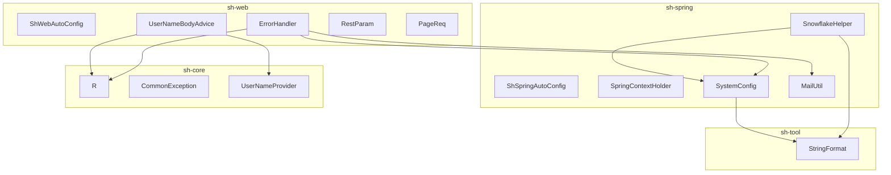
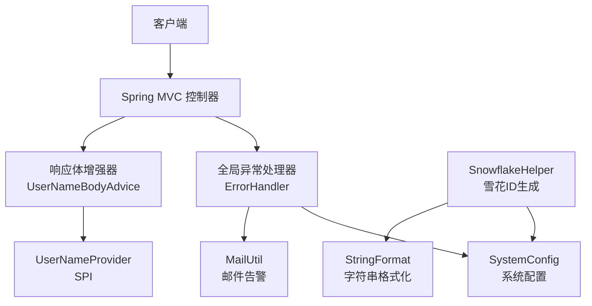
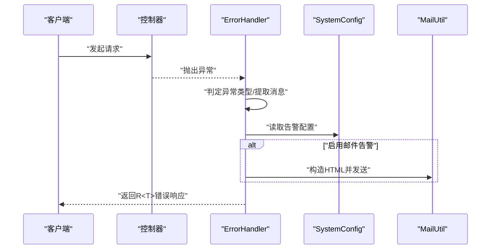
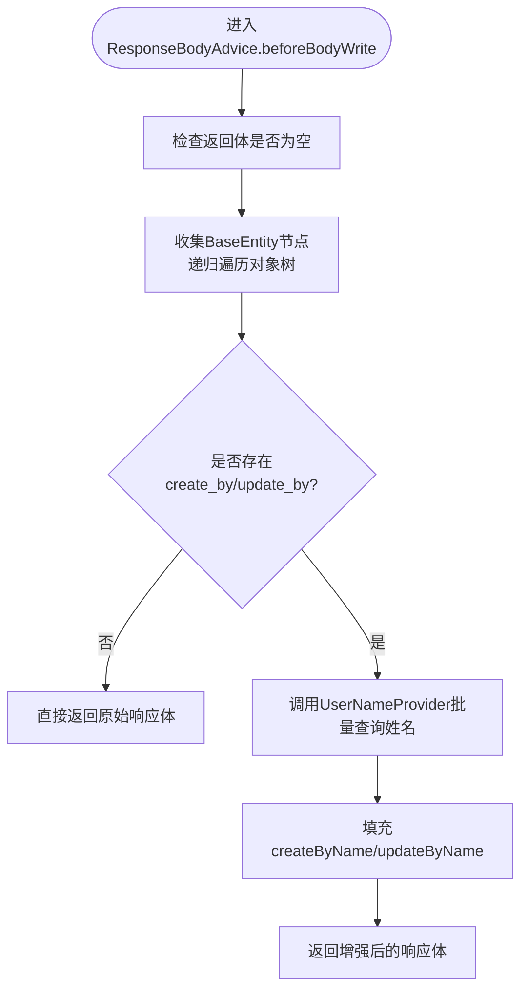
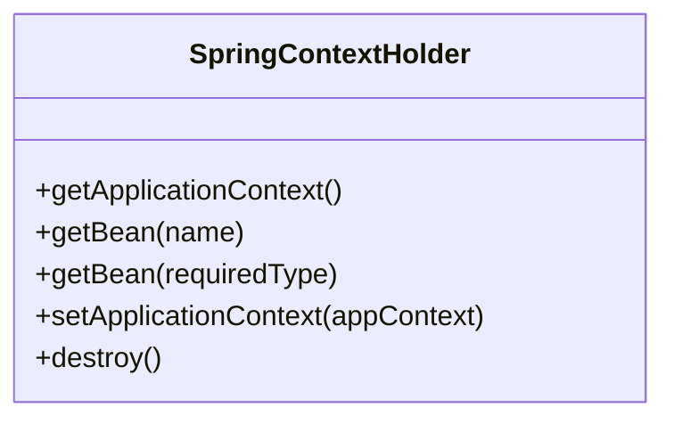
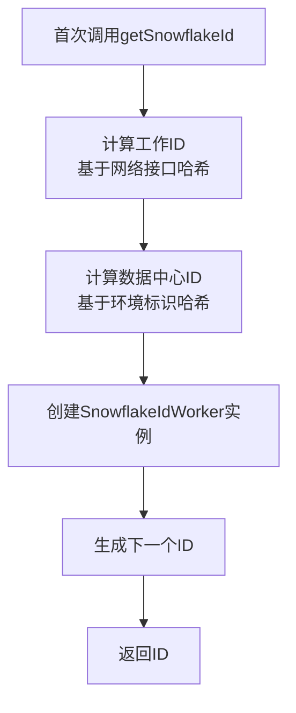
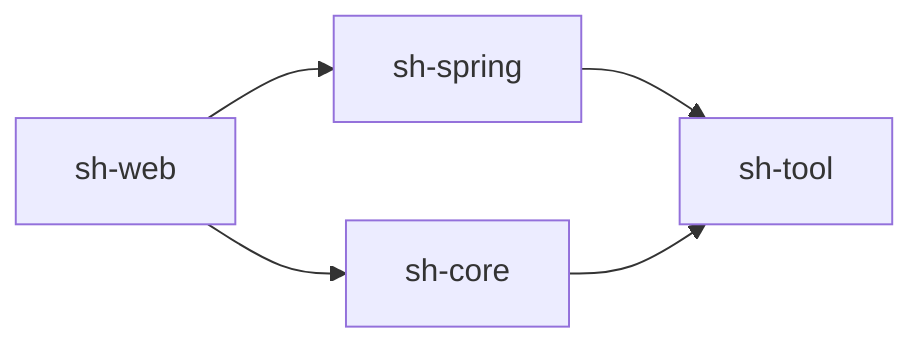

# Web集成模块（sh-web & sh-spring）

<cite>
**本文引用的文件**
- [sh-web 模块自动装配](file://sh-web/src/main/java/com/wkclz/web/ShWebAutoConfig.java)
- [全局异常处理器](file://sh-web/src/main/java/com/wkclz/web/rest/ErrorHandler.java)
- [统一响应体增强器](file://sh-web/src/main/java/com/wkclz/web/rest/UserNameBodyAdvice.java)
- [REST 参数元数据模型](file://sh-web/src/main/java/com/wkclz/web/bean/RestParam.java)
- [分页请求模型](file://sh-web/src/main/java/com/wkclz/web/bean/PageReq.java)
- [sh-spring 模块自动装配](file://sh-spring/src/main/java/com/wkclz/spring/ShSpringAutoConfig.java)
- [Spring 上下文持有器](file://sh-spring/src/main/java/com/wkclz/spring/config/SpringContextHolder.java)
- [系统配置与敏感配置解密](file://sh-spring/src/main/java/com/wkclz/spring/config/SystemConfig.java)
- [雪花 ID 助手](file://sh-spring/src/main/java/com/wkclz/spring/helper/SnowflakeHelper.java)
- [邮件工具](file://sh-spring/src/main/java/com/wkclz/spring/utils/MailUtil.java)
- [统一响应封装 R<T>](file://sh-core/src/main/java/com/wkclz/core/base/R.java)
- [业务异常基类](file://sh-core/src/main/java/com/wkclz/core/exception/CommonException.java)
- [用户名提供 SPI](file://sh-core/src/main/java/com/wkclz/core/spi/UserNameProvider.java)
- [字符串格式化工具](file://sh-tool/src/main/java/com/wkclz/tool/utils/StringFormat.java)
</cite>

## 目录
1. [简介](#简介)
2. [项目结构](#项目结构)
3. [核心组件](#核心组件)
4. [架构总览](#架构总览)
5. [组件详解](#组件详解)
6. [依赖关系分析](#依赖关系分析)
7. [性能与可维护性](#性能与可维护性)
8. [故障排查指南](#故障排查指南)
9. [结论](#结论)
10. [附录](#附录)

## 简介
本文件面向 sh-web 与 sh-spring 两大模块，系统化梳理 Web 层的全局异常处理、统一响应封装与用户名自动填充、REST 元数据与参数校验、以及 sh-spring 的 Spring 上下文持有器、雪花 ID 分布式生成、系统配置与敏感信息解密、邮件告警等能力。文档同时给出架构图、调用流程与时序图，并提供最佳实践与集成示例指引。

## 项目结构
- sh-web：负责 Web 层基础设施，包括全局异常处理、统一响应增强、REST 元数据与参数模型、自动装配。
- sh-spring：负责 Spring 上下文全局持有、系统配置与敏感配置解密、雪花 ID 生成、邮件工具等基础能力。
- sh-core：提供统一响应 R<T>、异常基类、枚举结果码、SPI 接口等跨模块共享能力。
- sh-tool：提供字符串格式化、日期时间、网络等工具集。

图表来源
- [sh-web 模块自动装配:1-12](file://sh-web/src/main/java/com/wkclz/web/ShWebAutoConfig.java#L1-L12)
- [全局异常处理器:1-267](file://sh-web/src/main/java/com/wkclz/web/rest/ErrorHandler.java#L1-L267)
- [统一响应体增强器:1-198](file://sh-web/src/main/java/com/wkclz/web/rest/UserNameBodyAdvice.java#L1-L198)
- [REST 参数元数据模型:1-50](file://sh-web/src/main/java/com/wkclz/web/bean/RestParam.java#L1-L50)
- [分页请求模型:1-45](file://sh-web/src/main/java/com/wkclz/web/bean/PageReq.java#L1-L45)
- [sh-spring 模块自动装配](file://sh-spring/src/main/java/com/wkclz/spring/ShSpringAutoConfig.java)
- [Spring 上下文持有器:1-64](file://sh-spring/src/main/java/com/wkclz/spring/config/SpringContextHolder.java#L1-L64)
- [系统配置与敏感配置解密:1-140](file://sh-spring/src/main/java/com/wkclz/spring/config/SystemConfig.java#L1-L140)
- [雪花 ID 助手:1-69](file://sh-spring/src/main/java/com/wkclz/spring/helper/SnowflakeHelper.java#L1-L69)
- [邮件工具:1-346](file://sh-spring/src/main/java/com/wkclz/spring/utils/MailUtil.java#L1-L346)
- [统一响应封装 R<T>:1-76](file://sh-core/src/main/java/com/wkclz/core/base/R.java#L1-L76)
- [业务异常基类:1-64](file://sh-core/src/main/java/com/wkclz/core/exception/CommonException.java#L1-L64)
- [用户名提供 SPI:1-13](file://sh-core/src/main/java/com/wkclz/core/spi/UserNameProvider.java#L1-L13)
- [字符串格式化工具:1-328](file://sh-tool/src/main/java/com/wkclz/tool/utils/StringFormat.java#L1-L328)

章节来源
- [sh-web 模块自动装配:1-12](file://sh-web/src/main/java/com/wkclz/web/ShWebAutoConfig.java#L1-L12)
- [sh-spring 模块自动装配](file://sh-spring/src/main/java/com/wkclz/spring/ShSpringAutoConfig.java)

## 核心组件
- 统一响应封装 R<T>：标准化响应结构，内置成功/错误/警告多种工厂方法，统一时间戳与耗时字段。
- 全局异常处理：覆盖常见 Web 异常与参数校验异常，兜底策略与邮件告警联动。
- 用户名自动填充：基于 SPI 的 UserNameProvider，在响应体中自动回填创建/更新人姓名。
- REST 元数据与参数模型：提供 RestParam、PageReq 等标准请求 Bean，支撑文档生成与参数校验。
- Spring 上下文持有器：提供静态方法获取 ApplicationContext 与 Bean，便于工具类与非容器组件访问。
- 雪花 ID 生成：结合网络接口与环境标识生成全局唯一 ID，支持系统初始化。
- 系统配置与敏感配置解密：支持 RSA 与 AES 两种解密模式，生产环境推荐 RSA。
- 邮件工具：支持 SSL、图片内联、附件、群发等，配合异常告警使用。

章节来源
- [统一响应封装 R<T>:1-76](file://sh-core/src/main/java/com/wkclz/core/base/R.java#L1-L76)
- [全局异常处理器:1-267](file://sh-web/src/main/java/com/wkclz/web/rest/ErrorHandler.java#L1-L267)
- [统一响应体增强器:1-198](file://sh-web/src/main/java/com/wkclz/web/rest/UserNameBodyAdvice.java#L1-L198)
- [REST 参数元数据模型:1-50](file://sh-web/src/main/java/com/wkclz/web/bean/RestParam.java#L1-L50)
- [分页请求模型:1-45](file://sh-web/src/main/java/com/wkclz/web/bean/PageReq.java#L1-L45)
- [Spring 上下文持有器:1-64](file://sh-spring/src/main/java/com/wkclz/spring/config/SpringContextHolder.java#L1-L64)
- [雪花 ID 助手:1-69](file://sh-spring/src/main/java/com/wkclz/spring/helper/SnowflakeHelper.java#L1-L69)
- [系统配置与敏感配置解密:1-140](file://sh-spring/src/main/java/com/wkclz/spring/config/SystemConfig.java#L1-L140)
- [邮件工具:1-346](file://sh-spring/src/main/java/com/wkclz/spring/utils/MailUtil.java#L1-L346)

## 架构总览
下图展示 sh-web 与 sh-spring 的交互关系及关键组件职责：

图表来源
- [全局异常处理器:1-267](file://sh-web/src/main/java/com/wkclz/web/rest/ErrorHandler.java#L1-L267)
- [统一响应体增强器:1-198](file://sh-web/src/main/java/com/wkclz/web/rest/UserNameBodyAdvice.java#L1-L198)
- [系统配置与敏感配置解密:1-140](file://sh-spring/src/main/java/com/wkclz/spring/config/SystemConfig.java#L1-L140)
- [邮件工具:1-346](file://sh-spring/src/main/java/com/wkclz/spring/utils/MailUtil.java#L1-L346)
- [雪花 ID 助手:1-69](file://sh-spring/src/main/java/com/wkclz/spring/helper/SnowflakeHelper.java#L1-L69)
- [用户名提供 SPI:1-13](file://sh-core/src/main/java/com/wkclz/core/spi/UserNameProvider.java#L1-L13)
- [字符串格式化工具:1-328](file://sh-tool/src/main/java/com/wkclz/tool/utils/StringFormat.java#L1-L328)

## 组件详解

### 全局异常处理机制（8类特定异常 + 兜底策略）
- 特定异常分类处理
  - HTTP 方法/媒体类型不支持：返回对应状态码与简要描述。
  - 资源未找到：返回 404。
  - SQL 语法错误、SQL 语法异常、未分类数据库异常、MySQL 数据截断：均转为 500 并记录错误。
  - 参数校验异常：MethodArgumentNotValidException、BindException 统一返回 400，提取首个字段错误信息。
  - 业务异常：CommonException 统一返回内部错误，透传错误码与消息。
- 兜底异常策略
  - 任意未捕获异常：包装为通用错误，避免泄露堆栈细节；必要时通过 MDC 将异常信息传递至日志。
- 邮件告警联动
  - 当检测到系统异常且配置启用时，读取 SystemConfig 中的告警邮箱配置，构建 HTML 内容并通过 MailUtil 发送。

图表来源
- [全局异常处理器:1-267](file://sh-web/src/main/java/com/wkclz/web/rest/ErrorHandler.java#L1-L267)
- [系统配置与敏感配置解密:1-140](file://sh-spring/src/main/java/com/wkclz/spring/config/SystemConfig.java#L1-L140)
- [邮件工具:1-346](file://sh-spring/src/main/java/com/wkclz/spring/utils/MailUtil.java#L1-L346)

章节来源
- [全局异常处理器:49-148](file://sh-web/src/main/java/com/wkclz/web/rest/ErrorHandler.java#L49-L148)

### 统一响应封装 R<T> 与用户名自动填充
- R<T> 设计理念
  - 统一 code/msg/data 结构，提供 ok/error/warn 多种工厂方法。
  - 内置请求/响应时间与耗时字段，便于链路追踪与性能分析。
- 响应体用户名自动填充
  - 通过 ResponseBodyAdvice 在返回前扫描响应体中的 BaseEntity 实体。
  - 提取 create_by/update_by 唯一键集合，调用 UserNameProvider 批量查询映射。
  - 将 user_code 映射为 create_by_name/update_by_name，减少前端二次查询成本。

图表来源
- [统一响应体增强器:1-198](file://sh-web/src/main/java/com/wkclz/web/rest/UserNameBodyAdvice.java#L1-L198)
- [用户名提供 SPI:1-13](file://sh-core/src/main/java/com/wkclz/core/spi/UserNameProvider.java#L1-L13)
- [统一响应封装 R<T>:1-76](file://sh-core/src/main/java/com/wkclz/core/base/R.java#L1-L76)

章节来源
- [统一响应封装 R<T>:37-76](file://sh-core/src/main/java/com/wkclz/core/base/R.java#L37-L76)
- [统一响应体增强器:32-96](file://sh-web/src/main/java/com/wkclz/web/rest/UserNameBodyAdvice.java#L32-L96)

### REST 接口元数据扫描与 API 文档生成
- 元数据模型
  - RestParam：描述参数名、类型、注解类型（如 RequestBody/PathVariable/RequestParam）、是否必需、默认值、泛型类型列表。
  - PageReq：实现 Pageable，提供 current/size/offset 初始化与默认值修正。
- 文档生成自动化
  - 基于上述模型，可在上层框架中实现扫描与文档生成（例如结合注解与反射），输出统一的 API 规范。
  - PageReq 保证分页参数一致性，便于生成分页接口文档。

章节来源
- [REST 参数元数据模型:1-50](file://sh-web/src/main/java/com/wkclz/web/bean/RestParam.java#L1-L50)
- [分页请求模型:1-45](file://sh-web/src/main/java/com/wkclz/web/bean/PageReq.java#L1-L45)

### 标准请求 Bean 与参数校验体系
- 标准请求 Bean
  - PageReq：分页参数校验与默认值处理。
  - 其他请求 Bean 可复用校验注解与统一异常处理。
- 自定义校验器
  - AtLeastOneNotNullValidator：校验对象中至少一个字段非空，支持字符串、集合、数组等类型判空。
  - 可通过 @AtLeastOneNotNull(fields = {...}) 应用于请求 Bean，实现灵活的组合参数校验。

章节来源
- [分页请求模型:24-42](file://sh-web/src/main/java/com/wkclz/web/bean/PageReq.java#L24-L42)
- [自定义校验器:1-57](file://sh-web/src/main/java/com/wkclz/web/annotation/validator/AtLeastOneNotNullValidator.java#L1-L57)

### sh-spring：Spring 上下文全局持有器
- SpringContextHolder
  - 提供 getApplicationContext()/getBean(name)/getBean(Class) 静态方法，支持懒加载与销毁清理。
  - 通过 ApplicationContextAware 注入，确保在非容器组件中也能访问 Spring Bean。

图表来源
- [Spring 上下文持有器:1-64](file://sh-spring/src/main/java/com/wkclz/spring/config/SpringContextHolder.java#L1-L64)

章节来源
- [Spring 上下文持有器:18-63](file://sh-spring/src/main/java/com/wkclz/spring/config/SpringContextHolder.java#L18-L63)

### 雪花 ID 生成器与系统初始化
- 分布式 ID 策略
  - 机器编码：基于本机网络接口信息计算哈希，取模得到 0~31 的工作 ID。
  - 数据中心编码：基于当前环境标识计算哈希，取模得到数据中心 ID。
  - 单例 SnowflakeIdWorker：首次调用时初始化，后续同步获取下一个 ID。
- 系统初始化
  - 通过 SnowflakeHelper.getSnowflakeId() 获取全局唯一 ID，适用于分布式服务的主键生成。

图表来源
- [雪花 ID 助手:1-69](file://sh-spring/src/main/java/com/wkclz/spring/helper/SnowflakeHelper.java#L1-L69)

章节来源
- [雪花 ID 助手:19-56](file://sh-spring/src/main/java/com/wkclz/spring/helper/SnowflakeHelper.java#L19-L56)

### 系统配置管理与敏感配置解密
- 配置项
  - 应用名称、激活环境、告警邮箱开关与 SMTP 配置。
- 解密模式
  - RSA 模式：从 PKCS12 密钥库加载私钥，解密 ENC(...) 格式的敏感值。
  - AES 模式：从环境变量注入对称密钥，解密 ENC(...)。
  - 明文模式：未配置密钥且敏感值未加密时允许运行（仅开发环境）。
- 安全提醒
  - AES 密钥来源存在风险时发出警告，建议使用 RSA 或环境变量注入。

章节来源
- [系统配置与敏感配置解密:83-137](file://sh-spring/src/main/java/com/wkclz/spring/config/SystemConfig.java#L83-L137)

### 邮件发送与异常告警
- 功能特性
  - 支持 SSL、多收件人、HTML 内容、图片内联、附件、群发。
  - 发送前校验发件人信息完整性，异常记录日志。
- 与异常处理联动
  - ErrorHandler 在系统异常时根据 SystemConfig 判断是否发送告警邮件，提升可观测性。

章节来源
- [邮件工具:125-205](file://sh-spring/src/main/java/com/wkclz/spring/utils/MailUtil.java#L125-L205)
- [全局异常处理器:191-216](file://sh-web/src/main/java/com/wkclz/web/rest/ErrorHandler.java#L191-L216)

## 依赖关系分析
- sh-web 依赖 sh-core 的统一响应与异常基类，依赖 sh-spring 的 SpringContextHolder 与 SystemConfig。
- sh-spring 依赖 sh-tool 的字符串格式化工具，用于模板化日志与邮件内容。
- sh-core 为跨模块共享基础能力，不反向依赖其他模块。
- sh-tool 为纯工具集，不依赖业务模块。

图表来源
- [sh-web 模块自动装配:1-12](file://sh-web/src/main/java/com/wkclz/web/ShWebAutoConfig.java#L1-L12)
- [sh-spring 模块自动装配](file://sh-spring/src/main/java/com/wkclz/spring/ShSpringAutoConfig.java)
- [统一响应封装 R<T>:1-76](file://sh-core/src/main/java/com/wkclz/core/base/R.java#L1-L76)
- [系统配置与敏感配置解密:1-140](file://sh-spring/src/main/java/com/wkclz/spring/config/SystemConfig.java#L1-L140)
- [字符串格式化工具:1-328](file://sh-tool/src/main/java/com/wkclz/tool/utils/StringFormat.java#L1-L328)

## 性能与可维护性
- 性能要点
  - UserNameBodyAdvice 使用缓存字段列表与最大递归深度，避免深层对象遍历开销。
  - R<T> 统一响应结构减少序列化差异，利于缓存与网关处理。
  - SnowflakeHelper 单例化 worker，降低对象创建成本。
- 可维护性
  - ErrorHandler 采用“先匹配再兜底”的策略，扩展新异常类型只需新增 @ExceptionHandler。
  - SystemConfig 的 PostConstruct 初始化与解密策略清晰，便于审计与变更。
  - MailUtil 的参数化配置与异常日志，便于问题定位。

## 故障排查指南
- 响应体未填充用户名
  - 确认已实现 UserNameProvider 并注册为 Spring Bean。
  - 检查实体是否继承 BaseEntity 且包含 create_by/update_by 字段。
- 邮件告警未发送
  - 检查 SystemConfig 中告警开关与 SMTP 配置是否正确。
  - 查看异常日志中“发送邮件异常”相关错误。
- 雪花 ID 生成异常
  - 检查网络接口枚举是否可用，确认环境标识稳定。
- 参数校验未生效
  - 确认请求 Bean 使用了正确的校验注解，且控制器方法标注了 @Valid/@ModelAttribute。

章节来源
- [统一响应体增强器:98-115](file://sh-web/src/main/java/com/wkclz/web/rest/UserNameBodyAdvice.java#L98-L115)
- [系统配置与敏感配置解密:100-121](file://sh-spring/src/main/java/com/wkclz/spring/config/SystemConfig.java#L100-L121)
- [邮件工具:125-205](file://sh-spring/src/main/java/com/wkclz/spring/utils/MailUtil.java#L125-L205)
- [雪花 ID 助手:32-46](file://sh-spring/src/main/java/com/wkclz/spring/helper/SnowflakeHelper.java#L32-L46)
- [自定义校验器:22-56](file://sh-web/src/main/java/com/wkclz/web/annotation/validator/AtLeastOneNotNullValidator.java#L22-L56)

## 结论
sh-web 与 sh-spring 模块通过统一响应、全局异常、用户名填充、参数校验与系统配置等能力，构建了高内聚、低耦合的 Web 集成基础设施。结合雪花 ID 与邮件告警，形成从数据到可观测性的闭环，适合在企业级应用中快速落地与扩展。

## 附录
- 最佳实践
  - 统一使用 R<T> 返回结果，保持前后端契约一致。
  - 所有异常尽量继承 CommonException，明确错误码与消息。
  - 分页请求统一使用 PageReq，避免重复校验逻辑。
  - 集成雪花 ID 作为主键生成策略，确保全局唯一性。
  - 生产环境使用 RSA 模式解密敏感配置，严格限制密钥来源。
- 集成示例指引
  - 在 sh-web 模块中引入 ShWebAutoConfig，即可启用全局异常与响应增强。
  - 在 sh-spring 模块中引入 ShSpringAutoConfig，即可启用 SpringContextHolder 与系统配置。
  - 在控制器中直接返回 R<T>，无需手动封装响应体。
  - 如需用户名自动填充，实现 UserNameProvider 并返回 userCode->name 映射。